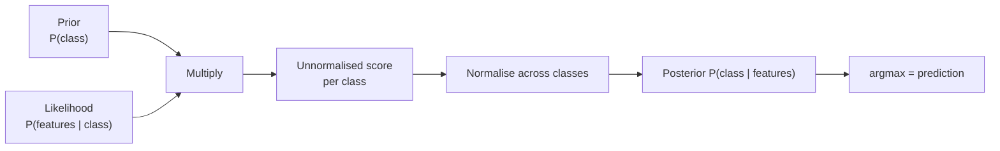

import DataCampExercise from "../../../../components/DataCampExercise.astro";
import AlgorithmCard from "../../../../components/AlgorithmCard.astro";
import Figure from "../../../../components/Figure.astro";
import Quiz from "../../../../components/Quiz.astro";

## What you'll learn

- Bayes' theorem, and the base-rate trap that catches almost everyone
- what exactly is **naive** about Naive Bayes, and why the model works anyway
- a complete spam classification computed **by hand**, matching scikit-learn to four decimals
- **Laplace smoothing** — the one line that stops a single unseen word zeroing everything
- why log-space arithmetic is mandatory, not an optimisation
- Gaussian, Multinomial, Bernoulli and Complement variants, and which to reach for

## Intuition

Every other classifier in this phase learns a boundary. Naive Bayes learns a **story about how the
data was generated**, then asks which story best explains each new observation.

The story: a class was chosen, and then the features were drawn from that class's distribution. To
classify, invert the story — given these features, which class most likely produced them? That
inversion is Bayes' theorem.

What makes it *naive* is one simplification: given the class, all features are assumed independent.
That is essentially always false. In text, "New" and "York" are wildly dependent. The model
survives anyway, for a reason worth understanding.



## The math

### Bayes' theorem

$$
P(A \mid B) = \frac{P(B \mid A)\,P(A)}{P(B)}
$$

For classification, with class $c$ and feature vector $\mathbf{x}$:

$$
P(c \mid \mathbf{x}) = \frac{P(\mathbf{x} \mid c)\,P(c)}{P(\mathbf{x})}
$$

$P(\mathbf{x})$ is identical for every class, so it cannot affect which class wins:

$$
\hat{y} = \operatorname*{arg\,max}_{c}\; P(c) \cdot P(\mathbf{x} \mid c)
$$

:::note[Where this comes from]
The derivation from the product rule, and the distinction between prior, likelihood, evidence and
posterior, is in
[Sum Rule, Product Rule, and Bayes Theorem](/mathematics-for-machine-learning/chapter-06---probability-and-distributions/sum-rule-product-rule-and-bayes-theorem/).
:::

### The naive assumption

$P(\mathbf{x} \mid c) = P(x_1, x_2, \ldots, x_n \mid c)$ is a joint distribution over every feature
combination. With 1,000 binary features that is $2^{1000}$ parameters — unlearnable from any
dataset. Assume conditional independence and the joint factorises into a product:

$$
P(\mathbf{x} \mid c) = \prod_{j=1}^{n} P(x_j \mid c)
$$

$$
\boxed{\;\hat{y} = \operatorname*{arg\,max}_{c}\; P(c)\prod_{j=1}^{n} P(x_j \mid c)\;}
$$

The parameter count collapses from exponential to linear. That is the entire trade: an assumption
that is false, in exchange for a model that can actually be fitted — in one pass over the data,
with no optimisation at all.

### Why being wrong does not matter much

Naive Bayes usually produces **badly calibrated probabilities** and **surprisingly good
classifications**. The two facts share a cause.

When features are correlated, multiplying their likelihoods double-counts the same evidence, so the
posterior is pushed toward 0 or 1 far harder than the data justifies — outputs of 0.9999 are
routine and rarely mean what they say. But classification only needs the *arg max*. Overstating the
winning class's score does not change which class wins. The ranking survives even when the numbers
do not.

<Figure
  src="/images/ml/phase-04-classification/naive-bayes/independence-assumption"
  alt="Two panels of the same strongly correlated two-class data. Left, Gaussian Naive Bayes draws an axis-aligned boundary; right, QDA models the covariance and draws a tilted one. Both classify almost identically well."
  title="Features correlated at 0.92, and it barely matters"
  caption="Naive Bayes fits axis-aligned ellipses and cannot represent the tilt. QDA models the covariance properly. The boundaries differ visibly; the accuracies barely do."
/>

## Worked example by hand: the base-rate trap

Before the classifier, the intuition pump. A disease affects 1% of people. A test detects it 99% of
the time and has a 5% false-positive rate. You test positive. What is the probability you have it?

**Step 1 — write down what is known.**

$$
P(D) = 0.01,\quad P(+ \mid D) = 0.99,\quad P(+ \mid \neg D) = 0.05
$$

**Step 2 — total probability of a positive test.**

$$
P(+) = P(+ \mid D)P(D) + P(+ \mid \neg D)P(\neg D) = (0.99)(0.01) + (0.05)(0.99) = 0.0099 + 0.0495 = 0.0594
$$

**Step 3 — invert.**

$$
P(D \mid +) = \frac{(0.99)(0.01)}{0.0594} = \frac{0.0099}{0.0594} = 0.1667
$$

**About one in six.** Most people guess 95% or higher. The reason is the base rate: healthy people
outnumber sick ones 99 to 1, so even a 5% error rate among them produces five times more false
positives than there are true positives. The prior is doing most of the work, and this is exactly
what Naive Bayes formalises.

### See it move

The arithmetic is three lines, so the useful thing to vary is the inputs. The sketch lays out 2,000
people as a grid, colours them by true status and test result, and reports $P(D \mid +)$ as the
prevalence sweeps. The posterior is not a property of the test — it moves by more than a factor of
ten while the test's own numbers never change.

```p5 title="The same test, four different answers" desc="Two thousand people shown as a grid of squares, coloured as true positives, false positives, and everyone who tested negative. Prevalence sweeps from 0.1 percent to 20 percent while sensitivity and specificity stay fixed; the posterior probability of disease given a positive test tracks the prevalence, not the test. Click to pause." height="420"
const PEOPLE = 2000;
const SENS = 0.99;
const FPR = 0.05;
let prev = 0.01;
let dir = 1;
let paused = false;

function setup() {
  createCanvas(620, 420);
  textFont("monospace");
}
function draw() {
  background(13, 17, 23);

  const sick = Math.max(1, Math.round(PEOPLE * prev));
  const well = PEOPLE - sick;
  const tp = Math.round(sick * SENS);
  const fn = sick - tp;
  const fp = Math.round(well * FPR);
  const tn = well - fp;
  const posterior = tp + fp > 0 ? tp / (tp + fp) : 0;

  fill(215);
  textSize(13);
  textAlign(LEFT, TOP);
  text("prevalence " + (100 * prev).toFixed(2) + "%      sensitivity 99%      false-positive rate 5%", 30, 14);

  // grid of people: TP first, then FP, then FN, then TN
  const cols = 80, size = 7;
  for (let i = 0; i < PEOPLE; i++) {
    const gx = 30 + (i % cols) * size;
    const gy = 48 + Math.floor(i / cols) * size;
    let col;
    if (i < tp) col = color(120, 200, 120);
    else if (i < tp + fp) col = color(232, 122, 122);
    else if (i < tp + fp + fn) col = color(255, 176, 67);
    else col = color(38, 44, 52);
    noStroke();
    fill(col);
    rect(gx, gy, size - 1.2, size - 1.2);
  }

  const legendY = 48 + Math.ceil(PEOPLE / cols) * size + 14;
  const items = [
    ["true positives  " + tp, [120, 200, 120]],
    ["false positives " + fp, [232, 122, 122]],
    ["missed cases    " + fn, [255, 176, 67]],
    ["tested negative " + tn, [70, 78, 88]],
  ];
  for (let i = 0; i < items.length; i++) {
    const [label, c] = items[i];
    fill(c[0], c[1], c[2]);
    rect(30, legendY + i * 17, 9, 9);
    fill(160);
    textSize(11);
    textAlign(LEFT, TOP);
    text(label, 46, legendY + i * 17 - 1);
  }

  // posterior bar
  const bx = 300, bw = 280;
  fill(150);
  textSize(11);
  textAlign(LEFT, TOP);
  text("P(disease | positive test)", bx, legendY - 2);
  noStroke();
  fill(30, 36, 44);
  rect(bx, legendY + 16, bw, 18);
  fill(120, 200, 120);
  rect(bx, legendY + 16, posterior * bw, 18);
  fill(235);
  textSize(14);
  textAlign(LEFT, CENTER);
  text(posterior.toFixed(4), bx + 6, legendY + 25);
  fill(105);
  textSize(10);
  textAlign(LEFT, TOP);
  text("out of every " + (tp + fp) + " positive results, " + fp + " are wrong", bx, legendY + 40);
  text(paused ? "click to resume" : "click to pause", bx, legendY + 58);

  if (!paused) {
    prev = Math.exp(Math.log(prev) + 0.005 * dir);
    if (prev > 0.2 || prev < 0.001) dir *= -1;
    prev = constrain(prev, 0.001, 0.2);
  }
}
function mousePressed() { paused = !paused; }
```

Four readings from the same test, all computed with the same three numbers:

| Prevalence | True positives | False positives | $P(D \mid +)$ |
| --- | --- | --- | --- |
| 0.1% | 2 | 100 | **0.0196** |
| 1% | 20 | 99 | 0.1681 |
| 5% | 99 | 95 | 0.5103 |
| 20% | 396 | 80 | **0.8319** |

Nothing about the test changed between the first row and the last, and its answer went from "almost
certainly a false alarm" to "probably real". This is why a screening tool validated on a
high-prevalence clinical population misbehaves when it is rolled out to the general population, and
why `predict_proba` from a model trained on resampled data cannot be read as a probability until the
prior is put back.

## Worked example by hand: a spam filter

Six training documents, three of each class.

| Class | Documents |
| --- | --- |
| spam | "win money now" · "cheap money offer" · "win big prize money" |
| ham | "meeting at noon" · "project meeting notes" · "lunch meeting notes" |

**Step 1 — vocabulary and counts.** The vocabulary has $V = 13$ distinct words.

| | spam count | ham count |
| --- | --- | --- |
| win | 2 | 0 |
| money | 3 | 0 |
| now | 1 | 0 |
| cheap | 1 | 0 |
| offer | 1 | 0 |
| big | 1 | 0 |
| prize | 1 | 0 |
| meeting | 0 | 3 |
| at | 0 | 1 |
| noon | 0 | 1 |
| project | 0 | 1 |
| notes | 0 | 2 |
| lunch | 0 | 1 |
| **total words** | **10** | **9** |

**Step 2 — priors.** Three documents each, so $P(\text{spam}) = P(\text{ham}) = 0.5$.

**Step 3 — likelihoods with Laplace smoothing.** Add 1 to every count so nothing is impossible:

$$
P(w \mid c) = \frac{\text{count}(w, c) + \alpha}{N_c + \alpha V}, \qquad \alpha = 1
$$

Classify the new document **"cheap prize money"**:

$$
P(\text{cheap} \mid \text{spam}) = \frac{1+1}{10+13} = \frac{2}{23}
\quad
P(\text{prize} \mid \text{spam}) = \frac{2}{23}
\quad
P(\text{money} \mid \text{spam}) = \frac{3+1}{23} = \frac{4}{23}
$$

$$
P(\text{cheap} \mid \text{ham}) = \frac{0+1}{9+13} = \frac{1}{22}
\quad
P(\text{prize} \mid \text{ham}) = \frac{1}{22}
\quad
P(\text{money} \mid \text{ham}) = \frac{1}{22}
$$

**Step 4 — multiply.**

$$
\text{score}_{\text{spam}} = 0.5 \times \frac{2}{23}\times\frac{2}{23}\times\frac{4}{23}
= 0.5 \times \frac{16}{12167} = 6.575\times10^{-4}
$$

$$
\text{score}_{\text{ham}} = 0.5 \times \left(\frac{1}{22}\right)^{3}
= 0.5 \times \frac{1}{10648} = 4.696\times10^{-5}
$$

**Step 5 — normalise.**

$$
P(\text{spam} \mid \text{doc}) = \frac{6.575\times10^{-4}}{6.575\times10^{-4} + 4.696\times10^{-5}} = 0.9333
$$

`MultinomialNB` on the same six documents returns `[0.0667, 0.9333]` — the hand calculation to four
decimal places.

:::caution[Without smoothing this breaks completely]
"cheap" never appears in a ham document, so the unsmoothed $P(\text{cheap} \mid \text{ham}) = 0$.
One zero in the product makes the entire ham score zero, and the model becomes *certain* the
document is spam on the strength of one unseen word. Laplace smoothing (`alpha=1`) is the default
in scikit-learn for exactly this reason. Set `alpha=0` and you will eventually hit it.
:::

## Log space is mandatory

Multiplying hundreds of probabilities underflows to zero in floating point. A 300-word document
with typical word probabilities around $10^{-4}$ produces $10^{-1200}$, and float64 bottoms out
near $10^{-308}$.

Take logarithms and products become sums:

$$
\log P(c \mid \mathbf{x}) \propto \log P(c) + \sum_{j=1}^{n} \log P(x_j \mid c)
$$

The arg max is unchanged, because the logarithm is monotonic. Every real implementation, including
scikit-learn's `predict_log_proba`, works this way. This is not an optimisation — without it, long
documents produce zero for every class and the classifier returns whichever comes first.

## The Gaussian variant

For continuous features, model each feature within each class as a normal distribution, estimating
$\mu_{jc}$ and $\sigma_{jc}$ from the training data:

$$
P(x_j \mid c) = \frac{1}{\sqrt{2\pi\sigma_{jc}^{2}}}\exp\left(-\frac{(x_j - \mu_{jc})^2}{2\sigma_{jc}^{2}}\right)
$$

Fitting is just computing a mean and a variance per feature per class — one pass, no iteration, no
hyperparameters.

<Figure
  src="/images/ml/phase-04-classification/naive-bayes/class-conditionals"
  alt="Two bell curves for two classes on one feature axis, with a green vertical line marking where the prior-weighted densities cross, plus a rising posterior curve on a second axis."
  title="What GaussianNB actually stores"
  caption="Two numbers per class per feature. The boundary sits where prior times likelihood is equal for both classes — not where the curves themselves cross, because the priors differ."
/>

### Reading the plot

- **The boundary is not the midpoint of the two means.** Class 0 has the higher prior (0.6), which
  pushes the crossing point toward class 1's territory.
- **The posterior curve is a sigmoid.** For two Gaussians with equal variance, Gaussian Naive Bayes
  produces exactly the logistic function — the same S-curve as logistic regression, reached from
  entirely different assumptions.
- **The shape is decided by the variances**, which is what makes this a *generative* model: it can
  also sample new data, something logistic regression cannot do.

## Choosing a variant

| Variant | Feature type | Classic use | scikit-learn |
| --- | --- | --- | --- |
| **Gaussian** | Continuous | Sensor readings, measurements | `GaussianNB` |
| **Multinomial** | Counts | Word counts, TF-IDF | `MultinomialNB` |
| **Bernoulli** | Binary | Word present / absent, short texts | `BernoulliNB` |
| **Complement** | Counts, imbalanced | Text with very uneven class sizes | `ComplementNB` |
| **Categorical** | Discrete categories | Survey answers, encoded categoricals | `CategoricalNB` |

`ComplementNB` is worth knowing: it estimates each class's parameters from the *complement* of that
class, which corrects the bias `MultinomialNB` develops when one class dominates the corpus.

```python title="text_classification.py" showLineNumbers{1}
from sklearn.feature_extraction.text import CountVectorizer
from sklearn.naive_bayes import MultinomialNB

docs = [
    "win money now", "cheap money offer", "win big prize money",
    "meeting at noon", "project meeting notes", "lunch meeting notes",
]
labels = [1, 1, 1, 0, 0, 0]        # 1 = spam

vectoriser = CountVectorizer()
X = vectoriser.fit_transform(docs)
print(f"vocabulary size: {len(vectoriser.vocabulary_)}")   # 13

model = MultinomialNB(alpha=1.0).fit(X, labels)

test = vectoriser.transform(["cheap prize money"])
print(model.predict_proba(test).round(4))    # [[0.0667 0.9333]]
print(model.predict(test))                   # [1]
```

Identical to the hand calculation, which is the point of doing both.

```python title="gaussian_nb.py" showLineNumbers{1}
from sklearn.datasets import load_breast_cancer
from sklearn.model_selection import train_test_split
from sklearn.naive_bayes import GaussianNB

X, y = load_breast_cancer(return_X_y=True)
y = 1 - y
X_tr, X_te, y_tr, y_te = train_test_split(
    X, y, test_size=0.3, random_state=0, stratify=y
)

model = GaussianNB().fit(X_tr, y_tr)

print(f"test accuracy {model.score(X_te, y_te):.4f}")   # 0.9123
print(f"class priors  {model.class_prior_.round(4)}")   # [0.6281 0.3719]
print(f"parameters stored: {model.theta_.shape}")       # (2, 30) means + variances
```

91% accuracy on 30 correlated medical features, from a model that assumes they are all independent
and that trains in a single pass. Logistic regression reaches 95% on the same split — better, but
it needed an iterative solver and scaling to get there.

<AlgorithmCard
  name="Naive Bayes"
  type="Supervised · Classification · Generative"
  sklearn="sklearn.naive_bayes.GaussianNB / MultinomialNB / BernoulliNB / ComplementNB"
  assumptions={[
    "Features are conditionally independent given the class — almost always false, and usually survivable",
    "The chosen likelihood matches the data: Gaussian for continuous, multinomial for counts",
    "Training class frequencies reflect the deployment priors, unless you override them",
  ]}
  complexity={{ train: "O(m·n) — one pass", predict: "O(n·K)", memory: "O(n·K)" }}
  notation="m = samples, n = features, K = classes"
  hyperparams={[
    { name: "alpha", default: "1.0", effect: "Laplace/Lidstone smoothing for the count-based variants. Never set it to 0 unless every word is guaranteed to appear in every class." },
    { name: "fit_prior", default: "True", effect: "Estimate class priors from the training data. Set False for a uniform prior when training frequencies are an artefact of collection." },
    { name: "class_prior", default: "None", effect: "Supply real-world priors directly — valuable when the training set was deliberately balanced but production is not." },
    { name: "var_smoothing", default: "1e-9 (GaussianNB)", effect: "Added to every variance for stability. Raise it if a feature is near-constant within a class." },
  ]}
  useWhen={[
    "Text classification — it remains a genuinely strong baseline",
    "Very high-dimensional sparse data",
    "You need a model trained in seconds on millions of rows",
    "Data arrives in a stream — partial_fit supports online updates",
  ]}
  avoidWhen={[
    "You need well-calibrated probabilities",
    "Features are strongly dependent and you need the boundary to reflect it",
    "There are few features and plenty of data — a discriminative model will beat it",
    "Continuous features are strongly non-Gaussian and cannot be transformed",
  ]}
/>

## Pitfalls

:::danger[`alpha=0` and the zero-frequency problem]
One unseen word makes the entire product zero for that class, and the model becomes certain on the
strength of a single token. Keep `alpha=1`, or tune it in the range 0.01 to 1 — never zero.
:::

:::caution[The probabilities are not trustworthy]
Correlated features double-count evidence, so posteriors get pushed to 0.9999 and 0.0001 far too
readily. Fine for ranking or arg max, unsafe for anything that consumes the number itself. Wrap in
`CalibratedClassifierCV` if you need honest probabilities.
:::

:::caution[Match the variant to the data]
`GaussianNB` on word counts assumes counts are normally distributed, which they are not — counts
are non-negative, integer, and heavily skewed. `MultinomialNB` on standardised continuous features
fails too, since it expects non-negative values. Choosing the wrong variant is the most common
Naive Bayes bug.
:::

:::caution[Training priors may not be deployment priors]
If you balanced the training set by downsampling the majority class, the learned priors are wrong
for production. Pass real-world priors via `class_prior`, or set `fit_prior=False`.
:::

## Compare

| Model | Type | Training cost | Probabilities | Handles correlated features |
| --- | --- | --- | --- | --- |
| **Naive Bayes** | Generative | One pass, $O(m \cdot n)$ | Poorly calibrated | Assumes they are not |
| Logistic Regression | Discriminative | Iterative | Well calibrated | Yes |
| Linear SVM | Discriminative | Quadratic program | Needs Platt scaling | Yes |
| Random Forest | Discriminative | Moderate | Reasonable | Yes |

The generative/discriminative distinction is the deep one. Naive Bayes models
$P(\mathbf{x} \mid c)$ and can therefore generate new samples; logistic regression models
$P(c \mid \mathbf{x})$ directly and cannot. Modelling less is usually the better bet for pure
classification accuracy — but it costs you the ability to ask "what does a typical spam email look
like?"

<Quiz
  questions={[
    {
      q: "A disease affects 1% of people. A test is 99% sensitive with a 5% false-positive rate. You test positive. Roughly what is the probability you have the disease?",
      options: ["99%", "95%", "17%", "1%"],
      answer: 2,
      explain: "P(D|+) = 0.0099 / 0.0594 = 0.167, about one in six. Healthy people outnumber sick ones 99 to 1, so 5% of them produces five times more false positives than there are true positives.",
    },
    {
      q: "What exactly is 'naive' about Naive Bayes?",
      options: [
        "It uses a very simple optimisation algorithm",
        "It assumes every feature is independent of the others given the class, which collapses an exponential joint distribution into a product",
        "It assumes all classes are equally likely",
        "It assumes the data is Gaussian",
      ],
      answer: 1,
      explain: "Conditional independence reduces the parameter count from exponential to linear in the feature count. The assumption is nearly always false and the model usually works regardless.",
    },
    {
      q: "Why must Naive Bayes be computed in log space?",
      options: [
        "To make the code shorter",
        "Because multiplying hundreds of small probabilities underflows to zero in floating point, while summing their logarithms does not",
        "Because logarithms make the model more accurate",
        "Because scikit-learn requires it",
      ],
      answer: 1,
      explain: "A 300-word document gives products around 1e-1200, far below float64's limit near 1e-308. Logs turn the product into a sum and preserve the arg max exactly.",
    },
    {
      q: "Your Naive Bayes model classifies well but outputs 0.9999 for almost every prediction. What is going on?",
      options: [
        "The model is genuinely that confident and should be trusted",
        "Correlated features double-count the same evidence, inflating the posterior — the ranking is fine but the numbers are not",
        "The training data is corrupted",
        "You need more smoothing",
      ],
      answer: 1,
      explain: "Multiplying likelihoods of dependent features counts shared evidence repeatedly, saturating the posterior. Classification is unaffected because only the arg max matters; the probabilities need calibration before use.",
    },
  ]}
/>

## 🧪 Try It Yourself

### Exercise 1 – Apply Bayes' theorem

<DataCampExercise
  lang="python"
  hint={`The denominator is P(+|D)P(D) + P(+|not D)P(not D).`}
  code={`# Task: Exercise 1 - Apply Bayes' theorem
p_disease = 0.01
p_pos_given_disease = 0.99
p_pos_given_healthy = 0.05

p_pos = (p_pos_given_disease * p_disease
         + p_pos_given_healthy * (1 - ___))    # replace ___ with p_disease
posterior = p_pos_given_disease * p_disease / p_pos

print("P(positive):", round(p_pos, 4))
print("P(disease | positive):", round(posterior, 4))

# -- Expected Output -------------------------------------------
# P(positive): 0.0594
# P(disease | positive): 0.1667
# --------------------------------------------------------------`}
  solution={`p_disease = 0.01
p_pos_given_disease = 0.99
p_pos_given_healthy = 0.05
p_pos = (p_pos_given_disease * p_disease
         + p_pos_given_healthy * (1 - p_disease))
posterior = p_pos_given_disease * p_disease / p_pos
print("P(positive):", round(p_pos, 4))
print("P(disease | positive):", round(posterior, 4))`}
  sct={`test_output_contains("0.1667")
success_msg("About one in six — the base rate dominates the test's accuracy.")`}
  height={178}
/>

### Exercise 2 – Laplace-smoothed likelihoods

<DataCampExercise
  hint={`Add alpha to the count and alpha times the vocabulary size to the denominator.`}
  lang="python"
  code={`# Task: Exercise 2 - Laplace-smoothed likelihoods
V = 13          # vocabulary size
alpha = 1

def likelihood(count, total, alpha=1, V=13):
    return (count + alpha) / (total + alpha * ___)   # replace ___ with V

print("P(cheap|spam):", round(likelihood(1, 10), 4))
print("P(money|spam):", round(likelihood(3, 10), 4))
print("P(cheap|ham) :", round(likelihood(0, 9), 4))

# -- Expected Output -------------------------------------------
# P(cheap|spam): 0.087
# P(money|spam): 0.1739
# P(cheap|ham) : 0.0455
# --------------------------------------------------------------`}
  solution={`V = 13
alpha = 1

def likelihood(count, total, alpha=1, V=13):
    return (count + alpha) / (total + alpha * V)

print("P(cheap|spam):", round(likelihood(1, 10), 4))
print("P(money|spam):", round(likelihood(3, 10), 4))
print("P(cheap|ham) :", round(likelihood(0, 9), 4))`}
  sct={`test_output_contains("P(cheap|ham) : 0.0455")
success_msg("A word never seen in ham still gets a non-zero probability — that is what smoothing buys.")`}
  height={188}
/>

### Exercise 3 – Classify the document by hand

<DataCampExercise
  lang="python"
  hint={`Multiply the prior by all three likelihoods, then normalise across the two classes.`}
  code={`# Task: Exercise 3 - Classify the document by hand
spam = 0.5 * (2 / 23) * (2 / 23) * (4 / 23)
ham = 0.5 * (1 / 22) * (1 / 22) * (1 / 22)

p_spam = spam / (spam + ___)          # replace ___ with ham

print("spam score:", f"{spam:.3e}")
print("ham score:", f"{ham:.3e}")
print("P(spam | doc):", round(p_spam, 4))

# -- Expected Output -------------------------------------------
# spam score: 6.575e-04
# ham score: 4.696e-05
# P(spam | doc): 0.9333
# --------------------------------------------------------------`}
  solution={`spam = 0.5 * (2 / 23) * (2 / 23) * (4 / 23)
ham = 0.5 * (1 / 22) * (1 / 22) * (1 / 22)
p_spam = spam / (spam + ham)
print("spam score:", f"{spam:.3e}")
print("ham score:", f"{ham:.3e}")
print("P(spam | doc):", round(p_spam, 4))`}
  sct={`test_output_contains("P(spam | doc): 0.9333")
success_msg("Exactly what MultinomialNB returns for the same six documents.")`}
  height={178}
/>

### Exercise 4 – Reproduce it with scikit-learn

<DataCampExercise
  lang="python"
  hint={`CountVectorizer builds the word-count matrix that MultinomialNB expects.`}
  code={`# Task: Exercise 4 - Reproduce it with scikit-learn
from sklearn.feature_extraction.text import CountVectorizer
from sklearn.naive_bayes import ___          # replace ___ with MultinomialNB

docs = ["win money now", "cheap money offer", "win big prize money",
        "meeting at noon", "project meeting notes", "lunch meeting notes"]
labels = [1, 1, 1, 0, 0, 0]

vec = CountVectorizer()
X = vec.fit_transform(docs)
model = MultinomialNB(alpha=1.0).fit(X, labels)

test = vec.transform(["cheap prize money"])
print("vocabulary:", len(vec.vocabulary_))
print("proba:", model.predict_proba(test).round(4))

# -- Expected Output -------------------------------------------
# vocabulary: 13
# proba: [[0.0667 0.9333]]
# --------------------------------------------------------------`}
  solution={`from sklearn.feature_extraction.text import CountVectorizer
from sklearn.naive_bayes import MultinomialNB

docs = ["win money now", "cheap money offer", "win big prize money",
        "meeting at noon", "project meeting notes", "lunch meeting notes"]
labels = [1, 1, 1, 0, 0, 0]
vec = CountVectorizer()
X = vec.fit_transform(docs)
model = MultinomialNB(alpha=1.0).fit(X, labels)
test = vec.transform(["cheap prize money"])
print("vocabulary:", len(vec.vocabulary_))
print("proba:", model.predict_proba(test).round(4))`}
  sct={`test_output_contains("0.9333")
success_msg("Hand calculation and library agree to four decimal places.")`}
  height={198}
/>

### Exercise 5 – Watch a product underflow

<DataCampExercise
  lang="python"
  hint={`Compare multiplying many small probabilities against summing their logarithms.`}
  code={`# Task: Exercise 5 - Watch a product underflow
import numpy as np

probs = np.full(400, 1e-4)      # a 400-word document

product = np.prod(probs)
log_sum = np.___(probs).sum()   # replace ___ with log

print("product:", product)
print("log sum:", round(float(log_sum), 2))
print("product underflowed:", product == 0.0)

# -- Expected Output -------------------------------------------
# product: 0.0
# log sum: -3684.14
# product underflowed: True
# --------------------------------------------------------------`}
  solution={`import numpy as np

probs = np.full(400, 1e-4)
product = np.prod(probs)
log_sum = np.log(probs).sum()
print("product:", product)
print("log sum:", round(float(log_sum), 2))
print("product underflowed:", product == 0.0)`}
  sct={`test_output_contains("product underflowed: True")
success_msg("Every real implementation works in log space for exactly this reason.")`}
  height={188}
/>

## Recap

- Bayes' theorem inverts $P(\mathbf{x} \mid c)$ into $P(c \mid \mathbf{x})$; the evidence term is
  the same for all classes and drops out.
- The naive assumption factorises the joint likelihood into a product, collapsing the parameter
  count from exponential to linear.
- The base-rate example: 99% sensitivity, 5% false positives, 1% prevalence gives
  $P(D \mid +) = 0.167$.
- The hand-worked spam filter gives $P(\text{spam}) = 0.9333$, matching `MultinomialNB` exactly.
- Laplace smoothing prevents one unseen word from zeroing a whole class; log space prevents
  underflow.
- Probabilities are poorly calibrated because correlated features double-count evidence — but the
  arg max, and therefore the classification, survives.
- Match the variant to the data: Gaussian for continuous, Multinomial for counts, Bernoulli for
  presence/absence, Complement for imbalanced text.

### Exercise 6 – The same test, four populations

<DataCampExercise
  lang="python"
  hint={`Count people rather than juggling probabilities: true positives are sick * sensitivity, false positives are well * false-positive rate.`}
  code={`# Task: Exercise 6 - The same test, four populations
sensitivity, false_positive_rate = 0.99, 0.05
people = 2000

print(f"{'prevalence':>11} {'TP':>5} {'FP':>5} {'P(D|+)':>8}")
for prevalence in (0.001, 0.01, 0.05, 0.20):
    sick = max(1, round(people * prevalence))
    well = people - sick
    tp = round(sick * sensitivity)
    fp = round(well * ___)                  # replace ___ with false_positive_rate
    print(f"{prevalence:11.3f} {tp:5d} {fp:5d} {tp / (tp + fp):8.4f}")
print("the test never changed: sensitivity 0.99, false-positive rate 0.05")

# -- Expected Output -------------------------------------------
#  prevalence    TP    FP   P(D|+)
#       0.001     2   100   0.0196
#       0.010    20    99   0.1681
#       0.050    99    95   0.5103
#       0.200   396    80   0.8319
# the test never changed: sensitivity 0.99, false-positive rate 0.05
# --------------------------------------------------------------`}
  solution={`sensitivity, false_positive_rate = 0.99, 0.05
people = 2000

print(f"{'prevalence':>11} {'TP':>5} {'FP':>5} {'P(D|+)':>8}")
for prevalence in (0.001, 0.01, 0.05, 0.20):
    sick = max(1, round(people * prevalence))
    well = people - sick
    tp = round(sick * sensitivity)
    fp = round(well * false_positive_rate)
    print(f"{prevalence:11.3f} {tp:5d} {fp:5d} {tp / (tp + fp):8.4f}")
print("the test never changed: sensitivity 0.99, false-positive rate 0.05")`}
  sct={`test_output_contains("0.0196")
success_msg("A factor of 42 in the posterior, from 0.0196 to 0.8319, with the test's own numbers fixed. This is why a screening tool validated in a clinic misbehaves in a general population, and why resampled training data breaks predict_proba until the prior is restored.")`}
  height={280}
/>

## Next

Continue to
[Evaluation Metrics - Confusion Matrix](/machine-learning/phase-04---supervised-learning---classification/evaluation-metrics-confusion-matrix/)
— every classifier in this phase is now built, and the next four pages are about telling honestly
how well they work.
