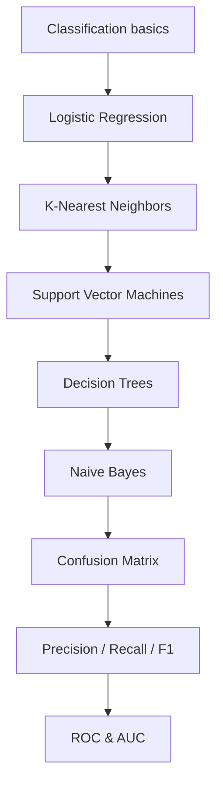

## What classification is

**Classification** predicts a **category** (class label) instead of a number.

Examples:

- spam vs not spam
- fraud vs normal
- cat vs dog
- churn vs not churn

*Hands-On Machine Learning* (Géron) introduces classification with the MNIST
handwritten-digit dataset — 70,000 labeled images that are often called the "hello
world" of Machine Learning. This phase follows that same chapter (3), plus the
logistic/softmax half of Chapter 4, all of Chapter 5 (SVMs), and all of Chapter 6
(Decision Trees).

## What you'll learn

- how classification differs from regression, and why accuracy alone can lie to you
- **Logistic Regression** — sigmoid, log loss, and Softmax for multiple classes
- **K-Nearest Neighbors** — classifying by neighborhood vote
- **Support Vector Machines** — max-margin boundaries and the kernel trick
- **Decision Trees** — CART splits, Gini impurity vs entropy
- **Naïve Bayes** — a fast probabilistic baseline, especially for text
- how to evaluate with a confusion matrix, precision/recall/F1, and ROC/AUC

## Phase 4 map

## A note on metrics

Many classification datasets are imbalanced — think fraud detection, where maybe 1%
of transactions are fraudulent. A classifier that always predicts "not fraud" can score
over 99% accuracy while being completely useless. This is exactly the trap Géron walks
through with a "never guess 5" classifier on MNIST: it hits over 90% accuracy while
never detecting a single 5.

That's why this phase spends real time on the confusion matrix, precision, recall, F1,
and ROC/AUC — metrics built for exactly this kind of skewed, real-world data.

:::tip[From the book]
Géron's rule of thumb: prefer the **precision-recall curve** when the positive class is
rare or false positives matter most; prefer the **ROC curve** otherwise. A model can
look great on ROC-AUC purely because negatives dominate the dataset — the PR curve is
what exposes that.
:::
