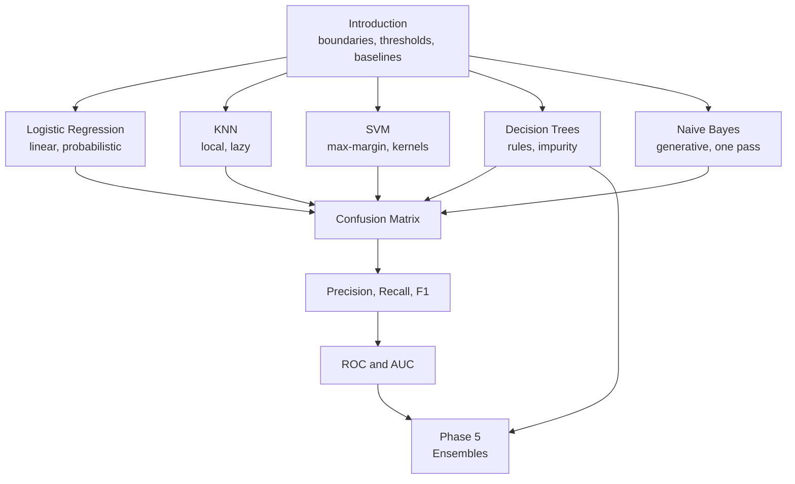

import Quiz from "../../../../components/Quiz.astro";

Phase 3 predicted numbers. This phase predicts labels, and that one change breaks accuracy as a
metric, breaks squared error as a loss, and opens up a family of models with completely different
ideas about what a decision boundary should look like.

Half of this phase is algorithms. The other half — the last four pages — is evaluation, and it is
the half people skip and later regret. A classifier with 98% accuracy that never finds a single
fraudulent transaction is a real thing that ships, repeatedly.

## What this phase covers

Nine pages: five classifiers, then four ways of judging them.

| # | Page | Core idea | Worked result |
| --- | --- | --- | --- |
| 1 | [Introduction to Classification](/machine-learning/phase-04---supervised-learning---classification/introduction-to-classification/) | Boundaries, probabilities, thresholds, the accuracy paradox | 0.98 accuracy, 0.00 recall |
| 2 | [Logistic Regression](/machine-learning/phase-04---supervised-learning---classification/logistic-regression-binary-vs-multiclass/) | Model the log-odds; the sigmoid falls out | cost 0.3377, gradient −0.2312 |
| 3 | [K-Nearest Neighbors](/machine-learning/phase-04---supervised-learning---classification/k-nearest-neighbors-knn/) | No training; vote among the closest | $k$ flips the answer at 5 |
| 4 | [Support Vector Machines](/machine-learning/phase-04---supervised-learning---classification/support-vector-machines-svm/) | Widest corridor; only support vectors matter | $\mathbf{w} = (0.5, 0.5)$, margin 2.828 |
| 5 | [Decision Trees](/machine-learning/phase-04---supervised-learning---classification/decision-trees-entropy-and-gini-impurity/) | Split to reduce impurity | root Gini 0.667, gain 0.333 |
| 6 | [Naive Bayes](/machine-learning/phase-04---supervised-learning---classification/naïve-bayes-classifier/) | Invert Bayes; assume independence | $P(\text{spam}) = 0.9333$ |
| 7 | [Confusion Matrix](/machine-learning/phase-04---supervised-learning---classification/evaluation-metrics-confusion-matrix/) | The four cells everything is built from | TP 4, FP 2, FN 1, TN 3 |
| 8 | [Precision, Recall, F1](/machine-learning/phase-04---supervised-learning---classification/precision-recall-and-f1-score/) | The trade-off, and the harmonic mean | 0.667, 0.800, $F_1$ 0.727 |
| 9 | [ROC Curve and AUC](/machine-learning/phase-04---supervised-learning---classification/the-roc-curve-and-auc/) | Ranking quality across all thresholds | AUC 0.84 from 21/25 pairs |

## The path through

The five algorithms are largely independent — read them in any order. The four evaluation pages are
strictly sequential, because each is built on the one before: the matrix defines the cells,
precision and recall are ratios of them, and ROC sweeps those ratios across every threshold.

## The five classifiers at a glance

| Model | Boundary | Needs scaling | Probabilities | Training | Prediction |
| --- | --- | --- | --- | --- | --- |
| Logistic Regression | Linear | Yes | Calibrated | Iterative | Instant |
| KNN | Arbitrarily local | Critically | Coarse | None | Slow |
| SVM (RBF) | Smooth, non-linear | Critically | Needs Platt scaling | Slow | Fast |
| Decision Tree | Axis-aligned steps | No | Coarse | Fast | Instant |
| Naive Bayes | From densities | No | Poorly calibrated | One pass | Instant |

No row dominates. The choice comes from what the problem needs: interpretability points at logistic
regression or a shallow tree; a smooth non-linear boundary on a small dataset points at an SVM;
text with tens of thousands of features points at Naive Bayes or a linear SVM.

## One dataset, throughout

Two examples recur so the numbers stay comparable across all nine pages:

- **The ten-row example** — five spam and five legitimate emails with model scores. At threshold
  0.5 it yields TP 4, FP 2, FN 1, TN 3, and every metric in the evaluation half is computed from
  those four numbers by hand.
- **Breast cancer (569 patients, 30 features)** — relabelled so that 1 = malignant, because a page
  about catching disease should have "positive" mean "has the disease". Logistic regression reaches
  0.953 accuracy and 0.992 AUC on a held-out third.

## Before you start

- **[Phase 3](/machine-learning/phase-03---supervised-learning---regression/phase-3---supervised-learning---regression/)** —
  logistic regression is the linear model with a squashing function on the end, and gradient descent
  is unchanged.
- **Probability basics** —
  [Sum Rule, Product Rule, and Bayes Theorem](/mathematics-for-machine-learning/chapter-06---probability-and-distributions/sum-rule-product-rule-and-bayes-theorem/)
  for Naive Bayes,
  [Gaussian Distribution](/mathematics-for-machine-learning/chapter-06---probability-and-distributions/gaussian-distribution/)
  for its Gaussian variant.
- **Norms and distances** —
  [Norms](/mathematics-for-machine-learning/chapter-03---analytic-geometry/norms/)
  and
  [Lengths and Distances](/mathematics-for-machine-learning/chapter-03---analytic-geometry/lengths-and-distances/)
  underpin both KNN and the SVM margin.

## What you'll be able to do afterwards

1. Derive the sigmoid from log-odds and explain why log loss pairs with it.
2. Choose between five classifiers on the basis of boundary shape, scaling needs, dataset size and
   interpretability — not on habit.
3. Compute Gini impurity and information gain by hand, and say why a tree needs no scaling.
4. Read a confusion matrix in either orientation and derive six metrics from its four cells.
5. Choose a threshold from a stated requirement rather than accepting 0.5.
6. Say which of ROC-AUC and average precision is appropriate, and defend the choice with the
   positive rate.

## How long it takes

| Activity | Time |
| --- | --- |
| Reading the nine pages | 4–5 hours |
| Working the hand examples on paper | 2–3 hours |
| Running the code and the 45 exercises | 4–5 hours |
| The practice project below | 4–6 hours |
| **Total** | **14–19 hours** |

## Practice project

**Build a credit-card fraud detector.** Fetch a genuinely imbalanced dataset — `fetch_openml`
serves several with positive rates near 0.2% — and work through it in this order:

1. Compute the positive rate and the `DummyClassifier` accuracy. Write both down before modelling.
2. Fit logistic regression, a random forest and Naive Bayes with the same pipeline and split.
3. Report ROC-AUC **and** average precision for each. Note how differently they rank the models.
4. Pick the best by average precision, then choose a threshold from a business requirement — for
   example "the review team can handle 200 alerts a day".
5. Print the confusion matrix at that threshold and translate it into a sentence: how many frauds
   caught, how many missed, how many analyst-hours spent on false alarms.
6. Try `class_weight="balanced"` and report whether it actually helped, using the same metric.

Step 5 is the deliverable. A confusion matrix at a justified threshold, described in the language of
the business, is what a finished classification project looks like.

<Quiz
  questions={[
    {
      q: "Which four pages must be read in order?",
      options: [
        "The five algorithm pages",
        "The four evaluation pages — each metric is built from the definitions of the one before",
        "None; order never matters",
        "Only the first and last",
      ],
      answer: 1,
      explain: "The confusion matrix defines the cells, precision and recall are ratios of those cells, F1 combines them, and ROC sweeps them across every threshold.",
    },
    {
      q: "Why is the breast-cancer dataset relabelled so that 1 means malignant?",
      options: [
        "Because scikit-learn requires the positive class to be 1",
        "So that 'positive' means the condition you are trying to catch, which makes precision and recall read correctly",
        "To improve accuracy",
        "To balance the classes",
      ],
      answer: 1,
      explain: "sklearn ships this dataset with 0 = malignant. Left alone, 'recall' would measure how well the model finds healthy patients — the opposite of the clinical question.",
    },
    {
      q: "Which classifier in this phase requires no feature scaling at all?",
      options: ["KNN", "SVM with an RBF kernel", "Decision trees", "Logistic regression"],
      answer: 2,
      explain: "A tree split depends only on the ordering of a feature's values, not their spacing, so any monotone transformation leaves the tree unchanged. KNN and SVM are the two most scaling-sensitive models here.",
    },
  ]}
/>

## Next

Start with
[Introduction to Classification](/machine-learning/phase-04---supervised-learning---classification/introduction-to-classification/)
— decision boundaries, the probability behind every prediction, and the 98%-accurate model that
finds nothing.
