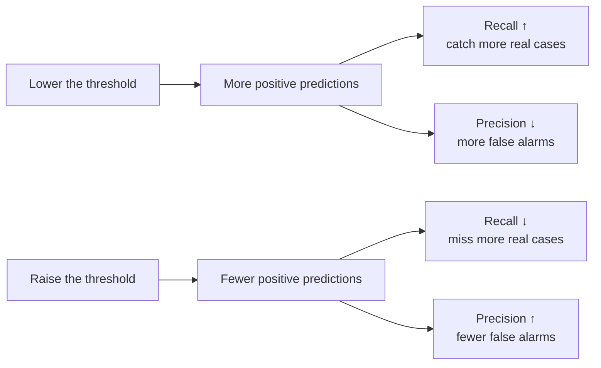

## What you'll learn

- precision and recall in words a stakeholder would use
- why the two cannot both be maximised, and what the dial between them is
- why $F_1$ uses a **harmonic** mean, and what would go wrong with an arithmetic one
- $F_\beta$, for when recall genuinely matters more than precision
- how to choose a threshold to hit a **target precision** or a **target recall**
- the precision-recall curve, average precision, and when to prefer them to $F_1$

## Intuition

You are building a filter that flags fraudulent transactions.

- **Precision** answers: *of the transactions I flagged, how many were actually fraud?* Low
  precision means you are crying wolf, and everyone stops listening.
- **Recall** answers: *of the fraud that occurred, how much did I catch?* Low recall means fraud is
  slipping through while your dashboard looks calm.

They pull against each other. Flag everything and you catch all the fraud — recall 1.0, precision
near zero. Flag only the single most suspicious transaction and you are probably right — precision
1.0, recall near zero. Everything useful lives in between, and the dial between them is the
decision threshold.



## The math

$$
\text{precision} = \frac{TP}{TP + FP}
\qquad\qquad
\text{recall} = \frac{TP}{TP + FN}
$$

Same numerator, different denominators. Precision divides by what you *predicted* positive; recall
divides by what *is* positive.

### $F_1$: why harmonic?

$$
F_1 = 2 \cdot \frac{\text{precision} \cdot \text{recall}}{\text{precision} + \text{recall}}
= \frac{2 \cdot TP}{2 \cdot TP + FP + FN}
$$

That is the harmonic mean of the two. The arithmetic mean would let one value rescue the other:
precision 1.0 with recall 0.0 averages to 0.50, which reads as a mediocre model rather than a
useless one. The harmonic mean gives:

$$
F_1 = 2\cdot\frac{1.0 \times 0.0}{1.0 + 0.0} = 0
$$

**The harmonic mean is dominated by the smaller value.** It always sits at or below the arithmetic
mean, and the gap grows as the two inputs diverge:

| Precision | Recall | Arithmetic mean | $F_1$ (harmonic) |
| --- | --- | --- | --- |
| 0.90 | 0.90 | 0.900 | 0.900 |
| 0.95 | 0.85 | 0.900 | 0.897 |
| 1.00 | 0.50 | 0.750 | 0.667 |
| 1.00 | 0.10 | 0.550 | 0.182 |
| 1.00 | 0.00 | 0.500 | 0.000 |

A model can only score highly on $F_1$ by being good at both, which is exactly the property you
want from a single summary number.

### $F_\beta$: when they are not equally important

$$
F_\beta = \left(1 + \beta^2\right)\cdot\frac{\text{precision} \cdot \text{recall}}{\beta^2 \cdot \text{precision} + \text{recall}}
$$

$\beta$ is how many times more important recall is than precision:

| $\beta$ | Meaning | Typical use |
| --- | --- | --- |
| 0.5 | Precision twice as important | Spam filtering, automated blocking |
| 1 | Equal | The default |
| 2 | Recall twice as important | Disease screening, fraud, safety recalls |

$F_2$ is the honest metric for screening problems, and it is one keyword away:
`fbeta_score(y, pred, beta=2)`.

## Worked example by hand

The ten-row example, at threshold 0.5: TP = 4, FP = 2, FN = 1, TN = 3.

**Step 1 — precision.** Of the 6 flagged, 4 were right:

$$
\text{precision} = \frac{4}{4+2} = \frac{2}{3} \approx 0.667
$$

**Step 2 — recall.** Of the 5 real positives, 4 were caught:

$$
\text{recall} = \frac{4}{4+1} = 0.800
$$

**Step 3 — $F_1$.**

$$
F_1 = 2\cdot\frac{0.667 \times 0.800}{0.667 + 0.800} = 2\cdot\frac{0.5333}{1.4667} = 0.727
$$

Or straight from the cells: $F_1 = 2(4) / (2(4) + 2 + 1) = 8/11 = 0.727$.

**Step 4 — $F_2$, weighting recall double.**

$$
F_2 = 5\cdot\frac{0.667 \times 0.800}{4(0.667) + 0.800} = 5\cdot\frac{0.5333}{3.4667} = 0.769
$$

$F_2 > F_1$ because this model's recall (0.800) is better than its precision (0.667), and $F_2$
rewards exactly that.

**Step 5 — raise the threshold to 0.65.** Now TP = 3, FP = 1, FN = 2:

$$
\text{precision} = \frac{3}{4} = 0.750
\qquad
\text{recall} = \frac{3}{5} = 0.600
\qquad
F_1 = \frac{2(3)}{2(3)+1+2} = \frac{6}{9} = 0.667
$$

Precision rose, recall fell, and $F_1$ dropped from 0.727 to 0.667 — so for a balanced objective
0.5 was the better threshold on this data. Had the objective been $F_2$, the ranking might reverse;
the metric decides the threshold, not the other way around.

### See it move

Steps 1 to 5 are two points on a curve. The sketch walks the threshold down through all ten scores
and plots the whole precision–recall trajectory, marking where each $F_\beta$ peaks. The $\beta$
slider is the point: **the same model has a different optimal threshold for every objective**.

```p5 title="Every threshold, and where each objective peaks" desc="The precision-recall curve for the ten-row example, walked one threshold at a time. Precision moves in jagged steps while recall falls monotonically. Markers show the threshold that maximises F0.5, F1 and F2, and they are not the same threshold. Click to cycle which beta is highlighted." height="420"
const ROWS = [
  [0.95, 1], [0.88, 1], [0.76, 1], [0.70, 0], [0.62, 0],
  [0.58, 1], [0.31, 1], [0.24, 0], [0.13, 0], [0.05, 0],
];
const BETAS = [0.5, 1, 2];
let betaIdx = 1;
let walk = 0;

function setup() {
  createCanvas(620, 420);
  textFont("monospace");
}
function counts(thr) {
  let tp = 0, fp = 0, fn = 0;
  for (const [s, y] of ROWS) {
    const pred = s >= thr;
    if (pred && y) tp++;
    else if (pred && !y) fp++;
    else if (!pred && y) fn++;
  }
  return { tp: tp, fp: fp, fn: fn };
}
function pr(thr) {
  const c = counts(thr);
  return {
    p: c.tp + c.fp ? c.tp / (c.tp + c.fp) : NaN,
    r: c.tp + c.fn ? c.tp / (c.tp + c.fn) : 0,
  };
}
function fbeta(thr, b) {
  const { p, r } = pr(thr);
  if (isNaN(p) || p + r === 0) return 0;
  const b2 = b * b;
  return ((1 + b2) * p * r) / (b2 * p + r);
}
function draw() {
  background(13, 17, 23);
  // candidate thresholds: just above each score, so every distinct split appears once
  const thresholds = ROWS.map((r) => r[0]).slice().sort((a, b) => b - a);

  const x0 = 70, x1 = 350, y0 = 60, y1 = 300;
  const px = (r) => x0 + r * (x1 - x0);
  const py = (p) => y1 - p * (y1 - y0);

  stroke(36, 42, 50);
  strokeWeight(1);
  for (let v = 0; v <= 1.001; v += 0.25) {
    line(x0, py(v), x1, py(v));
    line(px(v), y0, px(v), y1);
    noStroke();
    fill(100);
    textSize(9);
    textAlign(RIGHT, CENTER);
    text(v.toFixed(2), x0 - 5, py(v));
    textAlign(CENTER, TOP);
    text(v.toFixed(2), px(v), y1 + 5);
    stroke(36, 42, 50);
  }
  noStroke();
  fill(140);
  textSize(10);
  textAlign(CENTER, TOP);
  text("recall", (x0 + x1) / 2, y1 + 22);
  push();
  translate(x0 - 34, (y0 + y1) / 2);
  rotate(-HALF_PI);
  textAlign(CENTER, CENTER);
  text("precision", 0, 0);
  pop();

  // the curve
  const pathPts = [];
  for (const t of thresholds) {
    const { p, r } = pr(t);
    if (!isNaN(p)) pathPts.push([r, p, t]);
  }
  stroke(90, 110, 140);
  strokeWeight(1.6);
  noFill();
  beginShape();
  for (const [r, p] of pathPts) vertex(px(r), py(p));
  endShape();
  noStroke();
  for (const [r, p] of pathPts) {
    fill(90, 110, 140);
    ellipse(px(r), py(p), 6, 6);
  }

  // best threshold per beta
  const bests = BETAS.map((b) => {
    let best = { t: null, v: -1 };
    for (const t of thresholds) {
      const v = fbeta(t, b);
      if (v > best.v) best = { t: t, v: v };
    }
    return best;
  });
  const cols = [[150, 120, 200], [120, 200, 120], [255, 176, 67]];
  for (let i = 0; i < BETAS.length; i++) {
    const { t, v } = bests[i];
    const { p, r } = pr(t);
    const c = cols[i];
    noFill();
    stroke(c[0], c[1], c[2]);
    strokeWeight(i === betaIdx ? 2.6 : 1.2);
    ellipse(px(r), py(p), i === betaIdx ? 20 : 13, i === betaIdx ? 20 : 13);
    noStroke();
  }

  // walking marker
  const wt = thresholds[Math.floor(walk) % thresholds.length];
  const wpr = pr(wt);
  if (!isNaN(wpr.p)) {
    fill(235);
    ellipse(px(wpr.r), py(wpr.p), 11, 11);
  }

  // panel
  const panel = 382;
  fill(215);
  textSize(12);
  textAlign(LEFT, TOP);
  text("threshold " + wt.toFixed(2), panel, 60);
  const c = counts(wt);
  fill(150);
  textSize(11);
  text("TP " + c.tp + "  FP " + c.fp + "  FN " + c.fn, panel, 80);
  fill(235);
  text("precision " + (isNaN(wpr.p) ? "n/a" : wpr.p.toFixed(3)), panel, 102);
  text("recall    " + wpr.r.toFixed(3), panel, 120);

  for (let i = 0; i < BETAS.length; i++) {
    const b = BETAS[i];
    const { t, v } = bests[i];
    const cc = cols[i];
    const y = 158 + i * 46;
    fill(cc[0], cc[1], cc[2]);
    textSize(i === betaIdx ? 13 : 11);
    textAlign(LEFT, TOP);
    text("F" + b + (i === betaIdx ? "  <-" : ""), panel, y);
    fill(180);
    textSize(11);
    text("peaks at t = " + t.toFixed(2), panel, y + 16);
    text("value " + v.toFixed(3), panel, y + 30);
  }
  fill(105);
  textSize(10);
  textAlign(LEFT, TOP);
  text("click to highlight", panel, 306);
  text("another objective", panel, 320);

  walk += 0.02;
}
function mousePressed() { betaIdx = (betaIdx + 1) % BETAS.length; }
```

The three peak markers are three different answers to "what threshold should I ship?", and on this
data two of them genuinely disagree:

| Objective | Peaks at threshold | Value there | TP / FP / FN |
| --- | --- | --- | --- |
| $F_{0.5}$ (precision-leaning) | **0.76** | 0.882 | 3 / 0 / 2 |
| $F_1$ | **0.31** | 0.833 | 5 / 2 / 0 |
| $F_2$ (recall-leaning) | **0.31** | 0.926 | 5 / 2 / 0 |

Note what $F_{0.5}$ chose: a threshold that misses two of the five positives, because at 0.76 it
makes no false accusations at all. $F_1$ and $F_2$ both prefer catching every positive and eating two
false alarms. Same ten predictions, same model, opposite operating points — and neither is a mistake.
**You cannot choose a threshold without first choosing $\beta$**, and $\beta$ is a claim about the
relative cost of the two errors, not about the model.

Also worth noticing: the 0.5 threshold used in steps 1–4 is not the peak of *any* of the three
objectives. The default is a convention inherited from `predict`, not a decision.

## The trade-off on real data

<Figure
  src="/images/ml/phase-04-classification/metrics/precision-recall-tradeoff"
  alt="Left: precision and recall plotted against the decision threshold, crossing near 0.5. Right: the precision-recall curve, high across most of its range, with a dashed horizontal line marking the positive class rate."
  title="Two views of the same trade-off"
  caption="Left, as a function of the knob you control. Right, plotted against each other, which removes the threshold and shows the model's whole capability at once."
/>

### Reading the plot

| Threshold | Precision | Recall | $F_1$ | Reading |
| --- | --- | --- | --- | --- |
| 0.1 | 0.818 | 0.984 | 0.894 | Catches 63 of 64 cancers, 14 false alarms |
| 0.3 | 0.859 | 0.953 | 0.904 | Cautious triage |
| 0.5 | 0.938 | 0.938 | 0.938 | The default |
| **0.7** | **1.000** | **0.922** | **0.959** | Best $F_1$ — no false alarms at all |
| 0.9 | 1.000 | 0.875 | 0.933 | Too conservative; misses 8 cases |

1. **The curves cross near 0.5, by coincidence.** Nothing forces that; on imbalanced data the
   crossing point is usually far from the default.
2. **The best $F_1$ is at 0.7, not 0.5.** A free 2-point gain, available with a one-line change.
3. **The PR curve's baseline is the positive rate**, here 64/171 = 0.374 — that is what a random
   classifier achieves, not 0.5. A PR curve hugging the top-right corner means the model is
   genuinely separating the classes.

## Choosing a threshold deliberately

`precision_recall_curve` returns the full trade-off, so you can pick the operating point your
problem requires rather than accepting 0.5:

```python title="target_precision.py" showLineNumbers{1}
import numpy as np
from sklearn.datasets import load_breast_cancer
from sklearn.linear_model import LogisticRegression
from sklearn.metrics import precision_recall_curve, precision_score, recall_score
from sklearn.model_selection import train_test_split
from sklearn.pipeline import make_pipeline
from sklearn.preprocessing import StandardScaler

X, y = load_breast_cancer(return_X_y=True)
y = 1 - y
X_tr, X_te, y_tr, y_te = train_test_split(
    X, y, test_size=0.3, random_state=0, stratify=y
)

model = make_pipeline(StandardScaler(), LogisticRegression(max_iter=5000))
model.fit(X_tr, y_tr)
proba = model.predict_proba(X_te)[:, 1]

precision, recall, thresholds = precision_recall_curve(y_te, proba)

# The lowest threshold that still reaches 99% precision — lowest keeps recall high
idx = np.argmax(precision[:-1] >= 0.99)
chosen = thresholds[idx]

pred = (proba >= chosen).astype(int)
print(f"threshold  {chosen:.4f}")
print(f"precision  {precision_score(y_te, pred):.4f}")
print(f"recall     {recall_score(y_te, pred):.4f}")
```

The pattern generalises. For a **target recall** instead, scan `recall >= target` from the other
end. State the requirement first — "we must catch 95% of fraud" — then derive the threshold, rather
than reporting whatever 0.5 happens to give.

:::caution[Choose the threshold on validation data, not test data]
Tuning a threshold against the test set makes the reported score optimistic: you have fitted one
more parameter to it. Use a validation split or cross-validation, then apply the frozen threshold
to the test set once.
:::

## Average precision

$F_1$ describes a single operating point. **Average precision** summarises the entire curve:

$$
\text{AP} = \sum_{k} \left(R_k - R_{k-1}\right)P_k
$$

the precision-weighted area under the PR curve. On the breast-cancer model, AP = 0.989, meaning
precision stays near 1 across essentially the whole recall range.

| Metric | Describes | Use when |
| --- | --- | --- |
| Precision | One operating point | False alarms are the expensive error |
| Recall | One operating point | Misses are the expensive error |
| $F_1$ | One operating point | Both matter roughly equally |
| $F_\beta$ | One operating point | One matters $\beta^2$ times more |
| **Average precision** | The whole curve | Comparing models before fixing a threshold |
| ROC-AUC | The whole curve | Classes are roughly balanced — see the next page |

Use a curve metric while choosing between models, and a point metric once you have committed to an
operating point.

## Pitfalls

:::danger[Reporting precision without recall]
Either one alone is trivially gamed. Predict positive exactly once, on your most confident row, and
precision is 1.0. Predict positive everywhere and recall is 1.0. They only mean something together.
:::

:::caution[$F_1$ ignores true negatives entirely]
$F_1 = 2TP/(2TP + FP + FN)$ contains no TN term. On a problem where correctly identifying negatives
matters, $F_1$ is blind to your model's main job. Use balanced accuracy or Matthews correlation
instead.
:::

:::caution[$F_1$ is not symmetric under relabelling]
Swap which class you call "positive" and $F_1$ changes, sometimes dramatically. Accuracy and MCC do
not. Always state which class is positive.
:::

:::caution[The PR baseline is the positive rate, not 0.5]
On a dataset with 1% positives, a random classifier has AP ≈ 0.01. An AP of 0.15 on that problem is
a fifteenfold improvement, even though 0.15 sounds terrible. Always quote the positive rate beside
the AP.
:::

<Quiz
  questions={[
    {
      q: "Your fraud model flags 100 transactions and 30 are genuinely fraudulent, out of 50 frauds in total. What are precision and recall?",
      options: [
        "Precision 0.30, recall 0.60",
        "Precision 0.60, recall 0.30",
        "Precision 0.30, recall 0.50",
        "Precision 0.50, recall 0.30",
      ],
      answer: 0,
      explain: "Precision = 30/100 = 0.30 (of what you flagged). Recall = 30/50 = 0.60 (of what existed). Same numerator, different denominators.",
    },
    {
      q: "Why does F1 use a harmonic mean rather than an arithmetic one?",
      options: [
        "It is faster to compute",
        "The harmonic mean is dominated by the smaller value, so a model cannot score well by excelling at one and failing the other",
        "It keeps the result between 0 and 1",
        "It is a historical convention with no real justification",
      ],
      answer: 1,
      explain: "Precision 1.0 with recall 0.0 gives an arithmetic mean of 0.50 — misleadingly respectable. The harmonic mean gives exactly 0.",
    },
    {
      q: "You are screening for a serious disease. Which metric should you optimise?",
      options: [
        "Precision, to avoid alarming healthy people",
        "F-beta with beta = 2, which weights recall twice as heavily as precision",
        "Accuracy",
        "F1, always",
      ],
      answer: 1,
      explain: "A missed diagnosis is far worse than a follow-up test. F2 encodes that asymmetry explicitly, rather than pretending the two errors cost the same.",
    },
    {
      q: "On a dataset with 1% positives, your model achieves average precision 0.15. Is that good?",
      options: [
        "No, 0.15 is a poor score on any metric",
        "Yes — the random baseline for AP is the positive rate, 0.01, so this is roughly a fifteenfold improvement",
        "Impossible to say without the accuracy",
        "Only if recall is above 0.5",
      ],
      answer: 1,
      explain: "Unlike ROC-AUC, the PR baseline moves with class balance. Always compare AP against the positive rate rather than against 0.5.",
    },
  ]}
/>

## 🧪 Try It Yourself

### Exercise 1 – Precision and recall from counts

<DataCampExercise
  lang="python"
  hint={`Precision divides by TP + FP, recall by TP + FN.`}
  code={`# Task: Exercise 1 - Precision and recall from counts
tp, fp, fn, tn = 4, 2, 1, 3

precision = tp / (tp + fp)
recall = tp / (tp + ___)              # replace ___ with fn

print("precision:", round(precision, 4))
print("recall:", round(recall, 4))
print("recall is higher:", recall > precision)

# -- Expected Output -------------------------------------------
# precision: 0.6667
# recall: 0.8
# recall is higher: True
# --------------------------------------------------------------`}
  solution={`tp, fp, fn, tn = 4, 2, 1, 3
precision = tp / (tp + fp)
recall = tp / (tp + fn)
print("precision:", round(precision, 4))
print("recall:", round(recall, 4))
print("recall is higher:", recall > precision)`}
  sct={`test_output_contains("recall: 0.8")
success_msg("This model catches most real positives but raises some false alarms.")`}
  height={168}
/>

### Exercise 2 – Harmonic beats arithmetic

<DataCampExercise
  lang="python"
  hint={`The harmonic mean of a and b is 2ab / (a + b).`}
  code={`# Task: Exercise 2 - Harmonic beats arithmetic
pairs = [(0.90, 0.90), (1.00, 0.50), (1.00, 0.10)]

for p, r in pairs:
    arithmetic = (p + r) / 2
    harmonic = 2 * p * r / (p + ___) if (p + r) else 0.0   # replace ___ with r
    print(f"P={p:.2f} R={r:.2f}  mean {arithmetic:.3f}  F1 {harmonic:.3f}")

# -- Expected Output -------------------------------------------
# P=0.90 R=0.90  mean 0.900  F1 0.900
# P=1.00 R=0.50  mean 0.750  F1 0.667
# P=1.00 R=0.10  mean 0.550  F1 0.182
# --------------------------------------------------------------`}
  solution={`pairs = [(0.90, 0.90), (1.00, 0.50), (1.00, 0.10)]

for p, r in pairs:
    arithmetic = (p + r) / 2
    harmonic = 2 * p * r / (p + r) if (p + r) else 0.0
    print(f"P={p:.2f} R={r:.2f}  mean {arithmetic:.3f}  F1 {harmonic:.3f}")`}
  sct={`test_output_contains("F1 0.182")
success_msg("The wider the gap, the harder the harmonic mean punishes it.")`}
  height={188}
/>

### Exercise 3 – Weight recall with F-beta

<DataCampExercise
  lang="python"
  hint={`fbeta_score takes a beta argument; beta = 2 weights recall twice as heavily.`}
  code={`# Task: Exercise 3 - Weight recall with F-beta
import numpy as np
from sklearn.metrics import f1_score, ___     # replace ___ with fbeta_score

y = np.array([1, 1, 1, 0, 0, 1, 1, 0, 0, 0])
pred = np.array([1, 1, 1, 1, 1, 1, 0, 0, 0, 0])

print("F0.5:", round(fbeta_score(y, pred, beta=0.5), 4))
print("F1  :", round(f1_score(y, pred), 4))
print("F2  :", round(fbeta_score(y, pred, beta=2), 4))

# -- Expected Output -------------------------------------------
# F0.5: 0.6897
# F1  : 0.7273
# F2  : 0.7692
# --------------------------------------------------------------`}
  solution={`import numpy as np
from sklearn.metrics import f1_score, fbeta_score

y = np.array([1, 1, 1, 0, 0, 1, 1, 0, 0, 0])
pred = np.array([1, 1, 1, 1, 1, 1, 0, 0, 0, 0])
print("F0.5:", round(fbeta_score(y, pred, beta=0.5), 4))
print("F1  :", round(f1_score(y, pred), 4))
print("F2  :", round(fbeta_score(y, pred, beta=2), 4))`}
  sct={`test_output_contains("F2  : 0.7692")
success_msg("Recall exceeds precision here, so raising beta raises the score.")`}
  height={178}
/>

### Exercise 4 – Find the best threshold for F1

<DataCampExercise
  lang="python"
  hint={`Sweep thresholds, compute F1 at each, and take the argmax.`}
  code={`# Task: Exercise 4 - Find the best threshold for F1
import numpy as np
from sklearn.datasets import load_breast_cancer
from sklearn.linear_model import LogisticRegression
from sklearn.metrics import f1_score
from sklearn.model_selection import train_test_split
from sklearn.pipeline import make_pipeline
from sklearn.preprocessing import StandardScaler

X, y = load_breast_cancer(return_X_y=True)
y = 1 - y
X_tr, X_te, y_tr, y_te = train_test_split(X, y, test_size=0.3,
                                          random_state=0, stratify=y)
model = make_pipeline(StandardScaler(),
                      LogisticRegression(max_iter=5000)).fit(X_tr, y_tr)
proba = model.predict_proba(X_te)[:, 1]

grid = np.linspace(0.05, 0.95, 91)
f1s = [f1_score(y_te, (proba >= t).astype(int)) for t in grid]
best = grid[int(np.___(f1s))]                # replace ___ with argmax

print("F1 at 0.5:", round(f1_score(y_te, (proba >= 0.5).astype(int)), 4))
print("best threshold:", round(float(best), 2))
print("best F1:", round(max(f1s), 4))

# -- Expected Output -------------------------------------------
# F1 at 0.5: 0.9375
# best threshold: 0.63
# best F1: 0.9593
# --------------------------------------------------------------`}
  solution={`import numpy as np
from sklearn.datasets import load_breast_cancer
from sklearn.linear_model import LogisticRegression
from sklearn.metrics import f1_score
from sklearn.model_selection import train_test_split
from sklearn.pipeline import make_pipeline
from sklearn.preprocessing import StandardScaler

X, y = load_breast_cancer(return_X_y=True)
y = 1 - y
X_tr, X_te, y_tr, y_te = train_test_split(X, y, test_size=0.3,
                                          random_state=0, stratify=y)
model = make_pipeline(StandardScaler(),
                      LogisticRegression(max_iter=5000)).fit(X_tr, y_tr)
proba = model.predict_proba(X_te)[:, 1]
grid = np.linspace(0.05, 0.95, 91)
f1s = [f1_score(y_te, (proba >= t).astype(int)) for t in grid]
best = grid[int(np.argmax(f1s))]
print("F1 at 0.5:", round(f1_score(y_te, (proba >= 0.5).astype(int)), 4))
print("best threshold:", round(float(best), 2))
print("best F1:", round(max(f1s), 4))`}
  sct={`test_output_contains("F1 at 0.5: 0.9375")
success_msg("Two free points of F1, from moving one number.")`}
  height={248}
/>

### Exercise 5 – Hit a target precision

<DataCampExercise
  lang="python"
  hint={`precision_recall_curve gives arrays of precision, recall and thresholds; find the first index meeting the target.`}
  code={`# Task: Exercise 5 - Hit a target precision
import numpy as np
from sklearn.datasets import load_breast_cancer
from sklearn.linear_model import LogisticRegression
from sklearn.metrics import precision_recall_curve, precision_score, recall_score
from sklearn.model_selection import train_test_split
from sklearn.pipeline import make_pipeline
from sklearn.preprocessing import StandardScaler

X, y = load_breast_cancer(return_X_y=True)
y = 1 - y
X_tr, X_te, y_tr, y_te = train_test_split(X, y, test_size=0.3,
                                          random_state=0, stratify=y)
model = make_pipeline(StandardScaler(),
                      LogisticRegression(max_iter=5000)).fit(X_tr, y_tr)
proba = model.predict_proba(X_te)[:, 1]

precision, recall, thresholds = precision_recall_curve(y_te, ___)  # replace ___ with proba
idx = int(np.argmax(precision[:-1] >= 0.99))
chosen = thresholds[idx]
pred = (proba >= chosen).astype(int)

print("threshold:", round(float(chosen), 4))
print("precision:", round(precision_score(y_te, pred), 4))
print("recall:", round(recall_score(y_te, pred), 4))

# -- Expected Output -------------------------------------------
# threshold: 0.7154
# precision: 1.0
# recall: 0.9219
# --------------------------------------------------------------`}
  solution={`import numpy as np
from sklearn.datasets import load_breast_cancer
from sklearn.linear_model import LogisticRegression
from sklearn.metrics import precision_recall_curve, precision_score, recall_score
from sklearn.model_selection import train_test_split
from sklearn.pipeline import make_pipeline
from sklearn.preprocessing import StandardScaler

X, y = load_breast_cancer(return_X_y=True)
y = 1 - y
X_tr, X_te, y_tr, y_te = train_test_split(X, y, test_size=0.3,
                                          random_state=0, stratify=y)
model = make_pipeline(StandardScaler(),
                      LogisticRegression(max_iter=5000)).fit(X_tr, y_tr)
proba = model.predict_proba(X_te)[:, 1]
precision, recall, thresholds = precision_recall_curve(y_te, proba)
idx = int(np.argmax(precision[:-1] >= 0.99))
chosen = thresholds[idx]
pred = (proba >= chosen).astype(int)
print("threshold:", round(float(chosen), 4))
print("precision:", round(precision_score(y_te, pred), 4))
print("recall:", round(recall_score(y_te, pred), 4))`}
  sct={`test_output_contains("precision: 1.0")
success_msg("Requirement first, threshold second — the right order.")`}
  height={258}
/>

## Recap

- Precision is "of what I flagged, how much was right"; recall is "of what existed, how much did I
  catch".
- The threshold is the dial between them, and moving it needs no retraining.
- $F_1$ is their harmonic mean, so it is dominated by the weaker of the two: precision 1.0 with
  recall 0.0 gives $F_1 = 0$, not 0.5.
- The ten-row example: precision 0.667, recall 0.800, $F_1$ 0.727, $F_2$ 0.769.
- $F_\beta$ encodes which error is worse; $\beta = 2$ for screening, $\beta = 0.5$ for blocking.
- Derive the threshold from a stated requirement, on validation data, and freeze it before touching
  the test set.
- Average precision summarises the whole curve, and its baseline is the positive rate, not 0.5.

### Exercise 6 – Let each objective pick its own threshold

<DataCampExercise
  lang="python"
  hint={`F-beta is (1 + beta squared) * P * R / (beta squared * P + R). Evaluate it at every score and take the maximum.`}
  code={`# Task: Exercise 6 - Let each objective pick its own threshold
TEN_ROWS = [
    (0.95, 1), (0.88, 1), (0.76, 1), (0.70, 0), (0.62, 0),
    (0.58, 1), (0.31, 1), (0.24, 0), (0.13, 0), (0.05, 0),
]
thresholds = sorted({s for s, _ in TEN_ROWS}, reverse=True)


def counts(thr):
    tp = sum(1 for s, y in TEN_ROWS if s >= thr and y == 1)
    fp = sum(1 for s, y in TEN_ROWS if s >= thr and y == 0)
    fn = sum(1 for s, y in TEN_ROWS if s < thr and y == 1)
    return tp, fp, fn


def fbeta(thr, beta):
    tp, fp, fn = counts(thr)
    if tp == 0:
        return 0.0
    precision = tp / (tp + fp)
    recall = tp / (tp + fn)
    b2 = beta * beta
    return (1 + b2) * precision * recall / (b2 * precision + ___)
    # replace ___ with recall


for beta in (0.5, 1.0, 2.0):
    scored = [(fbeta(t, beta), t) for t in thresholds]
    value, thr = max(scored)
    tp, fp, fn = counts(thr)
    print(f"F{beta:<4} peaks at threshold {thr:.2f}  value {value:.3f}  "
          f"TP {tp} FP {fp} FN {fn}")
print(f"at the default 0.50 threshold: F1 = {fbeta(0.5, 1.0):.3f}, "
      f"which is not the peak of any of them")

# -- Expected Output -------------------------------------------
# F0.5  peaks at threshold 0.76  value 0.882  TP 3 FP 0 FN 2
# F1.0  peaks at threshold 0.31  value 0.833  TP 5 FP 2 FN 0
# F2.0  peaks at threshold 0.31  value 0.926  TP 5 FP 2 FN 0
# at the default 0.50 threshold: F1 = 0.727, which is not the peak of any of them
# --------------------------------------------------------------`}
  solution={`TEN_ROWS = [
    (0.95, 1), (0.88, 1), (0.76, 1), (0.70, 0), (0.62, 0),
    (0.58, 1), (0.31, 1), (0.24, 0), (0.13, 0), (0.05, 0),
]
thresholds = sorted({s for s, _ in TEN_ROWS}, reverse=True)


def counts(thr):
    tp = sum(1 for s, y in TEN_ROWS if s >= thr and y == 1)
    fp = sum(1 for s, y in TEN_ROWS if s >= thr and y == 0)
    fn = sum(1 for s, y in TEN_ROWS if s < thr and y == 1)
    return tp, fp, fn


def fbeta(thr, beta):
    tp, fp, fn = counts(thr)
    if tp == 0:
        return 0.0
    precision = tp / (tp + fp)
    recall = tp / (tp + fn)
    b2 = beta * beta
    return (1 + b2) * precision * recall / (b2 * precision + recall)


for beta in (0.5, 1.0, 2.0):
    scored = [(fbeta(t, beta), t) for t in thresholds]
    value, thr = max(scored)
    tp, fp, fn = counts(thr)
    print(f"F{beta:<4} peaks at threshold {thr:.2f}  value {value:.3f}  "
          f"TP {tp} FP {fp} FN {fn}")
print(f"at the default 0.50 threshold: F1 = {fbeta(0.5, 1.0):.3f}, "
      f"which is not the peak of any of them")`}
  sct={`test_output_contains("F0.5  peaks at threshold 0.76")
success_msg("F0.5 chooses a threshold that misses two positives in exchange for zero false alarms; F2 catches everything and accepts two. Both are correct answers to different questions, and the default 0.50 answers neither.")`}
  height={370}
/>

## Next

Continue to
[The ROC Curve and AUC](/machine-learning/phase-04---supervised-learning---classification/the-roc-curve-and-auc/)
— the other curve metric, what it measures that precision-recall does not, and the imbalanced case
where it will flatter a model that deserves no flattery.
