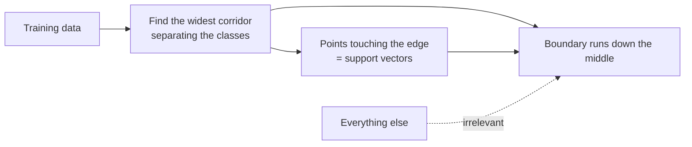

import DataCampExercise from "../../../../components/DataCampExercise.astro";
import AlgorithmCard from "../../../../components/AlgorithmCard.astro";
import Figure from "../../../../components/Figure.astro";
import Quiz from "../../../../components/Quiz.astro";

## What you'll learn

- why "the widest street" is a better objective than "any separating line"
- the margin formula $2/\lVert\mathbf{w}\rVert$, derived rather than quoted
- a complete hard-margin SVM solved **by hand** on three points
- **hinge loss** and the soft margin, and what `C` actually buys
- the **kernel trick**: non-linear boundaries without ever computing the new features
- what `gamma` controls, and how RBF fails at both extremes

## Intuition

Logistic regression finds *a* line that separates the classes. If the data is separable there are
infinitely many such lines, and it has no principled reason to prefer one over another.

An SVM does. It looks for the line with the **widest empty corridor** around it — the one that
stays as far as possible from the nearest point of either class. Intuitively, a boundary with room
on both sides is more likely to survive contact with new data than one that skims past a training
point.

The remarkable consequence: only the points touching the corridor edge matter. Those are the
**support vectors**, and every other point could be deleted without changing the model at all.



## The math

### The margin

For a linear model $f(\mathbf{x}) = \mathbf{w}^\top\mathbf{x} + b$, the distance from a point to
the boundary $f(\mathbf{x}) = 0$ is

$$
\text{distance} = \frac{\lvert \mathbf{w}^\top\mathbf{x} + b \rvert}{\lVert\mathbf{w}\rVert}
$$

We are free to rescale $\mathbf{w}$ and $b$ together without moving the boundary, so fix the scale
by requiring the closest points on each side to satisfy $\lvert f(\mathbf{x})\rvert = 1$. Those
points then sit at distance $1/\lVert\mathbf{w}\rVert$, and the full corridor width is

$$
\text{margin} = \frac{2}{\lVert\mathbf{w}\rVert}
$$

Maximising the margin means **minimising** $\lVert\mathbf{w}\rVert$, which gives the hard-margin
problem:

$$
\min_{\mathbf{w}, b} \frac{1}{2}\lVert\mathbf{w}\rVert^2
\quad\text{subject to}\quad
y^{(i)}\left(\mathbf{w}^\top\mathbf{x}^{(i)} + b\right) \geq 1 \;\; \text{for all } i
$$

with labels coded as $\pm 1$. It is a convex quadratic program: one global optimum, no local
minima.

:::note[Where this comes from]
The distance formula is the point-to-hyperplane distance from
[Lengths and Distances](/mathematics-for-machine-learning/chapter-03---analytic-geometry/lengths-and-distances/),
and the fact that $\mathbf{w}$ is normal to the boundary comes from
[Orthogonal Projections](/mathematics-for-machine-learning/chapter-03---analytic-geometry/orthogonal-projections/).
:::

### Soft margin and hinge loss

Real data is not separable, and one mislabelled point would make the hard-margin problem
infeasible. The soft margin introduces slack $\xi_i \geq 0$ and charges for it:

$$
\min_{\mathbf{w}, b, \boldsymbol{\xi}} \; \frac{1}{2}\lVert\mathbf{w}\rVert^2 + C\sum_{i=1}^{m}\xi_i
\quad\text{subject to}\quad
y^{(i)}\left(\mathbf{w}^\top\mathbf{x}^{(i)} + b\right) \geq 1 - \xi_i,\;\; \xi_i \geq 0
$$

Eliminating the slack variables turns this into an unconstrained problem with the **hinge loss**:

$$
\min_{\mathbf{w}, b} \; \frac{1}{2}\lVert\mathbf{w}\rVert^2 + C\sum_{i=1}^{m}\max\!\left(0,\; 1 - y^{(i)}f(\mathbf{x}^{(i)})\right)
$$

Read the hinge: a point that is correctly classified **and** outside the margin costs exactly zero.
Only points inside or across the margin contribute anything, and those are the support vectors.
That is the mechanism behind the sparsity.

**$C$ is the price of a violation.** Large $C$ makes violations expensive, so the model narrows the
margin to avoid them — low bias, high variance. Small $C$ tolerates violations for a wider corridor
— high bias, low variance. Note that this is the same inverted convention as
[logistic regression](/machine-learning/phase-04---supervised-learning---classification/logistic-regression-binary-vs-multiclass/):
$C$ is the inverse of regularisation strength.

## Worked example by hand

Three points, two classes, chosen so the whole problem is solvable on paper.

| point | $x_1$ | $x_2$ | class $y$ |
| --- | --- | --- | --- |
| A | 1 | 1 | −1 |
| B | 0 | 2 | −1 |
| C | 3 | 3 | +1 |

**Step 1 — guess the direction from symmetry.** A and B both lie on the line $x_1 + x_2 = 2$, and
C lies on $x_1 + x_2 = 6$. The separating boundary must run parallel to both, so
$\mathbf{w} \propto (1, 1)$. Write $\mathbf{w} = (a, a)$.

**Step 2 — impose the margin conditions.** The support vectors must satisfy $f = \pm 1$:

$$
f(C) = 3a + 3a + b = +1
\qquad
f(A) = a + a + b = -1
$$

**Step 3 — solve.** Subtracting gives $4a = 2$, so $a = 0.5$, and then $b = -1 - 2(0.5) = -2$.

$$
\mathbf{w} = (0.5,\ 0.5), \qquad b = -2
$$

**Step 4 — check B.** $f(B) = 0.5(0) + 0.5(2) - 2 = -1$. Exactly on the margin, so B is a support
vector too — all three points are.

**Step 5 — the margin width.**

$$
\lVert\mathbf{w}\rVert = \sqrt{0.5^2 + 0.5^2} = \frac{1}{\sqrt{2}} \approx 0.7071,
\qquad
\text{margin} = \frac{2}{0.7071} \approx 2.828
$$

**Step 6 — the boundary as a line.** $0.5x_1 + 0.5x_2 - 2 = 0$, that is $x_1 + x_2 = 4$ — precisely
the perpendicular bisector between the two class lines, as symmetry demanded.

`SVC(kernel="linear", C=1000)` on these three points returns $\mathbf{w} = (0.5002, 0.4995)$ and
$b = -1.9993$, converging to the hand solution to three decimals.

### See it move

The hand solution came from symmetry. The sketch solves the same problem by search: for every
candidate direction it projects all points onto that direction, finds the widest empty corridor
between the classes, and keeps the direction where that corridor is widest. In two dimensions that
*is* the hard-margin SVM, exactly — no optimiser required.

Drag any point. The reported $\mathbf{w}$, $b$ and margin update live, and the points that touch the
corridor edge are circled: those are the support vectors.

```p5 title="Drag a point, watch the margin re-solve" desc="Three points from the worked example, draggable. For each of 360 candidate directions the sketch measures the gap between the classes and keeps the widest, then reports w, b and the margin width. Points touching the corridor edge are circled as support vectors; dragging a non-support point changes nothing until it enters the corridor." height="420"
let pts = [
  { x: 1, y: 1, cls: -1 },
  { x: 0, y: 2, cls: -1 },
  { x: 3, y: 3, cls: 1 },
  { x: 4, y: 1.2, cls: 1 },
];
let dragging = -1;
const LO = -0.6, HI = 5.4;

function setup() {
  createCanvas(620, 420);
  textFont("monospace");
}
function sx(x) { return 60 + ((x - LO) / (HI - LO)) * 300; }
function sy(y) { return 330 - ((y - LO) / (HI - LO)) * 300; }
function dx(px) { return LO + ((px - 60) / 300) * (HI - LO); }
function dy(py) { return LO + ((330 - py) / 300) * (HI - LO); }

function solve() {
  let best = null;
  for (let i = 0; i < 720; i++) {
    const th = (i / 720) * PI;            // directions repeat after pi
    const ux = cos(th), uy = sin(th);
    let maxNeg = -1e9, minPos = 1e9;
    let svNeg = -1, svPos = -1;
    for (let j = 0; j < pts.length; j++) {
      const p = pts[j];
      const proj = p.x * ux + p.y * uy;
      if (p.cls < 0) { if (proj > maxNeg) { maxNeg = proj; svNeg = j; } }
      else { if (proj < minPos) { minPos = proj; svPos = j; } }
    }
    const gap = minPos - maxNeg;          // positive only when separable this way
    if (gap > 0 && (best === null || gap > best.gap)) {
      best = { ux: ux, uy: uy, gap: gap, mid: (minPos + maxNeg) / 2 };
    }
  }
  if (!best) return null;
  // w scaled so the support hyperplanes are f = +/-1
  const s = 2 / best.gap;
  return {
    wx: best.ux * s,
    wy: best.uy * s,
    b: -best.mid * s,
    margin: best.gap,
    ux: best.ux,
    uy: best.uy,
    mid: best.mid,
  };
}
function drawLine(sol, offset, col, dashed) {
  // points where u . p = offset, drawn across the plotting box
  const { ux, uy } = sol;
  const seg = [];
  const bounds = [
    [LO, null], [HI, null], [null, LO], [null, HI],
  ];
  for (const [bx, by] of bounds) {
    if (bx !== null && Math.abs(uy) > 1e-9) {
      const y = (offset - ux * bx) / uy;
      if (y >= LO && y <= HI) seg.push([bx, y]);
    }
    if (by !== null && Math.abs(ux) > 1e-9) {
      const x = (offset - uy * by) / ux;
      if (x >= LO && x <= HI) seg.push([x, by]);
    }
  }
  if (seg.length < 2) return;
  stroke(col[0], col[1], col[2]);
  strokeWeight(dashed ? 1.2 : 2.2);
  if (dashed) drawingContext.setLineDash([6, 6]);
  line(sx(seg[0][0]), sy(seg[0][1]), sx(seg[1][0]), sy(seg[1][1]));
  drawingContext.setLineDash([]);
}
function draw() {
  background(13, 17, 23);

  // grid
  stroke(32, 38, 46);
  strokeWeight(1);
  for (let v = 0; v <= 5; v++) {
    line(sx(v), sy(LO), sx(v), sy(HI));
    line(sx(LO), sy(v), sx(HI), sy(v));
  }
  noStroke();
  fill(95);
  textSize(9);
  for (let v = 0; v <= 5; v++) {
    textAlign(CENTER, TOP);
    text(v, sx(v), sy(LO) + 5);
    textAlign(RIGHT, CENTER);
    text(v, sx(LO) - 5, sy(v));
  }

  const sol = solve();
  if (sol) {
    drawLine(sol, sol.mid, [235, 235, 235], false);
    drawLine(sol, sol.mid + sol.margin / 2, [140, 150, 165], true);
    drawLine(sol, sol.mid - sol.margin / 2, [140, 150, 165], true);
  }

  // points, support vectors circled
  for (let j = 0; j < pts.length; j++) {
    const p = pts[j];
    let isSV = false;
    if (sol) {
      const proj = p.x * sol.ux + p.y * sol.uy;
      isSV = Math.abs(Math.abs(proj - sol.mid) - sol.margin / 2) < 1e-6;
    }
    noStroke();
    fill(p.cls > 0 ? color(255, 176, 67) : color(75, 139, 190));
    ellipse(sx(p.x), sy(p.y), 13, 13);
    if (isSV) {
      noFill();
      stroke(235);
      strokeWeight(2);
      ellipse(sx(p.x), sy(p.y), 22, 22);
      noStroke();
    }
  }

  // readout
  const panel = 392;
  fill(215);
  textSize(12);
  textAlign(LEFT, TOP);
  if (sol) {
    text("w = (" + sol.wx.toFixed(4) + ", " + sol.wy.toFixed(4) + ")", panel, 60);
    text("b = " + sol.b.toFixed(4), panel, 82);
    text("margin = " + sol.margin.toFixed(4), panel, 104);
    const norm = Math.sqrt(sol.wx * sol.wx + sol.wy * sol.wy);
    fill(150);
    textSize(11);
    text("||w|| = " + norm.toFixed(4), panel, 128);
    text("2/||w|| = " + (2 / norm).toFixed(4), panel, 146);
    fill(120, 200, 120);
    textSize(10);
    text("circled points define\nthe corridor; the rest\ncould be deleted", panel, 176);
  } else {
    fill(232, 122, 122);
    text("not separable\nby any line", panel, 60);
  }
  fill(105);
  textSize(10);
  textAlign(LEFT, TOP);
  text("drag any point   -   blue = class -1,  amber = class +1", 60, 356);
  text("double-click to restore the worked example", 60, 372);
}
function mousePressed() {
  for (let j = 0; j < pts.length; j++) {
    if (dist(mouseX, mouseY, sx(pts[j].x), sy(pts[j].y)) < 14) dragging = j;
  }
}
function mouseDragged() {
  if (dragging >= 0) {
    pts[dragging].x = constrain(dx(mouseX), LO, HI);
    pts[dragging].y = constrain(dy(mouseY), LO, HI);
  }
}
function mouseReleased() { dragging = -1; }
function doubleClicked() {
  pts = [
    { x: 1, y: 1, cls: -1 },
    { x: 0, y: 2, cls: -1 },
    { x: 3, y: 3, cls: 1 },
    { x: 4, y: 1.2, cls: 1 },
  ];
}
```

Two behaviours worth provoking deliberately. **Drag the fourth point around outside the corridor**
and every number on the panel stays frozen — that is the sparsity property, stated as a fact you can
feel rather than a theorem. **Drag it into the corridor** and the whole solution snaps to a new
direction, because a single point can now be the binding constraint. That sensitivity is why hard
margins are rarely used on real data, and it is what $C$ softens.

<Figure
  src="/images/ml/phase-04-classification/svm/margin-and-support-vectors"
  alt="Scatter of two classes with a solid decision boundary, two dashed margin lines forming a shaded corridor, and three circled points sitting exactly on the margin edges."
  title="The boundary, the corridor, and the points that define it"
  caption="Circled points are the support vectors. Every other point sits outside the corridor, contributes zero hinge loss, and could be deleted without changing the model."
/>

## Soft margin in practice

<Figure
  src="/images/ml/phase-04-classification/svm/soft-margin-c"
  alt="Three panels of the same overlapping dataset with linear SVM boundaries at C equal to 0.01, 1 and 100, with the number of support vectors falling as C rises."
  title="C = 0.01, 1 and 100 on overlapping classes"
  caption="At C = 0.01 almost every point is a support vector and the margin is enormous. At C = 100 the model keeps only a handful and squeezes the corridor to avoid violations."
/>

### Reading the plot

- **Support vector count is a regularisation diagnostic.** On the iris virginica problem, `C=0.01`
  keeps all 100 points as support vectors; `C=1` keeps 26; `C=100` keeps 12. A model whose support
  vectors are most of the training set is heavily regularised.
- **Accuracy barely moves** across two orders of magnitude of $C$ here (0.96, 0.95, 0.96). $C$
  matters most when the classes genuinely overlap.
- **Fewer support vectors also means faster prediction**, since prediction cost scales with their
  number.

## The kernel trick

Suppose the data is not linearly separable in its original space. Map it into a higher-dimensional
space where it is:

$$
\mathbf{x} \mapsto \phi(\mathbf{x})
$$

The catch is that a useful $\phi$ can be enormous, sometimes infinite-dimensional. The **kernel
trick** avoids ever building it. The SVM's dual formulation touches the data only through inner
products $\phi(\mathbf{a})^\top\phi(\mathbf{b})$, and for many useful maps that inner product has a
closed form computable in the *original* space:

$$
K(\mathbf{a}, \mathbf{b}) = \phi(\mathbf{a})^\top\phi(\mathbf{b})
$$

| Kernel | $K(\mathbf{a}, \mathbf{b})$ | Effective feature space |
| --- | --- | --- |
| Linear | $\mathbf{a}^\top\mathbf{b}$ | The original features |
| Polynomial | $(\gamma\,\mathbf{a}^\top\mathbf{b} + r)^{d}$ | All monomials up to degree $d$ |
| **RBF (Gaussian)** | $\exp\!\left(-\gamma\lVert\mathbf{a} - \mathbf{b}\rVert^2\right)$ | Infinite-dimensional |
| Sigmoid | $\tanh(\gamma\,\mathbf{a}^\top\mathbf{b} + r)$ | Neural-network-like |

The RBF kernel corresponds to an infinite-dimensional feature map, yet costs one exponential per
pair. That is the trick: **the space is never constructed, only its geometry is used.**

### What gamma does

$$
K(\mathbf{a}, \mathbf{b}) = \exp\!\left(-\gamma\lVert\mathbf{a} - \mathbf{b}\rVert^2\right)
$$

$\gamma$ is an inverse radius of influence. Small $\gamma$ means a single training point affects
predictions far away, giving smooth boundaries. Large $\gamma$ means influence dies off almost
immediately, and the model builds a tight bubble around each training point.

<Figure
  src="/images/ml/phase-04-classification/svm/rbf-gamma"
  alt="Three panels of the same crescent-shaped dataset with RBF SVM boundaries at gamma equal to 0.1, 1 and 30. The first is nearly linear, the second follows the crescents, and the third forms isolated islands around individual points."
  title="gamma = 0.1, 1 and 30"
  caption="At gamma = 30 the model reaches 0.99 training accuracy by drawing a bubble around each point — the classic signature of overfitting with an RBF kernel."
/>

`C` and `gamma` interact, so tune them together on a log grid rather than one at a time:

```python title="svm_grid.py" showLineNumbers{1}
import numpy as np
from sklearn.datasets import load_breast_cancer
from sklearn.model_selection import GridSearchCV, train_test_split
from sklearn.pipeline import make_pipeline
from sklearn.preprocessing import StandardScaler
from sklearn.svm import SVC

X, y = load_breast_cancer(return_X_y=True)
y = 1 - y
X_tr, X_te, y_tr, y_te = train_test_split(
    X, y, test_size=0.3, random_state=0, stratify=y
)

pipe = make_pipeline(StandardScaler(), SVC(kernel="rbf"))
grid = GridSearchCV(
    pipe,
    {"svc__C": np.logspace(-2, 3, 6), "svc__gamma": np.logspace(-4, 1, 6)},
    cv=5,
    n_jobs=-1,
)
grid.fit(X_tr, y_tr)

print("best params:", grid.best_params_)
print(f"CV accuracy   {grid.best_score_:.4f}")
print(f"test accuracy {grid.score(X_te, y_te):.4f}")
```

:::tip[Start with `gamma="scale"`]
The default `gamma="scale"` sets $\gamma = 1/(n \cdot \operatorname{Var}(X))$, which adapts to your
data's dimensionality and spread. It is a genuinely good starting point, and the reason
`SVC()` with no arguments often performs respectably.
:::

## Scaling is mandatory

The RBF kernel is a function of $\lVert\mathbf{a}-\mathbf{b}\rVert^2$, so — exactly as with
[KNN](/machine-learning/phase-04---supervised-learning---classification/k-nearest-neighbors-knn/) —
a feature with a large numeric range dominates the distance and the others stop mattering. The
linear kernel is affected too, because the $\lVert\mathbf{w}\rVert^2$ penalty charges by coefficient
size, and coefficient size depends on feature units.

Always `make_pipeline(StandardScaler(), SVC(...))`.

## SVM for regression

The same machinery, inverted. Instead of keeping points *outside* a margin, SVR asks for them to be
*inside* an $\epsilon$-wide tube, and only points outside the tube incur a cost:

$$
\text{loss} = \max\!\left(0,\; \lvert y - f(\mathbf{x})\rvert - \epsilon\right)
$$

Widening $\epsilon$ makes the tube more forgiving and produces fewer support vectors. `SVR` and
`LinearSVR` implement it, and everything about scaling and kernels carries over unchanged.

<AlgorithmCard
  name="Support Vector Machine"
  type="Supervised · Classification and Regression · Max-margin"
  sklearn="sklearn.svm.SVC / LinearSVC / SVR"
  assumptions={[
    "A margin exists in the original space, or in some kernel-induced space",
    "Features are on comparable scales",
    "The dataset is small enough for a quadratic-program solver",
    "You do not need calibrated probabilities directly from the model",
  ]}
  complexity={{ train: "O(m² · n) to O(m³ · n)", predict: "O(n · number of support vectors)", memory: "O(support vectors × n)" }}
  notation="m = samples, n = features; the quadratic-to-cubic training cost is why SVC struggles past roughly 50,000 rows"
  hyperparams={[
    { name: "C", default: "1.0", effect: "Price of a margin violation. Large C narrows the margin and overfits; small C widens it and underfits. Inverse of regularisation strength." },
    { name: "kernel", default: "rbf", effect: "'linear' for wide, sparse data such as text; 'rbf' as the general-purpose default; 'poly' when interactions of a known degree matter." },
    { name: "gamma", default: "scale", effect: "RBF radius of influence, inverted. Large gamma builds islands around individual points." },
    { name: "class_weight", default: "None", effect: "'balanced' reweights the hinge loss by inverse class frequency — the first move on imbalanced data." },
    { name: "probability", default: "False", effect: "Enables predict_proba via Platt scaling, at the cost of an internal 5-fold cross-validation. Slow, and the probabilities are only approximately calibrated." },
  ]}
  useWhen={[
    "The dataset is small to medium with many features — text classification is the classic case",
    "The boundary is non-linear but smooth",
    "You want a margin-based model that is robust to points far from the boundary",
    "Feature count exceeds sample count, where SVMs remain well behaved",
  ]}
  avoidWhen={[
    "There are hundreds of thousands of rows — training is quadratic to cubic",
    "You need calibrated probabilities without extra work",
    "You need to explain the model to a non-technical audience",
    "Features cannot be scaled",
  ]}
/>

## Pitfalls

:::danger[Not scaling before an RBF kernel]
The kernel is a function of squared distance. A feature ranging over thousands makes every kernel
value collapse toward zero and the model predicts one class for everything. This produces silent
failure, not an error.
:::

:::caution[`SVC` does not scale to large datasets]
Training is between quadratic and cubic in the sample count. Past roughly 50,000 rows use
`LinearSVC` (liblinear, linear kernel only) or `SGDClassifier(loss="hinge")`, which optimises the
same hinge loss by stochastic gradient descent in linear time.
:::

:::caution[`probability=True` is slow and only approximate]
It fits an internal 5-fold cross-validation to calibrate a sigmoid over the decision function.
Prefer `decision_function()` for ranking and thresholding, and if you genuinely need probabilities,
consider logistic regression instead.
:::

:::caution[Tuning C and gamma independently]
They interact: a large `gamma` with a large `C` overfits catastrophically, while a large `gamma`
with a small `C` may be fine. Always grid-search the pair together over log-spaced values.
:::

## Compare

| Model | Boundary | Scales to big data | Probabilities | Sensitive to outliers |
| --- | --- | --- | --- | --- |
| **SVM (RBF)** | Smooth, non-linear | Poorly | Only via Platt scaling | Low — far points cost zero |
| SVM (linear) | Linear, max-margin | Moderately, via `LinearSVC` | Only via Platt scaling | Low |
| Logistic Regression | Linear | Well | Yes, calibrated | Moderate |
| KNN | Arbitrarily local | Poorly at predict time | Coarse | Moderate |
| Random Forest | Axis-aligned, complex | Well | Reasonable | Low |

The hinge loss is what makes SVMs robust: a point far on the correct side contributes exactly zero,
whereas log loss keeps rewarding extra confidence forever.

<Quiz
  questions={[
    {
      q: "Why maximise the margin instead of accepting any separating line?",
      options: [
        "It makes training faster",
        "A boundary with clearance on both sides is more likely to generalise than one that skims a training point",
        "It guarantees 100% training accuracy",
        "It removes the need to scale features",
      ],
      answer: 1,
      explain: "Among infinitely many separating lines, the widest-corridor one has the most room for new points to fall in without crossing. That is the geometric expression of a low-variance choice.",
    },
    {
      q: "What does it mean that only support vectors matter?",
      options: [
        "All the other points were mislabelled",
        "Points outside the margin contribute zero hinge loss, so deleting them leaves the fitted boundary unchanged",
        "Support vectors are the points closest to the class means",
        "It means the model has overfitted",
      ],
      answer: 1,
      explain: "The hinge loss max(0, 1 - y·f(x)) is exactly zero for any correctly classified point outside the margin. Those points exert no force on the optimisation.",
    },
    {
      q: "What is the kernel trick actually avoiding?",
      options: [
        "The need to label the training data",
        "Explicitly constructing the high-dimensional feature map — the optimisation only ever needs inner products, which the kernel computes directly",
        "The need to choose hyperparameters",
        "Computing the decision boundary",
      ],
      answer: 1,
      explain: "The dual problem touches the data only through inner products of mapped vectors. A kernel returns that inner product in the original space, so an infinite-dimensional map costs one exponential.",
    },
    {
      q: "Your RBF SVM has training accuracy 0.99 and test accuracy 0.72. Which knob do you turn first?",
      options: [
        "Increase gamma to fit the data better",
        "Decrease gamma and decrease C — both are currently letting the model build bubbles around individual points",
        "Switch to a sigmoid kernel",
        "Add more features",
      ],
      answer: 1,
      explain: "That gap is textbook RBF overfitting. Large gamma shrinks each point's influence to a bubble, and large C refuses any margin violation. Reduce both, and grid-search the pair together.",
    },
  ]}
/>

## 🧪 Try It Yourself

### Exercise 1 – Recover the hand-solved SVM

<DataCampExercise
  lang="python"
  hint={`A large C approximates a hard margin, since violations become almost infinitely expensive.`}
  code={`# Task: Exercise 1 - Recover the hand-solved SVM
import numpy as np
from sklearn.svm import ___         # replace ___ with SVC

X = np.array([[1.0, 1.0], [0.0, 2.0], [3.0, 3.0]])
y = np.array([0, 0, 1])

model = SVC(kernel="linear", C=1000).fit(X, y)

print("w:", model.coef_.round(3))
print("b:", round(model.intercept_[0], 3))
print("support vectors:", len(model.support_vectors_))

# -- Expected Output -------------------------------------------
# w: [[0.5 0.5]]
# b: -1.999
# support vectors: 3
# --------------------------------------------------------------`}
  solution={`import numpy as np
from sklearn.svm import SVC

X = np.array([[1.0, 1.0], [0.0, 2.0], [3.0, 3.0]])
y = np.array([0, 0, 1])
model = SVC(kernel="linear", C=1000).fit(X, y)
print("w:", model.coef_.round(3))
print("b:", round(model.intercept_[0], 3))
print("support vectors:", len(model.support_vectors_))`}
  sct={`test_output_contains("support vectors: 3")
success_msg("All three points sit on the margin, exactly as the hand calculation predicted.")`}
  height={188}
/>

### Exercise 2 – Compute the margin width

<DataCampExercise
  lang="python"
  hint={`The margin is 2 divided by the Euclidean norm of w.`}
  code={`# Task: Exercise 2 - Compute the margin width
import numpy as np

w = np.array([0.5, 0.5])

norm = np.linalg.norm(w)
margin = 2 / ___                    # replace ___ with norm

print("||w||:", round(float(norm), 4))
print("margin:", round(float(margin), 4))
print("half-margin:", round(float(1 / norm), 4))

# -- Expected Output -------------------------------------------
# ||w||: 0.7071
# margin: 2.8284
# half-margin: 1.4142
# --------------------------------------------------------------`}
  solution={`import numpy as np

w = np.array([0.5, 0.5])
norm = np.linalg.norm(w)
margin = 2 / norm
print("||w||:", round(float(norm), 4))
print("margin:", round(float(margin), 4))
print("half-margin:", round(float(1 / norm), 4))`}
  sct={`test_output_contains("margin: 2.8284")
success_msg("Smaller ||w|| means a wider corridor — which is why the objective minimises it.")`}
  height={178}
/>

### Exercise 3 – Count support vectors as C changes

<DataCampExercise
  lang="python"
  hint={`n_support_ gives the count per class; sum it.`}
  code={`# Task: Exercise 3 - Count support vectors as C changes
from sklearn.datasets import load_iris
from sklearn.pipeline import make_pipeline
from sklearn.preprocessing import StandardScaler
from sklearn.svm import SVC

iris = load_iris()
X = iris.data[:, (2, 3)]
y = (iris.target == 2).astype(int)

for C in (0.01, 1, 100):
    m = make_pipeline(StandardScaler(), SVC(kernel="linear", C=C)).fit(X, y)
    n_sv = int(m[-1].___.sum())      # replace ___ with n_support_
    print(f"C={C:<6} support vectors {n_sv:3d}  accuracy {m.score(X, y):.4f}")

# -- Expected Output -------------------------------------------
# C=0.01   support vectors 100  accuracy 0.9600
# C=1      support vectors  26  accuracy 0.9533
# C=100    support vectors  12  accuracy 0.9600
# --------------------------------------------------------------`}
  solution={`from sklearn.datasets import load_iris
from sklearn.pipeline import make_pipeline
from sklearn.preprocessing import StandardScaler
from sklearn.svm import SVC

iris = load_iris()
X = iris.data[:, (2, 3)]
y = (iris.target == 2).astype(int)

for C in (0.01, 1, 100):
    m = make_pipeline(StandardScaler(), SVC(kernel="linear", C=C)).fit(X, y)
    n_sv = int(m[-1].n_support_.sum())
    print(f"C={C:<6} support vectors {n_sv:3d}  accuracy {m.score(X, y):.4f}")`}
  sct={`test_output_contains("C=100")
success_msg("A hundredfold change in C, and accuracy barely moves — but the model got eight times sparser.")`}
  height={198}
/>

### Exercise 4 – Watch gamma overfit

<DataCampExercise
  lang="python"
  hint={`Compare training accuracy against cross-validated accuracy as gamma grows.`}
  code={`# Task: Exercise 4 - Watch gamma overfit
from sklearn.datasets import make_moons
from sklearn.model_selection import cross_val_score
from sklearn.pipeline import make_pipeline
from sklearn.preprocessing import StandardScaler
from sklearn.svm import SVC

X, y = make_moons(n_samples=200, noise=0.26, random_state=6)

for gamma in (0.1, 1, 30):
    pipe = make_pipeline(StandardScaler(), SVC(kernel="rbf", gamma=gamma, C=10))
    train = pipe.fit(X, y).score(X, y)
    cv = cross_val_score(pipe, X, y, cv=5).___()   # replace ___ with mean
    print(f"gamma={gamma:<5} train {train:.4f}  cv {cv:.4f}  gap {train - cv:.4f}")

# -- Expected Output -------------------------------------------
# gamma=0.1   train 0.8800  cv 0.8650  gap 0.0150
# gamma=1     train 0.9400  cv 0.9200  gap 0.0200
# gamma=30    train 0.9900  cv 0.8700  gap 0.1200
# --------------------------------------------------------------`}
  solution={`from sklearn.datasets import make_moons
from sklearn.model_selection import cross_val_score
from sklearn.pipeline import make_pipeline
from sklearn.preprocessing import StandardScaler
from sklearn.svm import SVC

X, y = make_moons(n_samples=200, noise=0.26, random_state=6)

for gamma in (0.1, 1, 30):
    pipe = make_pipeline(StandardScaler(), SVC(kernel="rbf", gamma=gamma, C=10))
    train = pipe.fit(X, y).score(X, y)
    cv = cross_val_score(pipe, X, y, cv=5).mean()
    print(f"gamma={gamma:<5} train {train:.4f}  cv {cv:.4f}  gap {train - cv:.4f}")`}
  sct={`test_output_contains("gamma=30")
success_msg("A perfect training score and the worst CV score — the gap is the diagnosis.")`}
  height={208}
/>

### Exercise 5 – Widen the epsilon tube in SVR

<DataCampExercise
  lang="python"
  hint={`A larger epsilon means more points fall inside the tube, so fewer become support vectors.`}
  code={`# Task: Exercise 5 - Widen the epsilon tube in SVR
import numpy as np
from sklearn.svm import ___          # replace ___ with SVR

rng = np.random.default_rng(0)
X = np.sort(rng.uniform(0, 10, 80)).reshape(-1, 1)
y = 2 * X.ravel() + rng.normal(0, 1.0, 80)

for eps in (0.1, 1.0, 3.0):
    model = SVR(kernel="linear", epsilon=eps, C=10).fit(X, y)
    print(f"epsilon={eps:<5} support vectors {len(model.support_):3d}")

# -- Expected Output -------------------------------------------
# epsilon=0.1   support vectors  74
# epsilon=1.0   support vectors  26
# epsilon=3.0   support vectors   2
# --------------------------------------------------------------`}
  solution={`import numpy as np
from sklearn.svm import SVR

rng = np.random.default_rng(0)
X = np.sort(rng.uniform(0, 10, 80)).reshape(-1, 1)
y = 2 * X.ravel() + rng.normal(0, 1.0, 80)

for eps in (0.1, 1.0, 3.0):
    model = SVR(kernel="linear", epsilon=eps, C=10).fit(X, y)
    print(f"epsilon={eps:<5} support vectors {len(model.support_):3d}")`}
  sct={`test_output_contains("epsilon=3.0")
success_msg("A wider tube forgives more points, so far fewer of them constrain the fit.")`}
  height={198}
/>

## Recap

- The margin is $2/\lVert\mathbf{w}\rVert$, so maximising it means minimising $\lVert\mathbf{w}\rVert$
  subject to every point being correctly classified by at least 1.
- Hand-solved on three points: $\mathbf{w} = (0.5, 0.5)$, $b = -2$, margin 2.828, boundary
  $x_1 + x_2 = 4$ — and `SVC` reproduces it to three decimals.
- The hinge loss is exactly zero outside the margin, which is why only support vectors matter.
- $C$ is the price of a violation: large $C$ narrows the margin, small $C$ widens it. On iris,
  $C$ from 0.01 to 100 takes the support vector count from 100 to 12.
- The kernel trick replaces an explicit high-dimensional map with an inner product computed in the
  original space; RBF corresponds to an infinite-dimensional space.
- $\gamma$ is an inverse radius of influence — large values build a bubble around each point and
  overfit.
- Always scale, and always tune $C$ and $\gamma$ together.

### Exercise 6 – Solve the hard margin by brute force

<DataCampExercise
  lang="python"
  hint={`For each candidate direction, project every point onto it. The gap is the smallest positive projection minus the largest negative one.`}
  code={`# Task: Exercise 6 - Solve the hard margin by brute force
import numpy as np

pts = np.array([[1.0, 1.0], [0.0, 2.0], [3.0, 3.0], [4.0, 1.2]])
cls = np.array([-1, -1, 1, 1])

best = None
for theta in np.linspace(0, np.pi, 3601):
    u = np.array([np.cos(theta), np.sin(theta)])
    projections = pts @ u
    max_neg = projections[cls == -1].max()
    min_pos = projections[cls == 1].___()        # replace ___ with min
    gap = min_pos - max_neg
    if gap > 0 and (best is None or gap > best[0]):
        best = (gap, u, (min_pos + max_neg) / 2)

gap, u, mid = best
w = 2 * u / gap
b = -mid * 2 / gap
print(f"direction  ({u[0]:.4f}, {u[1]:.4f})")
print(f"w = ({w[0]:.4f}, {w[1]:.4f})   b = {b:.4f}")
print(f"margin width = {gap:.4f}   2/||w|| = {2 / np.linalg.norm(w):.4f}")
for i, (point, label) in enumerate(zip(pts, cls)):
    f = w @ point + b
    role = "support vector" if abs(abs(f) - 1) < 1e-3 else "inactive"
    print(f"point {i} f = {f:+.4f}  {role}")

# -- Expected Output -------------------------------------------
# direction  (0.8742, 0.4856)
# w = (0.6429, 0.3571)   b = -2.0000
# margin width = 2.7195   2/||w|| = 2.7195
# point 0 f = -1.0000  support vector
# point 1 f = -1.2858  inactive
# point 2 f = +1.0000  support vector
# point 3 f = +1.0001  support vector
# --------------------------------------------------------------`}
  solution={`import numpy as np

pts = np.array([[1.0, 1.0], [0.0, 2.0], [3.0, 3.0], [4.0, 1.2]])
cls = np.array([-1, -1, 1, 1])

best = None
for theta in np.linspace(0, np.pi, 3601):
    u = np.array([np.cos(theta), np.sin(theta)])
    projections = pts @ u
    max_neg = projections[cls == -1].max()
    min_pos = projections[cls == 1].min()
    gap = min_pos - max_neg
    if gap > 0 and (best is None or gap > best[0]):
        best = (gap, u, (min_pos + max_neg) / 2)

gap, u, mid = best
w = 2 * u / gap
b = -mid * 2 / gap
print(f"direction  ({u[0]:.4f}, {u[1]:.4f})")
print(f"w = ({w[0]:.4f}, {w[1]:.4f})   b = {b:.4f}")
print(f"margin width = {gap:.4f}   2/||w|| = {2 / np.linalg.norm(w):.4f}")
for i, (point, label) in enumerate(zip(pts, cls)):
    f = w @ point + b
    role = "support vector" if abs(abs(f) - 1) < 1e-3 else "inactive"
    print(f"point {i} f = {f:+.4f}  {role}")`}
  sct={`test_output_contains("margin width = 2.7195")
success_msg("Three of the four points sit exactly on the margin and the fourth is inactive — delete it and nothing changes. Note also that 2/||w|| equals the gap by construction, which is why maximising the margin is minimising the norm.")`}
  height={330}
/>

## Next

Continue to
[Decision Trees - Entropy and Gini Impurity](/machine-learning/phase-04---supervised-learning---classification/decision-trees-entropy-and-gini-impurity/)
— a model that needs no scaling, no distance metric and no kernel, and that you can read out loud
as a list of rules.
