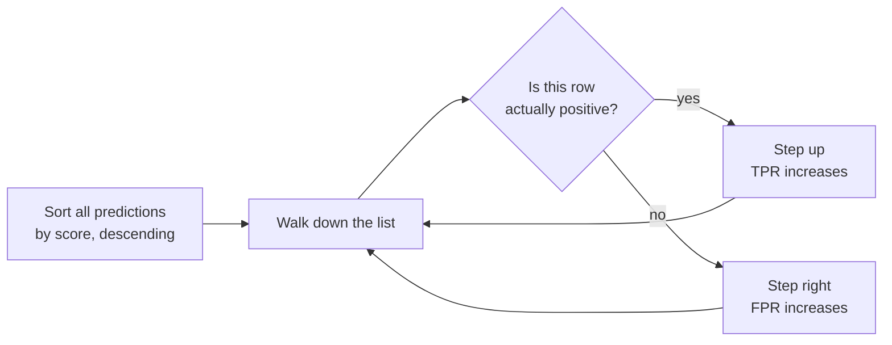

## What you'll learn

- how an ROC curve is constructed, one threshold at a time
- the full curve traced **by hand** from the ten-row example
- the probabilistic meaning of AUC — it is not "accuracy over all thresholds"
- why AUC = 0.5 is chance and AUC below 0.5 means something useful
- exactly when ROC misleads, and why precision-recall is the right choice there
- how to pick between ROC-AUC and average precision, with a rule

## Intuition

Precision and recall describe one operating point. The ROC curve describes **all of them at once**.

Slide the threshold from 1 down to 0. At the top, nothing is predicted positive: no true positives,
no false positives, and the curve starts at $(0, 0)$. At the bottom, everything is predicted
positive and the curve ends at $(1, 1)$. In between, every threshold contributes a point.

The shape of the path between those corners is the model's ranking ability. A model that scores
every positive above every negative goes straight up and then straight across — through the
top-left corner. A model that ranks randomly follows the diagonal.



## The math

$$
\text{TPR (recall, sensitivity)} = \frac{TP}{TP + FN}
\qquad
\text{FPR} = \frac{FP}{FP + TN} = 1 - \text{specificity}
$$

Both denominators are **row totals** of the confusion matrix — the number of actual positives and
the number of actual negatives. That single fact explains everything ROC does well and everything
it does badly: neither axis depends on how many positives there are relative to negatives, so the
curve is invariant to class balance.

### What AUC actually measures

The area under the ROC curve has an exact probabilistic interpretation:

$$
\text{AUC} = P\big(\text{score}(x^{+}) > \text{score}(x^{-})\big)
$$

**AUC is the probability that a randomly chosen positive is ranked above a randomly chosen
negative.** It is a measure of *ranking*, not of classification. It never looks at your threshold,
which is exactly why it is useful for comparing models before one is chosen — and why it cannot
tell you whether a model is deployable.

| AUC | Meaning |
| --- | --- |
| 1.0 | Every positive ranks above every negative |
| 0.9 | Strong separation |
| 0.7 | Modest, often still useful |
| 0.5 | Chance — the diagonal |
| < 0.5 | Ranking is inverted; flip the sign and you have a good model |

That last row is worth remembering. An AUC of 0.2 is not a bad model, it is a good model with its
labels or its sign the wrong way round.

## Worked example by hand

The ten-row example, sorted by score. Five positives, five negatives.

| rank | true | score | running TP | running FP | TPR | FPR |
| --- | --- | --- | --- | --- | --- | --- |
| — | — | (none flagged) | 0 | 0 | 0.0 | 0.0 |
| 1 | + | 0.95 | 1 | 0 | 0.2 | 0.0 |
| 2 | + | 0.88 | 2 | 0 | 0.4 | 0.0 |
| 3 | + | 0.76 | 3 | 0 | 0.6 | 0.0 |
| 4 | − | 0.70 | 3 | 1 | 0.6 | 0.2 |
| 5 | − | 0.62 | 3 | 2 | 0.6 | 0.4 |
| 6 | + | 0.58 | 4 | 2 | 0.8 | 0.4 |
| 7 | + | 0.31 | 5 | 2 | 1.0 | 0.4 |
| 8 | − | 0.24 | 5 | 3 | 1.0 | 0.6 |
| 9 | − | 0.13 | 5 | 4 | 1.0 | 0.8 |
| 10 | − | 0.05 | 5 | 5 | 1.0 | 1.0 |

Each row is one threshold. A positive steps the curve **up** by $1/5$; a negative steps it **right**
by $1/5$.

**Area by geometry.** The curve is a staircase, so the area is a sum of rectangles — one per
rightward step, whose height is the TPR at that moment:

$$
\text{AUC} = 0.2(0.6) + 0.2(0.6) + 0.2(1.0) + 0.2(1.0) + 0.2(1.0) = 0.12 + 0.12 + 0.20 + 0.20 + 0.20 = 0.84
$$

**Area by counting pairs.** The probabilistic definition gives the same answer directly. There are
$5 \times 5 = 25$ positive/negative pairs; count how many the model ranks correctly:

| positive score | negatives it beats (0.70, 0.62, 0.24, 0.13, 0.05) | count |
| --- | --- | --- |
| 0.95 | all five | 5 |
| 0.88 | all five | 5 |
| 0.76 | all five | 5 |
| 0.58 | 0.24, 0.13, 0.05 | 3 |
| 0.31 | 0.24, 0.13, 0.05 | 3 |
| | | **21** |

$$
\text{AUC} = \frac{21}{25} = 0.84
$$

Two completely different routes, the same number — and `roc_auc_score` returns exactly 0.84.
The pair-counting view is the one worth carrying: AUC is the fraction of positive/negative pairs
your model gets in the right order.

### See it move

The sketch draws both routes at once. On the left, the ranked list is consumed one row at a time and
the staircase is built step by step — up for a positive, right for a negative, with the rectangle
under each rightward step shaded as it is added. On the right, the same event is scored as pairs: the
$5 \times 5$ grid fills in green for each correctly ordered pair. The two totals stay equal
throughout.

```p5 title="Two routes to 0.84, computed side by side" desc="The ROC staircase built one ranked row at a time with its area shaded rectangle by rectangle, next to the five by five grid of positive-negative pairs filling in as each pair is resolved. The running area and the running pair fraction agree at every step and both finish at 0.84. Click to restart." height="440"
const RANKED = [
  [0.95, 1], [0.88, 1], [0.76, 1], [0.70, 0], [0.62, 0],
  [0.58, 1], [0.31, 1], [0.24, 0], [0.13, 0], [0.05, 0],
];
const POS = RANKED.filter((r) => r[1] === 1).map((r) => r[0]);
const NEG = RANKED.filter((r) => r[1] === 0).map((r) => r[0]);
let step = 0;
let timer = 0;

function setup() {
  createCanvas(620, 440);
  textFont("monospace");
}
function draw() {
  background(13, 17, 23);

  // walk the first `step` rows
  let tp = 0, fp = 0;
  const path = [[0, 0]];
  const rects = [];
  for (let i = 0; i < step; i++) {
    const [, y] = RANKED[i];
    if (y === 1) tp++;
    else {
      rects.push([fp / 5, (fp + 1) / 5, tp / 5]);   // x0, x1, height
      fp++;
    }
    path.push([fp / 5, tp / 5]);
  }
  const area = rects.reduce((s, [a, b, h]) => s + (b - a) * h, 0);

  // ROC panel
  const x0 = 60, x1 = 260, y0 = 70, y1 = 270;
  const px = (v) => x0 + v * (x1 - x0);
  const py = (v) => y1 - v * (y1 - y0);
  stroke(36, 42, 50);
  strokeWeight(1);
  for (let v = 0; v <= 1.001; v += 0.2) {
    line(x0, py(v), x1, py(v));
    line(px(v), y0, px(v), y1);
  }
  stroke(80, 88, 100);
  drawingContext.setLineDash([5, 5]);
  line(px(0), py(0), px(1), py(1));
  drawingContext.setLineDash([]);
  noStroke();
  for (const [a, b, h] of rects) {
    fill(120, 200, 120, 55);
    rect(px(a), py(h), px(b) - px(a), py(0) - py(h));
    stroke(120, 200, 120, 90);
    noFill();
    rect(px(a), py(h), px(b) - px(a), py(0) - py(h));
    noStroke();
  }
  stroke(255, 176, 67);
  strokeWeight(2.4);
  noFill();
  beginShape();
  for (const [fx, ty] of path) vertex(px(fx), py(ty));
  endShape();
  noStroke();
  fill(235);
  const last = path[path.length - 1];
  ellipse(px(last[0]), py(last[1]), 9, 9);
  fill(140);
  textSize(10);
  textAlign(CENTER, TOP);
  text("FPR", (x0 + x1) / 2, y1 + 18);
  push();
  translate(x0 - 30, (y0 + y1) / 2);
  rotate(-HALF_PI);
  textAlign(CENTER, CENTER);
  text("TPR", 0, 0);
  pop();
  fill(120, 200, 120);
  textSize(12);
  textAlign(LEFT, TOP);
  text("area so far  " + area.toFixed(3), x0, 300);

  // pair grid panel
  const gx = 360, gy = 70, cell = 34;
  let good = 0, resolved = 0;
  const seenNeg = RANKED.slice(0, step).filter((r) => r[1] === 0).map((r) => r[0]);
  for (let i = 0; i < POS.length; i++) {
    for (let j = 0; j < NEG.length; j++) {
      const p = POS[i], n = NEG[j];
      // a pair is settled the moment its negative is consumed: at that point the
      // positive either came earlier (correct order) or has not arrived yet (wrong order)
      const decided = seenNeg.includes(n);
      const correct = p > n;
      const x = gx + j * cell, y = gy + i * cell;
      noStroke();
      if (!decided) fill(30, 36, 44);
      else if (correct) fill(120, 200, 120, 170);
      else fill(232, 122, 122, 170);
      rect(x, y, cell - 3, cell - 3, 2);
      if (decided) { resolved++; if (correct) good++; }
    }
  }
  fill(140);
  textSize(9);
  textAlign(CENTER, BOTTOM);
  for (let j = 0; j < NEG.length; j++) text(NEG[j].toFixed(2), gx + j * cell + cell / 2 - 1, gy - 4);
  textAlign(RIGHT, CENTER);
  for (let i = 0; i < POS.length; i++) text(POS[i].toFixed(2), gx - 6, gy + i * cell + cell / 2 - 1);
  fill(120, 200, 120);
  textSize(12);
  textAlign(LEFT, TOP);
  text("pairs ordered correctly  " + good + " / 25 = " + (good / 25).toFixed(3), gx - 30, 300);

  // shared readout
  fill(215);
  textSize(12);
  textAlign(LEFT, TOP);
  const label = step === 0 ? "nothing flagged yet" :
    "row " + step + ":  score " + RANKED[step - 1][0].toFixed(2) + "  " +
    (RANKED[step - 1][1] === 1 ? "positive -> step UP" : "negative -> step RIGHT");
  text(label, 60, 20);
  fill(150);
  textSize(11);
  text("TP " + tp + " of 5     FP " + fp + " of 5", 60, 40);
  fill(105);
  textSize(10);
  textAlign(LEFT, TOP);
  text("green cells: this positive outranks this negative", 60, 336);
  text("red cells: the model has them the wrong way round", 60, 350);
  text("both panels finish at 0.84 -- the staircase area and", 60, 372);
  text("the pair fraction are the same quantity", 60, 386);
  fill(step >= RANKED.length ? color(120, 200, 120) : color(105));
  text(step >= RANKED.length ? "complete: AUC = 0.840  (21/25)" : "click to restart", 60, 410);

  timer += deltaTime;
  if (timer > 900 && step < RANKED.length) { timer = 0; step++; }
}
function mousePressed() { step = 0; timer = 0; }
```

The four red cells in the grid are the model's entire mistake: score 0.58 and 0.31 each lose to the
negatives at 0.70 and 0.62. Twenty-one of twenty-five pairs are ordered correctly, and the staircase
area is the same 0.84 because **each rectangle is exactly the set of pairs resolved by that
rightward step**. The equivalence is not a coincidence to memorise; it is the same count, grouped two
different ways.

## On real data

<Figure
  src="/images/ml/phase-04-classification/metrics/roc-curves"
  alt="Left: ROC curves for logistic regression at AUC 0.992, Gaussian Naive Bayes at 0.974, and a random classifier along the diagonal at 0.496. Right: on 1% positive data, a ROC curve reaching AUC 0.855 alongside a precision-recall curve with average precision 0.133."
  title="ROC on a balanced problem, and the imbalanced case where it misleads"
  caption="Left: the diagonal is chance, and a good model bows toward the top-left corner. Right: the same predictions score 0.855 by ROC and 0.133 by average precision. Only one of those numbers is telling the truth."
/>

### Reading the plot

**Left panel — a healthy comparison.**

- Logistic regression reaches AUC 0.992, Naive Bayes 0.974. Both are strong; the ranking between
  them is what AUC is for.
- The random classifier lands on 0.496 — the diagonal, within sampling noise of exactly 0.5.
- The steep initial rise matters most: it means the highest-scoring predictions are almost all
  genuine positives, which is what you exploit when you can only act on the top few.

**Right panel — the failure mode.**

- Positive rate is 1%. ROC-AUC reports 0.855, which sounds like a good model.
- Average precision reports 0.133.
- Both are computed from identical predictions. The disagreement is not a bug; it is the two
  metrics answering different questions.

### Why ROC is optimistic under imbalance

FPR has $TN$ in its denominator, and under heavy imbalance $TN$ is enormous. With 3,960 negatives
and 40 positives, 200 false positives give:

$$
\text{FPR} = \frac{200}{200 + 3760} \approx 0.05
$$

which barely moves the curve. But those same 200 false positives destroy precision:

$$
\text{precision} = \frac{TP}{TP + FP} = \frac{30}{30 + 200} \approx 0.13
$$

ROC absorbs false positives into a huge negative pool; precision does not, because it never counts
true negatives at all. When the positive class is rare, precision is measuring the thing you
actually care about — *is a flag worth investigating?* — and ROC is not.

:::tip[The rule]
Balanced classes, or you genuinely care about both error types → **ROC-AUC**.
Rare positive class, and you act only on positive predictions → **average precision**.
When in doubt, report both; when they disagree sharply, the imbalanced one is telling you something.
:::

## Multiclass ROC

ROC is defined for binary problems. For $K$ classes, compute one curve per class
one-versus-rest and average:

```python title="multiclass_roc.py" showLineNumbers{1}
from sklearn.datasets import load_digits
from sklearn.linear_model import LogisticRegression
from sklearn.metrics import roc_auc_score
from sklearn.model_selection import train_test_split
from sklearn.pipeline import make_pipeline
from sklearn.preprocessing import StandardScaler

digits = load_digits()
X_tr, X_te, y_tr, y_te = train_test_split(
    digits.data, digits.target, test_size=0.3, random_state=0, stratify=digits.target
)

model = make_pipeline(StandardScaler(), LogisticRegression(max_iter=5000))
model.fit(X_tr, y_tr)
proba = model.predict_proba(X_te)

macro = roc_auc_score(y_te, proba, multi_class="ovr", average="macro")
weighted = roc_auc_score(y_te, proba, multi_class="ovr", average="weighted")

print(f"macro OvR AUC    {macro:.4f}")      # 0.9992
print(f"weighted OvR AUC {weighted:.4f}")   # 0.9992
```

`macro` treats every class equally and `weighted` scales by support — the same choice as for
multiclass F1, and the same advice: with imbalanced classes, `macro` is usually the honest one.

## ROC-AUC versus average precision

| | ROC-AUC | Average precision |
| --- | --- | --- |
| Axes | TPR against FPR | Precision against recall |
| Baseline | Always 0.5 | The positive rate |
| Uses true negatives | Yes, in FPR | No |
| Invariant to class balance | Yes | No — deliberately |
| Best for | Ranking quality overall | Rare-positive problems |
| Interpretation | P(positive ranks above negative) | Precision averaged over recall levels |

The invariance is genuinely a feature *and* genuinely a bug, depending on the question. If you are
comparing two models on the same data, invariance is helpful. If you are deciding whether a fraud
model is worth deploying, invariance hides the fact that 87% of its alerts are wrong.

## Pitfalls

:::danger[Using ROC-AUC on a rare-positive problem]
The single most common metric error in applied ML. A fraud model with AUC 0.95 can still have
precision below 0.10 at any usable threshold. Report average precision alongside it, and quote the
positive rate.
:::

:::caution[AUC does not tell you the threshold]
A model with AUC 0.99 still needs an operating point chosen, and the default 0.5 may be badly
wrong. AUC evaluates ranking; deployment requires a decision rule.
:::

:::caution[Comparing AUC across different test sets]
AUC is invariant to class balance but not to difficulty. A model scoring 0.95 on an easy sample and
0.80 on a hard one has not got worse.
:::

:::caution[AUC below 0.5 is not a failure]
It means your ranking is inverted — often a flipped label or a sign error. An AUC of 0.20 is a
0.80 model wearing its labels backwards. Check before you retrain.
:::

<Quiz
  questions={[
    {
      q: "What does an AUC of 0.84 mean, precisely?",
      options: [
        "The model is 84% accurate",
        "84% of randomly chosen positive/negative pairs are ranked in the correct order",
        "84% of predictions have probability above 0.5",
        "The model has 84% recall at the default threshold",
      ],
      answer: 1,
      explain: "AUC is P(score of a random positive > score of a random negative). In the ten-row example, 21 of 25 pairs are correctly ordered, giving exactly 0.84.",
    },
    {
      q: "Your model has ROC-AUC 0.86 and average precision 0.13 on a dataset with 1% positives. Which number should drive the decision?",
      options: [
        "ROC-AUC, because it is higher and more standard",
        "Average precision, because with a rare positive class it reflects how often a flag is actually worth investigating",
        "Their average",
        "Neither; use accuracy",
      ],
      answer: 1,
      explain: "FPR divides by a huge pool of true negatives, so hundreds of false positives barely move the ROC curve. Precision has no true-negative term and therefore feels every one of them.",
    },
    {
      q: "A colleague reports AUC 0.22. What is the most likely explanation?",
      options: [
        "The model has failed and must be redesigned",
        "The ranking is inverted — a label or sign flip would turn it into 0.78",
        "The dataset is too small",
        "The threshold needs tuning",
      ],
      answer: 1,
      explain: "AUC below 0.5 means positives are systematically scored below negatives. Flipping the sign of the score gives 1 - 0.22 = 0.78. Check the label encoding before retraining.",
    },
    {
      q: "Why does the ROC curve start at (0,0) and end at (1,1) for every model?",
      options: [
        "By convention; the endpoints are added artificially",
        "At a threshold above every score nothing is flagged, so both rates are 0; below every score everything is flagged, so both are 1",
        "Because the areas must sum to 1",
        "Only well-calibrated models reach those corners",
      ],
      answer: 1,
      explain: "The endpoints are forced by the extremes of the threshold sweep, for any model at all. Only the path between them carries information.",
    },
  ]}
/>

## 🧪 Try It Yourself

### Exercise 1 – Compute one point on the curve

<DataCampExercise
  lang="python"
  hint={`TPR divides by all actual positives; FPR divides by all actual negatives.`}
  code={`# Task: Exercise 1 - Compute one point on the curve
tp, fn = 3, 2       # 5 actual positives
fp, tn = 1, 4       # 5 actual negatives

tpr = tp / (tp + fn)
fpr = fp / (fp + ___)          # replace ___ with tn

print("TPR:", round(tpr, 3))
print("FPR:", round(fpr, 3))
print("specificity:", round(1 - fpr, 3))

# -- Expected Output -------------------------------------------
# TPR: 0.6
# FPR: 0.2
# specificity: 0.8
# --------------------------------------------------------------`}
  solution={`tp, fn = 3, 2
fp, tn = 1, 4
tpr = tp / (tp + fn)
fpr = fp / (fp + tn)
print("TPR:", round(tpr, 3))
print("FPR:", round(fpr, 3))
print("specificity:", round(1 - fpr, 3))`}
  sct={`test_output_contains("FPR: 0.2")
success_msg("That is the point at threshold 0.65 in the worked table.")`}
  height={168}
/>

### Exercise 2 – Trace the whole curve

<DataCampExercise
  lang="python"
  hint={`roc_curve returns fpr, tpr and thresholds, one entry per distinct score.`}
  code={`# Task: Exercise 2 - Trace the whole curve
import numpy as np
from sklearn.metrics import ___          # replace ___ with roc_curve

y = np.array([1, 1, 1, 0, 0, 1, 1, 0, 0, 0])
scores = np.array([0.95, 0.88, 0.76, 0.70, 0.62, 0.58, 0.31, 0.24, 0.13, 0.05])

fpr, tpr, thresholds = roc_curve(y, scores)
for f, t in zip(fpr, tpr):
    print(f"FPR {f:.1f}  TPR {t:.1f}")

# -- Expected Output -------------------------------------------
# FPR 0.0  TPR 0.0
# FPR 0.0  TPR 0.2
# FPR 0.0  TPR 0.6
# FPR 0.4  TPR 0.6
# FPR 0.4  TPR 1.0
# FPR 1.0  TPR 1.0
# --------------------------------------------------------------`}
  solution={`import numpy as np
from sklearn.metrics import roc_curve

y = np.array([1, 1, 1, 0, 0, 1, 1, 0, 0, 0])
scores = np.array([0.95, 0.88, 0.76, 0.70, 0.62, 0.58, 0.31, 0.24, 0.13, 0.05])
fpr, tpr, thresholds = roc_curve(y, scores)
for f, t in zip(fpr, tpr):
    print(f"FPR {f:.1f}  TPR {t:.1f}")`}
  sct={`test_output_contains("FPR 0.4  TPR 1.0")
success_msg("scikit-learn drops the collinear points, so you get the corners of the staircase.")`}
  height={198}
/>

### Exercise 3 – AUC by counting pairs

<DataCampExercise
  lang="python"
  hint={`Count how many positive/negative pairs the model orders correctly, then divide by the total.`}
  code={`# Task: Exercise 3 - AUC by counting pairs
import numpy as np
from sklearn.metrics import roc_auc_score

y = np.array([1, 1, 1, 0, 0, 1, 1, 0, 0, 0])
scores = np.array([0.95, 0.88, 0.76, 0.70, 0.62, 0.58, 0.31, 0.24, 0.13, 0.05])

pos = scores[y == 1]
neg = scores[y == 0]
correct = sum((p > n) for p in pos for n in ___)   # replace ___ with neg
manual = correct / (len(pos) * len(neg))

print("pairs ranked correctly:", correct, "of", len(pos) * len(neg))
print("manual AUC:", round(manual, 4))
print("sklearn AUC:", round(roc_auc_score(y, scores), 4))

# -- Expected Output -------------------------------------------
# pairs ranked correctly: 21 of 25
# manual AUC: 0.84
# sklearn AUC: 0.84
# --------------------------------------------------------------`}
  solution={`import numpy as np
from sklearn.metrics import roc_auc_score

y = np.array([1, 1, 1, 0, 0, 1, 1, 0, 0, 0])
scores = np.array([0.95, 0.88, 0.76, 0.70, 0.62, 0.58, 0.31, 0.24, 0.13, 0.05])
pos = scores[y == 1]
neg = scores[y == 0]
correct = sum((p > n) for p in pos for n in neg)
manual = correct / (len(pos) * len(neg))
print("pairs ranked correctly:", correct, "of", len(pos) * len(neg))
print("manual AUC:", round(manual, 4))
print("sklearn AUC:", round(roc_auc_score(y, scores), 4))`}
  sct={`test_output_contains("manual AUC: 0.84")
success_msg("AUC is a pair-counting statistic, and now you have counted the pairs.")`}
  height={208}
/>

### Exercise 4 – Spot a near-random classifier

<DataCampExercise
  lang="python"
  hint={`Random scores carry no ranking information, so AUC lands near 0.5.`}
  code={`# Task: Exercise 4 - Spot a near-random classifier
import numpy as np
from sklearn.metrics import roc_auc_score

rng = np.random.default_rng(0)
y = rng.integers(0, 2, 2000)

random_scores = rng.random(2000)
informed_scores = y * 0.8 + rng.normal(0, 1, 2000)

print("random AUC:", round(roc_auc_score(y, random_scores), 3))
print("informed AUC:", round(roc_auc_score(y, ___), 3))   # replace ___ with informed_scores
print("inverted AUC:", round(roc_auc_score(y, -informed_scores), 3))

# -- Expected Output -------------------------------------------
# random AUC: 0.502
# informed AUC: 0.719
# inverted AUC: 0.281
# --------------------------------------------------------------`}
  solution={`import numpy as np
from sklearn.metrics import roc_auc_score

rng = np.random.default_rng(0)
y = rng.integers(0, 2, 2000)
random_scores = rng.random(2000)
informed_scores = y * 0.8 + rng.normal(0, 1, 2000)
print("random AUC:", round(roc_auc_score(y, random_scores), 3))
print("informed AUC:", round(roc_auc_score(y, informed_scores), 3))
print("inverted AUC:", round(roc_auc_score(y, -informed_scores), 3))`}
  sct={`test_output_contains("random AUC: 0.502")
success_msg("Note the inverted score: 0.281 is 1 - 0.719. A flipped sign, not a bad model.")`}
  height={208}
/>

### Exercise 5 – Watch ROC and AP disagree

<DataCampExercise
  lang="python"
  hint={`Build a heavily imbalanced problem and score the same predictions both ways.`}
  code={`# Task: Exercise 5 - Watch ROC and AP disagree
import numpy as np
from sklearn.metrics import roc_auc_score, ___   # replace ___ with average_precision_score

rng = np.random.default_rng(2)
n = 4000
y = (rng.random(n) < 0.01).astype(int)          # 1% positives
scores = rng.normal(loc=y * 1.6, scale=1.0)

print("positive rate:", round(y.mean(), 4))
print("ROC-AUC:", round(roc_auc_score(y, scores), 3))
print("average precision:", round(average_precision_score(y, scores), 3))
print("AP baseline (random):", round(y.mean(), 3))

# -- Expected Output -------------------------------------------
# positive rate: 0.0105
# ROC-AUC: 0.855
# average precision: 0.133
# AP baseline (random): 0.011
# --------------------------------------------------------------`}
  solution={`import numpy as np
from sklearn.metrics import roc_auc_score, average_precision_score

rng = np.random.default_rng(2)
n = 4000
y = (rng.random(n) < 0.01).astype(int)
scores = rng.normal(loc=y * 1.6, scale=1.0)
print("positive rate:", round(y.mean(), 4))
print("ROC-AUC:", round(roc_auc_score(y, scores), 3))
print("average precision:", round(average_precision_score(y, scores), 3))
print("AP baseline (random):", round(y.mean(), 3))`}
  sct={`test_output_contains("ROC-AUC: 0.855")
success_msg("Same predictions, 0.855 and 0.133. AP is fifteen times its baseline — real, but not what 0.855 implied.")`}
  height={218}
/>

## Recap

- The ROC curve sweeps every threshold, plotting TPR against FPR; both denominators are row totals,
  so the curve is invariant to class balance.
- Each positive steps the curve up, each negative steps it right.
- AUC is $P(\text{positive scores above negative})$ — a ranking statistic. The ten-row example gives
  21 of 25 correctly ordered pairs, so AUC = 0.84 by geometry and by counting.
- 0.5 is chance; below 0.5 means the ranking is inverted, not that the model is worthless.
- Under heavy imbalance, ROC is optimistic because FPR hides false positives in a huge negative
  pool. The same predictions scored 0.855 by ROC and 0.133 by average precision.
- Balanced or symmetric costs → ROC-AUC. Rare positives you act on → average precision.

### Exercise 6 – The same 0.84, computed three ways

<DataCampExercise
  lang="python"
  hint={`Count the positive-negative pairs the model ranks correctly, then divide by the total number of pairs.`}
  code={`# Task: Exercise 6 - The same 0.84, computed three ways
import numpy as np
from sklearn.metrics import roc_auc_score

TEN_ROWS = [
    (0.95, 1), (0.88, 1), (0.76, 1), (0.70, 0), (0.62, 0),
    (0.58, 1), (0.31, 1), (0.24, 0), (0.13, 0), (0.05, 0),
]
scores = np.array([s for s, _ in TEN_ROWS])
truth = np.array([y for _, y in TEN_ROWS])

positives = scores[truth == 1]
negatives = scores[truth == 0]
pairs = [(p, q) for p in positives for q in negatives]
correct = sum(1 for p, q in pairs if p ___ q)         # replace ___ with >
print(f"pairs: {len(pairs)}   correctly ordered: {correct}   "
      f"fraction {correct / len(pairs):.4f}")

area, tp, fp = 0.0, 0, 0
for score, label in sorted(TEN_ROWS, reverse=True):
    if label == 1:
        tp += 1
    else:
        fp += 1
        area += (1 / len(negatives)) * (tp / len(positives))
print(f"staircase area: {area:.4f}")
print(f"roc_auc_score:  {roc_auc_score(truth, scores):.4f}")

# -- Expected Output -------------------------------------------
# pairs: 25   correctly ordered: 21   fraction 0.8400
# staircase area: 0.8400
# roc_auc_score:  0.8400
# --------------------------------------------------------------`}
  solution={`import numpy as np
from sklearn.metrics import roc_auc_score

TEN_ROWS = [
    (0.95, 1), (0.88, 1), (0.76, 1), (0.70, 0), (0.62, 0),
    (0.58, 1), (0.31, 1), (0.24, 0), (0.13, 0), (0.05, 0),
]
scores = np.array([s for s, _ in TEN_ROWS])
truth = np.array([y for _, y in TEN_ROWS])

positives = scores[truth == 1]
negatives = scores[truth == 0]
pairs = [(p, q) for p in positives for q in negatives]
correct = sum(1 for p, q in pairs if p > q)
print(f"pairs: {len(pairs)}   correctly ordered: {correct}   "
      f"fraction {correct / len(pairs):.4f}")

area, tp, fp = 0.0, 0, 0
for score, label in sorted(TEN_ROWS, reverse=True):
    if label == 1:
        tp += 1
    else:
        fp += 1
        area += (1 / len(negatives)) * (tp / len(positives))
print(f"staircase area: {area:.4f}")
print(f"roc_auc_score:  {roc_auc_score(truth, scores):.4f}")`}
  sct={`test_output_contains("staircase area: 0.8400")
success_msg("Pair counting, rectangle summing and scikit-learn agree to four decimals, because they are the same count grouped three ways. The pair-counting definition is the one to carry: AUC is the probability that a random positive outranks a random negative.")`}
  height={320}
/>

## Next

Phase 4 ends here. Continue to
[Phase 5 - Ensemble Learning](/machine-learning/phase-05---ensemble-learning/phase-5---ensemble-learning/)
— where the instability of a single decision tree, noted at the end of the trees page, becomes the
foundation of the strongest models in classical machine learning.
