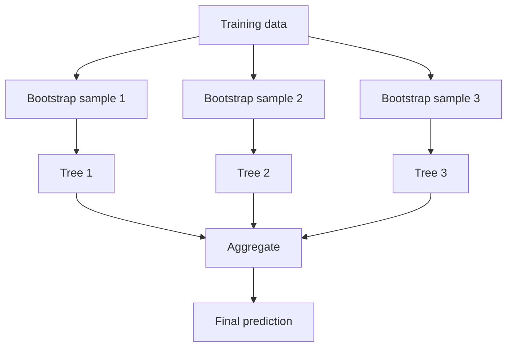

## What bagging is

Bagging = **Bootstrap Aggregating**.

Steps:

1. sample (with replacement) multiple datasets from the training set
2. train one model per sample
3. aggregate predictions (vote/average)



## Bagging vs. pasting

Per *Hands-On Machine Learning*, both bagging and pasting train the **same algorithm**
on different random subsets of the training set — the only difference is whether
sampling is done **with** replacement or **without**:

- **bagging** — sampling *with* replacement (an instance can be picked more than once
  by the same predictor)
- **pasting** — sampling *without* replacement

Each individual predictor ends up with higher bias than if it saw the full training set,
but aggregating many of them reduces both bias and variance — the net effect is an
ensemble with similar bias but noticeably lower variance than a single predictor. Because
bagging's extra resampling adds more diversity, it usually produces slightly better
models than pasting, which is why it's the default. Both scale beautifully because every
predictor can be trained (and later queried) fully in parallel.

```python title="BaggingClassifier from scratch" showLineNumbers{1}
from sklearn.ensemble import BaggingClassifier
from sklearn.tree import DecisionTreeClassifier
from sklearn.datasets import make_moons
from sklearn.model_selection import train_test_split

X, y = make_moons(n_samples=500, noise=0.30, random_state=42)
X_train, X_test, y_train, y_test = train_test_split(X, y, random_state=42)

# 500 trees, each trained on 100 instances sampled WITH replacement (bagging)
bag_clf = BaggingClassifier(
    DecisionTreeClassifier(),
    n_estimators=500,
    max_samples=100,
    bootstrap=True,     # set to False for pasting
    n_jobs=-1,
    random_state=42,
)
bag_clf.fit(X_train, y_train)
print("Test accuracy:", round(bag_clf.score(X_test, y_test), 3))
```

`BaggingClassifier` automatically switches to **soft voting** instead of hard voting
whenever the base estimator can output class probabilities — which Decision Trees can.

## Out-of-bag (OOB) evaluation

With bagging, each predictor only ever sees about 63% of the training instances on
average (as *m* grows, this ratio approaches `1 - exp(-1) ≈ 63.2%`). The remaining ~37%
— the **out-of-bag** instances — are never seen by that predictor during training, so
they make a free validation set. Set `oob_score=True` and scikit-learn will average the
OOB evaluations across all predictors for you, with no need for a separate holdout set.

```python title="Out-of-bag evaluation" showLineNumbers{1}
from sklearn.ensemble import BaggingClassifier
from sklearn.tree import DecisionTreeClassifier
from sklearn.datasets import make_moons

X, y = make_moons(n_samples=500, noise=0.30, random_state=42)

bag_clf = BaggingClassifier(
    DecisionTreeClassifier(),
    n_estimators=500,
    bootstrap=True,
    oob_score=True,
    n_jobs=-1,
    random_state=42,
)
bag_clf.fit(X, y)
print("OOB score:", round(bag_clf.oob_score_, 3))
```

## Random Patches and Random Subspaces

`BaggingClassifier` can also sample **features**, controlled by `max_features` and
`bootstrap_features` (they work just like `max_samples`/`bootstrap`, but for columns
instead of rows). This is especially useful on high-dimensional data such as images:

- sampling both instances **and** features → **Random Patches**
- keeping all instances but sampling features → **Random Subspaces**

## Random Forest in one line

A **Random Forest** is bagging + decision trees + random feature selection at each split.

Instead of hand-assembling a `BaggingClassifier` around `DecisionTreeClassifier`, use the
dedicated, tree-optimized `RandomForestClassifier` / `RandomForestRegressor` classes.
Random Forests add one extra trick beyond plain bagging: instead of searching every
feature for the best split at each node, each tree only considers a **random subset of
features**. This randomness increases diversity → improves generalization.

## Classification vs regression

- RandomForestClassifier: majority vote
- RandomForestRegressor: average prediction

## Scikit-learn examples

```python title="Random Forest (classification)" showLineNumbers{1}
from sklearn.ensemble import RandomForestClassifier

rf = RandomForestClassifier(
    n_estimators=200,
    max_depth=None,
    random_state=42,
    n_jobs=-1,
)
```

```python title="Random Forest (regression)" showLineNumbers{1}
from sklearn.ensemble import RandomForestRegressor

rf = RandomForestRegressor(
    n_estimators=300,
    random_state=42,
    n_jobs=-1,
)
```

## Extra-Trees

Push the randomness one step further: instead of searching for the best possible
threshold for each candidate feature, pick a **random threshold** too. A forest built
this way is called **Extremely Randomized Trees**, or **Extra-Trees**. It trades a bit
more bias for lower variance, and since it skips the expensive threshold search, it also
trains noticeably faster than a regular Random Forest. `ExtraTreesClassifier` /
`ExtraTreesRegressor` share the exact same API as their Random Forest counterparts — the
only way to know which will perform better on your data is to try both.

## Feature importance

One of the best perks of Random Forests: they make it easy to rank feature importance.
Scikit-learn measures how much each tree node that uses a feature reduces impurity on
average (weighted by how many samples reach that node), then scales the results so they
sum to 1. Access them via `feature_importances_`:

```python title="Feature importance on the iris dataset" showLineNumbers{1}
from sklearn.datasets import load_iris
from sklearn.ensemble import RandomForestClassifier

iris = load_iris()
rnd_clf = RandomForestClassifier(n_estimators=200, random_state=42)
rnd_clf.fit(iris.data, iris.target)

for name, score in zip(iris.feature_names, rnd_clf.feature_importances_):
    print(name, round(score, 3))
```

```
sepal length (cm) 0.102
sepal width (cm)  0.021
petal length (cm) 0.459
petal width (cm)  0.418
```

Petal length and width dominate — sepal measurements barely matter. This makes Random
Forests a quick, handy tool for feature selection even before you commit to a final model.

## Useful hyperparameters

- `n_estimators`: more trees → better but slower
- `max_depth`: limits overfitting
- `min_samples_leaf`: smooths leaves
- `max_features`: controls feature randomness

:::tip[From the book]
Géron's rule of thumb: a `RandomForestClassifier` has (almost) all the hyperparameters
of a `DecisionTreeClassifier` for controlling tree growth, *plus* all the hyperparameters
of a `BaggingClassifier` for controlling the ensemble — with `bootstrap`, `max_samples`,
and the base estimator effectively fixed for you under the hood.
:::

## Visualize it

Every bootstrap sample ("bag") is drawn **with replacement** from the same training set,
so some instances get picked multiple times while others are skipped entirely — those
skipped instances are the out-of-bag ones used for free validation:

```p5 title="Bootstrap sampling for bagging" desc="Each bag resamples the training set with replacement — on average about 37% of instances are left out-of-bag (gray) every round." height="300"
const M = 40;
let counts = [];
let bagNum = 0;
let t = 0;
function newBag() {
  counts = new Array(M).fill(0);
  for (let i = 0; i < M; i++) {
    const pick = floor(random(M));
    counts[pick]++;
  }
  bagNum++;
  t = 0;
}
function setup() {
  createCanvas(600, 300);
  textFont("monospace");
  newBag();
}
function draw() {
  background(13, 17, 23);
  const cols = 10, rows = 4;
  const cellW = (width - 60) / cols, cellH = 130 / rows;
  let oob = 0;
  for (let i = 0; i < M; i++) {
    const cx = 30 + (i % cols) * cellW + cellW / 2;
    const cy = 60 + floor(i / cols) * cellH + cellH / 2;
    const c = counts[i];
    if (c === 0) { fill(90, 90, 100); oob++; }
    else if (c === 1) fill(75, 139, 190);
    else fill(255, 211, 67);
    noStroke();
    const s = 14 + min(c, 3) * 4;
    ellipse(cx, cy, s, s);
    fill(20);
    textSize(9);
    textAlign(CENTER, CENTER);
    if (c > 0) text(c, cx, cy);
  }
  fill(210);
  textSize(13);
  textAlign(LEFT, TOP);
  text("Bag #" + bagNum + "  —  out-of-bag: " + oob + "/" + M + " (" + (100 * oob / M).toFixed(0) + "%)", 30, 20);
  fill(150);
  textSize(11);
  text("gray = out-of-bag   blue = sampled once   yellow = sampled 2+ times", 30, 250);

  t++;
  if (t > 90) newBag();
}
function mousePressed() { newBag(); }
```

## Mini-checkpoint

First try:

- deep trees in forest
- tune `max_depth` and `min_samples_leaf` if overfitting

import DataCampExercise from "../../../../components/DataCampExercise.astro";

## 🧪 Try It Yourself

### Exercise 1 – Bagging vs Pasting

<DataCampExercise
  lang="python"
  hint={`Sampling *with* replacement is bagging — that's \`bootstrap=True\`.`}
  code={`# Task: Exercise 1 – Bagging vs Pasting
from sklearn.ensemble import BaggingClassifier
from sklearn.tree import DecisionTreeClassifier

bag_clf = BaggingClassifier(
    DecisionTreeClassifier(),
    n_estimators=500,
    max_samples=100,
    bootstrap=___,   # replace ___ with True
    n_jobs=-1,
    random_state=42,
)
print(bag_clf.bootstrap)

# ── Expected Output ───────────────────────────────────────────
# True
# ──────────────────────────────────────────────────────────────`}
  solution={`from sklearn.ensemble import BaggingClassifier
from sklearn.tree import DecisionTreeClassifier

bag_clf = BaggingClassifier(
    DecisionTreeClassifier(),
    n_estimators=500,
    max_samples=100,
    bootstrap=True,
    n_jobs=-1,
    random_state=42,
)
print(bag_clf.bootstrap)`}
  sct={`test_output_contains("True")
success_msg("That's bagging! Set it to False and you'd get pasting instead.")`}
  height={158}
/>

### Exercise 2 – Free Validation with OOB Score

<DataCampExercise
  lang="python"
  hint={`Turn on \`oob_score=True\`, then fit and read \`.oob_score_\`.`}
  code={`# Task: Exercise 2 – Free Validation with OOB Score
from sklearn.ensemble import BaggingClassifier
from sklearn.tree import DecisionTreeClassifier
from sklearn.datasets import make_moons

X, y = make_moons(n_samples=300, noise=0.30, random_state=42)

bag_clf = BaggingClassifier(
    DecisionTreeClassifier(),
    n_estimators=200,
    bootstrap=True,
    oob_score=___,   # replace ___ with True
    n_jobs=-1,
    random_state=42,
)
bag_clf.fit(X, y)
print(bag_clf.oob_score_ > 0.5)

# ── Expected Output ───────────────────────────────────────────
# True
# ──────────────────────────────────────────────────────────────`}
  solution={`from sklearn.ensemble import BaggingClassifier
from sklearn.tree import DecisionTreeClassifier
from sklearn.datasets import make_moons

X, y = make_moons(n_samples=300, noise=0.30, random_state=42)

bag_clf = BaggingClassifier(
    DecisionTreeClassifier(),
    n_estimators=200,
    bootstrap=True,
    oob_score=True,
    n_jobs=-1,
    random_state=42,
)
bag_clf.fit(X, y)
print(bag_clf.oob_score_ > 0.5)`}
  sct={`test_output_contains("True")
success_msg("No separate validation set needed — the out-of-bag instances did the job!")`}
  height={168}
/>

### Exercise 3 – Rank Feature Importance

<DataCampExercise
  lang="python"
  hint={`Call \`.fit()\` first, then \`.feature_importances_.argmax()\` finds the top feature's index.`}
  code={`# Task: Exercise 3 – Rank Feature Importance
from sklearn.datasets import load_iris
from sklearn.ensemble import RandomForestClassifier

iris = load_iris()
rnd_clf = RandomForestClassifier(n_estimators=200, random_state=42)
rnd_clf.___(iris.data, iris.target)   # replace ___ with fit

importances = rnd_clf.feature_importances_
top_feature = iris.feature_names[importances.argmax()]
print("Most important feature:", top_feature)

# ── Expected Output ───────────────────────────────────────────
# Most important feature: petal length (cm)
# ──────────────────────────────────────────────────────────────`}
  solution={`from sklearn.datasets import load_iris
from sklearn.ensemble import RandomForestClassifier

iris = load_iris()
rnd_clf = RandomForestClassifier(n_estimators=200, random_state=42)
rnd_clf.fit(iris.data, iris.target)

importances = rnd_clf.feature_importances_
top_feature = iris.feature_names[importances.argmax()]
print("Most important feature:", top_feature)`}
  sct={`test_output_contains("petal length")
success_msg("Random Forests make feature selection almost free!")`}
  height={168}
/>

## Next

Continue to **Boosting: Introduction to AdaBoost** — instead of training trees in
parallel on random subsets, boosting trains them one after another, each one focusing
harder on the mistakes of the last.
