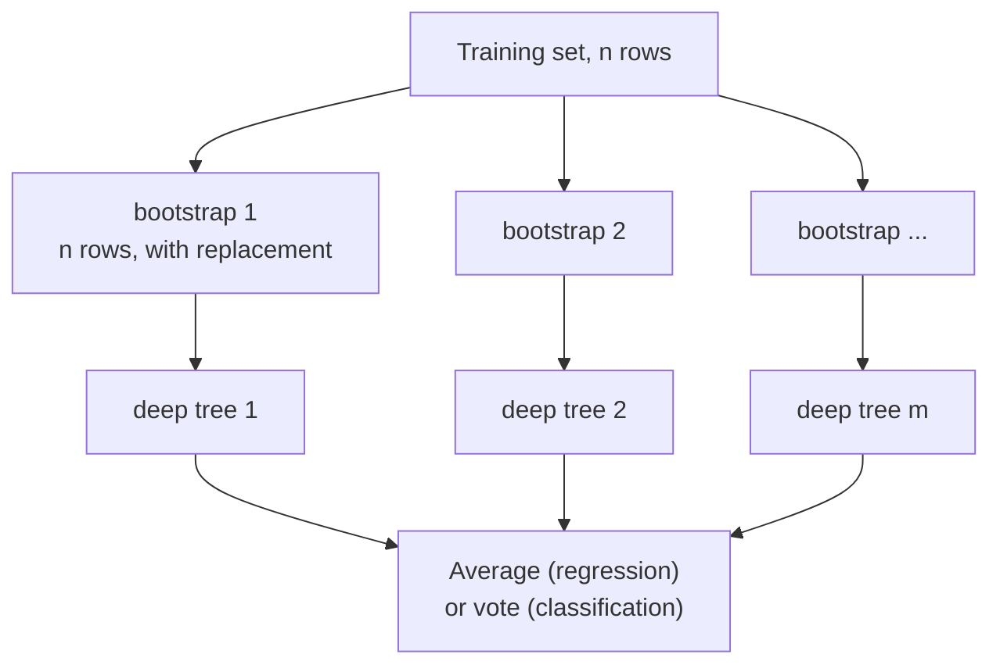

import DataCampExercise from "../../../../components/DataCampExercise.astro";
import AlgorithmCard from "../../../../components/AlgorithmCard.astro";
import Figure from "../../../../components/Figure.astro";
import Quiz from "../../../../components/Quiz.astro";

## What you'll learn

- the bootstrap, and the derivation of the **63.2% / 36.8%** split
- **out-of-bag scoring** — a validation estimate that costs nothing
- bagging against pasting, and why the resampling that seems wasteful wins
- what a random forest adds beyond bagging, and why it lowers correlation
- **Extra-Trees**, which makes each tree worse and the ensemble better
- why `feature_importances_` favours high-cardinality columns, measured

## Intuition

[The Power of Ensembles](/machine-learning/phase-05---ensemble-learning/the-power-of-ensembles-why-combine-models/)
established that averaging cancels variance only when the members disagree. Bagging manufactures
that disagreement mechanically: **train each model on a different random sample of the same data.**

A deep decision tree is the ideal member. It has low bias, catastrophic variance, and — because the
greedy split search amplifies small differences — two trees grown on slightly different samples can
look nothing alike. High variance and low correlation are exactly what averaging needs.



## The math: what a bootstrap sample contains

Draw $n$ rows **with replacement** from a set of $n$. For any particular row, the chance of not
being picked on one draw is $1 - 1/n$, and the draws are independent:

$$
P(\text{row never drawn}) = \left(1 - \frac{1}{n}\right)^{n}
$$

As $n$ grows this converges to a familiar constant:

$$
\lim_{n\to\infty}\left(1 - \frac{1}{n}\right)^{n} = e^{-1} \approx 0.3679
$$

$$
\boxed{\;\text{in-bag} \approx 63.2\%, \qquad \text{out-of-bag} \approx 36.8\%\;}
$$

<Figure
  src="/images/ml/phase-05-ensembles/bagging/bootstrap-coverage"
  alt="Curve of the expected fraction of distinct rows in a bootstrap sample against n, dropping quickly from 0.67 and flattening at 0.632."
  title="Coverage converges almost immediately"
  caption="At n = 20 the fraction is already 0.6415; by n = 100 it is 0.6340. The limit 1 - 1/e = 0.6321 is reached for practical purposes almost at once."
/>

| $n$ | fraction of distinct rows |
| --- | --- |
| 5 | 0.6723 |
| 20 | 0.6415 |
| 100 | 0.6340 |
| 1,000 | 0.6323 |
| $\infty$ | **0.6321** |

Each tree therefore misses about a third of the data — and **those rows are a ready-made validation
set for that tree**, at no extra cost.

## See it move

Twenty rows, drawn with replacement twenty times. Watch which rows get picked more than once and
which are left out entirely — the leftovers are that tree's out-of-bag set.

```p5 title="Drawing a bootstrap sample" desc="Twenty rows are drawn with replacement. Rows picked once or more turn blue with their count; rows never picked stay amber and form the out-of-bag set." height="330"
const N = 20;
let counts = [], draws = 0, t = 0, history = [];
function reset() {
  counts = new Array(N).fill(0);
  draws = 0;
  t = 0;
}
function setup() {
  createCanvas(600, 330);
  textFont("monospace");
  reset();
}
function draw() {
  background(13, 17, 23);
  const cols = 10, cell = 46, ox = 60, oy = 70;
  noStroke();
  for (let i = 0; i < N; i++) {
    const cx = ox + (i % cols) * cell;
    const cy = oy + Math.floor(i / cols) * cell;
    const c = counts[i];
    fill(c === 0 ? color(255, 211, 67) : color(75, 139, 190, 90 + Math.min(c, 4) * 40));
    rect(cx, cy, cell - 6, cell - 6, 6);
    fill(c === 0 ? color(13, 17, 23) : color(235));
    textSize(13);
    textAlign(CENTER, CENTER);
    text(c, cx + (cell - 6) / 2, cy + (cell - 6) / 2);
  }

  const inBag = counts.filter((c) => c > 0).length;
  const oob = N - inBag;

  fill(180);
  textSize(11);
  textAlign(LEFT, BOTTOM);
  text("20 training rows; the number is how many times each was drawn", ox, oy - 12);

  fill(75, 139, 190);
  textSize(13);
  textAlign(LEFT, TOP);
  text("in-bag " + inBag + " of " + N + "  (" + (100 * inBag / N).toFixed(0) + "%)", ox, oy + 110);
  fill(255, 211, 67);
  text("out-of-bag " + oob + "  (" + (100 * oob / N).toFixed(0) + "%)", ox + 230, oy + 110);

  if (history.length) {
    const avg = history.reduce((a, b) => a + b, 0) / history.length;
    fill(120, 200, 120);
    textSize(12);
    text("average in-bag over " + history.length + " samples: " + (100 * avg).toFixed(1) + "%",
         ox, oy + 140);
    fill(150);
    textSize(11);
    text("theory: 63.2%", ox, oy + 162);
  }

  fill(140);
  textSize(10);
  textAlign(LEFT, BOTTOM);
  text("draws: " + draws + " of " + N + "     click to start a new bootstrap sample", ox, height - 12);

  t++;
  if (t % 7 === 0 && draws < N) {
    counts[Math.floor(random(N))]++;
    draws++;
    if (draws === N) history.push(counts.filter((c) => c > 0).length / N);
  }
  if (draws === N && t % 7 === 0 && t > N * 7 + 60) reset();
}
function mousePressed() { reset(); }
```

## Out-of-bag scoring

For each training row, average the predictions of only those trees that never saw it. That is a
genuine held-out estimate, computed during training, using data you already paid for.

```python title="oob.py" showLineNumbers{1}
from sklearn.datasets import make_moons
from sklearn.ensemble import RandomForestClassifier
from sklearn.model_selection import train_test_split

X, y = make_moons(n_samples=800, noise=0.32, random_state=4)
X_tr, X_te, y_tr, y_te = train_test_split(X, y, test_size=0.3, random_state=0)

for n in (10, 100, 400):
    forest = RandomForestClassifier(n_estimators=n, oob_score=True,
                                    random_state=0, n_jobs=-1).fit(X_tr, y_tr)
    print(f"n={n:<4} oob {forest.oob_score_:.4f}   held-out test {forest.score(X_te, y_te):.4f}")

# n=10   oob 0.8482   held-out test 0.9250
# n=100  oob 0.8857   held-out test 0.9333
# n=400  oob 0.8946   held-out test 0.9292
```

Two honest observations:

- **OOB is systematically pessimistic**, by 3 to 4 points here. Each row is scored by only the ~37%
  of trees that excluded it, so the effective ensemble is a third the size.
- **The pessimism shrinks as trees are added**, from 7.7 points at $n = 10$ to 3.5 at $n = 400$. At
  10 trees only about 4 vote on each row, which is not an ensemble.

Use OOB for quick iteration on large data where cross-validation is expensive. Use cross-validation
for the number you report.

## Bagging against pasting

**Bagging** samples with replacement; **pasting** samples without. Pasting sounds cleaner — no
duplicated rows — and it loses:

```python title="bagging_vs_pasting.py" showLineNumbers{1}
from sklearn.ensemble import BaggingClassifier
from sklearn.tree import DecisionTreeClassifier

bagging = BaggingClassifier(DecisionTreeClassifier(), n_estimators=100,
                            bootstrap=True, oob_score=True,
                            random_state=0, n_jobs=-1).fit(X_tr, y_tr)
pasting = BaggingClassifier(DecisionTreeClassifier(), n_estimators=100,
                            bootstrap=False,
                            random_state=0, n_jobs=-1).fit(X_tr, y_tr)

print(f"bagging  test {bagging.score(X_te, y_te):.4f}   oob {bagging.oob_score_:.4f}")
print(f"pasting  test {pasting.score(X_te, y_te):.4f}")

# bagging  test 0.9417   oob 0.8786
# pasting  test 0.8833
```

**Bagging wins by 5.8 points.** The reason is the correlation term from the previous page:
sampling *with* replacement makes the training sets more different from each other, so $\rho$
falls. Each individual tree is slightly worse — it has seen only 63% of the distinct rows — and the
ensemble is much better. Duplicated rows are a feature.

Pasting without replacement on 100 estimators reuses nearly the same rows every time, so the trees
are near-identical and averaging them accomplishes little.

## What a random forest adds

Bagging alone leaves a problem. If one feature is strongly predictive, **every** tree will split on
it first, whatever rows it received. The trees stay correlated through the feature, not the data.

A random forest fixes this by sampling **features at each split**, not just rows:

$$
\text{max\_features} = \sqrt{n} \;\text{(classification)}, \qquad
\text{max\_features} = n \;\text{(regression, scikit-learn default)}
$$

With $\sqrt{n}$ features considered per split, the dominant feature is unavailable for most splits,
forcing trees to find alternative structure. Individual trees get worse; $\rho$ drops; the ensemble
improves.

<Figure
  src="/images/ml/phase-05-ensembles/bagging/variance-reduction"
  alt="Three panels of the same two-moons data showing predicted probability surfaces for one tree, ten trees and 300 trees. The single tree has hard-edged rectangular regions; 300 trees produce a smooth gradient."
  title="One tree, ten trees, three hundred"
  caption="The single tree is certain everywhere and wrong in places. The forest's surface is smooth, and the shading near the boundary is genuine uncertainty rather than a hard edge."
/>

<Figure
  src="/images/ml/phase-05-ensembles/bagging/n-estimators-curve"
  alt="Held-out accuracy and out-of-bag estimate plotted against the number of trees on a log scale, both rising steeply then plateauing after about 60 trees."
  title="Where adding trees stops paying"
  caption="Both curves flatten by roughly 60 trees. More trees never hurt accuracy — unlike almost every other capacity knob — they simply cost time and memory."
/>

### Reading the plot

1. **`n_estimators` is not a regularisation parameter.** Adding trees cannot overfit; each is an
   independent draw and the average converges. Anything else in this curriculum with "more" on the
   dial eventually turns against you.
2. **The plateau arrives quickly.** By 60 trees the curve is flat. Going 100 → 400 changed held-out
   accuracy from 0.9333 to 0.9292 — noise, not improvement.
3. **OOB tracks the test curve in shape**, sitting a few points below. Useful for choosing
   `n_estimators` even though its level is pessimistic.

**Set `n_estimators` as high as your latency budget allows**, then tune the parameters that
actually trade off — `max_depth`, `min_samples_leaf`, `max_features`.

## Extra-Trees

Extremely Randomised Trees go one step further: instead of searching for the best threshold on each
sampled feature, they pick thresholds **at random** and keep the best of those.

| | Random Forest | Extra-Trees |
| --- | --- | --- |
| Rows | Bootstrap sample | Whole set by default |
| Features per split | Random subset | Random subset |
| Threshold | Best found by search | **Random**, best of the random ones |
| Individual tree quality | Better | Worse |
| Correlation between trees | Higher | **Lower** |
| Training speed | Slower | **Much faster** — no threshold search |

Measured on the same split: random forest 0.9333, Extra-Trees **0.9375**. Deliberately worse
members, a better ensemble, and faster to train. It is worth trying whenever a forest is your
baseline.

## Feature importance lies

<Figure
  src="/images/ml/phase-05-ensembles/bagging/importance-bias"
  alt="Two bar charts of the same forest's feature importances. Impurity importance gives the continuous noise feature 0.22, more than the informative binary feature. Permutation importance gives it approximately zero."
  title="Four features: two informative, two pure noise"
  caption="Impurity importance ranks the continuous noise column above the informative binary one. Permutation importance, measured on held-out data, correctly gives it nothing."
/>

Measured on a constructed dataset where two columns carry signal and two are pure noise:

| Feature | Impurity importance | Permutation importance |
| --- | --- | --- |
| signal, continuous | 0.5902 | **+0.2785** |
| signal, binary | 0.1727 | +0.0206 |
| **noise, continuous** | **0.2245** | **−0.0089** |
| noise, binary | 0.0126 | +0.0006 |

**Impurity importance ranks a pure-noise column second**, above a genuinely informative one. The
mechanism is mechanical: a continuous feature offers hundreds of candidate split points, a binary
feature offers exactly one. More chances to win a split by luck means more accumulated impurity
reduction.

Permutation importance shuffles one column in the **held-out** data and measures how much the score
drops. Noise scores zero because destroying noise costs nothing.

```python title="permutation_importance.py" showLineNumbers{1}
from sklearn.inspection import permutation_importance

result = permutation_importance(forest, X_test, y_test,
                                n_repeats=15, random_state=0, n_jobs=-1)

for name, mean, std in sorted(zip(names, result.importances_mean,
                                  result.importances_std),
                              key=lambda row: -row[1]):
    print(f"{name:<14} {mean:+.4f} +/- {std:.4f}")
```

:::caution[Permutation importance has its own failure mode]
With two correlated columns, shuffling one leaves the model able to recover the information from
the other, so **both** look unimportant. Check the correlation matrix before concluding a feature
is useless.
:::

<AlgorithmCard
  name="Random Forest"
  type="Supervised · Classification and Regression · Bagging ensemble"
  sklearn="sklearn.ensemble.RandomForestClassifier / RandomForestRegressor"
  assumptions={[
    "The base learner is high-variance and low-bias — a deep tree",
    "Bootstrap samples and feature subsets produce genuinely different trees",
    "Axis-aligned rectangular regions can approximate the target",
  ]}
  complexity={{ train: "O(m · n · log m · trees)", predict: "O(depth · trees)", memory: "O(nodes · trees)" }}
  notation="m = samples, n = features; training parallelises perfectly across trees"
  hyperparams={[
    { name: "n_estimators", default: "100", effect: "More is never worse for accuracy, only slower. Set it by your latency budget; the curve plateaus around 60 to 100 here." },
    { name: "max_features", default: "sqrt (clf) / 1.0 (reg)", effect: "The correlation dial. Lower means more diverse, weaker trees. Worth tuning — regression often benefits from about 0.3." },
    { name: "max_depth", default: "None", effect: "Unlimited is usually right for a forest, because averaging handles the variance a single tree could not." },
    { name: "min_samples_leaf", default: "1", effect: "Raise to 5 to 20 on noisy data — the most effective regularisation knob here." },
    { name: "oob_score", default: "False", effect: "Enables the free validation estimate. Pessimistic by a few points, and it needs enough trees to be stable." },
    { name: "class_weight", default: "None", effect: "'balanced_subsample' reweights per bootstrap sample, which is the right variant for imbalanced data." },
  ]}
  useWhen={[
    "You want a strong tabular baseline with almost no tuning",
    "Features are on mixed scales and you do not want to preprocess",
    "You need something robust to outliers and irrelevant columns",
    "Training can be parallelised across cores",
  ]}
  avoidWhen={[
    "You need an interpretable model — 300 trees is not a set of rules",
    "Prediction latency is tight; every tree runs on every request",
    "The data is very high-dimensional and sparse, such as text — linear models win there",
    "You need to extrapolate beyond the training range; trees predict a constant outside it",
  ]}
/>

## Pitfalls

:::caution[Tuning `n_estimators` as if it could overfit]
It cannot. Time spent searching over 100 against 500 trees is better spent on `max_features` or
`min_samples_leaf`. Set it high and move on.
:::

:::danger[Trusting `feature_importances_`]
It ranked pure noise second in the measurement above. Use `permutation_importance` on held-out data
for any ranking you intend to act on.
:::

:::caution[Expecting a forest to extrapolate]
Every leaf predicts a constant, so predictions outside the training range are flat. A forest
trained on prices up to 500k will never predict 900k, however large the house.
:::

:::caution[Out-of-bag scores with too few trees]
At 10 trees only about 4 vote on each row, and scikit-learn may warn that some rows have no OOB
prediction at all. Below roughly 50 trees the estimate is unreliable.
:::

## Compare

| Model | Trains in parallel | Overfits with more members | Needs scaling | Interpretable |
| --- | --- | --- | --- | --- |
| Single tree | — | Yes, with depth | No | Yes, when shallow |
| **Random Forest** | Yes | **No** | No | No |
| Extra-Trees | Yes | No | No | No |
| AdaBoost | No — sequential | Yes | No | No |
| Gradient Boosting | No — sequential | Yes | No | No |

The "trains in parallel" column is the practical difference between this page and the next two.
Bagging is embarrassingly parallel; boosting is inherently sequential.

<Quiz
  questions={[
    {
      q: "Why does a bootstrap sample contain only about 63.2% of the distinct rows?",
      options: [
        "Because scikit-learn samples 63% by default",
        "Because P(a row is never drawn in n draws with replacement) = (1 - 1/n)^n, which converges to 1/e = 0.368",
        "Because duplicates are removed",
        "Because 37% is held out deliberately",
      ],
      answer: 1,
      explain: "It falls straight out of sampling with replacement. The missing 36.8% is what makes out-of-bag scoring free.",
    },
    {
      q: "Bagging scored 0.9417 and pasting 0.8833 on the same data. Why does sampling with replacement win?",
      options: [
        "Bagging uses more data",
        "Replacement makes the training sets more different from each other, lowering correlation between trees — and correlation is what caps the averaging gain",
        "Pasting has a bug",
        "Duplicated rows carry extra information",
      ],
      answer: 1,
      explain: "Each bagged tree is slightly worse for seeing only 63% of distinct rows, and the ensemble is much better because rho fell.",
    },
    {
      q: "What does a random forest add on top of bagging?",
      options: [
        "It uses more trees",
        "It samples a random subset of features at every split, so trees cannot all key on the same dominant feature",
        "It uses a different loss function",
        "It prunes each tree",
      ],
      answer: 1,
      explain: "Row sampling alone leaves trees correlated through a dominant feature. Feature sampling at each split forces them to find alternative structure.",
    },
    {
      q: "Impurity importance gave a pure-noise continuous column 0.2245 — second highest. Why?",
      options: [
        "The column was not really noise",
        "A continuous column offers hundreds of candidate thresholds, so it wins splits by chance far more often than a binary column with one",
        "The forest was undertrained",
        "Impurity importance is broken and should never be used",
      ],
      answer: 1,
      explain: "The bias is mechanical and favours high-cardinality features. Permutation importance on held-out data correctly scored the same column at -0.0089.",
    },
  ]}
/>

## 🧪 Try It Yourself

### Exercise 1 – Derive the 63.2%

<DataCampExercise
  lang="python"
  hint={`The chance a row is never drawn is (1 - 1/n) to the power n.`}
  code={`# Task: Exercise 1 - Derive the 63.2%
import numpy as np

for n in (5, 20, 100, 1000):
    included = 1 - (1 - 1 / n) ___ n         # replace ___ with **
    print(f"n={n:>5}: in-bag {included:.4f}  out-of-bag {1 - included:.4f}")

print("limit:", round(1 - 1 / np.e, 4))

# -- Expected Output -------------------------------------------
# n=    5: in-bag 0.6723  out-of-bag 0.3277
# n=   20: in-bag 0.6415  out-of-bag 0.3585
# n=  100: in-bag 0.6340  out-of-bag 0.3660
# n= 1000: in-bag 0.6323  out-of-bag 0.3677
# limit: 0.6321
# --------------------------------------------------------------`}
  solution={`import numpy as np

for n in (5, 20, 100, 1000):
    included = 1 - (1 - 1 / n) ** n
    print(f"n={n:>5}: in-bag {included:.4f}  out-of-bag {1 - included:.4f}")
print("limit:", round(1 - 1 / np.e, 4))`}
  sct={`test_output_contains("limit: 0.6321")
success_msg("That leftover 36.8% is the out-of-bag set, and it costs nothing.")`}
  height={198}
/>

### Exercise 2 – Free validation with out-of-bag scoring

<DataCampExercise
  lang="python"
  hint={`Pass oob_score=True and read oob_score_ after fitting.`}
  code={`# Task: Exercise 2 - Free validation with out-of-bag scoring
from sklearn.datasets import make_moons
from sklearn.ensemble import RandomForestClassifier
from sklearn.model_selection import train_test_split

X, y = make_moons(n_samples=800, noise=0.32, random_state=4)
X_tr, X_te, y_tr, y_te = train_test_split(X, y, test_size=0.3, random_state=0)

forest = RandomForestClassifier(n_estimators=100, oob_score=___,
                                random_state=0, n_jobs=-1).fit(X_tr, y_tr)
# replace ___ with True

print("oob estimate:", round(forest.oob_score_, 4))
print("held-out test:", round(forest.score(X_te, y_te), 4))
print("oob is pessimistic:", forest.oob_score_ < forest.score(X_te, y_te))

# -- Expected Output -------------------------------------------
# oob estimate: 0.8857
# held-out test: 0.9333
# oob is pessimistic: True
# --------------------------------------------------------------`}
  solution={`from sklearn.datasets import make_moons
from sklearn.ensemble import RandomForestClassifier
from sklearn.model_selection import train_test_split

X, y = make_moons(n_samples=800, noise=0.32, random_state=4)
X_tr, X_te, y_tr, y_te = train_test_split(X, y, test_size=0.3, random_state=0)
forest = RandomForestClassifier(n_estimators=100, oob_score=True,
                                random_state=0, n_jobs=-1).fit(X_tr, y_tr)
print("oob estimate:", round(forest.oob_score_, 4))
print("held-out test:", round(forest.score(X_te, y_te), 4))
print("oob is pessimistic:", forest.oob_score_ < forest.score(X_te, y_te))`}
  sct={`test_output_contains("oob is pessimistic: True")
success_msg("A validation number during training — pessimistic, but free.")`}
  height={218}
/>

### Exercise 3 – Bagging against pasting

<DataCampExercise
  lang="python"
  hint={`bootstrap=True is bagging; bootstrap=False is pasting.`}
  code={`# Task: Exercise 3 - Bagging against pasting
from sklearn.datasets import make_moons
from sklearn.ensemble import BaggingClassifier
from sklearn.model_selection import train_test_split
from sklearn.tree import DecisionTreeClassifier

X, y = make_moons(n_samples=800, noise=0.32, random_state=4)
X_tr, X_te, y_tr, y_te = train_test_split(X, y, test_size=0.3, random_state=0)

bag = BaggingClassifier(DecisionTreeClassifier(), n_estimators=100,
                        bootstrap=True, random_state=0, n_jobs=-1).fit(X_tr, y_tr)
paste = BaggingClassifier(DecisionTreeClassifier(), n_estimators=100,
                          bootstrap=___, random_state=0,
                          n_jobs=-1).fit(X_tr, y_tr)      # replace ___ with False

print("bagging:", round(bag.score(X_te, y_te), 4))
print("pasting:", round(paste.score(X_te, y_te), 4))
print("bagging wins:", bag.score(X_te, y_te) > paste.score(X_te, y_te))

# -- Expected Output -------------------------------------------
# bagging: 0.9417
# pasting: 0.8833
# bagging wins: True
# --------------------------------------------------------------`}
  solution={`from sklearn.datasets import make_moons
from sklearn.ensemble import BaggingClassifier
from sklearn.model_selection import train_test_split
from sklearn.tree import DecisionTreeClassifier

X, y = make_moons(n_samples=800, noise=0.32, random_state=4)
X_tr, X_te, y_tr, y_te = train_test_split(X, y, test_size=0.3, random_state=0)
bag = BaggingClassifier(DecisionTreeClassifier(), n_estimators=100,
                        bootstrap=True, random_state=0, n_jobs=-1).fit(X_tr, y_tr)
paste = BaggingClassifier(DecisionTreeClassifier(), n_estimators=100,
                          bootstrap=False, random_state=0, n_jobs=-1).fit(X_tr, y_tr)
print("bagging:", round(bag.score(X_te, y_te), 4))
print("pasting:", round(paste.score(X_te, y_te), 4))
print("bagging wins:", bag.score(X_te, y_te) > paste.score(X_te, y_te))`}
  sct={`test_output_contains("bagging wins: True")
success_msg("Duplicated rows made each tree worse and the ensemble 5.8 points better.")`}
  height={238}
/>

### Exercise 4 – Extra-Trees against a forest

<DataCampExercise
  lang="python"
  hint={`ExtraTreesClassifier is a drop-in replacement for RandomForestClassifier.`}
  code={`# Task: Exercise 4 - Extra-Trees against a forest
from sklearn.datasets import make_moons
from sklearn.ensemble import ___, RandomForestClassifier   # replace ___ with ExtraTreesClassifier
from sklearn.model_selection import train_test_split

X, y = make_moons(n_samples=800, noise=0.32, random_state=4)
X_tr, X_te, y_tr, y_te = train_test_split(X, y, test_size=0.3, random_state=0)

rf = RandomForestClassifier(n_estimators=100, random_state=0,
                            n_jobs=-1).fit(X_tr, y_tr)
et = ExtraTreesClassifier(n_estimators=100, random_state=0,
                          n_jobs=-1).fit(X_tr, y_tr)

print("random forest:", round(rf.score(X_te, y_te), 4))
print("extra-trees:", round(et.score(X_te, y_te), 4))
print("extra-trees wins:", et.score(X_te, y_te) > rf.score(X_te, y_te))

# -- Expected Output -------------------------------------------
# random forest: 0.9333
# extra-trees: 0.9375
# extra-trees wins: True
# --------------------------------------------------------------`}
  solution={`from sklearn.datasets import make_moons
from sklearn.ensemble import ExtraTreesClassifier, RandomForestClassifier
from sklearn.model_selection import train_test_split

X, y = make_moons(n_samples=800, noise=0.32, random_state=4)
X_tr, X_te, y_tr, y_te = train_test_split(X, y, test_size=0.3, random_state=0)
rf = RandomForestClassifier(n_estimators=100, random_state=0, n_jobs=-1).fit(X_tr, y_tr)
et = ExtraTreesClassifier(n_estimators=100, random_state=0, n_jobs=-1).fit(X_tr, y_tr)
print("random forest:", round(rf.score(X_te, y_te), 4))
print("extra-trees:", round(et.score(X_te, y_te), 4))
print("extra-trees wins:", et.score(X_te, y_te) > rf.score(X_te, y_te))`}
  sct={`test_output_contains("extra-trees wins: True")
success_msg("Random thresholds make each tree worse, the ensemble better, and training faster.")`}
  height={238}
/>

### Exercise 5 – Catch impurity importance lying

<DataCampExercise
  lang="python"
  hint={`Build two informative and two noise columns, then compare the two importance measures.`}
  code={`# Task: Exercise 5 - Catch impurity importance lying
import numpy as np
from sklearn.ensemble import RandomForestClassifier
from sklearn.inspection import ___          # replace ___ with permutation_importance
from sklearn.model_selection import train_test_split

rng = np.random.default_rng(0)
n = 1200
signal = rng.normal(size=n)
y = (signal + rng.normal(0, 0.6, n) > 0).astype(int)
X = np.c_[signal, (signal > 0).astype(float),
          rng.normal(size=n), rng.integers(0, 2, n).astype(float)]
names = ["signal_cont", "signal_bin", "noise_cont", "noise_bin"]

X_tr, X_te, y_tr, y_te = train_test_split(X, y, test_size=0.3, random_state=0)
rf = RandomForestClassifier(n_estimators=250, random_state=0,
                            n_jobs=-1).fit(X_tr, y_tr)
perm = permutation_importance(rf, X_te, y_te, n_repeats=15,
                              random_state=0, n_jobs=-1)

for nm, imp, pm in zip(names, rf.feature_importances_, perm.importances_mean):
    print(f"{nm:<12} impurity {imp:.4f}   permutation {pm:+.4f}")

# -- Expected Output -------------------------------------------
# signal_cont  impurity 0.5902   permutation +0.2785
# signal_bin   impurity 0.1727   permutation +0.0206
# noise_cont   impurity 0.2245   permutation -0.0089
# noise_bin    impurity 0.0126   permutation +0.0006
# --------------------------------------------------------------`}
  solution={`import numpy as np
from sklearn.ensemble import RandomForestClassifier
from sklearn.inspection import permutation_importance
from sklearn.model_selection import train_test_split

rng = np.random.default_rng(0)
n = 1200
signal = rng.normal(size=n)
y = (signal + rng.normal(0, 0.6, n) > 0).astype(int)
X = np.c_[signal, (signal > 0).astype(float),
          rng.normal(size=n), rng.integers(0, 2, n).astype(float)]
names = ["signal_cont", "signal_bin", "noise_cont", "noise_bin"]
X_tr, X_te, y_tr, y_te = train_test_split(X, y, test_size=0.3, random_state=0)
rf = RandomForestClassifier(n_estimators=250, random_state=0, n_jobs=-1).fit(X_tr, y_tr)
perm = permutation_importance(rf, X_te, y_te, n_repeats=15, random_state=0, n_jobs=-1)
for nm, imp, pm in zip(names, rf.feature_importances_, perm.importances_mean):
    print(f"{nm:<12} impurity {imp:.4f}   permutation {pm:+.4f}")`}
  sct={`test_output_contains("noise_cont  impurity 0.2245")
success_msg("Impurity ranked pure noise second. Permutation scored it below zero.")`}
  height={288}
/>

## Recap

- A bootstrap sample of size $n$ contains $1 - (1-1/n)^n \to 63.2\%$ of the distinct rows; the
  remaining 36.8% is the out-of-bag set.
- OOB scoring is free and systematically pessimistic — 0.8857 against a true 0.9333 at 100 trees.
- Bagging beat pasting 0.9417 to 0.8833, because replacement lowers the correlation between trees.
- A random forest samples features at every split, so no single dominant feature can keep the trees
  correlated.
- Extra-Trees randomises thresholds too: worse trees, lower correlation, better ensemble (0.9375),
  faster training.
- `n_estimators` cannot overfit — set it by your latency budget, and tune `max_features` and
  `min_samples_leaf` instead.
- Impurity importance ranked pure noise second. Use permutation importance on held-out data.

### Exercise 6 – How much of the data does one tree see?

<DataCampExercise
  hint={`A bootstrap sample draws m rows with replacement from m rows. Wrapping the draw in set() counts the distinct ones.`}
  lang="python"
  code={`# Task: Exercise 6 - How much of the data does one tree see?
import numpy as np

rng = np.random.default_rng(0)
for m in (10, 100, 1000, 10000):
    seen = len(___(rng.integers(0, m, m)))      # replace ___ with set
    print(f"m={m:6d}  distinct rows in one bootstrap sample: {seen:6d} "
          f"({seen / m:.4f})")
print(f"the limit is 1 - 1/e = {1 - np.exp(-1):.4f}")
print("the rows left out are the out-of-bag sample, which is where "
      "oob_score_ comes from")

# -- Expected Output -------------------------------------------
# m=    10  distinct rows in one bootstrap sample:      7 (0.7000)
# m=   100  distinct rows in one bootstrap sample:     63 (0.6300)
# m=  1000  distinct rows in one bootstrap sample:    630 (0.6300)
# m= 10000  distinct rows in one bootstrap sample:   6342 (0.6342)
# the limit is 1 - 1/e = 0.6321
# the rows left out are the out-of-bag sample, which is where oob_score_ comes from
# --------------------------------------------------------------`}
  solution={`import numpy as np

rng = np.random.default_rng(0)
for m in (10, 100, 1000, 10000):
    seen = len(set(rng.integers(0, m, m)))
    print(f"m={m:6d}  distinct rows in one bootstrap sample: {seen:6d} "
          f"({seen / m:.4f})")
print(f"the limit is 1 - 1/e = {1 - np.exp(-1):.4f}")
print("the rows left out are the out-of-bag sample, which is where "
      "oob_score_ comes from")`}
  sct={`test_output_contains("0.6321")
success_msg("About 63.2% of the rows, converging to 1 - 1/e. The other 36.8% never entered that tree, which is exactly why oob_score_ is a free held-out estimate — every tree has its own validation set built in.")`}
  height={270}
/>

## Next

Continue to
[Boosting - Introduction to AdaBoost](/machine-learning/phase-05---ensemble-learning/boosting-introduction-to-adaboost/)
— the opposite strategy: instead of averaging strong models trained in parallel, chain weak ones
sequentially so each fixes the last one's mistakes.
