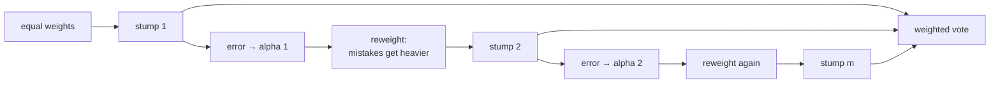

import DataCampExercise from "../../../../components/DataCampExercise.astro";
import AlgorithmCard from "../../../../components/AlgorithmCard.astro";
import Figure from "../../../../components/Figure.astro";
import Quiz from "../../../../components/Quiz.astro";

## What you'll learn

- boosting as the mirror image of bagging: **sequential** and aimed at bias, not variance
- the AdaBoost algorithm in five steps
- the predictor weight $\alpha = \frac{1}{2}\ln\frac{1-\varepsilon}{\varepsilon}$, derived and interpreted
- a complete round of AdaBoost computed **by hand**, weights and all
- why a learner at exactly 50% gets no vote, and one below 50% gets an inverted one
- why boosting is sensitive to noise where bagging is not

## Intuition

Bagging trains many strong models independently and averages away their variance. Boosting does the
opposite in every respect: it trains **weak** models **one at a time**, each one focused on the
examples the previous ones got wrong, and attacks **bias**.

The mechanism is reweighting. After each round, misclassified examples get heavier and correctly
classified ones get lighter. The next learner, fitted on those weights, is forced to pay attention
to precisely the cases the committee currently fails on.

The remarkable claim — proved by Freund and Schapire in 1995 — is that **any** learner reliably
better than chance can be boosted into an arbitrarily accurate one. A decision stump, a single
split on a single feature, is enough.



Note the shape: every arrow is sequential. Stump 2 cannot start until stump 1's errors are known,
which is why **boosting does not parallelise across members** and a random forest does.

## The math

### The algorithm

1. **Initialise** every sample weight equally: $w_i = 1/m$.
2. **Fit** a weak learner on the weighted data.
3. **Measure** its weighted error rate:

$$
\varepsilon_j = \frac{\sum_{i:\, \hat{y}_i \neq y_i} w_i}{\sum_{i=1}^{m} w_i}
$$

4. **Weight the predictor**:

$$
\alpha_j = \eta \cdot \frac{1}{2}\ln\!\left(\frac{1 - \varepsilon_j}{\varepsilon_j}\right)
$$

5. **Reweight the samples**, then renormalise so they sum to 1:

$$
w_i \leftarrow w_i \cdot
\begin{cases}
e^{-\alpha_j} & \text{if correctly classified} \\
e^{+\alpha_j} & \text{if misclassified}
\end{cases}
$$

Repeat from step 2. The final prediction is the **weighted** vote:

$$
\hat{y}(\mathbf{x}) = \operatorname*{arg\,max}_{k}\sum_{j:\, \hat{y}_j(\mathbf{x}) = k} \alpha_j
$$

### Reading the alpha formula

<Figure
  src="/images/ml/phase-05-ensembles/boosting/alpha-curve"
  alt="Curve of alpha against the weighted error rate, passing through zero at 0.5, rising steeply toward positive infinity as error approaches zero and falling toward negative infinity as it approaches one."
  title="Predictor weight against error rate"
  caption="At 10% error a learner gets weight +1.10; at 50% it gets exactly 0.00 and is ignored; at 70% it gets -0.42 and its vote is deliberately inverted."
/>

| $\varepsilon$ | $\alpha$ | Interpretation |
| --- | --- | --- |
| 0.10 | **+1.0986** | Strong learner, loud vote |
| 0.30 | +0.4236 | Useful |
| 0.40 | +0.2027 | Barely useful |
| **0.50** | **0.0000** | **Coin flip — silenced entirely** |
| 0.70 | −0.4236 | Reliably wrong, so its vote is flipped |

Three properties fall out of the logarithm:

1. **$\varepsilon = 0.5$ gives exactly zero.** $\ln(1) = 0$. A learner no better than chance
   contributes nothing, automatically — no special case in the code.
2. **The curve is antisymmetric about 0.5.** A learner at 0.3 and one at 0.7 get weights of equal
   size and opposite sign. Being reliably wrong is exactly as useful as being reliably right, once
   you flip it.
3. **$\alpha \to \infty$ as $\varepsilon \to 0$.** A perfect learner would dominate the vote —
   which is why AdaBoost stops early if a learner reaches zero error, and why weak learners are
   the point.

## Worked example by hand

Five samples, uniform initial weights of $0.2$. Round 1's stump misclassifies samples 2 and 4.

**Step 1 — the weighted error.**

$$
\varepsilon_1 = \frac{0.2 + 0.2}{1.0} = 0.4
$$

**Step 2 — the predictor weight.**

$$
\alpha_1 = \tfrac{1}{2}\ln\!\left(\frac{1 - 0.4}{0.4}\right) = \tfrac{1}{2}\ln(1.5) = 0.2027
$$

**Step 3 — the multipliers.**

$$
e^{+\alpha_1} = e^{0.2027} = 1.2247 \quad (\text{mistakes}),
\qquad
e^{-\alpha_1} = e^{-0.2027} = 0.8165 \quad (\text{correct})
$$

**Step 4 — apply and renormalise.**

| sample | correct? | $w$ before | multiplier | $w$ raw | $w$ after |
| --- | --- | --- | --- | --- | --- |
| 1 | ✓ | 0.2 | 0.8165 | 0.16330 | 0.16667 |
| 2 | ✗ | 0.2 | 1.2247 | 0.24495 | 0.25000 |
| 3 | ✓ | 0.2 | 0.8165 | 0.16330 | 0.16667 |
| 4 | ✗ | 0.2 | 1.2247 | 0.24495 | 0.25000 |
| 5 | ✓ | 0.2 | 0.8165 | 0.16330 | 0.16667 |
| | | **1.0** | | **0.97980** | **1.0** |

**Step 5 — read the result.** The two misclassified samples went from 0.200 to 0.250, a 25%
increase; the three correct ones fell to 0.1667. Their combined weight is now 0.50, up from 0.40 —
**the next stump faces a problem where half the mass is the cases the first stump could not
handle.**

Notice too that the mistakes' total weight is now exactly $0.5$. That is not a coincidence: the
reweighting is constructed so the previous learner scores exactly 50% — and therefore $\alpha = 0$
— on the new distribution. Every round starts from a problem its predecessor finds impossible.

<Figure
  src="/images/ml/phase-05-ensembles/boosting/weight-evolution"
  alt="Four panels showing the same forty points over four AdaBoost rounds. Point sizes grow for the points circled in red as misclassified in the previous round."
  title="Four rounds of reweighting"
  caption="Point area is its weight. Round 1 misclassifies two points; by round 4 those and their neighbours dominate the mass, and the stumps are fitting almost entirely to the difficult boundary region."
/>

## See it move

The same loop, one round per beat. Watch the two mislabelled points in the middle swell until the
stumps have no choice but to attend to them.

```p5 title="Reweighting, round by round" desc="Eighteen points on a line, two of them mislabelled. Each round picks the best weighted stump, prints its error and alpha, then grows the weight of everything it got wrong." height="360"
const N = 18;
let xs = [], ys = [], w = [], round = 0, t = 0;
let stumps = [], wrong = [], err = 0, alpha = 0;

function build() {
  xs = []; ys = [];
  for (let i = 0; i < N; i++) {
    const x = (i + 0.5) / N;
    xs.push(x);
    ys.push(x < 0.5 ? -1 : 1);
  }
  ys[7] = 1;   // two deliberate label flips near the boundary
  ys[10] = -1;
  w = new Array(N).fill(1 / N);
  stumps = []; wrong = new Array(N).fill(false);
  round = 0; err = 0; alpha = 0; t = 0;
}
function bestStump() {
  let best = null;
  for (let s = 0; s <= N; s++) {
    for (const dir of [1, -1]) {
      const thr = s / N;
      let e = 0;
      for (let i = 0; i < N; i++) {
        const pred = xs[i] < thr ? -dir : dir;
        if (pred !== ys[i]) e += w[i];
      }
      if (!best || e < best.e) best = { thr, dir, e };
    }
  }
  return best;
}
function doRound() {
  const st = bestStump();
  err = Math.max(st.e, 1e-9);
  alpha = 0.5 * Math.log((1 - err) / err);
  wrong = [];
  for (let i = 0; i < N; i++) {
    const pred = xs[i] < st.thr ? -st.dir : st.dir;
    wrong.push(pred !== ys[i]);
    w[i] *= Math.exp(-alpha * ys[i] * pred);
  }
  const z = w.reduce((a, b) => a + b, 0);
  for (let i = 0; i < N; i++) w[i] /= z;
  stumps.push({ ...st, alpha });
  round++;
}
function strongAcc() {
  let ok = 0;
  for (let i = 0; i < N; i++) {
    let s = 0;
    for (const st of stumps) s += st.alpha * (xs[i] < st.thr ? -st.dir : st.dir);
    if ((s >= 0 ? 1 : -1) === ys[i]) ok++;
  }
  return ok / N;
}
function setup() { createCanvas(600, 360); textFont("monospace"); build(); }
function draw() {
  background(13, 17, 23);
  const ox = 46, w0 = width - 92, base = 150;

  stroke(60, 70, 84); strokeWeight(1);
  line(ox, base, ox + w0, base);

  // the current stump threshold
  if (stumps.length) {
    const st = stumps[stumps.length - 1];
    stroke(255, 211, 67, 160); strokeWeight(2);
    const tx = ox + st.thr * w0;
    line(tx, base - 76, tx, base + 76);
  }

  for (let i = 0; i < N; i++) {
    const x = ox + xs[i] * w0;
    const d = 9 + 190 * w[i];
    noStroke();
    fill(ys[i] === 1 ? color(75, 139, 190) : color(232, 110, 110));
    ellipse(x, base, d, d);
    if (wrong[i]) { noFill(); stroke(255, 211, 67); strokeWeight(2); ellipse(x, base, d + 9, d + 9); }
  }

  noStroke(); textSize(12); textAlign(LEFT, TOP);
  fill(150); text("blue = +1    red = -1    area = weight    amber ring = missed this round", ox, 16);
  fill(107, 169, 221); textSize(14);
  text("round " + round, ox, base + 78);
  if (round) {
    text("weighted error  " + err.toFixed(4), ox, base + 102);
    text("alpha           " + alpha.toFixed(4), ox, base + 126);
    fill(120, 200, 120);
    text("ensemble accuracy  " + (strongAcc() * 100).toFixed(1) + "%", ox, base + 156);
  }
  fill(140); textSize(10); textAlign(RIGHT, BOTTOM);
  text("click to restart", ox + w0, height - 12);

  t++;
  if (t % 55 === 0) { if (round < 10) doRound(); else build(); }
}
function mousePressed() { build(); }
```

## In code

```python title="adaboost.py" showLineNumbers{1}
from sklearn.datasets import load_breast_cancer
from sklearn.ensemble import AdaBoostClassifier
from sklearn.model_selection import cross_val_score
from sklearn.tree import DecisionTreeClassifier

X, y = load_breast_cancer(return_X_y=True)

for n_estimators in (1, 10, 50, 200):
    model = AdaBoostClassifier(
        DecisionTreeClassifier(max_depth=1),      # a stump: one split, one feature
        n_estimators=n_estimators,
        learning_rate=1.0,
        random_state=0,
    )
    print(f"{n_estimators:>3} stumps  CV {cross_val_score(model, X, y, cv=5).mean():.4f}")

#   1 stumps  CV 0.8998
#  10 stumps  CV 0.9385
#  50 stumps  CV 0.9666
# 200 stumps  CV 0.9772
```

**One stump reaches 0.8998 — a single threshold on a single feature.** Two hundred of them reach
0.9772, competitive with anything else in this curriculum on this dataset. That is the boosting
claim, demonstrated: weak learners, chained, become strong.

Note the shape of the gains: 0.900 → 0.939 → 0.967 → 0.977. Each quadrupling of the budget buys
roughly half the remaining error, which is the diminishing return you should expect.

### Reading the weights back out

```python title="inspect_weights.py" showLineNumbers{1}
import numpy as np

model = AdaBoostClassifier(DecisionTreeClassifier(max_depth=1),
                           n_estimators=50, random_state=0).fit(X, y)

print("first five alphas:", model.estimator_weights_[:5].round(4))
print("first five errors:", model.estimator_errors_[:5].round(4))

# alpha should equal 0.5 * ln((1 - eps) / eps) for each stump
eps = model.estimator_errors_
manual = 0.5 * np.log((1 - eps) / eps)
print("formula matches:", np.allclose(manual, model.estimator_weights_ / 2, atol=1e-6))
```

scikit-learn stores $2\alpha$ rather than $\alpha$ (a harmless convention difference), which is
worth knowing before you compare against the formula and conclude something is broken.

## learning_rate: the second brake

The $\eta$ in step 4 scales every $\alpha$:

$$
\alpha_j = \eta \cdot \tfrac{1}{2}\ln\!\left(\frac{1-\varepsilon_j}{\varepsilon_j}\right)
$$

A smaller $\eta$ makes each learner contribute less, so more of them are needed — the same
shrinkage trade as in
[gradient boosting](/machine-learning/phase-05---ensemble-learning/gradient-boosting-xgboost-lightgbm-catboost/).
`learning_rate` and `n_estimators` must be tuned together, and their product is roughly conserved.

## Where boosting breaks

Bagging is robust to label noise: a mislabelled point ends up in about 63% of the bootstrap samples
and gets outvoted. **Boosting hunts it down.**

A mislabelled example is misclassified every round by construction — no learner can get it right —
so its weight grows exponentially. After enough rounds the ensemble is devoting most of its
capacity to fitting a handful of corrupted labels.

| Data condition | Bagging | Boosting |
| --- | --- | --- |
| Clean | Good | **Usually better** |
| Label noise | **Robust** | Degrades badly |
| Outliers in features | Robust | Sensitive |
| Class imbalance | Handles it with weights | Chases the minority, sometimes usefully |

:::caution[Clean your labels before boosting]
The exponential reweighting that makes AdaBoost powerful on clean data makes it fragile on dirty
data. If you cannot clean the labels, use a lower `learning_rate`, fewer estimators, or a bagged
model instead. Gradient boosting with a robust loss such as Huber is another option.
:::

<AlgorithmCard
  name="AdaBoost"
  type="Supervised · Classification and Regression · Boosting ensemble"
  sklearn="sklearn.ensemble.AdaBoostClassifier / AdaBoostRegressor"
  assumptions={[
    "Each weak learner is at least slightly better than chance on the weighted data",
    "The base learner supports sample weights",
    "Labels are reasonably clean — mislabelled points attract exponentially growing weight",
  ]}
  complexity={{ train: "O(m · n · estimators) — strictly sequential", predict: "O(depth · estimators)", memory: "O(estimators)" }}
  notation="m = samples, n = features; the sequential dependency is why this cannot parallelise across estimators"
  hyperparams={[
    { name: "n_estimators", default: "50", effect: "Unlike a forest, this CAN overfit. Tune it, and pair it with learning_rate." },
    { name: "learning_rate", default: "1.0", effect: "Scales every alpha. Lower needs more estimators; their product is roughly conserved." },
    { name: "estimator", default: "stump", effect: "A depth-1 tree is the classic choice. Depth 2 or 3 captures interactions; deeper defeats the point." },
    { name: "algorithm", default: "SAMME", effect: "SAMME.R used probabilities and converged faster; it is deprecated in recent versions in favour of SAMME." },
  ]}
  useWhen={[
    "You want strong accuracy from very simple base learners",
    "The dataset is clean and modestly sized",
    "You want an ensemble with few hyperparameters to tune",
    "Interpretability of individual stumps has some value",
  ]}
  avoidWhen={[
    "Labels are noisy — the reweighting will chase the errors",
    "You need parallel training; boosting is inherently sequential",
    "The dataset is very large — consider histogram gradient boosting instead",
    "There are extreme outliers you cannot remove",
  ]}
/>

## Pitfalls

:::danger[Boosting noisy labels]
Exponential reweighting guarantees a mislabelled point dominates eventually. Inspect the highest-weight
training samples after fitting — they are frequently data-quality problems rather than hard cases.
:::

:::caution[`n_estimators` can overfit here]
Unlike a random forest, more boosting rounds eventually hurt. Use a validation curve or
`staged_predict` to find where held-out error turns up.
:::

:::caution[Using a deep tree as the base learner]
A depth-10 tree is not a weak learner; it will hit near-zero weighted error immediately, take an
enormous $\alpha$, and the "ensemble" becomes one tree. Stumps or depth 2–3.
:::

:::caution[Comparing `estimator_weights_` against the formula]
scikit-learn stores $2\alpha$. Halve it before checking against
$\frac{1}{2}\ln\frac{1-\varepsilon}{\varepsilon}$.
:::

## Compare

| | Bagging / Random Forest | AdaBoost |
| --- | --- | --- |
| Members | Strong, deep trees | Weak, stumps |
| Training | Parallel | **Sequential** |
| Attacks | Variance | **Bias** |
| Members weighted | Equally | By $\alpha$ |
| More members overfit | No | **Yes** |
| Label noise | Robust | Fragile |
| Typical accuracy on clean tabular data | Very good | Often better |

<Quiz
  questions={[
    {
      q: "A weak learner has a weighted error of exactly 0.5. What weight does AdaBoost give it?",
      options: ["1.0", "0.5", "Exactly 0", "It raises an error"],
      answer: 2,
      explain: "alpha = 0.5 ln((1 - 0.5)/0.5) = 0.5 ln(1) = 0. A coin-flip learner is silenced automatically by the formula, with no special case needed.",
    },
    {
      q: "A learner has a weighted error of 0.7. What does AdaBoost do with it?",
      options: [
        "Discards it",
        "Gives it a negative weight of -0.4236, which inverts its vote — being reliably wrong is as useful as being reliably right",
        "Gives it weight 0.7",
        "Retrains it",
      ],
      answer: 1,
      explain: "The alpha curve is antisymmetric about 0.5. A learner wrong 70% of the time is right 70% of the time once you flip its output.",
    },
    {
      q: "After a round with error 0.4, what happens to the total weight of the misclassified samples?",
      options: [
        "It stays at 0.4",
        "It becomes exactly 0.5, so the previous learner would score 50% on the new distribution and earn zero weight",
        "It doubles to 0.8",
        "It falls",
      ],
      answer: 1,
      explain: "The reweighting is constructed so each round hands its successor a problem the predecessor finds exactly as hard as guessing. That is what forces genuine specialisation.",
    },
    {
      q: "Why does AdaBoost degrade on noisy labels where bagging does not?",
      options: [
        "It uses fewer models",
        "A mislabelled point is misclassified every round, so its weight grows exponentially and the ensemble spends its capacity fitting corrupted labels",
        "It cannot handle missing values",
        "It requires scaled features",
      ],
      answer: 1,
      explain: "In bagging a bad point appears in 63% of samples and is outvoted. In boosting it is by definition always wrong, so the algorithm concludes it is the most important example.",
    },
  ]}
/>

## 🧪 Try It Yourself

### Exercise 1 – The alpha formula

<DataCampExercise
  lang="python"
  hint={`alpha is half the natural log of (1 - error) over error.`}
  code={`# Task: Exercise 1 - The alpha formula
import numpy as np

for eps in (0.1, 0.3, 0.5, 0.7):
    alpha = 0.5 * np.___( (1 - eps) / eps )     # replace ___ with log
    print(f"error {eps}: alpha {alpha:+.4f}")

# -- Expected Output -------------------------------------------
# error 0.1: alpha +1.0986
# error 0.3: alpha +0.4236
# error 0.5: alpha +0.0000
# error 0.7: alpha -0.4236
# --------------------------------------------------------------`}
  solution={`import numpy as np

for eps in (0.1, 0.3, 0.5, 0.7):
    alpha = 0.5 * np.log((1 - eps) / eps)
    print(f"error {eps}: alpha {alpha:+.4f}")`}
  sct={`test_output_contains("error 0.5: alpha +0.0000")
success_msg("A coin flip gets exactly zero say, straight out of the logarithm.")`}
  height={188}
/>

### Exercise 2 – One round of reweighting

<DataCampExercise
  lang="python"
  hint={`Multiply by exp(+alpha) for mistakes and exp(-alpha) for correct predictions, then renormalise.`}
  code={`# Task: Exercise 2 - One round of reweighting
import numpy as np

w = np.full(5, 0.2)
wrong = np.array([False, True, False, True, False])

eps = w[wrong].sum() / w.sum()
alpha = 0.5 * np.log((1 - eps) / eps)

w = w * np.exp(alpha * np.where(wrong, 1, -1))
w = w / w.___()                          # replace ___ with sum

print("error:", round(float(eps), 4))
print("alpha:", round(float(alpha), 4))
print("weights:", w.round(5))
print("mistake mass:", round(float(w[wrong].sum()), 4))

# -- Expected Output -------------------------------------------
# error: 0.4
# alpha: 0.2027
# weights: [0.16667 0.25    0.16667 0.25    0.16667]
# mistake mass: 0.5
# --------------------------------------------------------------`}
  solution={`import numpy as np

w = np.full(5, 0.2)
wrong = np.array([False, True, False, True, False])
eps = w[wrong].sum() / w.sum()
alpha = 0.5 * np.log((1 - eps) / eps)
w = w * np.exp(alpha * np.where(wrong, 1, -1))
w = w / w.sum()
print("error:", round(float(eps), 4))
print("alpha:", round(float(alpha), 4))
print("weights:", w.round(5))
print("mistake mass:", round(float(w[wrong].sum()), 4))`}
  sct={`test_output_contains("mistake mass: 0.5")
success_msg("Exactly 0.5 — the next learner faces a problem its predecessor finds no better than guessing.")`}
  height={228}
/>

### Exercise 3 – Weak learners become strong

<DataCampExercise
  lang="python"
  hint={`A depth-1 tree is a stump: one split on one feature.`}
  code={`# Task: Exercise 3 - Weak learners become strong
from sklearn.datasets import load_breast_cancer
from sklearn.ensemble import AdaBoostClassifier
from sklearn.model_selection import cross_val_score
from sklearn.tree import DecisionTreeClassifier

X, y = load_breast_cancer(return_X_y=True)

for n in (1, 10, 50, 200):
    model = AdaBoostClassifier(DecisionTreeClassifier(max_depth=___),
                               n_estimators=n, random_state=0)
    # replace ___ with 1
    print(f"{n:>3} stumps  CV {cross_val_score(model, X, y, cv=5).mean():.4f}")

# -- Expected Output -------------------------------------------
#   1 stumps  CV 0.8998
#  10 stumps  CV 0.9385
#  50 stumps  CV 0.9666
# 200 stumps  CV 0.9772
# --------------------------------------------------------------`}
  solution={`from sklearn.datasets import load_breast_cancer
from sklearn.ensemble import AdaBoostClassifier
from sklearn.model_selection import cross_val_score
from sklearn.tree import DecisionTreeClassifier

X, y = load_breast_cancer(return_X_y=True)

for n in (1, 10, 50, 200):
    model = AdaBoostClassifier(DecisionTreeClassifier(max_depth=1),
                               n_estimators=n, random_state=0)
    print(f"{n:>3} stumps  CV {cross_val_score(model, X, y, cv=5).mean():.4f}")`}
  sct={`test_output_contains("200 stumps  CV 0.9772")
success_msg("One split on one feature scores 0.90. Two hundred of them score 0.98.")`}
  height={218}
/>

### Exercise 4 – A weighted majority vote

<DataCampExercise
  lang="python"
  hint={`Sum each class's alphas and take the larger total.`}
  code={`# Task: Exercise 4 - A weighted majority vote
import numpy as np

alphas = np.array([1.10, 0.42, 0.20, 0.42, 1.10])
votes = np.array([1, 0, 0, 0, 1])        # what each learner predicted

for_one = alphas[votes == 1].sum()
for_zero = alphas[votes == ___].sum()    # replace ___ with 0

print("weight for class 1:", round(float(for_one), 2))
print("weight for class 0:", round(float(for_zero), 2))
print("prediction:", 1 if for_one > for_zero else 0)
print("a plain majority would have said:", 0)

# -- Expected Output -------------------------------------------
# weight for class 1: 2.2
# weight for class 0: 1.04
# prediction: 1
# a plain majority would have said: 0
# --------------------------------------------------------------`}
  solution={`import numpy as np

alphas = np.array([1.10, 0.42, 0.20, 0.42, 1.10])
votes = np.array([1, 0, 0, 0, 1])
for_one = alphas[votes == 1].sum()
for_zero = alphas[votes == 0].sum()
print("weight for class 1:", round(float(for_one), 2))
print("weight for class 0:", round(float(for_zero), 2))
print("prediction:", 1 if for_one > for_zero else 0)
print("a plain majority would have said:", 0)`}
  sct={`test_output_contains("prediction: 1")
success_msg("Three votes lost to two, because the two came from far more accurate learners.")`}
  height={208}
/>

### Exercise 5 – Watch boosting chase a bad label

<DataCampExercise
  lang="python"
  hint={`Flip one label and compare accuracy on clean against corrupted data.`}
  code={`# Task: Exercise 5 - Watch boosting chase a bad label
import numpy as np
from sklearn.datasets import make_moons
from sklearn.ensemble import AdaBoostClassifier, RandomForestClassifier
from sklearn.model_selection import cross_val_score
from sklearn.tree import DecisionTreeClassifier

X, y = make_moons(n_samples=400, noise=0.2, random_state=0)

rng = np.random.default_rng(0)
y_noisy = y.copy()
flip = rng.choice(len(y), 40, replace=False)      # corrupt 10% of the labels
y_noisy[flip] = 1 - y_noisy[flip]

ada = AdaBoostClassifier(DecisionTreeClassifier(max_depth=1),
                         n_estimators=200, random_state=0)
forest = RandomForestClassifier(n_estimators=200, random_state=0, n_jobs=-1)

for name, model in (("adaboost", ada), ("forest", forest)):
    clean = cross_val_score(model, X, y, cv=5).mean()
    dirty = cross_val_score(model, X, ___, cv=5).mean()   # replace ___ with y_noisy
    print(f"{name:<9} clean {clean:.4f}  noisy {dirty:.4f}  drop {clean - dirty:.4f}")

# -- Expected Output -------------------------------------------
# adaboost  clean 0.9350  noisy 0.8300  drop 0.1050
# forest    clean 0.9375  noisy 0.8475  drop 0.0900
# --------------------------------------------------------------`}
  solution={`import numpy as np
from sklearn.datasets import make_moons
from sklearn.ensemble import AdaBoostClassifier, RandomForestClassifier
from sklearn.model_selection import cross_val_score
from sklearn.tree import DecisionTreeClassifier

X, y = make_moons(n_samples=400, noise=0.2, random_state=0)
rng = np.random.default_rng(0)
y_noisy = y.copy()
flip = rng.choice(len(y), 40, replace=False)
y_noisy[flip] = 1 - y_noisy[flip]

ada = AdaBoostClassifier(DecisionTreeClassifier(max_depth=1),
                         n_estimators=200, random_state=0)
forest = RandomForestClassifier(n_estimators=200, random_state=0, n_jobs=-1)

for name, model in (("adaboost", ada), ("forest", forest)):
    clean = cross_val_score(model, X, y, cv=5).mean()
    dirty = cross_val_score(model, X, y_noisy, cv=5).mean()
    print(f"{name:<9} clean {clean:.4f}  noisy {dirty:.4f}  drop {clean - dirty:.4f}")`}
  sct={`test_output_contains("adaboost")
success_msg("Both suffer; the boosted model suffers more, because it treats the bad labels as the hardest cases.")`}
  height={278}
/>

## Recap

- Boosting is bagging's mirror image: weak learners, trained sequentially, attacking bias.
- $\alpha = \frac{1}{2}\ln\frac{1-\varepsilon}{\varepsilon}$ gives +1.099 at 10% error, exactly 0 at
  50%, and −0.424 at 70% — the vote is inverted rather than discarded.
- Hand-worked round: error 0.4, $\alpha = 0.2027$, mistake weights rise from 0.200 to 0.250 and
  their total mass becomes exactly 0.5.
- Each round hands its successor a problem the previous learner finds no better than chance.
- One decision stump on breast cancer scores 0.8998; two hundred score 0.9772.
- `n_estimators` **can** overfit here, unlike a random forest, and `learning_rate` trades against it.
- Boosting is fragile to label noise for exactly the reason it is powerful on clean data.

### Exercise 6 – Run one AdaBoost weight update by hand

<DataCampExercise
  lang="python"
  hint={`alpha is half the log of (1 - error) / error. Misclassified rows are multiplied by exp(alpha), correct rows by exp(-alpha), then everything is renormalised.`}
  code={`# Task: Exercise 6 - Run one AdaBoost weight update by hand
import numpy as np

weights = np.full(8, 1 / 8)
wrong = np.array([0, 0, 1, 0, 0, 1, 0, 0], dtype=bool)   # stump misses two rows

error = weights[wrong].sum()
alpha = 0.5 * np.___((1 - error) / error)        # replace ___ with log
print(f"weighted error   {error:.4f}")
print(f"stump weight     alpha = {alpha:.4f}")

updated = weights * np.exp(np.where(wrong, alpha, -alpha))
updated = updated / updated.sum()
print("row weights before: " + " ".join(f"{w:.4f}" for w in weights))
print("row weights after:  " + " ".join(f"{w:.4f}" for w in updated))
print(f"misclassified rows now carry {updated[wrong].sum():.4f} of the total "
      f"weight, up from {weights[wrong].sum():.4f}")

# -- Expected Output -------------------------------------------
# weighted error   0.2500
# stump weight     alpha = 0.5493
# row weights before: 0.1250 0.1250 0.1250 0.1250 0.1250 0.1250 0.1250 0.1250
# row weights after:  0.0833 0.0833 0.2500 0.0833 0.0833 0.2500 0.0833 0.0833
# misclassified rows now carry 0.5000 of the total weight, up from 0.2500
# --------------------------------------------------------------`}
  solution={`import numpy as np

weights = np.full(8, 1 / 8)
wrong = np.array([0, 0, 1, 0, 0, 1, 0, 0], dtype=bool)

error = weights[wrong].sum()
alpha = 0.5 * np.log((1 - error) / error)
print(f"weighted error   {error:.4f}")
print(f"stump weight     alpha = {alpha:.4f}")

updated = weights * np.exp(np.where(wrong, alpha, -alpha))
updated = updated / updated.sum()
print("row weights before: " + " ".join(f"{w:.4f}" for w in weights))
print("row weights after:  " + " ".join(f"{w:.4f}" for w in updated))
print(f"misclassified rows now carry {updated[wrong].sum():.4f} of the total "
      f"weight, up from {weights[wrong].sum():.4f}")`}
  sct={`test_output_contains("0.5000 of the total weight")
success_msg("After one round the two missed rows carry half the total weight — AdaBoost always renormalises so the errors become exactly half the problem. That is also why a single mislabelled row can dominate a long boosting run.")`}
  height={290}
/>

## Next

Continue to
[Gradient Boosting (XGBoost, LightGBM, CatBoost)](/machine-learning/phase-05---ensemble-learning/gradient-boosting-xgboost-lightgbm-catboost/)
— the same sequential idea with reweighting replaced by gradient descent in function space, and the
family of libraries that dominates tabular machine learning.
