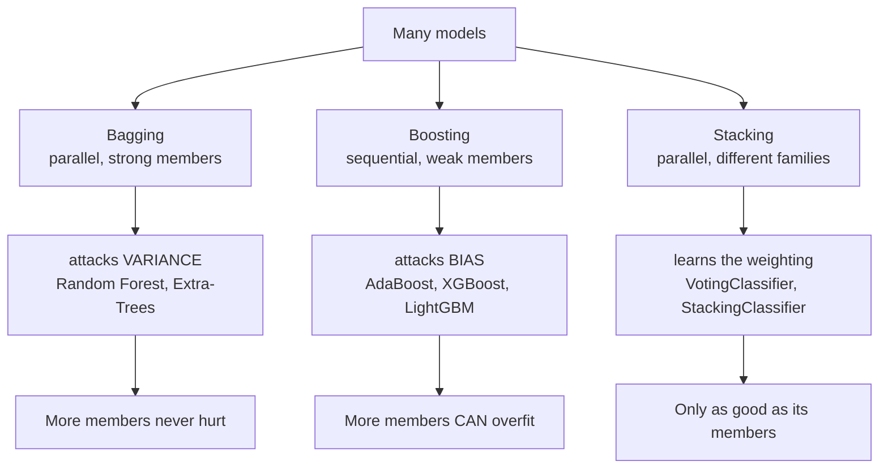

The single most reliable way to improve a tabular model is to stop using one model. Ensembles win
Kaggle competitions, they are the default in production, and gradient boosting in particular is the
strongest general-purpose method in this curriculum.

But they are not magic, and this phase is careful about that. One page ends with a measurement
where no combination of four models beat the best single member. Knowing *when* combining fails is
what separates using ensembles from cargo-culting them.

## What this phase covers

Five pages, and the order matters: the first establishes the condition all the others must satisfy.

| # | Page | Mechanism | Key measurement |
| --- | --- | --- | --- |
| 1 | [The Power of Ensembles](/machine-learning/phase-05---ensemble-learning/the-power-of-ensembles-why-combine-models/) | Why combining works at all | 60% voters → 97.9% at n=101 |
| 2 | [Bagging & Random Forests](/machine-learning/phase-05---ensemble-learning/bagging-random-forest-regressor-classifier/) | Resample rows and features | bagging 0.9417 vs pasting 0.8833 |
| 3 | [AdaBoost](/machine-learning/phase-05---ensemble-learning/boosting-introduction-to-adaboost/) | Reweight the mistakes | 1 stump 0.8998 → 200 stumps 0.9772 |
| 4 | [Gradient Boosting](/machine-learning/phase-05---ensemble-learning/gradient-boosting-xgboost-lightgbm-catboost/) | Fit the residual = descend the gradient | MSE 66.7 → 29.2 → 8.1 in two stages |
| 5 | [Stacking and Voting](/machine-learning/phase-05---ensemble-learning/stacking-and-voting-classifiers/) | Learn the weights | no combination beat the best member |

## The one equation

Everything here is governed by the variance of an average of correlated models:

$$
\operatorname{Var}\left(\frac{1}{n}\sum_{i=1}^{n} f_i\right)
= \underbrace{\rho\,\sigma^{2}}_{\text{cannot be reduced}}
+ \underbrace{\frac{1-\rho}{n}\,\sigma^{2}}_{\text{shrinks with } n}
$$

Adding members only shrinks the second term. **Correlation is a floor**, and every design decision
in this phase is an attempt to push $\rho$ down:

| Technique | How it lowers $\rho$ |
| --- | --- |
| Bootstrap sampling | Each model sees a different 63% of the rows |
| Feature subsampling | Trees cannot all split on the dominant feature |
| Random thresholds (Extra-Trees) | Even the split points differ |
| Sequential reweighting | Each model faces a different distribution by construction |
| Different algorithms | The families disagree by design |

## The three families

| | Bagging | Boosting | Stacking |
| --- | --- | --- | --- |
| Members | Deep trees | Shallow trees or stumps | Any, ideally different families |
| Trained | In parallel | **Sequentially** | In parallel, then a blender |
| Attacks | Variance | Bias | Both |
| More members overfit | **No** | **Yes** | No, but adds no value either |
| Robust to label noise | Yes | **No** | Depends on the members |
| Tuning burden | Low | High | Moderate |
| Typical tabular result | Very good | **Best** | Small extra gain |

Each maps onto a term of the
[bias-variance decomposition](/machine-learning/phase-07---model-optimization--tuning/bias-vs-variance-tradeoff/).
That is not a coincidence or an analogy — it is the design rationale.

## Before you start

- **[Decision Trees](/machine-learning/phase-04---supervised-learning---classification/decision-trees-entropy-and-gini-impurity/)** —
  the base learner for four of the five pages. That page ends by noting trees are unstable; this
  phase is what that instability is *for*.
- **[Cross-validation](/machine-learning/phase-07---model-optimization--tuning/k-fold-cross-validation/)** —
  every comparison here is on identical folds, and out-of-fold prediction is the core of stacking.
- **Bias and variance** — the vocabulary the whole phase uses.

## What you'll be able to do afterwards

1. Explain, with the variance formula, why an ensemble of correlated models is nearly pointless.
2. Derive the 63.2% bootstrap coverage and use out-of-bag scoring.
3. Compute an AdaBoost round by hand — error, $\alpha$, and the reweighting.
4. Explain why fitting the residual is gradient descent, and swap the loss to fit a new problem.
5. Choose between hard voting, soft voting and stacking on calibration and member-strength grounds.
6. Recognise when the ensemble should be abandoned in favour of a single model.

## How long it takes

| Activity | Time |
| --- | --- |
| Reading the five pages | 3–4 hours |
| Working the hand examples | 2 hours |
| Running the code and the 25 exercises | 3–4 hours |
| The practice project below | 4–6 hours |
| **Total** | **12–16 hours** |

## Practice project

**Build a tabular leaderboard for one dataset.** Pick anything with 5,000+ rows and mixed feature
types, then fill in this table with 5-fold cross-validated scores on identical folds:

| Model | Score | Training time | Notes |
| --- | --- | --- | --- |
| `DummyClassifier` | | | The floor |
| Logistic regression | | | The cheap baseline — it sometimes wins |
| Single decision tree | | | |
| Random forest | | | Try `max_features` |
| Extra-Trees | | | Usually faster, often better |
| AdaBoost | | | |
| `HistGradientBoosting` | | | Tune `learning_rate` with early stopping |
| Soft voting of the best three | | | |
| Stacking of the best three | | | |

Then answer three questions in writing:

1. **Did any ensemble beat the best single model?** By how much, and is it larger than the
   fold-to-fold standard deviation?
2. **What did it cost?** Training time, prediction latency, and whether you could still explain a
   prediction.
3. **Which would you ship?** With a reason.

If the honest answer to question 1 is "no", that is a finding, not a failure — and the page on
[stacking](/machine-learning/phase-05---ensemble-learning/stacking-and-voting-classifiers/)
reaches exactly that answer on its own data.

<Quiz
  questions={[
    {
      q: "Your 200-model ensemble has average pairwise correlation 0.85. What is the main problem?",
      options: [
        "Not enough models",
        "Correlation puts a floor at 0.85 of a single model's variance — a handful of models would have achieved almost the same thing",
        "The models are too weak",
        "The learning rate is wrong",
      ],
      answer: 1,
      explain: "Variance is rho + (1-rho)/n = 0.85 + 0.00075. Adding models shrinks only the second term, which is already negligible. The fix is diversity, not quantity.",
    },
    {
      q: "Which ensemble family cannot be parallelised across its members?",
      options: ["Bagging", "Boosting", "Voting", "Stacking"],
      answer: 1,
      explain: "Each boosting round depends on the previous round's errors. Bagging, voting and stacking all train their members independently.",
    },
    {
      q: "For which family does adding more members eventually hurt?",
      options: [
        "Bagging — the trees start to correlate",
        "Boosting — each round fits the previous residuals, so enough rounds fit noise",
        "Voting",
        "None; more members always helps",
      ],
      answer: 1,
      explain: "A random forest's n_estimators cannot overfit. A boosted model's can, which is why early stopping is mandatory there and irrelevant in bagging.",
    },
  ]}
/>

## Next

Start with
[The Power of Ensembles - Why Combine Models?](/machine-learning/phase-05---ensemble-learning/the-power-of-ensembles-why-combine-models/)
— Condorcet's theorem, the correlation floor, and the condition every later page has to satisfy.
