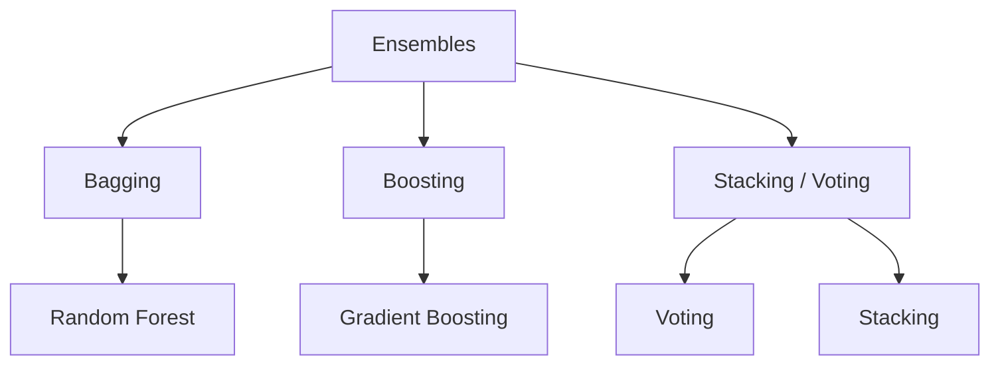

## What ensemble learning is

**Ensembles** combine multiple “weak” or “diverse” models to produce a stronger overall predictor.

Key idea:

- many models make different mistakes
- combining them reduces overall error

This is the same idea behind the *wisdom of the crowd*: aggregate many independent
guesses and the aggregate is often better than any single expert's guess. Géron opens
*Hands-On Machine Learning*'s Chapter 7 with exactly this analogy — and then shows that
an ensemble of Decision Trees, called a **Random Forest**, is "one of the most powerful
Machine Learning algorithms available today," despite each individual tree being simple.

## The three big families

## Phase 5 topics

1. The Power of Ensembles: Why Combine Models?
2. Bagging: Random Forest Regressor/Classifier
3. Boosting: Introduction to AdaBoost
4. Gradient Boosting (XGBoost, LightGBM, CatBoost)
5. Stacking and Voting Classifiers

## Why this phase matters

Ensembles are often:

- top performers on tabular datasets
- robust and hard to beat as baselines

They’re also a stepping stone to production ML because they often generalize well. In
fact, the winning solutions in Machine Learning competitions (most famously the Netflix
Prize) almost always combine several ensemble methods rather than relying on one model.

:::tip[From the book]
Géron discusses bagging, boosting, stacking, and Random Forests in Chapter 7 of
*Hands-On Machine Learning*, and points out that you'll typically reach for ensembles
**near the end of a project**, once you already have a few good predictors, to combine
them into something even better.
:::
