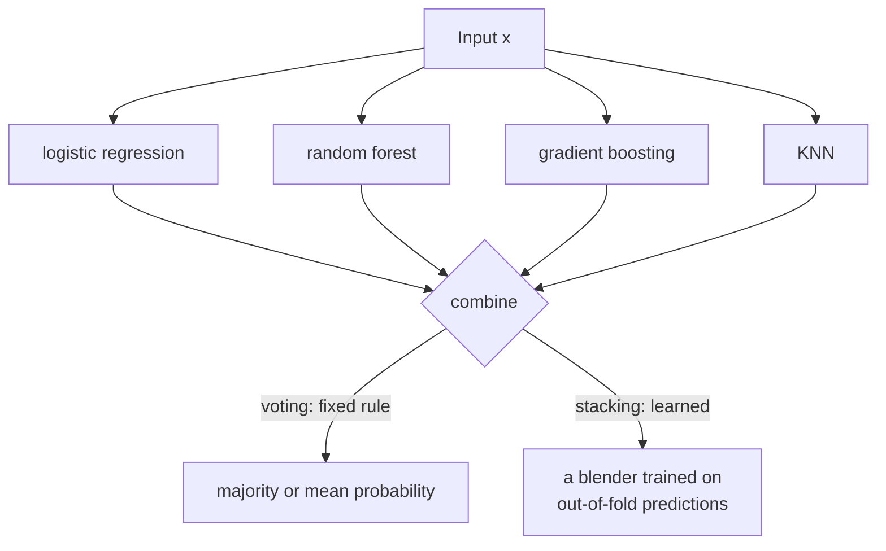
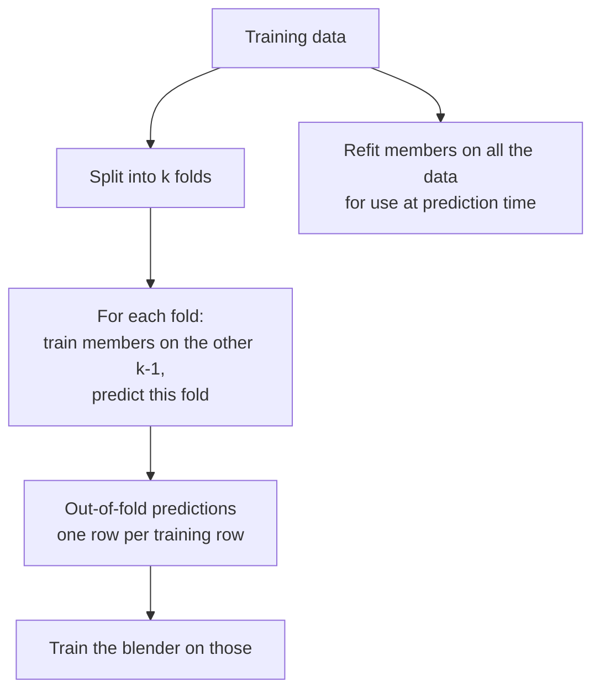

import DataCampExercise from "../../../../components/DataCampExercise.astro";
import AlgorithmCard from "../../../../components/AlgorithmCard.astro";
import Figure from "../../../../components/Figure.astro";
import Quiz from "../../../../components/Quiz.astro";

## What you'll learn

- hard against soft voting, and a case where they disagree — computed **by hand**
- why soft voting requires **calibrated** probabilities to be worth using
- **stacking**: letting a second-level model learn the weights instead of fixing them
- how the blender is trained on out-of-fold predictions, and why anything else leaks
- a measured comparison where none of the three combinations beats the best member
- when to reach for each, and when to ship the single model

## Intuition

Bagging and boosting both build many copies of **one** kind of model. Voting and stacking do
something different: they take models you already have — a logistic regression, a forest, a boosted
tree, a KNN — and combine them.

The diversity is free. Those families make genuinely different assumptions and fail in genuinely
different ways, which is exactly the condition
[Condorcet's theorem](/machine-learning/phase-05---ensemble-learning/the-power-of-ensembles-why-combine-models/)
requires.

The two approaches differ in one respect: **who decides how much each member counts.**

- **Voting** — you decide, in advance. Equal weights, or weights you supply.
- **Stacking** — a model learns them from data.



## Hard against soft voting

**Hard voting** counts labels. **Soft voting** averages probabilities and then thresholds. They are
not the same rule, and the difference matters most when confidence is unevenly distributed.

$$
\text{hard: } \hat{y} = \operatorname*{arg\,max}_{k}\sum_{j=1}^{J}\mathbb{1}\!\left[\hat{y}_j = k\right]
\qquad
\text{soft: } \hat{y} = \operatorname*{arg\,max}_{k}\frac{1}{J}\sum_{j=1}^{J}\hat{p}_{jk}
$$

### Worked example by hand

Three classifiers on one instance, predicting $P(\text{class } 1)$:

| Classifier | $P(\text{class }1)$ | Hard vote |
| --- | --- | --- |
| logistic regression | 0.45 | class 0 |
| decision tree | 0.48 | class 0 |
| gradient boosting | **0.93** | class 1 |

**Hard voting.** Two votes for class 0, one for class 1 → **predict class 0**.

**Soft voting.** Average the probabilities:

$$
\bar{p} = \frac{0.45 + 0.48 + 0.93}{3} = \frac{1.86}{3} = 0.62 \;\Rightarrow\; \textbf{predict class 1}
$$

**Opposite answers from identical inputs.** Hard voting heard two mild "probably not"s outvote one
emphatic "almost certainly". Soft voting let the confident model carry the weight its confidence
implies.

**Which is right?** Only if the probabilities are trustworthy. If the boosted model is
systematically overconfident — and untuned boosted trees frequently are — then 0.93 is not really
0.93, and soft voting has been misled by a number that does not mean what it says.

:::caution[Soft voting is only as good as the calibration]
Logistic regression is usually well calibrated. Naive Bayes is
[notoriously not](/machine-learning/phase-04---supervised-learning---classification/naïve-bayes-classifier/),
routinely emitting 0.9999. SVMs produce probabilities only via Platt scaling. Wrap poorly-calibrated
members in `CalibratedClassifierCV` before soft voting, or use hard voting instead.
:::

| | Hard voting | Soft voting |
| --- | --- | --- |
| Uses | Predicted labels | Predicted probabilities |
| Needs `predict_proba` | No | Yes |
| Sensitive to calibration | No | **Very** |
| Confident members | Count the same as unsure ones | Count more |
| Usually better when | Members are poorly calibrated | Members are well calibrated |

## Stacking

Voting fixes the combination rule. Stacking **learns** it: fit the members, collect their
predictions, and train a second model — the blender, or meta-learner — to map those predictions to
the final answer.

The blender can learn things no fixed rule can express: that the forest is reliable except when the
KNN strongly disagrees, or that logistic regression should simply be ignored.

### Training the blender without cheating

Here is the trap. If you train the members on the training set and then ask them to predict that
same training set, their predictions will be **far too good** — a fitted random forest predicts its
own training rows almost perfectly. The blender learns "always trust the forest", and then meets a
forest that is much worse on new data.

The fix is out-of-fold prediction:



Every prediction the blender trains on comes from a model that **did not see that row**. Its view
of each member's reliability therefore matches what it will encounter in production.
`StackingClassifier` does this internally with its `cv` parameter; it is the entire reason the
class exists rather than a five-line loop.

## Measured

<Figure
  src="/images/ml/phase-05-ensembles/why-ensembles/voting-and-stacking"
  alt="Bar chart of 5-fold CV accuracy for four members and three combination methods, with a dashed red line marking the best individual member at 0.9020. Hard voting sits below the line; soft voting and stacking sit on it."
  title="Four members, three combinations, identical folds"
  caption="KNN alone reaches 0.9020. Hard voting drops to 0.8860; soft voting and stacking both reach 0.9000. Not one combination beat the best member."
/>

| Model | 5-fold CV accuracy |
| --- | --- |
| logistic regression | 0.8560 |
| decision tree (depth 4) | 0.9000 |
| **KNN (k=15)** | **0.9020** |
| Gaussian naive Bayes | 0.8580 |
| hard vote | 0.8860 |
| soft vote | 0.9000 |
| stacking (logistic blender) | 0.9000 |

### Reading the plot

1. **Hard voting was the worst combination**, 1.6 points below its best member. Two weak members
   (0.856 and 0.858) get the same vote as KNN at 0.902 and can outvote it.
2. **Soft voting recovered to 0.9000** by weighting with confidence, which is what soft voting is
   for.
3. **Stacking matched soft voting but did not beat it.** In principle the blender could learn to
   discard the weak members entirely; with 500 rows and 4 features of meta-data it does not have
   enough signal to.
4. **Nothing beat KNN alone.** Report this honestly and ship the single model.

**The condition for stacking to pay** is that the members be *both* reasonably strong *and*
genuinely complementary. Here they were complementary but two of them were markedly weaker, and
that turned out to be the binding constraint.

## See it move

Five classifiers report a probability for each incoming instance. The two tallies show what hard
and soft voting each conclude — and how often they disagree.

```p5 title="Hard and soft voting, side by side" desc="Five members report probabilities for one instance. The bars show each member's confidence; the two verdicts below show what counting labels and averaging probabilities each decide." height="340"
const J = 5;
const NAMES = ["logistic", "tree", "knn", "boosting", "naive bayes"];
let probs = [], t = 0, disagreements = 0, total = 0;
function newInstance() {
  probs = [];
  // occasionally produce the interesting case: several mild against one confident
  const tricky = random() < 0.45;
  for (let i = 0; i < J; i++) {
    if (tricky) probs.push(i === J - 1 ? random(0.85, 0.99) : random(0.3, 0.49));
    else probs.push(random());
  }
  const hard = probs.filter((p) => p >= 0.5).length > J / 2 ? 1 : 0;
  const soft = probs.reduce((a, b) => a + b, 0) / J >= 0.5 ? 1 : 0;
  if (hard !== soft) disagreements++;
  total++;
}
function setup() {
  createCanvas(600, 340);
  textFont("monospace");
  newInstance();
}
function draw() {
  background(13, 17, 23);
  const ox = 130, w = 320, top = 54, rowH = 30;

  noStroke();
  fill(180);
  textSize(11);
  textAlign(LEFT, BOTTOM);
  text("each member's P(class 1)", ox, top - 10);

  for (let i = 0; i < J; i++) {
    const y = top + i * rowH;
    fill(160);
    textSize(11);
    textAlign(RIGHT, CENTER);
    text(NAMES[i], ox - 10, y + 9);
    fill(40, 48, 60);
    rect(ox, y, w, 18, 4);
    fill(probs[i] >= 0.5 ? color(120, 200, 120) : color(232, 110, 110));
    rect(ox, y, probs[i] * w, 18, 4);
    fill(225);
    textAlign(LEFT, CENTER);
    textSize(10);
    text(probs[i].toFixed(2), ox + w + 8, y + 9);
  }

  // the 0.5 line
  stroke(150);
  strokeWeight(1);
  line(ox + w / 2, top - 4, ox + w / 2, top + J * rowH - 8);
  noStroke();

  const hardVotes = probs.filter((p) => p >= 0.5).length;
  const hard = hardVotes > J / 2 ? 1 : 0;
  const mean = probs.reduce((a, b) => a + b, 0) / J;
  const soft = mean >= 0.5 ? 1 : 0;

  const vy = top + J * rowH + 18;
  fill(107, 169, 221);
  textSize(13);
  textAlign(LEFT, TOP);
  text("hard vote:  " + hardVotes + " of " + J + " say class 1  ->  class " + hard, ox - 120, vy);
  text("soft vote:  mean " + mean.toFixed(3) + "  ->  class " + soft, ox - 120, vy + 24);

  fill(hard === soft ? color(120, 200, 120) : color(255, 211, 67));
  textSize(14);
  text(hard === soft ? "they agree" : "THEY DISAGREE", ox - 120, vy + 52);

  fill(150);
  textSize(10);
  textAlign(LEFT, BOTTOM);
  text("disagreed on " + disagreements + " of " + total + " instances so far", ox - 120, height - 12);

  t++;
  if (t % 50 === 0) newInstance();
  if (total > 200) { disagreements = 0; total = 0; }
}
function mousePressed() { newInstance(); }
```

## In code

```python title="voting.py" showLineNumbers{1}
from sklearn.datasets import make_moons
from sklearn.ensemble import VotingClassifier
from sklearn.linear_model import LogisticRegression
from sklearn.model_selection import cross_val_score
from sklearn.naive_bayes import GaussianNB
from sklearn.neighbors import KNeighborsClassifier
from sklearn.pipeline import make_pipeline
from sklearn.preprocessing import StandardScaler
from sklearn.tree import DecisionTreeClassifier

X, y = make_moons(n_samples=500, noise=0.3, random_state=1)

members = [
    ("logistic", make_pipeline(StandardScaler(), LogisticRegression())),
    ("tree", DecisionTreeClassifier(max_depth=4, random_state=0)),
    ("knn", make_pipeline(StandardScaler(), KNeighborsClassifier(15))),
    ("nb", GaussianNB()),
]

for name, model in members:
    print(f"{name:<10} {cross_val_score(model, X, y, cv=5).mean():.4f}")

hard = VotingClassifier(members, voting="hard")
soft = VotingClassifier(members, voting="soft")
print(f"{'hard':<10} {cross_val_score(hard, X, y, cv=5).mean():.4f}")   # 0.8860
print(f"{'soft':<10} {cross_val_score(soft, X, y, cv=5).mean():.4f}")   # 0.9000

# Unequal weights, when you know one member is better
weighted = VotingClassifier(members, voting="soft", weights=[1, 2, 3, 1])
```

```python title="stacking.py" showLineNumbers{1}
from sklearn.ensemble import StackingClassifier

stack = StackingClassifier(
    estimators=members,
    final_estimator=LogisticRegression(),   # keep the blender simple
    cv=5,                                   # out-of-fold predictions; do not skip
    passthrough=False,                      # True also gives the blender the raw features
)

print(f"stacking {cross_val_score(stack, X, y, cv=5).mean():.4f}")      # 0.9000

stack.fit(X, y)
for name, coef in zip([n for n, _ in members], stack.final_estimator_.coef_[0]):
    print(f"  blender weight for {name:<10} {coef:+.4f}")
```

Reading the blender's coefficients is the payoff over voting: it tells you, in numbers, how much
the meta-model decided to trust each member.

:::tip[Keep the blender simple]
A logistic regression or a shallow tree. The blender sees only $J$ numbers per row — with four
members that is four features — so a complex blender overfits immediately. `passthrough=True` gives
it the original features too, which occasionally helps and often overfits.
:::

<AlgorithmCard
  name="Voting and Stacking"
  type="Supervised · Classification and Regression · Heterogeneous ensemble"
  sklearn="sklearn.ensemble.VotingClassifier / StackingClassifier"
  assumptions={[
    "Members make genuinely different errors — different families, not different seeds",
    "For soft voting, member probabilities are calibrated",
    "For stacking, enough training data for the blender to learn from J numbers per row",
  ]}
  complexity={{ train: "sum of member costs; stacking multiplies by k folds", predict: "sum of member costs", memory: "sum of member sizes" }}
  notation="J = number of members, k = folds used for out-of-fold predictions"
  hyperparams={[
    { name: "voting", default: "hard", effect: "'soft' averages probabilities and usually wins when members are calibrated. Check calibration first." },
    { name: "weights", default: "None", effect: "Manual per-member weights for voting. A cheap alternative to stacking when you already know the ranking." },
    { name: "final_estimator", default: "LogisticRegression", effect: "The blender. Keep it simple; it only sees J features." },
    { name: "cv", default: "5", effect: "Folds for out-of-fold predictions. Lower is faster and leakier; do not set it to 'prefit' unless you know exactly why." },
    { name: "passthrough", default: "False", effect: "Give the blender the original features as well. Occasionally helps, frequently overfits." },
  ]}
  useWhen={[
    "You already have several tuned models of different families",
    "The members' errors are genuinely uncorrelated",
    "The last fraction of a point matters — this is standard practice in competitions",
    "Inference cost is not a constraint",
  ]}
  avoidWhen={[
    "Members are all the same family — bagging or boosting is the right tool",
    "Prediction latency matters; every member runs on every request",
    "One member clearly dominates the rest, as measured above",
    "The training set is small; the blender needs data too",
  ]}
/>

## Pitfalls

:::danger[Training the blender on in-sample predictions]
A fitted forest predicts its own training rows nearly perfectly. A blender trained on those learns
to trust it absolutely, and then meets a forest that is much worse on new data. Always use
out-of-fold predictions — which is what `cv=` does for you.
:::

:::caution[Soft voting with uncalibrated members]
Naive Bayes routinely emits 0.9999 and does not mean it. Averaging that against an honest 0.6 hands
the decision to the least trustworthy number in the ensemble. Calibrate or use hard voting.
:::

:::caution[A blender that is too complex]
With four members the blender sees four features. A random forest blender will memorise the
out-of-fold predictions and add nothing. Logistic regression or a depth-2 tree.
:::

:::caution[Not comparing against the best member]
The measurement above found no combination beating KNN alone. Run that comparison every time, on
identical folds, and be prepared to ship the single model.
:::

## Compare

| | Bagging | Boosting | Voting | Stacking |
| --- | --- | --- | --- | --- |
| Members | One family, resampled | One family, sequential | **Different families** | **Different families** |
| Combination | Equal average | Weighted by $\alpha$ | Fixed rule | **Learned** |
| Diversity from | Data resampling | Reweighting | Algorithm choice | Algorithm choice |
| Training | Parallel | Sequential | Parallel | Parallel, then the blender |
| Tuning burden | Low | High | **Lowest** | Moderate |
| Typical use | Default tabular baseline | Strongest single model | Quick easy win | Competition final step |

Voting is the cheapest ensemble in this phase: if you already have three tuned models, it is one
line and no new training.

<Quiz
  questions={[
    {
      q: "Three classifiers predict P(class 1) of 0.45, 0.48 and 0.93. What do hard and soft voting decide?",
      options: [
        "Both predict class 1",
        "Hard predicts class 0 (two votes to one); soft predicts class 1 (mean 0.62)",
        "Both predict class 0",
        "Hard predicts class 1; soft predicts class 0",
      ],
      answer: 1,
      explain: "Hard voting counts two mild negatives against one positive. Soft voting averages to 0.62 and lets the confident member carry the weight its confidence implies.",
    },
    {
      q: "Why must a stacking blender be trained on out-of-fold predictions?",
      options: [
        "To speed up training",
        "Because in-sample predictions from fitted members are unrealistically good, so the blender would learn to trust members far more than it should",
        "Because scikit-learn requires it",
        "To handle missing values",
      ],
      answer: 1,
      explain: "A fitted forest is near-perfect on its own training rows. The blender must see each member's performance on data that member did not train on, which is exactly what the cv parameter arranges.",
    },
    {
      q: "Hard voting scored 0.8860 while its best member scored 0.9020. What went wrong?",
      options: [
        "A bug in VotingClassifier",
        "Two of the four members are markedly weaker, and equal votes let them outvote the strongest",
        "Hard voting is always worse than soft",
        "Not enough members",
      ],
      answer: 1,
      explain: "Hard voting gives every member an identical say. Members at 0.856 and 0.858 can jointly outvote one at 0.902. Soft voting recovered 1.4 of the lost points.",
    },
    {
      q: "You are soft voting over logistic regression, a calibrated SVM and Gaussian naive Bayes. What should you check?",
      options: [
        "That all three use the same features",
        "Naive Bayes's calibration — it routinely emits 0.9999 without meaning it, which would dominate the average",
        "That the models are the same size",
        "Nothing; soft voting handles it",
      ],
      answer: 1,
      explain: "Soft voting averages probabilities as if they were comparable. An overconfident member effectively gets extra votes. Wrap it in CalibratedClassifierCV or use hard voting.",
    },
  ]}
/>

## 🧪 Try It Yourself

### Exercise 1 – Hard and soft disagree

<DataCampExercise
  lang="python"
  hint={`Hard voting counts labels above 0.5; soft voting averages the probabilities first.`}
  code={`# Task: Exercise 1 - Hard and soft disagree
import numpy as np

probs = np.array([0.45, 0.48, 0.93])

hard_votes = (probs >= 0.5).astype(int)
hard = 1 if hard_votes.sum() > len(probs) / 2 else 0
soft = 1 if probs.___() >= 0.5 else 0          # replace ___ with mean

print("individual votes:", hard_votes)
print("hard voting:", hard)
print("mean probability:", round(float(probs.mean()), 4))
print("soft voting:", soft)
print("they disagree:", hard != soft)

# -- Expected Output -------------------------------------------
# individual votes: [0 0 1]
# hard voting: 0
# mean probability: 0.62
# soft voting: 1
# they disagree: True
# --------------------------------------------------------------`}
  solution={`import numpy as np

probs = np.array([0.45, 0.48, 0.93])
hard_votes = (probs >= 0.5).astype(int)
hard = 1 if hard_votes.sum() > len(probs) / 2 else 0
soft = 1 if probs.mean() >= 0.5 else 0
print("individual votes:", hard_votes)
print("hard voting:", hard)
print("mean probability:", round(float(probs.mean()), 4))
print("soft voting:", soft)
print("they disagree:", hard != soft)`}
  sct={`test_output_contains("they disagree: True")
success_msg("Same three numbers, opposite answers. Which is right depends entirely on calibration.")`}
  height={218}
/>

### Exercise 2 – Build a voting ensemble

<DataCampExercise
  lang="python"
  hint={`VotingClassifier takes a list of (name, estimator) pairs.`}
  code={`# Task: Exercise 2 - Build a voting ensemble
from sklearn.datasets import make_moons
from sklearn.ensemble import ___          # replace ___ with VotingClassifier
from sklearn.linear_model import LogisticRegression
from sklearn.model_selection import cross_val_score
from sklearn.naive_bayes import GaussianNB
from sklearn.neighbors import KNeighborsClassifier
from sklearn.pipeline import make_pipeline
from sklearn.preprocessing import StandardScaler
from sklearn.tree import DecisionTreeClassifier

X, y = make_moons(n_samples=500, noise=0.3, random_state=1)
members = [
    ("logistic", make_pipeline(StandardScaler(), LogisticRegression())),
    ("tree", DecisionTreeClassifier(max_depth=4, random_state=0)),
    ("knn", make_pipeline(StandardScaler(), KNeighborsClassifier(15))),
    ("nb", GaussianNB()),
]

hard = cross_val_score(VotingClassifier(members, voting="hard"), X, y, cv=5).mean()
soft = cross_val_score(VotingClassifier(members, voting="soft"), X, y, cv=5).mean()

print("hard:", round(hard, 4))
print("soft:", round(soft, 4))
print("soft is better:", soft > hard)

# -- Expected Output -------------------------------------------
# hard: 0.886
# soft: 0.9
# soft is better: True
# --------------------------------------------------------------`}
  solution={`from sklearn.datasets import make_moons
from sklearn.ensemble import VotingClassifier
from sklearn.linear_model import LogisticRegression
from sklearn.model_selection import cross_val_score
from sklearn.naive_bayes import GaussianNB
from sklearn.neighbors import KNeighborsClassifier
from sklearn.pipeline import make_pipeline
from sklearn.preprocessing import StandardScaler
from sklearn.tree import DecisionTreeClassifier

X, y = make_moons(n_samples=500, noise=0.3, random_state=1)
members = [
    ("logistic", make_pipeline(StandardScaler(), LogisticRegression())),
    ("tree", DecisionTreeClassifier(max_depth=4, random_state=0)),
    ("knn", make_pipeline(StandardScaler(), KNeighborsClassifier(15))),
    ("nb", GaussianNB()),
]
hard = cross_val_score(VotingClassifier(members, voting="hard"), X, y, cv=5).mean()
soft = cross_val_score(VotingClassifier(members, voting="soft"), X, y, cv=5).mean()
print("hard:", round(hard, 4))
print("soft:", round(soft, 4))
print("soft is better:", soft > hard)`}
  sct={`test_output_contains("soft is better: True")
success_msg("Confidence weighting recovered 1.4 of the points equal votes had lost.")`}
  height={268}
/>

### Exercise 3 – Read the blender's weights

<DataCampExercise
  lang="python"
  hint={`After fitting, final_estimator_ holds the trained blender.`}
  code={`# Task: Exercise 3 - Read the blender's weights
from sklearn.datasets import make_moons
from sklearn.ensemble import StackingClassifier
from sklearn.linear_model import LogisticRegression
from sklearn.naive_bayes import GaussianNB
from sklearn.neighbors import KNeighborsClassifier
from sklearn.pipeline import make_pipeline
from sklearn.preprocessing import StandardScaler
from sklearn.tree import DecisionTreeClassifier

X, y = make_moons(n_samples=500, noise=0.3, random_state=1)
members = [
    ("logistic", make_pipeline(StandardScaler(), LogisticRegression())),
    ("tree", DecisionTreeClassifier(max_depth=4, random_state=0)),
    ("knn", make_pipeline(StandardScaler(), KNeighborsClassifier(15))),
    ("nb", GaussianNB()),
]

stack = StackingClassifier(members, final_estimator=LogisticRegression(),
                           cv=___).fit(X, y)      # replace ___ with 5

for name, coef in zip([n for n, _ in members], stack.final_estimator_.coef_[0]):
    print(f"{name:<9} {coef:+.4f}")
print("members:", len(stack.estimators_))

# -- Expected Output -------------------------------------------
# logistic  +0.5902
# tree      +1.6926
# knn       +3.5047
# nb        +0.4545
# members: 4
# --------------------------------------------------------------`}
  solution={`from sklearn.datasets import make_moons
from sklearn.ensemble import StackingClassifier
from sklearn.linear_model import LogisticRegression
from sklearn.naive_bayes import GaussianNB
from sklearn.neighbors import KNeighborsClassifier
from sklearn.pipeline import make_pipeline
from sklearn.preprocessing import StandardScaler
from sklearn.tree import DecisionTreeClassifier

X, y = make_moons(n_samples=500, noise=0.3, random_state=1)
members = [
    ("logistic", make_pipeline(StandardScaler(), LogisticRegression())),
    ("tree", DecisionTreeClassifier(max_depth=4, random_state=0)),
    ("knn", make_pipeline(StandardScaler(), KNeighborsClassifier(15))),
    ("nb", GaussianNB()),
]
stack = StackingClassifier(members, final_estimator=LogisticRegression(),
                           cv=5).fit(X, y)
for name, coef in zip([n for n, _ in members], stack.final_estimator_.coef_[0]):
    print(f"{name:<9} {coef:+.4f}")
print("members:", len(stack.estimators_))`}
  sct={`test_output_contains("members: 4")
success_msg("The blender's coefficients rank the members — which voting could never tell you.")`}
  height={278}
/>

### Exercise 4 – Why out-of-fold matters

<DataCampExercise
  lang="python"
  hint={`Compare a fitted forest's accuracy on its own training rows against held-out rows.`}
  code={`# Task: Exercise 4 - Why out-of-fold matters
from sklearn.datasets import make_moons
from sklearn.ensemble import RandomForestClassifier
from sklearn.model_selection import cross_val_score, train_test_split

X, y = make_moons(n_samples=500, noise=0.3, random_state=1)
X_tr, X_te, y_tr, y_te = train_test_split(X, y, test_size=0.3, random_state=0)

forest = RandomForestClassifier(n_estimators=100, random_state=0,
                                n_jobs=-1).fit(X_tr, y_tr)

in_sample = forest.score(X_tr, y_tr)
out_of_sample = forest.___(X_te, y_te)        # replace ___ with score

print("on its own training rows:", round(in_sample, 4))
print("on unseen rows:", round(out_of_sample, 4))
print("a blender trained on the first number would be misled by:",
      round(in_sample - out_of_sample, 4))

# -- Expected Output -------------------------------------------
# on its own training rows: 1.0
# on unseen rows: 0.88
# a blender trained on the first number would be misled by: 0.12
# --------------------------------------------------------------`}
  solution={`from sklearn.datasets import make_moons
from sklearn.ensemble import RandomForestClassifier
from sklearn.model_selection import cross_val_score, train_test_split

X, y = make_moons(n_samples=500, noise=0.3, random_state=1)
X_tr, X_te, y_tr, y_te = train_test_split(X, y, test_size=0.3, random_state=0)
forest = RandomForestClassifier(n_estimators=100, random_state=0,
                                n_jobs=-1).fit(X_tr, y_tr)
in_sample = forest.score(X_tr, y_tr)
out_of_sample = forest.score(X_te, y_te)
print("on its own training rows:", round(in_sample, 4))
print("on unseen rows:", round(out_of_sample, 4))
print("a blender trained on the first number would be misled by:",
      round(in_sample - out_of_sample, 4))`}
  sct={`test_output_contains("on its own training rows: 1.0")
success_msg("Perfect in-sample, 0.88 out of sample. That twelve-point gap is exactly what cv= prevents.")`}
  height={248}
/>

### Exercise 5 – Did the ensemble actually earn its place?

<DataCampExercise
  lang="python"
  hint={`Compare every combination against the best individual member on identical folds.`}
  code={`# Task: Exercise 5 - Did the ensemble actually earn its place?
from sklearn.datasets import make_moons
from sklearn.ensemble import StackingClassifier, VotingClassifier
from sklearn.linear_model import LogisticRegression
from sklearn.model_selection import cross_val_score
from sklearn.naive_bayes import GaussianNB
from sklearn.neighbors import KNeighborsClassifier
from sklearn.pipeline import make_pipeline
from sklearn.preprocessing import StandardScaler
from sklearn.tree import DecisionTreeClassifier

X, y = make_moons(n_samples=500, noise=0.3, random_state=1)
members = [
    ("logistic", make_pipeline(StandardScaler(), LogisticRegression())),
    ("tree", DecisionTreeClassifier(max_depth=4, random_state=0)),
    ("knn", make_pipeline(StandardScaler(), KNeighborsClassifier(15))),
    ("nb", GaussianNB()),
]

best_member = ___([cross_val_score(m, X, y, cv=5).mean() for _, m in members])
# replace ___ with max

combos = {
    "hard": VotingClassifier(members, voting="hard"),
    "soft": VotingClassifier(members, voting="soft"),
    "stack": StackingClassifier(members, final_estimator=LogisticRegression(), cv=5),
}
for name, model in combos.items():
    score = cross_val_score(model, X, y, cv=5).mean()
    print(f"{name:<6} {score:.4f}   beats best member: {score > best_member}")

print("best member:", round(best_member, 4))

# -- Expected Output -------------------------------------------
# hard   0.8860   beats best member: False
# soft   0.9000   beats best member: False
# stack  0.9000   beats best member: False
# best member: 0.902
# --------------------------------------------------------------`}
  solution={`from sklearn.datasets import make_moons
from sklearn.ensemble import StackingClassifier, VotingClassifier
from sklearn.linear_model import LogisticRegression
from sklearn.model_selection import cross_val_score
from sklearn.naive_bayes import GaussianNB
from sklearn.neighbors import KNeighborsClassifier
from sklearn.pipeline import make_pipeline
from sklearn.preprocessing import StandardScaler
from sklearn.tree import DecisionTreeClassifier

X, y = make_moons(n_samples=500, noise=0.3, random_state=1)
members = [
    ("logistic", make_pipeline(StandardScaler(), LogisticRegression())),
    ("tree", DecisionTreeClassifier(max_depth=4, random_state=0)),
    ("knn", make_pipeline(StandardScaler(), KNeighborsClassifier(15))),
    ("nb", GaussianNB()),
]
best_member = max([cross_val_score(m, X, y, cv=5).mean() for _, m in members])
combos = {
    "hard": VotingClassifier(members, voting="hard"),
    "soft": VotingClassifier(members, voting="soft"),
    "stack": StackingClassifier(members, final_estimator=LogisticRegression(), cv=5),
}
for name, model in combos.items():
    score = cross_val_score(model, X, y, cv=5).mean()
    print(f"{name:<6} {score:.4f}   beats best member: {score > best_member}")
print("best member:", round(best_member, 4))`}
  sct={`test_output_contains("best member: 0.902")
success_msg("Three combinations, three losses. Ship the KNN and say so.")`}
  height={298}
/>

## Recap

- Hard voting counts labels; soft voting averages probabilities. On 0.45, 0.48 and 0.93 they give
  **opposite** answers.
- Soft voting is only as good as the members' calibration — an overconfident member effectively
  gets extra votes.
- Stacking learns the combination weights instead of fixing them, and its coefficients tell you how
  much each member was trusted.
- The blender must be trained on **out-of-fold** predictions. A fitted forest scores 1.0 on its own
  training rows and 0.88 on unseen ones.
- Keep the blender simple; it sees only one number per member.
- Measured here: hard 0.8860, soft 0.9000, stacking 0.9000, best member 0.9020. **No combination
  won.** Always run that comparison.

### Exercise 6 – Hard voting against soft voting on the same probabilities

<DataCampExercise
  lang="python"
  hint={`Hard voting counts how many models are above 0.5; soft voting averages the probabilities and thresholds the average.`}
  code={`# Task: Exercise 6 - Hard voting against soft voting on the same probabilities
import numpy as np

# three models' predicted probability of class 1 on four rows
probabilities = np.array([
    [0.90, 0.45, 0.45],
    [0.10, 0.55, 0.55],
    [0.49, 0.49, 0.99],
    [0.51, 0.51, 0.01],
])
truth = np.array([1, 1, 1, 0])

hard = (probabilities >= 0.5).sum(axis=1) * 2 > probabilities.shape[1]
soft = probabilities.___(axis=1) >= 0.5          # replace ___ with mean
print(f"{'row':>4} {'model probabilities':>26} {'hard':>6} {'soft':>6} {'truth':>6}")
for i in range(len(truth)):
    trio = "  ".join(f"{p:.2f}" for p in probabilities[i])
    print(f"{i:4d} {trio:>26} {int(hard[i]):6d} {int(soft[i]):6d} {truth[i]:6d}")
print(f"hard voting accuracy {np.mean(hard == truth):.4f}")
print(f"soft voting accuracy {np.mean(soft == truth):.4f}")
print("soft voting uses the confidence; hard voting throws it away")

# -- Expected Output -------------------------------------------
#  row        model probabilities   hard   soft  truth
#    0           0.90  0.45  0.45      0      1      1
#    1           0.10  0.55  0.55      1      0      1
#    2           0.49  0.49  0.99      0      1      1
#    3           0.51  0.51  0.01      1      0      0
# hard voting accuracy 0.2500
# soft voting accuracy 0.7500
# soft voting uses the confidence; hard voting throws it away
# --------------------------------------------------------------`}
  solution={`import numpy as np

probabilities = np.array([
    [0.90, 0.45, 0.45],
    [0.10, 0.55, 0.55],
    [0.49, 0.49, 0.99],
    [0.51, 0.51, 0.01],
])
truth = np.array([1, 1, 1, 0])

hard = (probabilities >= 0.5).sum(axis=1) * 2 > probabilities.shape[1]
soft = probabilities.mean(axis=1) >= 0.5
print(f"{'row':>4} {'model probabilities':>26} {'hard':>6} {'soft':>6} {'truth':>6}")
for i in range(len(truth)):
    trio = "  ".join(f"{p:.2f}" for p in probabilities[i])
    print(f"{i:4d} {trio:>26} {int(hard[i]):6d} {int(soft[i]):6d} {truth[i]:6d}")
print(f"hard voting accuracy {np.mean(hard == truth):.4f}")
print(f"soft voting accuracy {np.mean(soft == truth):.4f}")
print("soft voting uses the confidence; hard voting throws it away")`}
  sct={`test_output_contains("soft voting accuracy 0.7500")
success_msg("Row 0 is the case that matters: two models say 0.45 — barely negative — and one says 0.90. Hard voting sees 2 against 1 and gets it wrong; soft voting averages to 0.60 and gets it right. This example is constructed, but the mechanism is why soft voting is the default recommendation when your models are calibrated.")`}
  height={330}
/>

## Next

Phase 5 ends here. Continue to
[Phase 6 - Unsupervised Learning](/machine-learning/phase-06---unsupervised-learning--dimensionality-reduction/phase-6---unsupervised-learning/)
— the same rigour applied to problems with no labels at all, where even "is this good?" needs a new
answer.
