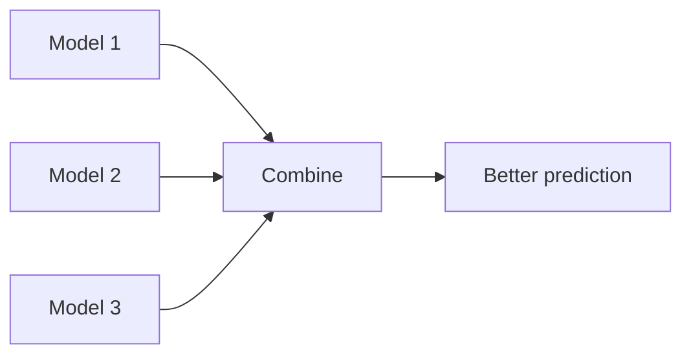

## The intuition: many opinions beat one

If you ask one person for a guess, you can get a bad answer.

If you ask 100 people and average their guesses, the result is often better.

Ensembles do the same for models. Géron opens Chapter 7 of *Hands-On Machine Learning*
with this exact analogy, calling it the **wisdom of the crowd**: aggregate the
predictions of a group of predictors — an **ensemble** — and you'll often beat the best
individual predictor in that group.

## Why ensembles work

Ensembles improve performance through:

### 1) Variance reduction (bagging)

- high-variance models (like deep decision trees) can overfit
- averaging many trees reduces sensitivity to noise

### 2) Bias reduction (boosting)

- weak learners can underfit
- boosting adds learners that fix previous errors

### 3) Better decision boundaries (model diversity)

If models make different mistakes, combining helps.



## What “diversity” means

Models should not all make the same mistakes.

How diversity is created:

- different subsamples of data (bagging)
- different feature subsets (random forests)
- sequential focus on errors (boosting)
- entirely different algorithms (voting classifiers)

## From the book: voting classifiers

Suppose you've trained a Logistic Regression classifier, an SVM, a Random Forest, and a
K-Nearest Neighbors classifier, and each achieves about 80% accuracy on its own. A very
simple way to build an even better classifier is to let them **vote**:

- **hard voting** — predict the class that gets the most votes across all classifiers
- **soft voting** — average each classifier's predicted class *probabilities*, and
  predict whichever class has the highest average probability

Soft voting usually wins because it gives more weight to confident votes, but it
requires every base classifier to expose `predict_proba()` (for `SVC`, that means
setting `probability=True`).

```python title="Hard voting classifier" showLineNumbers{1}
from sklearn.datasets import make_moons
from sklearn.model_selection import train_test_split
from sklearn.linear_model import LogisticRegression
from sklearn.ensemble import RandomForestClassifier, VotingClassifier
from sklearn.svm import SVC
from sklearn.metrics import accuracy_score

X, y = make_moons(n_samples=500, noise=0.30, random_state=42)
X_train, X_test, y_train, y_test = train_test_split(X, y, random_state=42)

log_clf = LogisticRegression()
rnd_clf = RandomForestClassifier(n_estimators=100, random_state=42)
svm_clf = SVC()

voting_clf = VotingClassifier(
    estimators=[("lr", log_clf), ("rf", rnd_clf), ("svc", svm_clf)],
    voting="hard",
)

for clf in (log_clf, rnd_clf, svm_clf, voting_clf):
    clf.fit(X_train, y_train)
    y_pred = clf.predict(X_test)
    print(clf.__class__.__name__, round(accuracy_score(y_test, y_pred), 3))
```

Notice the `VotingClassifier` line usually edges out every individual model — that's the
whole point of an ensemble.

## Weak learners can build a strong learner

Here's the surprising part: even if every individual classifier is a **weak learner**
(barely better than a coin flip), the ensemble can still be a **strong learner**, as
long as there are enough of them and they're sufficiently independent.

Géron's analogy: imagine a biased coin with a 51% chance of heads. Toss it once and
you've learned almost nothing. Toss it 1,000 times and the probability of ending up with
a majority of heads is already close to 75%. Toss it 10,000 times and that climbs above
97%. This is the **law of large numbers** — the more (independent) votes you gather, the
closer the majority tracks the true underlying probability.

The catch: this only holds if the classifiers' errors are **uncorrelated**. Classifiers
trained on the same data tend to make similar mistakes, which is why diversity (different
algorithms, different data subsets, different features) matters so much for real ensembles.

## Visualize it

Bagging trains models in parallel and votes, while boosting trains models in sequence and corrects mistakes.

```mermaid title="Bagging vs boosting" desc="Training data splits into a parallel bagging branch with majority vote and a sequential boosting branch with weighted vote"
flowchart TB
  T["Training data"] --> BG["Bagging: many models trained in PARALLEL on random subsets to majority vote"]
  T --> BO["Boosting: models trained in SEQUENCE, each fixing the previous one's errors to weighted vote"]
```

Below is the law of large numbers in action — ten independent series of biased-coin
tosses, each converging toward the true 51% bias as more coins are tossed:

```p5 title="The law of large numbers" desc="Ten independent series of biased-coin tosses (51% heads) converge toward the true 51% bias as more coins get tossed." height="280"
let series = [];
let tosses = 0;
let frame = 0;
const P = 0.51;
const N = 10;
const MAXT = 400;
function reset() {
  series = [];
  for (let i = 0; i < N; i++) series.push({ heads: 0, total: 0, ratios: [] });
  tosses = 0;
  frame = 0;
}
function setup() {
  createCanvas(600, 280);
  textFont("monospace");
  reset();
}
function px(i) { return 55 + (i / MAXT) * (width - 80); }
function py(r) { return (height - 35) - (r - 0.3) / 0.5 * (height - 65); }
function draw() {
  background(13, 17, 23);
  stroke(70);
  strokeWeight(1);
  line(55, 10, 55, height - 35);
  line(55, height - 35, width - 20, height - 35);
  stroke(255, 211, 67, 180);
  line(55, py(P), width - 20, py(P));
  noStroke();
  fill(255, 211, 67);
  textSize(11);
  textAlign(LEFT, CENTER);
  text("true bias = 51%", width - 165, py(P) - 10);

  if (tosses < MAXT) {
    for (const s of series) {
      if (random() < P) s.heads++;
      s.total++;
      s.ratios.push(s.heads / s.total);
    }
    tosses++;
  }

  for (const s of series) {
    stroke(75, 139, 190, 150);
    strokeWeight(1.3);
    noFill();
    beginShape();
    for (let i = 0; i < s.ratios.length; i++) vertex(px(i), py(s.ratios[i]));
    endShape();
  }

  noStroke();
  fill(210);
  textSize(12);
  textAlign(LEFT, TOP);
  text("tosses so far: " + tosses, 60, 14);

  frame++;
  if (frame > MAXT + 150) reset();
}
function mousePressed() { reset(); }
```

:::tip[From the book]
Géron's Netflix Prize reference is worth remembering: the winning entries in Machine
Learning competitions almost always involve several ensemble methods stacked together,
not a single "best" model. Ensembles are usually the last thing you reach for in a
project — after you already have a few good predictors to combine.
:::

## The tradeoff

Ensembles can be:

- less interpretable
- heavier (more compute)

But on many tabular problems, they are the strongest first choice.

## Mini-checkpoint

Which seems more likely to generalize?

- one deep tree
- 200 trees averaged

(Usually the averaged forest.)

import DataCampExercise from "../../../../components/DataCampExercise.astro";

## 🧪 Try It Yourself

### Exercise 1 – Build a Hard Voting Classifier

<DataCampExercise
  lang="python"
  hint={`\`VotingClassifier\` lives in \`sklearn.ensemble\`, alongside \`RandomForestClassifier\`.`}
  code={`# Task: Exercise 1 – Build a Hard Voting Classifier
from sklearn.ensemble import ___, RandomForestClassifier   # replace ___ with VotingClassifier
from sklearn.linear_model import LogisticRegression
from sklearn.svm import SVC

log_clf = LogisticRegression()
rnd_clf = RandomForestClassifier(random_state=42)
svm_clf = SVC()

voting_clf = VotingClassifier(
    estimators=[("lr", log_clf), ("rf", rnd_clf), ("svc", svm_clf)],
    voting="hard",
)
print(voting_clf.voting)

# ── Expected Output ───────────────────────────────────────────
# hard
# ──────────────────────────────────────────────────────────────`}
  solution={`from sklearn.ensemble import VotingClassifier, RandomForestClassifier
from sklearn.linear_model import LogisticRegression
from sklearn.svm import SVC

log_clf = LogisticRegression()
rnd_clf = RandomForestClassifier(random_state=42)
svm_clf = SVC()

voting_clf = VotingClassifier(
    estimators=[("lr", log_clf), ("rf", rnd_clf), ("svc", svm_clf)],
    voting="hard",
)
print(voting_clf.voting)`}
  sct={`test_output_contains("hard")
success_msg("Your voting classifier is ready!")`}
  height={148}
/>

### Exercise 2 – Enable Soft Voting for SVC

<DataCampExercise
  lang="python"
  hint={`Soft voting needs \`predict_proba()\`. For \`SVC\`, set \`probability=True\`.`}
  code={`# Task: Exercise 2 – Enable Soft Voting for SVC
from sklearn.svm import SVC

svm_clf = SVC(probability=___)   # replace ___ with True
print(svm_clf.probability)

# ── Expected Output ───────────────────────────────────────────
# True
# ──────────────────────────────────────────────────────────────`}
  solution={`from sklearn.svm import SVC

svm_clf = SVC(probability=True)
print(svm_clf.probability)`}
  sct={`test_output_contains("True")
success_msg("Now SVC can output class probabilities for soft voting!")`}
  height={128}
/>

### Exercise 3 – From Weak to Strong Learner

<DataCampExercise
  lang="python"
  hint={`A strict majority needs more than half the votes: \`n // 2 + 1\`.`}
  code={`# Task: Exercise 3 – From Weak to Strong Learner
from math import comb

p = 0.51       # each individual classifier's accuracy (barely better than a coin flip)
n = 21         # odd number of independent classifiers voting

majority = n ___ 2 + 1     # replace ___ with //
prob_correct = sum(
    comb(n, k) * (p ** k) * ((1 - p) ** (n - k))
    for k in range(majority, n + 1)
)
print(f"Ensemble accuracy: {prob_correct:.3f}")

# ── Expected Output ───────────────────────────────────────────
# Ensemble accuracy: 0.537
# ──────────────────────────────────────────────────────────────`}
  solution={`from math import comb

p = 0.51
n = 21

majority = n // 2 + 1
prob_correct = sum(
    comb(n, k) * (p ** k) * ((1 - p) ** (n - k))
    for k in range(majority, n + 1)
)
print(f"Ensemble accuracy: {prob_correct:.3f}")`}
  sct={`test_output_contains("Ensemble accuracy: 0.537")
success_msg("21 weak learners just became one strong learner!")`}
  height={168}
/>

## Next

Continue to **Bagging: Random Forest Regressor/Classifier** — see how sampling the
training set itself (instead of switching algorithms) is another powerful way to build
a diverse ensemble.
