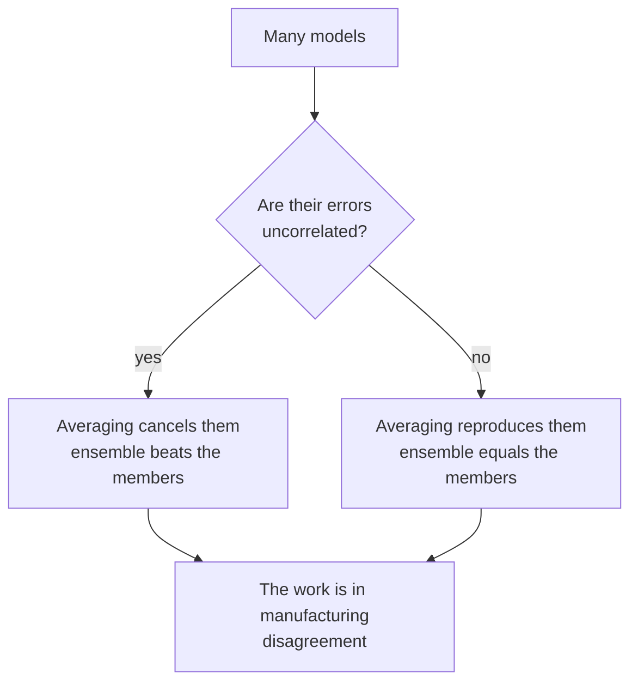

import DataCampExercise from "../../../../components/DataCampExercise.astro";
import Figure from "../../../../components/Figure.astro";
import Quiz from "../../../../components/Quiz.astro";

## What you'll learn

- **Condorcet's jury theorem**: why 51% voters become an 84% committee
- the variance formula for an average, and the **correlation term that caps the gain**
- why diversity, not individual quality, is what an ensemble is buying
- a measured case where an ensemble beats **none** of its members, and why
- the three families — bagging, boosting, stacking — mapped onto the bias-variance decomposition
- what ensembles cost: interpretability, latency, and training time

## Intuition

Ask one competent person a hard question and you get one answer, right about 60% of the time. Ask
101 of them and take the majority: **97.9%**.

The arithmetic works only under a condition that is easy to state and hard to satisfy: the voters
must be **wrong in different ways**. A hundred and one people who all read the same wrong textbook
give you one wrong answer, a hundred and one times.

That single condition explains everything in this phase. Bagging manufactures diversity by
resampling the data; random forests add feature randomness on top; boosting manufactures it by
making each model specialise in the previous one's failures; stacking gets it free by using
different model families.



## The math

### Condorcet's jury theorem

With $n$ independent voters each correct with probability $p$, the majority is correct with
probability

$$
P(\text{majority correct}) = \sum_{k=\lfloor n/2\rfloor + 1}^{n}\binom{n}{k}p^{k}(1-p)^{\,n-k}
$$

If $p > 0.5$ this tends to 1 as $n$ grows. If $p < 0.5$ it tends to **zero** — a committee of
below-chance voters is more reliably wrong than any one of them.

<Figure
  src="/images/ml/phase-05-ensembles/why-ensembles/condorcet"
  alt="Majority-vote accuracy plotted against the number of independent voters, for member accuracies of 0.45, 0.51, 0.60 and 0.70. The 0.45 curve falls toward zero; the others rise toward one at different speeds."
  title="Majority accuracy against committee size"
  caption="At 60% per member, 51 voters reach 92.7% and 101 reach 97.9%. At 45% per member, 101 voters reach 15.6% — worse than any individual."
/>

| Member accuracy | 1 voter | 11 | 51 | 101 |
| --- | --- | --- | --- | --- |
| 0.45 | 0.450 | 0.367 | 0.236 | **0.156** |
| 0.51 | 0.510 | 0.527 | 0.557 | 0.580 |
| 0.60 | 0.600 | 0.754 | 0.927 | 0.979 |
| 0.70 | 0.700 | 0.922 | 0.999 | 1.000 |

The 0.51 row is the sober one. Barely-better-than-chance voters improve *very* slowly — 101 of them
reach only 0.580. The theorem guarantees improvement; it says nothing about the rate.

### The correlation term

For $n$ models each with variance $\sigma^2$ and average pairwise correlation $\rho$, the variance
of their average is

$$
\operatorname{Var}\left(\frac{1}{n}\sum_{i=1}^{n} f_i\right)
= \rho\,\sigma^{2} + \frac{1-\rho}{n}\,\sigma^{2}
$$

Two terms, and only one of them shrinks. As $n \to \infty$ the second vanishes and you are left with

$$
\lim_{n\to\infty}\operatorname{Var} = \rho\,\sigma^{2}
$$

**Correlation is a hard floor.** No number of models gets you below it.

<Figure
  src="/images/ml/phase-05-ensembles/why-ensembles/correlation-penalty"
  alt="Ensemble variance plotted against average pairwise correlation for 5, 20 and 100 models. All three curves converge toward the diagonal as correlation approaches 1."
  title="Ensemble variance, in units of a single model's variance"
  caption="At correlation 0, 100 models cut variance to 1%. At correlation 0.6, they cut it to 60% — and 5 models would have got you to 64%. The extra 95 models bought almost nothing."
/>

| $\rho$ | 10 models | 100 models | Gain from 10 → 100 |
| --- | --- | --- | --- |
| 0.0 | 0.100 | 0.010 | 10× |
| 0.3 | 0.370 | 0.307 | 1.2× |
| 0.6 | 0.640 | 0.604 | 1.06× |
| 0.9 | 0.910 | 0.901 | 1.01× |

This is the formula that justifies every design decision in the rest of the phase. A random forest
samples **features** at each split as well as rows, purely to push $\rho$ down. Extra-Trees
randomises the split thresholds too, accepting slightly worse individual trees for a lower $\rho$ —
and usually wins.

## Worked example by hand

Three classifiers on five test rows. ✓ is correct, ✗ is wrong.

| Row | Model A | Model B | Model C | Majority | Correct? |
| --- | --- | --- | --- | --- | --- |
| 1 | ✓ | ✓ | ✗ | 2–1 correct | ✓ |
| 2 | ✓ | ✗ | ✓ | 2–1 correct | ✓ |
| 3 | ✗ | ✓ | ✓ | 2–1 correct | ✓ |
| 4 | ✓ | ✓ | ✓ | 3–0 correct | ✓ |
| 5 | ✗ | ✗ | ✗ | 3–0 wrong | ✗ |
| **Accuracy** | **0.6** | **0.6** | **0.6** | | **0.8** |

**Step 1 — the members.** Each is right 3 times out of 5: 0.60.

**Step 2 — the vote.** Right on rows 1–4: 0.80.

**Step 3 — where the gain came from.** Rows 1, 2 and 3 each have exactly one model failing, and a
*different* model each time. The majority survives every one.

**Step 4 — where it did not.** Row 5 has all three failing together. No vote can rescue that, and
no fourth model of the same kind would either.

**Step 5 — the counterfactual.** Suppose all three models failed on rows 4 and 5 together instead —
still 0.60 each, but now perfectly correlated. The majority scores 0.60. **Identical member
accuracy, no gain whatsoever.** The 0.80 came from the *pattern* of the errors, not their count.

## Diversity in pictures

<Figure
  src="/images/ml/phase-05-ensembles/why-ensembles/diverse-boundaries"
  alt="Four panels on the same two-moons data: a straight logistic boundary, a rectangular tree boundary, a smooth naive Bayes boundary, and their soft-vote combination which follows the crescents more closely than any of them."
  title="Three model families and their soft vote"
  caption="Logistic regression can only draw a line, the tree only rectangles, naive Bayes only smooth quadratics. Each is wrong in its own characteristic way, which is exactly the condition the vote needs."
/>

### Reading the plot

1. **Each member has a distinctive failure mode.** Straight, rectangular, quadratic. Those are
   different shapes of wrongness, which is the useful kind of diversity.
2. **The vote's boundary is not any of theirs.** It follows the crescents better than the line and
   more smoothly than the staircase.
3. **Diversity here is free.** No resampling and no reweighting — the model families disagree by
   construction. That is what makes
   [voting and stacking](/machine-learning/phase-05---ensemble-learning/stacking-and-voting-classifiers/)
   the cheapest ensemble to build.

## When an ensemble does not help

<Figure
  src="/images/ml/phase-05-ensembles/why-ensembles/voting-and-stacking"
  alt="Bar chart of 5-fold CV accuracy for four members and three combination strategies, with a dashed line at the best individual member. Hard voting falls below the line; soft voting and stacking exactly match it."
  title="Four members, three ways of combining them"
  caption="KNN alone scores 0.9020. Hard voting scores 0.8860 — worse than its best member. Soft voting and stacking both reach 0.9000, still short of KNN on its own."
/>

Measured on the same data with the same folds:

| Model | 5-fold CV accuracy |
| --- | --- |
| logistic regression | 0.8560 |
| decision tree (depth 4) | 0.9000 |
| **KNN (k=15)** | **0.9020** |
| Gaussian naive Bayes | 0.8580 |
| hard vote of all four | 0.8860 |
| soft vote of all four | 0.9000 |
| stacking with a logistic blender | 0.9000 |

**No ensemble beat the best individual member.** This is a real result on real folds, and it is
here because the alternative — only showing the cases where ensembles win — would teach the wrong
lesson.

What went wrong: two of the four members (logistic at 0.856 and naive Bayes at 0.858) are
substantially weaker than KNN, and hard voting gives every member an equal say. Two weak votes can
outvote one strong one. Soft voting recovers some of it by weighting by confidence, and stacking
*could* learn to ignore the weak members — with 500 rows it does not have enough data to.

:::tip[The rule this implies]
Add a model to an ensemble when it is **both** reasonably strong **and** wrong in a different way
from what is already there. A weak member that fails on the same rows as everyone else is pure
cost.
:::

## See it move

Nine voters, each 60% accurate, deciding one question after another. The tally on the right is the
committee's running accuracy against the individual average.

```p5 title="Nine voters, one committee" desc="Each round, nine independent voters answer a question with 60% accuracy each. The committee's running accuracy climbs well above the individual average." height="330"
const J = 9, ACC = 0.6;
let votes = [], correct = 0, rounds = 0, memberHits = 0, t = 0;
function newRound() {
  votes = [];
  for (let i = 0; i < J; i++) votes.push(random() < ACC ? 1 : 0);
  memberHits += votes.reduce((a, b) => a + b, 0);
  if (votes.reduce((a, b) => a + b, 0) > J / 2) correct++;
  rounds++;
}
function setup() {
  createCanvas(600, 330);
  textFont("monospace");
  newRound();
}
function draw() {
  background(13, 17, 23);
  const cols = 3, cell = 62, ox = 40, oy = 66;
  noStroke();
  for (let i = 0; i < J; i++) {
    const cx = ox + (i % cols) * cell + cell / 2;
    const cy = oy + Math.floor(i / cols) * cell + cell / 2;
    fill(votes[i] ? color(120, 200, 120) : color(232, 110, 110));
    ellipse(cx, cy, 40, 40);
    fill(13, 17, 23);
    textSize(15);
    textAlign(CENTER, CENTER);
    text(votes[i] ? "✓" : "✗", cx, cy + 1);
  }
  fill(180);
  textSize(11);
  textAlign(LEFT, BOTTOM);
  text("nine voters, each right 60% of the time", ox, oy - 12);

  const tally = votes.reduce((a, b) => a + b, 0);
  const wins = tally > J / 2;
  fill(wins ? color(120, 200, 120) : color(232, 110, 110));
  textSize(16);
  textAlign(LEFT, TOP);
  text(tally + " of " + J + " correct  ->  committee " + (wins ? "RIGHT" : "WRONG"), 265, 70);

  const memberRate = rounds ? memberHits / (rounds * J) : 0;
  const committeeRate = rounds ? correct / rounds : 0;
  fill(150);
  textSize(11);
  text("rounds: " + rounds, 265, 108);
  fill(107, 169, 221);
  textSize(13);
  text("individual average  " + memberRate.toFixed(3), 265, 134);
  fill(120, 200, 120);
  text("committee accuracy  " + committeeRate.toFixed(3), 265, 156);

  // bars
  fill(107, 169, 221);
  rect(265, 186, memberRate * 290, 16);
  fill(120, 200, 120);
  rect(265, 210, committeeRate * 290, 16);
  fill(140);
  textSize(10);
  textAlign(LEFT, BOTTOM);
  text("theory says the committee converges to 0.925 for nine voters", ox, height - 12);

  t++;
  if (t % 28 === 0) newRound();
  if (rounds > 400) { correct = 0; rounds = 0; memberHits = 0; }
}
function mousePressed() { correct = 0; rounds = 0; memberHits = 0; newRound(); }
```

## The three families

| Family | Members are | Built | Attacks | Example |
| --- | --- | --- | --- | --- |
| **Bagging** | Strong, low bias, high variance | In parallel, on bootstrap samples | Variance | Random Forest |
| **Boosting** | Weak, high bias, low variance | Sequentially, each fixing the last | Bias | AdaBoost, XGBoost |
| **Stacking** | Whatever you have, ideally diverse | In parallel, then a blender learns the weights | Both | `StackingClassifier` |

Each maps directly onto a term of the
[bias-variance decomposition](/machine-learning/phase-07---model-optimization--tuning/bias-vs-variance-tradeoff/).
Bagging averages away variance and leaves bias alone. Boosting drives bias down and slowly raises
variance. Stacking learns a weighting that can improve either.

## What ensembles cost

| Cost | Detail |
| --- | --- |
| **Interpretability** | One tree is a set of rules; 300 trees is not |
| **Prediction latency** | Every member runs on every request |
| **Training time** | Roughly linear in members; boosting cannot be parallelised across them |
| **Memory** | The whole ensemble must be held and shipped |
| **Debuggability** | "Why this prediction?" needs SHAP rather than reading the model |

A single decision tree that scores 0.92 may be worth more than a forest at 0.94 if a regulator has
to approve it.

## Pitfalls

:::danger[Ensembling correlated models]
Five random forests with different seeds are near-identical, so $\rho \approx 0.95$ and averaging
gains almost nothing. Diversity has to be engineered, not hoped for.
:::

:::caution[Assuming an ensemble always wins]
The table above is a counterexample from real folds. Always compare the ensemble against its best
member on identical cross-validation, and be willing to ship the single model.
:::

:::caution[Hard voting with unequal members]
Equal votes let two weak models outvote one strong one — exactly what dropped hard voting to 0.8860
here. Prefer soft voting when the members produce calibrated probabilities, or weight the votes.
:::

:::caution[Ensembling the same model with different seeds]
This reduces seed variance, not model variance. Real gains need different data samples, different
features or different algorithms.
:::

<Quiz
  questions={[
    {
      q: "A committee of 101 voters, each 45% accurate, votes by majority. How accurate is the committee?",
      options: ["45%", "About 15.6% — worse than any individual", "About 84%", "50%"],
      answer: 1,
      explain: "Condorcet's theorem cuts both ways. Below 50% per member, the majority converges toward zero: 101 below-chance voters are reliably wrong.",
    },
    {
      q: "Your 100 models have average pairwise correlation 0.6. Roughly what fraction of a single model's variance remains?",
      options: ["1%", "10%", "60%", "0%"],
      answer: 2,
      explain: "Variance is rho + (1-rho)/n = 0.6 + 0.004 = 0.604. Correlation is a floor: 5 models would have reached 0.64, so the other 95 bought almost nothing.",
    },
    {
      q: "Three models each score 0.60 and their vote scores 0.80. What produced the gain?",
      options: [
        "The models were unusually accurate",
        "They failed on different rows, so a majority survived each individual failure",
        "Voting always adds about 20 points",
        "One model was secretly much better",
      ],
      answer: 1,
      explain: "Had all three failed on the same two rows, the vote would also score 0.60. The gain came from the pattern of errors, not their count.",
    },
    {
      q: "On the moons data, hard voting scored 0.8860 while its best member scored 0.9020. What is the most likely cause?",
      options: [
        "A bug in the code",
        "Two of the four members are markedly weaker, and equal votes let them outvote the strongest",
        "Voting classifiers are always worse",
        "Not enough members",
      ],
      answer: 1,
      explain: "Hard voting gives every member an identical say. Logistic regression at 0.856 and naive Bayes at 0.858 can jointly outvote KNN at 0.902.",
    },
  ]}
/>

## 🧪 Try It Yourself

### Exercise 1 – Condorcet by hand

<DataCampExercise
  lang="python"
  hint={`binom.cdf(n // 2, n, p) is the probability of at most half being correct.`}
  code={`# Task: Exercise 1 - Condorcet by hand
from scipy.stats import binom

for member in (0.45, 0.60):
    for n in (1, 11, 101):
        majority = 1 - binom.___(n // 2, n, member)      # replace ___ with cdf
        print(f"member {member}  n={n:>3}  majority {majority:.4f}")

# -- Expected Output -------------------------------------------
# member 0.45  n=  1  majority 0.4500
# member 0.45  n= 11  majority 0.3669
# member 0.45  n=101  majority 0.1562
# member 0.6  n=  1  majority 0.6000
# member 0.6  n= 11  majority 0.7535
# member 0.6  n=101  majority 0.9791
# --------------------------------------------------------------`}
  solution={`from scipy.stats import binom

for member in (0.45, 0.60):
    for n in (1, 11, 101):
        majority = 1 - binom.cdf(n // 2, n, member)
        print(f"member {member}  n={n:>3}  majority {majority:.4f}")`}
  sct={`test_output_contains("majority 0.9791")
success_msg("60% members become a 97.9% committee. 45% members become a 15.6% one.")`}
  height={218}
/>

### Exercise 2 – The correlation floor

<DataCampExercise
  lang="python"
  hint={`Ensemble variance is rho + (1 - rho) / n, in units of a single model's variance.`}
  code={`# Task: Exercise 2 - The correlation floor
for rho in (0.0, 0.3, 0.6, 0.9):
    v10 = rho + (1 - rho) / 10
    v100 = rho + (1 - rho) / ___              # replace ___ with 100
    print(f"rho={rho}:  10 models {v10:.4f}   100 models {v100:.4f}"
          f"   gain {v10 / v100:.2f}x")

# -- Expected Output -------------------------------------------
# rho=0.0:  10 models 0.1000   100 models 0.0100   gain 10.00x
# rho=0.3:  10 models 0.3700   100 models 0.3070   gain 1.21x
# rho=0.6:  10 models 0.6400   100 models 0.6040   gain 1.06x
# rho=0.9:  10 models 0.9100   100 models 0.9010   gain 1.01x
# --------------------------------------------------------------`}
  solution={`for rho in (0.0, 0.3, 0.6, 0.9):
    v10 = rho + (1 - rho) / 10
    v100 = rho + (1 - rho) / 100
    print(f"rho={rho}:  10 models {v10:.4f}   100 models {v100:.4f}"
          f"   gain {v10 / v100:.2f}x")`}
  sct={`test_output_contains("gain 1.01x")
success_msg("At correlation 0.9, going from 10 models to 100 improves variance by 1%.")`}
  height={208}
/>

### Exercise 3 – The five-row vote

<DataCampExercise
  lang="python"
  hint={`Sum the three models' correctness per row and check whether it exceeds half.`}
  code={`# Task: Exercise 3 - The five-row vote
import numpy as np

# 1 = correct, 0 = wrong, one row per test example
A = np.array([1, 1, 0, 1, 0])
B = np.array([1, 0, 1, 1, 0])
C = np.array([0, 1, 1, 1, 0])

votes = A + B + ___                    # replace ___ with C
majority = (votes >= 2).astype(int)

print("A:", A.mean(), " B:", B.mean(), " C:", C.mean())
print("majority:", majority.mean())
print("ensemble beat every member:", majority.mean() > max(A.mean(), B.mean(), C.mean()))

# -- Expected Output -------------------------------------------
# A: 0.6  B: 0.6  C: 0.6
# majority: 0.8
# ensemble beat every member: True
# --------------------------------------------------------------`}
  solution={`import numpy as np

A = np.array([1, 1, 0, 1, 0])
B = np.array([1, 0, 1, 1, 0])
C = np.array([0, 1, 1, 1, 0])
votes = A + B + C
majority = (votes >= 2).astype(int)
print("A:", A.mean(), " B:", B.mean(), " C:", C.mean())
print("majority:", majority.mean())
print("ensemble beat every member:", majority.mean() > max(A.mean(), B.mean(), C.mean()))`}
  sct={`test_output_contains("majority: 0.8")
success_msg("Three 0.60 models into a 0.80 committee, purely from failing on different rows.")`}
  height={208}
/>

### Exercise 4 – Correlated members gain nothing

<DataCampExercise
  lang="python"
  hint={`Make all three models fail on the same rows and recompute the vote.`}
  code={`# Task: Exercise 4 - Correlated members gain nothing
import numpy as np

# All three fail on exactly the same two rows
A = np.array([1, 1, 1, 0, 0])
B = np.array([1, 1, 1, 0, 0])
C = np.array([1, 1, 1, 0, ___])        # replace ___ with 0

majority = ((A + B + C) >= 2).astype(int)

print("members:", A.mean(), B.mean(), C.mean())
print("majority:", majority.mean())
print("any gain:", majority.mean() > A.mean())

# -- Expected Output -------------------------------------------
# members: 0.6 0.6 0.6
# majority: 0.6
# any gain: False
# --------------------------------------------------------------`}
  solution={`import numpy as np

A = np.array([1, 1, 1, 0, 0])
B = np.array([1, 1, 1, 0, 0])
C = np.array([1, 1, 1, 0, 0])
majority = ((A + B + C) >= 2).astype(int)
print("members:", A.mean(), B.mean(), C.mean())
print("majority:", majority.mean())
print("any gain:", majority.mean() > A.mean())`}
  sct={`test_output_contains("any gain: False")
success_msg("Same member accuracy as Exercise 3, zero gain. Diversity was doing all the work.")`}
  height={198}
/>

### Exercise 5 – Check whether the ensemble actually wins

<DataCampExercise
  lang="python"
  hint={`Cross-validate each member and the voting classifier on identical folds.`}
  code={`# Task: Exercise 5 - Check whether the ensemble actually wins
from sklearn.datasets import make_moons
from sklearn.ensemble import VotingClassifier
from sklearn.linear_model import LogisticRegression
from sklearn.model_selection import cross_val_score
from sklearn.naive_bayes import GaussianNB
from sklearn.neighbors import KNeighborsClassifier
from sklearn.pipeline import make_pipeline
from sklearn.preprocessing import StandardScaler
from sklearn.tree import DecisionTreeClassifier

X, y = make_moons(n_samples=500, noise=0.3, random_state=1)
members = [
    ("logistic", make_pipeline(StandardScaler(), LogisticRegression())),
    ("tree", DecisionTreeClassifier(max_depth=4, random_state=0)),
    ("knn", make_pipeline(StandardScaler(), KNeighborsClassifier(15))),
    ("nb", GaussianNB()),
]

scores = {n: cross_val_score(m, X, y, cv=5).mean() for n, m in members}
hard = cross_val_score(VotingClassifier(members, voting="___"), X, y, cv=5).mean()
# replace ___ with hard

for n, s in scores.items():
    print(f"{n:<9} {s:.4f}")
print(f"{'hard vote':<9} {hard:.4f}")
print("beat the best member:", hard > max(scores.values()))

# -- Expected Output -------------------------------------------
# logistic  0.8560
# tree      0.9000
# knn       0.9020
# nb        0.8580
# hard vote 0.8860
# beat the best member: False
# --------------------------------------------------------------`}
  solution={`from sklearn.datasets import make_moons
from sklearn.ensemble import VotingClassifier
from sklearn.linear_model import LogisticRegression
from sklearn.model_selection import cross_val_score
from sklearn.naive_bayes import GaussianNB
from sklearn.neighbors import KNeighborsClassifier
from sklearn.pipeline import make_pipeline
from sklearn.preprocessing import StandardScaler
from sklearn.tree import DecisionTreeClassifier

X, y = make_moons(n_samples=500, noise=0.3, random_state=1)
members = [
    ("logistic", make_pipeline(StandardScaler(), LogisticRegression())),
    ("tree", DecisionTreeClassifier(max_depth=4, random_state=0)),
    ("knn", make_pipeline(StandardScaler(), KNeighborsClassifier(15))),
    ("nb", GaussianNB()),
]
scores = {n: cross_val_score(m, X, y, cv=5).mean() for n, m in members}
hard = cross_val_score(VotingClassifier(members, voting="hard"), X, y, cv=5).mean()
for n, s in scores.items():
    print(f"{n:<9} {s:.4f}")
print(f"{'hard vote':<9} {hard:.4f}")
print("beat the best member:", hard > max(scores.values()))`}
  sct={`test_output_contains("beat the best member: False")
success_msg("Always run this check. Ensembles are not free wins.")`}
  height={288}
/>

## Recap

- Condorcet: independent voters above 50% converge to certainty; below 50% they converge to
  certainty about the wrong answer.
- The variance of an average is $\rho\sigma^2 + \frac{1-\rho}{n}\sigma^2$. **Correlation is a
  floor** no ensemble size can breach.
- Three 0.60 models voting to 0.80 do so because they fail on *different* rows. Make them fail
  together and the vote scores 0.60.
- Measured counterexample: on the moons data, no combination of four members beat the best member.
  Hard voting actually lost 1.6 points.
- Bagging attacks variance, boosting attacks bias, stacking learns a weighting over both.
- The cost is interpretability, latency and training time, and it is sometimes not worth paying.

### Exercise 6 – When does a majority vote help?

<DataCampExercise
  lang="python"
  hint={`Enumerate every possible pattern of correct and incorrect votes with itertools.product, and add up the probability of the patterns where a majority is correct.`}
  code={`# Task: Exercise 6 - When does a majority vote help?
from itertools import product


def ensemble_accuracy(p, n_models):
    """Majority vote of n independent models each correct with probability p."""
    total = 0.0
    for votes in product([0, 1], repeat=n_models):
        correct = sum(votes)
        probability = p ** correct * (1 - p) ** (n_models - correct)
        if correct * 2 ___ n_models:            # replace ___ with >
            total += probability
    return total


print(f"{'p':>5} {'1 model':>9} {'3 models':>9} {'11 models':>10} {'25 models':>10}")
for p in (0.45, 0.51, 0.60, 0.75):
    row = [ensemble_accuracy(p, n) for n in (1, 3, 11, 25)]
    print(f"{p:5.2f} {row[0]:9.4f} {row[1]:9.4f} {row[2]:10.4f} {row[3]:10.4f}")
print("below p = 0.5 the vote makes things WORSE, and it does so faster "
      "with more models")

# -- Expected Output -------------------------------------------
#     p   1 model  3 models  11 models  25 models
#  0.45    0.4500    0.4253     0.3669     0.3063
#  0.51    0.5100    0.5150     0.5271     0.5402
#  0.60    0.6000    0.6480     0.7535     0.8462
#  0.75    0.7500    0.8438     0.9657     0.9966
# below p = 0.5 the vote makes things WORSE, and it does so faster with more models
# --------------------------------------------------------------`}
  solution={`from itertools import product


def ensemble_accuracy(p, n_models):
    total = 0.0
    for votes in product([0, 1], repeat=n_models):
        correct = sum(votes)
        probability = p ** correct * (1 - p) ** (n_models - correct)
        if correct * 2 > n_models:
            total += probability
    return total


print(f"{'p':>5} {'1 model':>9} {'3 models':>9} {'11 models':>10} {'25 models':>10}")
for p in (0.45, 0.51, 0.60, 0.75):
    row = [ensemble_accuracy(p, n) for n in (1, 3, 11, 25)]
    print(f"{p:5.2f} {row[0]:9.4f} {row[1]:9.4f} {row[2]:10.4f} {row[3]:10.4f}")
print("below p = 0.5 the vote makes things WORSE, and it does so faster "
      "with more models")`}
  sct={`test_output_contains("0.3063")
success_msg("Two conditions, both necessary: each member must be better than chance, and the members must be independent. The 0.45 row shows the first failing — 25 weak-but-worse-than-chance models vote themselves down to 0.3063. Real ensembles also violate the second, which is why measured gains are smaller than this table.")`}
  height={310}
/>

## Next

Continue to
[Bagging - Random Forest Regressor/Classifier](/machine-learning/phase-05---ensemble-learning/bagging-random-forest-regressor-classifier/)
— manufacturing diversity by resampling, and getting a validation score for free while doing it.
