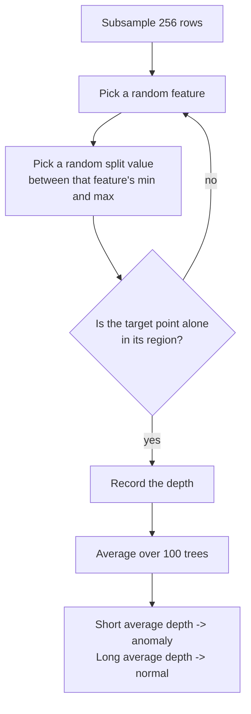

import DataCampExercise from "../../../../components/DataCampExercise.astro";
import AlgorithmCard from "../../../../components/AlgorithmCard.astro";
import Figure from "../../../../components/Figure.astro";
import Quiz from "../../../../components/Quiz.astro";

## What you'll learn

- why **isolating** an anomaly is easier than modelling normality, and why that inverts the usual cost
- the path-length score, its harmonic-number normalisation, and the meaning of $s = 0.5$
- measured separation: outliers isolate at depth **9.46**, inliers at **18.09**
- why `max_samples=256` is the default and why *sub*sampling improves accuracy here
- `contamination` as a threshold, not a model — the precision/recall curve it traces
- four detectors on identical data: 16, 17, 13 and 18 correct out of 20
- when to use Isolation Forest, and the three situations where it is the wrong tool

## Intuition

Most anomaly detection tries to build a model of "normal" and then flags whatever the model fits
badly. That is expensive: you have to characterise the bulk of the data precisely, and the bulk is
where nearly all the data is.

Isolation Forest inverts the problem. It observes that **anomalies are few and different**, and
that those two properties make them *easy to separate from everything else*. So instead of
describing normality, it repeatedly cuts the feature space at random and asks a much cheaper
question: how many cuts did it take before this point ended up alone?

A point in the middle of a dense cloud is surrounded, so a random cut is unlikely to separate it
from its neighbours — it takes many cuts. A point sitting far out on its own gets sliced off
almost immediately. **Short path to isolation means anomalous.**

The consequence is unusual and worth appreciating: this algorithm never computes a distance, never
estimates a density, and never looks at the whole dataset. It is the rare case where the anomaly
detector is *cheaper* than the thing it is detecting anomalies in.



## The math

An **isolation tree** is built by recursively choosing a random feature $q$ and a random split
value $p$ uniformly between the current node's minimum and maximum of $q$, until every point is
alone or a height limit is hit.

Write $h(x)$ for the path length of point $x$ — the number of edges from the root to its
terminating node.

Path length alone is not comparable across dataset sizes: a tree over 10,000 points is deeper than
one over 100 points, for everyone. The normalisation comes from the fact that an isolation tree is
structurally a **binary search tree**, and the average unsuccessful-search path length in a BST
over $n$ nodes is known:

$$
c(n) = 2H(n-1) - \frac{2(n-1)}{n}, \qquad
H(i) = \ln(i) + \gamma, \quad \gamma \approx 0.5772156649
$$

where $\gamma$ is the Euler-Mascheroni constant. Dividing by $c(n)$ makes depths comparable. The
anomaly score is then

$$
s(x, n) = 2^{\,-\dfrac{E[h(x)]}{c(n)}}
$$

where $E[h(x)]$ is the average path length over all the trees. Read the three regimes off the
exponent:

| $E[h(x)]$ relative to $c(n)$ | $s$ | Verdict |
| --- | --- | --- |
| $E[h] \to 0$ | $\to 1$ | Isolated instantly — definite anomaly |
| $E[h] = c(n)$ | **exactly 0.5** | Average depth — indistinguishable from normal |
| $E[h] \to n - 1$ | $\to 0$ | Very deep — definitely normal |

With $n = 256$:

$$
c(256) = 2\big(\ln 255 + 0.5772\big) - \frac{2 \times 255}{256} = 10.2448
$$

So a point isolated at average depth 4 scores $2^{-4/10.2448} = 0.7629$, at depth 10.2448 scores
exactly $0.5$, and at depth 14 scores $0.3878$.

**scikit-learn flips the sign.** Its `score_samples` returns the *negative* of the above, so
**lower is more anomalous** and the values are negative. `decision_function` is
`score_samples - offset_`, which puts the decision boundary at zero. Getting this backwards is the
single most common bug with this estimator.

### Why subsample?

The default `max_samples=256` is not a speed compromise — it makes the detector *more accurate*.
Two effects work against large samples:

- **Swamping**: with many points, normal points near a cluster of anomalies get dragged into
  looking anomalous.
- **Masking**: a dense clump of anomalies looks like a legitimate small cluster and stops being
  isolated quickly.

Subsampling breaks up both. Each tree sees a different 256 rows, so an anomaly clump rarely
survives intact in any one of them. The original paper found accuracy plateaus around 256 and adding
more rows does not help — which is why the parameter is a fixed count, not a fraction.

## Worked example by hand

Six points on a line: $1, 2, 3, 4, 5, 20$. The value 20 is the obvious anomaly.

Build one isolation tree. The root spans $[1, 20]$. Draw a random split $p \sim U(1, 20)$.

The point 20 is isolated at depth 1 whenever $p > 5$ — probability
$(20 - 5)/(20 - 1) = 15/19 = 0.789$. Four times out of five, one cut is enough.

The point 3 **can never be isolated at depth 1**. It has neighbours on both sides, so any single
split leaves it with company: $p \in (2, 3)$ gives $\{3, 4, 5, 20\}$ on the right, and
$p \in (3, 4)$ gives $\{1, 2, 3\}$ on the left. Its shortest possible path is 2, and typically it
is much longer.

Averaging over 4,000 random trees:

| Point | $E[h]$ |
| --- | --- |
| 1 | 3.904 |
| 2 | 5.285 |
| 3 | 5.952 |
| 4 | 6.309 |
| 5 | 5.244 |
| **20** | **1.222** |

With $n = 6$:

$$
c(6) = 2(\ln 5 + 0.5772) - \frac{2 \times 5}{6} = 4.3733 - 1.6667 = 2.7066
$$

So 20 scores $2^{-1.222/2.7066} = 0.7314$ while 3 scores $2^{-5.952/2.7066} = 0.2178$. Comfortably
above and comfortably below 0.5 — exactly the split the score is designed to produce.

Note that the two *edge* points, 1 and 5, score higher than the interior ones. That is correct
behaviour, not an artefact: being at the edge of the range genuinely does make you easier to
isolate, and every isolation-based method inherits this mild edge bias.

Scaled up to 300 points in two dimensions — 280 from a correlated Gaussian and 20 uniform outliers
— the separation is unambiguous:

| Group | Mean depth to isolation (60 trees) |
| --- | --- |
| True outliers | **9.46** |
| Inliers | **18.09** |

<Figure
  src="/images/ml/phase-06-unsupervised/anomaly-detection-with-isolation-forests/path-lengths"
  alt="A scatter plot coloured by mean isolation depth, dark in the dense centre and bright at the edges, beside a histogram where the outlier depths cluster near 6 and the inlier depths near 18."
  title="Isolation depth separates the two populations"
  caption="Left: mean depth over 60 random trees, per point. Right: the same values as two histograms. Outliers average 9.46 and inliers 18.09. The overlap in the middle is real — a handful of the uniform outliers happened to land inside the cloud, and no method can find those."
/>

## See it move

```p5 title="Random splits isolate outliers first" desc="Each beat adds one random axis-aligned cut. Points turn red the moment they are alone in their region; the corner outliers go red in a few splits while the crowd takes dozens." height="300"
let pts = [];
let regions = [];
let stepCount = 0;
let t = 0;

function makePoints() {
  pts = [];
  for (let i = 0; i < 24; i++) {
    pts.push({ x: 300 + random(-70, 70), y: 150 + random(-60, 60), isolatedAt: null });
  }
  const outlierPos = [[40, 40], [560, 45], [45, 260], [545, 255]];
  for (const [ox, oy] of outlierPos) {
    pts.push({ x: ox + random(-6, 6), y: oy + random(-6, 6), isolatedAt: null });
  }
}

function reset() {
  makePoints();
  regions = [{ x0: 10, y0: 10, x1: width - 10, y1: height - 10, members: pts.slice() }];
  stepCount = 0;
  t = 0;
}

function setup() {
  createCanvas(600, 300);
  textFont("monospace");
  reset();
}

function splitOnce() {
  const candidates = regions.filter((r) => r.members.length > 1);
  if (candidates.length === 0) return false;
  const r = random(candidates);
  const axis = random() < 0.5 ? "x" : "y";
  const lo = axis === "x" ? r.x0 : r.y0;
  const hi = axis === "x" ? r.x1 : r.y1;
  if (hi - lo < 8) return true;
  const cut = random(lo + 4, hi - 4);
  let r1, r2;
  if (axis === "x") {
    r1 = { x0: r.x0, y0: r.y0, x1: cut, y1: r.y1, members: r.members.filter((p) => p.x < cut) };
    r2 = { x0: cut, y0: r.y0, x1: r.x1, y1: r.y1, members: r.members.filter((p) => p.x >= cut) };
  } else {
    r1 = { x0: r.x0, y0: r.y0, x1: r.x1, y1: cut, members: r.members.filter((p) => p.y < cut) };
    r2 = { x0: r.x0, y0: cut, x1: r.x1, y1: r.y1, members: r.members.filter((p) => p.y >= cut) };
  }
  regions.splice(regions.indexOf(r), 1);
  regions.push(r1, r2);
  stepCount++;
  for (const reg of [r1, r2]) {
    if (reg.members.length === 1 && reg.members[0].isolatedAt === null) {
      reg.members[0].isolatedAt = stepCount;
    }
  }
  return true;
}

function draw() {
  background(13, 17, 23);
  noFill();
  stroke(55);
  strokeWeight(1);
  for (const r of regions) rect(r.x0, r.y0, r.x1 - r.x0, r.y1 - r.y0);

  noStroke();
  for (const p of pts) {
    if (p.isolatedAt !== null) fill(235, 90, 90);
    else fill(75, 139, 190);
    ellipse(p.x, p.y, 9, 9);
  }

  fill(150);
  textSize(12);
  textAlign(LEFT, CENTER);
  const isolatedCount = pts.filter((p) => p.isolatedAt !== null).length;
  text("splits: " + stepCount + "   isolated: " + isolatedCount + " / " + pts.length, 12, 16);

  t++;
  if (t % 18 === 0) splitOnce();
  const allDone = pts.every((p) => p.isolatedAt !== null);
  if (allDone && t % 18 === 0 && t > 300) reset();
}

function mousePressed() {
  reset();
}
```

The next sketch shows the scoring formula directly: drag through the depth axis and watch $s$
cross 0.5 exactly where $E[h] = c(n)$.

```p5 title="Path length becomes a score" desc="The curve is s = 2^(-E[h]/c(n)). The marker sweeps along it; the readout shows the depth, the normalisation c(n) for the current sample size, and the resulting score." height="340"
let n = 256, h = 0, dir = 1;
function cn(m) {
  if (m <= 1) return 1e-9;
  const H = Math.log(m - 1) + 0.5772156649;
  return 2 * H - (2 * (m - 1)) / m;
}
function setup() { createCanvas(600, 340); textFont("monospace"); }
function draw() {
  background(13, 17, 23);
  const ox = 60, oy = 56, w = width - 130, hgt = 190;
  const C = cn(n);
  const HMAX = 30;
  const px = d => ox + (d / HMAX) * w;
  const py = s => oy + hgt - s * hgt;

  // axes
  stroke(60, 70, 84); strokeWeight(1);
  line(ox, oy + hgt, ox + w, oy + hgt);
  line(ox, oy, ox, oy + hgt);
  // s = 0.5 reference
  stroke(120, 130, 145); strokeWeight(1);
  drawingContext.setLineDash([4, 4]);
  line(ox, py(0.5), ox + w, py(0.5));
  line(px(C), oy, px(C), oy + hgt);
  drawingContext.setLineDash([]);

  // the curve
  noFill(); stroke(107, 169, 221); strokeWeight(2.4);
  beginShape();
  for (let d = 0; d <= HMAX; d += 0.2) vertex(px(d), py(Math.pow(2, -d / C)));
  endShape();

  const s = Math.pow(2, -h / C);
  noStroke(); fill(255, 211, 67);
  ellipse(px(h), py(s), 11, 11);

  textSize(12); textAlign(LEFT, TOP);
  fill(150);
  text("E[h(x)] = average path length over the trees", ox, oy + hgt + 14);
  textAlign(RIGHT, TOP);
  text("s = 0.5", ox + w, py(0.5) - 18);
  textAlign(LEFT, TOP);
  fill(107, 169, 221);
  textSize(13);
  text("n = " + n + "    c(n) = " + C.toFixed(4), ox, 16);
  fill(255, 211, 67);
  text("E[h] = " + h.toFixed(2) + "    s = " + s.toFixed(4) +
       (s > 0.5 ? "   ANOMALY" : "   normal"), ox, 34);
  fill(140); textSize(10); textAlign(LEFT, BOTTOM);
  text("click to change the subsample size n (64 / 256 / 1024 / 4096)", ox, height - 12);

  h += 0.10 * dir;
  if (h > HMAX) dir = -1;
  if (h < 0) dir = 1;
}
function mousePressed() {
  n = n === 64 ? 256 : n === 256 ? 1024 : n === 1024 ? 4096 : 64;
}
```

Notice how little $c(n)$ moves: 64 rows give 7.72, 4096 give 15.79. Path length grows roughly
logarithmically in $n$, which is exactly why the normalisation is a logarithm.

## contamination is a threshold, not a model

`contamination` does not change a single tree. It only decides where to cut the score
distribution — it sets `offset_` to the corresponding quantile. Getting it wrong therefore costs
you nothing in model quality and everything in what comes out.

On 300 points containing 20 genuine outliers (a true rate of 6.67%):

| `contamination` | Points flagged | Precision | Recall |
| --- | --- | --- | --- |
| 0.01 | 3 | **1.0000** | 0.1500 |
| 0.02 | 6 | **1.0000** | 0.3000 |
| 0.04 | 12 | 0.9167 | 0.5500 |
| **0.0667** | **20** | **0.8000** | **0.8000** |
| 0.10 | 30 | 0.6333 | 0.9500 |
| 0.15 | 45 | 0.4444 | **1.0000** |
| 0.20 | 60 | 0.3333 | 1.0000 |
| 0.30 | 90 | 0.2222 | 1.0000 |

The number flagged is exactly `round(contamination × n)` in every row — the parameter is a quota,
not a discovery. Setting it to the true rate balances precision and recall at 0.80 each.

<Figure
  src="/images/ml/phase-06-unsupervised/anomaly-detection-with-isolation-forests/contamination-sweep"
  alt="A line plot of precision falling and recall rising as contamination increases, crossing at the true rate of 6.7 percent, beside a bar chart showing the number of points flagged growing linearly with contamination."
  title="One parameter, one trade-off"
  caption="Precision and recall cross exactly at the true contamination rate. The right panel shows why: the number flagged is contamination times n, regardless of what the scores look like. Estimate the rate from the domain, or set it low and triage the top of the ranking by hand."
/>

The underlying ranking is excellent regardless: the ROC AUC of the raw scores is **0.9902**. The
model knows which points are odd. `contamination` only decides how many of them you are told about.

<Figure
  src="/images/ml/phase-06-unsupervised/anomaly-detection-with-isolation-forests/score-surface"
  alt="A filled contour plot with a blue high-scoring region over the data cloud fading to red at the edges, a thick contour line at zero, and amber crosses marking the flagged points outside it."
  title="The decision function across the whole plane"
  caption="decision_function is positive inside the learned normal region and negative outside; the thick line is the zero contour set by contamination=0.07. The contours are blocky because they are built from axis-aligned random cuts — this is what an ensemble of 100 isolation trees actually looks like."
/>

## Four detectors, one dataset

Same 300 points, same 20 planted outliers, same 7% budget:

| Detector | Correct (of 20) | False alarms | Idea |
| --- | --- | --- | --- |
| `IsolationForest` | 16 | 5 | Random splits; short path = odd |
| `LocalOutlierFactor` | 17 | 4 | Local density versus your neighbours' local density |
| `OneClassSVM` | 13 | 7 | A boundary enclosing the normal region |
| `EllipticEnvelope` | **18** | **3** | Robust Gaussian fit; Mahalanobis distance |

<Figure
  src="/images/ml/phase-06-unsupervised/anomaly-detection-with-isolation-forests/detector-comparison"
  alt="Four scatter plots of the same contaminated cloud. Green crosses mark correctly identified outliers and red crosses mark wrongly flagged inliers, with counts in each title."
  title="Four detectors on identical data"
  caption="EllipticEnvelope wins here, and it should: the inliers really were drawn from a single correlated Gaussian, which is exactly its assumption. Isolation Forest is two behind while assuming nothing about the distribution. On non-Gaussian data the ranking reverses."
/>

That result is worth stating plainly: **the best detector on this page is not Isolation Forest.**
EllipticEnvelope wins because the data was generated from a bivariate Gaussian and it fits a
bivariate Gaussian. That is a property of the benchmark, not evidence of general superiority — and
it is the reason to be suspicious of any anomaly-detection comparison, including this one.

Isolation Forest's case is different: it makes no distributional assumption, scales to millions of
rows, handles dozens of features, and has essentially nothing to tune. On real data where you do
not know the shape of "normal", those properties matter more than two extra hits on a synthetic
benchmark.

| Detector | Assumes | Scales to 1M rows | High dimensions | Has `predict` |
| --- | --- | --- | --- | --- |
| IsolationForest | nothing much | **yes** | **good** | yes |
| LocalOutlierFactor | local density is meaningful | no ($O(n^2)$) | poor | only with `novelty=True` |
| OneClassSVM | a kernel-shaped boundary | no ($O(n^2)$–$O(n^3)$) | moderate | yes |
| EllipticEnvelope | **the data is Gaussian** | moderate | poor if $p > n$ | yes |
| SGDOneClassSVM | a linear boundary in kernel space | **yes** | moderate | yes |

## In code

```python title="isolation_forest.py" showLineNumbers{1}
import numpy as np
from sklearn.ensemble import IsolationForest

rng = np.random.default_rng(3)
cov = np.array([[1.0, 0.75], [0.75, 1.0]])
inliers = rng.multivariate_normal([0, 0], cov, size=280)
outliers = rng.uniform(-5, 5, size=(20, 2))
X = np.vstack([inliers, outliers])

clf = IsolationForest(
    n_estimators=100,      # more trees = more stable scores, no overfitting risk
    max_samples=256,       # the paper's default; subsampling improves accuracy
    contamination=0.07,    # a THRESHOLD, not a model parameter
    random_state=0,
).fit(X)

pred = clf.predict(X)              # +1 inlier, -1 outlier
scores = clf.score_samples(X)      # LOWER is more anomalous (sklearn flips the sign)
margin = clf.decision_function(X)  # score_samples - offset_; negative means flagged

print("flagged        ", int((pred == -1).sum()))         # 21
print("offset_        ", round(clf.offset_, 4))           # -0.5382
print("inlier  mean s ", round(scores[:280].mean(), 4))   # -0.4212
print("outlier mean s ", round(scores[280:].mean(), 4))   # -0.6387
```

Ranking beats thresholding whenever a human is going to look at the results anyway:

```python title="rank_dont_threshold.py" showLineNumbers{1}
import numpy as np

# Forget contamination — hand the analyst the 20 oddest rows.
order = np.argsort(clf.score_samples(X))     # most anomalous first
top20 = order[:20]
print("indices of the 20 most anomalous rows:", top20)

# How many were real? (Only knowable here because we planted them.)
print("hits in the top 20:", int((top20 >= 280).sum()))
```

And when you genuinely have labels, measure the ranking rather than the threshold:

```python title="evaluate.py" showLineNumbers{1}
from sklearn.metrics import average_precision_score, roc_auc_score

y_true = np.concatenate([np.zeros(280), np.ones(20)])    # 1 = outlier
y_score = -clf.score_samples(X)                          # flip so higher = more anomalous

print("ROC AUC", round(roc_auc_score(y_true, y_score), 4))            # 0.9902
print("PR AUC ", round(average_precision_score(y_true, y_score), 4))
```

With 6.7% positives, **average precision is the more honest number** — ROC AUC flatters imbalanced
problems, exactly as it does in
[supervised classification](/machine-learning/phase-04---supervised-learning---classification/the-roc-curve-and-auc/).

### Novelty detection versus outlier detection

Two different jobs that use the same estimators:

**Outlier detection** — the training set is already contaminated, and you want to know which of
*these* rows are odd. `fit_predict(X)`.

**Novelty detection** — the training set is clean, and you want to flag odd rows *in future data*.
`fit(X_clean)` then `predict(X_new)`.

Isolation Forest supports both directly. `LocalOutlierFactor` requires `novelty=True` at
construction time and then forbids `fit_predict` — a common source of confusion.

<AlgorithmCard
  name="Isolation Forest"
  type="Unsupervised — anomaly / outlier detection"
  sklearn="sklearn.ensemble.IsolationForest"
  assumptions={[
    "Anomalies are FEW and DIFFERENT — the whole method rests on this",
    "Anomalies are separable by axis-aligned splits",
    "You can estimate roughly what fraction of the data is anomalous",
  ]}
  complexity={{
    train: "O(t * psi * log psi) — independent of n, because each tree sees only psi = max_samples rows",
    predict: "O(t log psi) per point",
    memory: "O(t * psi)",
  }}
  hyperparams={[
    { name: "n_estimators", default: "100", effect: "More trees stabilise the score. Cannot overfit; 100 is usually plenty." },
    { name: "max_samples", default: "'auto' = 256", effect: "Subsampling counteracts swamping and masking. Larger is not better." },
    { name: "contamination", default: "'auto'", effect: "A quantile threshold only. Sets offset_; flags exactly round(contamination * n) points." },
    { name: "max_features", default: "1.0", effect: "Feature subsampling per tree. Worth lowering when p is large." },
    { name: "bootstrap", default: "False", effect: "Sample with replacement. Rarely changes much." },
  ]}
  useWhen={[
    "You have many rows, many columns, and no labels",
    "You cannot assume any particular distribution for 'normal'",
    "You need something that trains in seconds and scores in microseconds",
    "You want a ranking to triage, not a hard yes/no",
  ]}
  avoidWhen={[
    "Anomalies are common — 'few and different' is the load-bearing assumption",
    "Anomalies are defined by combinations that are not axis-aligned (a diagonal band of odd values)",
    "You know the data is Gaussian — EllipticEnvelope will beat it, as measured above",
    "You have labels — a supervised classifier will beat any unsupervised detector",
  ]}
  notation="h(x) — path length to isolation; c(n) — average BST path length; s(x, n) = 2^(-E[h]/c(n))"
/>

## Pitfalls

**Getting the sign backwards.** In the paper, higher $s$ means more anomalous. In scikit-learn,
`score_samples` is negated, so **lower means more anomalous**. Flip it before feeding
`roc_auc_score`, or your AUC will come out near 0.01 instead of 0.99.

**Treating `contamination` as tuning.** It changes nothing about the trees. The sweep above shows
it moving precision from 1.00 to 0.22 while the underlying ranking (AUC 0.9902) is unchanged
throughout.

**Raising `max_samples` to "use all the data".** Subsampling is a feature. Large samples reintroduce
swamping and masking, which is what the 256 default exists to prevent.

**Expecting it to find contextual anomalies.** A temperature of 30°C is normal in July and bizarre
in January. Isolation Forest sees only the marginal distribution unless you engineer the context
into a feature (`temp_minus_monthly_mean`).

**Using it on categorical data.** Random splits on a one-hot column are almost meaningless — the
"range" of a binary column is $[0, 1]$ and any cut is the same cut. Encode ordinally with a
meaningful order, or use a method built for mixed types.

**Ignoring that some anomalies are unfindable.** In the measured data, several uniform outliers
landed inside the Gaussian cloud. No unsupervised detector can flag those, and chasing them by
raising contamination only buys false alarms — precision fell from 1.00 to 0.44 to recover the last
few.

**Assuming it beats the alternatives.** It lost to EllipticEnvelope 18–16 on this page's Gaussian
data. Benchmark on *your* data.

## Compare

| | Isolation Forest | Local Outlier Factor | One-Class SVM | Elliptic Envelope |
| --- | --- | --- | --- | --- |
| Model of normality | none — isolation ease | local density ratio | kernel boundary | robust Gaussian |
| Correct on the page's data | 16 / 20 | 17 / 20 | 13 / 20 | **18 / 20** |
| Training cost | $O(t\,\psi \log \psi)$ | $O(n^2)$ | $O(n^2)$–$O(n^3)$ | $O(n p^2)$ |
| Varying density | good | **best** | moderate | poor |
| Interpretable score | path length | density ratio | distance to boundary | Mahalanobis distance |
| Needs scaling | **no** | yes | **yes** | yes |

Isolation Forest not needing scaling is genuinely unusual and follows from the splits being
per-feature: a cut is drawn uniformly within each feature's own range, so the units cancel.

<Quiz
  questions={[
    {
      q: "An Isolation Forest gives a point an average path length equal to c(n). What is its anomaly score in the paper's convention?",
      options: ["0", "Exactly 0.5", "1", "It depends on n"],
      answer: 1,
      explain: "s = 2^(-E[h]/c(n)), so E[h] = c(n) gives 2^-1 = 0.5 exactly. That is the deliberate design: 0.5 means the point sits at the average depth and is therefore indistinguishable from normal.",
    },
    {
      q: "You set contamination=0.30 on data that is really 5% anomalous. What happens?",
      options: [
        "The trees are trained badly",
        "The trees are unchanged; you simply get 30% of your rows flagged, most of them normal",
        "It raises an error",
        "Recall drops",
      ],
      answer: 1,
      explain: "contamination only sets the quantile threshold on already-computed scores. In the page's sweep it flagged exactly round(contamination x n) points every time, dropping precision to 0.22 while the underlying ROC AUC stayed at 0.9902.",
    },
    {
      q: "Why is the default max_samples 256 rather than the whole dataset?",
      options: [
        "Purely for speed",
        "Subsampling reduces swamping and masking, so accuracy actually improves and then plateaus",
        "Memory limits",
        "It is an arbitrary historical choice",
      ],
      answer: 1,
      explain: "With too many points, normal points near anomalies get swamped and dense clumps of anomalies mask each other. Each tree seeing a different small sample breaks up both effects. The original paper measured the plateau at around 256.",
    },
    {
      q: "In scikit-learn, which direction of score_samples means 'more anomalous'?",
      options: [
        "Higher — it matches the paper",
        "Lower — scikit-learn negates the paper's score so that all its detectors share one convention",
        "It depends on contamination",
        "The values are unsigned",
      ],
      answer: 1,
      explain: "scikit-learn standardises on 'greater is more normal' across every outlier detector. So you negate before feeding roc_auc_score. Forgetting produces an AUC near 0.01 instead of 0.99 — an unmistakable symptom once you know it.",
    },
    {
      q: "EllipticEnvelope beat Isolation Forest 18 to 16 on this page's data. What should you conclude?",
      options: [
        "EllipticEnvelope is generally the better detector",
        "The inliers were drawn from a Gaussian, which is exactly EllipticEnvelope's assumption — the benchmark favoured it",
        "Isolation Forest was misconfigured",
        "Two hits is not a meaningful difference",
      ],
      answer: 1,
      explain: "The benchmark generated inliers from a bivariate Gaussian, so the estimator that fits a Gaussian had a structural advantage. On data whose 'normal' region is not ellipsoidal, the ranking reverses. Always benchmark on your own data.",
    },
  ]}
/>

## 🧪 Try It Yourself

### Exercise 1 – The normalisation constant

<DataCampExercise
  lang="python"
  hint={`H(i) is approximated by log(i) + the Euler-Mascheroni constant 0.5772156649.`}
  code={`# Task: Exercise 1 - The normalisation constant
import numpy as np

EULER = 0.5772156649

def c(n):
    H = np.log(n - 1) + ___                   # replace ___ with EULER
    return 2 * H - 2 * (n - 1) / n

for n in (10, 100, 256, 4096):
    print(f"c({n:5d}) = {c(n):.4f}")

print("score at depth 4  :", round(2 ** (-4 / c(256)), 4))
print("score at depth c  :", round(2 ** (-c(256) / c(256)), 4))

# -- Expected Output -------------------------------------------
# c(   10) = 3.7489
# c(  100) = 8.3647
# c(  256) = 10.2448
# c( 4096) = 15.7891
# score at depth 4  : 0.7629
# score at depth c  : 0.5
# --------------------------------------------------------------`}
  solution={`import numpy as np

EULER = 0.5772156649

def c(n):
    H = np.log(n - 1) + EULER
    return 2 * H - 2 * (n - 1) / n

for n in (10, 100, 256, 4096):
    print(f"c({n:5d}) = {c(n):.4f}")
print("score at depth 4  :", round(2 ** (-4 / c(256)), 4))
print("score at depth c  :", round(2 ** (-c(256) / c(256)), 4))`}
  sct={`test_output_contains("c(  256) = 10.2448")
success_msg("c(n) grows like a logarithm — 16x the data buys only 50% more depth.")`}
  height={250}
/>

### Exercise 2 – Fit one and read the scores

<DataCampExercise
  lang="python"
  hint={`score_samples is negated in scikit-learn, so the outliers should have the LOWER mean.`}
  code={`# Task: Exercise 2 - Fit one and read the scores
import numpy as np
from sklearn.ensemble import IsolationForest

rng = np.random.default_rng(3)
cov = np.array([[1.0, 0.75], [0.75, 1.0]])
X = np.vstack([rng.multivariate_normal([0, 0], cov, size=280),
               rng.uniform(-5, 5, size=(20, 2))])

clf = IsolationForest(contamination=0.07, random_state=0).fit(X)
s = clf.___(X)                                # replace ___ with score_samples

print("flagged       ", int((clf.predict(X) == -1).sum()))
print("offset_       ", round(clf.offset_, 4))
print("inlier  mean s", round(s[:280].mean(), 4))
print("outlier mean s", round(s[280:].mean(), 4))

# -- Expected Output -------------------------------------------
# flagged        21
# offset_        -0.5382
# inlier  mean s -0.4212
# outlier mean s -0.6387
# --------------------------------------------------------------`}
  solution={`import numpy as np
from sklearn.ensemble import IsolationForest

rng = np.random.default_rng(3)
cov = np.array([[1.0, 0.75], [0.75, 1.0]])
X = np.vstack([rng.multivariate_normal([0, 0], cov, size=280),
               rng.uniform(-5, 5, size=(20, 2))])
clf = IsolationForest(contamination=0.07, random_state=0).fit(X)
s = clf.score_samples(X)
print("flagged       ", int((clf.predict(X) == -1).sum()))
print("offset_       ", round(clf.offset_, 4))
print("inlier  mean s", round(s[:280].mean(), 4))
print("outlier mean s", round(s[280:].mean(), 4))`}
  sct={`test_output_contains("outlier mean s -0.6387")
success_msg("Outliers score LOWER in scikit-learn's convention. Note the sign before you evaluate anything.")`}
  height={250}
/>

### Exercise 3 – contamination is a quota

<DataCampExercise
  lang="python"
  hint={`Compare the number flagged against round(contamination * len(X)).`}
  code={`# Task: Exercise 3 - contamination is a quota
import numpy as np
from sklearn.ensemble import IsolationForest
from sklearn.metrics import precision_score, recall_score

rng = np.random.default_rng(3)
cov = np.array([[1.0, 0.75], [0.75, 1.0]])
X = np.vstack([rng.multivariate_normal([0, 0], cov, size=280),
               rng.uniform(-5, 5, size=(20, 2))])
truth = np.concatenate([np.zeros(280), np.ones(20)]).astype(int)

for c in (0.01, 0.0667, 0.15, 0.30):
    hit = (IsolationForest(contamination=c, random_state=0).fit_predict(X) == -1)
    print(f"c={c:.4f}  flagged {int(hit.sum()):2d}"
          f"  precision {precision_score(truth, hit.astype(int)):.4f}"
          f"  recall {recall_score(truth, hit.astype(___)):.4f}")   # replace ___ with int

# -- Expected Output -------------------------------------------
# c=0.0100  flagged  3  precision 1.0000  recall 0.1500
# c=0.0667  flagged 20  precision 0.8000  recall 0.8000
# c=0.1500  flagged 45  precision 0.4444  recall 1.0000
# c=0.3000  flagged 90  precision 0.2222  recall 1.0000
# --------------------------------------------------------------`}
  solution={`import numpy as np
from sklearn.ensemble import IsolationForest
from sklearn.metrics import precision_score, recall_score

rng = np.random.default_rng(3)
cov = np.array([[1.0, 0.75], [0.75, 1.0]])
X = np.vstack([rng.multivariate_normal([0, 0], cov, size=280),
               rng.uniform(-5, 5, size=(20, 2))])
truth = np.concatenate([np.zeros(280), np.ones(20)]).astype(int)
for c in (0.01, 0.0667, 0.15, 0.30):
    hit = (IsolationForest(contamination=c, random_state=0).fit_predict(X) == -1)
    print(f"c={c:.4f}  flagged {int(hit.sum()):2d}"
          f"  precision {precision_score(truth, hit.astype(int)):.4f}"
          f"  recall {recall_score(truth, hit.astype(int)):.4f}")`}
  sct={`test_output_contains("c=0.3000  flagged 90")
success_msg("Exactly contamination x n points, every time. It is a quota, not a discovery.")`}
  height={260}
/>

### Exercise 4 – Rank instead of threshold

<DataCampExercise
  lang="python"
  hint={`Negate score_samples so that higher means more anomalous, then argsort descending.`}
  code={`# Task: Exercise 4 - Rank instead of threshold
import numpy as np
from sklearn.ensemble import IsolationForest
from sklearn.metrics import average_precision_score, roc_auc_score

rng = np.random.default_rng(3)
cov = np.array([[1.0, 0.75], [0.75, 1.0]])
X = np.vstack([rng.multivariate_normal([0, 0], cov, size=280),
               rng.uniform(-5, 5, size=(20, 2))])
truth = np.concatenate([np.zeros(280), np.ones(20)])

clf = IsolationForest(contamination=0.07, random_state=0).fit(X)
y_score = ___clf.score_samples(X)             # replace ___ with -

print("ROC AUC", round(roc_auc_score(truth, y_score), 4))
print("PR AUC ", round(average_precision_score(truth, y_score), 4))
print("hits in top 20:", int((np.argsort(-y_score)[:20] >= 280).sum()))

# -- Expected Output -------------------------------------------
# ROC AUC 0.9902
# PR AUC  0.8878
# hits in top 20: 16
# --------------------------------------------------------------`}
  solution={`import numpy as np
from sklearn.ensemble import IsolationForest
from sklearn.metrics import average_precision_score, roc_auc_score

rng = np.random.default_rng(3)
cov = np.array([[1.0, 0.75], [0.75, 1.0]])
X = np.vstack([rng.multivariate_normal([0, 0], cov, size=280),
               rng.uniform(-5, 5, size=(20, 2))])
truth = np.concatenate([np.zeros(280), np.ones(20)])
clf = IsolationForest(contamination=0.07, random_state=0).fit(X)
y_score = -clf.score_samples(X)
print("ROC AUC", round(roc_auc_score(truth, y_score), 4))
print("PR AUC ", round(average_precision_score(truth, y_score), 4))
print("hits in top 20:", int((np.argsort(-y_score)[:20] >= 280).sum()))`}
  sct={`test_output_contains("ROC AUC 0.9902")
success_msg("The ranking is excellent regardless of contamination. With 6.7% positives, PR AUC is the more honest headline.")`}
  height={260}
/>

### Exercise 5 – Four detectors, one dataset

<DataCampExercise
  lang="python"
  hint={`fit_predict returns -1 for the points each detector flags; compare against the planted truth.`}
  code={`# Task: Exercise 5 - Four detectors, one dataset
import numpy as np
from sklearn.covariance import EllipticEnvelope
from sklearn.ensemble import IsolationForest
from sklearn.neighbors import LocalOutlierFactor
from sklearn.svm import OneClassSVM

rng = np.random.default_rng(3)
cov = np.array([[1.0, 0.75], [0.75, 1.0]])
X = np.vstack([rng.multivariate_normal([0, 0], cov, size=280),
               rng.uniform(-5, 5, size=(20, 2))])
truth = np.concatenate([np.zeros(280, bool), np.ones(20, bool)])

models = [("IsolationForest", IsolationForest(contamination=0.07, random_state=0)),
          ("LocalOutlierFactor", LocalOutlierFactor(n_neighbors=20, contamination=0.07)),
          ("OneClassSVM", OneClassSVM(nu=0.07, gamma=0.1)),
          ("EllipticEnvelope", EllipticEnvelope(contamination=0.07, random_state=0))]

for name, m in models:
    hit = m.fit_predict(X) == ___             # replace ___ with -1
    print(f"{name:20s} correct {int((hit & truth).sum()):2d}"
          f"  false {int((hit & ~truth).sum()):2d}")

# -- Expected Output -------------------------------------------
# IsolationForest      correct 16  false  5
# LocalOutlierFactor   correct 17  false  4
# OneClassSVM          correct 13  false  7
# EllipticEnvelope     correct 18  false  3
# --------------------------------------------------------------`}
  solution={`import numpy as np
from sklearn.covariance import EllipticEnvelope
from sklearn.ensemble import IsolationForest
from sklearn.neighbors import LocalOutlierFactor
from sklearn.svm import OneClassSVM

rng = np.random.default_rng(3)
cov = np.array([[1.0, 0.75], [0.75, 1.0]])
X = np.vstack([rng.multivariate_normal([0, 0], cov, size=280),
               rng.uniform(-5, 5, size=(20, 2))])
truth = np.concatenate([np.zeros(280, bool), np.ones(20, bool)])
models = [("IsolationForest", IsolationForest(contamination=0.07, random_state=0)),
          ("LocalOutlierFactor", LocalOutlierFactor(n_neighbors=20, contamination=0.07)),
          ("OneClassSVM", OneClassSVM(nu=0.07, gamma=0.1)),
          ("EllipticEnvelope", EllipticEnvelope(contamination=0.07, random_state=0))]
for name, m in models:
    hit = m.fit_predict(X) == -1
    print(f"{name:20s} correct {int((hit & truth).sum()):2d}"
          f"  false {int((hit & ~truth).sum()):2d}")`}
  sct={`test_output_contains("EllipticEnvelope     correct 18")
success_msg("Isolation Forest loses here — the inliers really were Gaussian. Benchmark on your own data.")`}
  height={280}
/>

## Recap

- Isolation Forest finds anomalies by how *easily* they are separated, not by modelling normality.
- The score $s = 2^{-E[h]/c(n)}$ uses the average BST path length $c(n)$ so depths are comparable
  across dataset sizes. $c(256) = 10.2448$, and $E[h] = c(n)$ gives exactly $s = 0.5$.
- Measured separation: outliers isolate at mean depth **9.46**, inliers at **18.09**.
- Subsampling to 256 rows per tree is an accuracy improvement, not a compromise — it defeats
  swamping and masking.
- `contamination` is a quantile threshold. It flagged exactly $\text{round}(c \times n)$ points at
  every setting while the ranking's ROC AUC stayed at **0.9902**.
- scikit-learn negates the score: **lower `score_samples` means more anomalous.**
- On this page's Gaussian benchmark, EllipticEnvelope won 18–16. That reflects the benchmark, and
  it is the reason to test on your own data.

### Exercise 6 – `contamination` is a review budget

<DataCampExercise
  lang="python"
  hint={`fit_predict returns -1 for the rows it flags. Count how many of those are the real outliers.`}
  code={`# Task: Exercise 6 - contamination is a review budget
import numpy as np
from sklearn.ensemble import IsolationForest

rng = np.random.default_rng(11)
normal = rng.normal(0, 1, size=(480, 2))
outliers = rng.uniform(-6, 6, size=(20, 2))
X_anom = np.vstack([normal, outliers])
truth = np.r_[np.zeros(480), np.ones(20)]

print(f"{'contamination':>14} {'flagged':>8} {'caught':>7} {'false alarms':>13}")
for contamination in (0.01, 0.02, 0.04, 0.10):
    flags = IsolationForest(contamination=contamination,
                            random_state=0).fit_predict(X_anom) == ___
    # replace ___ with -1
    caught = int(((flags) & (truth == 1)).sum())
    print(f"{contamination:14.2f} {int(flags.sum()):8d} {caught:7d} "
          f"{int(flags.sum()) - caught:13d}")
print("the real contamination is 20/500 = 0.04; the parameter decides how "
      "many rows a human reviews")

# -- Expected Output -------------------------------------------
#  contamination  flagged  caught  false alarms
#           0.01        5       5             0
#           0.02       10      10             0
#           0.04       20      14             6
#           0.10       50      16            34
# the real contamination is 20/500 = 0.04; the parameter decides how many rows a human reviews
# --------------------------------------------------------------`}
  solution={`import numpy as np
from sklearn.ensemble import IsolationForest

rng = np.random.default_rng(11)
normal = rng.normal(0, 1, size=(480, 2))
outliers = rng.uniform(-6, 6, size=(20, 2))
X_anom = np.vstack([normal, outliers])
truth = np.r_[np.zeros(480), np.ones(20)]

print(f"{'contamination':>14} {'flagged':>8} {'caught':>7} {'false alarms':>13}")
for contamination in (0.01, 0.02, 0.04, 0.10):
    flags = IsolationForest(contamination=contamination,
                            random_state=0).fit_predict(X_anom) == -1
    caught = int(((flags) & (truth == 1)).sum())
    print(f"{contamination:14.2f} {int(flags.sum()):8d} {caught:7d} "
          f"{int(flags.sum()) - caught:13d}")
print("the real contamination is 20/500 = 0.04; the parameter decides how "
      "many rows a human reviews")`}
  sct={`test_output_contains("0.01        5       5             0")
success_msg("At contamination 0.01 every flag is a real outlier and 15 are missed; at 0.10 you catch 16 and review 34 innocent rows. Even setting it to the true rate of 0.04 catches only 14 of 20 — the parameter sets the size of the queue, not the accuracy of the detector.")`}
  height={300}
/>

## Next

[Association Rule Learning (Apriori Algorithm)](/machine-learning/phase-06---unsupervised-learning--dimensionality-reduction/association-rule-learning-apriori-algorithm/)
— a different kind of unsupervised structure entirely: not "which rows are alike?" but "which items
show up together, and is that more often than chance?"
