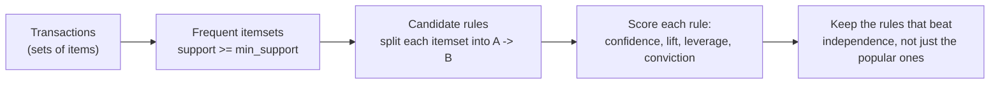
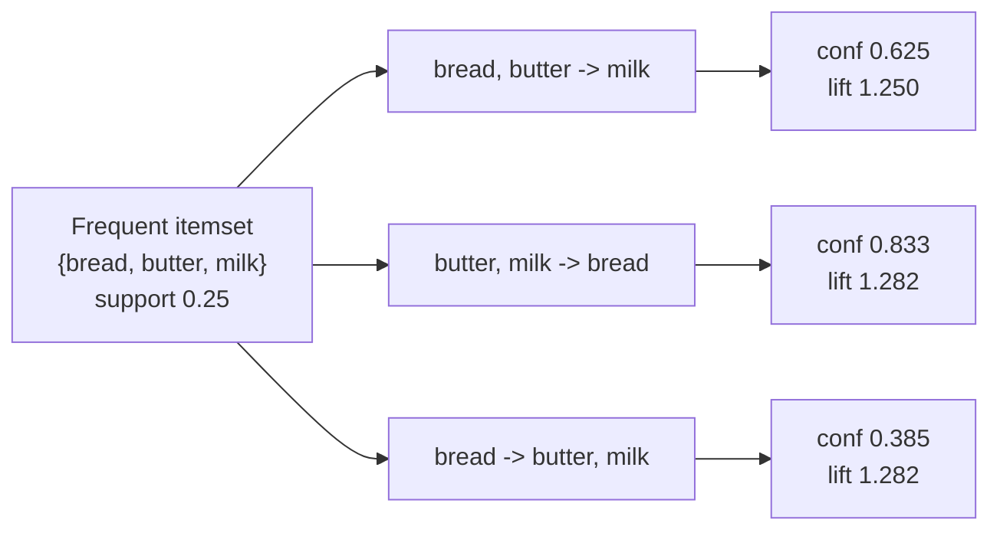

import DataCampExercise from "../../../../components/DataCampExercise.astro";
import AlgorithmCard from "../../../../components/AlgorithmCard.astro";
import Figure from "../../../../components/Figure.astro";
import Quiz from "../../../../components/Quiz.astro";

## What you'll learn

- the five rule metrics — support, confidence, **lift**, leverage and conviction — each derived
  and each computed by hand on the same baskets
- why confidence alone is dangerous, shown with a rule at 80% confidence and **lift 1.23**
- a rule with **lift 0.31**: buying chips makes bread *less* likely
- the **downward-closure property**, and the candidate counts it eliminates: 70 → 0 at level 4
- the full Apriori loop traced level by level on 20 baskets
- why the number of rules explodes, and how to control it
- FP-Growth, and when the level-wise scan stops being viable

## Intuition

Every technique so far in this phase has grouped *rows*. Association rule learning groups
**columns** — or rather, it finds columns that tend to be present together.

The classic setting is a supermarket. Each transaction is a set of items. You want statements like
"customers who buy bread also buy butter" — and, much more importantly, you want to know which of
those statements are *worth acting on*.

That second part is where almost all the difficulty lives. "Customers who buy anchovies also buy
bread" is true 80% of the time. It is also useless, because 65% of *all* customers buy bread. The
rule tells you nothing you did not already know from the shelf.

Distinguishing a real association from a popular consequent is the whole job, and it requires more
than one number.



## The data

Twenty baskets, small enough to count by hand:

| # | Items | | # | Items |
| --- | --- | --- | --- | --- |
| 1 | bread, butter, milk | | 11 | bread, butter, milk |
| 2 | bread, butter | | 12 | beer, chips |
| 3 | bread, milk, jam | | 13 | bread, milk |
| 4 | butter, milk | | 14 | butter, jam |
| 5 | bread, butter, milk, jam | | 15 | bread, butter, milk, cereal |
| 6 | beer, chips | | 16 | chips, salsa |
| 7 | bread, jam | | 17 | bread, butter |
| 8 | beer, chips, salsa | | 18 | milk, cereal, bread |
| 9 | bread, butter, jam | | 19 | beer, chips, bread |
| 10 | milk, cereal | | 20 | bread, butter, milk |

Item counts, which are the foundation of everything below:

| Item | Count | Support |
| --- | --- | --- |
| bread | 13 | 0.65 |
| butter | 10 | 0.50 |
| milk | 10 | 0.50 |
| chips | 5 | 0.25 |
| jam | 5 | 0.25 |
| beer | 4 | 0.20 |
| cereal | 3 | 0.15 |
| salsa | 2 | 0.10 |

<Figure
  src="/images/ml/phase-06-unsupervised/association-rule-learning-apriori-algorithm/item-supports"
  alt="A horizontal bar chart of eight grocery items sorted by support, with bread at 0.65 and salsa at 0.10, and a dashed vertical threshold line at 0.20."
  title="Level 1 of Apriori: count every item"
  caption="Support is the fraction of the 20 baskets containing the item. With min_support = 0.20, cereal (0.15) and salsa (0.10) are eliminated immediately — and by downward closure, so is every larger itemset that contains them."
/>

## The math

Write $T$ for the set of transactions, $|T| = N$, and $\sigma(X)$ for the number of transactions
containing itemset $X$.

**Support** — how often the itemset appears at all:

$$
\operatorname{supp}(X) = \frac{\sigma(X)}{N}
$$

**Confidence** of the rule $A \Rightarrow B$ — the conditional probability:

$$
\operatorname{conf}(A \Rightarrow B) = \frac{\operatorname{supp}(A \cup B)}{\operatorname{supp}(A)}
= \hat{P}(B \mid A)
$$

**Lift** — confidence divided by the consequent's base rate:

$$
\operatorname{lift}(A \Rightarrow B)
= \frac{\operatorname{conf}(A \Rightarrow B)}{\operatorname{supp}(B)}
= \frac{\operatorname{supp}(A \cup B)}{\operatorname{supp}(A)\operatorname{supp}(B)}
$$

This is the ratio of the observed joint frequency to the frequency expected under independence.
Read it as:

- $\text{lift} > 1$ — $A$ and $B$ appear together **more** often than chance. Positive association.
- $\text{lift} = 1$ — independent. The rule tells you nothing.
- $\text{lift} < 1$ — they appear together **less** often than chance. Negative association.

Lift is symmetric: $\operatorname{lift}(A \Rightarrow B) = \operatorname{lift}(B \Rightarrow A)$.
Confidence is not.

**Leverage** — the same comparison as a difference rather than a ratio:

$$
\operatorname{leverage}(A \Rightarrow B)
= \operatorname{supp}(A \cup B) - \operatorname{supp}(A)\operatorname{supp}(B)
$$

Zero under independence. Because it is a difference, it weights by how many transactions are
actually affected — useful when a huge lift comes from a handful of baskets.

**Conviction** — how much more often the rule would be *wrong* if $A$ and $B$ were independent:

$$
\operatorname{conviction}(A \Rightarrow B)
= \frac{1 - \operatorname{supp}(B)}{1 - \operatorname{conf}(A \Rightarrow B)}
$$

It is 1 under independence and $\infty$ when confidence is 1 (the rule has no counterexamples).
Unlike lift, conviction is directional.

| Metric | Range | Independent value | Direction-sensitive |
| --- | --- | --- | --- |
| Support | $[0, 1]$ | — | no |
| Confidence | $[0, 1]$ | $\operatorname{supp}(B)$ | **yes** |
| Lift | $[0, \infty)$ | **1** | no |
| Leverage | $[-0.25, 0.25]$ | **0** | no |
| Conviction | $[0, \infty)$ | **1** | **yes** |

## Worked example by hand

### bread ⇒ butter

Bread appears in 13 baskets, butter in 10, and both together in 8 (baskets 1, 2, 5, 9, 11, 15, 17,
20).

$$
\operatorname{supp}(\{\text{bread}, \text{butter}\}) = \frac{8}{20} = 0.40
$$

$$
\operatorname{conf} = \frac{0.40}{0.65} = 0.6154
$$

$$
\operatorname{lift} = \frac{0.6154}{0.50} = 1.2308
$$

$$
\operatorname{leverage} = 0.40 - 0.65 \times 0.50 = 0.40 - 0.325 = 0.0750
$$

$$
\operatorname{conviction} = \frac{1 - 0.50}{1 - 0.6154} = \frac{0.50}{0.3846} = 1.3000
$$

A mild positive association: butter is about 23% more likely in a bread basket than in a random one.

### The same pair, reversed

$$
\operatorname{conf}(\text{butter} \Rightarrow \text{bread}) = \frac{0.40}{0.50} = 0.8000,
\qquad
\operatorname{lift} = \frac{0.8000}{0.65} = 1.2308
$$

**The confidence jumped from 0.62 to 0.80 while the lift did not move at all.** Confidence went up
purely because bread is more common than butter — swapping the direction changed the denominator,
not the relationship. Lift, being symmetric, is unfooled.

Conviction *does* change: $(1 - 0.65)/(1 - 0.80) = 0.35/0.20 = 1.7500$ against 1.3000 the other
way. It is directional by design, and it says the butter ⇒ bread direction is the stronger
prediction.

### beer ⇒ chips

Beer appears in 4 baskets (6, 8, 12, 19), chips in 5 (6, 8, 12, 16, 19). Together: 4.

$$
\operatorname{supp} = \frac{4}{20} = 0.20, \qquad
\operatorname{conf} = \frac{0.20}{0.20} = 1.0000, \qquad
\operatorname{lift} = \frac{1.0000}{0.25} = 4.0000
$$

$$
\operatorname{leverage} = 0.20 - 0.20 \times 0.25 = 0.15, \qquad
\operatorname{conviction} = \frac{1 - 0.25}{1 - 1} = \infty
$$

Every beer basket contains chips. Lift 4.0 means four times the chance expected by independence,
and conviction is infinite because there is not a single counterexample.

### chips ⇒ bread, the rule that is worse than nothing

Chips appears in 5 baskets, bread in 13, both together in 1 (basket 19).

$$
\operatorname{supp} = \frac{1}{20} = 0.05, \qquad
\operatorname{conf} = \frac{0.05}{0.25} = 0.2000, \qquad
\operatorname{lift} = \frac{0.2000}{0.65} = 0.3077
$$

$$
\operatorname{leverage} = 0.05 - 0.25 \times 0.65 = -0.1125
$$

Lift **0.31**. Chips buyers are three times *less* likely to buy bread than a random customer.
Negative leverage confirms it. That is a real, actionable finding — the two are substitutes, not
complements — and it is invisible to anyone who only ranks by confidence.

### The full table

| Rule | Support | Confidence | Lift | Leverage | Conviction |
| --- | --- | --- | --- | --- | --- |
| beer ⇒ chips | 0.20 | **1.0000** | **4.0000** | 0.1500 | $\infty$ |
| chips ⇒ beer | 0.20 | 0.8000 | **4.0000** | 0.1500 | 4.0000 |
| butter ⇒ bread | 0.40 | 0.8000 | 1.2308 | 0.0750 | 1.7500 |
| milk ⇒ bread | 0.40 | 0.8000 | 1.2308 | 0.0750 | 1.7500 |
| jam ⇒ bread | 0.20 | 0.8000 | 1.2308 | 0.0375 | 1.7500 |
| bread ⇒ butter | 0.40 | 0.6154 | 1.2308 | 0.0750 | 1.3000 |
| jam ⇒ milk | 0.10 | 0.4000 | **0.8000** | -0.0250 | 0.8333 |
| chips ⇒ bread | 0.05 | 0.2000 | **0.3077** | -0.1125 | 0.4375 |

Four rules sit at exactly 0.8000 confidence, and their lifts range from 4.00 down to 1.23. Ranking
by confidence would put `chips ⇒ beer` — a genuinely strong rule — level with three
bread-is-popular truisms.

<Figure
  src="/images/ml/phase-06-unsupervised/association-rule-learning-apriori-algorithm/confidence-trap"
  alt="Two bar charts of the same six rules in the same order. The left ranks them by confidence, decreasing smoothly. The right shows lift, with beer to chips towering at 4.0, three bars just above 1, and two red bars below 1."
  title="Confidence and lift tell different stories"
  caption="Left, ranked by confidence. Right, the same rules' lift. The three middle rules look almost identical on confidence but earn their score entirely from bread's 65% base rate. The two red bars are lift below 1 — associations that are genuinely negative."
/>

<Figure
  src="/images/ml/phase-06-unsupervised/association-rule-learning-apriori-algorithm/rule-scatter"
  alt="A scatter plot with support on the x axis and confidence on the y axis, points coloured by lift on a blue-to-red scale, with the strongest and weakest rules labelled."
  title="Every rule as a point"
  caption="High confidence alone puts a point at the top of the plot; only the colour tells you whether the rule beats independence. The interesting rules are the red ones, and they are not always the highest."
/>

## The Apriori algorithm

Naively, finding all frequent itemsets over $m$ items means checking $2^m - 1$ subsets. With just
100 products that is more than $10^{30}$ candidates.

Apriori's insight is the **downward-closure property** (also called the Apriori property):

$$
X \subseteq Y \;\Longrightarrow\; \operatorname{supp}(X) \ge \operatorname{supp}(Y)
$$

Adding an item to an itemset can only reduce the number of baskets containing it. So:

> **If an itemset is infrequent, every superset of it is infrequent.**

That contrapositive lets you prune whole branches without counting them. The algorithm becomes a
level-wise scan:

1. Count all 1-itemsets; keep those with support $\ge$ `min_support`. Call this $L_1$.
2. Generate candidate $(k{+}1)$-itemsets by joining pairs in $L_k$ that share $k-1$ items.
3. **Prune** any candidate having a $k$-subset that is not in $L_k$ — no counting needed.
4. Scan the transactions once to count the survivors; keep the frequent ones as $L_{k+1}$.
5. Stop when $L_{k+1}$ is empty.

### Traced on the twenty baskets

With `min_support = 0.20`:

| Level | All possible itemsets | Candidates Apriori generates | Frequent |
| --- | --- | --- | --- |
| 1-itemsets | 8 | 8 | **6** |
| 2-itemsets | 28 | 15 | **5** |
| 3-itemsets | 56 | 1 | **1** |
| 4-itemsets | 70 | **0** | 0 |

At level 1, cereal (0.15) and salsa (0.10) drop out. At level 2, Apriori only builds candidates
from the 6 survivors — 15 pairs rather than 28 — and 5 clear the threshold. At level 3 only one
candidate survives pruning, `{bread, butter, milk}` at support 0.25. At level 4 there is nothing
left to join, so the algorithm stops after examining **24 candidates instead of 162**.

<Figure
  src="/images/ml/phase-06-unsupervised/association-rule-learning-apriori-algorithm/candidate-pruning"
  alt="A grouped bar chart with three bars per level. The grey bars for all possible itemsets rise to 70 at level 4, while the amber candidate bars fall to zero and the blue frequent bars fall to zero at level 3."
  title="Downward closure collapses the search"
  caption="Grey: every itemset of that size. Amber: what Apriori actually generates after pruning. Blue: what survives the support threshold. The gap between grey and amber is the pruning, and it widens at every level — which is what makes the algorithm feasible at all."
/>

### From itemsets to rules

Each frequent itemset of size $k$ yields $2^k - 2$ candidate rules — every way of splitting it into
a non-empty antecedent and a non-empty consequent. For `{bread, butter, milk}` at support 0.25,
that is 6 rules:

| Rule | Confidence | Lift |
| --- | --- | --- |
| bread, butter ⇒ milk | 0.25 / 0.40 = 0.6250 | 1.2500 |
| bread, milk ⇒ butter | 0.25 / 0.40 = 0.6250 | 1.2500 |
| butter, milk ⇒ bread | 0.25 / 0.30 = 0.8333 | 1.2821 |
| bread ⇒ butter, milk | 0.25 / 0.65 = 0.3846 | 1.2821 |
| butter ⇒ bread, milk | 0.25 / 0.50 = 0.5000 | 1.2500 |
| milk ⇒ bread, butter | 0.25 / 0.50 = 0.5000 | 1.2500 |

Note the support is 0.25 for all six — it is a property of the itemset, not of how you split it.
Only the confidence and lift differ.



## See it move

```p5 title="Pruning the itemset lattice" desc="All subsets of four items, arranged by size. Infrequent nodes go red, and downward closure immediately kills every superset above them — watch entire branches disappear without ever being counted." height="380"
const ITEMS = ["A", "B", "C", "D"];
// support of each itemset, chosen so pruning is visible
const SUP = {
  "A": 0.70, "B": 0.55, "C": 0.30, "D": 0.12,
  "AB": 0.45, "AC": 0.25, "AD": 0.08, "BC": 0.22, "BD": 0.06, "CD": 0.05,
  "ABC": 0.18, "ABD": 0.04, "ACD": 0.03, "BCD": 0.03,
  "ABCD": 0.02,
};
const THR = 0.20;
let nodes = [], t = 0, revealed = 0;

function subsets() {
  const out = [];
  for (let m = 1; m < 16; m++) {
    let s = "";
    for (let i = 0; i < 4; i++) if (m & (1 << i)) s += ITEMS[i];
    out.push(s);
  }
  return out.sort((a, b) => a.length - b.length || a.localeCompare(b));
}
function build() {
  const all = subsets();
  const byLevel = [[], [], [], []];
  for (const s of all) byLevel[s.length - 1].push(s);
  nodes = [];
  for (let L = 0; L < 4; L++) {
    const row = byLevel[L];
    for (let i = 0; i < row.length; i++) {
      nodes.push({
        key: row[i],
        level: L,
        x: (width * (i + 1)) / (row.length + 1),
        y: 320 - L * 72,
      });
    }
  }
  revealed = 0; t = 0;
}
function statusOf(key) {
  // frequent only if it AND every subset clears the threshold
  if (SUP[key] < THR) return "infrequent";
  for (let m = 1; m < (1 << key.length) - 1; m++) {
    let sub = "";
    for (let i = 0; i < key.length; i++) if (m & (1 << i)) sub += key[i];
    if (SUP[sub] < THR) return "pruned";
  }
  return "frequent";
}
function setup() { createCanvas(600, 380); textFont("monospace"); build(); }
function draw() {
  background(13, 17, 23);
  // edges from each node to its supersets one level up
  for (const n of nodes) {
    for (const m of nodes) {
      if (m.level === n.level + 1 && [...n.key].every(ch => m.key.includes(ch))) {
        stroke(40, 47, 57);
        strokeWeight(1);
        line(n.x, n.y, m.x, m.y);
      }
    }
  }
  for (const n of nodes) {
    const shown = n.level < revealed;
    let col = color(50, 57, 68);
    let label = "";
    if (shown) {
      const st = statusOf(n.key);
      if (st === "frequent") { col = color(120, 200, 120); label = SUP[n.key].toFixed(2); }
      else if (st === "infrequent") { col = color(232, 110, 110); label = SUP[n.key].toFixed(2); }
      else { col = color(90, 70, 70); label = "pruned"; }
    }
    noStroke();
    fill(col);
    ellipse(n.x, n.y, 34, 34);
    fill(shown ? 20 : 90);
    textSize(11);
    textAlign(CENTER, CENTER);
    text(n.key, n.x, n.y);
    if (shown) {
      fill(150);
      textSize(9);
      text(label, n.x, n.y + 24);
    }
  }
  noStroke();
  fill(107, 169, 221);
  textSize(13);
  textAlign(LEFT, TOP);
  text("level " + Math.min(revealed, 4) + " of 4    min_support = " + THR.toFixed(2), 16, 12);
  fill(150);
  textSize(10);
  textAlign(LEFT, BOTTOM);
  text("green = frequent    red = below threshold    dark red = pruned without counting",
       16, height - 10);

  t++;
  if (t % 70 === 0) revealed = revealed >= 4 ? 0 : revealed + 1;
}
function mousePressed() { revealed = revealed >= 4 ? 0 : revealed + 1; }
```

Item D has support 0.12, below the threshold. The moment it goes red, every itemset containing it —
AD, BD, CD, ABD, ACD, BCD, ABCD, seven of the fifteen nodes — is pruned without a single count.

The next sketch is the metrics themselves: move the overlap between two item sets and watch
confidence and lift disagree.

```p5 title="Confidence rises, lift stays put" desc="Two circles of transactions. Drag the overlap by clicking; confidence tracks the overlap relative to A, but lift compares it against what independence would predict." height="340"
let overlap = 0.20, dir = 1;
const N = 20;
let supA = 0.25, supB = 0.65;
function setup() { createCanvas(600, 340); textFont("monospace"); }
function draw() {
  background(13, 17, 23);
  const maxOv = Math.min(supA, supB);
  const ov = constrain(overlap, 0.0, maxOv);
  const conf = ov / supA;
  const lift = conf / supB;
  const lev = ov - supA * supB;

  const cy = 130, r = 78;
  const sep = map(ov, 0, maxOv, 2 * r - 6, 34);
  const ax = width / 2 - sep / 2, bx = width / 2 + sep / 2;

  noStroke();
  fill(75, 139, 190, 110); ellipse(ax, cy, r * 2, r * 2);
  fill(255, 211, 67, 110); ellipse(bx, cy, r * 2, r * 2);
  fill(210);
  textSize(13);
  textAlign(CENTER, CENTER);
  text("A", ax - 40, cy);
  text("B", bx + 40, cy);

  textAlign(LEFT, TOP);
  textSize(12);
  fill(150);
  text("supp(A) = " + supA.toFixed(2) + "    supp(B) = " + supB.toFixed(2), 24, 18);

  const rows = [
    ["supp(A and B)", ov.toFixed(3), color(200)],
    ["confidence A=>B", conf.toFixed(3), color(107, 169, 221)],
    ["lift", lift.toFixed(3), lift > 1 ? color(120, 200, 120) : color(232, 110, 110)],
    ["leverage", lev.toFixed(4), lev > 0 ? color(120, 200, 120) : color(232, 110, 110)],
    ["expected if independent", (supA * supB).toFixed(3), color(140)],
  ];
  let y = 234;
  for (const [k, v, c] of rows) {
    fill(150); textAlign(LEFT, TOP); textSize(12);
    text(k, 24, y);
    fill(c); textAlign(RIGHT, TOP);
    text(v, 300, y);
    y += 21;
  }

  // lift bar
  const bx0 = 330, bw = 240, by = 240;
  fill(45, 52, 63); rect(bx0, by, bw, 16, 4);
  const frac = constrain(lift / 3, 0, 1);
  fill(lift > 1 ? color(120, 200, 120) : color(232, 110, 110));
  rect(bx0, by, bw * frac, 16, 4);
  stroke(220); strokeWeight(2);
  line(bx0 + bw / 3, by - 4, bx0 + bw / 3, by + 20);
  noStroke();
  fill(180); textSize(10); textAlign(CENTER, TOP);
  text("lift = 1", bx0 + bw / 3, by + 22);
  fill(150); textAlign(LEFT, TOP); textSize(11);
  text("lift scale 0 to 3", bx0, by - 22);

  overlap += 0.0015 * dir;
  if (overlap > maxOv) dir = -1;
  if (overlap < 0.005) dir = 1;
}
function mousePressed() {
  supA = supA === 0.25 ? 0.50 : 0.25;
  supB = supB === 0.65 ? 0.25 : 0.65;
}
```

Click to swap the base rates. With $\operatorname{supp}(B) = 0.65$, confidence can reach 0.8 while
lift is barely above 1. Drop $B$ to 0.25 and the same overlap produces a far higher lift — because
the same co-occurrence is now genuinely surprising.

## In code

scikit-learn does not implement Apriori. The standard library is `mlxtend`:

```bash
pip install mlxtend
```

```python title="apriori_basics.py" showLineNumbers{1}
import pandas as pd
from mlxtend.frequent_patterns import apriori, association_rules
from mlxtend.preprocessing import TransactionEncoder

baskets = [
    ["bread", "butter", "milk"], ["bread", "butter"], ["bread", "milk", "jam"],
    ["butter", "milk"], ["bread", "butter", "milk", "jam"], ["beer", "chips"],
    ["bread", "jam"], ["beer", "chips", "salsa"], ["bread", "butter", "jam"],
    ["milk", "cereal"], ["bread", "butter", "milk"], ["beer", "chips"],
    ["bread", "milk"], ["butter", "jam"], ["bread", "butter", "milk", "cereal"],
    ["chips", "salsa"], ["bread", "butter"], ["milk", "cereal", "bread"],
    ["beer", "chips", "bread"], ["bread", "butter", "milk"],
]

# One-hot: one row per basket, one boolean column per item.
te = TransactionEncoder()
df = pd.DataFrame(te.fit_transform(baskets), columns=te.columns_)

freq = apriori(df, min_support=0.20, use_colnames=True)
print(freq.sort_values("support", ascending=False))

rules = association_rules(freq, metric="lift", min_threshold=1.0)
cols = ["antecedents", "consequents", "support", "confidence", "lift", "leverage", "conviction"]
print(rules[cols].sort_values("lift", ascending=False).round(4))
```

Doing it without a dependency is about fifteen lines, and worth writing once:

```python title="apriori_from_scratch.py" showLineNumbers{1}
from itertools import combinations

def support(itemset, baskets):
    s = set(itemset)
    return sum(1 for b in baskets if s <= set(b)) / len(baskets)

def apriori(baskets, min_support):
    """Level-wise search with downward-closure pruning."""
    items = sorted({i for b in baskets for i in b})
    frequent = {frozenset([i]) for i in items if support([i], baskets) >= min_support}
    all_frequent, prev, k = dict(), frequent, 2

    while prev:
        for fs in prev:
            all_frequent[fs] = support(fs, baskets)
        candidates = set()
        for a, b in combinations(prev, 2):
            union = a | b
            if len(union) != k:
                continue
            # PRUNE: every k-1 subset must already be frequent
            if all(frozenset(s) in prev for s in combinations(union, k - 1)):
                candidates.add(union)
        prev = {c for c in candidates if support(c, baskets) >= min_support}
        k += 1
    return all_frequent

freq = apriori(baskets, 0.20)
for fs, s in sorted(freq.items(), key=lambda kv: (-kv[1], sorted(kv[0]))):
    print(f"{s:.2f}  {set(sorted(fs))}")
```

### Controlling the explosion

Rule counts grow ferociously as you loosen `min_support`. Three defences:

**Set `min_support` from a count, not a fraction.** "At least 50 baskets" is a statement you can
defend; "0.001" is not. Compute the fraction from the count you need.

**Filter on lift *and* leverage.** Lift alone promotes rules built on three transactions. Leverage
weights by how many baskets are actually affected, so requiring both `lift > 1.2` and
`leverage > 0.01` removes the noise.

**Restrict the consequent.** If you only care about what drives one product, ask only for rules
with that item on the right:

```python title="filter_rules.py" showLineNumbers{1}
target = {"butter"}
useful = rules[
    (rules["consequents"] == frozenset(target))
    & (rules["lift"] > 1.2)
    & (rules["leverage"] > 0.01)
].sort_values("lift", ascending=False)
```

### FP-Growth

Apriori scans the whole transaction database once per level. On millions of transactions with tens
of thousands of items, that is the bottleneck.

**FP-Growth** builds a compressed prefix tree (the FP-tree) in **two passes** and then mines it
recursively without generating candidates at all. It is typically an order of magnitude faster and
gives *identical* results — the frequent itemsets are a property of the data, not of the algorithm.

```python title="fpgrowth.py" showLineNumbers{1}
from mlxtend.frequent_patterns import fpgrowth

freq_fp = fpgrowth(df, min_support=0.20, use_colnames=True)
# Same itemsets, same supports, different route.
```

Use Apriori to learn the concepts and for small data. Use FP-Growth in production.

<AlgorithmCard
  name="Apriori"
  type="Unsupervised — frequent itemset mining and association rules"
  sklearn="not in scikit-learn; use mlxtend.frequent_patterns.apriori"
  assumptions={[
    "Transactions are unordered sets — no quantity, no sequence, no time",
    "Items are categorical and the vocabulary is manageable",
    "Co-occurrence is what you care about; correlation is not causation",
  ]}
  complexity={{
    train: "O(2^m) worst case; downward closure makes it tractable in practice, with one database scan per level",
    predict: "O(1) lookup against the rule table",
    memory: "O(number of candidate itemsets), which is the usual failure point",
  }}
  hyperparams={[
    { name: "min_support", default: "0.5 in mlxtend", effect: "The main lever. Too high finds nothing; too low explodes combinatorially. Set it from a basket count." },
    { name: "min_threshold (on lift)", default: "1.0", effect: "Rules below 1 are negative associations — sometimes exactly what you want to see." },
    { name: "max_len", default: "None", effect: "Caps itemset size. Setting 2 or 3 bounds the runtime hard." },
    { name: "use_colnames", default: "False", effect: "Return item names rather than column indices. Always set True." },
  ]}
  useWhen={[
    "Market basket analysis, cross-sell and product placement",
    "Web log and clickstream co-occurrence",
    "Finding co-occurring symptoms, diagnoses or error codes",
    "Any question of the form 'what shows up together?'",
  ]}
  avoidWhen={[
    "Order or timing matters — use sequential pattern mining instead",
    "Features are continuous — you would have to bin them first, and the bins drive the answer",
    "You need causality; these are co-occurrence counts and nothing more",
    "The item vocabulary is enormous and min_support has to be tiny",
  ]}
  notation="supp(X) — fraction of transactions containing X; conf(A=>B) = supp(A and B)/supp(A); lift = conf / supp(B)"
/>

## Pitfalls

**Ranking by confidence.** Four rules on this page share confidence 0.8000 with lifts from 1.23 to
4.00. Confidence rewards popular consequents; sort by lift or leverage.

**Ignoring lift below 1.** `chips ⇒ bread` at lift 0.31 is one of the most informative rules in the
set — the items are substitutes. Most tooling filters these out by default with
`min_threshold=1.0`.

**Reading causation into co-occurrence.** Beer and chips co-occur; neither causes the other. Both
are caused by the same occasion. Acting on the rule (place them together) can still be correct;
explaining it as causation is not.

**Setting `min_support` too low.** The candidate count grows super-exponentially. Below about 0.01
on a real retail dataset you will exhaust memory before the level-3 scan finishes.

**Forgetting the base rates.** Every metric on this page is relative to $\operatorname{supp}(B)$.
An item in 90% of baskets can never produce an interesting rule, because confidence cannot exceed 1
and the lift ceiling is $1/0.9 = 1.11$.

**Trusting rules built on a handful of transactions.** A rule with support 0.001 and lift 12 rests
on maybe five baskets. Check the raw count, and use leverage, which is bounded by how much of the
data is affected.

**Treating the item vocabulary as fixed.** "Milk" and "semi-skimmed milk 2L" are different items to
the algorithm. Aggregating to a sensible product hierarchy before mining usually matters more than
any parameter.

## Compare

| | Apriori | FP-Growth | ECLAT |
| --- | --- | --- | --- |
| Strategy | level-wise candidate generation | prefix-tree, no candidates | vertical tid-lists, depth-first |
| Database scans | one per level | **two** | one |
| Speed | slowest | **fastest** | fast |
| Memory | candidate sets | the FP-tree | tid-list intersections |
| Results | identical | identical | identical |
| Easiest to explain | **yes** | no | no |

<Quiz
  questions={[
    {
      q: "A rule has confidence 0.85 and lift 0.95. What does that mean?",
      options: [
        "A strong rule worth acting on",
        "The consequent is so common that seeing the antecedent actually makes it slightly LESS likely",
        "The support is too low",
        "The rule is invalid",
      ],
      answer: 1,
      explain: "Lift below 1 means the pair co-occurs less often than independence predicts. Confidence 0.85 only looks impressive until you notice the consequent's base rate must be about 0.89. This is exactly the trap that ranking by confidence walks into.",
    },
    {
      q: "The itemset {A, B} has support 0.15, below your threshold of 0.20. What can you say about {A, B, C}?",
      options: [
        "Nothing without counting it",
        "Its support is at most 0.15, so it is also infrequent and can be pruned unexamined",
        "Its support is at least 0.15",
        "It depends on supp(C)",
      ],
      answer: 1,
      explain: "Downward closure: adding an item can only shrink the set of transactions containing the itemset. supp({A,B,C}) <= supp({A,B}) = 0.15 < 0.20. That single fact is what makes Apriori feasible — on the page's data it removed 7 of 15 lattice nodes at once.",
    },
    {
      q: "conf(bread => butter) is 0.6154 but conf(butter => bread) is 0.8000. Yet both have lift 1.2308. Why?",
      options: [
        "A rounding error",
        "Confidence divides by supp(antecedent), which differs by direction; lift divides by both supports, making it symmetric",
        "Lift is wrong here",
        "The rules describe different transactions",
      ],
      answer: 1,
      explain: "lift = supp(A and B) / (supp(A) supp(B)), which is unchanged when you swap A and B. Confidence uses only supp(A) in the denominator, so it rises whenever the consequent is more common than the antecedent.",
    },
    {
      q: "Your retail dataset has 200,000 transactions and 8,000 products, and Apriori runs out of memory at level 3. What is the best first move?",
      options: [
        "Buy more RAM",
        "Raise min_support and switch to FP-Growth, which needs two database scans instead of one per level",
        "Reduce the number of transactions",
        "Lower min_support",
      ],
      answer: 1,
      explain: "Memory goes on candidate itemsets, which explode as min_support falls. FP-Growth avoids candidate generation entirely by compressing the transactions into a prefix tree, and returns identical results.",
    },
    {
      q: "Which metric would you use to demote a rule with lift 15 that appears in only 4 of 100,000 baskets?",
      options: ["Confidence", "Leverage, because it is a difference in supports and is therefore bounded by how much data is affected", "Conviction", "Support alone"],
      answer: 1,
      explain: "Leverage is supp(A and B) - supp(A)supp(B). With supp(A and B) = 0.00004 it is essentially zero no matter how large the ratio is. Lift is scale-free and so rewards tiny, unreliable counts; leverage does not.",
    },
  ]}
/>

## 🧪 Try It Yourself

### Exercise 1 – Support by counting

<DataCampExercise
  lang="python"
  hint={`An itemset is contained in a basket when set(itemset) is a subset of set(basket).`}
  code={`# Task: Exercise 1 - Support by counting
BASKETS = [
    ["bread", "butter", "milk"], ["bread", "butter"], ["bread", "milk", "jam"],
    ["butter", "milk"], ["bread", "butter", "milk", "jam"], ["beer", "chips"],
    ["bread", "jam"], ["beer", "chips", "salsa"], ["bread", "butter", "jam"],
    ["milk", "cereal"], ["bread", "butter", "milk"], ["beer", "chips"],
    ["bread", "milk"], ["butter", "jam"], ["bread", "butter", "milk", "cereal"],
    ["chips", "salsa"], ["bread", "butter"], ["milk", "cereal", "bread"],
    ["beer", "chips", "bread"], ["bread", "butter", "milk"],
]

def support(items):
    s = set(items)
    return sum(1 for b in BASKETS if s ___ set(b)) / len(BASKETS)   # replace ___ with <=

for it in (["bread"], ["butter"], ["beer"], ["bread", "butter"], ["beer", "chips"]):
    print(f"{str(it):28s} support {support(it):.2f}")

# -- Expected Output -------------------------------------------
# ['bread']                    support 0.65
# ['butter']                   support 0.50
# ['beer']                     support 0.20
# ['bread', 'butter']          support 0.40
# ['beer', 'chips']            support 0.20
# --------------------------------------------------------------`}
  solution={`BASKETS = [
    ["bread", "butter", "milk"], ["bread", "butter"], ["bread", "milk", "jam"],
    ["butter", "milk"], ["bread", "butter", "milk", "jam"], ["beer", "chips"],
    ["bread", "jam"], ["beer", "chips", "salsa"], ["bread", "butter", "jam"],
    ["milk", "cereal"], ["bread", "butter", "milk"], ["beer", "chips"],
    ["bread", "milk"], ["butter", "jam"], ["bread", "butter", "milk", "cereal"],
    ["chips", "salsa"], ["bread", "butter"], ["milk", "cereal", "bread"],
    ["beer", "chips", "bread"], ["bread", "butter", "milk"],
]

def support(items):
    s = set(items)
    return sum(1 for b in BASKETS if s <= set(b)) / len(BASKETS)

for it in (["bread"], ["butter"], ["beer"], ["bread", "butter"], ["beer", "chips"]):
    print(f"{str(it):28s} support {support(it):.2f}")`}
  sct={`test_output_contains("['beer', 'chips']            support 0.20")
success_msg("Eight of twenty baskets hold bread and butter; four hold beer and chips.")`}
  height={280}
/>

### Exercise 2 – Confidence is not symmetric, lift is

<DataCampExercise
  lang="python"
  hint={`lift = confidence / support(consequent).`}
  code={`# Task: Exercise 2 - Confidence is not symmetric, lift is
# support() and BASKETS carry over from Exercise 1.
def metrics(a, c):
    joint = support([a, c])
    conf = joint / support([a])
    lift = conf / support([___])            # replace ___ with c
    return joint, conf, lift

for a, c in (("bread", "butter"), ("butter", "bread")):
    j, cf, lf = metrics(a, c)
    print(f"{a:7s} => {c:7s} supp {j:.2f}  conf {cf:.4f}  lift {lf:.4f}")

# -- Expected Output -------------------------------------------
# bread   => butter  supp 0.40  conf 0.6154  lift 1.2308
# butter  => bread   supp 0.40  conf 0.8000  lift 1.2308
# --------------------------------------------------------------`}
  solution={`def metrics(a, c):
    joint = support([a, c])
    conf = joint / support([a])
    lift = conf / support([c])
    return joint, conf, lift

for a, c in (("bread", "butter"), ("butter", "bread")):
    j, cf, lf = metrics(a, c)
    print(f"{a:7s} => {c:7s} supp {j:.2f}  conf {cf:.4f}  lift {lf:.4f}")`}
  sct={`test_output_contains("conf 0.8000  lift 1.2308")
success_msg("Confidence moved from 0.62 to 0.80 while lift did not budge. Only one of them describes the relationship.")`}
  height={230}
/>

### Exercise 3 – Find the negative association

<DataCampExercise
  lang="python"
  hint={`Compute lift for every ordered pair and keep the ones below 1.`}
  code={`# Task: Exercise 3 - Find the negative association
from itertools import permutations

items = sorted({i for b in BASKETS for i in b})

rows = []
for a, c in permutations(items, 2):
    if support([a]) == 0:
        continue
    lift = (support([a, c]) / support([a])) / support([c])
    rows.append((lift, a, c))

rows.sort()                                   # ascending, worst first
for lift, a, c in rows[:___]:                 # replace ___ with 3
    print(f"{a:7s} => {c:7s} lift {lift:.4f}")

# -- Expected Output -------------------------------------------
# beer    => butter  lift 0.0000
# beer    => cereal  lift 0.0000
# beer    => jam     lift 0.0000
# --------------------------------------------------------------`}
  solution={`from itertools import permutations

items = sorted({i for b in BASKETS for i in b})
rows = []
for a, c in permutations(items, 2):
    if support([a]) == 0:
        continue
    lift = (support([a, c]) / support([a])) / support([c])
    rows.append((lift, a, c))
rows.sort()
for lift, a, c in rows[:3]:
    print(f"{a:7s} => {c:7s} lift {lift:.4f}")`}
  sct={`test_output_contains("lift 0.0000")
success_msg("Lift 0 means the pair never co-occurs at all. Beer buyers in this data buy neither butter nor milk.")`}
  height={250}
/>

### Exercise 4 – Downward closure in action

<DataCampExercise
  lang="python"
  hint={`A candidate survives pruning only if every one of its (k-1)-subsets is already frequent.`}
  code={`# Task: Exercise 4 - Downward closure in action
from itertools import combinations

MIN_SUP = 0.20
items = sorted({i for b in BASKETS for i in b})
prev = {frozenset([i]) for i in items if support([i]) >= MIN_SUP}
print(f"level 1: {len(items)} possible, {len(prev)} frequent")

k = 2
while prev:
    cands = set()
    for a, b in combinations(prev, 2):
        u = a | b
        if len(u) == k and all(frozenset(s) in prev
                               for s in combinations(u, k - ___)):   # replace ___ with 1
            cands.add(u)
    keep = {c for c in cands if support(c) >= MIN_SUP}
    total = len(list(combinations(items, k)))
    print(f"level {k}: {total} possible, {len(cands)} candidates, {len(keep)} frequent")
    prev = keep
    k += 1

# -- Expected Output -------------------------------------------
# level 1: 8 possible, 6 frequent
# level 2: 28 possible, 15 candidates, 5 frequent
# level 3: 56 possible, 1 candidates, 1 frequent
# level 4: 70 possible, 0 candidates, 0 frequent
# --------------------------------------------------------------`}
  solution={`from itertools import combinations

MIN_SUP = 0.20
items = sorted({i for b in BASKETS for i in b})
prev = {frozenset([i]) for i in items if support([i]) >= MIN_SUP}
print(f"level 1: {len(items)} possible, {len(prev)} frequent")
k = 2
while prev:
    cands = set()
    for a, b in combinations(prev, 2):
        u = a | b
        if len(u) == k and all(frozenset(s) in prev for s in combinations(u, k - 1)):
            cands.add(u)
    keep = {c for c in cands if support(c) >= MIN_SUP}
    total = len(list(combinations(items, k)))
    print(f"level {k}: {total} possible, {len(cands)} candidates, {len(keep)} frequent")
    prev = keep
    k += 1`}
  sct={`test_output_contains("level 3: 56 possible, 1 candidates")
success_msg("162 possible itemsets, 24 ever counted. That gap is the whole reason Apriori works.")`}
  height={290}
/>

### Exercise 5 – All five metrics at once

<DataCampExercise
  lang="python"
  hint={`conviction is (1 - supp(B)) / (1 - confidence), and is infinite when confidence is 1.`}
  code={`# Task: Exercise 5 - All five metrics at once
def full(a, c):
    sa, sc = support([a]), support([c])
    joint = support([a, c])
    conf = joint / sa
    lift = conf / sc
    lev = joint - sa * sc
    conv = float("inf") if conf == 1 else (1 - sc) / (1 - ___)   # replace ___ with conf
    return joint, conf, lift, lev, conv

for a, c in (("beer", "chips"), ("butter", "bread"), ("jam", "milk"), ("chips", "bread")):
    j, cf, lf, lv, cv = full(a, c)
    print(f"{a:7s}=>{c:7s} supp {j:.2f} conf {cf:.4f} lift {lf:.4f}"
          f" lev {lv:+.4f} conv {cv:.4f}")

# -- Expected Output -------------------------------------------
# beer   =>chips   supp 0.20 conf 1.0000 lift 4.0000 lev +0.1500 conv inf
# butter =>bread   supp 0.40 conf 0.8000 lift 1.2308 lev +0.0750 conv 1.7500
# jam    =>milk    supp 0.10 conf 0.4000 lift 0.8000 lev -0.0250 conv 0.8333
# chips  =>bread   supp 0.05 conf 0.2000 lift 0.3077 lev -0.1125 conv 0.4375
# --------------------------------------------------------------`}
  solution={`def full(a, c):
    sa, sc = support([a]), support([c])
    joint = support([a, c])
    conf = joint / sa
    lift = conf / sc
    lev = joint - sa * sc
    conv = float("inf") if conf == 1 else (1 - sc) / (1 - conf)
    return joint, conf, lift, lev, conv

for a, c in (("beer", "chips"), ("butter", "bread"), ("jam", "milk"), ("chips", "bread")):
    j, cf, lf, lv, cv = full(a, c)
    print(f"{a:7s}=>{c:7s} supp {j:.2f} conf {cf:.4f} lift {lf:.4f}"
          f" lev {lv:+.4f} conv {cv:.4f}")`}
  sct={`test_output_contains("lift 0.3077")
success_msg("chips => bread at lift 0.31 and leverage -0.1125: a genuinely negative association, and the most actionable rule in the set.")`}
  height={280}
/>

## Recap

- Support counts how often; confidence is $\hat{P}(B \mid A)$; **lift** compares that against
  independence.
- Confidence is directional, lift is symmetric: bread ⇒ butter and butter ⇒ bread gave 0.6154 and
  0.8000 confidence but the same **1.2308** lift.
- Four different rules in the data share confidence 0.8000 with lifts from 1.23 to 4.00. Never
  rank by confidence alone.
- `chips ⇒ bread` has lift **0.3077** and leverage **-0.1125** — a real negative association that
  a `lift > 1` filter would discard.
- Leverage demotes high-lift rules resting on a handful of baskets; conviction is infinite when a
  rule has no counterexamples.
- **Downward closure** — an infrequent itemset has no frequent supersets — pruned the search from
  162 possible itemsets to 24 ever counted.
- Apriori scans the database once per level; **FP-Growth** does it in two passes and returns
  identical results.

### Exercise 6 – Confidence without lift is a trap

<DataCampExercise
  lang="python"
  hint={`Lift is the confidence divided by the support of the right-hand side: how much better than the base rate the rule does.`}
  code={`# Task: Exercise 6 - Confidence without lift is a trap
baskets = [
    {"bread", "milk"},
    {"bread", "nappies", "beer", "eggs"},
    {"milk", "nappies", "beer", "cola"},
    {"bread", "milk", "nappies", "beer"},
    {"bread", "milk", "nappies", "cola"},
    {"nappies", "beer"},
    {"bread", "milk"},
    {"beer", "cola"},
]
n_baskets = len(baskets)


def support(items):
    return sum(1 for basket in baskets if items <= basket) / n_baskets


rules = [({"nappies"}, {"beer"}), ({"beer"}, {"nappies"}),
         ({"bread"}, {"milk"}), ({"milk"}, {"cola"}), ({"beer"}, {"milk"})]
print(f"{'rule':>22} {'support':>8} {'confidence':>11} {'lift':>6}")
for left, right in rules:
    both = support(left | right)
    confidence = both / support(left)
    lift = confidence / support(___)              # replace ___ with right
    name = f"{sorted(left)[0]} -> {sorted(right)[0]}"
    print(f"{name:>22} {both:8.4f} {confidence:11.4f} {lift:6.3f}")
print("lift below 1 means the rule is worse than chance, however high "
      "its confidence looks")

# -- Expected Output -------------------------------------------
#                   rule  support  confidence   lift
#        nappies -> beer   0.5000      0.8000  1.280
#        beer -> nappies   0.5000      0.8000  1.280
#          bread -> milk   0.5000      0.8000  1.280
#           milk -> cola   0.2500      0.4000  1.067
#           beer -> milk   0.2500      0.4000  0.640
# lift below 1 means the rule is worse than chance, however high its confidence looks
# --------------------------------------------------------------`}
  solution={`baskets = [
    {"bread", "milk"},
    {"bread", "nappies", "beer", "eggs"},
    {"milk", "nappies", "beer", "cola"},
    {"bread", "milk", "nappies", "beer"},
    {"bread", "milk", "nappies", "cola"},
    {"nappies", "beer"},
    {"bread", "milk"},
    {"beer", "cola"},
]
n_baskets = len(baskets)


def support(items):
    return sum(1 for basket in baskets if items <= basket) / n_baskets


rules = [({"nappies"}, {"beer"}), ({"beer"}, {"nappies"}),
         ({"bread"}, {"milk"}), ({"milk"}, {"cola"}), ({"beer"}, {"milk"})]
print(f"{'rule':>22} {'support':>8} {'confidence':>11} {'lift':>6}")
for left, right in rules:
    both = support(left | right)
    confidence = both / support(left)
    lift = confidence / support(right)
    name = f"{sorted(left)[0]} -> {sorted(right)[0]}"
    print(f"{name:>22} {both:8.4f} {confidence:11.4f} {lift:6.3f}")
print("lift below 1 means the rule is worse than chance, however high "
      "its confidence looks")`}
  sct={`test_output_contains("0.640")
success_msg("The last two rules have identical support and identical confidence — 0.2500 and 0.4000 — and opposite meanings. Milk raises cola's odds slightly (lift 1.067); beer LOWERS milk's odds (lift 0.640). Confidence alone cannot tell those apart because it never looks at the base rate.")`}
  height={330}
/>

## Next

[Principal Component Analysis (PCA)](/machine-learning/phase-06---unsupervised-learning--dimensionality-reduction/principal-component-analysis-pca/)
— the second half of this phase. Instead of grouping rows or items, PCA reduces the number of
*columns*, and it does it by finding the directions along which the data actually varies.
