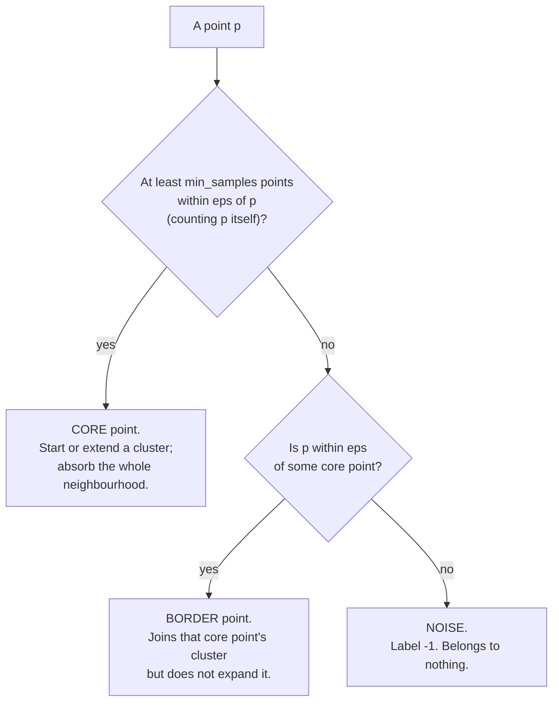

import DataCampExercise from "../../../../components/DataCampExercise.astro";
import AlgorithmCard from "../../../../components/AlgorithmCard.astro";
import Figure from "../../../../components/Figure.astro";
import Quiz from "../../../../components/Quiz.astro";

## What you'll learn

- the definitions of **core, border and noise**, and the reachability relations built on them
- the full algorithm traced by hand on ten points on a line
- why DBSCAN needs no $k$ — and why it cannot be asked for one
- how to choose `eps` from the **k-distance plot** instead of guessing
- the measured eps sweep: 21 clusters, then 2, then 2, then 1
- DBSCAN against k-means on two datasets: **ARI 1.00 vs 0.24**, and **0.57 vs 0.94**
- the varying-density failure, and why HDBSCAN exists

## Intuition

k-means asks "which centre is this point nearest?" DBSCAN asks a different question entirely:
**"is this point in a crowd, and can I walk from crowd to crowd without leaving one?"**

A cluster, in this view, is a connected region of high density. It has whatever shape the dense
region has — a ring, a crescent, a branching filament. And crucially, points in the sparse gaps
between clusters belong to *nothing*. DBSCAN is the only algorithm in this phase that can say "I
don't know" about a point.

Two parameters define "crowd":

- `eps` ($\varepsilon$) — the radius of the neighbourhood.
- `min_samples` — how many points must be inside that radius to count as dense.

Everything else follows mechanically.



## The math

Write $N_\varepsilon(p)$ for the $\varepsilon$-neighbourhood of $p$:

$$
N_\varepsilon(p) = \{\, q \in D : d(p, q) \le \varepsilon \,\}$
$$

Note that $p \in N_\varepsilon(p)$ — scikit-learn counts the point itself, so `min_samples=5`
means four neighbours plus the point.

**Core point.** $p$ is a core point if

$$
|N_\varepsilon(p)| \ge \texttt{min\_samples}
$$

**Directly density-reachable.** $q$ is directly density-reachable from $p$ if $p$ is a core point
and $q \in N_\varepsilon(p)$. This relation is *not* symmetric: a border point is directly reachable
from a core point, but not the other way round.

**Density-reachable.** $q$ is density-reachable from $p$ if there is a chain
$p = p_1, p_2, \dots, p_m = q$ where each $p_{i+1}$ is directly density-reachable from $p_i$. Every
link except possibly the last must be a core point. This is the transitive closure, and it is what
lets a cluster snake around a crescent.

**Density-connected.** $p$ and $q$ are density-connected if some core point $o$ reaches both. This
*is* symmetric, and it is the relation that actually defines a cluster.

**A cluster** is a maximal set $C$ satisfying:

1. *Maximality:* if $p \in C$ and $q$ is density-reachable from $p$, then $q \in C$.
2. *Connectivity:* every pair in $C$ is density-connected.

Anything in no cluster is **noise**.

One consequence of these definitions catches people out: a border point can be within $\varepsilon$
of core points from two different clusters. It joins whichever one reaches it first, so its label
depends on iteration order. Core points are deterministic; border points are not.

## Worked example by hand

Ten points on a line, with $\varepsilon = 0.6$ and `min_samples = 3`:

$$
1.0,\ 1.4,\ 1.8,\ 2.1,\ 2.5,\ 6.0,\ 9.0,\ 9.3,\ 9.7,\ 10.1
$$

Step one is to count each neighbourhood, remembering to include the point itself.

| $x$ | Points within 0.6 (inclusive) | $\lvert N_\varepsilon \rvert$ | Type |
| --- | --- | --- | --- |
| 1.0 | 1.0, 1.4 | 2 | border |
| 1.4 | 1.0, 1.4, 1.8 | **3** | **core** |
| 1.8 | 1.4, 1.8, 2.1 | **3** | **core** |
| 2.1 | 1.8, 2.1, 2.5 | **3** | **core** |
| 2.5 | 2.1, 2.5 | 2 | border |
| 6.0 | 6.0 | 1 | **noise** |
| 9.0 | 9.0, 9.3 | 2 | border |
| 9.3 | 9.0, 9.3, 9.7 | **3** | **core** |
| 9.7 | 9.3, 9.7, 10.1 | **3** | **core** |
| 10.1 | 9.7, 10.1 | 2 | border |

Now walk the algorithm:

1. Start at 1.0. Only 2 neighbours, not core — set aside for now.
2. Move to 1.4. Core. **Open cluster 0** and absorb $N_\varepsilon(1.4) = \{1.0, 1.4, 1.8\}$.
   1.0 joins as a border point.
3. 1.8 is in cluster 0 and is itself core, so absorb $\{1.4, 1.8, 2.1\}$ — 2.1 joins.
4. 2.1 is core, so absorb $\{1.8, 2.1, 2.5\}$ — 2.5 joins as a border point.
5. 2.5 is not core, so the expansion stops. **Cluster 0** is $\{1.0, 1.4, 1.8, 2.1, 2.5\}$.
6. 6.0 has one neighbour (itself) and is within $\varepsilon$ of no core point. **Noise, label -1.**
7. 9.3 is core. **Open cluster 1**, absorb $\{9.0, 9.3, 9.7\}$; 9.7 is core, so absorb
   $\{9.3, 9.7, 10.1\}$. **Cluster 1** is $\{9.0, 9.3, 9.7, 10.1\}$.

Final labels, in input order:

$$
[\,0,\ 0,\ 0,\ 0,\ 0,\ -1,\ 1,\ 1,\ 1,\ 1\,]
$$

Two clusters and one noise point, and at no stage did anything ask how many clusters there should
be. The gap at 6.0 is what separates them, and the gap is a property of the data.

<Figure
  src="/images/ml/phase-06-unsupervised/dbscan-density-based-clustering/core-border-noise"
  alt="A grid of blue points with two red points far away. Three dashed circles of radius eps are drawn: one around an interior blue point labelled 6 within eps, one around a corner amber point labelled 3 within eps, and one around a distant red point labelled 0 within eps."
  title="The three point types, with their neighbour counts"
  caption="min_samples = 5, so a point needs at least 4 neighbours plus itself. The interior point has 6 neighbours — core. The corner point has 3, too few to be core, but it sits inside a core point's disc — border. The isolated point has 0 — noise. Note that the corner points are border purely because the cloud ends there."
/>

## See it move

```p5 title="Density decides core, border and noise" desc="The eps radius grows and shrinks. Watch points flip between coloured cluster membership and grey noise as the density threshold sweeps past them." height="300"
let pts = [];
let eps = 20;
let epsDir = 1;
const minPts = 6;

function makeMoons() {
  pts = [];
  const n = 90;
  for (let i = 0; i < n; i++) {
    const a = map(i, 0, n, PI, 0);
    const r = 90;
    pts.push({
      x: 220 + r * cos(a) + random(-6, 6),
      y: 190 - r * sin(a) * 0.6 + random(-6, 6),
      moon: 0,
    });
  }
  for (let i = 0; i < n; i++) {
    const a = map(i, 0, n, PI, 0);
    const r = 90;
    pts.push({
      x: 340 - r * cos(a) + random(-6, 6),
      y: 230 + r * sin(a) * 0.6 + random(-6, 6),
      moon: 1,
    });
  }
  for (let i = 0; i < 25; i++) {
    pts.push({ x: random(20, 580), y: random(20, 280), moon: -1 });
  }
}

function setup() {
  createCanvas(600, 300);
  textFont("monospace");
  makeMoons();
}

function draw() {
  background(13, 17, 23);
  eps += 0.35 * epsDir;
  if (eps > 55) epsDir = -1;
  if (eps < 14) epsDir = 1;

  let cores = 0;
  for (const p of pts) {
    let count = 0;
    for (const q of pts) {
      if (p === q) continue;
      if (dist(p.x, p.y, q.x, q.y) < eps) count++;
    }
    p.isCore = count >= minPts;
    if (p.isCore) cores++;
  }

  noStroke();
  for (const p of pts) {
    if (p.isCore) {
      const col = p.moon === 0 ? [75, 139, 190] : [255, 211, 67];
      fill(col[0], col[1], col[2]);
      ellipse(p.x, p.y, 9, 9);
    } else {
      fill(110);
      ellipse(p.x, p.y, 6, 6);
    }
  }

  fill(150);
  textSize(12);
  textAlign(LEFT, CENTER);
  text("eps = " + eps.toFixed(0) + "px   min_samples = " + minPts +
       "   core points: " + cores + " / " + pts.length, 12, 16);
}

function mousePressed() {
  makeMoons();
}
```

The next sketch makes the reachability chain explicit — click anywhere to drop a seed and watch the
cluster flood outward, one core point at a time.

```p5 title="A cluster flooding out from one seed" desc="Click a point to start. The cluster expands only through core points; border points are absorbed but never expand further, so the flood stops at the edge of the dense region." height="350"
let pts = [];
const EPS = 42, MIN = 4;
let frontier = [], inCluster = new Set(), visited = new Set();
let t = 0, done = false, seedIdx = -1;

function build() {
  pts = [];
  // two crescents plus scattered noise
  for (let i = 0; i < 55; i++) {
    const a = map(i, 0, 55, PI, 0);
    pts.push({ x: 210 + 95 * cos(a) + random(-8, 8), y: 200 - 62 * sin(a) + random(-8, 8) });
  }
  for (let i = 0; i < 55; i++) {
    const a = map(i, 0, 55, PI, 0);
    pts.push({ x: 340 - 95 * cos(a) + random(-8, 8), y: 245 + 62 * sin(a) + random(-8, 8) });
  }
  for (let i = 0; i < 18; i++) pts.push({ x: random(25, 575), y: random(30, 320) });
  for (const p of pts) {
    p.n = 0;
  }
  for (const p of pts) {
    let c = 0;
    for (const q of pts) if (dist(p.x, p.y, q.x, q.y) <= EPS) c++;
    p.n = c;
    p.core = c >= MIN;
  }
  frontier = []; inCluster = new Set(); visited = new Set();
  done = false; t = 0; seedIdx = -1;
}
function seedAt(mx, my) {
  let bi = -1, bd = 1e9;
  for (let i = 0; i < pts.length; i++) {
    const d = dist(mx, my, pts[i].x, pts[i].y);
    if (d < bd) { bd = d; bi = i; }
  }
  seedIdx = bi;
  inCluster = new Set([bi]);
  visited = new Set();
  frontier = pts[bi].core ? [bi] : [];
  done = !pts[bi].core;
}
function step() {
  if (!frontier.length) { done = true; return; }
  const i = frontier.shift();
  if (visited.has(i)) return;
  visited.add(i);
  for (let j = 0; j < pts.length; j++) {
    if (dist(pts[i].x, pts[i].y, pts[j].x, pts[j].y) <= EPS) {
      if (!inCluster.has(j)) {
        inCluster.add(j);
        if (pts[j].core) frontier.push(j);   // only core points expand
      }
    }
  }
}
function setup() { createCanvas(600, 350); textFont("monospace"); build(); seedAt(210, 140); }
function draw() {
  background(13, 17, 23);
  if (seedIdx >= 0) {
    noFill();
    stroke(255, 211, 67, 60);
    strokeWeight(1);
    for (const i of visited) ellipse(pts[i].x, pts[i].y, EPS * 2, EPS * 2);
  }
  noStroke();
  for (let i = 0; i < pts.length; i++) {
    const p = pts[i];
    if (inCluster.has(i)) fill(p.core ? color(75, 139, 190) : color(255, 211, 67));
    else fill(p.core ? color(78, 90, 105) : color(58, 64, 74));
    ellipse(p.x, p.y, p.core ? 9 : 6, p.core ? 9 : 6);
  }
  if (seedIdx >= 0) {
    noFill(); stroke(232, 110, 110); strokeWeight(2);
    ellipse(pts[seedIdx].x, pts[seedIdx].y, 16, 16);
  }
  noStroke();
  fill(150);
  textSize(11);
  textAlign(LEFT, TOP);
  text("eps = " + EPS + "px   min_samples = " + MIN, 14, 12);
  fill(107, 169, 221);
  textSize(13);
  text("cluster size " + inCluster.size + (done ? "   (flood complete)" : "   expanding..."), 14, 30);
  fill(140);
  textSize(10);
  textAlign(LEFT, BOTTOM);
  text("blue = core in cluster   amber = border in cluster   dark = not reached   |   click to reseed",
       14, height - 12);

  t++;
  if (t % 12 === 0 && !done) step();
}
function mousePressed() { seedAt(mouseX, mouseY); }
```

Seed inside one crescent and the flood traces it end to end, then stops — the gap to the other
crescent is wider than `eps`, so no chain of core points crosses it. Seed on an isolated noise
point and nothing happens at all: it is not core, so it never expands.

## eps is the whole ballgame

`min_samples` is forgiving. `eps` is not. Here is one dataset — 320 points forming two crescents
plus 40 scattered noise points — under four values:

| `eps` | Clusters found | Points labelled noise |
| --- | --- | --- |
| 0.08 | **21** | 81 |
| 0.16 | **2** | 29 |
| 0.30 | **2** | 17 |
| 0.60 | **1** | 1 |

Too small and the crescents shatter into fragments while a quarter of the data becomes noise. Too
large and everything — including the scattered clutter — fuses into a single cluster. The useful
range here is roughly 0.15 to 0.35.

<Figure
  src="/images/ml/phase-06-unsupervised/dbscan-density-based-clustering/eps-sweep"
  alt="Four scatter plots of the same two crescents plus scattered noise, clustered with eps 0.08, 0.16, 0.30 and 0.60. The first is fragmented into many small clusters, the middle two show two clean crescents, the last merges everything."
  title="One parameter, four completely different answers"
  caption="At eps 0.08 the crescents shatter into 21 fragments and 81 points are noise. At 0.16 and 0.30 the structure is right. At 0.60 the neighbourhoods are wide enough to bridge the gap and everything becomes one cluster with a single noise point."
/>

By contrast, `min_samples` barely moves the answer at eps = 0.16:

| `min_samples` | Clusters | Noise |
| --- | --- | --- |
| 3 | 2 | 29 |
| 5 | 2 | 29 |
| 10 | 2 | 30 |
| 20 | **0** | 320 |

Stable until it isn't: at 20, no point in this dataset has 19 neighbours within 0.16, so
*everything* is noise. The usual heuristic is `min_samples` $\ge p + 1$, and $2p$ is a common
default for $p$ features.

### Choosing eps from the data

Do not guess. For each point, compute the distance to its $k$-th nearest neighbour (with
$k =$ `min_samples`), sort those distances, and plot them. Points inside a cluster have small
$k$-distances; noise points have large ones. The **knee** of the curve — where it turns sharply
upward — separates the two populations, and its height is a good `eps`.

On the dataset above, with $k = 5$, the median 5-distance is 0.0818 and the knee sits around
**0.1408** — right in the working range the sweep identified.

<Figure
  src="/images/ml/phase-06-unsupervised/dbscan-density-based-clustering/k-distance-plot"
  alt="A rising curve of sorted distance to the fifth nearest neighbour, flat and low for most points then turning sharply upward at the right, with a dashed horizontal line at 0.14 marking the knee."
  title="The k-distance plot picks eps for you"
  caption="Every point, sorted by how far away its 5th nearest neighbour is. The long flat stretch is points inside a dense crescent. The upturn on the right is the scattered noise. The knee at about 0.141 is the eps to try first — and the sweep confirms 0.16 works."
/>

```python title="choose_eps.py" showLineNumbers{1}
import numpy as np
from sklearn.neighbors import NearestNeighbors

k = 5                                     # same as min_samples
nn = NearestNeighbors(n_neighbors=k).fit(X)
distances, _ = nn.kneighbors(X)
k_dist = np.sort(distances[:, -1])        # distance to the kth neighbour, sorted

import matplotlib.pyplot as plt
plt.plot(k_dist)
plt.ylabel(f"distance to {k}th nearest neighbour")
plt.xlabel("points, sorted")
plt.show()                                # read eps off the knee
```

## DBSCAN against k-means

<Figure
  src="/images/ml/phase-06-unsupervised/dbscan-density-based-clustering/dbscan-vs-kmeans"
  alt="A two by two grid. Top row: k-means splitting two moons down the middle, and DBSCAN separating them correctly. Bottom row: k-means splitting three blobs correctly, and DBSCAN merging two of them into one."
  title="Each one wins where the other loses"
  caption="On moons, k-means slices straight through both crescents (ARI 0.24) while DBSCAN recovers them exactly (ARI 1.00). On three blobs, two of which nearly touch, k-means separates all three (ARI 0.94) while DBSCAN's single eps bridges the touching pair and returns two clusters (ARI 0.57)."
/>

| Dataset | k-means ARI | DBSCAN ARI | Winner |
| --- | --- | --- | --- |
| Two moons | 0.2408 | **1.0000** | DBSCAN, decisively |
| Three blobs (two touching) | **0.9414** | 0.5686 | k-means |

Both results follow directly from the assumptions. k-means draws straight boundaries, which is
wrong for crescents and right for separated blobs. DBSCAN follows density, which traces crescents
perfectly and cannot separate two blobs whose densities merge where they touch.

## The failure mode: varying density

DBSCAN has exactly one global `eps`. If one genuine cluster is dense and another is sparse, no
single value serves both: pick a small eps and the sparse cluster becomes noise; pick a large one
and the dense clusters merge.

You saw this on the
[intro page's](/machine-learning/phase-06---unsupervised-learning--dimensionality-reduction/introduction-to-clustering/)
third column — the wide cluster dissolved into noise while the tight ones survived.

**HDBSCAN** fixes this by running DBSCAN at every eps simultaneously and extracting the clusters
that persist over the widest range of scales. It replaces `eps` with `min_cluster_size`, which is a
far more interpretable question ("what is the smallest group I care about?"). It is in scikit-learn
from version 1.3 as `sklearn.cluster.HDBSCAN`.

```python title="hdbscan.py" showLineNumbers{1}
from sklearn.cluster import DBSCAN, HDBSCAN

db = DBSCAN(eps=0.16, min_samples=5).fit_predict(X)     # 2 clusters, 29 noise
hd = HDBSCAN(min_cluster_size=15).fit_predict(X)        # 2 clusters, 28 noise
```

On this well-behaved dataset HDBSCAN matches DBSCAN almost exactly — which is the point: you got
the same answer without having to find eps first. On varying-density data it wins outright.

**OPTICS** takes a related approach, producing a reachability plot from which clusterings at many
eps values can be extracted. It is slower and its output takes practice to read; on the same
dataset with default `xi=0.05` it returned 21 clusters and 140 noise points, which is a fair
warning that it needs tuning of its own.

## In code

```python title="dbscan_basics.py" showLineNumbers{1}
import numpy as np
from sklearn.cluster import DBSCAN
from sklearn.datasets import make_moons

X, y = make_moons(n_samples=300, noise=0.06, random_state=4)

db = DBSCAN(eps=0.25, min_samples=5).fit(X)

labels = db.labels_
n_clusters = len(set(labels)) - (1 if -1 in labels else 0)
print("clusters", n_clusters)                    # 2
print("noise   ", int((labels == -1).sum()))     # 0

# Which points are core? DBSCAN tells you directly.
core_mask = np.zeros(len(X), dtype=bool)
core_mask[db.core_sample_indices_] = True
print("core   ", int(core_mask.sum()))
print("border ", int(((labels != -1) & ~core_mask).sum()))
```

Three things to know about the API:

**Noise is label `-1`.** Never call `len(set(labels))` and assume that is the cluster count; use the
subtraction above. And never feed `-1` into `silhouette_score` without deciding what it means — the
usual choice is to score only the clustered points.

**There is no `predict`.** DBSCAN defines clusters relative to the training set. To label a new
point, the standard workaround is to assign it to the cluster of its nearest core sample, if one is
within eps:

```python title="pseudo_predict.py" showLineNumbers{1}
import numpy as np
from sklearn.neighbors import NearestNeighbors

def dbscan_assign(db, X_train, X_new, eps):
    """Assign new points to the cluster of the nearest core sample, else noise."""
    cores = X_train[db.core_sample_indices_]
    core_labels = db.labels_[db.core_sample_indices_]
    dist, idx = NearestNeighbors(n_neighbors=1).fit(cores).kneighbors(X_new)
    out = core_labels[idx[:, 0]]
    out[dist[:, 0] > eps] = -1
    return out
```

**Scale first, and use an index.** With a ball tree or KD tree, DBSCAN runs in
$O(n \log n)$; without one it degrades to $O(n^2)$. scikit-learn picks an index automatically for
low-dimensional Euclidean data, but in high dimensions the index stops helping and you are back to
quadratic.

<AlgorithmCard
  name="DBSCAN"
  type="Unsupervised — density-based clustering"
  sklearn="sklearn.cluster.DBSCAN"
  assumptions={[
    "Clusters are regions of higher density than the gaps between them",
    "All clusters have roughly the SAME density — one global eps must serve all of them",
    "The distance metric is meaningful and the features are scaled",
    "Density is measurable, which fails in very high dimensions",
  ]}
  complexity={{
    train: "O(n log n) with a spatial index; O(n^2) without one or in high dimensions",
    predict: "not supported — assign to the nearest core sample manually",
    memory: "O(n p) with an index; O(n^2) if a full distance matrix is precomputed",
  }}
  hyperparams={[
    { name: "eps", default: "0.5", effect: "The whole answer. 21 clusters at 0.08, 1 cluster at 0.60 on the same data. Read it off the k-distance knee." },
    { name: "min_samples", default: "5", effect: "Density threshold, counting the point itself. Stable across 3-10 here; use at least p+1." },
    { name: "metric", default: "'euclidean'", effect: "Any metric, including 'precomputed' if you supply a distance matrix." },
    { name: "algorithm", default: "'auto'", effect: "Picks ball_tree, kd_tree or brute. The index is what buys you O(n log n)." },
  ]}
  useWhen={[
    "Clusters have arbitrary shapes — crescents, rings, filaments",
    "You do not know k and do not want to pick one",
    "The data has outliers you want identified rather than absorbed",
    "Cluster densities are broadly comparable",
  ]}
  avoidWhen={[
    "Cluster densities differ a lot — use HDBSCAN instead",
    "Dimensionality is high; all pairwise distances converge and density loses meaning",
    "You need to label streaming or unseen points",
    "You need every point assigned to something",
  ]}
  notation="eps — neighbourhood radius; N_eps(p) — the eps-neighbourhood of p, including p; min_samples — density threshold"
/>

## Pitfalls

**Guessing eps.** The sweep above went 21 → 2 → 2 → 1 clusters over a four-fold range. Always plot
the k-distance curve first.

**Forgetting `-1` in the cluster count.** `len(set(labels))` counts noise as a cluster. It also
breaks any code that indexes an array by label.

**Not scaling.** eps is a single radius in the raw feature space. If one column runs to 50,000 and
another to 1, eps is entirely determined by the first.

**Expecting `predict`.** It does not exist, and the nearest-core-sample workaround above is an
approximation you should test before relying on.

**Using it in high dimensions.** Beyond roughly 10 to 20 features, the distance to the nearest
neighbour and to the farthest converge, the k-distance plot flattens out, and there is no knee to
read. Reduce dimensions with
[PCA](/machine-learning/phase-06---unsupervised-learning--dimensionality-reduction/principal-component-analysis-pca/)
first — or accept that density-based clustering is the wrong tool.

**Treating border-point labels as stable.** A border point reachable from two clusters joins
whichever the iteration reaches first. Core points are deterministic; border assignments are not.

**Applying it to clusters of different density.** This is the built-in limitation, not a tuning
problem. Reach for HDBSCAN.

## Compare

| | DBSCAN | HDBSCAN | OPTICS | k-means |
| --- | --- | --- | --- | --- |
| Needs k | no | no | no | **yes** |
| Main parameter | `eps` | `min_cluster_size` | `min_samples` + `xi` | `n_clusters` |
| Varying density | **fails** | **handles it** | handles it | fails |
| Marks noise | yes | yes | yes | no |
| Deterministic | core points yes, border no | yes | yes | no |
| Speed | fast with an index | moderate | slowest | fastest |
| Can predict | no | approximately | no | **yes** |

<Quiz
  questions={[
    {
      q: "With min_samples=5, how many OTHER points must be within eps for a point to be core?",
      options: ["5", "4, because the point itself counts toward min_samples", "6", "It depends on eps"],
      answer: 1,
      explain: "scikit-learn includes the point in its own eps-neighbourhood, so |N_eps(p)| >= 5 means four neighbours plus itself. Off-by-one here shifts every core/border boundary in your result.",
    },
    {
      q: "DBSCAN labels 40% of your data -1. What is the most likely cause?",
      options: [
        "min_samples is too low",
        "eps is too small for the density of your data",
        "The data has no clusters",
        "You need more data",
      ],
      answer: 1,
      explain: "eps too small means few points reach the min_samples threshold, so almost nothing is core and almost everything falls through to noise. The page's sweep shows exactly this: at eps 0.08, 81 of 320 points became noise and the clusters shattered into 21 fragments.",
    },
    {
      q: "Why does DBSCAN have no predict method?",
      options: [
        "An oversight in scikit-learn",
        "Clusters are defined by density-connectivity within the training set, so adding a point could legitimately merge two existing clusters",
        "It would be too slow",
        "It does have one",
      ],
      answer: 1,
      explain: "A new point might be core and bridge two clusters that were previously separate — which would change the training-set labels too. There is no consistent way to label a new point without refitting, so the API refuses rather than lying.",
    },
    {
      q: "One of your genuine clusters is dense and another is sparse. What happens with DBSCAN?",
      options: [
        "It handles both automatically",
        "No single eps works: small eps makes the sparse cluster noise, large eps merges the dense ones",
        "It returns an error",
        "min_samples fixes it",
      ],
      answer: 1,
      explain: "This is DBSCAN's structural limitation, not a tuning failure — there is one global eps. HDBSCAN was built for exactly this: it runs across all eps values and keeps the clusters that persist longest.",
    },
    {
      q: "DBSCAN scored ARI 1.00 on two moons and 0.57 on three blobs, where k-means scored 0.24 and 0.94. What is the lesson?",
      options: [
        "DBSCAN is better",
        "k-means is better",
        "Each algorithm wins exactly where its shape assumption holds; neither dominates",
        "Both need more tuning",
      ],
      answer: 2,
      explain: "k-means assumes straight boundaries between round clusters; DBSCAN assumes clusters are connected dense regions. On the blobs, two clusters nearly touch, so their densities join and DBSCAN merges them. Match the algorithm to the geometry, not to a reputation.",
    },
  ]}
/>

## 🧪 Try It Yourself

### Exercise 1 – Core, border and noise by hand

<DataCampExercise
  lang="python"
  hint={`Count how many points lie within eps of each point, INCLUDING the point itself.`}
  code={`# Task: Exercise 1 - Core, border and noise by hand
import numpy as np

x = np.array([1.0, 1.4, 1.8, 2.1, 2.5, 6.0, 9.0, 9.3, 9.7, 10.1])
eps, min_samples = 0.6, 3

counts = (np.abs(x[:, None] - x[None, :]) <= eps).sum(axis=1)   # includes self
is_core = counts >= ___                     # replace ___ with min_samples

for xi, c, core in zip(x, counts, is_core):
    print(f"x={xi:5.1f}  |N_eps|={c}  {'CORE' if core else '    '}")

print("core points:", int(is_core.sum()))

# -- Expected Output -------------------------------------------
# x=  1.0  |N_eps|=2
# x=  1.4  |N_eps|=3  CORE
# x=  1.8  |N_eps|=3  CORE
# x=  2.1  |N_eps|=3  CORE
# x=  2.5  |N_eps|=2
# x=  6.0  |N_eps|=1
# x=  9.0  |N_eps|=2
# x=  9.3  |N_eps|=3  CORE
# x=  9.7  |N_eps|=3  CORE
# x= 10.1  |N_eps|=2
# core points: 5
# --------------------------------------------------------------`}
  solution={`import numpy as np

x = np.array([1.0, 1.4, 1.8, 2.1, 2.5, 6.0, 9.0, 9.3, 9.7, 10.1])
eps, min_samples = 0.6, 3
counts = (np.abs(x[:, None] - x[None, :]) <= eps).sum(axis=1)
is_core = counts >= min_samples
for xi, c, core in zip(x, counts, is_core):
    print(f"x={xi:5.1f}  |N_eps|={c}  {'CORE' if core else '    '}")
print("core points:", int(is_core.sum()))`}
  sct={`test_output_contains("core points: 5")
success_msg("Five core points, and the run of them is what makes each cluster hang together.")`}
  height={290}
/>

### Exercise 2 – Confirm it against sklearn

<DataCampExercise
  lang="python"
  hint={`db.core_sample_indices_ holds the indices of the core points.`}
  code={`# Task: Exercise 2 - Confirm it against sklearn
import numpy as np
from sklearn.cluster import DBSCAN

X = np.array([1.0, 1.4, 1.8, 2.1, 2.5, 6.0, 9.0, 9.3, 9.7, 10.1]).reshape(-1, 1)

db = DBSCAN(eps=0.6, min_samples=3).fit(X)
core = np.zeros(len(X), dtype=bool)
core[db.___] = True                        # replace ___ with core_sample_indices_

print("labels    ", db.labels_)
print("core count", int(core.sum()))
print("noise     ", int((db.labels_ == -1).sum()))

# -- Expected Output -------------------------------------------
# labels     [ 0  0  0  0  0 -1  1  1  1  1]
# core count 5
# noise      1
# --------------------------------------------------------------`}
  solution={`import numpy as np
from sklearn.cluster import DBSCAN

X = np.array([1.0, 1.4, 1.8, 2.1, 2.5, 6.0, 9.0, 9.3, 9.7, 10.1]).reshape(-1, 1)
db = DBSCAN(eps=0.6, min_samples=3).fit(X)
core = np.zeros(len(X), dtype=bool)
core[db.core_sample_indices_] = True
print("labels    ", db.labels_)
print("core count", int(core.sum()))
print("noise     ", int((db.labels_ == -1).sum()))`}
  sct={`test_output_contains("core count 5")
success_msg("Identical to the hand trace: two clusters, one noise point, five cores.")`}
  height={240}
/>

### Exercise 3 – Sweep eps and watch it break

<DataCampExercise
  lang="python"
  hint={`Subtract one from the label count when -1 is present, so noise is not counted as a cluster.`}
  code={`# Task: Exercise 3 - Sweep eps and watch it break
import numpy as np
from sklearn.cluster import DBSCAN
from sklearn.datasets import make_moons

rng = np.random.default_rng(7)
X, _ = make_moons(n_samples=280, noise=0.05, random_state=7)
X = np.vstack([X, rng.uniform([-1.6, -1.0], [2.6, 1.6], size=(40, 2))])

for eps in (0.08, 0.16, 0.30, 0.60):
    lab = DBSCAN(eps=eps, min_samples=5).fit_predict(X)
    n = len(set(lab)) - (1 if ___ in lab else 0)    # replace ___ with -1
    print(f"eps {eps:.2f}: {n:2d} clusters, {int((lab == -1).sum()):2d} noise")

# -- Expected Output -------------------------------------------
# eps 0.08: 21 clusters, 81 noise
# eps 0.16:  2 clusters, 29 noise
# eps 0.30:  2 clusters, 17 noise
# eps 0.60:  1 clusters,  1 noise
# --------------------------------------------------------------`}
  solution={`import numpy as np
from sklearn.cluster import DBSCAN
from sklearn.datasets import make_moons

rng = np.random.default_rng(7)
X, _ = make_moons(n_samples=280, noise=0.05, random_state=7)
X = np.vstack([X, rng.uniform([-1.6, -1.0], [2.6, 1.6], size=(40, 2))])
for eps in (0.08, 0.16, 0.30, 0.60):
    lab = DBSCAN(eps=eps, min_samples=5).fit_predict(X)
    n = len(set(lab)) - (1 if -1 in lab else 0)
    print(f"eps {eps:.2f}: {n:2d} clusters, {int((lab == -1).sum()):2d} noise")`}
  sct={`test_output_contains("eps 0.08: 21 clusters")
success_msg("A four-fold change in eps takes you from 21 clusters to 1. This parameter is the model.")`}
  height={250}
/>

### Exercise 4 – Read eps off the k-distance curve

<DataCampExercise
  lang="python"
  hint={`kneighbors returns distances sorted ascending, so the last column is the kth neighbour.`}
  code={`# Task: Exercise 4 - Read eps off the k-distance curve
import numpy as np
from sklearn.datasets import make_moons
from sklearn.neighbors import NearestNeighbors

rng = np.random.default_rng(7)
X, _ = make_moons(n_samples=280, noise=0.05, random_state=7)
X = np.vstack([X, rng.uniform([-1.6, -1.0], [2.6, 1.6], size=(40, 2))])

dist, _ = NearestNeighbors(n_neighbors=5).fit(X).kneighbors(X)
k_dist = np.sort(dist[:, ___])              # replace ___ with -1

print("median 5-distance", round(float(np.median(k_dist)), 4))
print("88th percentile  ", round(float(np.percentile(k_dist, 88)), 4))
print("max              ", round(float(k_dist.max()), 4))

# -- Expected Output -------------------------------------------
# median 5-distance 0.0818
# 88th percentile   0.1408
# max               0.8871
# --------------------------------------------------------------`}
  solution={`import numpy as np
from sklearn.datasets import make_moons
from sklearn.neighbors import NearestNeighbors

rng = np.random.default_rng(7)
X, _ = make_moons(n_samples=280, noise=0.05, random_state=7)
X = np.vstack([X, rng.uniform([-1.6, -1.0], [2.6, 1.6], size=(40, 2))])
dist, _ = NearestNeighbors(n_neighbors=5).fit(X).kneighbors(X)
k_dist = np.sort(dist[:, -1])
print("median 5-distance", round(float(np.median(k_dist)), 4))
print("88th percentile  ", round(float(np.percentile(k_dist, 88)), 4))
print("max              ", round(float(k_dist.max()), 4))`}
  sct={`test_output_contains("88th percentile   0.1408")
success_msg("0.141 from the knee, and the sweep confirmed 0.16 works. No guessing required.")`}
  height={250}
/>

### Exercise 5 – Where each algorithm wins

<DataCampExercise
  lang="python"
  hint={`Score both algorithms on both datasets and compare the four adjusted Rand indices.`}
  code={`# Task: Exercise 5 - Where each algorithm wins
from sklearn.cluster import DBSCAN, KMeans
from sklearn.datasets import make_blobs, make_moons
from sklearn.metrics import adjusted_rand_score

Xm, ym = make_moons(n_samples=300, noise=0.06, random_state=4)
Xb, yb = make_blobs(n_samples=300, centers=3, cluster_std=0.9, random_state=4)

for name, X, y, k, eps in (("moons", Xm, ym, 2, 0.25), ("blobs", Xb, yb, 3, 0.9)):
    km = KMeans(n_clusters=k, n_init=10, random_state=0).fit_predict(X)
    db = DBSCAN(eps=eps, min_samples=5).___(X)      # replace ___ with fit_predict
    print(f"{name}: k-means {adjusted_rand_score(y, km):.4f}"
          f"   DBSCAN {adjusted_rand_score(y, db):.4f}")

# -- Expected Output -------------------------------------------
# moons: k-means 0.2408   DBSCAN 1.0000
# blobs: k-means 0.9414   DBSCAN 0.5686
# --------------------------------------------------------------`}
  solution={`from sklearn.cluster import DBSCAN, KMeans
from sklearn.datasets import make_blobs, make_moons
from sklearn.metrics import adjusted_rand_score

Xm, ym = make_moons(n_samples=300, noise=0.06, random_state=4)
Xb, yb = make_blobs(n_samples=300, centers=3, cluster_std=0.9, random_state=4)
for name, X, y, k, eps in (("moons", Xm, ym, 2, 0.25), ("blobs", Xb, yb, 3, 0.9)):
    km = KMeans(n_clusters=k, n_init=10, random_state=0).fit_predict(X)
    db = DBSCAN(eps=eps, min_samples=5).fit_predict(X)
    print(f"{name}: k-means {adjusted_rand_score(y, km):.4f}"
          f"   DBSCAN {adjusted_rand_score(y, db):.4f}")`}
  sct={`test_output_contains("DBSCAN 1.0000")
success_msg("Perfect on moons, mediocre on blobs — exactly the reverse of k-means. Match the algorithm to the geometry.")`}
  height={250}
/>

## Recap

- A point is **core** if its eps-neighbourhood (including itself) holds at least `min_samples`
  points, **border** if it is inside a core point's disc, **noise** otherwise.
- A cluster is a maximal density-connected set. That definition needs no $k$ and imposes no shape.
- The hand trace on ten points gave labels `[0 0 0 0 0 -1 1 1 1 1]` — two clusters, one noise point.
- `eps` is the model: 21 clusters at 0.08, 2 at 0.16 and 0.30, 1 at 0.60 on identical data.
  `min_samples` is stable from 3 to 10 and then collapses everything to noise at 20.
- Choose eps from the **k-distance knee**: 0.1408 here, and the sweep confirmed the range.
- DBSCAN beat k-means 1.00 to 0.24 on moons and lost 0.57 to 0.94 on touching blobs.
- One global eps cannot serve clusters of different density. **HDBSCAN** removes that limitation
  and replaces eps with `min_cluster_size`.
- There is no `predict`, noise is label `-1`, and high dimensions destroy the notion of density.

### Exercise 6 – Sweep eps and watch the model change species

<DataCampExercise
  lang="python"
  hint={`DBSCAN labels noise as -1, so len(set(labels) - {-1}) counts the real clusters.`}
  code={`# Task: Exercise 6 - Sweep eps and watch the model change species
import numpy as np
from sklearn.cluster import DBSCAN
from sklearn.datasets import make_moons

X_moons, y_moons = make_moons(n_samples=200, noise=0.06, random_state=0)
print(f"{'eps':>5} {'clusters':>9} {'noise points':>13}")
for eps in (0.05, 0.10, 0.20, 0.40, 0.80):
    labels = DBSCAN(eps=eps, min_samples=5).___(X_moons)
    # replace ___ with fit_predict
    clusters = len(set(labels) - {-1})
    print(f"{eps:5.2f} {clusters:9d} {int((labels == -1).sum()):13d}")
print("too small: everything is noise. too large: one cluster. the useful "
      "range is narrow and data-dependent")

# -- Expected Output -------------------------------------------
#   eps  clusters  noise points
#  0.05         0           200
#  0.10        18            55
#  0.20         2             0
#  0.40         1             0
#  0.80         1             0
# too small: everything is noise. too large: one cluster. the useful range is narrow and data-dependent
# --------------------------------------------------------------`}
  solution={`import numpy as np
from sklearn.cluster import DBSCAN
from sklearn.datasets import make_moons

X_moons, y_moons = make_moons(n_samples=200, noise=0.06, random_state=0)
print(f"{'eps':>5} {'clusters':>9} {'noise points':>13}")
for eps in (0.05, 0.10, 0.20, 0.40, 0.80):
    labels = DBSCAN(eps=eps, min_samples=5).fit_predict(X_moons)
    clusters = len(set(labels) - {-1})
    print(f"{eps:5.2f} {clusters:9d} {int((labels == -1).sum()):13d}")
print("too small: everything is noise. too large: one cluster. the useful "
      "range is narrow and data-dependent")`}
  sct={`test_output_contains("0.20         2             0")
success_msg("Only eps=0.20 recovers the two crescents. At 0.10 DBSCAN reports 18 clusters and calls 55 points noise; at 0.40 it merges everything into one. And because eps is a distance, this whole table changes the moment you rescale a feature.")`}
  height={280}
/>

## Next

[Anomaly Detection with Isolation Forests](/machine-learning/phase-06---unsupervised-learning--dimensionality-reduction/anomaly-detection-with-isolation-forests/)
— DBSCAN found outliers as a side effect of clustering. The next page makes finding them the whole
objective, and does it in a way that gets *faster* as the data gets bigger.
