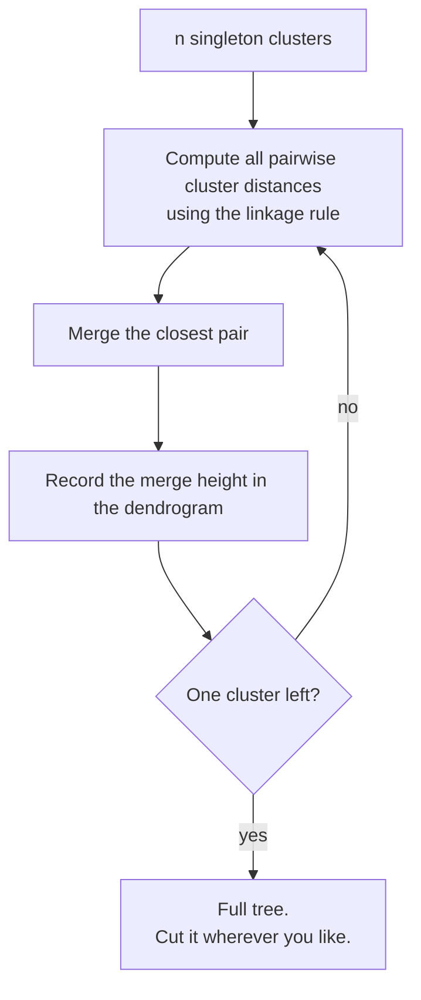

## What you'll learn

- agglomerative clustering as a sequence of $n - 1$ merges, traced in full on eight points
- the four **linkage rules**, each computed by hand from the same distance matrix
- how to read a dendrogram, and why the vertical axis is the only part that carries information
- the Lance-Williams recurrence that makes all four rules one algorithm
- the measured single-versus-Ward trade-off: **ARI 1.00 / 0.00 against 0.13 / 0.93**
- how to choose a cut height without committing to $k$ in advance
- the cophenetic correlation, and why $O(n^2)$ memory ends the party around 30,000 rows

## Intuition

k-means asks you for $k$ before it will tell you anything. Hierarchical clustering refuses to
commit. It builds **every** clustering at once — from $n$ singleton clusters down to one cluster
containing everything — and hands you the whole nested family as a tree. You pick where to cut
afterwards, having seen the structure.

The agglomerative (bottom-up) version is a loop of exactly three lines:

1. Start with every point as its own cluster.
2. Merge the two closest clusters.
3. Repeat until one cluster remains.

The only difficulty is step 2, because "closest" between two *sets* of points is not defined by the
distance between two *points*. That definition is the linkage rule, and it is the entire character
of the algorithm.



There is also a divisive (top-down) version that starts with one cluster and splits recursively.
It is rarely used — the first split alone is a $2^{n-1}$ search — so "hierarchical clustering" in
practice means agglomerative.

## The math

Let $A$ and $B$ be two clusters and $d(\cdot, \cdot)$ the point-level distance. The four standard
linkage rules define the cluster-level distance $D(A, B)$:

**Single linkage** — the nearest pair:

$$
D_{\text{single}}(A, B) = \min_{a \in A,\ b \in B} d(a, b)
$$

**Complete linkage** — the furthest pair:

$$
D_{\text{complete}}(A, B) = \max_{a \in A,\ b \in B} d(a, b)
$$

**Average linkage** — the mean over all pairs:

$$
D_{\text{average}}(A, B) = \frac{1}{|A|\,|B|} \sum_{a \in A} \sum_{b \in B} d(a, b)
$$

**Ward linkage** minimises the increase in within-cluster sum of squares caused by the merge. That
increase has a closed form:

$$
\Delta_{\text{Ward}}(A, B) = \frac{|A|\,|B|}{|A| + |B|}
\lVert \bar{\mathbf{a}} - \bar{\mathbf{b}} \rVert^2
$$

where $\bar{\mathbf{a}}$ and $\bar{\mathbf{b}}$ are the two centroids. SciPy reports the merge
height as $\sqrt{2\Delta}$, so the plotted Ward distance is

$$
D_{\text{Ward}}(A, B) = \sqrt{\frac{2\,|A|\,|B|}{|A| + |B|}}\;
\lVert \bar{\mathbf{a}} - \bar{\mathbf{b}} \rVert
$$

Ward is the direct hierarchical analogue of k-means: both minimise within-cluster sum of squares,
one greedily bottom-up and one by alternating optimisation. Ward requires Euclidean distance;
the other three accept any metric.

### One recurrence, four rules

Naively, every merge would require recomputing distances from scratch. The **Lance-Williams
recurrence** avoids that. After merging $A$ and $B$ into $A \cup B$, the distance to any other
cluster $C$ is:

$$
D(A \cup B, C) = \alpha_A D(A, C) + \alpha_B D(B, C) + \beta D(A, B)
+ \gamma \left| D(A, C) - D(B, C) \right|
$$

Writing $n_A$, $n_B$ and $n_C$ for the three cluster sizes, and $n_T = n_A + n_B + n_C$:

| Linkage | $\alpha_A$ | $\alpha_B$ | $\beta$ | $\gamma$ |
| --- | --- | --- | --- | --- |
| Single | $\tfrac{1}{2}$ | $\tfrac{1}{2}$ | 0 | $-\tfrac{1}{2}$ |
| Complete | $\tfrac{1}{2}$ | $\tfrac{1}{2}$ | 0 | $+\tfrac{1}{2}$ |
| Average | $\tfrac{n_A}{n_A + n_B}$ | $\tfrac{n_B}{n_A + n_B}$ | 0 | 0 |
| Ward | $\tfrac{n_A + n_C}{n_T}$ | $\tfrac{n_B + n_C}{n_T}$ | $-\tfrac{n_C}{n_T}$ | 0 |

Single and complete differ only in the sign of $\gamma$ — half the difference, added or subtracted.
That one sign is the difference between chaining and compactness.

## Worked example by hand

Eight points, labelled A through H:

| | A | B | C | D | E | F | G | H |
| --- | --- | --- | --- | --- | --- | --- | --- | --- |
| **x** | 1.0 | 1.5 | 1.2 | 5.0 | 5.4 | 6.0 | 9.0 | 9.4 |
| **y** | 1.0 | 1.2 | 2.0 | 5.0 | 5.6 | 5.1 | 1.0 | 1.6 |

The Euclidean distance matrix, rounded to three decimals:

| | A | B | C | D | E | F | G | H |
| --- | --- | --- | --- | --- | --- | --- | --- | --- |
| **A** | 0 | 0.539 | 1.020 | 5.657 | 6.366 | 6.466 | 8.000 | 8.421 |
| **B** | 0.539 | 0 | 0.854 | 5.166 | 5.880 | 5.955 | 7.503 | 7.910 |
| **C** | 1.020 | 0.854 | 0 | 4.841 | 5.532 | 5.714 | 7.864 | 8.210 |
| **D** | 5.657 | 5.166 | 4.841 | 0 | 0.721 | 1.005 | 5.657 | 5.561 |
| **E** | 6.366 | 5.880 | 5.532 | 0.721 | 0 | 0.781 | 5.841 | 5.657 |
| **F** | 6.466 | 5.955 | 5.714 | 1.005 | 0.781 | 0 | 5.080 | 4.880 |
| **G** | 8.000 | 7.503 | 7.864 | 5.657 | 5.841 | 5.080 | 0 | 0.721 |
| **H** | 8.421 | 7.910 | 8.210 | 5.561 | 5.657 | 4.880 | 0.721 | 0 |

**Merge 1.** The smallest off-diagonal entry is $d(A, B) = 0.5385$. Merge them into
$\{A, B\}$.

**Now the linkage rules diverge.** The new cluster $\{A, B\}$ needs a distance to C. From the
matrix, $d(A, C) = 1.0198$ and $d(B, C) = 0.8544$, so:

| Rule | Computation | $D(\{A,B\}, C)$ |
| --- | --- | --- |
| Single | $\min(1.0198,\ 0.8544)$ | **0.8544** |
| Complete | $\max(1.0198,\ 0.8544)$ | **1.0198** |
| Average | $(1.0198 + 0.8544)/2$ | **0.9371** |
| Ward | $\sqrt{\tfrac{2 \cdot 2 \cdot 1}{3}} \times \lVert \overline{AB} - C \rVert$ | **1.0408** |

For the Ward figure: $\overline{AB} = (1.25,\ 1.10)$ and $C = (1.2,\ 2.0)$, so the centroid gap is
$\sqrt{0.05^2 + 0.9^2} = 0.9014$, and $\sqrt{4/3} \times 0.9014 = 1.0408$.

Every one of these matches SciPy exactly.

**Merges 2 and 3** are the same under all four rules, because both involve singletons:
$d(D, E) = 0.7211$ and $d(G, H) = 0.7211$.

Here is the complete Ward trace:

| Merge | Joins | Height | Resulting cluster |
| --- | --- | --- | --- |
| 1 | A + B | 0.5385 | $\{A, B\}$ |
| 2 | D + E | 0.7211 | $\{D, E\}$ |
| 3 | G + H | 0.7211 | $\{G, H\}$ |
| 4 | F + $\{D, E\}$ | 0.9522 | $\{D, E, F\}$ |
| 5 | C + $\{A, B\}$ | 1.0408 | $\{A, B, C\}$ |
| 6 | $\{G, H\}$ + $\{D, E, F\}$ | 8.4013 | $\{D, E, F, G, H\}$ |
| 7 | $\{A, B, C\}$ + rest | 11.9220 | everything |

Notice the gap. The first five merges all happen below height 1.05; the sixth jumps to 8.40. That
jump is the signal, and cutting anywhere between 1.05 and 8.40 gives three clusters:
$\{A, B, C\}$, $\{D, E, F\}$, $\{G, H\}$ — exactly the three visual groups.

<Figure
  src="/images/ml/phase-06-unsupervised/hierarchical-clustering-dendrograms/toy-dendrogram"
  alt="Eight labelled points in three visual groups beside their Ward dendrogram, with a dashed line at height 4 crossing three vertical branches."
  title="Eight points and their Ward tree"
  caption="The leaves are the points; the height of each horizontal bar is the distance at which that merge happened. The dashed cut at height 4 crosses three branches, so it returns three clusters — the same three groups you can see on the left."
/>

## Reading a dendrogram

Three rules cover almost every mistake people make with these plots.

**The vertical axis is the only quantitative axis.** Height means merge distance. Read it.

**Horizontal position is arbitrary.** At each merge, either subtree can be drawn on the left. The
same tree has $2^{n-1}$ valid drawings. Two leaves being drawn side by side means nothing unless
they are joined by a low bar.

**A cut is a horizontal line.** The number of vertical branches it crosses is the number of
clusters you get. Cut low for many small clusters, high for few large ones.

The long vertical runs are the interesting part. A branch that survives a long height interval
without merging is a cluster that stayed distinct across a wide range of thresholds — evidence of
real separation.

## See it move

```p5 title="Merging the two closest, over and over" desc="Eight leaves along the bottom. Each beat merges the closest remaining pair and draws the bar at the height where it happened, building the tree from the leaves upward." height="300"
let leaves = [];
let merges = [];
let mergeStep = 0;
let t = 0;
const n = 8;
function reset() {
  leaves = [];
  const marginX = 50;
  const spread = (width - marginX * 2) / (n - 1);
  for (let i = 0; i < n; i++) {
    leaves.push({ x: marginX + i * spread + random(-8, 8), y: height - 30 });
  }
  merges = [];
  let active = leaves.map((l) => ({ x: l.x, y: l.y }));
  let curY = height - 30;
  const topY = 45;
  const step = (curY - topY) / (n - 1);
  while (active.length > 1) {
    let bi = 0, bj = 1, bd = Infinity;
    for (let i = 0; i < active.length; i++) {
      for (let j = i + 1; j < active.length; j++) {
        const d = Math.abs(active[i].x - active[j].x);
        if (d < bd) { bd = d; bi = i; bj = j; }
      }
    }
    curY -= step;
    const a = active[bi], b = active[bj];
    merges.push({ ax: a.x, ay: a.y, bx: b.x, by: b.y, y: curY });
    const merged = { x: (a.x + b.x) / 2, y: curY };
    active.splice(bj, 1);
    active.splice(bi, 1);
    active.push(merged);
  }
  mergeStep = 0;
  t = 0;
}
function setup() {
  createCanvas(600, 300);
  textFont("monospace");
  reset();
}
function draw() {
  background(13, 17, 23);
  for (let i = 0; i < mergeStep && i < merges.length; i++) {
    const m = merges[i];
    const isNewest = i === mergeStep - 1;
    if (isNewest) {
      const pulse = 150 + sin(t * 0.2) * 105;
      stroke(255, 211, 67, pulse);
      strokeWeight(3);
    } else {
      stroke(90, 150, 200);
      strokeWeight(2);
    }
    line(m.ax, m.ay, m.ax, m.y);
    line(m.bx, m.by, m.bx, m.y);
    line(m.ax, m.y, m.bx, m.y);
  }
  noStroke();
  fill(255, 211, 67);
  for (const l of leaves) ellipse(l.x, l.y, 8, 8);
  fill(150);
  textSize(12);
  textAlign(LEFT, CENTER);
  text("merge " + Math.min(mergeStep, merges.length) + " / " + merges.length, 12, 20);
  t++;
  if (t % 45 === 0 && mergeStep < merges.length) mergeStep++;
  if (mergeStep >= merges.length && t > merges.length * 45 + 90) reset();
}
function mousePressed() { reset(); }
```

The next sketch is the one that matters: the *same* eight points under all four linkage rules,
with the merge order and heights recomputed for each.

```p5 title="Four linkage rules, one distance matrix" desc="Eight fixed points. Click to cycle through single, complete, average and Ward linkage; the merge order and the heights change even though the points do not." height="360"
const PTS = [[1.0,1.0],[1.5,1.2],[1.2,2.0],[5.0,5.0],[5.4,5.6],[6.0,5.1],[9.0,1.0],[9.4,1.6]];
const NAMES = "ABCDEFGH";
const RULES = ["single", "complete", "average", "ward"];
let rule = 0, merges = [], t = 0, shown = 0;

function dist2(a, b) { return Math.hypot(a[0]-b[0], a[1]-b[1]); }

function build() {
  // clusters: {members: [idx], centroid: [x,y], leafX: number}
  let cl = PTS.map((p, i) => ({ m: [i], c: [p[0], p[1]] }));
  merges = [];
  while (cl.length > 1) {
    let best = null;
    for (let i = 0; i < cl.length; i++) {
      for (let j = i + 1; j < cl.length; j++) {
        let d;
        if (rule === 3) {
          const na = cl[i].m.length, nb = cl[j].m.length;
          d = Math.sqrt(2 * na * nb / (na + nb)) * dist2(cl[i].c, cl[j].c);
        } else {
          const ds = [];
          for (const a of cl[i].m) for (const b of cl[j].m) ds.push(dist2(PTS[a], PTS[b]));
          if (rule === 0) d = Math.min(...ds);
          else if (rule === 1) d = Math.max(...ds);
          else d = ds.reduce((x, y) => x + y, 0) / ds.length;
        }
        if (!best || d < best.d) best = { i: i, j: j, d: d };
      }
    }
    const A = cl[best.i], B = cl[best.j];
    const m = A.m.concat(B.m);
    let cx = 0, cy = 0;
    for (const k of m) { cx += PTS[k][0]; cy += PTS[k][1]; }
    merges.push({ a: A.m.slice(), b: B.m.slice(), h: best.d });
    cl = cl.filter((_, k) => k !== best.i && k !== best.j);
    cl.push({ m: m, c: [cx / m.length, cy / m.length] });
  }
  shown = 0; t = 0;
}
function setup() { createCanvas(600, 360); textFont("monospace"); build(); }
function draw() {
  background(13, 17, 23);
  const ox = 46, w = width - 92, base = height - 46, topY = 66;
  const maxH = merges[merges.length - 1].h;

  // leaf x positions in the fixed A..H order
  const lx = i => ox + (i + 0.5) * (w / 8);
  const hy = h => base - (h / maxH) * (base - topY);

  // node x = mean leaf position of its members
  const nodeX = ms => ms.reduce((s, i) => s + lx(i), 0) / ms.length;

  for (let k = 0; k < shown; k++) {
    const m = merges[k];
    const xa = nodeX(m.a), xb = nodeX(m.b), y = hy(m.h);
    const ya = k === 0 ? base : base;
    stroke(k === shown - 1 ? color(255, 211, 67) : color(107, 169, 221));
    strokeWeight(k === shown - 1 ? 3 : 2);
    line(xa, base, xa, y);
    line(xb, base, xb, y);
    line(xa, y, xb, y);
    noStroke();
    fill(150);
    textSize(9);
    textAlign(CENTER, BOTTOM);
    text(m.h.toFixed(3), (xa + xb) / 2, y - 3);
  }

  noStroke();
  fill(255, 211, 67);
  textSize(11);
  textAlign(CENTER, TOP);
  for (let i = 0; i < 8; i++) {
    ellipse(lx(i), base, 7, 7);
    fill(150);
    text(NAMES[i], lx(i), base + 8);
    fill(255, 211, 67);
  }

  fill(107, 169, 221);
  textSize(15);
  textAlign(LEFT, TOP);
  text(RULES[rule] + " linkage", ox, 16);
  fill(150);
  textSize(11);
  text("merge " + shown + " of 7   |   tallest merge " + maxH.toFixed(3), ox, 40);
  textAlign(RIGHT, TOP);
  text("click for the next rule", ox + w, 40);

  t++;
  if (t % 40 === 0) {
    if (shown < merges.length) shown++;
    else { shown = 0; }
  }
}
function mousePressed() { rule = (rule + 1) % 4; build(); }
```

Watch the tallest merge as you cycle: 4.879 for single, 8.421 for complete, 6.632 for average,
11.922 for Ward. The tree's shape changes; the data never does.

## The linkage trade-off, measured

The four rules are not four flavours of the same thing. They encode genuinely different beliefs
about what a cluster is, and the consequences are stark.

<Figure
  src="/images/ml/phase-06-unsupervised/hierarchical-clustering-dendrograms/linkage-on-moons"
  alt="A two by four grid. The top row shows the two-moons dataset clustered by single, complete, average and Ward linkage; the bottom row shows three blobs clustered the same four ways. Adjusted Rand indices are printed under each panel."
  title="The same four rules on two datasets"
  caption="Single linkage recovers the moons perfectly (ARI 1.00) and completely fails on blobs (ARI 0.00, everything in one cluster plus two singletons). Ward is the exact reverse: 0.13 on moons, 0.93 on blobs. There is no rule that wins both."
/>

| Linkage | Moons (ARI) | Blobs (ARI) | Character |
| --- | --- | --- | --- |
| Single | **1.0000** | **-0.0000** | Chains along dense paths; one bridging point merges two clusters |
| Complete | 0.3278 | 0.5802 | Compact, roughly equal-diameter clusters; sensitive to outliers |
| Average | 0.2069 | 0.5679 | A compromise; the most common default outside Ward |
| Ward | 0.1250 | **0.9272** | Equal-variance spherical clusters; the k-means of trees |

Single linkage's failure on blobs is worth understanding. It merges whenever *any* two points are
close, so a thin trail of points between two blobs is enough to fuse them — the **chaining
effect**. On the moons, chaining is exactly right: each moon is a connected dense path. On blobs
with a few scattered points, chaining swallows everything.

<Figure
  src="/images/ml/phase-06-unsupervised/hierarchical-clustering-dendrograms/linkage-comparison"
  alt="Four dendrograms of the same sixty points under single, complete, average and Ward linkage. The single-linkage tree is lopsided with many low merges; the Ward tree is balanced with a tall root."
  title="Four rules, four trees, one dataset"
  caption="Single linkage produces a lopsided comb — points join the growing chain one at a time. Complete and Ward produce balanced trees with a clear tall split at the root. The vertical scales differ by an order of magnitude: Ward's root is at 101 where single's is at 11."
/>

## Choosing where to cut

Two approaches, and they answer different questions.

**By $k$.** Pass `n_clusters=4` and let the algorithm cut wherever it must. Use this when the
number is fixed by something external.

**By height.** Pass a `distance_threshold` and let the number of clusters fall out. Use this when
you want the data to decide.

To pick a height, plot the merge distances and find where they stop being cheap. On 200 points
containing 4 blobs, the last eight Ward merges are at heights:

$$
5.777,\ 5.982,\ 6.110,\ 6.386,\ 6.788,\ \mathbf{39.524},\ \mathbf{40.748},\ \mathbf{109.207}
$$

Five merges under 7, then a jump to 39.5. Anything between about 7 and 39 gives the same answer,
and cutting at 20 returns exactly 4 clusters.

<Figure
  src="/images/ml/phase-06-unsupervised/hierarchical-clustering-dendrograms/cutting-the-tree"
  alt="A line plot of merge distance against clusters remaining, flat near 6 until 4 clusters remain then jumping to 40 and 110, beside the four-cluster scatter that a cut at height 20 produces."
  title="Where the merges stop being cheap"
  caption="The plateau below 7 is merges joining nearby points inside a blob. The jump to 39.5 is the first merge that joins two whole blobs. Cutting anywhere in the gap returns 4 clusters, which is what the data contains."
/>

### Cophenetic correlation

How faithfully does the tree represent the original distances? The **cophenetic distance** between
two points is the height at which they first end up in the same cluster. Correlate those with the
original pairwise distances:

$$
c = \operatorname{corr}\big(\, d(i, j),\ \text{coph}(i, j) \,\big)
$$

On the eight-point example: single 0.9238, complete 0.9311, average **0.9398**, Ward 0.9338.
Average linkage wins, which is not a coincidence — average linkage optimises something close to
this quantity directly. Values above about 0.75 mean the tree is a reasonable summary; well below
that, the dendrogram is distorting the geometry and you should not read structure into it.

## In code

```python title="agglomerative.py" showLineNumbers{1}
import numpy as np
from sklearn.cluster import AgglomerativeClustering

X = np.array([[1.0, 1.0], [1.5, 1.2], [1.2, 2.0], [5.0, 5.0],
              [5.4, 5.6], [6.0, 5.1], [9.0, 1.0], [9.4, 1.6]])

# Option A: I know how many clusters I want.
by_k = AgglomerativeClustering(n_clusters=3, linkage="ward").fit(X)
print(by_k.labels_)                       # [0 0 0 1 1 1 2 2]

# Option B: I know how far apart clusters must be. n_clusters must be None.
by_height = AgglomerativeClustering(
    n_clusters=None, distance_threshold=4.0, linkage="ward"
).fit(X)
print(by_height.n_clusters_)              # 3

# compute_distances=True populates .distances_ so you can plot the tree
tree = AgglomerativeClustering(n_clusters=3, compute_distances=True).fit(X)
print(tree.distances_.round(4))           # [0.5385 0.7211 0.7211 0.9522 1.0408 8.4013 11.922]
```

For the dendrogram itself, go to SciPy — scikit-learn does not plot one.

```python title="dendrogram.py" showLineNumbers{1}
import matplotlib.pyplot as plt
import numpy as np
from scipy.cluster.hierarchy import cophenet, dendrogram, fcluster, linkage
from scipy.spatial.distance import pdist

X = np.array([[1.0, 1.0], [1.5, 1.2], [1.2, 2.0], [5.0, 5.0],
              [5.4, 5.6], [6.0, 5.1], [9.0, 1.0], [9.4, 1.6]])
labels = list("ABCDEFGH")

Z = linkage(X, method="ward")
# Z has one row per merge: [left_id, right_id, height, size_of_new_cluster]
print(Z.round(4))

print("cophenetic correlation", round(cophenet(Z, pdist(X))[0], 4))   # 0.9338
print("cut at 4.0 ->", fcluster(Z, t=4.0, criterion="distance"))      # [1 1 1 3 3 3 2 2]
print("exactly 3  ->", fcluster(Z, t=3, criterion="maxclust"))        # [1 1 1 3 3 3 2 2]

dendrogram(Z, labels=labels)
plt.axhline(4.0, color="red", linestyle="--")
plt.ylabel("merge distance")
plt.show()
```

`linkage` accepts either a raw data matrix or a condensed distance vector from `pdist`, which is
how you use a custom metric:

```python title="custom_metric.py" showLineNumbers{1}
from scipy.cluster.hierarchy import linkage
from scipy.spatial.distance import pdist

# Cosine distance for text; note that ward would reject this — it needs Euclidean.
Z = linkage(pdist(X_tfidf, metric="cosine"), method="average")
```

### Connectivity constraints

If you already know which points *could* plausibly belong together — pixels that touch, cities
joined by a road, samples adjacent in time — pass a connectivity matrix. Merges are then only
considered between connected clusters, which both encodes the domain knowledge and drops the cost
substantially.

```python title="connectivity.py" showLineNumbers{1}
from sklearn.cluster import AgglomerativeClustering
from sklearn.neighbors import kneighbors_graph

# Only allow merges between points that are among each other's 10 nearest neighbours.
conn = kneighbors_graph(X, n_neighbors=10, include_self=False)
model = AgglomerativeClustering(n_clusters=4, connectivity=conn, linkage="ward").fit(X)
```

Without a connectivity constraint, Ward on $n$ points needs the full $O(n^2)$ distance structure.
At 30,000 rows that is around 900 million float64 entries, roughly 7 GB — the practical ceiling for
this algorithm on a laptop.

<AlgorithmCard
  name="Agglomerative (hierarchical) clustering"
  type="Unsupervised — hierarchical clustering"
  sklearn="sklearn.cluster.AgglomerativeClustering"
  assumptions={[
    "Your linkage rule matches the cluster shape you expect",
    "The distance metric is meaningful (Ward additionally requires Euclidean)",
    "n is small enough for an O(n^2) distance structure, or you supply connectivity",
  ]}
  complexity={{
    train: "O(n^2 log n) in general; O(n^2) for single linkage with the SLINK algorithm",
    predict: "not supported — there is no rule for placing an unseen point",
    memory: "O(n^2) without a connectivity constraint — the binding limit in practice",
  }}
  hyperparams={[
    { name: "linkage", default: "'ward'", effect: "The whole character. Ward for blobs, single for chains and manifolds, average as a compromise." },
    { name: "n_clusters", default: "2", effect: "Where to cut. Set to None if you are using distance_threshold instead." },
    { name: "distance_threshold", default: "None", effect: "Cut by height rather than by count; n_clusters must be None." },
    { name: "metric", default: "'euclidean'", effect: "Any metric for single/complete/average. Ward accepts euclidean only." },
    { name: "connectivity", default: "None", effect: "Restricts which merges are allowed. Encodes domain adjacency and cuts the cost." },
    { name: "compute_distances", default: "False", effect: "Populates .distances_ so you can plot the dendrogram from the sklearn object." },
  ]}
  useWhen={[
    "You do not know k and want to see the whole nesting before deciding",
    "The domain is genuinely hierarchical — taxonomies, org charts, document topics",
    "n is a few thousand and a dendrogram would be a useful deliverable",
    "You have a custom distance metric and want any linkage but Ward",
  ]}
  avoidWhen={[
    "n is above roughly 30,000 with no connectivity constraint — memory will fail",
    "You need to assign new points later; refitting is the only option",
    "You need robustness to a single bad merge — every merge is permanent",
  ]}
  notation="D(A, B) — cluster-level distance under the linkage rule; coph(i, j) — height at which i and j first join"
/>

## Pitfalls

**Reading meaning into left-right order.** Any subtree can be flipped. Adjacent leaves are not
necessarily similar; only a low joining bar means similar.

**Using Ward with a non-Euclidean metric.** scikit-learn raises an error; SciPy quietly computes
something meaningless. Ward's derivation is entirely about sums of squares.

**Forgetting merges are permanent.** Agglomerative clustering never reconsiders. One bad early
merge, caused by a single outlier bridging two groups, propagates all the way up. k-means can
recover from a bad start over iterations; this cannot.

**Hitting the memory wall by surprise.** The $O(n^2)$ distance structure is fine at 5,000 rows and
fatal at 50,000. Add a `connectivity` graph, sample, or switch to
[DBSCAN](/machine-learning/phase-06---unsupervised-learning--dimensionality-reduction/dbscan-density-based-clustering/).

**Choosing single linkage without seeing the data.** It is either the best rule available
(ARI 1.00 on moons) or catastrophic (ARI 0.00 on blobs). Plot the dendrogram: a lopsided comb with
no clear tall split means chaining has already happened.

**Expecting `predict`.** There is no such method. The cluster definitions are relative to the
training set, so labelling a new point means refitting or, pragmatically, assigning it to the
nearest cluster centroid yourself.

**Not scaling.** Same as everywhere: distances drive every merge.

## Compare

| | Agglomerative | k-means | DBSCAN |
| --- | --- | --- | --- |
| Needs k up front | no — cut afterwards | **yes** | no |
| Cluster shape | linkage-dependent | spherical only | any |
| Deterministic | **yes** | no (depends on seed) | yes |
| Handles noise | no | no | **yes** |
| Can label new points | no | **yes** | no |
| Memory | $O(n^2)$ | $O(np)$ | $O(np)$ |
| Practical ceiling | ~30k rows | millions | ~1M with an index |
| Gives a full hierarchy | **yes** | no | no |

<Quiz
  questions={[
    {
      q: "Two leaves are drawn next to each other at the bottom of a dendrogram. What does that tell you?",
      options: [
        "They are the two most similar points",
        "Nothing on its own — horizontal order is arbitrary; only a low joining bar means similar",
        "They were merged first",
        "They belong to the same cluster at every cut height",
      ],
      answer: 1,
      explain: "Either subtree can be drawn on either side at every merge, so an n-leaf tree has 2^(n-1) equally valid drawings. Read the height of the bar that joins two leaves, never their horizontal proximity.",
    },
    {
      q: "Single linkage scored ARI 1.00 on two moons and -0.00 on three blobs. Why the reversal?",
      options: [
        "The moons dataset is easier",
        "Single linkage merges whenever ANY two points are close, which follows a dense curve perfectly and lets one bridging point fuse two blobs",
        "The blobs were not scaled",
        "It is a bug in scikit-learn",
      ],
      answer: 1,
      explain: "That is the chaining effect. Each moon is a connected dense path, so chaining traces it exactly. On separated blobs with scattered points, chaining links everything into one cluster and leaves the true structure undiscovered.",
    },
    {
      q: "You need Ward linkage with cosine distance for a text corpus. What happens?",
      options: [
        "It works fine",
        "scikit-learn raises an error, because Ward's objective is defined in terms of Euclidean sums of squares",
        "It works but runs slowly",
        "Cosine gets silently converted to Euclidean",
      ],
      answer: 1,
      explain: "Ward minimises the increase in within-cluster sum of squares, which is only meaningful under Euclidean geometry. For cosine distance use average or complete linkage.",
    },
    {
      q: "Your dataset has 50,000 rows and AgglomerativeClustering runs out of memory. What is the cheapest fix that keeps the method?",
      options: [
        "Reduce n_clusters",
        "Pass a kneighbors_graph as the connectivity argument so only nearby merges are considered",
        "Switch linkage to single",
        "Increase max_iter",
      ],
      answer: 1,
      explain: "The O(n^2) blow-up comes from considering every pair as a merge candidate. A connectivity graph restricts candidates to actual neighbours, which drops both memory and time — and often encodes real domain structure at the same time.",
    },
    {
      q: "The cophenetic correlation of your tree is 0.42. What does that mean?",
      options: [
        "The clusters are 42% pure",
        "The tree distorts the original distances badly, so structure read off it is unreliable",
        "You should use 42 clusters",
        "The data has no clusters",
      ],
      answer: 1,
      explain: "Cophenetic correlation compares each pair's original distance against the height at which they first merge. At 0.42 the tree is a poor summary of the geometry — try a different linkage before interpreting any of its branches.",
    },
  ]}
/>

## 🧪 Try It Yourself

### Exercise 1 – Four linkages, one pair of clusters

<DataCampExercise
  lang="python"
  hint={`Single takes the min of the two distances, complete the max, average their mean.`}
  code={`# Task: Exercise 1 - Four linkages, one pair of clusters
import numpy as np

A = np.array([[1.0, 1.0], [1.5, 1.2]])       # cluster {A, B}
C = np.array([1.2, 2.0])                     # singleton C

d = np.linalg.norm(A - C, axis=1)            # distances from each member to C
print("member distances", d.round(4))

print("single  ", round(d.___(), 4))         # replace ___ with min
print("complete", round(d.max(), 4))
print("average ", round(d.mean(), 4))

centroid = A.mean(axis=0)
ward = np.sqrt(2 * 2 * 1 / (2 + 1)) * np.linalg.norm(centroid - C)
print("ward    ", round(ward, 4))

# -- Expected Output -------------------------------------------
# member distances [1.0198 0.8544]
# single   0.8544
# complete 1.0198
# average  0.9371
# ward     1.0408
# --------------------------------------------------------------`}
  solution={`import numpy as np

A = np.array([[1.0, 1.0], [1.5, 1.2]])
C = np.array([1.2, 2.0])
d = np.linalg.norm(A - C, axis=1)
print("member distances", d.round(4))
print("single  ", round(d.min(), 4))
print("complete", round(d.max(), 4))
print("average ", round(d.mean(), 4))
centroid = A.mean(axis=0)
ward = np.sqrt(2 * 2 * 1 / (2 + 1)) * np.linalg.norm(centroid - C)
print("ward    ", round(ward, 4))`}
  sct={`test_output_contains("ward     1.0408")
success_msg("All four match SciPy exactly. One distance matrix, four different answers.")`}
  height={250}
/>

### Exercise 2 – Read the linkage matrix

<DataCampExercise
  lang="python"
  hint={`Z[:, 2] holds the merge heights, in the order the merges happened.`}
  code={`# Task: Exercise 2 - Read the linkage matrix
import numpy as np
from scipy.cluster.hierarchy import linkage

X = np.array([[1.0, 1.0], [1.5, 1.2], [1.2, 2.0], [5.0, 5.0],
              [5.4, 5.6], [6.0, 5.1], [9.0, 1.0], [9.4, 1.6]])

Z = linkage(X, method="ward")
print("heights", Z[:, ___].round(4))          # replace ___ with 2

gaps = np.diff(Z[:, 2])
print("biggest jump after merge", int(np.argmax(gaps)) + 1)

# -- Expected Output -------------------------------------------
# heights [ 0.5385  0.7211  0.7211  0.9522  1.0408  8.4013 11.922 ]
# biggest jump after merge 5
# --------------------------------------------------------------`}
  solution={`import numpy as np
from scipy.cluster.hierarchy import linkage

X = np.array([[1.0, 1.0], [1.5, 1.2], [1.2, 2.0], [5.0, 5.0],
              [5.4, 5.6], [6.0, 5.1], [9.0, 1.0], [9.4, 1.6]])
Z = linkage(X, method="ward")
print("heights", Z[:, 2].round(4))
gaps = np.diff(Z[:, 2])
print("biggest jump after merge", int(np.argmax(gaps)) + 1)`}
  sct={`test_output_contains("biggest jump after merge 5")
success_msg("Five cheap merges, then the jump from 1.04 to 8.40 — that is where the three real groups live.")`}
  height={230}
/>

### Exercise 3 – Cut by height instead of by k

<DataCampExercise
  lang="python"
  hint={`criterion="distance" cuts at height t; criterion="maxclust" asks for exactly t clusters.`}
  code={`# Task: Exercise 3 - Cut by height instead of by k
import numpy as np
from scipy.cluster.hierarchy import fcluster, linkage

X = np.array([[1.0, 1.0], [1.5, 1.2], [1.2, 2.0], [5.0, 5.0],
              [5.4, 5.6], [6.0, 5.1], [9.0, 1.0], [9.4, 1.6]])
Z = linkage(X, method="ward")

for h in (0.6, 1.5, 4.0, 10.0):
    lab = fcluster(Z, t=h, criterion="___")   # replace ___ with distance
    print(f"cut at {h:5.1f} -> {len(set(lab))} clusters  {lab}")

# -- Expected Output -------------------------------------------
# cut at   0.6 -> 7 clusters  [1 1 2 5 6 7 3 4]
# cut at   1.5 -> 3 clusters  [1 1 1 3 3 3 2 2]
# cut at   4.0 -> 3 clusters  [1 1 1 3 3 3 2 2]
# cut at  10.0 -> 2 clusters  [1 1 1 2 2 2 2 2]
# --------------------------------------------------------------`}
  solution={`import numpy as np
from scipy.cluster.hierarchy import fcluster, linkage

X = np.array([[1.0, 1.0], [1.5, 1.2], [1.2, 2.0], [5.0, 5.0],
              [5.4, 5.6], [6.0, 5.1], [9.0, 1.0], [9.4, 1.6]])
Z = linkage(X, method="ward")
for h in (0.6, 1.5, 4.0, 10.0):
    lab = fcluster(Z, t=h, criterion="distance")
    print(f"cut at {h:5.1f} -> {len(set(lab))} clusters  {lab}")`}
  sct={`test_output_contains("cut at   4.0 -> 3 clusters")
success_msg("One tree, four cuts, four clusterings — no refitting anywhere.")`}
  height={250}
/>

### Exercise 4 – The chaining trade-off, measured

<DataCampExercise
  lang="python"
  hint={`Loop the four linkage names and score each with adjusted_rand_score.`}
  code={`# Task: Exercise 4 - The chaining trade-off, measured
from sklearn.cluster import AgglomerativeClustering
from sklearn.datasets import make_blobs, make_moons
from sklearn.metrics import adjusted_rand_score

Xm, ym = make_moons(n_samples=240, noise=0.05, random_state=2)
Xb, yb = make_blobs(n_samples=240, centers=3, cluster_std=1.0, random_state=2)

for name, X, y, k in (("moons", Xm, ym, 2), ("blobs", Xb, yb, 3)):
    for link in ("single", "complete", "average", "___"):   # replace ___ with ward
        lab = AgglomerativeClustering(n_clusters=k, linkage=link).fit_predict(X)
        print(f"{name:6s} {link:9s} ARI {adjusted_rand_score(y, lab):.4f}")

# -- Expected Output -------------------------------------------
# moons  single    ARI 1.0000
# moons  complete  ARI 0.3278
# moons  average   ARI 0.2069
# moons  ward      ARI 0.1250
# blobs  single    ARI -0.0000
# blobs  complete  ARI 0.5802
# blobs  average   ARI 0.5679
# blobs  ward      ARI 0.9272
# --------------------------------------------------------------`}
  solution={`from sklearn.cluster import AgglomerativeClustering
from sklearn.datasets import make_blobs, make_moons
from sklearn.metrics import adjusted_rand_score

Xm, ym = make_moons(n_samples=240, noise=0.05, random_state=2)
Xb, yb = make_blobs(n_samples=240, centers=3, cluster_std=1.0, random_state=2)
for name, X, y, k in (("moons", Xm, ym, 2), ("blobs", Xb, yb, 3)):
    for link in ("single", "complete", "average", "ward"):
        lab = AgglomerativeClustering(n_clusters=k, linkage=link).fit_predict(X)
        print(f"{name:6s} {link:9s} ARI {adjusted_rand_score(y, lab):.4f}")`}
  sct={`test_output_contains("blobs  ward      ARI 0.9272")
success_msg("Best on moons is worst on blobs and vice versa. The linkage rule IS the assumption.")`}
  height={280}
/>

### Exercise 5 – Which tree is most faithful?

<DataCampExercise
  lang="python"
  hint={`cophenet(Z, pdist(X)) returns a tuple; the first element is the correlation.`}
  code={`# Task: Exercise 5 - Which tree is most faithful?
import numpy as np
from scipy.cluster.hierarchy import cophenet, linkage
from scipy.spatial.distance import pdist

X = np.array([[1.0, 1.0], [1.5, 1.2], [1.2, 2.0], [5.0, 5.0],
              [5.4, 5.6], [6.0, 5.1], [9.0, 1.0], [9.4, 1.6]])
D = pdist(X)

for method in ("single", "complete", "average", "ward"):
    Z = linkage(X, method=method)
    c = cophenet(Z, D)[___]                   # replace ___ with 0
    print(f"{method:9s} cophenetic correlation {c:.4f}")

# -- Expected Output -------------------------------------------
# single    cophenetic correlation 0.9238
# complete  cophenetic correlation 0.9311
# average   cophenetic correlation 0.9398
# ward      cophenetic correlation 0.9338
# --------------------------------------------------------------`}
  solution={`import numpy as np
from scipy.cluster.hierarchy import cophenet, linkage
from scipy.spatial.distance import pdist

X = np.array([[1.0, 1.0], [1.5, 1.2], [1.2, 2.0], [5.0, 5.0],
              [5.4, 5.6], [6.0, 5.1], [9.0, 1.0], [9.4, 1.6]])
D = pdist(X)
for method in ("single", "complete", "average", "ward"):
    Z = linkage(X, method=method)
    c = cophenet(Z, D)[0]
    print(f"{method:9s} cophenetic correlation {c:.4f}")`}
  sct={`test_output_contains("average   cophenetic correlation 0.9398")
success_msg("Average linkage preserves the original distances best here — that is roughly what it optimises.")`}
  height={250}
/>

## Recap

- Agglomerative clustering performs $n - 1$ merges and hands you every clustering at once; you cut
  afterwards.
- The linkage rule defines set-to-set distance. On one pair from the worked matrix: single 0.8544,
  complete 1.0198, average 0.9371, Ward 1.0408.
- All four are instances of the Lance-Williams recurrence; single and complete differ only in the
  sign of $\gamma$.
- Ward's tree on the eight points jumps from 1.04 to 8.40 at merge 6 — that gap is the three real
  groups.
- The trade-off is real and measured: single linkage scores **1.00 on moons and 0.00 on blobs**;
  Ward scores **0.13 and 0.93**.
- Cut by `distance_threshold` when you want the data to decide $k$; look for the plateau in the
  merge heights.
- Cophenetic correlation says how faithful the tree is — average linkage won at 0.9398 here.
- $O(n^2)$ memory is the binding constraint: about 30,000 rows without a connectivity graph.

### Exercise 6 – The linkage decides what a cluster is

<DataCampExercise
  lang="python"
  hint={`fcluster with criterion="maxclust" and t=2 cuts the tree into two clusters, whatever the linkage produced.`}
  code={`# Task: Exercise 6 - The linkage decides what a cluster is
import numpy as np
from scipy.cluster.hierarchy import fcluster, linkage
from sklearn.datasets import make_moons

X_moons, y_moons = make_moons(n_samples=200, noise=0.06, random_state=0)
print(f"{'linkage':>10} {'cluster sizes':>16} {'matches truth':>14}")
for method in ("single", "complete", "average", "ward"):
    tree = ___(X_moons, method=method)          # replace ___ with linkage
    labels = fcluster(tree, t=2, criterion="maxclust")
    sizes = sorted(int(c) for c in np.bincount(labels)[1:])[::-1]
    agreement = max(np.mean((labels == 1) == (y_moons == 0)),
                    np.mean((labels == 1) == (y_moons == 1)))
    print(f"{method:>10} {str(sizes):>16} {agreement:14.4f}")
print("single linkage follows the crescents; ward cuts them in half")

# -- Expected Output -------------------------------------------
#    linkage    cluster sizes  matches truth
#     single       [100, 100]         1.0000
#   complete        [110, 90]         0.8300
#    average        [141, 59]         0.7950
#       ward        [150, 50]         0.7500
# single linkage follows the crescents; ward cuts them in half
# --------------------------------------------------------------`}
  solution={`import numpy as np
from scipy.cluster.hierarchy import fcluster, linkage
from sklearn.datasets import make_moons

X_moons, y_moons = make_moons(n_samples=200, noise=0.06, random_state=0)
print(f"{'linkage':>10} {'cluster sizes':>16} {'matches truth':>14}")
for method in ("single", "complete", "average", "ward"):
    tree = linkage(X_moons, method=method)
    labels = fcluster(tree, t=2, criterion="maxclust")
    sizes = sorted(int(c) for c in np.bincount(labels)[1:])[::-1]
    agreement = max(np.mean((labels == 1) == (y_moons == 0)),
                    np.mean((labels == 1) == (y_moons == 1)))
    print(f"{method:>10} {str(sizes):>16} {agreement:14.4f}")
print("single linkage follows the crescents; ward cuts them in half")`}
  sct={`test_output_contains("[100, 100]")
success_msg("Single linkage recovers the two crescents perfectly (1.0000) because it only needs a chain of near neighbours. Ward, the usual default, insists on compact spherical clusters and scores 0.7500 on the same data. The linkage is not a tuning detail — it is the definition of 'cluster'.")`}
  height={280}
/>

## Next

[DBSCAN - Density-Based Clustering](/machine-learning/phase-06---unsupervised-learning--dimensionality-reduction/dbscan-density-based-clustering/)
— an algorithm that needs no $k$ at all, finds arbitrarily shaped clusters, and is the only method
in this phase that can say "this point belongs to nothing".
