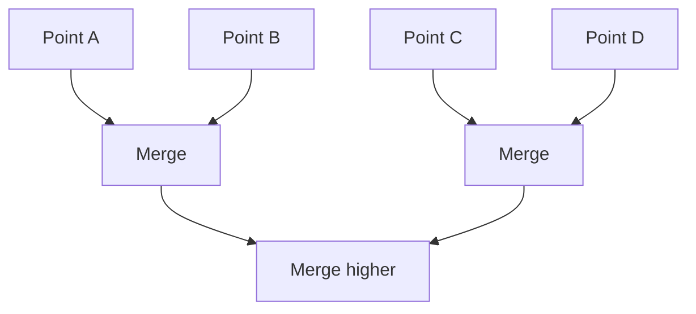

import DataCampExercise from "../../../../components/DataCampExercise.astro";

## What hierarchical clustering does

Hierarchical clustering creates a hierarchy (tree) of clusters. Unlike
K-Means, you never have to decide `k` up front — you build the whole tree
and decide where to "cut" it afterward.

Two main styles:

- **Agglomerative** (bottom-up): start with points, merge them
- **Divisive** (top-down): start with one cluster, split it

Think of many tiny soap bubbles floating on water and gradually sticking
together until there's one big cluster of bubbles. At each step,
agglomerative clustering connects the two nearest clusters (starting from
individual instances). Draw a branch for every merge and you get exactly the
binary tree structure shown below — a dendrogram.

## Dendrogram intuition

A dendrogram is a tree diagram showing merge/split steps.



## Linkage criteria

How we measure distance between clusters:

- single linkage (min distance)
- complete linkage (max distance)
- average linkage
- Ward linkage (common default in sklearn; minimizes variance)

## Scikit-learn example

```python title="AgglomerativeClustering" showLineNumbers{1}
import numpy as np
from sklearn.cluster import AgglomerativeClustering
from sklearn.datasets import make_blobs

X, _ = make_blobs(n_samples=60, centers=3, cluster_std=0.6, random_state=1)

hc = AgglomerativeClustering(n_clusters=3, linkage="ward")
labels = hc.fit_predict(X)

print("Cluster sizes:", np.bincount(labels))
```

:::tip[From the book]
Agglomerative clustering scales well to large numbers of instances *if* you
provide a **connectivity matrix** (e.g. from
`sklearn.neighbors.kneighbors_graph()`) telling it which points are
neighbors — without one, it doesn't scale nicely to big datasets. It can also
capture clusters of any shape, and it works with any pairwise distance
metric, not just Euclidean.
:::

## Pros and cons

Pros:

- no need to choose K in advance (you can cut the dendrogram later)
- can work with different distance metrics

Cons:

- can be slow on large datasets

## Visualize it

Watch a dendrogram grow from the bottom up: at each step, the two closest
clusters merge (drawn as a "goalpost" — two vertical lines joined by a
horizontal bar), and the process repeats until only one cluster is left.
Click to shuffle the points:

```p5 title="Agglomerative clustering builds a dendrogram" desc="Each step merges the two closest clusters, drawing the tree from the leaves up until only one cluster remains." height="300"
let leaves = [];
let merges = [];
let mergeStep = 0;
let t = 0;
const n = 8;
function reset() {
  leaves = [];
  const marginX = 50;
  const spread = (width - marginX * 2) / (n - 1);
  for (let i = 0; i < n; i++) {
    leaves.push({ x: marginX + i * spread + random(-8, 8), y: height - 30 });
  }
  merges = [];
  let active = leaves.map((l) => ({ x: l.x, y: l.y }));
  let curY = height - 30;
  const topY = 45;
  const step = (curY - topY) / (n - 1);
  while (active.length > 1) {
    let bi = 0, bj = 1, bd = Infinity;
    for (let i = 0; i < active.length; i++) {
      for (let j = i + 1; j < active.length; j++) {
        const d = Math.abs(active[i].x - active[j].x);
        if (d < bd) { bd = d; bi = i; bj = j; }
      }
    }
    curY -= step;
    const a = active[bi], b = active[bj];
    merges.push({ ax: a.x, ay: a.y, bx: b.x, by: b.y, y: curY });
    const merged = { x: (a.x + b.x) / 2, y: curY };
    active.splice(bj, 1);
    active.splice(bi, 1);
    active.push(merged);
  }
  mergeStep = 0;
  t = 0;
}
function setup() {
  createCanvas(600, 300);
  textFont("monospace");
  reset();
}
function draw() {
  background(13, 17, 23);
  for (let i = 0; i < mergeStep && i < merges.length; i++) {
    const m = merges[i];
    const isNewest = i === mergeStep - 1;
    if (isNewest) {
      const pulse = 150 + sin(t * 0.2) * 105;
      stroke(255, 211, 67, pulse);
      strokeWeight(3);
    } else {
      stroke(90, 150, 200);
      strokeWeight(2);
    }
    line(m.ax, m.ay, m.ax, m.y);
    line(m.bx, m.by, m.bx, m.y);
    line(m.ax, m.y, m.bx, m.y);
  }
  noStroke();
  fill(255, 211, 67);
  for (const l of leaves) ellipse(l.x, l.y, 8, 8);
  fill(150);
  textSize(12);
  textAlign(LEFT, CENTER);
  text("merge " + Math.min(mergeStep, merges.length) + " / " + merges.length, 12, 20);
  t++;
  if (t % 45 === 0 && mergeStep < merges.length) mergeStep++;
  if (mergeStep >= merges.length && t > merges.length * 45 + 90) reset();
}
function mousePressed() { reset(); }
```

## Cutting the tree without choosing k up front

Because agglomerative clustering builds the *whole* hierarchy, you can decide how many
clusters you want after the fact — either by asking for `n_clusters` directly, or by
cutting the dendrogram at a given merge distance with `distance_threshold`:

```python title="cut_by_distance.py" showLineNumbers{1}
import numpy as np
from sklearn.cluster import AgglomerativeClustering
from sklearn.datasets import make_blobs

X, _ = make_blobs(n_samples=60, centers=3, cluster_std=0.6, random_state=1)

# Instead of fixing k, cut the tree wherever merges start happening far apart
hc = AgglomerativeClustering(n_clusters=None, distance_threshold=10, linkage="ward")
labels = hc.fit_predict(X)
print("Clusters found by distance cut:", len(set(labels)))
```

```text title="Output"
Clusters found by distance cut: 3
```

Every fitted model also exposes the raw merge tree: `n_leaves_` (one leaf per original
instance) and `children_` (one row per merge). For `n` instances there are always
exactly `n - 1` merges — that's the full dendrogram, whether or not you ask
scikit-learn to cut it into clusters for you.

## Mini-checkpoint

Try Ward linkage and complete linkage and see how clusters differ.

## 🧪 Try It Yourself

### Exercise 1 – Fit Agglomerative Clustering

<DataCampExercise
  lang="python"
  hint={`\`AgglomerativeClustering(n_clusters=k).fit_predict(X)\` clusters and returns labels in one call, just like KMeans.`}
  code={`# Task: Exercise 1 – Fit Agglomerative Clustering
from sklearn.cluster import AgglomerativeClustering
from sklearn.datasets import make_blobs

X, _ = make_blobs(n_samples=60, centers=3, cluster_std=0.6, random_state=1)

hc = AgglomerativeClustering(n_clusters=3, linkage="ward")
labels = hc.___(X)   # replace ___ with fit_predict
print("Number of clusters:", len(set(labels)))

# ── Expected Output ───────────────────────────────────────────
# Number of clusters: 3
# ──────────────────────────────────────────────────────────────`}
  solution={`from sklearn.cluster import AgglomerativeClustering
from sklearn.datasets import make_blobs

X, _ = make_blobs(n_samples=60, centers=3, cluster_std=0.6, random_state=1)

hc = AgglomerativeClustering(n_clusters=3, linkage="ward")
labels = hc.fit_predict(X)
print("Number of clusters:", len(set(labels)))`}
  sct={`test_output_contains("Number of clusters: 3")
success_msg("AgglomerativeClustering found the 3 blobs!")`}
  height={158}
/>

### Exercise 2 – Cut the Dendrogram by Distance

<DataCampExercise
  lang="python"
  hint={`Set \`n_clusters=None\` and pass a \`distance_threshold\` instead — the tree gets cut wherever a merge happens above that distance.`}
  code={`# Task: Exercise 2 – Cut the Dendrogram by Distance
from sklearn.cluster import AgglomerativeClustering
from sklearn.datasets import make_blobs

X, _ = make_blobs(n_samples=60, centers=3, cluster_std=0.6, random_state=1)

hc = AgglomerativeClustering(n_clusters=None, distance_threshold=___, linkage="ward")   # replace ___ with 10
labels = hc.fit_predict(X)
print("Clusters found by distance cut:", len(set(labels)))

# ── Expected Output ───────────────────────────────────────────
# Clusters found by distance cut: 3
# ──────────────────────────────────────────────────────────────`}
  solution={`from sklearn.cluster import AgglomerativeClustering
from sklearn.datasets import make_blobs

X, _ = make_blobs(n_samples=60, centers=3, cluster_std=0.6, random_state=1)

hc = AgglomerativeClustering(n_clusters=None, distance_threshold=10, linkage="ward")
labels = hc.fit_predict(X)
print("Clusters found by distance cut:", len(set(labels)))`}
  sct={`test_output_contains("Clusters found by distance cut: 3")
success_msg("Cutting the dendrogram at distance 10 recovers the same 3 clusters!")`}
  height={168}
/>

### Exercise 3 – Every Merge Builds the Tree

<DataCampExercise
  lang="python"
  hint={`After fitting, \`children_\` has one row per merge. For n points there are always n - 1 merges.`}
  code={`# Task: Exercise 3 – Every Merge Builds the Tree
from sklearn.cluster import AgglomerativeClustering
from sklearn.datasets import make_blobs

X, _ = make_blobs(n_samples=60, centers=3, cluster_std=0.6, random_state=1)

hc = AgglomerativeClustering(n_clusters=3, linkage="ward")
hc.fit(X)

n_merges = hc.___.shape[0]   # replace ___ with children_
print("Merges equal n - 1:", n_merges == X.shape[0] - 1)

# ── Expected Output ───────────────────────────────────────────
# Merges equal n - 1: True
# ──────────────────────────────────────────────────────────────`}
  solution={`from sklearn.cluster import AgglomerativeClustering
from sklearn.datasets import make_blobs

X, _ = make_blobs(n_samples=60, centers=3, cluster_std=0.6, random_state=1)

hc = AgglomerativeClustering(n_clusters=3, linkage="ward")
hc.fit(X)

n_merges = hc.children_.shape[0]
print("Merges equal n - 1:", n_merges == X.shape[0] - 1)`}
  sct={`test_output_contains("Merges equal n - 1: True")
success_msg("Every one of the n-1 merges is recorded in children_ — that's the whole dendrogram!")`}
  height={168}
/>

## Next

Continue to **DBSCAN: Density-Based Clustering** — instead of merging everything into
one tree, DBSCAN groups by density and is happy to leave some points out as noise.
