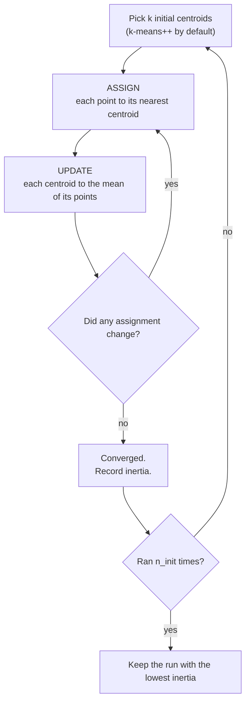

## What you'll learn

- the k-means objective, and why the two update steps fall out of it
- a **proof that Lloyd's algorithm terminates**, and why that does not mean it finds the best answer
- a full iteration worked by hand on six points
- why `n_init` exists, measured: inertia 302.46 versus 971.25 from one unlucky start
- the elbow and the silhouette, and which one actually answers "how many clusters?"
- three geometries where k-means fails, with adjusted Rand indices attached
- k-means++ , MiniBatchKMeans, and when each pays off

## Intuition

k-means answers one question: **if you had to replace every point with one of $k$ representative
points, which $k$ would lose the least information?**

Those representatives are the centroids. Once you have them, every point belongs to whichever is
nearest. Once you have the assignment, the best possible representative for a group is its mean.
Neither half can be solved without the other, so the algorithm alternates: fix the centroids and
reassign, fix the assignment and recompute the centroids. Repeat until nothing moves.

That is the entire algorithm. Everything else on this page is consequences of it.



## The math

Let $C_1, \dots, C_k$ partition the $n$ points and let $\boldsymbol\mu_j$ be the centroid of
$C_j$. k-means minimises the **within-cluster sum of squares**, which scikit-learn calls
*inertia*:

$$
J = \sum_{j=1}^{k} \sum_{\mathbf{x}_i \in C_j}
\lVert \mathbf{x}_i - \boldsymbol\mu_j \rVert^2
$$

Both update rules are the exact minimisers of $J$ with the other variable held fixed.

**The assignment step.** With the centroids fixed, $J$ is a sum of independent per-point terms.
Each is minimised by choosing the nearest centroid:

$$
c(i) = \arg\min_{j} \lVert \mathbf{x}_i - \boldsymbol\mu_j \rVert^2
$$

**The update step.** With the assignment fixed, differentiate the contribution of one cluster with
respect to its centroid:

$$
\frac{\partial}{\partial \boldsymbol\mu_j}
\sum_{\mathbf{x}_i \in C_j} \lVert \mathbf{x}_i - \boldsymbol\mu_j \rVert^2
= -2 \sum_{\mathbf{x}_i \in C_j} (\mathbf{x}_i - \boldsymbol\mu_j)
$$

Setting this to zero gives $\sum_{\mathbf{x}_i \in C_j} \mathbf{x}_i = |C_j| \boldsymbol\mu_j$,
so

$$
\boldsymbol\mu_j = \frac{1}{|C_j|} \sum_{\mathbf{x}_i \in C_j} \mathbf{x}_i
$$

The centroid is the mean. Not an approximation — the exact minimiser. This is also why k-means is
tied to squared Euclidean distance: swap in $L_1$ and the optimal representative becomes the
*median*, which is a different algorithm (k-medians).

### Why it always stops

Both steps are guaranteed not to increase $J$:

1. The assignment step moves points only to a centroid that is nearer or equally near, so every
   term in the sum weakly decreases.
2. The update step replaces each centroid with the exact minimiser for its cluster, so each
   cluster's contribution weakly decreases.

So $J$ is non-increasing. There are only finitely many ways to partition $n$ points into $k$
groups, and $J$ is determined by the partition. A non-increasing sequence over a finite set of
values that never revisits a partition must halt. **Lloyd's algorithm always terminates**,
typically in a handful of iterations.

It terminates at a *local* minimum. There is no guarantee it is the global one, and finding the
global optimum of $J$ is NP-hard even for $k = 2$. That gap is what `n_init` exists to paper over.

## Worked example by hand

Six one-dimensional points: $1, 2, 3, 10, 11, 12$. Take $k = 2$ and the deliberately awkward
initial centroids $\mu_1 = 2$, $\mu_2 = 4$.

**Iteration 1 — assign.** Compare $|x - 2|$ against $|x - 4|$:

| $x$ | to $\mu_1 = 2$ | to $\mu_2 = 4$ | goes to |
| --- | --- | --- | --- |
| 1 | 1 | 3 | $C_1$ |
| 2 | 0 | 2 | $C_1$ |
| 3 | 1 | 1 | $C_1$ (tie, lowest index) |
| 10 | 8 | 6 | $C_2$ |
| 11 | 9 | 7 | $C_2$ |
| 12 | 10 | 8 | $C_2$ |

**Iteration 1 — update.**

$$
\mu_1 = \frac{1 + 2 + 3}{3} = 2, \qquad
\mu_2 = \frac{10 + 11 + 12}{3} = 11
$$

**Iteration 2 — assign.** With centroids at 2 and 11, points $1, 2, 3$ are all nearer 2 (distances
1, 0, 1 against 10, 9, 8) and $10, 11, 12$ are all nearer 11. No assignment changed, so the
algorithm stops.

**Final inertia:**

$$
J = \underbrace{(1-2)^2 + (2-2)^2 + (3-2)^2}_{2}
  + \underbrace{(10-11)^2 + (11-11)^2 + (12-11)^2}_{2} = 4
$$

Now watch what a bad start does. Initialise at $\mu_1 = 1$, $\mu_2 = 2$ instead:

- Assign: $1 \to C_1$; everything else is nearer 2, so $2, 3, 10, 11, 12 \to C_2$.
- Update: $\mu_1 = 1$, $\mu_2 = (2+3+10+11+12)/5 = 7.6$.
- Assign: is 3 nearer 1 or 7.6? $|3-1| = 2$ against $|3-7.6| = 4.6$ — nearer 1. So
  $1, 2, 3 \to C_1$ and $10, 11, 12 \to C_2$.
- Update: back to $\mu_1 = 2$, $\mu_2 = 11$. Same answer, one iteration later.

This particular bad start recovers. Many do not, which is the next section.

<Figure
  src="/images/ml/phase-06-unsupervised/k-means-clustering-algorithm/lloyd-iterations"
  alt="Four scatter plots of the same three blobs. In the first, all three centroids sit off to one side and the colouring is wrong. By the third they have settled onto the blobs and the fourth is identical."
  title="Lloyd's algorithm from a deliberately bad start"
  caption="All three centroids started in the top-left corner. Inertia falls 3041.57 to 678.10 to 463.46 and then stops changing — the algorithm converged after 4 iterations, and every later iteration is a no-op."
/>

## See it move

```p5 title="Assign, update, repeat" desc="Squares are centroids, dots are points coloured by their current assignment. Each beat performs one assign-and-update pass; the inertia readout falls until it stops." height="300"
let pts = [];
let cents = [];
const K = 3;
let t = 0;
let stepIdx = 0;
let converged = false;
const STEP_FRAMES = 55;
const cols = [[75, 139, 190], [255, 211, 67], [120, 200, 120]];
function reset() {
  pts = [];
  for (let c = 0; c < K; c++) {
    const cx = random(90, width - 90), cy = random(70, height - 70);
    for (let i = 0; i < 18; i++) pts.push({ x: cx + random(-46, 46), y: cy + random(-46, 46), c: 0 });
  }
  cents = [];
  for (let c = 0; c < K; c++) {
    const x = random(80, width - 80), y = random(60, height - 60);
    cents.push({ x, y, tx: x, ty: y });
  }
  t = 0;
  stepIdx = 0;
  converged = false;
}
function setup() {
  createCanvas(600, 300);
  textFont("monospace");
  reset();
}
function draw() {
  background(13, 17, 23);
  for (const p of pts) {
    let bd = 1e9, bc = 0;
    for (let c = 0; c < K; c++) {
      const d = (p.x - cents[c].x) ** 2 + (p.y - cents[c].y) ** 2;
      if (d < bd) { bd = d; bc = c; }
    }
    p.c = bc;
  }
  let inertia = 0;
  for (const p of pts) {
    const c = cents[p.c];
    inertia += (p.x - c.x) ** 2 + (p.y - c.y) ** 2;
  }
  noStroke();
  for (const p of pts) {
    const col = cols[p.c];
    fill(col[0], col[1], col[2], 200);
    ellipse(p.x, p.y, 10, 10);
  }
  for (let c = 0; c < K; c++) {
    cents[c].x = lerp(cents[c].x, cents[c].tx, 0.08);
    cents[c].y = lerp(cents[c].y, cents[c].ty, 0.08);
    const col = cols[c];
    stroke(255);
    strokeWeight(2);
    fill(col[0], col[1], col[2]);
    rect(cents[c].x - 9, cents[c].y - 9, 18, 18, 3);
  }
  noStroke();
  fill(150);
  textSize(12);
  textAlign(LEFT, CENTER);
  text("step " + stepIdx + "   inertia " + Math.round(inertia), 12, 20);
  if (converged) {
    fill(255, 211, 67);
    text("converged!", 12, 38);
  }
  t++;
  if (!converged && t % STEP_FRAMES === 0) {
    let maxShift = 0;
    for (let c = 0; c < K; c++) {
      let sx = 0, sy = 0, n = 0;
      for (const p of pts) if (p.c === c) { sx += p.x; sy += p.y; n++; }
      if (n) {
        const nx = sx / n, ny = sy / n;
        maxShift = Math.max(maxShift, dist(nx, ny, cents[c].tx, cents[c].ty));
        cents[c].tx = nx;
        cents[c].ty = ny;
      }
    }
    stepIdx++;
    if (maxShift < 1.5 && stepIdx > 1) converged = true;
  }
  if (converged && t > stepIdx * STEP_FRAMES + 110) reset();
  if (!converged && stepIdx > 14) reset();
}
function mousePressed() { reset(); }
```

## Initialisation is not a detail

Run k-means on five well-separated blobs with a single random start and you get a different answer
depending on nothing but the seed:

| Initialisation | Inertia |
| --- | --- |
| `init="random"`, `n_init=1`, seed 5 | **302.46** |
| `init="random"`, `n_init=1`, seed 9 | **971.25** |
| `init="k-means++"`, `n_init=10` | **302.46** |

The seed-9 run is over three times worse. Look at what happened: two centroids landed inside the
same blob and split it, leaving two genuine blobs merged into one cluster. Both steps of the
algorithm behave perfectly; there is simply no single-point reassignment that escapes.

<Figure
  src="/images/ml/phase-06-unsupervised/k-means-clustering-algorithm/init-matters"
  alt="Three panels of five blobs. The first and third correctly assign one centroid per blob. The middle panel has two centroids sharing one blob and one centroid covering two blobs."
  title="One unlucky start, three times the inertia"
  caption="Middle panel: two centroids split a single blob while another cluster swallows two. Inertia 971.25 against 302.46 for the good runs. n_init=10 keeps the best of ten tries and finds the good answer every time."
/>

### k-means++

Rather than sampling initial centroids uniformly, **k-means++** spreads them out:

1. Choose the first centroid uniformly at random from the data.
2. For each remaining point $\mathbf{x}$, compute $D(\mathbf{x})$, the distance to the nearest
   centroid already chosen.
3. Choose the next centroid from the data with probability proportional to $D(\mathbf{x})^2$.
4. Repeat until $k$ centroids are chosen.

The squared weighting makes far-away points overwhelmingly likely to be picked, so the seeds tend
to land one per blob. The theoretical guarantee is that the expected inertia is within
$O(\log k)$ of the global optimum — before a single Lloyd iteration runs.

This is scikit-learn's default, and `n_init` defaults to `"auto"` (1 for `k-means++`, 10 for
`"random"`). If you are doing anything that matters, set `n_init=10` explicitly.

## Choosing k

Inertia cannot choose $k$ for you. It falls monotonically — with $k = n$ every point is its own
centroid and $J = 0$. Here is that fall, on 400 points containing 4 genuine blobs:

| $k$ | Inertia | Silhouette |
| --- | --- | --- |
| 1 | 16534.68 | — |
| 2 | 6850.11 | 0.5723 |
| 3 | 1842.91 | 0.7329 |
| **4** | **646.92** | **0.7475** |
| 5 | 584.31 | 0.6277 |
| 6 | 526.73 | 0.5359 |
| 7 | 474.91 | 0.4494 |
| 8 | 424.39 | 0.3214 |
| 9 | 373.48 | 0.3394 |
| 10 | 341.73 | 0.3511 |

The **elbow method** looks for the kink where the marginal improvement collapses. From $k = 3$ to
$k = 4$ inertia drops by 1196; from 4 to 5 it drops by 63. That is the elbow, and it points at 4.

The **silhouette** has an actual maximum at 0.7475, also at $k = 4$. When the two agree, you are
done. When they disagree, trust the silhouette — the elbow is a judgement call about the shape of a
curve, while the silhouette is a number you can argmax.

<Figure
  src="/images/ml/phase-06-unsupervised/k-means-clustering-algorithm/elbow-and-silhouette"
  alt="Two line plots. The left shows inertia falling steeply then flattening after k equals 4. The right shows the mean silhouette rising to a peak at k equals 4 then falling."
  title="Inertia never rises; the silhouette peaks"
  caption="Inertia keeps improving forever, which is why you cannot argmin it. The silhouette peaks at k = 4 with 0.7475, circled. Both agree here on 400 points containing 4 real blobs."
/>

Neither is authoritative. On real data the curve is often smooth with no elbow at all, and the
silhouette peaks at $k = 2$ because two coarse groups always look cleanly separated. When that
happens, **the domain decides**: how many customer segments can your marketing team actually
operate?

## Straight-edged cells

Because assignment compares squared distances to centroids, the boundary between two clusters is
the set of points equidistant from both — a straight line, and in higher dimensions a hyperplane:
the perpendicular bisector of the segment joining them. The partition of space is a **Voronoi
diagram**.

<Figure
  src="/images/ml/phase-06-unsupervised/k-means-clustering-algorithm/voronoi-boundaries"
  alt="A scatter plot of four blobs with the plane shaded into four regions separated by straight lines meeting at junction points."
  title="k-means partitions the entire plane"
  caption="Every boundary is straight, because it is the set of points equally distant from two centroids. This is why k-means cannot produce a curved or concave cluster — the shape of the region is fixed by the geometry, not learned from the data."
/>

This single geometric fact explains every k-means failure in the next section.

## Where it fails

<Figure
  src="/images/ml/phase-06-unsupervised/k-means-clustering-algorithm/where-kmeans-fails"
  alt="A two by three grid. The top row shows the true groups for sheared blobs, blobs of different spread, and uniform noise. The bottom row shows what k-means returns for each, with adjusted Rand indices of 0.587, 0.803 and 0.000."
  title="Three geometries, three failures"
  caption="Sheared clusters: k-means cuts across the diagonal bands rather than along them (ARI 0.587). Different spreads: the wide cluster gets carved up and donates points to its tight neighbours (ARI 0.803). Uniform noise: there is nothing there, and k-means confidently returns three groups anyway (ARI 0.000, silhouette 0.378)."
/>

| Failure | Why | What to use instead |
| --- | --- | --- |
| Sheared / elongated clusters | Voronoi cells are isotropic; a stretched cluster costs less to cut across than along | Gaussian mixture with `covariance_type="full"` |
| Very different spreads | Squared distance charges the wide cluster more, so it loses points to tight neighbours | Gaussian mixture, or DBSCAN if densities differ enough |
| Non-convex shapes (moons, rings) | Straight boundaries cannot bend | [DBSCAN](/machine-learning/phase-06---unsupervised-learning--dimensionality-reduction/dbscan-density-based-clustering/), spectral clustering |
| No structure at all | Nothing in the algorithm can say "there are no clusters" | Compare the silhouette against a shuffled null |
| Outliers | The mean is not robust; one distant point drags a centroid | k-medoids, or remove outliers first |

The uniform-noise case deserves emphasis. Silhouette 0.378 is not obviously bad — you would
plausibly ship that. The defence is to compare against a null: shuffle each column independently
(destroying the joint structure but preserving the marginals), cluster the shuffled data, and check
that your real silhouette is meaningfully higher.

## In code

```python title="kmeans_basics.py" showLineNumbers{1}
import numpy as np
from sklearn.cluster import KMeans
from sklearn.datasets import make_blobs

X, _ = make_blobs(n_samples=280, centers=3, cluster_std=0.95, random_state=4)

km = KMeans(n_clusters=3, n_init=10, random_state=0).fit(X)

print("inertia   ", round(km.inertia_, 4))
print("iterations", km.n_iter_)
print("centroids\n", km.cluster_centers_.round(3))
print("labels (first 10)", km.labels_[:10])

# The only clustering estimator in this phase that can label unseen points.
print("new point ->", km.predict([[0.0, 0.0]]))

# transform() returns distance to every centroid — often more useful than the label
print("distances ->", km.transform([[0.0, 0.0]]).round(3))
```

```python title="choosing_k.py" showLineNumbers{1}
from sklearn.cluster import KMeans
from sklearn.datasets import make_blobs
from sklearn.metrics import silhouette_score

X, _ = make_blobs(n_samples=400, centers=4, cluster_std=0.9, random_state=11)

for k in range(1, 11):
    km = KMeans(n_clusters=k, n_init=10, random_state=0).fit(X)
    sil = silhouette_score(X, km.labels_) if k > 1 else float("nan")
    print(f"k={k:2d}  inertia {km.inertia_:9.2f}  silhouette {sil:.4f}")

# k= 1  inertia  16534.68  silhouette nan
# k= 2  inertia   6850.11  silhouette 0.5723
# k= 3  inertia   1842.91  silhouette 0.7329
# k= 4  inertia    646.92  silhouette 0.7475   <- both agree
# k= 5  inertia    584.31  silhouette 0.6277
```

### MiniBatchKMeans

Full k-means touches every point on every iteration. `MiniBatchKMeans` samples a small batch each
step and nudges the affected centroids toward it, which turns the per-iteration cost from $O(n)$
into $O(b)$ for batch size $b$.

The price is a slightly worse optimum. On 100,000 points in 8 blobs, MiniBatch's inertia came out
**0.04% higher** than full k-means; at 500,000 points, **0.01% higher**. That is nothing. Use it
whenever $n$ is large enough that full k-means is inconvenient.

```python title="minibatch.py" showLineNumbers{1}
from sklearn.cluster import KMeans, MiniBatchKMeans
from sklearn.datasets import make_blobs

X, _ = make_blobs(n_samples=100_000, centers=8, cluster_std=1.0, random_state=0)

full = KMeans(n_clusters=8, n_init=3, random_state=0).fit(X)
mini = MiniBatchKMeans(n_clusters=8, n_init=3, batch_size=1024, random_state=0).fit(X)

print("full     ", round(full.inertia_, 1))            # 179598.7
print("minibatch", round(mini.inertia_, 1))            # 179671.3
print(f"penalty   {100 * (mini.inertia_ / full.inertia_ - 1):.2f}%")   # 0.04%
```

Wall-clock timings vary far too much with thread count and BLAS build to quote a speedup you can
rely on. The algorithmic claim is the durable one: each MiniBatch iteration reads `batch_size`
rows instead of all $n$.

<AlgorithmCard
  name="K-Means (Lloyd's algorithm)"
  type="Unsupervised — partitional clustering"
  sklearn="sklearn.cluster.KMeans"
  assumptions={[
    "Clusters are convex and roughly spherical",
    "Clusters have comparable spread",
    "Clusters have comparable numbers of points",
    "Squared Euclidean distance is the right notion of similarity",
    "You know k, or can defend a choice of it",
  ]}
  complexity={{
    train: "O(n k p i) per run, times n_init runs",
    predict: "O(k p) per point",
    memory: "O(n p + k p)",
  }}
  hyperparams={[
    { name: "n_clusters", default: "8", effect: "The whole answer. Choose with the silhouette, the elbow, or the domain." },
    { name: "init", default: "'k-means++'", effect: "Spreads the seeds out. Expected inertia within O(log k) of optimal before iterating." },
    { name: "n_init", default: "'auto' (1 for k-means++)", effect: "Restarts. Set to 10 for anything that matters: 302.46 vs 971.25 on this page's data." },
    { name: "max_iter", default: "300", effect: "Rarely binds — convergence usually takes under 20 iterations." },
    { name: "tol", default: "1e-4", effect: "Stops when the centroid shift falls below this. Loosen for speed on huge data." },
    { name: "algorithm", default: "'lloyd'", effect: "'elkan' uses the triangle inequality to skip distance computations; faster on well-separated data." },
  ]}
  useWhen={[
    "Clusters are blob-shaped and you roughly know how many",
    "You need to label new points later (k-means can; DBSCAN cannot)",
    "n is large — this is the most scalable clustering algorithm in the phase",
    "You want centroids as an interpretable summary of each group",
  ]}
  avoidWhen={[
    "Clusters are elongated, nested, or ring-shaped",
    "Cluster sizes or densities differ a lot",
    "The data has outliers you have not handled",
    "You cannot justify any particular k",
  ]}
  notation="J — inertia (within-cluster sum of squares); mu_j — centroid of cluster j; C_j — the points assigned to j"
/>

## Pitfalls

**Leaving `n_init` at the default.** Measured above: 971.25 against 302.46, on well-separated
blobs. On messier data the gap is worse. `n_init=10` costs ten times the compute of a sub-second
fit.

**Arg-minimising inertia over k.** Inertia is monotonically decreasing in $k$; the argmin is always
$k = n$. Use it for the elbow's *shape*, never for its minimum.

**Not scaling.** Covered on the
[previous page](/machine-learning/phase-06---unsupervised-learning--dimensionality-reduction/introduction-to-clustering/):
one `StandardScaler` moved ARI from 0.035 to 0.891.

**Trusting cluster indices across runs.** Cluster 0 changes identity with `random_state`. If you
persist labels, persist the centroids and re-derive.

**Applying k-means to one-hot encoded categoricals.** The mean of a set of one-hot vectors is a
vector of proportions, which is not a valid category. Use k-modes, or embed first.

**Believing the clusters are real.** k-means returns exactly $k$ groups from uniform noise, with a
silhouette of 0.378. Always compare against a shuffled null.

**Forgetting outliers move centroids.** One point at distance 100 contributes 10,000 to the
objective and will visibly drag its centroid. Handle outliers before clustering, or run a
[robust detector](/machine-learning/phase-06---unsupervised-learning--dimensionality-reduction/anomaly-detection-with-isolation-forests/)
first.

## Compare

| | k-means | k-medoids | Gaussian mixture | MiniBatchKMeans |
| --- | --- | --- | --- | --- |
| Representative | mean | an actual data point | mean + covariance | mean |
| Distance | squared Euclidean | any metric | Mahalanobis | squared Euclidean |
| Cluster shape | spherical | metric-dependent | **ellipsoidal** | spherical |
| Robust to outliers | no | **yes** | no | no |
| Soft assignment | no | no | **yes** | no |
| Cost per iteration | $O(nkp)$ | $O(n^2)$ | $O(nkp^2)$ | $O(bkp)$ |
| Scales to millions | yes | no | moderate | **yes** |

<Quiz
  questions={[
    {
      q: "Why is the centroid update step the MEAN of the assigned points, rather than the median?",
      options: [
        "The mean is easier to compute",
        "Because the objective is a sum of SQUARED distances, and the mean is its exact minimiser",
        "Convention inherited from k-nearest-neighbours",
        "The median would not converge",
      ],
      answer: 1,
      explain: "Differentiating the sum of squared distances with respect to the centroid and setting the derivative to zero gives exactly the mean. If the objective used absolute distances instead, the minimiser would be the median — that algorithm is k-medians.",
    },
    {
      q: "Lloyd's algorithm is guaranteed to terminate. What is it NOT guaranteed to do?",
      options: [
        "Reduce inertia at each step",
        "Find the global minimum of the inertia",
        "Assign every point to some cluster",
        "Produce exactly k clusters",
      ],
      answer: 1,
      explain: "Both steps weakly decrease inertia and there are finitely many partitions, so it halts. But it halts at a local minimum — finding the global one is NP-hard even for k=2. That is what n_init is for.",
    },
    {
      q: "You plot inertia against k and it falls smoothly with no visible elbow. What now?",
      options: [
        "Take the k with the lowest inertia",
        "Check the silhouette, and if that is also flat let the domain decide",
        "Increase max_iter",
        "The data cannot be clustered",
      ],
      answer: 1,
      explain: "Inertia's minimum is always k=n, so its argmin is useless. The silhouette has a genuine maximum, and when even that is flat the honest answer is that the data has no strong k — pick the number your downstream process can actually use.",
    },
    {
      q: "Why can k-means never produce a crescent-shaped cluster?",
      options: [
        "Because of the random initialisation",
        "Because assignment is by distance to a centroid, so every boundary is a straight perpendicular bisector",
        "Because inertia is a sum of squares",
        "It can, given enough iterations",
      ],
      answer: 1,
      explain: "The set of points equidistant from two centroids is a hyperplane. The partition is therefore a Voronoi diagram with straight edges, and no amount of iteration bends them. Density-based methods have no such constraint.",
    },
    {
      q: "MiniBatchKMeans on 100,000 points gave inertia 0.04% higher than full k-means. What does that tell you?",
      options: [
        "MiniBatch is broken",
        "The approximation cost is negligible, so use it whenever n makes full k-means inconvenient",
        "MiniBatch found a better optimum",
        "The data was too easy to cluster",
      ],
      answer: 1,
      explain: "A 0.04% inertia penalty is far below the run-to-run variation you get from different seeds. Each MiniBatch iteration reads batch_size rows instead of all n, so its cost per iteration does not grow with the dataset.",
    },
  ]}
/>

## 🧪 Try It Yourself

### Exercise 1 – One iteration by hand, in code

<DataCampExercise
  lang="python"
  hint={`np.abs(x[:, None] - mu[None, :]) gives every point-to-centroid distance; argmin along axis 1 picks the nearest.`}
  code={`# Task: Exercise 1 - One iteration by hand, in code
import numpy as np

x = np.array([1.0, 2.0, 3.0, 10.0, 11.0, 12.0])
mu = np.array([2.0, 4.0])

d = np.abs(x[:, None] - mu[None, :])
assign = d.___(axis=1)                        # replace ___ with argmin
print("assignment", assign)

new_mu = np.array([x[assign == j].mean() for j in (0, 1)])
print("new centroids", new_mu)

inertia = ((x - new_mu[assign]) ** 2).sum()
print("inertia", inertia)

# -- Expected Output -------------------------------------------
# assignment [0 0 0 1 1 1]
# new centroids [ 2. 11.]
# inertia 4.0
# --------------------------------------------------------------`}
  solution={`import numpy as np

x = np.array([1.0, 2.0, 3.0, 10.0, 11.0, 12.0])
mu = np.array([2.0, 4.0])
d = np.abs(x[:, None] - mu[None, :])
assign = d.argmin(axis=1)
print("assignment", assign)
new_mu = np.array([x[assign == j].mean() for j in (0, 1)])
print("new centroids", new_mu)
inertia = ((x - new_mu[assign]) ** 2).sum()
print("inertia", inertia)`}
  sct={`test_output_contains("inertia 4.0")
success_msg("Matches the hand calculation: centroids at 2 and 11, inertia 4.")`}
  height={240}
/>

### Exercise 2 – Prove the mean minimises the objective

<DataCampExercise
  lang="python"
  hint={`Sweep candidate centroids across a range and find which one gives the smallest sum of squared distances.`}
  code={`# Task: Exercise 2 - Prove the mean minimises the objective
import numpy as np

pts = np.array([2.0, 5.0, 6.0, 11.0])
candidates = np.linspace(0, 15, 3001)

sse = ((pts[None, :] - candidates[:, None]) ** 2).sum(axis=1)
best = candidates[sse.___()]                  # replace ___ with argmin

print("best centroid by search", round(best, 4))
print("arithmetic mean        ", pts.mean())
print("median (for contrast)  ", np.median(pts))

# -- Expected Output -------------------------------------------
# best centroid by search 6.0
# arithmetic mean         6.0
# median (for contrast)   5.5
# --------------------------------------------------------------`}
  solution={`import numpy as np

pts = np.array([2.0, 5.0, 6.0, 11.0])
candidates = np.linspace(0, 15, 3001)
sse = ((pts[None, :] - candidates[:, None]) ** 2).sum(axis=1)
best = candidates[sse.argmin()]
print("best centroid by search", round(best, 4))
print("arithmetic mean        ", pts.mean())
print("median (for contrast)  ", np.median(pts))`}
  sct={`test_output_contains("arithmetic mean         6.0")
success_msg("Brute-force search lands exactly on the mean — the derivation, verified.")`}
  height={240}
/>

### Exercise 3 – What one bad seed costs

<DataCampExercise
  lang="python"
  hint={`Pass init="random" with n_init=1 and vary random_state.`}
  code={`# Task: Exercise 3 - What one bad seed costs
from sklearn.cluster import KMeans
from sklearn.datasets import make_blobs

X, _ = make_blobs(n_samples=300, centers=5, cluster_std=0.7, random_state=3)

for seed in (5, 9):
    km = KMeans(n_clusters=5, init="random", n_init=___, random_state=seed).fit(X)
    print(f"random seed {seed}: inertia {km.inertia_:.4f}")   # replace ___ with 1

best = KMeans(n_clusters=5, init="k-means++", n_init=10, random_state=0).fit(X)
print(f"k-means++ n_init=10: inertia {best.inertia_:.4f}")

# -- Expected Output -------------------------------------------
# random seed 5: inertia 302.4622
# random seed 9: inertia 971.2504
# k-means++ n_init=10: inertia 302.4622
# --------------------------------------------------------------`}
  solution={`from sklearn.cluster import KMeans
from sklearn.datasets import make_blobs

X, _ = make_blobs(n_samples=300, centers=5, cluster_std=0.7, random_state=3)
for seed in (5, 9):
    km = KMeans(n_clusters=5, init="random", n_init=1, random_state=seed).fit(X)
    print(f"random seed {seed}: inertia {km.inertia_:.4f}")
best = KMeans(n_clusters=5, init="k-means++", n_init=10, random_state=0).fit(X)
print(f"k-means++ n_init=10: inertia {best.inertia_:.4f}")`}
  sct={`test_output_contains("971.2504")
success_msg("Three times the inertia from nothing but a different seed. Set n_init.")`}
  height={240}
/>

### Exercise 4 – Confidently clustering pure noise

<DataCampExercise
  lang="python"
  hint={`Uniform random points have no clusters, but silhouette_score will still return a positive number.`}
  code={`# Task: Exercise 4 - Confidently clustering pure noise
import numpy as np
from sklearn.cluster import KMeans
from sklearn.metrics import adjusted_rand_score, silhouette_score

rng = np.random.default_rng(0)
X = rng.uniform(-4, 4, size=(600, 2))         # no structure whatsoever
truth = np.zeros(600)

km = KMeans(n_clusters=3, n_init=10, random_state=0).fit(X)
print("clusters returned", len(set(km.labels_)))
print("silhouette", round(silhouette_score(X, km.___), 4))   # replace ___ with labels_
print("ARI vs truth", round(adjusted_rand_score(truth, km.labels_), 4))

# -- Expected Output -------------------------------------------
# clusters returned 3
# silhouette 0.3775
# ARI vs truth 0.0
# --------------------------------------------------------------`}
  solution={`import numpy as np
from sklearn.cluster import KMeans
from sklearn.metrics import adjusted_rand_score, silhouette_score

rng = np.random.default_rng(0)
X = rng.uniform(-4, 4, size=(600, 2))
truth = np.zeros(600)
km = KMeans(n_clusters=3, n_init=10, random_state=0).fit(X)
print("clusters returned", len(set(km.labels_)))
print("silhouette", round(silhouette_score(X, km.labels_), 4))
print("ARI vs truth", round(adjusted_rand_score(truth, km.labels_), 4))`}
  sct={`test_output_contains("silhouette 0.3775")
success_msg("A respectable-looking 0.378 from data with no structure at all. Always compare against a null.")`}
  height={240}
/>

### Exercise 5 – Sheared clusters break it

<DataCampExercise
  lang="python"
  hint={`The @ operator does matrix multiplication, applying the shear to every row.`}
  code={`# Task: Exercise 5 - Sheared clusters break it
import numpy as np
from sklearn.cluster import KMeans
from sklearn.datasets import make_blobs
from sklearn.metrics import adjusted_rand_score

X, y = make_blobs(n_samples=600, centers=3, random_state=170)
shear = np.array([[0.60834549, -0.63667341], [-0.40887718, 0.85253229]])
X_sheared = X ___ shear                       # replace ___ with @

for name, data in (("round  ", X), ("sheared", X_sheared)):
    lab = KMeans(n_clusters=3, n_init=10, random_state=0).fit_predict(data)
    print(f"{name}: ARI {adjusted_rand_score(y, lab):.4f}")

# -- Expected Output -------------------------------------------
# round  : ARI 1.0000
# sheared: ARI 0.5867
# --------------------------------------------------------------`}
  solution={`import numpy as np
from sklearn.cluster import KMeans
from sklearn.datasets import make_blobs
from sklearn.metrics import adjusted_rand_score

X, y = make_blobs(n_samples=600, centers=3, random_state=170)
shear = np.array([[0.60834549, -0.63667341], [-0.40887718, 0.85253229]])
X_sheared = X @ shear
for name, data in (("round  ", X), ("sheared", X_sheared)):
    lab = KMeans(n_clusters=3, n_init=10, random_state=0).fit_predict(data)
    print(f"{name}: ARI {adjusted_rand_score(y, lab):.4f}")`}
  sct={`test_output_contains("sheared: ARI 0.5867")
success_msg("A linear transform of the SAME points halves the score. Straight Voronoi boundaries cannot follow a diagonal band.")`}
  height={240}
/>

## Recap

- k-means minimises the within-cluster sum of squares; assignment and mean-update are the exact
  minimisers of that objective with the other variable held fixed.
- It always terminates — non-increasing objective, finitely many partitions — but only at a local
  minimum.
- The worked example converged to centroids 2 and 11 with inertia 4 in two iterations.
- Initialisation matters enormously: **971.25 versus 302.46** from nothing but a different seed.
  Set `n_init=10`.
- Inertia cannot pick $k$ (it is monotone in $k$). The silhouette can: it peaked at 0.7475 for
  $k = 4$.
- Boundaries are straight perpendicular bisectors, so sheared (ARI 0.587) and unequal-spread
  (ARI 0.803) geometries break it — and pure noise still yields three confident clusters.
- MiniBatchKMeans costs 0.04% inertia at 100k points and reads a fixed batch per iteration.

### Exercise 6 – Measure the seed lottery

<DataCampExercise
  lang="python"
  hint={`n_init=1 with init="random" runs the algorithm once from a random start. Compare the spread of inertia across seeds against the n_init=10 result.`}
  code={`# Task: Exercise 6 - Measure the seed lottery
import numpy as np
from sklearn.cluster import KMeans
from sklearn.datasets import make_blobs

X_blobs, _ = make_blobs(n_samples=300, centers=4, cluster_std=1.6,
                        random_state=7)
results = []
for seed in range(20):
    model = KMeans(n_clusters=4, n_init=1, init="random",
                   random_state=seed).fit(X_blobs)
    results.append(model.___)                    # replace ___ with inertia_
results = np.array(results)
print(f"n_init=1, 20 seeds: best {results.min():.2f}  worst {results.max():.2f}"
      f"  spread {results.max() - results.min():.2f}")
good = KMeans(n_clusters=4, n_init=10, random_state=0).fit(X_blobs)
print(f"n_init=10:          {good.inertia_:.2f}")
print(f"share of single runs that beat n_init=10: "
      f"{np.mean(results <= good.inertia_ + 1e-9):.2f}")

# -- Expected Output -------------------------------------------
# n_init=1, 20 seeds: best 1460.09  worst 7723.83  spread 6263.74
# n_init=10:          1460.09
# share of single runs that beat n_init=10: 0.30
# --------------------------------------------------------------`}
  solution={`import numpy as np
from sklearn.cluster import KMeans
from sklearn.datasets import make_blobs

X_blobs, _ = make_blobs(n_samples=300, centers=4, cluster_std=1.6,
                        random_state=7)
results = []
for seed in range(20):
    model = KMeans(n_clusters=4, n_init=1, init="random",
                   random_state=seed).fit(X_blobs)
    results.append(model.inertia_)
results = np.array(results)
print(f"n_init=1, 20 seeds: best {results.min():.2f}  worst {results.max():.2f}"
      f"  spread {results.max() - results.min():.2f}")
good = KMeans(n_clusters=4, n_init=10, random_state=0).fit(X_blobs)
print(f"n_init=10:          {good.inertia_:.2f}")
print(f"share of single runs that beat n_init=10: "
      f"{np.mean(results <= good.inertia_ + 1e-9):.2f}")`}
  sct={`test_output_contains("spread 6263.74")
success_msg("A single random start returns anything from 1460 to 7724 — a factor of 5.3 in inertia, on data with four obvious blobs. Only 30% of single runs find the best solution, which is why n_init exists and why lowering it to save time is usually a false economy.")`}
  height={290}
/>

## Next

[Hierarchical Clustering (Dendrograms)](/machine-learning/phase-06---unsupervised-learning--dimensionality-reduction/hierarchical-clustering-dendrograms/)
— a method that does not need $k$ up front, builds the whole nesting of clusters at once, and lets
you choose the cut afterwards.
