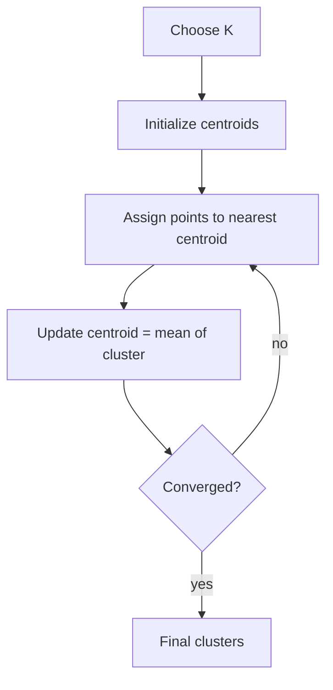

## K-means in one sentence

K-means partitions data into **K clusters** by minimizing within-cluster variance.

## The algorithm (intuition)

1. choose K
2. initialize K centroids
3. assign each point to nearest centroid
4. recompute centroids as the mean of assigned points
5. repeat until convergence



## What K-means assumes

K-means works best when clusters are:

- roughly spherical (ball-shaped)
- similar size
- separable by distance

It struggles when clusters are:

- non-spherical
- different densities
- contain lots of outliers

## Measuring quality: inertia

K-Means minimizes **inertia** — the mean squared distance between each
instance and its closest centroid. Lower inertia means tighter clusters, but
inertia alone can't tell you how many clusters (`k`) to use: it keeps getting
smaller as `k` grows, even when you're carving a perfectly good cluster into
useless slivers.

## Choosing k: the elbow method and the silhouette score

Two ways to pick `k`:

- **Elbow method** — plot inertia against `k`. Inertia drops fast at first,
  then flattens out; the "elbow" of that curve is usually a good `k`.
- **Silhouette score** — for each instance, compare `a` (mean distance to its
  own cluster) and `b` (mean distance to the *next closest* cluster):
  `(b - a) / max(a, b)`. Values near `+1` mean a great fit, near `0` mean the
  instance sits on a cluster boundary, and negative values mean it's probably
  in the wrong cluster.

```python title="Choosing k with inertia and silhouette score" showLineNumbers{1}
from sklearn.datasets import make_blobs
from sklearn.cluster import KMeans
from sklearn.metrics import silhouette_score

X, _ = make_blobs(n_samples=500, centers=5, cluster_std=0.7, random_state=42)

for k in range(2, 8):
    km = KMeans(n_clusters=k, n_init=10, random_state=42).fit(X)
    sil = silhouette_score(X, km.labels_)
    print(f"k={k}: inertia={km.inertia_:.1f}, silhouette={sil:.3f}")
```

:::tip[From the book]
K-Means was proposed by Stuart Lloyd in 1957 and is sometimes called
Lloyd–Forgy. Scikit-Learn's `KMeans` actually uses the smarter
**K-Means++** initialization by default — it picks starting centroids that
are far from one another, which makes bad random starts far less likely and
means you need fewer restarts (`n_init`) to find a good solution. For huge
datasets, `MiniBatchKMeans` moves centroids using small random batches
instead of the whole dataset each step — typically 3–4× faster, at the cost
of slightly higher inertia.
:::

## Scikit-learn example

```python title="KMeans" showLineNumbers{1}
from sklearn.cluster import KMeans
from sklearn.preprocessing import StandardScaler
from sklearn.pipeline import Pipeline

kmeans = Pipeline(
    steps=[
        ("scaler", StandardScaler()),
        ("model", KMeans(n_clusters=3, n_init=10, random_state=42)),
    ]
)
```

## Scaling up: MiniBatchKMeans

When a dataset is too big to comfortably re-scan every centroid update, `MiniBatchKMeans`
updates centroids using small random batches instead of the whole dataset each step:

```python title="minibatch_kmeans.py" showLineNumbers{1}
from sklearn.cluster import MiniBatchKMeans, KMeans
from sklearn.datasets import make_blobs

X, _ = make_blobs(n_samples=5000, centers=6, cluster_std=0.7, random_state=42)

km = KMeans(n_clusters=6, n_init=10, random_state=42).fit(X)
mbk = MiniBatchKMeans(n_clusters=6, n_init=10, random_state=42, batch_size=256).fit(X)

print(f"KMeans inertia:          {km.inertia_:.1f}")
print(f"MiniBatchKMeans inertia: {mbk.inertia_:.1f}")
```

```text title="Output"
KMeans inertia:          4774.3
MiniBatchKMeans inertia: 4789.1
```

Notice the inertia is barely worse — but on a large dataset `MiniBatchKMeans` runs
several times faster because it never needs the whole dataset in memory at once for a
single centroid update.

## Mini-checkpoint

K-means always assigns every point to a cluster.

- If you have outliers, what happens?

(Outliers still get assigned and can distort centroids.)

## Visualize it

K-means repeats two steps until things stop moving: **assign** every point to its nearest
centroid (colouring it), then **move** each centroid to the average position of the points
that chose it. Watch the squares (centroids) drift into the middle of their clusters — click
to scatter fresh data:

```p5 title="K-means finds clusters" desc="Assign each point to the nearest centroid, then glide each centroid to the mean of its points — repeat until the shift is tiny and inertia stops shrinking." height="300"
let pts = [];
let cents = [];
const K = 3;
let t = 0;
let stepIdx = 0;
let converged = false;
const STEP_FRAMES = 55;
const cols = [[75, 139, 190], [255, 211, 67], [120, 200, 120]];
function reset() {
  pts = [];
  for (let c = 0; c < K; c++) {
    const cx = random(90, width - 90), cy = random(70, height - 70);
    for (let i = 0; i < 18; i++) pts.push({ x: cx + random(-46, 46), y: cy + random(-46, 46), c: 0 });
  }
  cents = [];
  for (let c = 0; c < K; c++) {
    const x = random(80, width - 80), y = random(60, height - 60);
    cents.push({ x, y, tx: x, ty: y });
  }
  t = 0;
  stepIdx = 0;
  converged = false;
}
function setup() {
  createCanvas(600, 300);
  textFont("monospace");
  reset();
}
function draw() {
  background(13, 17, 23);
  for (const p of pts) {
    let bd = 1e9, bc = 0;
    for (let c = 0; c < K; c++) {
      const d = (p.x - cents[c].x) ** 2 + (p.y - cents[c].y) ** 2;
      if (d < bd) { bd = d; bc = c; }
    }
    p.c = bc;
  }
  let inertia = 0;
  for (const p of pts) {
    const c = cents[p.c];
    inertia += (p.x - c.x) ** 2 + (p.y - c.y) ** 2;
  }
  noStroke();
  for (const p of pts) {
    const col = cols[p.c];
    fill(col[0], col[1], col[2], 200);
    ellipse(p.x, p.y, 10, 10);
  }
  for (let c = 0; c < K; c++) {
    cents[c].x = lerp(cents[c].x, cents[c].tx, 0.08);
    cents[c].y = lerp(cents[c].y, cents[c].ty, 0.08);
    const col = cols[c];
    stroke(255);
    strokeWeight(2);
    fill(col[0], col[1], col[2]);
    rect(cents[c].x - 9, cents[c].y - 9, 18, 18, 3);
  }
  noStroke();
  fill(150);
  textSize(12);
  textAlign(LEFT, CENTER);
  text("step " + stepIdx + "   inertia " + Math.round(inertia), 12, 20);
  if (converged) {
    fill(255, 211, 67);
    text("converged!", 12, 38);
  }
  t++;
  if (!converged && t % STEP_FRAMES === 0) {
    let maxShift = 0;
    for (let c = 0; c < K; c++) {
      let sx = 0, sy = 0, n = 0;
      for (const p of pts) if (p.c === c) { sx += p.x; sy += p.y; n++; }
      if (n) {
        const nx = sx / n, ny = sy / n;
        maxShift = Math.max(maxShift, dist(nx, ny, cents[c].tx, cents[c].ty));
        cents[c].tx = nx;
        cents[c].ty = ny;
      }
    }
    stepIdx++;
    if (maxShift < 1.5 && stepIdx > 1) converged = true;
  }
  if (converged && t > stepIdx * STEP_FRAMES + 110) reset();
  if (!converged && stepIdx > 14) reset();
}
function mousePressed() { reset(); }
```

import DataCampExercise from "../../../../components/DataCampExercise.astro";

## 🧪 Try It Yourself

### Exercise 1 – Fit KMeans and Inspect Centroids

<DataCampExercise
  lang="python"
  hint={`Create \`KMeans(n_clusters=k)\`, then call \`.fit(X)\`. Centroids live in \`.cluster_centers_\`.`}
  code={`# Task: Exercise 1 – Fit KMeans and Inspect Centroids
from sklearn.cluster import KMeans
from sklearn.datasets import make_blobs

X, _ = make_blobs(n_samples=150, centers=3, random_state=42)

kmeans = ___(n_clusters=3, n_init=10, random_state=42)   # replace ___ with KMeans
kmeans.fit(X)
print("Number of centroids:", len(kmeans.cluster_centers_))

# ── Expected Output ───────────────────────────────────────────
# Number of centroids: 3
# ──────────────────────────────────────────────────────────────`}
  solution={`from sklearn.cluster import KMeans
from sklearn.datasets import make_blobs

X, _ = make_blobs(n_samples=150, centers=3, random_state=42)
kmeans = KMeans(n_clusters=3, n_init=10, random_state=42)
kmeans.fit(X)
print("Number of centroids:", len(kmeans.cluster_centers_))`}
  sct={`test_output_contains("Number of centroids: 3")
success_msg("Three centroids found — one per cluster!")`}
  height={148}
/>

### Exercise 2 – Read the Inertia

<DataCampExercise
  lang="python"
  hint={`A fitted \`KMeans\` model exposes its inertia as \`model.inertia_\`.`}
  code={`# Task: Exercise 2 – Read the Inertia
from sklearn.cluster import KMeans
from sklearn.datasets import make_blobs

X, _ = make_blobs(n_samples=200, centers=4, cluster_std=0.6, random_state=1)
kmeans = KMeans(n_clusters=4, n_init=10, random_state=1).fit(X)

print("Inertia is a number:", isinstance(kmeans.___, float))   # replace ___ with inertia_

# ── Expected Output ───────────────────────────────────────────
# Inertia is a number: True
# ──────────────────────────────────────────────────────────────`}
  solution={`from sklearn.cluster import KMeans
from sklearn.datasets import make_blobs

X, _ = make_blobs(n_samples=200, centers=4, cluster_std=0.6, random_state=1)
kmeans = KMeans(n_clusters=4, n_init=10, random_state=1).fit(X)
print("Inertia is a number:", isinstance(kmeans.inertia_, float))`}
  sct={`test_output_contains("True")
success_msg("inertia_ is the mean squared distance KMeans is minimizing!")`}
  height={148}
/>

### Exercise 3 – Pick k with the Silhouette Score

<DataCampExercise
  lang="python"
  hint={`Call \`silhouette_score(X, labels)\` inside the loop, then keep whichever \`k\` produced the highest score.`}
  code={`# Task: Exercise 3 – Pick k with the Silhouette Score
from sklearn.cluster import KMeans
from sklearn.datasets import make_blobs
from sklearn.metrics import silhouette_score

X, _ = make_blobs(n_samples=300, centers=3, cluster_std=0.6, random_state=42)

best_k, best_score = None, -1
for k in range(2, 6):
    labels = KMeans(n_clusters=k, n_init=10, random_state=42).fit_predict(X)
    score = ___(X, labels)   # replace ___ with silhouette_score
    if score > best_score:
        best_k, best_score = k, score

print("Best k:", best_k)

# ── Expected Output ───────────────────────────────────────────
# Best k: 3
# ──────────────────────────────────────────────────────────────`}
  solution={`from sklearn.cluster import KMeans
from sklearn.datasets import make_blobs
from sklearn.metrics import silhouette_score

X, _ = make_blobs(n_samples=300, centers=3, cluster_std=0.6, random_state=42)

best_k, best_score = None, -1
for k in range(2, 6):
    labels = KMeans(n_clusters=k, n_init=10, random_state=42).fit_predict(X)
    score = silhouette_score(X, labels)
    if score > best_score:
        best_k, best_score = k, score

print("Best k:", best_k)`}
  sct={`test_output_contains("Best k: 3")
success_msg("The silhouette score correctly picked k=3 — matching the true number of blobs!")`}
  height={168}
/>

## Next

Continue to **Hierarchical Clustering (Dendrograms)** — build a tree of
clusters instead of committing to a single value of `k` up front.

