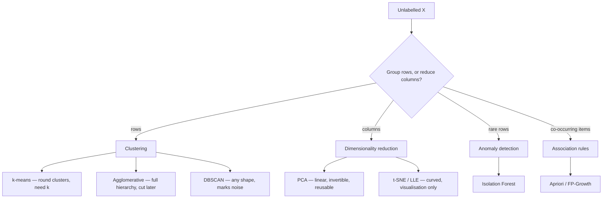

Every phase so far had an answer key. You fit a model, compared its predictions against `y`, and
got a number that told you whether you were right.

This phase has no `y`. That removes the labelling cost and, with it, the ability to check your work.
Which makes the central question of unsupervised learning not "what does the algorithm find?" but
**"how would I know if it were wrong?"** — and every page here takes that question seriously enough
to include at least one measurement where the method fails.

## What this phase covers

Two halves. The first four pages group **rows**; the last three reduce or mine **columns**.

| # | Page | Finds | Key measurement |
| --- | --- | --- | --- |
| 1 | [Introduction to Clustering](/machine-learning/phase-06---unsupervised-learning--dimensionality-reduction/introduction-to-clustering/) | The vocabulary: metrics, silhouette, validation | scaling moved ARI 0.035 → 0.891 |
| 2 | [K-Means](/machine-learning/phase-06---unsupervised-learning--dimensionality-reduction/k-means-clustering-algorithm/) | Round clusters, given $k$ | one bad seed: inertia 971.25 vs 302.46 |
| 3 | [Hierarchical Clustering](/machine-learning/phase-06---unsupervised-learning--dimensionality-reduction/hierarchical-clustering-dendrograms/) | The whole nesting, cut afterwards | single linkage: ARI 1.00 on moons, 0.00 on blobs |
| 4 | [DBSCAN](/machine-learning/phase-06---unsupervised-learning--dimensionality-reduction/dbscan-density-based-clustering/) | Any shape, plus noise | eps 0.08 → 0.60: 21 clusters → 1 |
| 5 | [Isolation Forests](/machine-learning/phase-06---unsupervised-learning--dimensionality-reduction/anomaly-detection-with-isolation-forests/) | Outliers, by how easily they separate | outliers isolate at depth 9.46, inliers 18.09 |
| 6 | [Association Rules](/machine-learning/phase-06---unsupervised-learning--dimensionality-reduction/association-rule-learning-apriori-algorithm/) | Items that co-occur | four rules at confidence 0.80, lifts 1.23 to 4.00 |
| 7 | [PCA](/machine-learning/phase-06---unsupervised-learning--dimensionality-reduction/principal-component-analysis-pca/) | Directions of maximum variance | unscaled wine: PC1 at 99.81%, and it is one column |
| 8 | [t-SNE and Manifold Learning](/machine-learning/phase-06---unsupervised-learning--dimensionality-reduction/t-sne-and-manifold-learning/) | Curved low-dimensional structure | cluster radii 0.38/1.94/0.35 all rendered near 6 |

## The one thing that decides everything

Every algorithm in this phase — clustering, anomaly detection and dimensionality reduction alike —
operates on distances or variances in your feature space. So the feature space *is* the model.

| Decision | Consequence, measured on these pages |
| --- | --- |
| Not scaling before k-means | ARI 0.035 instead of 0.891 |
| Not scaling before PCA | PC1 at 99.81%, and it is one column's units |
| Euclidean where cosine belongs | Two near-identical documents judged 5 units apart |
| Choosing `eps` by eye | 21 clusters or 1, on identical data |
| Choosing linkage by habit | ARI 1.00 or 0.00, on the same points |

None of these is a bug. In each case the algorithm faithfully reported the structure implied by the
distances it was given. **Get the feature space right and the algorithm barely matters. Get it
wrong and no algorithm can save you.**

## How to check unsupervised work

There is no accuracy score, but there is more than nothing:

| Situation | Tool |
| --- | --- |
| No labels at all | Silhouette, Davies-Bouldin, Calinski-Harabasz |
| Labels available for evaluation only | Adjusted Rand index, normalised mutual information |
| Dimensionality reduction | Trustworthiness, explained variance, reconstruction error |
| "Is this structure even real?" | Shuffle each column independently and rerun; compare |
| Anything at all | Look at the plot. Then look at ten actual rows from each group. |

That last row is not a joke. k-means on uniform noise returns three clusters with a silhouette of
0.378 — a number you would happily ship. The shuffled-null comparison and your own eyes are what
catch it.

## Before you start

- **[Feature scaling](/machine-learning/phase-02---data-preprocessing--feature-engineering/feature-scaling-normalization--standardization/)** —
  load-bearing for every page here.
- **[Transformation pipelines](/machine-learning/phase-02---data-preprocessing--feature-engineering/transformation-pipelines--custom-transformers/)** —
  the moment a cluster label becomes a feature, the leakage rules apply as usual.
- **Basic linear algebra** — eigenvectors and eigenvalues for the PCA page. The page derives what
  it needs, but familiarity helps.
- **[Decision trees](/machine-learning/phase-04---supervised-learning---classification/decision-trees-entropy-and-gini-impurity/)** —
  the Isolation Forest page assumes you know what a tree split is.

## What you'll be able to do afterwards

1. Choose a distance metric deliberately and explain what it makes "similar".
2. Derive the k-means update rules from the inertia objective and prove the algorithm terminates.
3. Compute a silhouette coefficient, all four linkage distances, and a lift, by hand.
4. Read a dendrogram and pick a cut height from the merge-distance plateau.
5. Choose DBSCAN's `eps` from the k-distance knee rather than by trial and error.
6. Explain why PCA's components are eigenvectors of the covariance matrix.
7. Say precisely what a t-SNE plot does and does not license you to conclude.
8. Recognise, in each case, the geometry that breaks the method you are using.

## How long it takes

| Activity | Time |
| --- | --- |
| Reading the eight pages | 6–8 hours |
| Working the hand examples | 3 hours |
| Running the code and the 40 exercises | 5–6 hours |
| The practice project below | 6–8 hours |
| **Total** | **20–25 hours** |

## Practice project

**Segment one dataset four ways, and defend a choice.** Pick anything with 2,000+ rows and at least
eight numeric features — customer transactions, country-level indicators, sensor readings, song
audio features.

**Part 1 — Prepare.** Scale the features. Run PCA and record how many components reach 90% of the
variance. Note whether that number surprises you.

**Part 2 — Cluster.** Fill in this table on the scaled data:

| Method | Parameters chosen how? | Clusters | Silhouette | Noise points |
| --- | --- | --- | --- | --- |
| k-means | elbow + silhouette | | | n/a |
| Agglomerative (Ward) | merge-height plateau | | | n/a |
| Agglomerative (average) | same cut | | | n/a |
| DBSCAN | k-distance knee | | | |
| HDBSCAN | `min_cluster_size` | | | |

**Part 3 — Visualise.** Plot the PCA projection and a t-SNE embedding, coloured by each clustering.
Write one sentence on what the t-SNE plot licenses you to say, and one on what it does not.

**Part 4 — Validate.** Shuffle each column independently, rerun your best method, and compare the
silhouette against the real one. If they are close, you have found nothing.

**Part 5 — Decide.** In writing:

1. Which clustering would you ship, and why?
2. What does each cluster mean? Name them, using the feature means per cluster.
3. Which points did DBSCAN call noise? Look at ten of them. Are they errors, outliers, or a real
   small group?

If Part 4 says your structure is not distinguishable from noise, **that is the finding**. Report it.
It is a more valuable result than a segmentation nobody should act on.

<Quiz
  questions={[
    {
      q: "You cluster customer data and get a silhouette of 0.38. Is that good?",
      options: [
        "Yes, positive silhouettes indicate real clusters",
        "Unknown until you compare it against the same method run on column-shuffled data",
        "No, anything below 0.5 is meaningless",
        "It depends only on k",
      ],
      answer: 1,
      explain: "k-means on uniform noise scored 0.3775 on the k-means page. A silhouette in isolation is not evidence of structure — the null comparison is what makes it evidence.",
    },
    {
      q: "Which method in this phase can label a point you have never seen before?",
      options: [
        "DBSCAN",
        "k-means and PCA — both learn a reusable mapping; agglomerative, DBSCAN and t-SNE do not",
        "t-SNE",
        "All of them",
      ],
      answer: 1,
      explain: "k-means stores centroids and PCA stores components, so both have transform/predict. Agglomerative and DBSCAN define clusters relative to the training set, and t-SNE only optimises positions for the specific points it saw.",
    },
    {
      q: "Two clusters in your t-SNE plot are far apart. What have you learned?",
      options: [
        "They are very different from each other",
        "Nothing about their separation — the KL objective barely constrains distances between non-neighbours",
        "One is an outlier group",
        "You should increase perplexity",
      ],
      answer: 1,
      explain: "Measured on the t-SNE page: true centre gaps of 6.04 and 34.01 were both rendered at about 39. t-SNE preserves which points are neighbours, and nothing else.",
    },
    {
      q: "PCA on your raw data gives PC1 at 99% explained variance. What should you check first?",
      options: [
        "Whether the data is really one-dimensional",
        "The column standard deviations — one feature almost certainly has a far larger numeric range",
        "The number of samples",
        "Whether n_components was set correctly",
      ],
      answer: 1,
      explain: "On the wine dataset, raw PC1 hits 99.81% and loads 0.9998 on proline, whose standard deviation is 314 against about 1 for its neighbours. After standardising, PC1 drops to 36.2% and becomes informative.",
    },
  ]}
/>

## Next

Start with
[Introduction to Clustering](/machine-learning/phase-06---unsupervised-learning--dimensionality-reduction/introduction-to-clustering/)
— what a cluster is, why the distance metric decides the answer before the algorithm runs, and how
to score a grouping when there is nothing to check it against.
