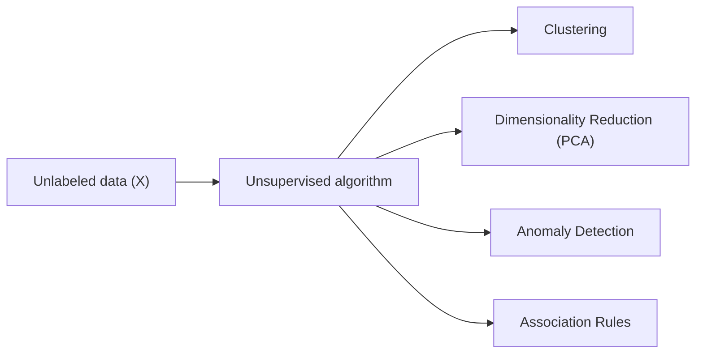

## What unsupervised learning is

Unsupervised learning works with **features only (X)** — no labels `y`. As
Yann LeCun put it, if intelligence were a cake, unsupervised learning would
be the cake itself, and supervised learning would just be the icing.

Goals include:

- **clustering**: group similar points
- **dimensionality reduction**: compress data while keeping its structure
- **anomaly detection**: find rare/unusual samples
- **association rules**: discover co-occurrence patterns

This phase mirrors Chapters 8 and 9 of *Hands-On Machine Learning* (Géron):
first the clustering and anomaly-detection algorithms that group and score
unlabeled instances, then the projection and manifold-learning techniques —
above all **Principal Component Analysis (PCA)** — that fight the *curse of
dimensionality* by compressing high-dimensional data down to something a
model (or a human) can actually work with.

## Phase 6 topics

1. Introduction to Clustering
2. K-Means Clustering Algorithm
3. Hierarchical Clustering (Dendrograms)
4. DBSCAN: Density-Based Clustering
5. Anomaly Detection with Isolation Forests
6. Association Rule Learning (Apriori Algorithm)
7. Principal Component Analysis (PCA)
8. t-SNE and Manifold Learning

:::tip[From the book]
Géron organizes this material into two chapters: Chapter 9 covers clustering (K-Means,
DBSCAN, hierarchical clustering), Gaussian mixtures, and anomaly detection; Chapter 8
covers dimensionality reduction (PCA and manifold learning). Most of the world's data
has no labels attached to it, so these unsupervised techniques are what let you get
value out of the vast majority of the data that's actually available.
:::

## Common real-world uses

- customer segmentation
- grouping products by similarity
- detecting fraud/anomalies
- analyzing basket/cart patterns
- compressing high-dimensional data (e.g. MNIST) for faster training and 2D/3D visualization
