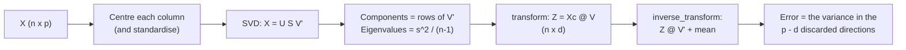

import DataCampExercise from "../../../../components/DataCampExercise.astro";
import AlgorithmCard from "../../../../components/AlgorithmCard.astro";
import Figure from "../../../../components/Figure.astro";
import Quiz from "../../../../components/Quiz.astro";

## What you'll learn

- the two equivalent definitions of PCA — **maximise variance** and **minimise reconstruction
  error** — and why they are the same optimisation
- a complete eigendecomposition by hand on five points, matching scikit-learn exactly
- the SVD route, and why scikit-learn takes it instead of forming the covariance matrix
- **explained variance ratio** and how to pick $d$: digits needs 21 of 64 for 90%
- the standardisation failure, measured: PC1 at **99.8%** and it is one column's units
- reconstruction, compression and denoising with `inverse_transform`
- randomised and incremental PCA, and Kernel PCA for curved structure

## Intuition

A dataset with 64 columns does not usually have 64 independent things going on. Neighbouring pixels
in an image move together. Height and weight move together. Most of the columns are echoes of a
smaller number of underlying factors.

PCA finds those factors. It looks for the direction in which the data spreads out the most, calls
that the first principal component, then looks for the direction of greatest remaining spread that
is perpendicular to the first, and so on. Keep the first few and you have a compact description
that loses very little.

There are two ways to say what PCA optimises, and they turn out to be the same thing:

1. **Maximise the variance** of the projected data.
2. **Minimise the squared distance** from each point to its projection.

The reason is Pythagoras. For centred data, each point's squared distance from the origin splits
exactly into the squared length of its projection plus the squared length of the residual:

$$
\lVert \mathbf{x} \rVert^2 = \underbrace{(\mathbf{x}^\top \mathbf{u})^2}_{\text{kept}}
+ \underbrace{\lVert \mathbf{x} - (\mathbf{x}^\top\mathbf{u})\mathbf{u} \rVert^2}_{\text{lost}}
$$

Summed over all points, the left side is a constant of the data. So maximising the first term is
identical to minimising the second. **Variance kept and error made are two names for one number.**



<Figure
  src="/images/ml/phase-06-unsupervised/principal-component-analysis-pca/projection-geometry"
  alt="Three panels of the same elongated point cloud with a candidate axis at 0, 35 and 90 degrees. Red residual lines run from each point to the axis, longest in the first and third panels and shortest in the middle."
  title="Three candidate axes, one optimum"
  caption="The amber line is the candidate axis, the amber dots are the projections and the red segments are what gets thrown away. At 35 degrees the variance kept is highest (4.53) and the mean squared error lowest (0.32) at the same moment. The total, 4.85, is the same in all three panels."
/>

## The math

Let $\mathbf{X}$ be the $n \times p$ data matrix with **every column already centred** (PCA
subtracts the mean for you; the derivation requires it). The sample covariance matrix is

$$
\mathbf{C} = \frac{1}{n-1}\mathbf{X}^\top \mathbf{X}
$$

For a unit direction $\mathbf{u}$, the projected values are $\mathbf{X}\mathbf{u}$ and their
variance is

$$
\operatorname{Var}(\mathbf{X}\mathbf{u}) = \frac{1}{n-1}\mathbf{u}^\top \mathbf{X}^\top
\mathbf{X}\mathbf{u} = \mathbf{u}^\top \mathbf{C}\,\mathbf{u}
$$

So PCA is the constrained problem

$$
\max_{\mathbf{u}} \ \mathbf{u}^\top \mathbf{C}\, \mathbf{u}
\quad \text{subject to} \quad \mathbf{u}^\top \mathbf{u} = 1
$$

The constraint matters: without it you could inflate the objective forever by lengthening
$\mathbf{u}$. Form the Lagrangian

$$
\mathcal{L}(\mathbf{u}, \lambda) = \mathbf{u}^\top \mathbf{C}\mathbf{u}
- \lambda(\mathbf{u}^\top \mathbf{u} - 1)
$$

and differentiate:

$$
\frac{\partial \mathcal{L}}{\partial \mathbf{u}} = 2\mathbf{C}\mathbf{u} - 2\lambda \mathbf{u} = 0
\quad \Longrightarrow \quad
\boxed{\ \mathbf{C}\mathbf{u} = \lambda \mathbf{u}\ }
$$

**The optimum is an eigenvector of the covariance matrix.** Left-multiplying by
$\mathbf{u}^\top$ gives $\mathbf{u}^\top\mathbf{C}\mathbf{u} = \lambda$, so the variance captured
by a component *is* its eigenvalue. Take the eigenvectors in descending order of $\lambda$ and you
have the principal components.

Because $\mathbf{C}$ is real and symmetric, the spectral theorem guarantees its eigenvalues are real
and its eigenvectors can be chosen orthonormal. Orthogonality of the components is not a design
choice — it falls out of the mathematics.

### The explained variance ratio

The eigenvalues sum to the total variance, $\sum_j \lambda_j = \operatorname{tr}(\mathbf{C})$, so

$$
\text{EVR}_j = \frac{\lambda_j}{\sum_{i=1}^{p}\lambda_i}
$$

is the fraction of total variance the $j$-th component carries.

### The SVD route

scikit-learn does not build $\mathbf{C}$. It takes the singular value decomposition directly:

$$
\mathbf{X} = \mathbf{U}\boldsymbol\Sigma\mathbf{V}^\top
$$

Then

$$
\mathbf{X}^\top\mathbf{X} = \mathbf{V}\boldsymbol\Sigma^\top\mathbf{U}^\top
\mathbf{U}\boldsymbol\Sigma\mathbf{V}^\top = \mathbf{V}\boldsymbol\Sigma^2\mathbf{V}^\top
$$

so the right singular vectors $\mathbf{V}$ *are* the eigenvectors of $\mathbf{X}^\top\mathbf{X}$,
and the eigenvalues are $\lambda_j = \sigma_j^2/(n-1)$.

Two reasons this is better. **Numerically**, forming $\mathbf{X}^\top\mathbf{X}$ squares the
condition number, so information near the noise floor is destroyed before you start.
**Computationally**, when $p \gg n$ — 10,000 genes and 200 patients — the covariance matrix is
$10{,}000 \times 10{,}000$ while the SVD never forms it.

The sign of each component is arbitrary: if $\mathbf{u}$ is an eigenvector so is $-\mathbf{u}$.
scikit-learn applies a deterministic sign convention so results are reproducible, but do not read
meaning into whether a loading is positive or negative in isolation.

## Worked example by hand

Five points:

$$
(2,1),\ (3,3),\ (4,2),\ (5,5),\ (6,4)
$$

**Step 1 — centre.** The means are $\bar{x} = 4$ and $\bar{y} = 3$:

$$
\mathbf{X}_c = \begin{pmatrix}
-2 & -2 \\ -1 & 0 \\ 0 & -1 \\ 1 & 2 \\ 2 & 1
\end{pmatrix}
$$

**Step 2 — covariance.** With $n - 1 = 4$:

$$
\operatorname{Var}(x) = \frac{4 + 1 + 0 + 1 + 4}{4} = 2.5, \qquad
\operatorname{Var}(y) = \frac{4 + 0 + 1 + 4 + 1}{4} = 2.5
$$

$$
\operatorname{Cov}(x, y) = \frac{4 + 0 + 0 + 2 + 2}{4} = 2.0
$$

$$
\mathbf{C} = \begin{pmatrix} 2.5 & 2.0 \\ 2.0 & 2.5 \end{pmatrix}
$$

**Step 3 — eigenvalues.** Solve $\det(\mathbf{C} - \lambda \mathbf{I}) = 0$:

$$
(2.5 - \lambda)^2 - 2.0^2 = 0
\quad \Longrightarrow \quad
2.5 - \lambda = \pm 2.0
$$

$$
\lambda_1 = 4.5, \qquad \lambda_2 = 0.5
$$

Check against the trace: $4.5 + 0.5 = 5.0 = 2.5 + 2.5$. ✓

**Step 4 — eigenvectors.** For $\lambda_1 = 4.5$:

$$
\begin{pmatrix} 2.5 - 4.5 & 2.0 \\ 2.0 & 2.5 - 4.5 \end{pmatrix}
\begin{pmatrix} u_1 \\ u_2 \end{pmatrix} = \mathbf{0}
\quad \Longrightarrow \quad -2u_1 + 2u_2 = 0
\quad \Longrightarrow \quad u_1 = u_2
$$

Normalised: $\mathbf{u}_1 = (1/\sqrt{2},\ 1/\sqrt{2}) = (0.7071,\ 0.7071)$. The same algebra with
$\lambda_2 = 0.5$ gives $\mathbf{u}_2 = (-0.7071,\ 0.7071)$, which is perpendicular, as promised.

**Step 5 — explained variance.**

$$
\text{EVR}_1 = \frac{4.5}{5.0} = 0.90, \qquad \text{EVR}_2 = \frac{0.5}{5.0} = 0.10
$$

Ninety percent of the variation lies along the $45°$ diagonal.

**Step 6 — project.** The score of a point is its centred coordinates dotted with $\mathbf{u}_1$.
For $(2, 1)$, centred to $(-2, -2)$:

$$
z = (-2)(0.7071) + (-2)(0.7071) = -2.8284
$$

All five scores: $-2.8284,\ -0.7071,\ -0.7071,\ 2.1213,\ 2.1213$.

**Step 7 — reconstruct.** Push the first point back out:
$-2.8284 \times (0.7071, 0.7071) = (-2, -2)$, add the mean, and you get exactly $(2, 1)$. That
point lies on the diagonal, so nothing was lost. Across all five points, the total squared
reconstruction error from one component is 2.0 — which is $(n-1)\lambda_2 = 4 \times 0.5$, the
discarded eigenvalue, exactly as the theory says.

Every number here matches `sklearn.decomposition.PCA` to the digit.

## See it move

```p5 title="Rotating onto the axis of maximum variance" desc="The amber line sweeps toward PC1 while a live variance meter fills. Once it locks on, every point projects down onto it — the 1-D summary that keeps the most spread." height="320"
let pts = [];
let mx = 0, my = 0, sxx = 0, syy = 0, sxy = 0;
let trueAngle = 0, startAngle = 0, l1 = 0;
let t = 0;
const SEARCH = 140, PROJECT = 90, HOLD = 150;
const TOTAL = SEARCH + PROJECT + HOLD;

function smoothstep(x) { return x * x * (3 - 2 * x); }

function reset() {
  pts = [];
  const cx = width / 2, cy = height / 2;
  const angle = random(0, PI);
  const spreadA = random(120, 165), spreadB = random(18, 42);
  for (let i = 0; i < 120; i++) {
    const a = randomGaussian() * spreadA;
    const b = randomGaussian() * spreadB;
    const x = cx + a * cos(angle) - b * sin(angle);
    const y = cy + a * sin(angle) + b * cos(angle);
    pts.push({ x, y });
  }
  mx = 0; my = 0;
  for (const p of pts) { mx += p.x; my += p.y; }
  mx /= pts.length; my /= pts.length;
  sxx = 0; syy = 0; sxy = 0;
  for (const p of pts) {
    const dx = p.x - mx, dy = p.y - my;
    sxx += dx * dx; syy += dy * dy; sxy += dx * dy;
  }
  sxx /= pts.length; syy /= pts.length; sxy /= pts.length;
  const trace = sxx + syy;
  const det = sxx * syy - sxy * sxy;
  const term = Math.sqrt(Math.max(0, (trace * trace) / 4 - det));
  l1 = trace / 2 + term;
  let vx = sxy !== 0 ? l1 - syy : 1;
  let vy = sxy !== 0 ? sxy : 0;
  const norm = Math.sqrt(vx * vx + vy * vy) || 1;
  vx /= norm; vy /= norm;
  trueAngle = Math.atan2(vy, vx);
  if (trueAngle < 0) trueAngle += PI;
  const dir = random() < 0.5 ? -1 : 1;
  startAngle = trueAngle + dir * radians(65);
  t = 0;
}

function setup() {
  createCanvas(600, 320);
  textFont("monospace");
  reset();
}

function variance(theta) {
  const c = cos(theta), s = sin(theta);
  return sxx * c * c + syy * s * s + 2 * sxy * s * c;
}

function draw() {
  background(13, 17, 23);

  let candidateAngle, phaseLabel;
  if (t < SEARCH) {
    const p = t / SEARCH;
    candidateAngle = lerp(startAngle, trueAngle, smoothstep(p));
    phaseLabel = "searching for the max-variance axis...";
  } else {
    candidateAngle = trueAngle;
    phaseLabel = t < SEARCH + PROJECT ? "projecting points onto PC1..." : "converged: PC1 found";
  }

  const vx = cos(candidateAngle), vy = sin(candidateAngle);
  const varNow = variance(candidateAngle);
  const varFrac = constrain(varNow / l1, 0, 1);

  if (t >= SEARCH) {
    stroke(90);
    strokeWeight(1);
    line(mx - -vy * 95, my - vx * 95, mx + -vy * 95, my + vx * 95);
  }

  stroke(255, 211, 67);
  strokeWeight(2);
  const L = 230;
  line(mx - vx * L, my - vy * L, mx + vx * L, my + vy * L);

  noStroke();
  for (const p of pts) {
    fill(75, 139, 190, 150);
    ellipse(p.x, p.y, 7, 7);
  }

  if (t >= SEARCH) {
    const projP = constrain((t - SEARCH) / PROJECT, 0, 1);
    const ease2 = smoothstep(projP);
    stroke(255, 211, 67, 70);
    strokeWeight(1);
    for (const p of pts) {
      const dx = p.x - mx, dy = p.y - my;
      const proj = dx * vx + dy * vy;
      const fx = mx + proj * vx, fy = my + proj * vy;
      line(p.x, p.y, lerp(p.x, fx, ease2), lerp(p.y, fy, ease2));
    }
    noStroke();
    fill(255, 211, 67);
    for (const p of pts) {
      const dx = p.x - mx, dy = p.y - my;
      const proj = dx * vx + dy * vy;
      const fx = mx + proj * vx, fy = my + proj * vy;
      ellipse(lerp(p.x, fx, ease2), lerp(p.y, fy, ease2), 5, 5);
    }
  }

  fill(200);
  textSize(12);
  textAlign(LEFT, TOP);
  text(phaseLabel, 12, 12);
  text("variance captured: " + Math.round(varFrac * 100) + "%", 12, 30);
  noStroke();
  fill(60);
  rect(12, 48, 160, 8, 4);
  fill(255, 211, 67);
  rect(12, 48, 160 * varFrac, 8, 4);
  fill(200);
  text("click to reshuffle the cloud", 12, 68);

  t++;
  if (t > TOTAL) reset();
}

function mousePressed() { reset(); }
```

The next sketch shows the two objectives moving in lockstep — as one bar rises, the other falls by
exactly the same amount.

```p5 title="Variance kept and error made sum to a constant" desc="Sweep the projection axis all the way round. The blue bar is the variance retained, the red bar the squared reconstruction error. Their total never changes." height="360"
let pts = [], theta = 0, sxx = 0, syy = 0, sxy = 0, total = 0, best = 0;
function build() {
  pts = [];
  const ang = random(0, PI), A = random(1.6, 2.4), B = random(0.35, 0.8);
  for (let i = 0; i < 140; i++) {
    const a = randomGaussian() * A, b = randomGaussian() * B;
    pts.push({ x: a * Math.cos(ang) - b * Math.sin(ang), y: a * Math.sin(ang) + b * Math.cos(ang) });
  }
  let mx = 0, my = 0;
  for (const p of pts) { mx += p.x; my += p.y; }
  mx /= pts.length; my /= pts.length;
  sxx = syy = sxy = 0;
  for (const p of pts) {
    p.x -= mx; p.y -= my;
    sxx += p.x * p.x; syy += p.y * p.y; sxy += p.x * p.y;
  }
  sxx /= pts.length; syy /= pts.length; sxy /= pts.length;
  total = sxx + syy;
  const tr = sxx + syy, det = sxx * syy - sxy * sxy;
  best = tr / 2 + Math.sqrt(Math.max(0, tr * tr / 4 - det));
  theta = 0;
}
function setup() { createCanvas(600, 360); textFont("monospace"); build(); }
function draw() {
  background(13, 17, 23);
  const cx = 175, cy = 165, S = 52;
  const ux = Math.cos(theta), uy = Math.sin(theta);
  const kept = sxx * ux * ux + syy * uy * uy + 2 * sxy * ux * uy;
  const lost = total - kept;

  stroke(255, 211, 67); strokeWeight(2);
  line(cx - ux * 145, cy - uy * 145, cx + ux * 145, cy + uy * 145);
  for (const p of pts) {
    const t2 = p.x * ux + p.y * uy;
    stroke(232, 110, 110, 90); strokeWeight(1);
    line(cx + p.x * S, cy + p.y * S, cx + t2 * ux * S, cy + t2 * uy * S);
  }
  noStroke();
  for (const p of pts) { fill(75, 139, 190, 170); ellipse(cx + p.x * S, cy + p.y * S, 6, 6); }

  const bx = 360, bw = 210;
  const rows = [["variance kept", kept, color(107, 169, 221)],
                ["squared error", lost, color(232, 110, 110)],
                ["total (constant)", total, color(150, 158, 170)]];
  let by = 96;
  for (const [label, val, col] of rows) {
    fill(150); textSize(11); textAlign(LEFT, BOTTOM); text(label, bx, by - 4);
    fill(45, 52, 63); rect(bx, by, bw, 18, 4);
    fill(col); rect(bx, by, bw * (val / total), 18, 4);
    fill(225); textAlign(LEFT, CENTER); textSize(11);
    text(val.toFixed(3), bx + bw + 8, by + 9);
    by += 52;
  }
  fill(255, 211, 67); textSize(13); textAlign(LEFT, TOP);
  text("angle " + (degrees(theta) % 180).toFixed(0) + "°", bx, 52);
  fill(kept > best - 1e-3 ? color(120, 200, 120) : color(110));
  textSize(12);
  text(kept > best - 1e-3 ? "this IS PC1" : "best possible: " + best.toFixed(3), bx, 252);
  fill(140); textSize(10); textAlign(LEFT, BOTTOM);
  text("click to reshuffle the cloud", bx, height - 12);

  theta += 0.012;
  if (theta > PI) theta -= PI;
}
function mousePressed() { build(); }
```

## Choosing how many components

Fit PCA with all components, look at the cumulative explained variance, and cut where it flattens.
On scikit-learn's digits dataset — 1,797 images of $8 \times 8$ pixels, so 64 features:

| Target variance | Components needed |
| --- | --- |
| 90% | **21** of 64 |
| 95% | **29** of 64 |
| 99% | **41** of 64 |

The first component alone carries 14.89% and the second 13.62%.

<Figure
  src="/images/ml/phase-06-unsupervised/principal-component-analysis-pca/scree-and-cumulative"
  alt="A bar chart of explained variance per component falling steeply from 0.15 to near zero by component 30, beside a cumulative curve rising to 1.0 with dashed guides marking 90 percent at 21 components and 95 percent at 29."
  title="Scree plot and cumulative variance"
  caption="The scree plot shows individual contributions collapsing after about the tenth component. The cumulative curve is the one you act on: 21 components for 90% of the variance, 29 for 95%. A third of the columns carry nearly all the information."
/>

scikit-learn lets you state the target directly:

```python title="pick_d.py" showLineNumbers{1}
from sklearn.decomposition import PCA

pca = PCA(n_components=0.90, svd_solver="full").fit(X)   # a float means "this much variance"
print(pca.n_components_)          # 21
```

**Do not use PCA output dimensionality as a hyperparameter tuned on the test set.** If $d$ affects
downstream accuracy, put PCA in a pipeline and tune it in cross-validation, exactly as with
[any other preprocessing step](/machine-learning/phase-07---model-optimization--tuning/hyperparameter-tuning-with-gridsearchcv/).

## Standardise first, or PC1 becomes a unit conversion

This is the failure that actually happens in practice. The wine dataset has 13 chemical
measurements whose raw standard deviations range from 0.12 (`nonflavanoid_phenols`) to **314.0**
(`proline`, measured in mg/L).

| Input | PC1 EVR | PC2 EVR | PC1's dominant loading |
| --- | --- | --- | --- |
| Raw columns | **0.9981** | 0.0017 | `proline`, at 0.9998 |
| Standardised | 0.3620 | 0.1921 | `flavanoids`, at 0.4229 |

PC1 on the raw data explains 99.81% of the variance — and it *is* the proline column, at a loading
of 0.9998. PCA has faithfully reported that one column has a bigger number in it than the others.
That is a fact about milligrams per litre, not about wine.

After standardising, PC1 explains a modest 36.2% and mixes 13 features, with `flavanoids` leading
at 0.4229. Much less impressive, and actually informative.

<Figure
  src="/images/ml/phase-06-unsupervised/principal-component-analysis-pca/pca-needs-scaling"
  alt="Two scatter plots of the wine dataset projected onto two components. The raw version shows the three cultivars smeared together along one axis; the standardised version separates them into three visible groups."
  title="Wine cultivars, before and after standardising"
  caption="Left: raw columns. PC1 captures 99.81% of the variance and is essentially the proline column, so the three cultivars overlap heavily. Right: after StandardScaler, PC1 captures 36.2% by mixing all thirteen features, and the three classes separate cleanly."
/>

Always:

```python title="pca_pipeline.py" showLineNumbers{1}
from sklearn.decomposition import PCA
from sklearn.pipeline import make_pipeline
from sklearn.preprocessing import StandardScaler

pipe = make_pipeline(StandardScaler(), PCA(n_components=0.95))
```

The exception is data whose columns already share units and where relative magnitude is meaningful
— pixel intensities, spectra, or a block of columns all in dollars.

## Reconstruction, compression and denoising

`inverse_transform` maps back to the original space. What comes out is the projection of the input
onto the retained subspace — the closest possible approximation using $d$ directions.

<Figure
  src="/images/ml/phase-06-unsupervised/principal-component-analysis-pca/reconstruction-grid"
  alt="A grid of four handwritten digits reconstructed from 64, 32, 16, 8, 4 and 2 principal components, becoming progressively blurrier from left to right."
  title="The same digits at six compression levels"
  caption="At d=32 (96.6% of the variance) the digits are visually indistinguishable from the originals. At d=16 (84.9%) they are blurry but still legible. At d=2 (28.5%) only the broadest strokes survive. The percentage under each column is the cumulative explained variance."
/>

| $d$ | Explained variance | Reconstruction MSE | Storage |
| --- | --- | --- | --- |
| 64 | 1.0000 | 0.0000 | 100% |
| 32 | 0.9664 | 0.6316 | 50% |
| 16 | 0.8494 | 2.8272 | 25% |
| 8 | 0.6739 | 6.1218 | 12.5% |
| 4 | 0.4871 | 9.6280 | 6.25% |
| 2 | 0.2851 | 13.4210 | 3.1% |

Halving the storage costs 3.4% of the variance. That is the compression trade in one row.

The same mechanism denoises. Noise is, by construction, spread evenly across all directions, while
signal concentrates in the top few. Projecting to a low-dimensional subspace and back discards
mostly noise:

```python title="denoise.py" showLineNumbers{1}
import numpy as np
from sklearn.datasets import load_digits
from sklearn.decomposition import PCA

X = load_digits().data
rng = np.random.default_rng(0)
X_noisy = X + rng.normal(0, 4, X.shape)

pca = PCA(n_components=0.80, random_state=0).fit(X_noisy)
X_clean = pca.inverse_transform(pca.transform(X_noisy))

print("components kept", pca.n_components_)
print("MSE noisy vs original", round(float(((X_noisy - X) ** 2).mean()), 3))
print("MSE clean vs original", round(float(((X_clean - X) ** 2).mean()), 3))
```

## In code

```python title="pca_basics.py" showLineNumbers{1}
import numpy as np
from sklearn.decomposition import PCA

X = np.array([[2.0, 1.0], [3.0, 3.0], [4.0, 2.0], [5.0, 5.0], [6.0, 4.0]])

pca = PCA().fit(X)

print("mean_                 ", pca.mean_)                        # [4. 3.]
print("explained_variance_   ", pca.explained_variance_)          # [4.5 0.5]
print("explained_variance_ratio_", pca.explained_variance_ratio_) # [0.9 0.1]
print("components_ (rows are PCs)\n", pca.components_.round(4))
# [[ 0.7071  0.7071]
#  [-0.7071  0.7071]]

Z = pca.transform(X)
print("PC1 scores", Z[:, 0].round(4))    # [-2.8284 -0.7071 -0.7071  2.1213  2.1213]

# One component only, then back out again
p1 = PCA(n_components=1).fit(X)
X_rec = p1.inverse_transform(p1.transform(X))
print("total squared error", round(float(((X - X_rec) ** 2).sum()), 4))   # 2.0
```

That last number is $(n-1)\lambda_2 = 4 \times 0.5 = 2.0$ — the discarded eigenvalue, recovered
empirically.

### Randomised and incremental PCA

`svd_solver="randomized"` approximates the top $d$ singular vectors with random projections,
turning $O(n p^2)$ into roughly $O(n p d)$. It only pays when the matrix is large and $d \ll p$:
on the $1797 \times 64$ digits matrix it was *slower* than the full SVD, while on a
$5000 \times 800$ matrix asking for 50 components it was about twice as fast. scikit-learn's
`svd_solver="auto"` picks sensibly, so leave it alone unless you have measured.

`IncrementalPCA` processes the data in batches and never holds it all in memory:

```python title="incremental.py" showLineNumbers{1}
import numpy as np
from sklearn.decomposition import IncrementalPCA

ipca = IncrementalPCA(n_components=32, batch_size=256)
for batch in np.array_split(X, 20):        # or read from disk, one chunk at a time
    ipca.partial_fit(batch)

X_reduced = ipca.transform(X)
```

Use it when the data does not fit in RAM, or when it arrives as a stream.

### Kernel PCA

PCA is a linear method: it can only find flat subspaces. If the structure is curved, no rotation
will straighten it.

Kernel PCA applies the kernel trick — implicitly map to a high-dimensional space, do linear PCA
there, and never form the mapping explicitly. On two concentric circles:

| Representation | Logistic-regression accuracy (5-fold) |
| --- | --- |
| Raw 2-D | 0.4375 |
| Linear PCA (2 components) | 0.4375 |
| **Kernel PCA, RBF, gamma = 10** | **0.6575** |

<Figure
  src="/images/ml/phase-06-unsupervised/principal-component-analysis-pca/kernel-pca"
  alt="Three panels: two concentric rings of points, the same rings after linear PCA which merely rotates them, and after RBF kernel PCA which collapses the inner ring to a point and spreads the outer one into a large circle."
  title="Linear PCA cannot unfold a circle; an RBF kernel can"
  caption="Linear PCA rotates the plane and changes nothing about separability — accuracy stays at 0.4375. Kernel PCA collapses the inner ring to a tight cluster and pushes the outer ring away, which a linear classifier can then partly separate at 0.6575."
/>

Two costs. Kernel PCA is $O(n^2)$ in memory because it builds the kernel matrix, and
`inverse_transform` requires `fit_inverse_transform=True` and is only approximate — the pre-image
problem has no exact solution.

<AlgorithmCard
  name="Principal Component Analysis"
  type="Unsupervised — linear dimensionality reduction"
  sklearn="sklearn.decomposition.PCA"
  assumptions={[
    "Directions of high variance are the interesting ones",
    "The structure is LINEAR — a flat subspace, not a curved manifold",
    "Features are on comparable scales (standardise unless they genuinely are)",
    "Data is centred — PCA does this for you, but the maths requires it",
  ]}
  complexity={{
    train: "O(n p^2 + p^3) for full SVD; roughly O(n p d) for randomized",
    predict: "O(p d) per sample — a single matrix multiply",
    memory: "O(n p) for the data plus O(p d) for the components",
  }}
  hyperparams={[
    { name: "n_components", default: "min(n, p)", effect: "An int keeps that many; a float in (0,1) keeps enough for that much variance; 'mle' estimates it." },
    { name: "svd_solver", default: "'auto'", effect: "'full' is exact; 'randomized' is faster for large p and small d; 'arpack' for sparse. Leave on auto." },
    { name: "whiten", default: "False", effect: "Divides each component by its standard deviation. Helps downstream models that assume isotropy; discards magnitude information." },
    { name: "random_state", default: "None", effect: "Only matters for the randomized solver." },
  ]}
  useWhen={[
    "You have many correlated features and want fewer",
    "You want to visualise high-dimensional data in 2-D or 3-D",
    "You want to compress, denoise, or speed up a downstream model",
    "You need a deterministic, invertible, cheap-to-apply transform",
  ]}
  avoidWhen={[
    "The structure is a curved manifold — use Kernel PCA, LLE or t-SNE",
    "Interpretability of individual features matters — components are mixtures of all of them",
    "The informative signal is low-variance (rare but real: a subtle defect indicator)",
    "Features are categorical — use MCA or an embedding instead",
  ]}
  notation="C — covariance matrix; lambda_j — j-th eigenvalue = variance along PC j; u_j — j-th principal component; EVR — explained variance ratio"
/>

## Pitfalls

**Not standardising.** Measured above: PC1 at 99.81% that is a single column's units. This is the
most common PCA mistake by a wide margin.

**Fitting on the full dataset before splitting.** PCA learns the components from the data, so
fitting on train + test leaks test-set structure into the transform. Put it in a `Pipeline`.

**Assuming high variance means high relevance.** PCA is unsupervised — it has never seen `y`. A
low-variance direction can be the one that predicts the target. If you need supervised dimension
reduction, use linear discriminant analysis or partial least squares.

**Interpreting components as features.** PC1 is a weighted mixture of every original column. "PC1
increased by 2" is not a sentence anyone outside the model can act on.

**Applying PCA to one-hot encoded categoricals.** The variance of a one-hot column is
$p(1-p)$, which is a fact about category frequency, not importance. Use multiple correspondence
analysis or a learned embedding.

**Expecting `inverse_transform` to be lossless.** It returns the projection onto the retained
subspace. With $d < p$ the discarded variance is gone permanently.

**Reading meaning into a component's sign.** Eigenvectors are defined up to sign. A loading of
$-0.42$ and $+0.42$ describe the same structure.

**Reaching for `svd_solver="randomized"` without measuring.** On the digits matrix it was slower
than the exact solver. It wins on large, wide matrices — measure before switching.

## Compare

| | PCA | Kernel PCA | LDA | t-SNE / UMAP |
| --- | --- | --- | --- | --- |
| Supervised | no | no | **yes** | no |
| Linear | **yes** | no | yes | no |
| Max components | $\min(n, p)$ | $n$ | classes − 1 | 2 or 3 in practice |
| Transforms new data | **yes** | yes | **yes** | UMAP yes, t-SNE no |
| Invertible | **yes, exactly** | approximately | no | no |
| Preserves global structure | **yes** | partly | yes | **no** |
| Cost | $O(np^2)$ | $O(n^2)$ | $O(np^2)$ | $O(n \log n)$ |

<Quiz
  questions={[
    {
      q: "Why is the first principal component an eigenvector of the covariance matrix?",
      options: [
        "By definition of PCA",
        "Maximising u'Cu subject to u'u = 1 gives, via a Lagrange multiplier, the stationarity condition Cu = lambda u",
        "Because the covariance matrix is symmetric",
        "It is a numerical approximation",
      ],
      answer: 1,
      explain: "The Lagrangian is u'Cu - lambda(u'u - 1); setting its gradient to zero gives 2Cu - 2 lambda u = 0. Left-multiplying by u' shows the objective value equals lambda, so the largest eigenvalue is the maximum variance.",
    },
    {
      q: "PCA on your raw data reports PC1 explaining 99.8% of the variance. What is the most likely explanation?",
      options: [
        "The data really is one-dimensional",
        "One column has a far larger numeric range than the others, and PC1 is essentially that column",
        "You need more components",
        "The data is perfectly correlated",
      ],
      answer: 1,
      explain: "This is exactly what the wine dataset does: proline has a standard deviation of 314 while other columns are near 1, so PC1 loads on proline at 0.9998. Standardising drops PC1 to 36.2% and produces something informative.",
    },
    {
      q: "You keep 2 of 64 components and call inverse_transform. What do you get back?",
      options: [
        "The original data exactly",
        "The projection of the data onto the 2-D subspace, expressed in the original 64 coordinates",
        "Random noise",
        "A 2-column array",
      ],
      answer: 1,
      explain: "inverse_transform returns to the original coordinate system but not to the original values — the 62 discarded directions are gone. On digits at d=2, that is 28.5% of the variance retained and a reconstruction MSE of 13.42.",
    },
    {
      q: "Maximising retained variance and minimising reconstruction error give the same components. Why?",
      options: [
        "Coincidence",
        "For centred data, squared distance from the origin splits by Pythagoras into projection-squared plus residual-squared, and their total is fixed",
        "Only true in two dimensions",
        "Only true when the data is Gaussian",
      ],
      answer: 1,
      explain: "The projection and the residual are orthogonal, so their squared lengths sum to the point's squared norm. Summed over the dataset that total is a constant, so raising one term lowers the other by exactly the same amount.",
    },
    {
      q: "Your two classes form concentric rings. Will PCA help a linear classifier separate them?",
      options: [
        "Yes, PC1 will separate them",
        "No — PCA is a rotation, and no rotation makes concentric rings linearly separable. Kernel PCA can, moving accuracy from 0.44 to 0.66",
        "Yes, if you keep both components",
        "Yes, after whitening",
      ],
      answer: 1,
      explain: "Linear PCA changes the basis, not the topology. The measured result on make_circles: raw 0.4375, linear PCA 0.4375 (identical), RBF kernel PCA 0.6575. The kernel is what buys the separability.",
    },
  ]}
/>

## 🧪 Try It Yourself

### Exercise 1 – Eigendecomposition by hand

<DataCampExercise
  lang="python"
  hint={`np.cov with rowvar=False treats columns as variables; np.linalg.eigh returns eigenvalues ascending.`}
  code={`# Task: Exercise 1 - Eigendecomposition by hand
import numpy as np

X = np.array([[2.0, 1.0], [3.0, 3.0], [4.0, 2.0], [5.0, 5.0], [6.0, 4.0]])
Xc = X - X.mean(axis=0)

C = np.cov(Xc, rowvar=___)                    # replace ___ with False
print("covariance\\n", C)

w, v = np.linalg.eigh(C)
order = np.argsort(w)[::-1]
print("eigenvalues", w[order].round(4))
print("EVR        ", (w[order] / w.sum()).round(4))
print("PC1        ", np.abs(v[:, order[0]]).round(4))

# -- Expected Output -------------------------------------------
# covariance
#  [[2.5 2. ]
#  [2.  2.5]]
# eigenvalues [4.5 0.5]
# EVR         [0.9 0.1]
# PC1         [0.7071 0.7071]
# --------------------------------------------------------------`}
  solution={`import numpy as np

X = np.array([[2.0, 1.0], [3.0, 3.0], [4.0, 2.0], [5.0, 5.0], [6.0, 4.0]])
Xc = X - X.mean(axis=0)
C = np.cov(Xc, rowvar=False)
print("covariance\\n", C)
w, v = np.linalg.eigh(C)
order = np.argsort(w)[::-1]
print("eigenvalues", w[order].round(4))
print("EVR        ", (w[order] / w.sum()).round(4))
print("PC1        ", np.abs(v[:, order[0]]).round(4))`}
  sct={`test_output_contains("eigenvalues [4.5 0.5]")
success_msg("4.5 and 0.5, summing to the trace 5.0 — exactly the hand calculation.")`}
  height={260}
/>

### Exercise 2 – Confirm against scikit-learn

<DataCampExercise
  lang="python"
  hint={`pca.explained_variance_ holds the eigenvalues; components_ holds the eigenvectors as rows.`}
  code={`# Task: Exercise 2 - Confirm against scikit-learn
import numpy as np
from sklearn.decomposition import PCA

X = np.array([[2.0, 1.0], [3.0, 3.0], [4.0, 2.0], [5.0, 5.0], [6.0, 4.0]])

pca = PCA().___(X)                            # replace ___ with fit

print("mean_             ", pca.mean_)
print("explained_variance", pca.explained_variance_.round(4))
print("EVR               ", pca.explained_variance_ratio_.round(4))
print("PC1 scores        ", pca.transform(X)[:, 0].round(4))

# -- Expected Output -------------------------------------------
# mean_              [4. 3.]
# explained_variance [4.5 0.5]
# EVR                [0.9 0.1]
# PC1 scores         [-2.8284 -0.7071 -0.7071  2.1213  2.1213]
# --------------------------------------------------------------`}
  solution={`import numpy as np
from sklearn.decomposition import PCA

X = np.array([[2.0, 1.0], [3.0, 3.0], [4.0, 2.0], [5.0, 5.0], [6.0, 4.0]])
pca = PCA().fit(X)
print("mean_             ", pca.mean_)
print("explained_variance", pca.explained_variance_.round(4))
print("EVR               ", pca.explained_variance_ratio_.round(4))
print("PC1 scores        ", pca.transform(X)[:, 0].round(4))`}
  sct={`test_output_contains("EVR                [0.9 0.1]")
success_msg("Identical to the hand calculation, down to the projected scores.")`}
  height={250}
/>

### Exercise 3 – The discarded eigenvalue is the error

<DataCampExercise
  lang="python"
  hint={`The total squared reconstruction error equals (n - 1) times the sum of the discarded eigenvalues.`}
  code={`# Task: Exercise 3 - The discarded eigenvalue is the error
import numpy as np
from sklearn.decomposition import PCA

X = np.array([[2.0, 1.0], [3.0, 3.0], [4.0, 2.0], [5.0, 5.0], [6.0, 4.0]])

p1 = PCA(n_components=1).fit(X)
X_rec = p1.___(p1.transform(X))               # replace ___ with inverse_transform

err = ((X - X_rec) ** 2).sum()
full = PCA().fit(X)
predicted = (len(X) - 1) * full.explained_variance_[1]

print("measured error ", round(float(err), 4))
print("predicted (n-1)*lambda2", round(float(predicted), 4))

# -- Expected Output -------------------------------------------
# measured error  2.0
# predicted (n-1)*lambda2 2.0
# --------------------------------------------------------------`}
  solution={`import numpy as np
from sklearn.decomposition import PCA

X = np.array([[2.0, 1.0], [3.0, 3.0], [4.0, 2.0], [5.0, 5.0], [6.0, 4.0]])
p1 = PCA(n_components=1).fit(X)
X_rec = p1.inverse_transform(p1.transform(X))
err = ((X - X_rec) ** 2).sum()
full = PCA().fit(X)
predicted = (len(X) - 1) * full.explained_variance_[1]
print("measured error ", round(float(err), 4))
print("predicted (n-1)*lambda2", round(float(predicted), 4))`}
  sct={`test_output_contains("measured error  2.0")
success_msg("The error you make is exactly the variance you threw away. That is the whole theorem.")`}
  height={250}
/>

### Exercise 4 – Standardising changes everything

<DataCampExercise
  lang="python"
  hint={`Compare explained_variance_ratio_[0] and the largest absolute loading of PC1, before and after scaling.`}
  code={`# Task: Exercise 4 - Standardising changes everything
import numpy as np
from sklearn.datasets import load_wine
from sklearn.decomposition import PCA
from sklearn.preprocessing import StandardScaler

wine = load_wine()

for name, Xi in (("raw   ", wine.data),
                 ("scaled", StandardScaler().___(wine.data))):   # replace ___ with fit_transform
    p = PCA(n_components=2, random_state=0).fit(Xi)
    top = wine.feature_names[int(np.argmax(np.abs(p.components_[0])))]
    print(f"{name}: PC1 {p.explained_variance_ratio_[0]:.4f}"
          f"  dominated by '{top}' ({np.abs(p.components_[0]).max():.4f})")

# -- Expected Output -------------------------------------------
# raw   : PC1 0.9981  dominated by 'proline' (0.9998)
# scaled: PC1 0.3620  dominated by 'flavanoids' (0.4229)
# --------------------------------------------------------------`}
  solution={`import numpy as np
from sklearn.datasets import load_wine
from sklearn.decomposition import PCA
from sklearn.preprocessing import StandardScaler

wine = load_wine()
for name, Xi in (("raw   ", wine.data),
                 ("scaled", StandardScaler().fit_transform(wine.data))):
    p = PCA(n_components=2, random_state=0).fit(Xi)
    top = wine.feature_names[int(np.argmax(np.abs(p.components_[0])))]
    print(f"{name}: PC1 {p.explained_variance_ratio_[0]:.4f}"
          f"  dominated by '{top}' ({np.abs(p.components_[0]).max():.4f})")`}
  sct={`test_output_contains("PC1 0.9981")
success_msg("99.81% of the variance, and it is the proline column's units. Always standardise.")`}
  height={250}
/>

### Exercise 5 – The compression curve

<DataCampExercise
  lang="python"
  hint={`Fit PCA at each d, transform then inverse_transform, and take the mean squared difference.`}
  code={`# Task: Exercise 5 - The compression curve
import numpy as np
from sklearn.datasets import load_digits
from sklearn.decomposition import PCA

X = load_digits().data
print("original shape", X.shape)

for d in (32, 16, 8, 4, 2):
    p = PCA(n_components=d, random_state=0).fit(X)
    Xr = p.inverse_transform(p.transform(X))
    mse = ((X - Xr) ___ 2).mean()             # replace ___ with **
    print(f"d={d:2d}  EVR {p.explained_variance_ratio_.sum():.4f}  MSE {mse:.4f}")

# -- Expected Output -------------------------------------------
# original shape (1797, 64)
# d=32  EVR 0.9664  MSE 0.6316
# d=16  EVR 0.8494  MSE 2.8272
# d= 8  EVR 0.6739  MSE 6.1218
# d= 4  EVR 0.4871  MSE 9.6280
# d= 2  EVR 0.2851  MSE 13.4210
# --------------------------------------------------------------`}
  solution={`import numpy as np
from sklearn.datasets import load_digits
from sklearn.decomposition import PCA

X = load_digits().data
print("original shape", X.shape)
for d in (32, 16, 8, 4, 2):
    p = PCA(n_components=d, random_state=0).fit(X)
    Xr = p.inverse_transform(p.transform(X))
    mse = ((X - Xr) ** 2).mean()
    print(f"d={d:2d}  EVR {p.explained_variance_ratio_.sum():.4f}  MSE {mse:.4f}")`}
  sct={`test_output_contains("d=32  EVR 0.9664")
success_msg("Half the storage for 3.4% of the variance. That is the compression trade, measured.")`}
  height={260}
/>

## Recap

- PCA maximises projected variance, which is *identical* to minimising squared reconstruction
  error — Pythagoras on centred data.
- The Lagrangian gives $\mathbf{C}\mathbf{u} = \lambda\mathbf{u}$: components are eigenvectors and
  their variances are the eigenvalues.
- The five-point example gave $\lambda = 4.5, 0.5$, EVR 90%/10%, PC1 $= (0.7071, 0.7071)$, and a
  one-component reconstruction error of exactly $(n-1)\lambda_2 = 2.0$.
- scikit-learn uses the SVD, which is numerically better and avoids forming a $p \times p$ matrix.
- Digits needs **21 of 64** components for 90% of the variance, 29 for 95%.
- **Standardise first.** On raw wine data PC1 explains 99.81% and is the proline column's units;
  standardised it explains 36.2% and separates the cultivars.
- `inverse_transform` is the projection, not the original: $d = 32$ costs 3.4% of the variance,
  $d = 2$ costs 71.5%.
- PCA is linear. Concentric circles stay inseparable at 0.4375 accuracy until an RBF kernel takes
  it to 0.6575.

### Exercise 6 – Price each variance target in components

<DataCampExercise
  lang="python"
  hint={`np.cumsum on explained_variance_ratio_ gives the running total; np.searchsorted finds the first index that reaches a target.`}
  code={`# Task: Exercise 6 - Price each variance target in components
import numpy as np
from sklearn.datasets import load_digits
from sklearn.decomposition import PCA

digits = load_digits()
pca = PCA().fit(digits.data)
cumulative = np.___(pca.explained_variance_ratio_)   # replace ___ with cumsum
for target in (0.80, 0.90, 0.95, 0.99):
    k = int(np.searchsorted(cumulative, target) + 1)
    print(f"{100 * target:.0f}% of variance needs {k:3d} of 64 components "
          f"({k / 64:.3f} of the original size)")
print(f"the first component alone carries "
      f"{pca.explained_variance_ratio_[0]:.4f}")

# -- Expected Output -------------------------------------------
# 80% of variance needs  13 of 64 components (0.203 of the original size)
# 90% of variance needs  21 of 64 components (0.328 of the original size)
# 95% of variance needs  29 of 64 components (0.453 of the original size)
# 99% of variance needs  41 of 64 components (0.641 of the original size)
# the first component alone carries 0.1489
# --------------------------------------------------------------`}
  solution={`import numpy as np
from sklearn.datasets import load_digits
from sklearn.decomposition import PCA

digits = load_digits()
pca = PCA().fit(digits.data)
cumulative = np.cumsum(pca.explained_variance_ratio_)
for target in (0.80, 0.90, 0.95, 0.99):
    k = int(np.searchsorted(cumulative, target) + 1)
    print(f"{100 * target:.0f}% of variance needs {k:3d} of 64 components "
          f"({k / 64:.3f} of the original size)")
print(f"the first component alone carries "
      f"{pca.explained_variance_ratio_[0]:.4f}")`}
  sct={`test_output_contains("80% of variance needs  13")
success_msg("The curve is steep then flat: 13 components buy 80%, but the last 4% costs another 12. Each extra percentage point of variance is more expensive than the last, which is why 0.95 is a convention rather than a discovery.")`}
  height={270}
/>

## Next

[t-SNE and Manifold Learning](/machine-learning/phase-06---unsupervised-learning--dimensionality-reduction/t-sne-and-manifold-learning/)
— what to do when the data lies on a curved manifold that no rotation can flatten, and why the
prettiest plots in machine learning are also the easiest to over-read.
