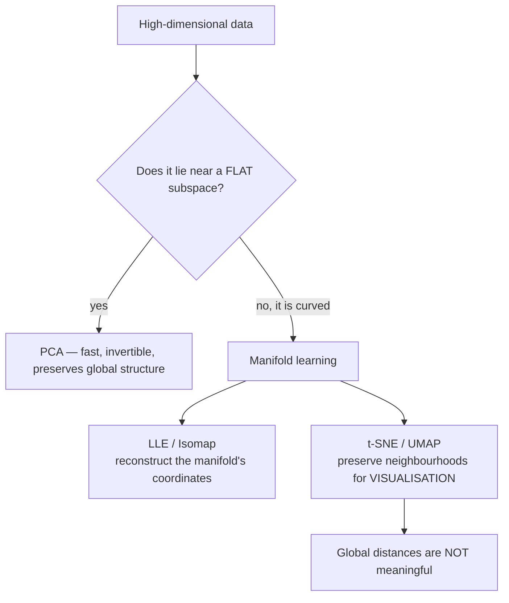

import DataCampExercise from "../../../../components/DataCampExercise.astro";
import AlgorithmCard from "../../../../components/AlgorithmCard.astro";
import Figure from "../../../../components/Figure.astro";
import Quiz from "../../../../components/Quiz.astro";

## What you'll learn

- the **manifold hypothesis**, and why linear projection cannot exploit it
- the t-SNE objective: Gaussian similarities in, **Student-t** similarities out, KL divergence between
- what perplexity actually controls, measured by the KL divergence it reaches
- the two things t-SNE plots **do not** preserve — cluster size and cluster distance — quantified
- **trustworthiness** as a number you can put on an embedding: PCA 0.830, t-SNE 0.992
- LLE and modified LLE, which unroll a Swiss roll that PCA merely flattens
- why t-SNE has no `transform`, and what UMAP changes

## Intuition

A $28 \times 28$ grayscale image lives in 784 dimensions. But the set of images that look like
handwritten digits is a vanishingly small part of that space — almost every point in
$\mathbb{R}^{784}$ is static. The digits occupy a thin, curved, low-dimensional sheet inside it.

That is the **manifold hypothesis**: real high-dimensional data concentrates near a
low-dimensional manifold. If you could find the manifold's own coordinates, you could describe each
image with a handful of numbers instead of 784.

[PCA](/machine-learning/phase-06---unsupervised-learning--dimensionality-reduction/principal-component-analysis-pca/)
assumes that manifold is **flat**. When it is not, PCA does the only thing a rotation can do: it
photographs the curved surface from the best available angle, and everything on the far side lands
on top of everything on the near side.

Manifold learning drops the flatness assumption. The methods differ in what they preserve instead:

- **LLE** preserves each point's local linear relationship with its neighbours.
- **Isomap** preserves geodesic distances measured *along* the manifold.
- **t-SNE** preserves neighbourhood membership, and explicitly gives up on everything else.



## The Swiss roll

The standard demonstration is a 2-D sheet rolled up in 3-D. It is genuinely two-dimensional — every
point has a position along the roll and a position across it — but the rolling makes points that
are far apart *along the sheet* end up close together *in space*.

<Figure
  src="/images/ml/phase-06-unsupervised/t-sne-and-manifold-learning/swiss-roll-unrolled"
  alt="Four panels: a Swiss roll in 3-D coloured by position along the roll, then its PCA projection which keeps the spiral, then modified LLE which produces a clean rectangle with a smooth colour gradient, then t-SNE which produces a broken snake."
  title="One manifold, three attempts to flatten it"
  caption="PCA photographs the spiral from the side — the colour gradient wraps around itself, so points from opposite sides of the sheet overlap. Modified LLE recovers a clean rectangle with a monotone colour gradient: the manifold's actual coordinates. t-SNE preserves local neighbourhoods (trustworthiness 0.9995, the best of the three) but tears the sheet into pieces, because keeping the global loop intact is not part of its objective."
/>

| Method | Trustworthiness ($k = 12$) | What it produced |
| --- | --- | --- |
| PCA | 0.9693 | The spiral, seen edge-on |
| LLE | **0.9953** | Unrolled, with some pinching |
| Modified LLE | 0.9942 | A clean rectangle |
| t-SNE | **0.9995** | Correct locally, torn globally |

Trustworthiness (defined below) measures whether points that are neighbours in the embedding were
also neighbours in the original space. Every method scores well because that is a local question —
and it is precisely the question t-SNE optimises.

## The math

t-SNE builds two probability distributions over pairs of points and makes them match.

**In the high-dimensional space**, define a conditional probability that $i$ would pick $j$ as its
neighbour, using a Gaussian centred on $i$:

$$
p_{j|i} = \frac{\exp\!\left(-\lVert \mathbf{x}_i - \mathbf{x}_j \rVert^2 / 2\sigma_i^2\right)}
{\sum_{k \ne i} \exp\!\left(-\lVert \mathbf{x}_i - \mathbf{x}_k \rVert^2 / 2\sigma_i^2\right)}
$$

Each point gets its **own** bandwidth $\sigma_i$, which is what lets t-SNE handle regions of
different density. Symmetrise:

$$
p_{ij} = \frac{p_{j|i} + p_{i|j}}{2n}
$$

**In the low-dimensional space**, use a **Student-t distribution with one degree of freedom** — a
Cauchy — instead of a Gaussian:

$$
q_{ij} = \frac{\left(1 + \lVert \mathbf{y}_i - \mathbf{y}_j \rVert^2\right)^{-1}}
{\sum_{k \ne l}\left(1 + \lVert \mathbf{y}_k - \mathbf{y}_l \rVert^2\right)^{-1}}
$$

**Minimise the Kullback-Leibler divergence** between them by gradient descent on the $\mathbf{y}_i$:

$$
\mathrm{KL}(P \,\|\, Q) = \sum_{i \ne j} p_{ij} \log \frac{p_{ij}}{q_{ij}}
$$

### Why the heavy tail

That Student-t in the output is the "t" in t-SNE, and it exists to solve the **crowding problem**.

In $p$ dimensions you can place many more points at mutually moderate distances than you can in 2.
The volume of a ball of radius $r$ grows like $r^p$, so a neighbourhood that comfortably holds
1,000 points in 50-D has nowhere to put them in 2-D. If both distributions were Gaussian, the only
way to fit everyone in would be to crush all the moderately-distant pairs into the centre.

The Cauchy's heavy tail means a *large* output distance still produces a non-negligible $q_{ij}$.
So a moderately-dissimilar pair can be placed far apart without incurring a big penalty, which
frees up room in the middle for the genuinely-near pairs. Distant clusters get pushed apart and
gaps open up.

### Why KL divergence is asymmetric — and what that costs

$\mathrm{KL}(P \,\|\, Q)$ is weighted by $p_{ij}$. Look at the two error modes:

- **Large $p_{ij}$, small $q_{ij}$** (near in high-D, far in the map): the term
  $p_{ij}\log(p_{ij}/q_{ij})$ is large. **Heavily penalised.**
- **Small $p_{ij}$, large $q_{ij}$** (far in high-D, near in the map): $p_{ij}$ is tiny, so the
  whole term is tiny. **Barely penalised.**

t-SNE therefore works hard to keep neighbours together and hardly cares about keeping non-neighbours
apart. **Local structure is faithful; global structure is not constrained at all.** That single
asymmetry explains every caveat on this page.

### Perplexity

The bandwidth $\sigma_i$ is not set directly. Instead you set a target **perplexity**, and t-SNE
binary-searches each $\sigma_i$ until the conditional distribution $P_i$ has that perplexity:

$$
\mathrm{Perp}(P_i) = 2^{H(P_i)}, \qquad
H(P_i) = -\sum_j p_{j|i} \log_2 p_{j|i}
$$

Perplexity is a smooth measure of "how many neighbours does this point effectively have?" A
perplexity of 30 means each point's Gaussian is widened or narrowed until it spreads its
probability over roughly 30 others.

## Perplexity, measured

On 800 digit images:

| Perplexity | Final KL divergence |
| --- | --- |
| 2 | 0.6316 |
| 5 | 0.6192 |
| 30 | 0.5016 |
| 100 | **0.4456** |

The KL divergence falls monotonically with perplexity — which is exactly why **you must not choose
perplexity by minimising KL**. A larger perplexity spreads each $P_i$ over more points, making it
a smoother target that a 2-D layout can match more easily. The objective is not comparable across
perplexities.

<Figure
  src="/images/ml/phase-06-unsupervised/t-sne-and-manifold-learning/perplexity-sweep"
  alt="Four t-SNE embeddings of the same 800 digits at perplexity 2, 5, 30 and 100. The first is a spray of tiny fragments; the last shows ten large well-separated groups."
  title="The same 800 digits, four perplexities"
  caption="At perplexity 2 each point sees only its two nearest neighbours, so the digits shatter into dozens of micro-clusters. At 30 the ten classes emerge as coherent groups. At 100 the groups merge into broader regions. None of these is 'the' embedding — they answer the neighbourhood question at different scales."
/>

Practical guidance:

- The usual range is **5 to 50**; 30 is the default and a good first try.
- Perplexity must be less than $n$; scikit-learn requires `perplexity < n_samples`.
- **Run several and look for structure that survives.** A cluster that appears at perplexity 5, 30
  and 50 is probably real. One that appears only at perplexity 2 is probably not.

## What the plot does *not* tell you

This is the most important section on the page.

Take three groups whose true geometry is known: a tight blob at the origin, a blob five times wider
centred 6 units away, and another tight blob 40 units away. Run t-SNE at perplexity 30 and measure
what came out:

| | Tight blob | Wide blob | Distant blob |
| --- | --- | --- | --- |
| True mean radius | 0.383 | **1.941** | 0.345 |
| t-SNE mean radius | 5.562 | 5.805 | 6.245 |

A **5.6-fold** difference in true size became a **1.1-fold** difference in the plot. And the
distances:

| Pair | True centre distance | t-SNE centre distance |
| --- | --- | --- |
| tight ↔ wide | **6.04** | 38.35 |
| wide ↔ distant | **34.01** | 39.48 |

Two gaps differing by more than five-fold were rendered essentially identical.

<Figure
  src="/images/ml/phase-06-unsupervised/t-sne-and-manifold-learning/cluster-sizes-lie"
  alt="Two scatter plots. On the left the true data shows one narrow vertical blob, one much wider blob nearby, and a third narrow blob far to the right. On the right the t-SNE embedding shows three puffs of similar size, roughly equally spaced."
  title="What t-SNE equalises"
  caption="Left, the truth: radii 0.383, 1.941 and 0.345, with centre gaps of 6.04 and 34.01. Right, the t-SNE map: radii 5.56, 5.81 and 6.25, with centre gaps of 38.35 and 39.48. Both the size differences and the distance differences have been erased."
/>

Three rules follow, and they are not negotiable:

1. **Cluster sizes in a t-SNE plot are meaningless.** Per-point bandwidths deliberately equalise
   density, so a sparse cluster and a dense one come out the same size.
2. **Distances between clusters are meaningless.** The KL asymmetry barely penalises
   far-in-high-D pairs, so their spacing is essentially unconstrained.
3. **Apparent clusters may not be real.** At low perplexity t-SNE produces crisp-looking clumps in
   uniform noise. Always check across perplexities.

What a t-SNE plot *does* tell you, reliably: **which points are near which other points.**

## Trustworthiness: a number instead of a vibe

`sklearn.manifold.trustworthiness` asks whether the $k$ nearest neighbours in the embedding were
also near in the original space:

$$
T(k) = 1 - \frac{2}{nk(2n - 3k - 1)}
\sum_{i=1}^{n}\ \sum_{j \in U_i^{(k)}} \big(r(i, j) - k\big)
$$

where $U_i^{(k)}$ are the points in $i$'s embedded neighbourhood that were *not* in its original
neighbourhood, and $r(i,j)$ is $j$'s rank by distance from $i$ in the original space. It runs from
0 to 1, and it penalises **false neighbours** — pairs the map claims are close that were not.

On the full digits dataset:

| Representation | Trustworthiness ($k=12$) | 5-NN accuracy (5-fold) |
| --- | --- | --- |
| Raw 64-D | — | 0.9627 |
| PCA to 2-D | 0.8296 | 0.6032 |
| **t-SNE to 2-D** | **0.9917** | **0.9761** |

Two dimensions of t-SNE classify digits *better than the original 64 dimensions*. That is not
because t-SNE created information — it is the curse of dimensionality working in reverse: nearest
neighbours are more meaningful in 2-D when the 2-D layout was built specifically to preserve
neighbourhoods.

**Do not conclude that t-SNE is a good preprocessing step for classification.** That 0.9761 was
computed on an embedding fitted to all the data, including the held-out folds. t-SNE has no
`transform` method, so you cannot embed a test set without refitting — which is exactly why this
number is a diagnostic, not a pipeline.

<Figure
  src="/images/ml/phase-06-unsupervised/t-sne-and-manifold-learning/pca-vs-tsne-digits"
  alt="Two scatter plots of 1797 digits coloured by class. The PCA panel shows overlapping colour regions with no clear boundaries; the t-SNE panel shows ten distinct well-separated islands."
  title="Two 2-D views of the same 64-D digits"
  caption="PCA's two components carry only 28.5% of the variance, and the classes overlap heavily (trustworthiness 0.830). t-SNE separates all ten digits into islands (trustworthiness 0.992) — but the gaps between those islands carry no information about which digits are actually more alike."
/>

## See it move

```p5 title="Points collapsing into an embedding" desc="Each colour is a group that is alike in the high-dimensional space. Watch the layout resolve as similar points attract and dissimilar ones repel." height="320"
let pts = [];
const K = 4;
const cols = [[75, 139, 190], [255, 211, 67], [120, 200, 120], [220, 120, 190]];
let targets = [];
let t = 0;
function reset() {
  targets = [];
  for (let c = 0; c < K; c++) {
    const ang = (TWO_PI / K) * c - HALF_PI;
    targets.push({ x: width / 2 + cos(ang) * 175, y: height / 2 + sin(ang) * 105 });
  }
  pts = [];
  for (let c = 0; c < K; c++) {
    for (let i = 0; i < 22; i++) {
      pts.push({
        sx: random(width), sy: random(height),
        jx: random(-22, 22), jy: random(-22, 22),
        c: c,
      });
    }
  }
  t = 0;
}
function setup() {
  createCanvas(600, 320);
  textFont("monospace");
  textAlign(LEFT, TOP);
  reset();
}
function draw() {
  background(13, 17, 23);
  const prog = constrain(t / 130, 0, 1);
  const ease = prog * prog * (3 - 2 * prog);
  noStroke();
  for (const p of pts) {
    const tgt = targets[p.c];
    const x = lerp(p.sx, tgt.x + p.jx, ease);
    const y = lerp(p.sy, tgt.y + p.jy, ease);
    const col = cols[p.c];
    fill(col[0], col[1], col[2], 215);
    ellipse(x, y, 9, 9);
  }
  fill(200);
  textSize(12);
  text(prog < 1 ? "optimizing embedding... step " + t : "converged: 4 clean clusters", 12, 12);
  text("color = hidden high-dimensional group (unknown to the algorithm's input)", 12, 30);
  text("click to reshuffle", 12, 48);
  t++;
  if (t > 260) reset();
}
function mousePressed() { reset(); }
```

The next sketch is the crowding problem itself — the reason for the Student-t tail.

```p5 title="Gaussian versus Student-t in the output space" desc="Both curves define how similarity decays with distance. The Cauchy's heavy tail keeps a moderate similarity at large distances, which is what lets t-SNE push clusters apart instead of crushing everything together." height="340"
let d = 0, dir = 1;
function setup() { createCanvas(600, 340); textFont("monospace"); }
function draw() {
  background(13, 17, 23);
  const ox = 56, oy = 46, w = width - 130, h = 195, DMAX = 6;
  const px = x => ox + (x / DMAX) * w;
  const py = v => oy + h - v * h;

  stroke(60, 70, 84); strokeWeight(1);
  line(ox, oy + h, ox + w, oy + h);
  line(ox, oy, ox, oy + h);

  // gaussian exp(-d^2)
  noFill(); stroke(107, 169, 221); strokeWeight(2.4);
  beginShape();
  for (let x = 0; x <= DMAX; x += 0.02) vertex(px(x), py(Math.exp(-x * x)));
  endShape();
  // student-t with 1 dof: 1/(1+d^2)
  stroke(255, 211, 67); strokeWeight(2.4);
  beginShape();
  for (let x = 0; x <= DMAX; x += 0.02) vertex(px(x), py(1 / (1 + x * x)));
  endShape();

  const g = Math.exp(-d * d), s = 1 / (1 + d * d);
  stroke(150); strokeWeight(1);
  line(px(d), oy, px(d), oy + h);
  noStroke();
  fill(107, 169, 221); ellipse(px(d), py(g), 10, 10);
  fill(255, 211, 67); ellipse(px(d), py(s), 10, 10);

  textSize(12); textAlign(LEFT, TOP);
  fill(107, 169, 221); text("Gaussian  exp(-d^2)", ox, 14);
  fill(255, 211, 67); text("Student-t  1 / (1 + d^2)", ox + 230, 14);
  fill(150); textAlign(LEFT, TOP);
  text("output distance d = " + d.toFixed(2), ox, oy + h + 16);
  fill(107, 169, 221);
  text("gaussian similarity  " + g.toExponential(2), ox, oy + h + 38);
  fill(255, 211, 67);
  text("student-t similarity " + s.toFixed(4) +
       (g > 1e-9 ? "   (" + (s / g).toFixed(0) + "x larger)" : ""), ox, oy + h + 58);
  fill(140); textSize(10); textAlign(LEFT, BOTTOM);
  text("at d = 4 the Student-t is over 500,000 times larger — that is the room t-SNE needs",
       ox, height - 12);

  d += 0.011 * dir;
  if (d > DMAX) dir = -1;
  if (d < 0) dir = 1;
}
```

At $d = 4$ a Gaussian gives $1.1 \times 10^{-7}$ and the Student-t gives $0.0588$ — over five
hundred thousand times more. That difference is the space t-SNE uses to separate clusters instead
of piling them on top of each other.

## In code

```python title="tsne_basics.py" showLineNumbers{1}
from sklearn.datasets import load_digits
from sklearn.manifold import TSNE, trustworthiness

X, y = load_digits(return_X_y=True)

ts = TSNE(
    n_components=2,        # 2 or 3; anything higher is not what the method is for
    perplexity=30,         # effective neighbourhood size; try 5, 30, 50
    init="pca",            # far more stable than "random"; the default since 1.2
    learning_rate="auto",  # max(n / early_exaggeration / 4, 50)
    random_state=0,
)
Z = ts.fit_transform(X)

print("KL divergence  ", round(ts.kl_divergence_, 4))
print("iterations     ", ts.n_iter_)
print("trustworthiness", round(trustworthiness(X, Z, n_neighbors=12), 4))   # 0.9917
```

Note `fit_transform` — there is no `fit` followed by `transform` on new data. t-SNE optimises the
positions of *these* points; a new point has no defined position without rerunning the whole
optimisation.

Three parameters worth knowing:

**`init="pca"`** starts the optimisation from the PCA projection. It is more reproducible than
random initialisation and preserves a little global structure, which is close to free.

**`early_exaggeration`** (default 12) multiplies all $p_{ij}$ during the first 250 iterations,
which forms tight clusters with wide gaps before the fine layout begins. Raise it if clusters are
not separating.

**`learning_rate`** — the classic default of 200 is too low for large $n$ and produces a
compressed "ball" with everything crushed together. `"auto"` scales it with $n$ and is what you
should use.

### Preprocess with PCA first

For data with hundreds of features, reduce to about 50 with PCA before t-SNE. This is the standard
recipe and it does three things: cuts the $O(n^2)$ distance computation, suppresses noise
dimensions, and usually improves the embedding.

```python title="pca_then_tsne.py" showLineNumbers{1}
from sklearn.decomposition import PCA
from sklearn.manifold import TSNE
from sklearn.pipeline import make_pipeline

# The standard recipe for wide data.
embed = make_pipeline(
    PCA(n_components=50, random_state=0),
    TSNE(n_components=2, perplexity=30, init="pca", random_state=0),
)
Z = embed.fit_transform(X)      # fit_transform only — there is no transform
```

### Locally Linear Embedding

LLE takes a different route with no probabilities at all:

1. For each point, find its $k$ nearest neighbours.
2. Solve for the weights $W_{ij}$ that best reconstruct $\mathbf{x}_i$ as a linear combination of
   those neighbours, subject to $\sum_j W_{ij} = 1$.
3. Find low-dimensional $\mathbf{y}_i$ that are reconstructed by the *same* weights.

Step 2 captures the local geometry, and because the weights are constrained to sum to 1 they are
invariant to rotation, rescaling and translation. Step 3 then asks: what layout in 2-D has the same
local geometry?

$$
\min_{\mathbf{W}} \sum_i \Big\lVert \mathbf{x}_i - \sum_j W_{ij}\mathbf{x}_j \Big\rVert^2,
\qquad
\min_{\mathbf{Y}} \sum_i \Big\lVert \mathbf{y}_i - \sum_j W_{ij}\mathbf{y}_j \Big\rVert^2
$$

```python title="lle.py" showLineNumbers{1}
from sklearn.datasets import make_swiss_roll
from sklearn.manifold import LocallyLinearEmbedding, trustworthiness

X, t = make_swiss_roll(n_samples=1200, noise=0.05, random_state=42)

std = LocallyLinearEmbedding(n_neighbors=12, n_components=2, random_state=0)
mod = LocallyLinearEmbedding(n_neighbors=12, n_components=2,
                             method="modified", random_state=0)

for name, model in (("standard", std), ("modified", mod)):
    Z = model.fit_transform(X)
    print(f"{name:9s} reconstruction_error_ {model.reconstruction_error_:.3e}"
          f"  trustworthiness {trustworthiness(X, Z, n_neighbors=12):.4f}")

# standard  reconstruction_error_ 1.073e-07  trustworthiness 0.9953
# modified  reconstruction_error_ 2.098e-06  trustworthiness 0.9942
```

Both score well on trustworthiness, but they look very different: standard LLE pinches the
rectangle at one end, while modified LLE (which uses several weight vectors per neighbourhood)
produces the clean rectangle in the figure above. **Unlike t-SNE, LLE does have a `transform`
method** — the weights generalise.

### UMAP

UMAP is the modern alternative. It optimises a similar neighbourhood-preservation objective from a
topological rather than probabilistic derivation, and in practice:

- It is **much faster** — near-linear in $n$ against t-SNE's $O(n \log n)$ with a larger constant.
- It **preserves more global structure**, so inter-cluster distances mean somewhat more (though
  still not enough to quantify).
- It **has a `transform` method**, so it can be used in a pipeline.

It is not in scikit-learn (`pip install umap-learn`) and its `n_neighbors` plays the role of
perplexity. Its plots share the same caveats as t-SNE's, just less severely.

<AlgorithmCard
  name="t-SNE (t-distributed Stochastic Neighbour Embedding)"
  type="Unsupervised — non-linear dimensionality reduction for visualisation"
  sklearn="sklearn.manifold.TSNE"
  assumptions={[
    "Data lies near a lower-dimensional manifold",
    "Local neighbourhoods are what you care about",
    "You want a picture, not features for a downstream model",
  ]}
  complexity={{
    train: "O(n log n) with the Barnes-Hut approximation (the default for n_components < 4)",
    predict: "not supported at all — no transform method exists",
    memory: "O(n log n) with Barnes-Hut; O(n^2) with the exact method",
  }}
  hyperparams={[
    { name: "perplexity", default: "30", effect: "Effective neighbourhood size. Try 5, 30 and 50; keep the structure that appears in all three." },
    { name: "init", default: "'pca'", effect: "PCA initialisation is more reproducible than random and retains a little global structure." },
    { name: "learning_rate", default: "'auto'", effect: "The old default of 200 crushes large datasets into a ball. Leave it on auto." },
    { name: "early_exaggeration", default: "12.0", effect: "Inflates p_ij for the first 250 iterations to open gaps between clusters." },
    { name: "n_iter", default: "1000", effect: "Rarely needs raising. Check kl_divergence_ has stopped falling." },
    { name: "metric", default: "'euclidean'", effect: "Use 'cosine' for text embeddings, or 'precomputed' with your own distance matrix." },
  ]}
  useWhen={[
    "You want to see whether high-dimensional data has cluster structure",
    "You are exploring embeddings from a neural network or a language model",
    "You need a figure for a paper or a stakeholder",
    "n is under about 100,000",
  ]}
  avoidWhen={[
    "You need features for a downstream model — there is no transform, so it cannot go in a pipeline",
    "You need distances or cluster sizes in the output to be meaningful — they are not",
    "You need reproducibility across data updates — adding one row changes the whole layout",
    "n is in the millions — use UMAP",
  ]}
  notation="p_ij — high-dimensional pair similarity; q_ij — low-dimensional pair similarity; Perp — 2 to the power of the Shannon entropy of P_i"
/>

## Pitfalls

**Measuring anything off the plot.** Cluster radii were equalised from a 5.6× ratio to 1.1×, and
gaps of 6.04 and 34.01 both came out near 39. Neither size nor distance survives.

**Choosing perplexity by minimising KL divergence.** It falls monotonically with perplexity —
0.6316 at 2, 0.4456 at 100 — because larger perplexity is an easier target. It is not a model
selection criterion.

**Believing clusters that appear at one perplexity.** Low perplexity manufactures crisp clumps out
of noise. Run 5, 30 and 50 and keep only what persists.

**Trying to use it in a pipeline.** `TSNE` has `fit_transform` and no `transform`. Any
cross-validation score computed on a t-SNE embedding of the full dataset — including the 0.9761
quoted above — has seen the held-out folds.

**Leaving `learning_rate=200` on large data.** On tens of thousands of points this produces a
single dense ball. `"auto"` is the fix.

**Running it on raw high-dimensional data.** Reduce to about 50 dimensions with PCA first. Faster,
less noisy, usually a better result.

**Comparing two t-SNE runs.** Different seeds give different layouts of the same structure. Two
plots are not comparable point-by-point; only the neighbourhood structure is.

**Treating it as an alternative to PCA.** They do different jobs. PCA is a reusable, invertible
transform that preserves global geometry. t-SNE is a one-shot picture that preserves neighbourhoods.

## Compare

| | PCA | t-SNE | UMAP | LLE | Isomap |
| --- | --- | --- | --- | --- | --- |
| Linear | **yes** | no | no | no | no |
| Has `transform` | **yes** | **no** | **yes** | **yes** | **yes** |
| Invertible | **yes** | no | no | no | no |
| Preserves global distance | **yes** | **no** | partly | no | **yes (geodesic)** |
| Preserves local neighbours | poorly | **best** | very well | well | well |
| Digits trustworthiness | 0.830 | **0.992** | ~0.99 | — | — |
| Speed | fastest | slow | fast | moderate | slow |
| Main parameter | `n_components` | `perplexity` | `n_neighbors` | `n_neighbors` | `n_neighbors` |

<Quiz
  questions={[
    {
      q: "In a t-SNE plot, cluster A looks twice as wide as cluster B. What can you conclude?",
      options: [
        "A has twice the variance of B",
        "Nothing — per-point bandwidths equalise density, so relative cluster sizes are not preserved",
        "A has twice as many points",
        "A is less well defined",
      ],
      answer: 1,
      explain: "Measured on this page: true radii of 0.383, 1.941 and 0.345 — a 5.6-fold spread — came out as 5.56, 5.81 and 6.25. Each point gets its own sigma_i chosen to hit the target perplexity, which deliberately normalises away density differences.",
    },
    {
      q: "Why does t-SNE use a Student-t distribution in the output space rather than a Gaussian?",
      options: [
        "It is faster to compute",
        "Its heavy tail lets moderately-distant pairs sit far apart cheaply, solving the crowding problem",
        "It handles outliers better",
        "It makes the gradient simpler",
      ],
      answer: 1,
      explain: "In 2-D there is far less room than in 50-D for points at moderate distances. With a Gaussian, everything would be crushed into the middle. At output distance 4 the Student-t gives 0.0588 where a Gaussian gives 1.1e-7 — that gap is the room t-SNE uses to separate clusters.",
    },
    {
      q: "Your t-SNE run at perplexity 100 has a lower KL divergence than at perplexity 5. Which is better?",
      options: [
        "Perplexity 100, since KL is the objective",
        "You cannot tell — KL falls monotonically with perplexity because larger perplexity is an easier target",
        "Perplexity 5, since lower perplexity is more detailed",
        "Whichever has more visible clusters",
      ],
      answer: 1,
      explain: "Measured: 0.6316 at perplexity 2 down to 0.4456 at 100. Larger perplexity spreads each P_i over more points, making a smoother distribution that a 2-D layout matches more easily. Choose perplexity by running several and keeping the structure that persists.",
    },
    {
      q: "Why does TSNE have no transform method?",
      options: [
        "It is a missing feature",
        "The embedding coordinates are free parameters optimised for these specific points; a new point has no defined position without rerunning the optimisation",
        "It would be too slow",
        "It does have one",
      ],
      answer: 1,
      explain: "There is no learned mapping — only n optimised 2-D positions. That is also why any cross-validation score computed on a t-SNE embedding of the whole dataset, including the 0.9761 on this page, has leaked the held-out folds.",
    },
    {
      q: "PCA gives 0.830 trustworthiness on the digits and t-SNE gives 0.992. What does that measure?",
      options: [
        "Classification accuracy",
        "Whether points that are neighbours in the 2-D map were also neighbours in the original 64-D space",
        "How much variance is retained",
        "How well-separated the clusters look",
      ],
      answer: 1,
      explain: "Trustworthiness penalises FALSE neighbours — pairs the map draws close together that were far apart originally. It measures exactly what t-SNE optimises, which is why t-SNE wins so decisively and why the score says nothing about global structure.",
    },
  ]}
/>

## 🧪 Try It Yourself

### Exercise 1 – PCA cannot unroll a Swiss roll

<DataCampExercise
  lang="python"
  hint={`trustworthiness compares neighbourhoods in the original space against neighbourhoods in the embedding.`}
  code={`# Task: Exercise 1 - PCA cannot unroll a Swiss roll
from sklearn.datasets import make_swiss_roll
from sklearn.decomposition import PCA
from sklearn.manifold import LocallyLinearEmbedding, trustworthiness

X, t = make_swiss_roll(n_samples=1200, noise=0.05, random_state=42)

Zp = PCA(n_components=2, random_state=0).fit_transform(X)
Zl = LocallyLinearEmbedding(n_neighbors=12, n_components=2,
                            random_state=0).fit_transform(X)

for name, Z in (("PCA", Zp), ("LLE", Zl)):
    print(f"{name}: trustworthiness {trustworthiness(X, Z, n_neighbors=___):.4f}")
    # replace ___ with 12

# -- Expected Output -------------------------------------------
# PCA: trustworthiness 0.9693
# LLE: trustworthiness 0.9953
# --------------------------------------------------------------`}
  solution={`from sklearn.datasets import make_swiss_roll
from sklearn.decomposition import PCA
from sklearn.manifold import LocallyLinearEmbedding, trustworthiness

X, t = make_swiss_roll(n_samples=1200, noise=0.05, random_state=42)
Zp = PCA(n_components=2, random_state=0).fit_transform(X)
Zl = LocallyLinearEmbedding(n_neighbors=12, n_components=2,
                            random_state=0).fit_transform(X)
for name, Z in (("PCA", Zp), ("LLE", Zl)):
    print(f"{name}: trustworthiness {trustworthiness(X, Z, n_neighbors=12):.4f}")`}
  sct={`test_output_contains("LLE: trustworthiness 0.9953")
success_msg("LLE recovers the sheet's own coordinates; PCA can only photograph the roll from outside.")`}
  height={230}
/>

### Exercise 2 – The perplexity sweep

<DataCampExercise
  lang="python"
  hint={`kl_divergence_ is available on the fitted TSNE object.`}
  code={`# Task: Exercise 2 - The perplexity sweep
from sklearn.datasets import load_digits
from sklearn.manifold import TSNE

X, y = load_digits(return_X_y=True)
X = X[:800]

for per in (2, 5, 30, 100):
    ts = TSNE(n_components=2, perplexity=per, init="pca", random_state=0)
    ts.fit(X)
    print(f"perplexity {per:3d}: KL {ts.___:.4f}")   # replace ___ with kl_divergence_

# -- Expected Output -------------------------------------------
# perplexity   2: KL 0.6316
# perplexity   5: KL 0.6192
# perplexity  30: KL 0.5016
# perplexity 100: KL 0.4456
# --------------------------------------------------------------`}
  solution={`from sklearn.datasets import load_digits
from sklearn.manifold import TSNE

X, y = load_digits(return_X_y=True)
X = X[:800]
for per in (2, 5, 30, 100):
    ts = TSNE(n_components=2, perplexity=per, init="pca", random_state=0)
    ts.fit(X)
    print(f"perplexity {per:3d}: KL {ts.kl_divergence_:.4f}")`}
  sct={`test_output_contains("perplexity 100: KL 0.4456")
success_msg("KL falls monotonically with perplexity — which is exactly why you cannot select perplexity by minimising it.")`}
  height={240}
/>

### Exercise 3 – Measure what the plot destroys

<DataCampExercise
  lang="python"
  hint={`Mean distance from each group's points to that group's centre is its radius.`}
  code={`# Task: Exercise 3 - Measure what the plot destroys
import numpy as np
from sklearn.manifold import TSNE

rng = np.random.default_rng(0)
X = np.vstack([rng.normal([0, 0], 0.30, (150, 2)),      # tight
               rng.normal([6, 0], 1.60, (150, 2)),      # 5x wider
               rng.normal([40, 0], 0.30, (150, 2))])    # far away
y = np.repeat([0, 1, 2], 150)

Z = TSNE(n_components=2, perplexity=30, init="pca", random_state=0).fit_transform(X)

def radius(A):
    return float(np.linalg.norm(A - A.___(axis=0), axis=1).mean())   # replace ___ with mean

for c in range(3):
    print(f"group {c}: true radius {radius(X[y == c]):.3f}"
          f"  ->  t-SNE radius {radius(Z[y == c]):.3f}")

# -- Expected Output -------------------------------------------
# group 0: true radius 0.383  ->  t-SNE radius 5.562
# group 1: true radius 1.941  ->  t-SNE radius 5.805
# group 2: true radius 0.345  ->  t-SNE radius 6.245
# --------------------------------------------------------------`}
  solution={`import numpy as np
from sklearn.manifold import TSNE

rng = np.random.default_rng(0)
X = np.vstack([rng.normal([0, 0], 0.30, (150, 2)),
               rng.normal([6, 0], 1.60, (150, 2)),
               rng.normal([40, 0], 0.30, (150, 2))])
y = np.repeat([0, 1, 2], 150)
Z = TSNE(n_components=2, perplexity=30, init="pca", random_state=0).fit_transform(X)

def radius(A):
    return float(np.linalg.norm(A - A.mean(axis=0), axis=1).mean())

for c in range(3):
    print(f"group {c}: true radius {radius(X[y == c]):.3f}"
          f"  ->  t-SNE radius {radius(Z[y == c]):.3f}")`}
  sct={`test_output_contains("true radius 1.941")
success_msg("A 5.6-fold size difference rendered as 1.1-fold. Never measure a cluster off a t-SNE plot.")`}
  height={260}
/>

### Exercise 4 – Distances between clusters are erased too

<DataCampExercise
  lang="python"
  hint={`Compare the distance between group centroids before and after the embedding.`}
  code={`# Task: Exercise 4 - Distances between clusters are erased too
# X, y and Z carry over from Exercise 3.
import numpy as np

true_c = [X[y == c].mean(axis=0) for c in range(3)]
emb_c = [Z[y == c].mean(axis=0) for c in range(3)]

for a, b in ((0, 1), (1, 2)):
    dt = np.linalg.norm(true_c[a] - true_c[b])
    de = np.linalg.___(emb_c[a] - emb_c[b])       # replace ___ with norm
    print(f"groups {a}-{b}: true gap {dt:6.2f}   t-SNE gap {de:6.2f}")

# -- Expected Output -------------------------------------------
# groups 0-1: true gap   6.04   t-SNE gap  38.35
# groups 1-2: true gap  34.01   t-SNE gap  39.48
# --------------------------------------------------------------`}
  solution={`import numpy as np

true_c = [X[y == c].mean(axis=0) for c in range(3)]
emb_c = [Z[y == c].mean(axis=0) for c in range(3)]
for a, b in ((0, 1), (1, 2)):
    dt = np.linalg.norm(true_c[a] - true_c[b])
    de = np.linalg.norm(emb_c[a] - emb_c[b])
    print(f"groups {a}-{b}: true gap {dt:6.2f}   t-SNE gap {de:6.2f}")`}
  sct={`test_output_contains("true gap  34.01")
success_msg("Gaps of 6 and 34 both rendered as roughly 39. The KL objective barely penalises getting far-apart pairs wrong.")`}
  height={230}
/>

### Exercise 5 – Trustworthiness against neighbour accuracy

<DataCampExercise
  lang="python"
  hint={`Both scores answer the same question — are neighbourhoods preserved — from different directions.`}
  code={`# Task: Exercise 5 - Trustworthiness against neighbour accuracy
from sklearn.datasets import load_digits
from sklearn.decomposition import PCA
from sklearn.manifold import TSNE, trustworthiness
from sklearn.model_selection import cross_val_score
from sklearn.neighbors import KNeighborsClassifier

X, y = load_digits(return_X_y=True)

Zp = PCA(n_components=2, random_state=0).fit_transform(X)
Zt = TSNE(n_components=2, perplexity=30, init="pca", random_state=0).fit_transform(X)

print("raw 64-D 5-NN acc", round(cross_val_score(
    KNeighborsClassifier(5), X, y, cv=5).mean(), 4))

for name, Z in (("PCA-2  ", Zp), ("t-SNE-2", Zt)):
    acc = cross_val_score(KNeighborsClassifier(5), Z, y, cv=___).mean()   # replace ___ with 5
    tw = trustworthiness(X, Z, n_neighbors=12)
    print(f"{name} 5-NN acc {acc:.4f}   trustworthiness {tw:.4f}")

# -- Expected Output -------------------------------------------
# raw 64-D 5-NN acc 0.9627
# PCA-2   5-NN acc 0.6032   trustworthiness 0.8296
# t-SNE-2 5-NN acc 0.9761   trustworthiness 0.9917
# --------------------------------------------------------------`}
  solution={`from sklearn.datasets import load_digits
from sklearn.decomposition import PCA
from sklearn.manifold import TSNE, trustworthiness
from sklearn.model_selection import cross_val_score
from sklearn.neighbors import KNeighborsClassifier

X, y = load_digits(return_X_y=True)
Zp = PCA(n_components=2, random_state=0).fit_transform(X)
Zt = TSNE(n_components=2, perplexity=30, init="pca", random_state=0).fit_transform(X)
print("raw 64-D 5-NN acc", round(cross_val_score(
    KNeighborsClassifier(5), X, y, cv=5).mean(), 4))
for name, Z in (("PCA-2  ", Zp), ("t-SNE-2", Zt)):
    acc = cross_val_score(KNeighborsClassifier(5), Z, y, cv=5).mean()
    tw = trustworthiness(X, Z, n_neighbors=12)
    print(f"{name} 5-NN acc {acc:.4f}   trustworthiness {tw:.4f}")`}
  sct={`test_output_contains("t-SNE-2 5-NN acc 0.9761")
success_msg("Two t-SNE dimensions beat the original 64 — but the embedding saw every fold, so this is a diagnostic, not a pipeline.")`}
  height={290}
/>

## Recap

- The **manifold hypothesis**: real high-dimensional data lies near a low-dimensional surface. PCA
  assumes that surface is flat; manifold learning does not.
- t-SNE matches Gaussian similarities in high-D against **Student-t** similarities in 2-D by
  minimising KL divergence. The heavy tail solves the crowding problem — at distance 4 it is over
  500,000 times larger than a Gaussian.
- The KL asymmetry penalises splitting up neighbours heavily and barely penalises putting
  non-neighbours together, so **local structure is faithful and global structure is not**.
- **Cluster sizes are meaningless**: radii of 0.383, 1.941 and 0.345 all came out near 6.
- **Cluster distances are meaningless**: gaps of 6.04 and 34.01 both came out near 39.
- Perplexity is the effective neighbourhood size. KL falls monotonically with it (0.6316 → 0.4456),
  so it cannot be tuned that way — run several and keep what persists.
- Trustworthiness quantifies neighbourhood preservation: PCA 0.830, t-SNE 0.992 on digits.
- t-SNE has **no `transform`**. LLE and UMAP do.

### Exercise 6 – Check whether the distances survived

<DataCampExercise
  lang="python"
  hint={`Compare each pair's centroid distance before and after the embedding, then look at the ratio rather than the raw numbers.`}
  code={`# Task: Exercise 6 - Check whether the distances survived
import numpy as np
from sklearn.datasets import load_digits
from sklearn.manifold import TSNE

digits = load_digits()
X_small = digits.data[:400]
y_small = digits.target[:400]
embedded = TSNE(n_components=2, perplexity=30, random_state=0,
                init="pca").fit_transform(X_small)


def centroid_distance(data, labels, a, b):
    return float(np.linalg.norm(data[labels == a].mean(axis=0)
                                - data[labels == ___].mean(axis=0)))
    # replace ___ with b


print(f"{'digit pair':>11} {'64D':>8} {'2D':>8} {'2D / 64D':>10}")
ratios = []
for a, b in ((0, 1), (0, 8), (3, 9), (4, 7)):
    high = centroid_distance(X_small, y_small, a, b)
    low = centroid_distance(embedded, y_small, a, b)
    ratios.append(low / high)
    print(f"{f'{a} vs {b}':>11} {high:8.2f} {low:8.2f} {low / high:10.4f}")
print(f"the scale factor ranges from {min(ratios):.4f} to {max(ratios):.4f} "
      f"-- a spread of {max(ratios) / min(ratios):.1f}x")
print("t-SNE preserves neighbourhoods, not distances: no single scale "
      "converts one panel into the other")

# -- Expected Output -------------------------------------------
#  digit pair      64D       2D   2D / 64D
#      0 vs 1    46.55    38.63     0.8298
#      0 vs 8    35.09    29.69     0.8461
#      3 vs 9    25.00     7.95     0.3181
#      4 vs 7    34.21    27.92     0.8161
# the scale factor ranges from 0.3181 to 0.8461 -- a spread of 2.7x
# t-SNE preserves neighbourhoods, not distances: no single scale converts one panel into the other
# --------------------------------------------------------------`}
  solution={`import numpy as np
from sklearn.datasets import load_digits
from sklearn.manifold import TSNE

digits = load_digits()
X_small = digits.data[:400]
y_small = digits.target[:400]
embedded = TSNE(n_components=2, perplexity=30, random_state=0,
                init="pca").fit_transform(X_small)


def centroid_distance(data, labels, a, b):
    return float(np.linalg.norm(data[labels == a].mean(axis=0)
                                - data[labels == b].mean(axis=0)))


print(f"{'digit pair':>11} {'64D':>8} {'2D':>8} {'2D / 64D':>10}")
ratios = []
for a, b in ((0, 1), (0, 8), (3, 9), (4, 7)):
    high = centroid_distance(X_small, y_small, a, b)
    low = centroid_distance(embedded, y_small, a, b)
    ratios.append(low / high)
    print(f"{f'{a} vs {b}':>11} {high:8.2f} {low:8.2f} {low / high:10.4f}")
print(f"the scale factor ranges from {min(ratios):.4f} to {max(ratios):.4f} "
      f"-- a spread of {max(ratios) / min(ratios):.1f}x")
print("t-SNE preserves neighbourhoods, not distances: no single scale "
      "converts one panel into the other")`}
  sct={`test_output_contains("a spread of 2.7x")
success_msg("Three pairs shrink by about 0.82 and the 3-vs-9 pair shrinks by 0.32 — the pair that is genuinely most confusable gets pulled disproportionately close. The ordering happens to survive here, but the relative gaps do not, so 'cluster A is twice as far from B as from C' is never a claim you can read off a t-SNE plot.")`}
  height={370}
/>

## Next

That completes Phase 6. Go back to the
[phase overview](/machine-learning/phase-06---unsupervised-learning--dimensionality-reduction/phase-6---unsupervised-learning/)
for the practice project, or move on to
[Phase 7 - Model Optimization & Tuning](/machine-learning/phase-07---model-optimization--tuning/phase-7---model-optimization--tuning/),
where every one of these choices — $k$, `eps`, perplexity, the number of components — becomes
something you select with cross-validation rather than by eye.
