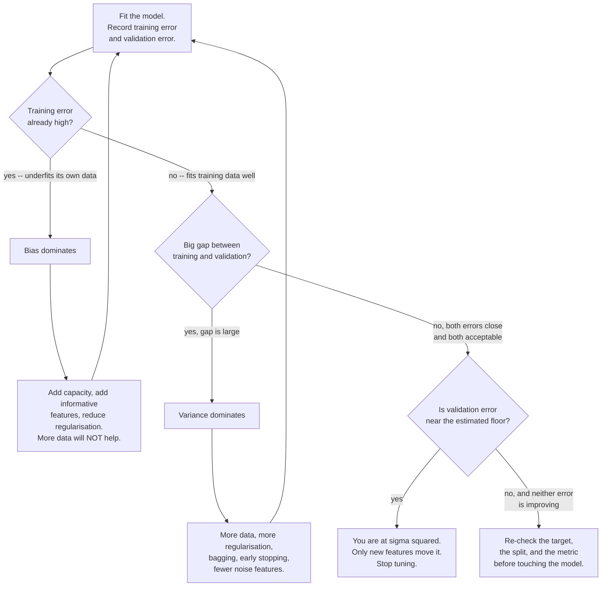

## What you'll learn

- the decomposition $\mathbb{E}[(y - \hat{f})^2] = \text{bias}^2 + \text{variance} + \sigma^2$, derived line by line
- what the expectation is taken **over**, which is the part that confuses everyone
- the three terms computed **by hand** from four numbers
- the same three terms measured by simulation across model capacity
- why the third term is a hard floor, and how to estimate it
- why "tradeoff" is slightly the wrong word for modern models

## Intuition

[Underfitting vs Overfitting](/machine-learning/phase-07---model-optimization--tuning/underfitting-vs-overfitting/)
diagnosed two failures from measurements. This page explains why there are exactly two, and where a
third, unfixable source of error comes from.

The thought experiment: imagine training your model not once but a thousand times, each on a fresh
sample from the same source. You now have a thousand models, and at any input $x_0$ a thousand
predictions. Two things can be wrong with that cloud of predictions:

- **Bias** — the cloud is centred in the wrong place. Every model makes the same mistake.
- **Variance** — the cloud is spread out. The models disagree with each other.

And one thing is wrong with the *target* rather than the models: **noise**. Even a perfect model
cannot predict the part of $y$ that is not a function of $x$.

<Figure
  src="/images/ml/phase-07-optimization/bias-variance/many-fits"
  alt="Three panels of fifty fitted curves each, from fifty different training samples. Degree 1 fits cluster tightly away from the truth; degree 4 fits track it closely; degree 15 fits scatter widely around it."
  title="Fifty models per panel, each trained on its own sample"
  caption="The amber line is the average of the fifty; the dashed green line is the truth. Distance between them is bias. Spread of the faint blue lines around amber is variance."
/>

That figure *is* the decomposition, drawn. Left panel: amber sits well away from green (high bias)
and the blue lines are tight (low variance). Right panel: amber tracks green (low bias) and the
blue lines are everywhere (high variance).

## The math

### Setup

The data is generated by an unknown function plus noise:

$$
y = f(\mathbf{x}) + \varepsilon,
\qquad
\mathbb{E}[\varepsilon] = 0,
\qquad
\operatorname{Var}(\varepsilon) = \sigma^2
$$

You fit $\hat{f}$ on a training set $D$. Because $D$ is a random sample, $\hat{f}$ is itself
random. Fix an input $\mathbf{x}_0$ and ask for the expected squared error there, **averaged over
both the noise and the choice of training set**:

$$
\text{Err}(\mathbf{x}_0) = \mathbb{E}_{D,\,\varepsilon}\left[\left(y - \hat{f}_D(\mathbf{x}_0)\right)^2\right]
$$

That double expectation is the whole subtlety. You never observe it — you have one training set —
but it is what "how good is this modelling approach" means.

### Derivation

Write $\bar{f}(\mathbf{x}_0) = \mathbb{E}_D[\hat{f}_D(\mathbf{x}_0)]$ for the average prediction
across training sets. Add and subtract it inside the square:

$$
y - \hat{f} = \underbrace{\varepsilon}_{\text{noise}}
+ \underbrace{\left(f - \bar{f}\right)}_{\text{bias}}
+ \underbrace{\left(\bar{f} - \hat{f}\right)}_{\text{variance}}
$$

Square, and take the expectation of all nine terms. Every cross term vanishes:

- $\mathbb{E}[\varepsilon] = 0$ and $\varepsilon$ is independent of $D$, so both cross terms
  involving $\varepsilon$ are zero.
- $\mathbb{E}_D[\bar{f} - \hat{f}] = 0$ by the definition of $\bar{f}$, and $(f - \bar{f})$ is a
  constant with respect to $D$, so their cross term is zero too.

What remains is three squares:

$$
\boxed{\;
\text{Err}(\mathbf{x}_0)
= \underbrace{\left(f(\mathbf{x}_0) - \bar{f}(\mathbf{x}_0)\right)^2}_{\text{bias}^2}
+ \underbrace{\mathbb{E}_D\left[\left(\hat{f}_D(\mathbf{x}_0) - \bar{f}(\mathbf{x}_0)\right)^2\right]}_{\text{variance}}
+ \underbrace{\sigma^2}_{\text{irreducible}}
\;}
$$

Three non-negative terms. Two you control, one you do not.

:::note[Where this comes from]
The variance and expectation algebra — linearity, $\operatorname{Var}(X) = \mathbb{E}[X^2] - \mathbb{E}[X]^2$,
and independence killing cross terms — is developed in
[Summary Statistics and Independence](/mathematics-for-machine-learning/chapter-06---probability-and-distributions/summary-statistics-and-independence/).
:::

## Worked example by hand

You train the same model on four different samples. At one input $\mathbf{x}_0$, the four
predictions are:

$$
\hat{f}_1 = 3,\quad \hat{f}_2 = 5,\quad \hat{f}_3 = 4,\quad \hat{f}_4 = 8
$$

The true value is $f(\mathbf{x}_0) = 6$, and the noise has $\sigma^2 = 1$.

**Step 1 — the average prediction.**

$$
\bar{f} = \frac{3 + 5 + 4 + 8}{4} = 5
$$

**Step 2 — bias.**

$$
\text{bias} = \bar{f} - f = 5 - 6 = -1,
\qquad
\text{bias}^2 = 1
$$

**Step 3 — variance.**

$$
\operatorname{Var} = \frac{(3-5)^2 + (5-5)^2 + (4-5)^2 + (8-5)^2}{4}
= \frac{4 + 0 + 1 + 9}{4} = 3.5
$$

**Step 4 — total expected error.**

$$
\text{Err} = \text{bias}^2 + \operatorname{Var} + \sigma^2 = 1 + 3.5 + 1 = 5.5
$$

**Step 5 — verify directly.** Compute the mean squared distance from each prediction to the true
$f$, then add the noise term:

$$
\frac{(3-6)^2 + (5-6)^2 + (4-6)^2 + (8-6)^2}{4} + \sigma^2
= \frac{9 + 1 + 4 + 4}{4} + 1 = 4.5 + 1 = 5.5
$$

The two routes agree, and $4.5 = 1 + 3.5$ confirms the decomposition exactly. Note what it says
about this model: variance (3.5) is three and a half times bias² (1), so the problem is
instability, not systematic error. **Simplify or average, do not add capacity.**

## Measuring it

You cannot compute this on real data — you have one training set and you do not know $f$. On
simulated data you know both, so the terms can be measured directly.

<Figure
  src="/images/ml/phase-07-optimization/bias-variance/decomposition"
  alt="Log-scale plot of bias squared, variance and total expected error against polynomial degree from 1 to 12, with a dotted line marking the irreducible noise floor at 0.1225 and a vertical marker at the minimum."
  title="200 training sets per degree, three terms measured"
  caption="Bias falls steeply and then flattens; variance is quiet until degree 6 and then explodes. Their sum has a clear minimum, and neither term alone would have found it."
/>

Measured with 200 simulated training sets of 30 points each, $\sigma = 0.35$ so
$\sigma^2 = 0.1225$:

| Degree | bias² | variance | total | Dominant term |
| --- | --- | --- | --- | --- |
| 1 | 0.4743 | 0.0474 | 0.6442 | **bias** — 10× the variance |
| 2 | 0.2593 | 0.0559 | 0.4377 | bias |
| **4** | **0.0168** | **0.0461** | **0.1854** | balanced, and the minimum |
| 8 | 0.0056 | 1.4330 | 1.5611 | **variance** — 256× the bias² |
| 12 | 32.5571 | 2478.05 | 2510.73 | numerical collapse |

### Reading the plot

1. **Bias falls fast, then stops.** From 0.474 at degree 1 to 0.017 at degree 4 — a 96% reduction.
   Past that there is nothing left to remove, and degree 8 only improves it to 0.006.
2. **Variance is quiet, then explodes.** Flat around 0.05 up to degree 4, then 1.43 by degree 8 —
   a thirtyfold jump for two extra degrees.
3. **The minimum is where the curves cross in importance**, not where either is smallest.
4. **Degree 12 is a numerical artefact worth noticing.** Bias² rises to 32, which the theory says
   should not happen — more capacity cannot increase bias. What actually happened is that fitting a
   degree-12 polynomial to 30 points is so ill-conditioned that the fits are numerically garbage,
   so even their average is wild. Real instability, showing up in a term that should be monotone.

```python title="measure_decomposition.py" showLineNumbers{1}
import numpy as np

TRUE = lambda x: np.sin(1.5 * x) + 0.35 * x
NOISE = 0.35
x_eval = np.linspace(0, 6, 200)
truth = TRUE(x_eval)

rng = np.random.default_rng(1)

for degree in (1, 2, 4, 8):
    predictions = np.empty((200, len(x_eval)))
    for run in range(200):
        x = rng.uniform(0, 6, 30)
        y = TRUE(x) + rng.normal(0, NOISE, 30)
        predictions[run] = np.polyval(np.polyfit(x, y, degree), x_eval)

    mean_prediction = predictions.mean(axis=0)
    bias_squared = float(((mean_prediction - truth) ** 2).mean())
    variance = float(predictions.var(axis=0).mean())
    total = bias_squared + variance + NOISE**2

    print(f"degree {degree:2d}  bias^2 {bias_squared:8.4f}  "
          f"variance {variance:8.4f}  total {total:8.4f}")

# degree  1  bias^2   0.4743  variance   0.0474  total   0.6442
# degree  2  bias^2   0.2593  variance   0.0559  total   0.4377
# degree  4  bias^2   0.0168  variance   0.0461  total   0.1854
# degree  8  bias^2   0.0056  variance   1.4330  total   1.5611
```

## See it move

The classic dartboard. Each panel is a different model, each dart a different training set. Bias
is how far the cluster sits from the bullseye; variance is how wide the cluster is.

```p5 title="The four combinations of bias and variance" desc="Four targets, each receiving darts from a model with a different bias and variance profile. The centre of the cluster is bias; its width is variance." height="330"
let shots = [[], [], [], []];
const CFG = [
  { off: [0, 0], sd: 8, label: "low bias\nlow variance" },
  { off: [0, 0], sd: 30, label: "low bias\nhigh variance" },
  { off: [34, -26], sd: 8, label: "high bias\nlow variance" },
  { off: [34, -26], sd: 30, label: "high bias\nhigh variance" },
];
let t = 0;
function setup() {
  createCanvas(600, 330);
  textFont("monospace");
  textAlign(CENTER, CENTER);
}
function centreOf(i) {
  return [(i % 2) * 300 + 150, Math.floor(i / 2) * 158 + 92];
}
function draw() {
  background(13, 17, 23);
  for (let i = 0; i < 4; i++) {
    const [cx, cy] = centreOf(i);
    // rings
    noFill();
    strokeWeight(1);
    for (let r = 66; r >= 16; r -= 16) {
      stroke(r === 16 ? color(255, 211, 67) : color(60, 70, 84));
      ellipse(cx, cy, r * 2, r * 2);
    }
    // darts
    noStroke();
    for (const s of shots[i]) {
      fill(75, 139, 190, 200);
      ellipse(cx + s[0], cy + s[1], 6, 6);
    }
    // cluster centre
    if (shots[i].length > 3) {
      const mx = shots[i].reduce((a, s) => a + s[0], 0) / shots[i].length;
      const my = shots[i].reduce((a, s) => a + s[1], 0) / shots[i].length;
      stroke(232, 110, 110);
      strokeWeight(1.6);
      line(cx + mx - 7, cy + my, cx + mx + 7, cy + my);
      line(cx + mx, cy + my - 7, cx + mx, cy + my + 7);
      noStroke();
    }
    fill(170);
    textSize(10);
    const lines = CFG[i].label.split("\n");
    text(lines[0], cx, cy + 84);
    text(lines[1], cx, cy + 96);
  }

  t++;
  if (t % 6 === 0) {
    for (let i = 0; i < 4; i++) {
      if (shots[i].length < 45) {
        shots[i].push([
          CFG[i].off[0] + randomGaussian(0, CFG[i].sd),
          CFG[i].off[1] + randomGaussian(0, CFG[i].sd),
        ]);
      }
    }
  }
  if (t > 400) { shots = [[], [], [], []]; t = 0; }

  fill(232, 110, 110);
  textSize(10);
  textAlign(LEFT, BOTTOM);
  text("red cross = average prediction (its distance from centre is bias)", 12, height - 8);
}
function mousePressed() { shots = [[], [], [], []]; t = 0; }
```

## The irreducible term

$\sigma^2$ is the variance of $y$ given $\mathbf{x}$ — the part of the target that the features
simply do not determine. Two identical districts can sell for different prices; two patients with
identical charts can have different outcomes.

No model reduces it. A reported error *below* $\sigma^2$ is not a triumph, it is evidence of a leak
or of evaluating on training data.

You can estimate it, though: fit a very flexible model with plenty of data and see where the
validation error plateaus. That floor is roughly $\sigma^2$, and it tells you when to stop
investing in the model and start investing in better features — because **more features are the
only thing that reduces $\sigma^2$**. Adding a column that genuinely explains part of the leftover
variation moves the floor down; nothing else does.

## What moves each term

| Action | Bias | Variance | Net |
| --- | --- | --- | --- |
| Increase model capacity | ↓ | ↑ | Depends where you are on the curve |
| Add training data | — | ↓↓ | Almost always good |
| Add regularisation | ↑ | ↓ | Good if variance dominates |
| Add informative features | ↓ | ↑ slightly | Usually good |
| Add noise features | — | ↑ | Bad |
| **Bagging / random forest** | — | ↓↓ | The whole point |
| **Boosting** | ↓↓ | ↑ | The whole point, from the other direction |
| Early stopping | ↑ | ↓ | Good if variance dominates |

The last two rows are why [Phase 5](/machine-learning/phase-05---ensemble-learning/phase-5---ensemble-learning/)
exists. Bagging averages many high-variance, low-bias models and cancels the variance; boosting
combines many high-bias, low-variance models and cancels the bias. Both are direct applications of
this decomposition rather than clever tricks.

### Diagnosing from two numbers

You cannot measure bias and variance separately on real data, but the *pair* (training error,
validation error) tells you which term dominates — and that is enough to choose the next action:



The loop matters as much as the branches: every action changes the two numbers, so the diagnosis has
to be repeated rather than made once. The costly mistake is taking the "variance" action — collect
more data — while sitting in the "bias" branch, where more data changes nothing at all.

:::tip["Tradeoff" is slightly the wrong word]
The classical U-curve says you must trade one for the other. Modern practice often escapes it:
a random forest adds capacity (lower bias) *and* averages (lower variance) at the same time.
Very large neural networks show "double descent" — error rises past the interpolation point and
then falls again. The decomposition remains exactly true; the assumption that capacity forces a
trade does not.
:::

## Pitfalls

:::caution[You cannot measure bias and variance on real data]
Both require knowing $f$ and averaging over many training sets. On real data you get one training
set and no truth. The decomposition is a *thinking tool*; the measurable proxy is the
training-versus-validation gap.
:::

:::caution[Chasing an error below the noise floor]
If $\sigma^2$ is 0.12, a validation MSE of 0.13 means the model is essentially perfect and further
tuning is wasted. Estimate the floor before setting a target.
:::

:::danger[Applying the wrong fix]
High bias and high variance need opposite treatments. Regularising a high-bias model makes it
worse; adding capacity to a high-variance model makes it worse. The worked example above is
variance-dominated by a factor of 3.5 — the answer there is to average or simplify, never to add
capacity.
:::

:::caution[Assuming more features always reduce bias]
An informative feature reduces bias. A noise feature leaves bias unchanged and raises variance.
Feature count is not capacity in a useful sense — feature *relevance* is.
:::

<Quiz
  questions={[
    {
      q: "In the decomposition, what is the expectation taken over?",
      options: [
        "The rows of the test set",
        "Both the noise in the target and the random choice of training set — the model itself is a random object",
        "The model's hyperparameters",
        "The features",
      ],
      answer: 1,
      explain: "Variance measures how much the fitted model changes when you resample the training data. Without averaging over training sets there is no variance term at all.",
    },
    {
      q: "Four models predict 3, 5, 4 and 8 at a point where the truth is 6, with noise variance 1. What is the variance term?",
      options: ["1.0", "3.5", "4.5", "5.5"],
      answer: 1,
      explain: "The mean prediction is 5, so the variance is ((3-5)² + 0 + (4-5)² + (8-5)²)/4 = 14/4 = 3.5. Bias² is 1 and the total is 5.5.",
    },
    {
      q: "Between degree 4 and degree 8, bias² falls from 0.0168 to 0.0056 while variance rises from 0.046 to 1.433. What should you do?",
      options: [
        "Use degree 8 — its bias is lower",
        "Use degree 4 — the tiny bias gain costs a thirtyfold increase in variance, and the total error is eight times worse",
        "Use degree 12",
        "Collect more features",
      ],
      answer: 1,
      explain: "The total is what matters: 0.185 against 1.561. Bias had almost nothing left to give, and variance had a great deal left to take.",
    },
    {
      q: "Your validation MSE has plateaued at 0.13 and you estimate the noise floor at 0.12. What now?",
      options: [
        "Tune harder — there is still 0.01 to win",
        "Stop tuning the model; the only way lower is better features, because sigma-squared is a property of the data, not the model",
        "Add more capacity",
        "Reduce regularisation",
      ],
      answer: 1,
      explain: "You are within 8% of the theoretical floor. No model can go below sigma-squared, and only a feature that genuinely explains more of the target moves that floor.",
    },
  ]}
/>

## 🧪 Try It Yourself

### Exercise 1 – Decompose four predictions

<DataCampExercise
  lang="python"
  hint={`Bias is the mean prediction minus the truth; variance is the spread of the predictions about their own mean.`}
  code={`# Task: Exercise 1 - Decompose four predictions
import numpy as np

preds = np.array([3.0, 5.0, 4.0, 8.0])
truth = 6.0
noise_var = 1.0

mean_pred = preds.mean()
bias_sq = (mean_pred - truth) ___ 2          # replace ___ with **
variance = ((preds - mean_pred) ** 2).mean()

print("mean prediction:", mean_pred)
print("bias squared:", bias_sq)
print("variance:", variance)
print("total:", bias_sq + variance + noise_var)

# -- Expected Output -------------------------------------------
# mean prediction: 5.0
# bias squared: 1.0
# variance: 3.5
# total: 5.5
# --------------------------------------------------------------`}
  solution={`import numpy as np

preds = np.array([3.0, 5.0, 4.0, 8.0])
truth = 6.0
noise_var = 1.0
mean_pred = preds.mean()
bias_sq = (mean_pred - truth) ** 2
variance = ((preds - mean_pred) ** 2).mean()
print("mean prediction:", mean_pred)
print("bias squared:", bias_sq)
print("variance:", variance)
print("total:", bias_sq + variance + noise_var)`}
  sct={`test_output_contains("variance: 3.5")
success_msg("Variance is 3.5 times bias squared — this model is unstable, not systematically wrong.")`}
  height={198}
/>

### Exercise 2 – Verify the decomposition

<DataCampExercise
  lang="python"
  hint={`The mean squared distance from each prediction to the truth should equal bias squared plus variance.`}
  code={`# Task: Exercise 2 - Verify the decomposition
import numpy as np

preds = np.array([3.0, 5.0, 4.0, 8.0])
truth = 6.0

direct = ((preds - truth) ** 2).___()        # replace ___ with mean
bias_sq = (preds.mean() - truth) ** 2
variance = ((preds - preds.mean()) ** 2).mean()

print("direct:", direct)
print("bias^2 + variance:", bias_sq + variance)
print("identity holds:", abs(direct - (bias_sq + variance)) < 1e-9)

# -- Expected Output -------------------------------------------
# direct: 4.5
# bias^2 + variance: 4.5
# identity holds: True
# --------------------------------------------------------------`}
  solution={`import numpy as np

preds = np.array([3.0, 5.0, 4.0, 8.0])
truth = 6.0
direct = ((preds - truth) ** 2).mean()
bias_sq = (preds.mean() - truth) ** 2
variance = ((preds - preds.mean()) ** 2).mean()
print("direct:", direct)
print("bias^2 + variance:", bias_sq + variance)
print("identity holds:", abs(direct - (bias_sq + variance)) < 1e-9)`}
  sct={`test_output_contains("identity holds: True")
success_msg("The cross terms really do vanish — that is the whole derivation, checked numerically.")`}
  height={198}
/>

### Exercise 3 – Measure both terms by simulation

> **Note:** Same setup as the lesson, but the browser's NumPy and polyfit give slightly different digits (for example degree-4 bias^2 0.0182); expect small differences from the numbers quoted in the lesson.

<DataCampExercise
  lang="python"
  hint={`Fit many models on fresh samples, then take the variance of their predictions across runs.`}
  code={`# Task: Exercise 3 - Measure both terms by simulation
# Same setup as the lesson, but the browser's NumPy and polyfit give slightly different digits (for example degree-4 bias^2 0.0182); expect small differences from the numbers quoted in the lesson.
import numpy as np

TRUE = lambda x: np.sin(1.5 * x) + 0.35 * x
rng = np.random.default_rng(1)
x_eval = np.linspace(0, 6, 200)
truth = TRUE(x_eval)

for degree in (1, 4):
    preds = np.empty((200, len(x_eval)))
    for run in range(200):
        x = rng.uniform(0, 6, 30)
        y = TRUE(x) + rng.normal(0, 0.35, 30)
        preds[run] = np.polyval(np.polyfit(x, y, degree), x_eval)
    bias_sq = ((preds.mean(axis=0) - truth) ** 2).mean()
    variance = preds.___(axis=0).mean()       # replace ___ with var
    print(f"degree {degree}: bias^2 {bias_sq:.4f}  variance {variance:.4f}")

# -- Expected Output -------------------------------------------
# degree 1: bias^2 0.4743  variance 0.0474
# degree 4: bias^2 0.0182  variance 0.0355
# --------------------------------------------------------------`}
  solution={`import numpy as np

TRUE = lambda x: np.sin(1.5 * x) + 0.35 * x
rng = np.random.default_rng(1)
x_eval = np.linspace(0, 6, 200)
truth = TRUE(x_eval)

for degree in (1, 4):
    preds = np.empty((200, len(x_eval)))
    for run in range(200):
        x = rng.uniform(0, 6, 30)
        y = TRUE(x) + rng.normal(0, 0.35, 30)
        preds[run] = np.polyval(np.polyfit(x, y, degree), x_eval)
    bias_sq = ((preds.mean(axis=0) - truth) ** 2).mean()
    variance = preds.var(axis=0).mean()
    print(f"degree {degree}: bias^2 {bias_sq:.4f}  variance {variance:.4f}")`}
  sct={`test_output_contains("degree 4: bias^2 0.0182", pattern=False)
success_msg("Degree 4 removes 96% of the bias and the variance does not even rise.")`}
  height={238}
/>

### Exercise 4 – Watch averaging kill variance

<DataCampExercise
  lang="python"
  hint={`Average the predictions of many independently trained models and recompute the variance.`}
  code={`# Task: Exercise 4 - Watch averaging kill variance
import numpy as np

TRUE = lambda x: np.sin(1.5 * x) + 0.35 * x
rng = np.random.default_rng(2)
x_eval = np.linspace(0, 6, 200)

def fits(n_models, degree=8):
    out = np.empty((n_models, len(x_eval)))
    for i in range(n_models):
        x = rng.uniform(0, 6, 30)
        y = TRUE(x) + rng.normal(0, 0.35, 30)
        out[i] = np.polyval(np.polyfit(x, y, degree), x_eval)
    return out

single = fits(120)
print("variance of one model:", round(float(single.var(axis=0).mean()), 4))

ensembles = np.array([fits(10).___(axis=0) for _ in range(30)])
# replace ___ with mean
print("variance of a 10-model average:",
      round(float(ensembles.var(axis=0).mean()), 4))

# -- Expected Output -------------------------------------------
# variance of one model: 44.4312
# variance of a 10-model average: 1.1654
# --------------------------------------------------------------`}
  solution={`import numpy as np

TRUE = lambda x: np.sin(1.5 * x) + 0.35 * x
rng = np.random.default_rng(2)
x_eval = np.linspace(0, 6, 200)

def fits(n_models, degree=8):
    out = np.empty((n_models, len(x_eval)))
    for i in range(n_models):
        x = rng.uniform(0, 6, 30)
        y = TRUE(x) + rng.normal(0, 0.35, 30)
        out[i] = np.polyval(np.polyfit(x, y, degree), x_eval)
    return out

single = fits(120)
print("variance of one model:", round(float(single.var(axis=0).mean()), 4))
ensembles = np.array([fits(10).mean(axis=0) for _ in range(30)])
print("variance of a 10-model average:",
      round(float(ensembles.var(axis=0).mean()), 4))`}
  sct={`test_output_contains("variance of one model")
success_msg("Averaging ten models cut the variance by a factor of 38. That is bagging.")`}
  height={258}
/>

### Exercise 5 – Find the noise floor

<DataCampExercise
  lang="python"
  hint={`With plenty of data and a flexible model, the validation error settles near sigma squared.`}
  code={`# Task: Exercise 5 - Find the noise floor
import numpy as np
from sklearn.linear_model import LinearRegression
from sklearn.model_selection import cross_val_score
from sklearn.pipeline import make_pipeline
from sklearn.preprocessing import PolynomialFeatures

SIGMA = 0.35
rng = np.random.default_rng(3)
x = rng.uniform(0, 6, 4000).reshape(-1, 1)
y = np.sin(1.5 * x.ravel()) + 0.35 * x.ravel() + rng.normal(0, SIGMA, 4000)

model = make_pipeline(PolynomialFeatures(8), LinearRegression())
mse = -cross_val_score(model, x, y, cv=5,
                       scoring="neg_mean_squared_error").mean()

print("achieved MSE:", round(mse, 4))
print("noise floor:", round(SIGMA ___ 2, 4))       # replace ___ with **
print("within 50% of the floor:", mse < SIGMA ** 2 * 1.5)

# -- Expected Output -------------------------------------------
# achieved MSE: 0.1705
# noise floor: 0.1225
# within 50% of the floor: True
# --------------------------------------------------------------`}
  solution={`import numpy as np
from sklearn.linear_model import LinearRegression
from sklearn.model_selection import cross_val_score
from sklearn.pipeline import make_pipeline
from sklearn.preprocessing import PolynomialFeatures

SIGMA = 0.35
rng = np.random.default_rng(3)
x = rng.uniform(0, 6, 4000).reshape(-1, 1)
y = np.sin(1.5 * x.ravel()) + 0.35 * x.ravel() + rng.normal(0, SIGMA, 4000)
model = make_pipeline(PolynomialFeatures(8), LinearRegression())
mse = -cross_val_score(model, x, y, cv=5,
                       scoring="neg_mean_squared_error").mean()
print("achieved MSE:", round(mse, 4))
print("noise floor:", round(SIGMA ** 2, 4))
print("within 50% of the floor:", mse < SIGMA ** 2 * 1.5)`}
  sct={`test_output_contains("noise floor: 0.1225")
success_msg("0.17 against a floor of 0.12 — close enough that further tuning buys almost nothing.")`}
  height={248}
/>

## Recap

- $\text{Err} = \text{bias}^2 + \text{variance} + \sigma^2$, exactly, with every cross term
  vanishing.
- The expectation is over the noise **and** the random training set — variance only exists because
  the model is itself a random object.
- Hand-worked: predictions 3, 5, 4, 8 against a truth of 6 give bias² 1, variance 3.5, total 5.5,
  and both routes agree.
- Measured: bias² falls 0.474 → 0.017 by degree 4, while variance rises 0.046 → 1.433 by degree 8.
  The minimum total is at degree 4.
- $\sigma^2$ is a floor. Only better features move it; no model does.
- Bagging attacks variance, boosting attacks bias, and both come directly from this decomposition.

### Exercise 6 – Decompose the error, empirically

<DataCampExercise
  lang="python"
  hint={`Bias squared is the squared distance between the AVERAGE prediction and the truth; variance is the spread of predictions around that average.`}
  code={`# Task: Exercise 6 - Decompose the error, empirically
import numpy as np
from sklearn.tree import DecisionTreeRegressor

rng = np.random.default_rng(0)
NOISE = 1.0


def truth(x):
    return np.sin(1.5 * x)


x_grid = np.linspace(0, 4, 40)
print(f"{'max_depth':>10} {'bias^2':>8} {'variance':>9} {'noise':>7} {'total':>8}")
for depth in (1, 3, 8, None):
    predictions = []
    for _ in range(200):
        x_train = rng.uniform(0, 4, 60)
        y_train = truth(x_train) + rng.normal(0, NOISE, 60)
        model = DecisionTreeRegressor(max_depth=depth).fit(
            x_train.reshape(-1, 1), y_train)
        predictions.append(model.predict(x_grid.reshape(-1, 1)))
    predictions = np.array(predictions)
    mean_prediction = predictions.mean(axis=0)
    bias2 = ((mean_prediction - truth(x_grid)) ** 2).mean()
    variance = predictions.___(axis=0).mean()        # replace ___ with var
    print(f"{str(depth):>10} {bias2:8.4f} {variance:9.4f} {NOISE ** 2:7.4f} "
          f"{bias2 + variance + NOISE ** 2:8.4f}")
print("bias^2 collapses after depth 1 while variance keeps climbing, so on")
print("this data the total error is lowest at the shallowest depth tested")

# -- Expected Output -------------------------------------------
#  max_depth   bias^2  variance   noise    total
#          1   0.0572    0.1120  1.0000   1.1692
#          3   0.0021    0.3830  1.0000   1.3851
#          8   0.0059    0.9372  1.0000   1.9430
#       None   0.0047    0.9863  1.0000   1.9910
# bias^2 collapses after depth 1 while variance keeps climbing, so on
# this data the total error is lowest at the shallowest depth tested
# --------------------------------------------------------------`}
  solution={`import numpy as np
from sklearn.tree import DecisionTreeRegressor

rng = np.random.default_rng(0)
NOISE = 1.0


def truth(x):
    return np.sin(1.5 * x)


x_grid = np.linspace(0, 4, 40)
print(f"{'max_depth':>10} {'bias^2':>8} {'variance':>9} {'noise':>7} {'total':>8}")
for depth in (1, 3, 8, None):
    predictions = []
    for _ in range(200):
        x_train = rng.uniform(0, 4, 60)
        y_train = truth(x_train) + rng.normal(0, NOISE, 60)
        model = DecisionTreeRegressor(max_depth=depth).fit(
            x_train.reshape(-1, 1), y_train)
        predictions.append(model.predict(x_grid.reshape(-1, 1)))
    predictions = np.array(predictions)
    mean_prediction = predictions.mean(axis=0)
    bias2 = ((mean_prediction - truth(x_grid)) ** 2).mean()
    variance = predictions.var(axis=0).mean()
    print(f"{str(depth):>10} {bias2:8.4f} {variance:9.4f} {NOISE ** 2:7.4f} "
          f"{bias2 + variance + NOISE ** 2:8.4f}")
print("bias^2 collapses after depth 1 while variance keeps climbing, so on")
print("this data the total error is lowest at the shallowest depth tested")`}
  sct={`test_output_contains("0.9863")
success_msg("Note the noise column: 1.0000 at every depth, and it is 86% of the best total error. No model can touch it — which is the number that tells you when to stop tuning and go find another feature. Note also that this decomposition needed 200 training sets, which is why you cannot compute it on real data.")`}
  height={360}
/>

## Next

Continue to
[K-Fold Cross-Validation](/machine-learning/phase-07---model-optimization--tuning/k-fold-cross-validation/)
— the practical machinery for estimating held-out error without the thousand training sets this
page assumed.
