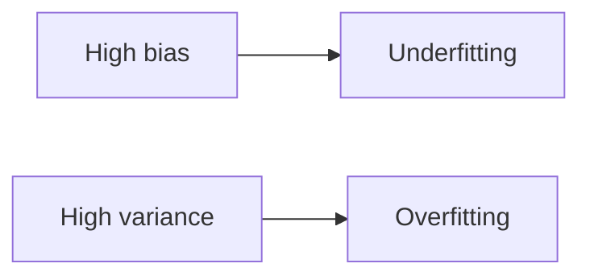

"Underfitting" and "overfitting" are the symptoms; **bias** and **variance** are the
disease. Every prediction error a model makes can be split into three ingredients, and
two of them are under your control. Understanding which one is hurting you tells you
exactly what to fix — more data, a simpler model, a more flexible one, or nothing at
all (some error is just noise).

## Two ways models can be wrong

### Bias (systematic error)

High bias means the model is too simple and misses real patterns.

- underfits
- training error is high
- validation error is high

### Variance (sensitivity to noise)

High variance means the model is too complex and learns noise.

- overfits
- training error is low
- validation error is high



:::tip[From the book]
*Hands-On Machine Learning* shows that a model's generalization error is the sum of
**three** components, not two: **bias** ("due to wrong assumptions, such as assuming
the data is linear when it is actually quadratic"), **variance** ("due to the model's
excessive sensitivity to small variations in the training data" — a high-degree
polynomial is the textbook example), and **irreducible error** (noise in the data
itself, which no model can remove — only cleaner data helps). The book's punchline:
"Increasing a model's complexity will typically increase its variance and reduce its
bias. Conversely, reducing a model's complexity increases its bias and reduces its
variance. This is why it is called a trade-off."
:::

## The tradeoff

As model complexity increases:

- bias tends to decrease
- variance tends to increase

Goal: find a sweet spot.

## How to reduce bias

- add more features
- use a more flexible model
- reduce regularization

## How to reduce variance

- collect more data
- increase regularization
- simplify the model
- use bagging/ensembles

## Runnable example: watching bias and variance move

Train the same polynomial model on several different random samples of noisy data.
**Bias** shows up as how far the *average* prediction is from the truth; **variance**
shows up as how much the predictions *disagree* with each other across samples:

```python title="bias_variance_demo.py" showLineNumbers{1}
import numpy as np
from sklearn.linear_model import LinearRegression
from sklearn.pipeline import Pipeline
from sklearn.preprocessing import PolynomialFeatures

rng = np.random.RandomState(0)
x_test = np.array([[0.0]])          # the single point we probe
true_value = 2.0                     # f(0) = 2 for y = 0.5x^2 + x + 2

def sample_predictions(degree, n_datasets=200, n_points=30):
    preds = []
    for _ in range(n_datasets):
        X = 6 * rng.rand(n_points, 1) - 3
        y = 0.5 * X**2 + X + 2 + rng.randn(n_points, 1) * 0.5
        model = Pipeline([
            ("poly", PolynomialFeatures(degree=degree, include_bias=False)),
            ("lin_reg", LinearRegression()),
        ])
        model.fit(X, y)
        preds.append(model.predict(x_test)[0, 0])
    preds = np.array(preds)
    bias_sq = (preds.mean() - true_value) ** 2
    variance = preds.var()
    return bias_sq, variance

for degree in [1, 2, 15]:
    bias_sq, variance = sample_predictions(degree)
    print(f"degree={degree:>2}  bias^2={bias_sq:.3f}  variance={variance:.3f}")
```

```
degree= 1  bias^2=0.482  variance=0.019
degree= 2  bias^2=0.001  variance=0.031
degree=15  bias^2=0.006  variance=1.744
```

Notice the shape: the straight line (`degree=1`) has the highest bias but low variance
— a stable, wrong answer. The degree-15 polynomial has near-zero bias but its
predictions swing wildly from dataset to dataset — high variance. Degree 2 (the true
shape of the data) minimizes both.

## Visualize it

The classic dartboard view: each target represents where predictions land across many
different training sets, with the bullseye being the true value. Low bias means shots
cluster near the bullseye; low variance means shots cluster tightly *together* —
these are independent axes:

```p5 title="Bias vs variance dartboard" desc="Darts are thrown one at a time onto each board, then the round fades and rethrows — bias controls how close to the bullseye, variance controls how tight the cluster is." height="320"
let boards = [];
const N = 14;          // darts per board
const THROW_GAP = 9;   // frames between darts landing
const HOLD = 110;      // frames the full board stays visible
const FADE = 40;       // frames to fade out before the loop restarts
const PERIOD = N * THROW_GAP + HOLD + FADE;

function setup() {
  createCanvas(600, 320);
  textFont("monospace");
  textAlign(CENTER, CENTER);
  noStroke();
  randomSeed(7);
  const specs = [
    { cx: 150, cy: 110, r: 62, biasOff: 0, spread: 14, label: "Low bias, low variance" },
    { cx: 430, cy: 110, r: 62, biasOff: 0, spread: 46, label: "Low bias, high variance" },
    { cx: 150, cy: 250, r: 62, biasOff: 60, spread: 14, label: "High bias, low variance" },
    { cx: 430, cy: 250, r: 62, biasOff: 60, spread: 46, label: "High bias, high variance" },
  ];
  for (const s of specs) {
    const darts = [];
    for (let i = 0; i < N; i++) {
      const a = (i / N) * TWO_PI + random(-0.3, 0.3);
      const jr = s.spread * (0.35 + 0.65 * random());
      darts.push({
        dx: s.biasOff + Math.cos(a) * jr,
        dy: Math.cos(a * 1.3) * jr * 0.6 + Math.sin(a) * jr * 0.4,
      });
    }
    boards.push({ ...s, darts });
  }
}
function easeOutBack(x) {
  const c1 = 1.70158, c3 = c1 + 1;
  return 1 + c3 * Math.pow(x - 1, 3) + c1 * Math.pow(x - 1, 2);
}
function drawRings(cx, cy, r) {
  noFill();
  stroke(60, 70, 86);
  strokeWeight(1);
  for (let k = 3; k >= 1; k--) ellipse(cx, cy, (r * 2 * k) / 3, (r * 2 * k) / 3);
  stroke(255, 211, 67);
  strokeWeight(1.5);
  line(cx - 6, cy, cx + 6, cy);
  line(cx, cy - 6, cx, cy + 6);
}
function draw() {
  background(13, 17, 23);
  const phase = frameCount % PERIOD;
  const fadeStart = N * THROW_GAP + HOLD;
  const alpha = phase >= fadeStart ? 255 * (1 - (phase - fadeStart) / FADE) : 255;

  for (const b of boards) {
    drawRings(b.cx, b.cy, b.r);
    for (let i = 0; i < b.darts.length; i++) {
      const appear = i * THROW_GAP;
      if (phase < appear) continue;
      const local = constrain((phase - appear) / 14, 0, 1);
      const eased = easeOutBack(local);
      const d = b.darts[i];
      const x = b.cx + d.dx * eased;
      const y = lerp(b.cy - b.r - 50, b.cy + d.dy, eased);
      noStroke();
      fill(75, 139, 190, alpha);
      ellipse(x, y, 8, 8);
    }
    fill(210, alpha);
    textSize(12);
    text(b.label, b.cx, b.cy + b.r + 24);
  }
}
```

## Mini-checkpoint

If training and validation accuracy are both low:

- bias or variance?

(Usually bias / underfitting.)

import DataCampExercise from "../../../../components/DataCampExercise.astro";

## 🧪 Try It Yourself

### Exercise 1 – Measure Bias with Average Prediction

<DataCampExercise
  lang="python"
  hint={`Bias is the gap between the *average* prediction across models and the true value: \`preds.mean() - true_value\`.`}
  code={`# Task: Exercise 1 – Measure Bias with Average Prediction
import numpy as np

true_value = 10.0
preds = np.array([7.9, 8.1, 8.0, 7.8, 8.2])   # a consistently low model

bias = preds.___() - true_value   # replace ___ with mean
print(f"bias: {bias:.1f}")

# ── Expected Output ───────────────────────────────────────────
# bias: -2.0
# ──────────────────────────────────────────────────────────────`}
  solution={`import numpy as np

true_value = 10.0
preds = np.array([7.9, 8.1, 8.0, 7.8, 8.2])

bias = preds.mean() - true_value
print(f"bias: {bias:.1f}")`}
  sct={`test_output_contains("bias: -2.0")
success_msg("You measured the bias correctly!")`}
  height={148}
/>

### Exercise 2 – Measure Variance Across Models

<DataCampExercise
  lang="python"
  hint={`Variance is how spread out the predictions are: \`preds.var()\`.`}
  code={`# Task: Exercise 2 – Measure Variance Across Models
import numpy as np

preds_stable = np.array([9.9, 10.1, 10.0, 9.8, 10.2])
preds_wild = np.array([2.0, 18.0, 5.0, 15.0, 9.0])

var_stable = preds_stable.___()   # replace ___ with var
var_wild = preds_wild.___()       # replace ___ with var
print(f"stable variance: {var_stable:.2f}")
print(f"wild variance: {var_wild:.2f}")

# ── Expected Output ───────────────────────────────────────────
# stable variance: 0.02
# wild variance: 32.24
# ──────────────────────────────────────────────────────────────`}
  solution={`import numpy as np

preds_stable = np.array([9.9, 10.1, 10.0, 9.8, 10.2])
preds_wild = np.array([2.0, 18.0, 5.0, 15.0, 9.0])

var_stable = preds_stable.var()
var_wild = preds_wild.var()
print(f"stable variance: {var_stable:.2f}")
print(f"wild variance: {var_wild:.2f}")`}
  sct={`test_output_contains("stable variance:")
test_output_contains("wild variance:")
success_msg("High variance means predictions disagree across models!")`}
  height={158}
/>

### Exercise 3 – Choose the Fix

<DataCampExercise
  lang="python"
  hint={`High bias -> add capacity (higher degree). High variance -> regularize or simplify.`}
  code={`# Task: Exercise 3 – Choose the Fix
bias_sq = 0.02
variance = 4.5

# replace ___ with "reduce complexity" or "increase complexity"
if variance > bias_sq:
    fix = ___
else:
    fix = "increase complexity"

print("Recommended fix:", fix)

# ── Expected Output ───────────────────────────────────────────
# Recommended fix: reduce complexity
# ──────────────────────────────────────────────────────────────`}
  solution={`bias_sq = 0.02
variance = 4.5

if variance > bias_sq:
    fix = "reduce complexity"
else:
    fix = "increase complexity"

print("Recommended fix:", fix)`}
  sct={`test_output_contains("reduce complexity")
success_msg("High variance calls for a simpler, more regularized model!")`}
  height={158}
/>

## Next

Continue to **K-Fold Cross-Validation** — a more reliable way to actually measure
bias and variance than a single train/validation split.
