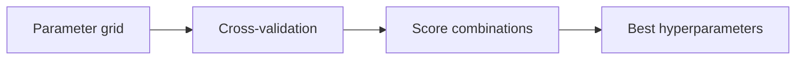

Once cross-validation gives you a trustworthy score, the obvious next question is:
which hyperparameters produce the best score? Hand-tweaking values one at a time is
slow and easy to get wrong. `GridSearchCV` automates it — you describe the grid of
values to try, and it fits and cross-validates every combination for you.

## What hyperparameters are

Hyperparameters are settings you choose before training.

Examples:

- max_depth in a tree
- C in SVM
- number of neighbors in KNN

They affect bias/variance strongly.

## Grid search idea

Try all combinations in a parameter grid.



:::tip[From the book]
*Hands-On Machine Learning* tunes a `RandomForestRegressor` with a grid of
`n_estimators` and `max_features` (plus a second dict trying `bootstrap=False`) — 12 +
6 = 18 combinations, each evaluated with 5-fold CV, for **18 × 5 = 90 rounds of
training**. `grid_search.best_params_` returned `{'max_features': 8, 'n_estimators':
30}`, improving RMSE from the default's 50,182 down to 49,682. The book's warning:
"Since 8 and 30 are the maximum values that were evaluated, you should probably try
searching again with higher values; the score may continue to improve" — always check
whether the winning value sits at the *edge* of your grid.
:::

## Scikit-learn example

```python title="GridSearchCV" showLineNumbers{1}
from sklearn.model_selection import GridSearchCV
from sklearn.svm import SVC

params = {
    "C": [0.1, 1, 10],
    "gamma": ["scale", 0.01, 0.1],
    "kernel": ["rbf"],
}

grid = GridSearchCV(
    estimator=SVC(),
    param_grid=params,
    cv=5,
    scoring="accuracy",
    n_jobs=-1,
)

grid.fit(X, y)
print("best params:", grid.best_params_)
print("best score:", grid.best_score_)
```

## Visualize it

Under the hood, a grid search is just a nested loop: for every cell in the grid, fit
the model on each CV fold and average the score. The heatmap below sweeps that grid
cell by cell — exactly the order `GridSearchCV` evaluates them in — using the book's
own `RandomForestRegressor` numbers (RMSE, lower is better) for `max_features` ×
`n_estimators`. Watch the scanner land on every cell, then settle on the winner:

```p5 title="Grid search sweeping a heatmap" desc="A scanner sweeps every max_features x n_estimators cell in reading order, coloring it by RMSE, then glows gold on the winning combination." height="320"
const ROWS = 4, COLS = 3;
const maxFeaturesVals = [2, 4, 6, 8];
const nEstimatorsVals = [3, 10, 30];
const rmse = [
  [63669.06, 55627.16, 53384.58],
  [60965.99, 52740.98, 50377.34],
  [58663.85, 52006.15, 50146.47],
  [57869.26, 51711.09, 49682.25],
];
let rmin, rmax;
const bestR = 3, bestC = 2;

function setup() {
  createCanvas(600, 320);
  textFont("monospace");
  textAlign(CENTER, CENTER);
  rmin = Infinity;
  rmax = -Infinity;
  for (const row of rmse) {
    for (const v of row) {
      rmin = Math.min(rmin, v);
      rmax = Math.max(rmax, v);
    }
  }
}
function cellColor(v) {
  const t = (rmax - v) / (rmax - rmin);
  const r = lerp(60, 255, t);
  const g = lerp(75, 211, t);
  const b = lerp(95, 67, t);
  return color(r, g, b);
}

const CELL_FRAMES = 9;
const SWEEP = ROWS * COLS * CELL_FRAMES;
const HOLD = 90;
const FADE = 35;
const PERIOD = SWEEP + HOLD + FADE;

function draw() {
  background(13, 17, 23);
  const phase = frameCount % PERIOD;
  const gx = 100, gy = 60, gw = 400, gh = 200;
  const cw = gw / COLS, ch = gh / ROWS;

  const sweeping = phase < SWEEP;
  const visitedCount = sweeping ? Math.floor(phase / CELL_FRAMES) : ROWS * COLS;
  const fadeAlpha = phase >= SWEEP + HOLD ? 255 * (1 - (phase - SWEEP - HOLD) / FADE) : 255;

  noStroke();
  fill(200, fadeAlpha);
  textSize(11);
  textAlign(CENTER, CENTER);
  text("n_estimators", gx + gw / 2, gy - 34);

  push();
  translate(gx - 65, gy + gh / 2);
  rotate(-HALF_PI);
  fill(200, fadeAlpha);
  text("max_features", 0, 0);
  pop();

  for (let r = 0; r < ROWS; r++) {
    for (let c = 0; c < COLS; c++) {
      const idx = r * COLS + c;
      const cx = gx + c * cw, cy = gy + r * ch;
      const visited = idx < visitedCount;
      noStroke();
      if (visited) {
        const col_ = cellColor(rmse[r][c]);
        fill(red(col_), green(col_), blue(col_), fadeAlpha);
      } else {
        fill(30, 34, 42, fadeAlpha);
      }
      rect(cx + 2, cy + 2, cw - 4, ch - 4, 4);

      if (sweeping && idx === visitedCount) {
        noFill();
        stroke(255, 211, 67, fadeAlpha);
        strokeWeight(2 + Math.sin(frameCount * 0.6) * 1.2);
        rect(cx + 2, cy + 2, cw - 4, ch - 4, 4);
      }

      if (!sweeping && r === bestR && c === bestC) {
        noFill();
        stroke(255, 211, 67, fadeAlpha * (0.6 + 0.4 * Math.sin(frameCount * 0.15)));
        strokeWeight(3);
        rect(cx + 1, cy + 1, cw - 2, ch - 2, 5);
      }

      if (visited) {
        noStroke();
        fill(15, 17, 21, fadeAlpha);
        textSize(9);
        text(Math.round(rmse[r][c]), cx + cw / 2, cy + ch / 2);
      }
    }
    noStroke();
    fill(200, fadeAlpha);
    textSize(10);
    text(maxFeaturesVals[r], gx - 20, gy + r * ch + ch / 2);
  }
  for (let c = 0; c < COLS; c++) {
    noStroke();
    fill(200, fadeAlpha);
    textSize(10);
    text(nEstimatorsVals[c], gx + c * cw + cw / 2, gy - 14);
  }

  fill(230, fadeAlpha);
  textSize(12);
  if (sweeping) {
    const r = Math.min(Math.floor(visitedCount / COLS), ROWS - 1);
    const c = visitedCount % COLS;
    text(
      "testing max_features=" + maxFeaturesVals[r] + ", n_estimators=" + nEstimatorsVals[c] + " ...",
      gx + gw / 2,
      gy + gh + 30
    );
  } else {
    text(
      "best: max_features=" + maxFeaturesVals[bestR] + ", n_estimators=" + nEstimatorsVals[bestC] + " (RMSE " + rmse[bestR][bestC] + ")",
      gx + gw / 2,
      gy + gh + 30
    );
  }
}
```

## Searching more than one grid at once

`param_grid` doesn't have to be a single dict — pass a **list** of dicts and
`GridSearchCV` evaluates each dict as its own mini grid, back to back. The book uses
this to test the `bootstrap=False` variant separately, since it doesn't make sense to
combine it with the default grid:

```python title="multiple_param_grids.py" showLineNumbers{1}
from sklearn.model_selection import GridSearchCV
from sklearn.ensemble import RandomForestRegressor

param_grid = [
    {"n_estimators": [3, 10, 30], "max_features": [2, 4, 6, 8]},
    {"bootstrap": [False], "n_estimators": [3, 10], "max_features": [2, 3, 4]},
]

forest_reg = RandomForestRegressor(random_state=42)
grid_search = GridSearchCV(
    forest_reg,
    param_grid,
    cv=5,
    scoring="neg_mean_squared_error",
    return_train_score=True,
)
grid_search.fit(X_train, y_train)
print("best params:", grid_search.best_params_)
```

The first dict alone is 3 × 4 = 12 combinations; the second is 1 × 2 × 3 = 6 more —
**18 combinations total**, each trained 5 times for cross-validation, for **90 rounds
of training** in one `.fit()` call.

## Reading every combination, not just the winner

`grid_search.cv_results_` holds the score for *every* combination that was tried, which
lets you sanity-check the whole search instead of trusting one number:

```python title="inspect_cv_results.py" showLineNumbers{1}
import numpy as np

cvres = grid_search.cv_results_
for mean_score, params in zip(cvres["mean_test_score"], cvres["params"]):
    print(np.sqrt(-mean_score), params)

# ── Sample output (from the book) ──────────────────────────────
# 63669.05791727153 {'max_features': 2, 'n_estimators': 3}
# 55627.16171305252 {'max_features': 2, 'n_estimators': 10}
# 53384.57867637289 {'max_features': 2, 'n_estimators': 30}
# ...
# 49682.25345942335 {'max_features': 8, 'n_estimators': 30}
# ────────────────────────────────────────────────────────────────
```

Because `scoring="neg_mean_squared_error"` returns *negative* MSE (Scikit-learn's
convention is that higher scores are always better), you flip the sign and take the
square root to get back to RMSE.

Once fitting finishes, `grid_search.best_estimator_` is ready to use immediately — by
default `GridSearchCV` is created with `refit=True`, so after finding the best
combination via cross-validation it automatically **retrains that combination on the
whole training set**, which usually improves performance further since it's seeing
more data. If you also passed `RandomForestRegressor` as the estimator, the winning
model exposes `feature_importances_`, a quick way to see which columns actually
mattered to the tuned model:

```python title="feature_importances.py" showLineNumbers{1}
feature_importances = grid_search.best_estimator_.feature_importances_
sorted(zip(feature_importances, feature_names), reverse=True)[:3]
# [(0.366, "median_income"), (0.165, "INLAND"), (0.109, "pop_per_hhold")]
```

## Limitations

Grid search becomes expensive when:

- you have many parameters
- each parameter has many values

That's where RandomizedSearchCV helps.

## Mini-checkpoint

If you have 5 parameters with 10 options each:

- grid size = 10^5 = 100,000 runs (too much).

import DataCampExercise from "../../../../components/DataCampExercise.astro";

## 🧪 Try It Yourself

### Exercise 1 – Build a Parameter Grid

<DataCampExercise
  lang="python"
  hint={`A param_grid is a dict mapping hyperparameter names to lists of values to try.`}
  code={`# Task: Exercise 1 – Build a Parameter Grid
param_grid = {
    "n_estimators": [10, 30],
    "___": [2, 4, 6],   # replace ___ with max_features
}

n_combinations = 1
for values in param_grid.values():
    n_combinations *= len(values)

print("Total combinations:", n_combinations)

# ── Expected Output ───────────────────────────────────────────
# Total combinations: 6
# ──────────────────────────────────────────────────────────────`}
  solution={`param_grid = {
    "n_estimators": [10, 30],
    "max_features": [2, 4, 6],
}

n_combinations = 1
for values in param_grid.values():
    n_combinations *= len(values)

print("Total combinations:", n_combinations)`}
  sct={`test_output_contains("Total combinations: 6")
success_msg("2 x 3 = 6 combinations, exactly as GridSearchCV would explore!")`}
  height={158}
/>

### Exercise 2 – Fit GridSearchCV and Read the Winner

<DataCampExercise
  lang="python"
  hint={`After \`grid.fit(X, y)\`, the best combination is in \`grid.best_params_\`.`}
  code={`# Task: Exercise 2 – Fit GridSearchCV and Read the Winner
from sklearn.model_selection import GridSearchCV
from sklearn.tree import DecisionTreeClassifier
from sklearn.datasets import make_classification

X, y = make_classification(n_samples=200, n_features=4, random_state=42)
param_grid = {"max_depth": [2, 4, 8]}

grid = GridSearchCV(DecisionTreeClassifier(random_state=42), param_grid, cv=3)
grid.___(X, y)   # replace ___ with fit
print("Best max_depth:", grid.best_params_["max_depth"])

# ── Expected Output ───────────────────────────────────────────
# Best max_depth: 4
# ──────────────────────────────────────────────────────────────`}
  solution={`from sklearn.model_selection import GridSearchCV
from sklearn.tree import DecisionTreeClassifier
from sklearn.datasets import make_classification

X, y = make_classification(n_samples=200, n_features=4, random_state=42)
param_grid = {"max_depth": [2, 4, 8]}

grid = GridSearchCV(DecisionTreeClassifier(random_state=42), param_grid, cv=3)
grid.fit(X, y)
print("Best max_depth:", grid.best_params_["max_depth"])`}
  sct={`test_output_contains("Best max_depth:")
success_msg("You found the best hyperparameter with cross-validation!")`}
  height={168}
/>

### Exercise 3 – Check for an Edge-of-Grid Result

<DataCampExercise
  lang="python"
  hint={`If the best value equals the maximum in your list, the book warns you should expand the grid and search again.`}
  code={`# Task: Exercise 3 – Check for an Edge-of-Grid Result
tried_values = [3, 10, 30]
best_value = 30

# replace ___ with tried_values[-1]
at_edge = best_value == ___
print("Should search higher values:", at_edge)

# ── Expected Output ───────────────────────────────────────────
# Should search higher values: True
# ──────────────────────────────────────────────────────────────`}
  solution={`tried_values = [3, 10, 30]
best_value = 30

at_edge = best_value == tried_values[-1]
print("Should search higher values:", at_edge)`}
  sct={`test_output_contains("Should search higher values: True")
success_msg("Always widen the grid when the winner sits at the edge!")`}
  height={148}
/>

## Next

Continue to **RandomizedSearchCV for Large Parameter Spaces** — for when the grid
gets too big to search exhaustively.
