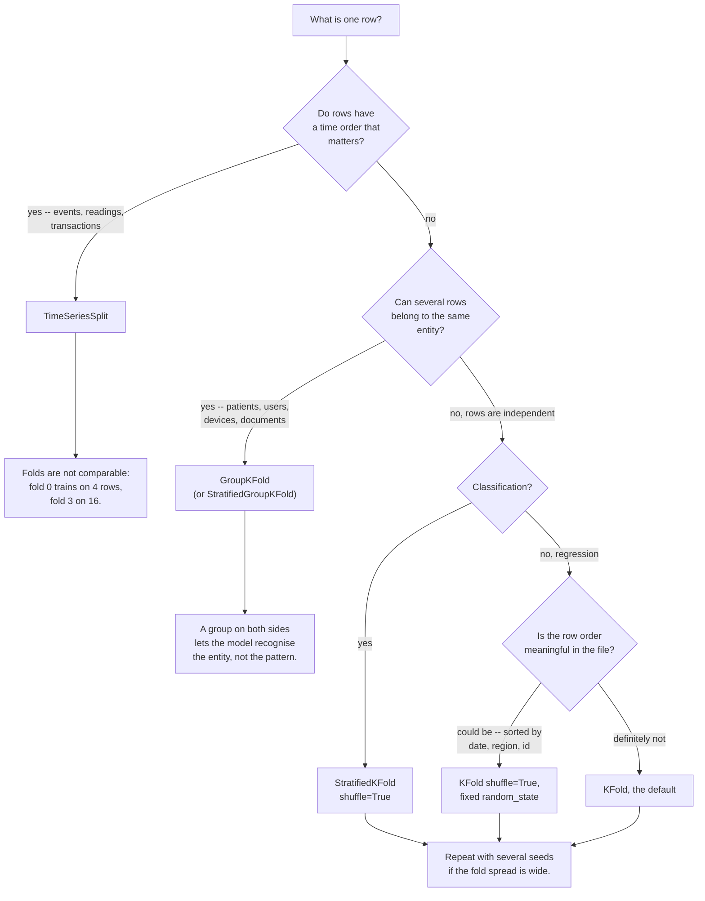

import DataCampExercise from "../../../../components/DataCampExercise.astro";
import Figure from "../../../../components/Figure.astro";
import Quiz from "../../../../components/Quiz.astro";

## What you'll learn

- how much a reported score moves purely by changing the random seed — measured
- the k-fold procedure, and why every row is validated exactly once
- how to choose $k$, with the bias-variance argument behind the usual answer of 5 or 10
- the **standard deviation across folds**, which is the number people forget to report
- four splitters — plain, stratified, grouped and time-series — and when each is mandatory
- `cross_validate` for several metrics and train scores in one pass

## Intuition

You split 80/20, train, score, and report 0.9737.

Change `random_state` from 0 to 1 and rerun. Now it is 0.9561. Neither number is wrong; both are
measurements of the same model on different samples of the same data. Reporting either alone
presents a coin flip as a fact.

Cross-validation replaces one measurement with $k$ of them, each on a different fifth of the data,
and reports the mean. It also gives you something a single split never can: **a spread**, which is
how you know whether a difference between two models is real.

<Figure
  src="/images/ml/phase-07-optimization/cross-validation/fold-diagram"
  alt="Five rows of forty cells each. In each row a different contiguous fifth is amber (validation) and the rest blue (training), with a score label on the right."
  title="5-fold cross-validation"
  caption="Every row is validated exactly once and trained on four times. Five scores come out, and both their mean and their spread are meaningful."
/>

## How much does a single split move?

<Figure
  src="/images/ml/phase-07-optimization/cross-validation/single-split-variance"
  alt="Two overlaid histograms of reported accuracy across 60 random seeds. The single-split distribution is wide, spanning 0.947 to 1.000; the 5-fold mean distribution is narrow, spanning 0.968 to 0.984."
  title="The same model and data, 60 different random seeds"
  caption="A single 80/20 split reports anywhere from 0.9474 to 1.0000 — a spread of 5.3 points. The 5-fold mean spans 0.9684 to 0.9842, and its standard deviation is 3.5 times smaller."
/>

| | Mean | Std dev | Observed range |
| --- | --- | --- | --- |
| Single 80/20 split | 0.9785 | **0.0118** | 0.9474 – 1.0000 |
| 5-fold CV mean | 0.9773 | **0.0034** | 0.9684 – 0.9842 |

### Reading the plot

1. **The single split reaches 1.0000 on some seeds.** Perfect accuracy, from a model that averages
   0.978. Pick that seed and report it and you are not lying, exactly — but nobody could reproduce
   it.
2. **The spread is 5.3 points wide.** Two models differing by 2 points cannot be distinguished on a
   single split of this dataset.
3. **CV reduces the standard deviation by 3.5×.** Not by being cleverer, but by averaging five
   measurements instead of taking one — the same $1/\sqrt{k}$ that governs any mean.
4. **The means agree** (0.9785 against 0.9773). CV is not more optimistic or more pessimistic; it
   is more precise.

## The math

Given $k$ fold scores $s_1, \ldots, s_k$:

$$
\bar{s} = \frac{1}{k}\sum_{i=1}^{k} s_i
\qquad
\text{sd} = \sqrt{\frac{1}{k}\sum_{i=1}^{k}\left(s_i - \bar{s}\right)^2}
$$

Report both. **"0.85 ± 0.07" and "0.85 ± 0.005" describe very different situations**, and only the
first tells you a rival at 0.87 might be noise.

### Choosing k

$k$ trades three things against each other:

| $k$ | Training set per fold | Bias of the estimate | Variance of the estimate | Cost |
| --- | --- | --- | --- | --- |
| 2 | 50% | High — trained on half the data | Low | 2 fits |
| 5 | 80% | Small | Moderate | 5 fits |
| 10 | 90% | Smaller | Moderate | 10 fits |
| $n$ (leave-one-out) | $n-1$ | Almost none | **High** | $n$ fits |

Small $k$ means each model trains on less data, so it underperforms the model you will actually
ship — a pessimistic bias. Large $k$ removes that bias, but the $k$ training sets then overlap
almost completely, so their scores are highly correlated and averaging them removes less noise than
you would expect.

**Leave-one-out is the surprise.** It sounds like the gold standard and is usually a poor choice:
$n$ fits, and $n$ nearly identical models, so the variance of the estimate stays high. Use it only
when $n$ is tiny.

**5 or 10 is the answer** for almost everything, and 5 is fine.

## Worked example by hand

Five fold scores from a classifier:

$$
[\,0.80,\; 0.90,\; 0.85,\; 0.95,\; 0.75\,]
$$

**Step 1 — the mean.**

$$
\bar{s} = \frac{0.80 + 0.90 + 0.85 + 0.95 + 0.75}{5} = \frac{4.25}{5} = 0.85
$$

**Step 2 — the deviations and their squares.**

| fold | $s_i$ | $s_i - \bar{s}$ | $(s_i - \bar{s})^2$ |
| --- | --- | --- | --- |
| 1 | 0.80 | −0.05 | 0.0025 |
| 2 | 0.90 | +0.05 | 0.0025 |
| 3 | 0.85 | 0.00 | 0.0000 |
| 4 | 0.95 | +0.10 | 0.0100 |
| 5 | 0.75 | −0.10 | 0.0100 |
| | | **0.00** | **0.0250** |

**Step 3 — the standard deviation.**

$$
\text{sd} = \sqrt{\frac{0.0250}{5}} = \sqrt{0.005} \approx 0.0707
$$

**Step 4 — report it.** $0.850 \pm 0.071$.

**Step 5 — read it.** The folds range from 0.75 to 0.95, a 20-point swing on the same model. A
rival model scoring 0.87 is **not** better on this evidence. If you need to distinguish models at
that resolution, you need more data or more folds — not a bolder claim.

## In code

```python title="basic_cv.py" showLineNumbers{1}
from sklearn.datasets import load_breast_cancer
from sklearn.linear_model import LogisticRegression
from sklearn.model_selection import cross_val_score
from sklearn.pipeline import make_pipeline
from sklearn.preprocessing import StandardScaler

X, y = load_breast_cancer(return_X_y=True)

# The pipeline matters: the scaler is refitted inside each fold
model = make_pipeline(StandardScaler(), LogisticRegression(max_iter=5000))

scores = cross_val_score(model, X, y, cv=5)
print(scores.round(4))                    # one score per fold
print(f"{scores.mean():.4f} +/- {scores.std():.4f}")
```

:::danger[Cross-validating without a pipeline is a leak]
`cross_val_score(LogisticRegression(), StandardScaler().fit_transform(X), y)` scales using
statistics from every row, including each fold's validation rows. The score comes out optimistic.
Pass the pipeline, not the pre-transformed matrix —
[Transformation Pipelines](/machine-learning/phase-02---data-preprocessing--feature-engineering/transformation-pipelines--custom-transformers/)
shows the damage this does.
:::

### Several metrics, and train scores, in one pass

```python title="cross_validate.py" showLineNumbers{1}
from sklearn.model_selection import cross_validate

results = cross_validate(
    model, X, y, cv=5,
    scoring=["accuracy", "precision", "recall", "roc_auc"],
    return_train_score=True,
)

for name in ("accuracy", "precision", "recall", "roc_auc"):
    train = results[f"train_{name}"].mean()
    test = results[f"test_{name}"].mean()
    print(f"{name:<10} train {train:.4f}   test {test:.4f}   gap {train - test:+.4f}")

# accuracy   train 0.9895   test 0.9807   gap +0.0088
# precision  train 0.9862   test 0.9782   gap +0.0080
# recall     train 0.9972   test 0.9916   gap +0.0056
# roc_auc    train 0.9977   test 0.9952   gap +0.0025
```

`return_train_score=True` gives you the overfitting diagnosis from
[Underfitting vs Overfitting](/machine-learning/phase-07---model-optimization--tuning/underfitting-vs-overfitting/)
for free, on every metric, in the same call. Gaps under 0.01 here — a well-behaved model.

## See it move

The validation block rotates through the dataset. Each pass produces one score; the running mean
and spread build up on the right.

```p5 title="Five folds, five scores, one estimate" desc="The amber validation block rotates through the rows. Each fold contributes a score, and the running mean plus spread settle as the folds accumulate." height="330"
const K = 5, N = 45;
let fold = 0, t = 0;
let scores = [];
let truth = 0.85;
function setup() {
  createCanvas(600, 330);
  textFont("monospace");
  reset();
}
function reset() {
  fold = 0; t = 0; scores = [];
  truth = random(0.78, 0.9);
}
function draw() {
  background(13, 17, 23);
  const cell = (width - 220) / N, top = 60, h = 26;

  // the data strip
  for (let j = 0; j < N; j++) {
    const inVal = Math.floor(j / (N / K)) === fold;
    noStroke();
    fill(inVal ? color(255, 211, 67) : color(75, 139, 190, 120));
    rect(24 + j * cell, top, cell - 1.5, h);
  }
  fill(200);
  textSize(11);
  textAlign(LEFT, BOTTOM);
  text("fold " + (fold + 1) + " of " + K + "   amber = validation", 24, top - 8);

  // completed fold scores
  const barTop = 130, barH = 20;
  for (let i = 0; i < scores.length; i++) {
    const y = barTop + i * (barH + 8);
    noStroke();
    fill(120, 200, 120);
    rect(24, y, scores[i] * 300, barH);
    fill(220);
    textSize(10);
    textAlign(LEFT, CENTER);
    text("fold " + (i + 1) + "  " + scores[i].toFixed(3), 24 + scores[i] * 300 + 8, y + barH / 2);
  }

  // running summary
  if (scores.length) {
    const m = scores.reduce((a, b) => a + b, 0) / scores.length;
    const sd = Math.sqrt(scores.reduce((a, b) => a + (b - m) ** 2, 0) / scores.length);
    fill(107, 169, 221);
    textSize(13);
    textAlign(LEFT, TOP);
    text("mean " + m.toFixed(4), 400, 130);
    text("sd   " + sd.toFixed(4), 400, 152);
    fill(150);
    textSize(10);
    text("report: " + m.toFixed(3) + " +/- " + sd.toFixed(3), 400, 178);
  }

  fill(140);
  textSize(10);
  textAlign(LEFT, BOTTOM);
  text("click to resample — the folds move, the estimate barely does", 24, height - 10);

  t++;
  if (t % 55 === 0) {
    scores.push(constrain(truth + randomGaussian(0, 0.04), 0, 1));
    fold++;
    if (fold >= K) { fold = 0; }
    if (scores.length >= K) { setTimeout(() => {}, 0); }
    if (scores.length > K) reset();
  }
}
function mousePressed() { reset(); }
```

## Four splitters

<Figure
  src="/images/ml/phase-07-optimization/cross-validation/cv-strategies"
  alt="Four stacked strips showing row assignment for KFold, StratifiedKFold, GroupKFold and TimeSeriesSplit. TimeSeriesSplit's training portion grows and validation always sits immediately after it."
  title="Blue trains, amber validates"
  caption="KFold takes contiguous blocks. StratifiedKFold preserves the class ratio. GroupKFold keeps whole groups together. TimeSeriesSplit never lets training data come from after validation data."
/>

| Splitter | Guarantees | Mandatory when |
| --- | --- | --- |
| `KFold` | Every row validated once | The default, for i.i.d. data |
| `StratifiedKFold` | Class ratio preserved per fold | **Any** classification, especially imbalanced |
| `GroupKFold` | A group never spans folds | Repeated measures — patients, users, devices |
| `TimeSeriesSplit` | Training always precedes validation | Any temporal ordering |

Choosing between them is mechanical once you know what your rows are:



Two of those branches are guards against leakage rather than preferences, which is why the table calls
them mandatory: a group spanning folds and a future row in the training set both produce a score that
is higher than the truth and gives no warning.

:::caution[`cross_val_score` picks a splitter for you]
Passing `cv=5` gives `StratifiedKFold` for classifiers and plain `KFold` for regressors — and
**neither shuffles**. On data sorted by class or by date, unshuffled folds are catastrophic. Pass
an explicit splitter with `shuffle=True` whenever the row order might carry meaning.
:::

### Time series

A random split lets the model train on Thursday to predict Tuesday. The score is excellent and
entirely meaningless.

```python title="time_series_cv.py" showLineNumbers{1}
from sklearn.model_selection import TimeSeriesSplit

splitter = TimeSeriesSplit(n_splits=4)
for i, (train_idx, val_idx) in enumerate(splitter.split(range(20))):
    print(f"fold {i}: train {train_idx.min()}-{train_idx.max()}"
          f"   validate {val_idx.min()}-{val_idx.max()}")

# fold 0: train 0-3    validate 4-7
# fold 1: train 0-7    validate 8-11
# fold 2: train 0-11   validate 12-15
# fold 3: train 0-15   validate 16-19
```

The training window grows and validation always sits immediately after it. Note the consequence:
fold 0 trains on 4 rows and fold 3 on 16, so the folds are not comparable to each other. That is
the price of respecting time.

### Groups

One row per hospital visit, several visits per patient. A random split puts the same patient on
both sides, the model recognises the patient rather than the condition, and the score is inflated.

```python title="group_cv.py" showLineNumbers{1}
import numpy as np
from sklearn.model_selection import GroupKFold, cross_val_score

groups = np.repeat(np.arange(100), 5)      # 100 patients, 5 visits each

naive = cross_val_score(model, X_visits, y_visits, cv=5).mean()
honest = cross_val_score(model, X_visits, y_visits,
                         cv=GroupKFold(5), groups=groups).mean()

print(f"random split: {naive:.4f}")        # optimistic
print(f"group split:  {honest:.4f}")       # the number that transfers
```

## Pitfalls

:::danger[Preprocessing outside the loop]
Every transformation that learns from data must sit inside the pipeline you hand to
`cross_val_score`. Otherwise each fold's validation rows helped choose the parameters used to
transform them.
:::

:::caution[Reporting the mean without the spread]
"0.85" hides whether the folds were 0.84–0.86 or 0.75–0.95. The second means most apparent
improvements you chase will be noise.
:::

:::caution[Unshuffled folds on ordered data]
`KFold` takes contiguous blocks. If the CSV is sorted by class, fold 1 may contain a single class
and score zero. `shuffle=True` is one keyword and prevents an entire category of confusing results.
:::

:::caution[Using CV scores as your final number]
CV is for choosing between options. Once you have tuned against it, it is optimistic for the same
reason a reused test set is — see the nested cross-validation section in
[Hyperparameter Tuning with GridSearchCV](/machine-learning/phase-07---model-optimization--tuning/hyperparameter-tuning-with-gridsearchcv/).
:::

<Quiz
  questions={[
    {
      q: "On this dataset a single 80/20 split reports between 0.9474 and 1.0000 depending on the seed. What does that imply?",
      options: [
        "The model is unstable and should be replaced",
        "A single split cannot distinguish two models differing by less than about 5 points, so its score should never be reported alone",
        "The dataset is corrupted",
        "You should choose the seed that gives the best score",
      ],
      answer: 1,
      explain: "The model is fine; the measurement is noisy. Averaging five folds cuts that noise by 3.5 times and yields a number that reproduces.",
    },
    {
      q: "Why is leave-one-out cross-validation usually a poor choice despite its low bias?",
      options: [
        "It is biased toward optimistic scores",
        "The n training sets overlap almost completely, so the n scores are highly correlated and averaging them removes little noise — at n times the cost",
        "It cannot be used for classification",
        "It requires shuffling",
      ],
      answer: 1,
      explain: "Low bias, high variance, high cost. Five or ten folds give a better estimate for a fraction of the compute.",
    },
    {
      q: "You have several rows per patient. Which splitter do you need?",
      options: ["KFold with shuffle", "StratifiedKFold", "GroupKFold with patient as the group", "TimeSeriesSplit"],
      answer: 2,
      explain: "Without grouping, a patient's other visits sit in the training set and the model can identify the patient rather than learn the condition. GroupKFold keeps every patient wholly on one side.",
    },
    {
      q: "Your five folds score 0.80, 0.90, 0.85, 0.95 and 0.75. A rival model reports 0.87. What can you conclude?",
      options: [
        "The rival is better",
        "Nothing — your own folds span 20 points with a standard deviation of 0.071, so 0.87 is well inside the noise",
        "Your model is better",
        "You should rerun with a different seed",
      ],
      answer: 1,
      explain: "0.850 ± 0.071 comfortably contains 0.87. Distinguishing models at that resolution needs more data or more folds, not a bolder claim.",
    },
  ]}
/>

## 🧪 Try It Yourself

### Exercise 1 – Mean and spread by hand

<DataCampExercise
  lang="python"
  hint={`Use the population standard deviation, which numpy gives by default.`}
  code={`# Task: Exercise 1 - Mean and spread by hand
import numpy as np

scores = np.array([0.80, 0.90, 0.85, 0.95, 0.75])

mean = scores.mean()
sd = scores.___()                  # replace ___ with std

print("mean:", round(float(mean), 4))
print("sd:", round(float(sd), 4))
print(f"report: {mean:.3f} +/- {sd:.3f}")

# -- Expected Output -------------------------------------------
# mean: 0.85
# sd: 0.0707
# report: 0.850 +/- 0.071
# --------------------------------------------------------------`}
  solution={`import numpy as np

scores = np.array([0.80, 0.90, 0.85, 0.95, 0.75])
mean = scores.mean()
sd = scores.std()
print("mean:", round(float(mean), 4))
print("sd:", round(float(sd), 4))
print(f"report: {mean:.3f} +/- {sd:.3f}")`}
  sct={`test_output_contains("sd: 0.0707")
success_msg("Both numbers, always. The spread is what tells you whether a rival is genuinely better.")`}
  height={178}
/>

### Exercise 2 – Run 5-fold cross-validation

<DataCampExercise
  lang="python"
  hint={`Pass the pipeline itself so the scaler is refitted inside each fold.`}
  code={`# Task: Exercise 2 - Run 5-fold cross-validation
from sklearn.datasets import load_breast_cancer
from sklearn.linear_model import LogisticRegression
from sklearn.model_selection import ___     # replace ___ with cross_val_score
from sklearn.pipeline import make_pipeline
from sklearn.preprocessing import StandardScaler

X, y = load_breast_cancer(return_X_y=True)
model = make_pipeline(StandardScaler(), LogisticRegression(max_iter=5000))

scores = cross_val_score(model, X, y, cv=5)

print("folds:", scores.round(4))
print("mean:", round(float(scores.mean()), 4))
print("sd:", round(float(scores.std()), 4))

# -- Expected Output -------------------------------------------
# folds: [0.9825 0.9825 0.9737 0.9737 0.9912]
# mean: 0.9807
# sd: 0.0065
# --------------------------------------------------------------`}
  solution={`from sklearn.datasets import load_breast_cancer
from sklearn.linear_model import LogisticRegression
from sklearn.model_selection import cross_val_score
from sklearn.pipeline import make_pipeline
from sklearn.preprocessing import StandardScaler

X, y = load_breast_cancer(return_X_y=True)
model = make_pipeline(StandardScaler(), LogisticRegression(max_iter=5000))
scores = cross_val_score(model, X, y, cv=5)
print("folds:", scores.round(4))
print("mean:", round(float(scores.mean()), 4))
print("sd:", round(float(scores.std()), 4))`}
  sct={`test_output_contains("mean: 0.9807")
success_msg("Five numbers instead of one, and a spread you can quote.")`}
  height={218}
/>

### Exercise 3 – Measure the noise a single split adds

<DataCampExercise
  lang="python"
  hint={`Loop over seeds, record each holdout score, and compare the spread against the CV spread.`}
  code={`# Task: Exercise 3 - Measure the noise a single split adds
import numpy as np
from sklearn.datasets import load_breast_cancer
from sklearn.linear_model import LogisticRegression
from sklearn.model_selection import cross_val_score, train_test_split
from sklearn.pipeline import make_pipeline
from sklearn.preprocessing import StandardScaler

X, y = load_breast_cancer(return_X_y=True)
model = make_pipeline(StandardScaler(), LogisticRegression(max_iter=5000))

holdout = []
for seed in range(30):
    a, b, c, d = train_test_split(X, y, test_size=0.2,
                                  random_state=seed, stratify=y)
    holdout.append(model.fit(a, c).score(b, d))

print("holdout sd:", round(float(np.___(holdout)), 4))   # replace ___ with std
print("holdout range:", round(min(holdout), 4), "to", round(max(holdout), 4))

# -- Expected Output -------------------------------------------
# holdout sd: 0.0116
# holdout range: 0.9474 to 1.0
# --------------------------------------------------------------`}
  solution={`import numpy as np
from sklearn.datasets import load_breast_cancer
from sklearn.linear_model import LogisticRegression
from sklearn.model_selection import cross_val_score, train_test_split
from sklearn.pipeline import make_pipeline
from sklearn.preprocessing import StandardScaler

X, y = load_breast_cancer(return_X_y=True)
model = make_pipeline(StandardScaler(), LogisticRegression(max_iter=5000))
holdout = []
for seed in range(30):
    a, b, c, d = train_test_split(X, y, test_size=0.2,
                                  random_state=seed, stratify=y)
    holdout.append(model.fit(a, c).score(b, d))
print("holdout sd:", round(float(np.std(holdout)), 4))
print("holdout range:", round(min(holdout), 4), "to", round(max(holdout), 4))`}
  sct={`test_output_contains("holdout range")
success_msg("Some seeds report a perfect 1.0 for a model that averages 0.978.")`}
  height={228}
/>

### Exercise 4 – Several metrics in one pass

<DataCampExercise
  lang="python"
  hint={`cross_validate takes a list of scorers and can return train scores too.`}
  code={`# Task: Exercise 4 - Several metrics in one pass
from sklearn.datasets import load_breast_cancer
from sklearn.linear_model import LogisticRegression
from sklearn.model_selection import cross_validate
from sklearn.pipeline import make_pipeline
from sklearn.preprocessing import StandardScaler

X, y = load_breast_cancer(return_X_y=True)
model = make_pipeline(StandardScaler(), LogisticRegression(max_iter=5000))

results = cross_validate(model, X, y, cv=5,
                         scoring=["accuracy", "recall", "roc_auc"],
                         return_train_score=___)      # replace ___ with True

for name in ("accuracy", "recall", "roc_auc"):
    tr = results[f"train_{name}"].mean()
    te = results[f"test_{name}"].mean()
    print(f"{name:<9} train {tr:.4f}  test {te:.4f}  gap {tr - te:+.4f}")

# -- Expected Output -------------------------------------------
# accuracy  train 0.9895  test 0.9807  gap +0.0088
# recall    train 0.9972  test 0.9916  gap +0.0056
# roc_auc   train 0.9977  test 0.9952  gap +0.0025
# --------------------------------------------------------------`}
  solution={`from sklearn.datasets import load_breast_cancer
from sklearn.linear_model import LogisticRegression
from sklearn.model_selection import cross_validate
from sklearn.pipeline import make_pipeline
from sklearn.preprocessing import StandardScaler

X, y = load_breast_cancer(return_X_y=True)
model = make_pipeline(StandardScaler(), LogisticRegression(max_iter=5000))
results = cross_validate(model, X, y, cv=5,
                         scoring=["accuracy", "recall", "roc_auc"],
                         return_train_score=True)
for name in ("accuracy", "recall", "roc_auc"):
    tr = results[f"train_{name}"].mean()
    te = results[f"test_{name}"].mean()
    print(f"{name:<9} train {tr:.4f}  test {te:.4f}  gap {tr - te:+.4f}")`}
  sct={`test_output_contains("roc_auc")
success_msg("Three metrics and the overfitting diagnosis, from one call.")`}
  height={248}
/>

### Exercise 5 – Respect the arrow of time

<DataCampExercise
  lang="python"
  hint={`TimeSeriesSplit grows the training window and always validates on what comes next.`}
  code={`# Task: Exercise 5 - Respect the arrow of time
from sklearn.model_selection import KFold, ___    # replace ___ with TimeSeriesSplit

rows = list(range(20))

print("KFold (fold 0):")
tr, va = next(iter(KFold(4).split(rows)))
print("  train", tr.min(), "-", tr.max(), "  validate", va.min(), "-", va.max())

print("TimeSeriesSplit:")
for i, (tr, va) in enumerate(TimeSeriesSplit(4).split(rows)):
    leak = tr.max() > va.min()
    print(f"  fold {i}: train {tr.min()}-{tr.max()}"
          f"  validate {va.min()}-{va.max()}  leaks future: {leak}")

# -- Expected Output -------------------------------------------
# KFold (fold 0):
#   train 5 - 19   validate 0 - 4
# TimeSeriesSplit:
#   fold 0: train 0-3  validate 4-7  leaks future: False
#   fold 1: train 0-7  validate 8-11  leaks future: False
#   fold 2: train 0-11  validate 12-15  leaks future: False
#   fold 3: train 0-15  validate 16-19  leaks future: False
# --------------------------------------------------------------`}
  solution={`from sklearn.model_selection import KFold, TimeSeriesSplit

rows = list(range(20))
print("KFold (fold 0):")
tr, va = next(iter(KFold(4).split(rows)))
print("  train", tr.min(), "-", tr.max(), "  validate", va.min(), "-", va.max())
print("TimeSeriesSplit:")
for i, (tr, va) in enumerate(TimeSeriesSplit(4).split(rows)):
    leak = tr.max() > va.min()
    print(f"  fold {i}: train {tr.min()}-{tr.max()}"
          f"  validate {va.min()}-{va.max()}  leaks future: {leak}")`}
  sct={`test_output_contains("leaks future: False")
success_msg("KFold's first fold trains on rows 5-19 to predict rows 0-4 — the future predicting the past.")`}
  height={268}
/>

## Recap

- A single 80/20 split on this dataset reports anywhere from 0.9474 to 1.0000 across seeds. The
  5-fold mean spans 0.9684 to 0.9842, with 3.5 times less spread.
- Every row is validated exactly once; you get $k$ scores, a mean and a standard deviation.
- Report both. $0.850 \pm 0.071$ and $0.850 \pm 0.005$ demand different conclusions.
- $k = 5$ or 10. Leave-one-out is expensive and, because its training sets overlap almost entirely,
  higher-variance than it sounds.
- Four splitters: plain, stratified (any classification), grouped (repeated measures), time-series
  (anything temporal). `cv=5` does not shuffle.
- `cross_validate` returns several metrics plus train scores in one pass.
- Always pass the pipeline, never a pre-transformed matrix.

### Exercise 6 – What does raising the fold count buy?

<DataCampExercise
  lang="python"
  hint={`KFold(k, shuffle=True, random_state=0) fixes the folds so the comparison is fair. Look at the spread as well as the mean.`}
  code={`# Task: Exercise 6 - What does raising the fold count buy?
from sklearn.datasets import load_breast_cancer
from sklearn.linear_model import LogisticRegression
from sklearn.model_selection import KFold, cross_val_score
from sklearn.pipeline import make_pipeline
from sklearn.preprocessing import StandardScaler

X, y = load_breast_cancer(return_X_y=True)
model = make_pipeline(StandardScaler(), LogisticRegression(max_iter=5000))
print(f"{'folds':>6} {'mean':>8} {'sd':>8} {'min':>8} {'max':>8} {'fits':>5}")
for k in (2, 5, 10, 20):
    scores = cross_val_score(model, X, y,
                             cv=KFold(k, shuffle=True, random_state=___))
    # replace ___ with 0
    print(f"{k:6d} {scores.mean():8.4f} {scores.std(ddof=1):8.4f} "
          f"{scores.min():8.4f} {scores.max():8.4f} {k:5d}")
print("the mean barely moves; the spread and the compute bill do")

# -- Expected Output -------------------------------------------
#  folds     mean       sd      min      max  fits
#      2   0.9736   0.0026   0.9718   0.9754     2
#      5   0.9719   0.0190   0.9561   1.0000     5
#     10   0.9789   0.0216   0.9474   1.0000    10
#     20   0.9772   0.0328   0.8929   1.0000    20
# the mean barely moves; the spread and the compute bill do
# --------------------------------------------------------------`}
  solution={`from sklearn.datasets import load_breast_cancer
from sklearn.linear_model import LogisticRegression
from sklearn.model_selection import KFold, cross_val_score
from sklearn.pipeline import make_pipeline
from sklearn.preprocessing import StandardScaler

X, y = load_breast_cancer(return_X_y=True)
model = make_pipeline(StandardScaler(), LogisticRegression(max_iter=5000))
print(f"{'folds':>6} {'mean':>8} {'sd':>8} {'min':>8} {'max':>8} {'fits':>5}")
for k in (2, 5, 10, 20):
    scores = cross_val_score(model, X, y,
                             cv=KFold(k, shuffle=True, random_state=0))
    print(f"{k:6d} {scores.mean():8.4f} {scores.std(ddof=1):8.4f} "
          f"{scores.min():8.4f} {scores.max():8.4f} {k:5d}")
print("the mean barely moves; the spread and the compute bill do")`}
  sct={`test_output_contains("0.9789")
success_msg("The four means span 0.0070 — nothing — while the standard deviation rises from 0.0026 to 0.0328 and the cost rises tenfold. More folds means each fold is smaller and noisier, not that the estimate is better. The fold-level minimum of 0.8929 at k=20 is 28 patients, not a finding.")`}
  height={300}
/>

## Next

Continue to
[Hyperparameter Tuning with GridSearchCV](/machine-learning/phase-07---model-optimization--tuning/hyperparameter-tuning-with-gridsearchcv/)
— use this machinery not just to measure a model but to choose between hundreds of them.
