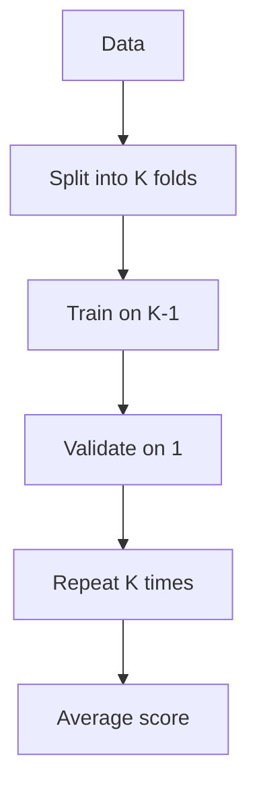

A single train/validation split gives you exactly one number, and one number can lie
— get an unlucky split and a great model looks mediocre, or a badly overfit model
looks fine. Cross-validation fixes this by testing your model against *several*
different splits and reporting both the average score and how much it wobbles.

## Why cross-validation

A single train/validation split can be noisy.

Cross-validation averages performance across multiple splits.

## K-fold CV

Steps:

1. split data into K folds
2. train on K-1 folds
3. validate on the remaining fold
4. repeat for all folds
5. average the scores



:::tip[From the book]
*Hands-On Machine Learning* uses 10-fold cross-validation to catch an overfitting
Decision Tree that looked *perfect* on the training set (RMSE of exactly `0.0`).
Across the 10 folds, its real RMSE averaged **71,407 (± 2,439)** — worse than a plain
Linear Regression's **69,052 (± 2,731)**. The book's takeaway: "cross-validation
allows you to get not only an estimate of the performance of your model, but also a
measure of how precise this estimate is (i.e., its standard deviation)." A single
holdout score would never have revealed that the tree was overfitting so badly.
:::

## Scikit-learn example

```python title="cross_val_score" showLineNumbers{1}
from sklearn.model_selection import cross_val_score
from sklearn.linear_model import LogisticRegression

scores = cross_val_score(LogisticRegression(max_iter=1000), X, y, cv=5, scoring="accuracy")
print("mean:", scores.mean())
print("std:", scores.std())
```

## Visualize it

K-fold CV rotates *which* fold is held out for validation. Over K rounds, every row of
data gets used for validation exactly once, and for training K-1 times:

```p5 title="K-fold rotation" desc="Each round, one fold (highlighted) becomes validation while the rest train the model." height="240"
const K = 5;
let round_ = 0;
let t = 0;
function setup() {
  createCanvas(600, 240);
  textFont("monospace");
  textAlign(CENTER, CENTER);
}
function draw() {
  background(13, 17, 23);
  t++;
  if (t % 55 === 0) round_ = (round_ + 1) % K;

  const barW = (width - 80) / K;
  const gy = 70, gh = 90;
  for (let i = 0; i < K; i++) {
    const gx = 40 + i * barW;
    const isVal = i === round_;
    noStroke();
    fill(isVal ? color(255, 211, 67) : color(75, 139, 190));
    rect(gx + 6, gy, barW - 12, gh, 4);
    fill(210);
    textSize(11);
    text("fold " + (i + 1), gx + barW / 2, gy + gh + 16);
    fill(20);
    textSize(10);
    text(isVal ? "validate" : "train", gx + barW / 2, gy + gh / 2);
  }
  fill(210);
  textSize(13);
  text("Round " + (round_ + 1) + " of " + K, width / 2, 30);
}
```

## Stratified CV

For classification, use stratified splits so each fold preserves class ratios.

Scikit-learn does this automatically for many classifiers.

## Time series warning

Don't use random k-fold for time series.

Use time-series split.

## Mini-checkpoint

When data is small:

- prefer CV over one split.

import DataCampExercise from "../../../../components/DataCampExercise.astro";

## 🧪 Try It Yourself

### Exercise 1 – Run 5-Fold Cross-Validation

<DataCampExercise
  lang="python"
  hint={`Pass \`cv=5\` to \`cross_val_score\` to get 5 scores, one per fold.`}
  code={`# Task: Exercise 1 – Run 5-Fold Cross-Validation
from sklearn.model_selection import ___   # replace ___ with cross_val_score
from sklearn.tree import DecisionTreeClassifier
from sklearn.datasets import make_classification

X, y = make_classification(n_samples=200, n_features=4, random_state=42)
scores = ___(DecisionTreeClassifier(random_state=42), X, y, cv=5)   # replace ___ with cross_val_score
print("Number of scores:", len(scores))

# ── Expected Output ───────────────────────────────────────────
# Number of scores: 5
# ──────────────────────────────────────────────────────────────`}
  solution={`from sklearn.model_selection import cross_val_score
from sklearn.tree import DecisionTreeClassifier
from sklearn.datasets import make_classification

X, y = make_classification(n_samples=200, n_features=4, random_state=42)
scores = cross_val_score(DecisionTreeClassifier(random_state=42), X, y, cv=5)
print("Number of scores:", len(scores))`}
  sct={`test_output_contains("Number of scores: 5")
success_msg("5-fold CV runs the model 5 times, one score per fold!")`}
  height={158}
/>

### Exercise 2 – Report Mean and Standard Deviation

<DataCampExercise
  lang="python"
  hint={`Use \`.mean()\` for the average score and \`.std()\` for how much it varies across folds.`}
  code={`# Task: Exercise 2 – Report Mean and Standard Deviation
import numpy as np

scores = np.array([0.82, 0.79, 0.85, 0.81, 0.78])

mean_score = scores.___()   # replace ___ with mean
std_score = scores.___()    # replace ___ with std
print(f"mean: {mean_score:.3f}  std: {std_score:.3f}")

# ── Expected Output ───────────────────────────────────────────
# mean: 0.810  std: 0.025
# ──────────────────────────────────────────────────────────────`}
  solution={`import numpy as np

scores = np.array([0.82, 0.79, 0.85, 0.81, 0.78])

mean_score = scores.mean()
std_score = scores.std()
print(f"mean: {mean_score:.3f}  std: {std_score:.3f}")`}
  sct={`test_output_contains("mean: 0.810")
success_msg("A tight standard deviation means a reliable estimate!")`}
  height={158}
/>

### Exercise 3 – Convert Negative MSE Scoring to RMSE

<DataCampExercise
  lang="python"
  hint={`Scikit-learn's cross-validation reports negative MSE, so flip the sign before taking the square root: \`np.sqrt(-scores)\`.`}
  code={`# Task: Exercise 3 – Convert Negative MSE Scoring to RMSE
import numpy as np

neg_mse_scores = np.array([-4489000000, -4761000000, -5041000000])

rmse_scores = np.sqrt(___neg_mse_scores)   # replace ___ with -
print("RMSE scores:", rmse_scores.astype(int))

# ── Expected Output ───────────────────────────────────────────
# RMSE scores: [67000 69000 71000]
# ──────────────────────────────────────────────────────────────`}
  solution={`import numpy as np

neg_mse_scores = np.array([-4489000000, -4761000000, -5041000000])

rmse_scores = np.sqrt(-neg_mse_scores)
print("RMSE scores:", rmse_scores.astype(int))`}
  sct={`test_output_contains("RMSE scores:")
success_msg("Scikit-learn's cross-validation always wants a higher-is-better score!")`}
  height={158}
/>

## Next

Continue to **Hyperparameter Tuning with GridSearchCV** — now that you can measure a
model reliably, use that measurement to search for the best hyperparameters.
