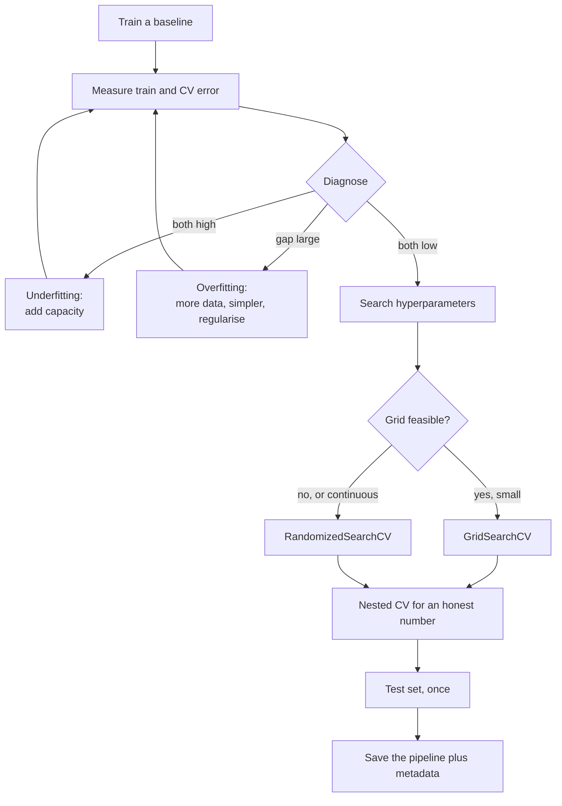

Phases 3 to 6 built models. This phase is about the loop that turns a working model into a good one
— and, just as importantly, about not fooling yourself while you do it.

The through-line is a single question: **is this number real?** A model that scores 0.98 on a lucky
split, or 0.9789 on the folds it was tuned against, is not better than one scoring 0.96 honestly.
Most of this phase is machinery for telling those apart.

## What this phase covers

Six pages, in dependency order.

| # | Page | Question it answers | Key measurement |
| --- | --- | --- | --- |
| 1 | [Underfitting vs Overfitting](/machine-learning/phase-07---model-optimization--tuning/underfitting-vs-overfitting/) | Which of the two failures do I have? | train 0.618 / CV 0.634 versus train 0.100 / CV 9.669 |
| 2 | [Bias vs Variance Tradeoff](/machine-learning/phase-07---model-optimization--tuning/bias-vs-variance-tradeoff/) | Why are there exactly two? | bias² 0.474 → 0.017, variance 0.046 → 1.433 |
| 3 | [K-Fold Cross-Validation](/machine-learning/phase-07---model-optimization--tuning/k-fold-cross-validation/) | How do I measure without lying? | single split sd 0.0118, CV sd 0.0034 |
| 4 | [Hyperparameter Tuning with GridSearchCV](/machine-learning/phase-07---model-optimization--tuning/hyperparameter-tuning-with-gridsearchcv/) | How do I search systematically? | 36 combos, 0.6274 to 0.9789 |
| 5 | [RandomizedSearchCV](/machine-learning/phase-07---model-optimization--tuning/randomizedsearchcv-for-large-parameter-spaces/) | What when the grid is too big? | 59 draws for 95% confidence |
| 6 | [The ML Pipeline](/machine-learning/phase-07---model-optimization--tuning/the-ml-pipeline-automating-the-workflow/) | How do I make it reproducible? | one object, one file, one namespace |

## The tuning loop

Note where the loop closes. Diagnose, fix, re-measure — and only start searching hyperparameters
once the model is in the right capacity range. Grid-searching an underfitting model wastes a
weekend and finds the least-regularised corner of the grid.

## The three ways to fool yourself

Each page exists partly to close one of them:

| Self-deception | Looks like | Measured cost | Closed by |
| --- | --- | --- | --- |
| **A lucky split** | "We got 1.0000!" | Single splits span 0.947–1.000 across seeds | Cross-validation |
| **Tuning on your evaluation** | "Best CV score 0.9776" | Nested CV says 0.9736 | Nested CV, or a held-out test set |
| **Leakage through preprocessing** | Everything looks great | 0.867 accuracy from pure noise | Putting preprocessing in the pipeline |

The third is measured on the
[pipelines page in Phase 2](/machine-learning/phase-02---data-preprocessing--feature-engineering/transformation-pipelines--custom-transformers/):
120 rows, 3,000 random columns, a random target, and feature selection outside the CV loop reports
0.867 where the truth is 0.50.

## Before you start

- **[Phase 2](/machine-learning/phase-02---data-preprocessing--feature-engineering/phase-2---data-preprocessing--feature-engineering/)** —
  pipelines, `ColumnTransformer`, and why preprocessing must live inside the fold.
- **Any model from Phases 3 to 6** — this phase tunes them but does not explain them.
- **Variance and expectation** —
  [Summary Statistics and Independence](/mathematics-for-machine-learning/chapter-06---probability-and-distributions/summary-statistics-and-independence/)
  for the bias-variance derivation.

## What you'll be able to do afterwards

1. Diagnose underfitting from overfitting with two numbers, and pick the fix that matches.
2. Explain where every part of a model's error comes from, and which parts are yours to reduce.
3. Choose $k$, choose a splitter, and report a mean with a spread.
4. Count the fits before launching a search, and detect an edge-of-grid winner.
5. Choose between grid and random search on the basis of dimensionality and continuity.
6. Tune preprocessing, model family and hyperparameters in one search.
7. Report a number you would defend, and record everything needed to reproduce it.

## How long it takes

| Activity | Time |
| --- | --- |
| Reading the six pages | 3–4 hours |
| Working the hand examples | 1–2 hours |
| Running the code and the 30 exercises | 3–4 hours |
| The practice project below | 4–6 hours |
| **Total** | **11–16 hours** |

## Practice project

**Take a model you already built and make its number honest.**

Use any dataset from an earlier phase and work through this checklist:

1. Report the training and cross-validated score. Diagnose which failure you have.
2. Plot the complexity curve for the most important hyperparameter. Where is the minimum?
3. Plot the learning curve. Would more data help? Answer in one sentence.
4. Run a random search with `n_iter=60` over at least four hyperparameters, log-spacing anything
   multiplicative.
5. Check whether any winner sits at the edge of its range. Widen and rerun if so.
6. Run nested cross-validation. **Write down how much the tuning score overstated things.**
7. Evaluate on the test set exactly once, and report a confidence interval.
8. Save the pipeline plus a metadata JSON, then reload it in a fresh process and confirm the
   predictions match.

Step 6 is the one worth doing even when it is inconvenient. Knowing that your tuning procedure
inflates scores by 0.4 points changes how you read every leaderboard you will ever see, including
your own.

<Quiz
  questions={[
    {
      q: "Why does the tuning loop diagnose before it searches?",
      options: [
        "Searching is slow",
        "Hyperparameter search adjusts within a capacity range; if the model is underfitting, the search will simply find the least-regularised corner and the real problem stays unfixed",
        "Diagnosis is required by scikit-learn",
        "It does not matter which order you use",
      ],
      answer: 1,
      explain: "Tuning cannot add features or capacity a model does not have. Diagnose first, fix the structural problem, then search within the right family.",
    },
    {
      q: "On the same data, a single split reported anywhere from 0.947 to 1.000 and 5-fold CV from 0.968 to 0.984. Why does that matter for tuning?",
      options: [
        "It does not; both average out",
        "Because if you tune against a measurement with a 5-point spread, most of what you 'improve' is noise",
        "Because CV is always more accurate",
        "Because the model is unstable",
      ],
      answer: 1,
      explain: "Every tuning decision is a comparison. Comparisons made on a noisy measurement select noise, which is exactly how tuning overfits its own evaluation.",
    },
    {
      q: "What is the single number this phase says you should never report as your model's performance?",
      options: [
        "The test-set score",
        "best_score_ from a grid or random search, because it is the maximum of many noisy estimates and biased upward",
        "The cross-validated mean",
        "The training score",
      ],
      answer: 1,
      explain: "Selecting the maximum of 36 noisy numbers inflates it — measured here at about 0.4 points. Report nested CV or an untouched test set instead.",
    },
  ]}
/>

## Next

Start with
[Underfitting vs Overfitting](/machine-learning/phase-07---model-optimization--tuning/underfitting-vs-overfitting/)
— two numbers, four diagnoses, and two sets of fixes that are opposites of each other.
