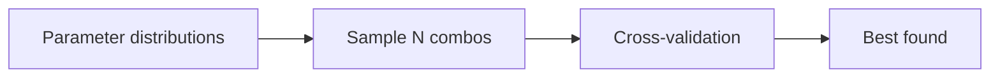

Grid search is exhaustive, which is exactly the problem once you have more than a
couple of hyperparameters: the number of combinations multiplies fast, and most of
your compute budget gets spent evaluating near-duplicate settings. Randomized search
trades completeness for coverage — it samples a fixed number of combinations and
almost always finds something close to the best, for a fraction of the cost.

## Why randomized search

Randomized search samples a fixed number of combinations from distributions.

It's often more efficient than grid search because:

- not all hyperparameters matter equally
- you can explore wide ranges quickly

## The idea



:::tip[From the book]
*Hands-On Machine Learning* notes that grid search "is fine when you are exploring
relatively few combinations," but once the search space is large, `RandomizedSearchCV`
is "often preferable." It works the same way as `GridSearchCV`, except instead of
trying every combination it "evaluates a given number of random combinations by
selecting a random value for each hyperparameter at every iteration." The book gives
two concrete benefits: running for, say, 1,000 iterations explores 1,000 different
values *per hyperparameter* (versus only a few with grid search), and simply setting
`n_iter` gives you direct control over the compute budget — no need to prune the grid
by hand.
:::

## Scikit-learn example

```python title="RandomizedSearchCV" showLineNumbers{1}
from sklearn.model_selection import RandomizedSearchCV
from sklearn.ensemble import RandomForestClassifier

params = {
    "n_estimators": [200, 400, 800],
    "max_depth": [None, 5, 10, 20],
    "min_samples_leaf": [1, 2, 4, 8],
}

search = RandomizedSearchCV(
    estimator=RandomForestClassifier(random_state=42),
    param_distributions=params,
    n_iter=20,
    cv=5,
    scoring="accuracy",
    n_jobs=-1,
    random_state=42,
)

search.fit(X, y)
print("best params:", search.best_params_)
print("best score:", search.best_score_)
```

## Visualize it

Where `GridSearchCV` sweeps every cell of a fixed grid in order, `RandomizedSearchCV`
throws darts at random points across the (continuous) hyperparameter space. Watch each
random draw land, and notice the gold "best so far" marker jump only when a new draw
beats every previous one — after `n_iter` draws it settles wherever the best sample
happened to land, not on a rigid grid line:

```p5 title="Random search scattering the parameter space" desc="Each random draw appears one at a time inside a continuous 2D hyperparameter space; a gold ring tracks the best score found so far." height="300"
let samples = [];
const N_ITER = 18;
const optimum = { x: 0.66, y: 0.4 };
function scoreAt(x, y) {
  const dx = x - optimum.x, dy = y - optimum.y;
  return Math.exp(-(dx * dx + dy * dy) * 6);
}
function setup() {
  createCanvas(600, 300);
  textFont("monospace");
  textAlign(CENTER, CENTER);
  randomSeed(11);
  for (let i = 0; i < N_ITER; i++) {
    const x = random(), y = random();
    samples.push({ x: x, y: y, score: scoreAt(x, y) });
  }
}
const DRAW_GAP = 16;
const SWEEP = N_ITER * DRAW_GAP;
const HOLD = 90;
const FADE = 30;
const PERIOD = SWEEP + HOLD + FADE;

function draw() {
  background(13, 17, 23);
  const phase = frameCount % PERIOD;
  const gx = 70, gy = 40, gw = 460, gh = 190;
  const alpha = phase >= SWEEP + HOLD ? 255 * (1 - (phase - SWEEP - HOLD) / FADE) : 255;
  const visibleCount = phase < SWEEP ? Math.floor(phase / DRAW_GAP) + 1 : N_ITER;

  noFill();
  stroke(50, 60, 74, alpha);
  rect(gx, gy, gw, gh);
  noStroke();
  fill(200, alpha);
  textSize(11);
  text("continuous hyperparameter space (max_depth x n_estimators)", gx + gw / 2, gy - 16);

  let best = null;
  for (let i = 0; i < visibleCount && i < samples.length; i++) {
    const s = samples[i];
    const px = gx + s.x * gw, py = gy + gh - s.y * gh;
    const appear = i * DRAW_GAP;
    const local = constrain((phase - appear) / 10, 0, 1);
    const r = lerp(0, 9, local);
    noStroke();
    fill(75, 139, 190, alpha * local);
    ellipse(px, py, r, r);
    if (!best || s.score > best.score) best = { x: s.x, y: s.y, score: s.score, px: px, py: py };
  }

  if (best) {
    noFill();
    stroke(255, 211, 67, alpha);
    strokeWeight(2 + Math.sin(frameCount * 0.2) * 1);
    ellipse(best.px, best.py, 20, 20);
  }

  fill(230, alpha);
  textSize(13);
  if (phase < SWEEP) {
    text("sampling combination " + Math.min(visibleCount, N_ITER) + " / " + N_ITER + " ...", gx + gw / 2, gy + gh + 26);
  } else {
    text("n_iter=" + N_ITER + " random draws done - best score found: " + (best ? best.score.toFixed(2) : "-"), gx + gw / 2, gy + gh + 26);
  }
}
```

## Sampling from distributions, not just lists

`param_distributions` doesn't have to be a list of fixed values — you can hand it a
`scipy.stats` distribution and `RandomizedSearchCV` will draw a fresh random value from
it on every iteration. This is where randomized search really pulls ahead of grid
search: a grid can only ever test the handful of values you typed in, but a
distribution can be sampled at **any** point in its range.

```python title="param_distributions_with_scipy.py" showLineNumbers{1}
from scipy.stats import randint, uniform
from sklearn.model_selection import RandomizedSearchCV
from sklearn.ensemble import RandomForestRegressor

param_distribs = {
    "n_estimators": randint(low=1, high=200),      # any integer from 1-199
    "max_features": randint(low=1, high=8),        # any integer from 1-7
    "min_samples_leaf": randint(low=1, high=10),
    "bootstrap": [True, False],                     # plain lists still work too
}

forest_reg = RandomForestRegressor(random_state=42)
rnd_search = RandomizedSearchCV(
    forest_reg,
    param_distributions=param_distribs,
    n_iter=10,
    cv=5,
    scoring="neg_mean_squared_error",
    random_state=42,
)
rnd_search.fit(X_train, y_train)
print("best params:", rnd_search.best_params_)
```

As the book puts it, letting the search run for 1,000 iterations explores **1,000
different values per hyperparameter** — versus only the handful you could realistically
type into a `param_grid` list. And because the budget is just the `n_iter` argument,
you control compute cost directly instead of having to prune a grid down by hand.

## When to use which

- GridSearchCV: small search space
- RandomizedSearchCV: large/continuous search space

## Mini-checkpoint

If you're tuning learning rate in [1e-4, 1], randomized search is usually better.

import DataCampExercise from "../../../../components/DataCampExercise.astro";

## 🧪 Try It Yourself

### Exercise 1 – Compare Grid Size vs Search Budget

<DataCampExercise
  lang="python"
  hint={`A 3-parameter grid with 4 values each has 4**3 combinations; randomized search lets you cap the number of tries with n_iter.`}
  code={`# Task: Exercise 1 – Compare Grid Size vs Search Budget
values_per_param = 4
n_params = 3

full_grid_size = values_per_param ___ n_params   # replace ___ with **
n_iter = 20
savings = full_grid_size - n_iter
print("Full grid size:", full_grid_size)
print("Combinations skipped:", savings)

# ── Expected Output ───────────────────────────────────────────
# Full grid size: 64
# Combinations skipped: 44
# ──────────────────────────────────────────────────────────────`}
  solution={`values_per_param = 4
n_params = 3

full_grid_size = values_per_param ** n_params
n_iter = 20
savings = full_grid_size - n_iter
print("Full grid size:", full_grid_size)
print("Combinations skipped:", savings)`}
  sct={`test_output_contains("Full grid size: 64")
test_output_contains("Combinations skipped: 44")
success_msg("Randomized search caps the budget with n_iter, no matter how big the grid is!")`}
  height={168}
/>

### Exercise 2 – Fit RandomizedSearchCV

<DataCampExercise
  lang="python"
  hint={`Pass a dict of param_distributions and an n_iter budget; call .fit(X, y) like any estimator.`}
  code={`# Task: Exercise 2 – Fit RandomizedSearchCV
from sklearn.model_selection import RandomizedSearchCV
from sklearn.tree import DecisionTreeClassifier
from sklearn.datasets import make_classification

X, y = make_classification(n_samples=200, n_features=4, random_state=42)
params = {"max_depth": [2, 3, 4, 5, 6, 7, 8], "min_samples_leaf": [1, 2, 3, 4]}

search = RandomizedSearchCV(
    DecisionTreeClassifier(random_state=42),
    param_distributions=params,
    n_iter=___,   # replace ___ with 5
    cv=3,
    random_state=42,
)
search.fit(X, y)
print("Number of candidates tried:", len(search.cv_results_["params"]))

# ── Expected Output ───────────────────────────────────────────
# Number of candidates tried: 5
# ──────────────────────────────────────────────────────────────`}
  solution={`from sklearn.model_selection import RandomizedSearchCV
from sklearn.tree import DecisionTreeClassifier
from sklearn.datasets import make_classification

X, y = make_classification(n_samples=200, n_features=4, random_state=42)
params = {"max_depth": [2, 3, 4, 5, 6, 7, 8], "min_samples_leaf": [1, 2, 3, 4]}

search = RandomizedSearchCV(
    DecisionTreeClassifier(random_state=42),
    param_distributions=params,
    n_iter=5,
    cv=3,
    random_state=42,
)
search.fit(X, y)
print("Number of candidates tried:", len(search.cv_results_["params"]))`}
  sct={`test_output_contains("Number of candidates tried: 5")
success_msg("n_iter controls exactly how many candidates get tried!")`}
  height={188}
/>

### Exercise 3 – Choose the Right Search Strategy

<DataCampExercise
  lang="python"
  hint={`Small, discrete grids favor GridSearchCV; large or continuous spaces favor RandomizedSearchCV.`}
  code={`# Task: Exercise 3 – Choose the Right Search Strategy
n_combinations = 2_000_000

# replace ___ with "RandomizedSearchCV"
strategy = ___ if n_combinations > 1000 else "GridSearchCV"
print("Use:", strategy)

# ── Expected Output ───────────────────────────────────────────
# Use: RandomizedSearchCV
# ──────────────────────────────────────────────────────────────`}
  solution={`n_combinations = 2_000_000

strategy = "RandomizedSearchCV" if n_combinations > 1000 else "GridSearchCV"
print("Use:", strategy)`}
  sct={`test_output_contains("Use: RandomizedSearchCV")
success_msg("Millions of combinations is exactly where randomized search shines!")`}
  height={148}
/>

## Next

Continue to **The ML Pipeline: Automating the Workflow** — wrap preprocessing and the
tuned model into a single object so this all stays reproducible in production.
