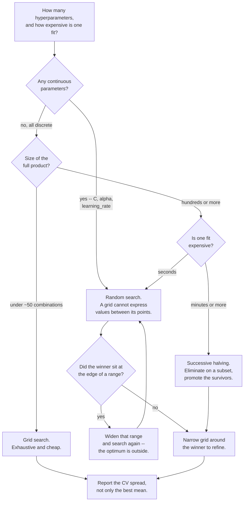

import DataCampExercise from "../../../../components/DataCampExercise.astro";
import Figure from "../../../../components/Figure.astro";
import Quiz from "../../../../components/Quiz.astro";

## What you'll learn

- why random sampling beats a grid at the **same budget**, with the geometric argument
- the probability formula behind "59 draws", derived
- sampling from **distributions** rather than lists, and which distribution to use
- a head-to-head on real data where random search wins with identical cost
- when a grid is still the right choice
- successive halving, which beats both when fits are expensive

## Intuition

A grid search spends its budget on the *product* of the hyperparameter values. With 6 values of `C`
and 6 of `gamma` you get 36 fits — but only **6 distinct values of each**. If `gamma` turns out not
to matter, you paid 36 fits to try 6 values of the one parameter that did.

Random search samples each combination independently. Thirty-six draws give you **36 distinct
values of every hyperparameter**. If only one matters, you explored it six times more thoroughly
for the same money.

<Figure
  src="/images/ml/phase-07-optimization/search-strategies/grid-versus-random"
  alt="Two panels, each with 25 sampled points. The grid panel shows a regular five by five lattice with only five distinct horizontal positions; the random panel shows 25 scattered points with 25 distinct horizontal positions. A green curve along the bottom marks where the important parameter matters."
  title="Twenty-five fits each"
  caption="The green curve is the score as a function of the parameter that matters; the vertical axis is a parameter that does not. The grid reaches 0.67 of the useful peak; random search reaches 0.97."
/>

### Reading the plot

1. **Both panels cost exactly 25 fits.** This is not a more-compute argument.
2. **The grid tries 5 distinct values of the useful parameter.** The other 20 fits are repeats along
   an axis that changes nothing.
3. **Random search tries 25 distinct values.** Its best landed at 0.97 of the peak against the
   grid's 0.67.
4. **The grid's failure is structural, not unlucky.** Any grid wastes resolution on parameters that
   do not matter, and you rarely know in advance which those are.

## The math

Suppose the top 5% of the hyperparameter space would be "good enough". A single random draw misses
it with probability 0.95. Draws are independent, so $n$ draws all miss with probability $0.95^n$,
and:

$$
P(\text{at least one good draw}) = 1 - (1 - p)^{n}
$$

Solving for the number of draws needed to reach confidence $c$:

$$
n \geq \frac{\log(1 - c)}{\log(1 - p)}
$$

With $p = 0.05$ and $c = 0.95$:

$$
n \geq \frac{\log(0.05)}{\log(0.95)} = \frac{-2.9957}{-0.0513} = 58.4 \;\Rightarrow\; \boxed{59}
$$

| Draws | $P(\text{hit the top 5\%})$ |
| --- | --- |
| 10 | 0.4013 |
| 20 | 0.6415 |
| 30 | 0.7854 |
| **59** | **0.9509** |
| 60 | 0.9539 |
| 100 | 0.9941 |

**The result does not depend on the number of hyperparameters.** Fifty-nine draws give 95%
confidence of landing in the top 5% whether you are tuning 2 hyperparameters or 20. A grid covering
20 hyperparameters at even 3 values each is $3^{20} \approx 3.5$ billion combinations.

<Figure
  src="/images/ml/phase-07-optimization/search-strategies/budget-curve"
  alt="Median quality percentile reached plotted against number of random draws, rising steeply then flattening, with markers at the top-5% line and at 59 draws."
  title="Diminishing returns, quantified"
  caption="The curve is steep to about 30 draws and flat after 60. Doubling from 60 to 120 moves the confidence from 0.954 to 0.998 — usually not worth twice the compute."
/>

## Worked example by hand

You have 6 hyperparameters and want 5 values of each.

**Step 1 — the grid.**

$$
5^6 = 15{,}625 \text{ combinations} \times 5 \text{ folds} = 78{,}125 \text{ fits}
$$

At 2 seconds per fit that is **43 hours**.

**Step 2 — random search at 60 draws.**

$$
60 \times 5 = 300 \text{ fits} = 10 \text{ minutes}
$$

**Step 3 — what each buys.** The grid guarantees the best point *in the grid*. Random search gives
95% confidence of landing in the top 5% of the *continuous* space — including values no grid
contained.

**Step 4 — the ratio.** 260 times less compute, for a probabilistic rather than exhaustive
guarantee. On any real problem where the score surface is smooth, that is the better trade.

## Sampling from distributions

Random search's real advantage over a grid is not randomness, it is **continuity**. Give it a
distribution instead of a list and it can propose values no grid contained:

```python title="distributions.py" showLineNumbers{1}
from scipy.stats import loguniform, randint, uniform

param_distributions = {
    # multiplicative parameters: log-uniform, so each decade is equally likely
    "svc__C": loguniform(1e-2, 1e3),
    "svc__gamma": loguniform(1e-4, 1e1),
    # counts: integer uniform
    "rf__n_estimators": randint(50, 500),
    "rf__max_depth": randint(3, 30),
    # genuinely linear parameters: plain uniform
    "rf__max_features": uniform(0.1, 0.8),      # loc=0.1, scale=0.8 -> [0.1, 0.9]
    # categorical: a plain list still works
    "svc__kernel": ["rbf", "poly", "sigmoid"],
}
```

| Parameter type | Distribution | Why |
| --- | --- | --- |
| Regularisation, learning rate, gamma | `loguniform(low, high)` | Acts multiplicatively; 0.001→0.01 matters as much as 0.1→1 |
| Counts (`n_estimators`, `max_depth`) | `randint(low, high)` | Integers, and roughly linear in effect |
| Proportions (`max_features`, `subsample`) | `uniform(loc, scale)` | Bounded and linear |
| Choices (`kernel`, `solver`) | A plain list | Nothing to interpolate |

:::caution[`uniform(0.1, 0.8)` does not mean 0.1 to 0.8]
scipy parameterises by `loc` and `scale`, so `uniform(0.1, 0.8)` samples $[0.1,\, 0.9]$. Getting
this wrong silently shifts your entire search range.
:::

## Head to head

Same model, same data, same budget of 36 combinations:

```python title="head_to_head.py" showLineNumbers{1}
import numpy as np
from scipy.stats import loguniform
from sklearn.datasets import load_breast_cancer
from sklearn.model_selection import GridSearchCV, RandomizedSearchCV
from sklearn.pipeline import make_pipeline
from sklearn.preprocessing import StandardScaler
from sklearn.svm import SVC

X, y = load_breast_cancer(return_X_y=True)
pipe = make_pipeline(StandardScaler(), SVC())

grid = GridSearchCV(
    pipe,
    {"svc__C": np.logspace(-2, 3, 6), "svc__gamma": np.logspace(-4, 1, 6)},
    cv=5, n_jobs=-1,
).fit(X, y)

random = RandomizedSearchCV(
    pipe,
    {"svc__C": loguniform(1e-2, 1e3), "svc__gamma": loguniform(1e-4, 1e1)},
    n_iter=36, cv=5, random_state=0, n_jobs=-1,
).fit(X, y)

print(f"grid    {grid.best_score_:.4f}  {grid.best_params_}")
# grid    0.9789  {'svc__C': 10.0, 'svc__gamma': 0.01}
print(f"random  {random.best_score_:.4f}  "
      f"{ {k: round(v, 5) for k, v in random.best_params_.items()} }")
# random  0.9807  {'svc__C': 7.09551, 'svc__gamma': 0.0156}
```

**Random search wins, at identical cost.** Not because randomness is magic, but because it found
$C = 7.096$ and $\gamma = 0.0156$ — values that were not on the grid and could not have been. The
grid's best cell was the nearest lattice point to a better answer sitting between the lines.

This is a single comparison and would not always go this way. The general claim is weaker and still
useful: **at equal budget, random search is at least competitive, and its advantage grows with the
number of hyperparameters.**

## See it move

Both searchers get the same budget on the same hidden score surface. Watch which one finds the
bright region first.

```p5 title="Grid against random on the same budget" desc="Two identical score surfaces, one probed by a regular grid and one by random draws, with the same number of evaluations. The running best is tracked beneath each." height="340"
const BUDGET = 25;
let gridPts = [], randPts = [];
let peak = { x: 0.68, y: 0.34 };
let step = 0, t = 0;
function score(x, y) {
  const d = (x - peak.x) ** 2 / 0.05 + (y - peak.y) ** 2 / 0.9;
  return Math.exp(-d);
}
function build() {
  gridPts = []; randPts = [];
  const g = 5;
  for (let i = 0; i < g; i++)
    for (let j = 0; j < g; j++)
      gridPts.push({ x: (i + 0.5) / g, y: (j + 0.5) / g });
  for (let i = 0; i < BUDGET; i++) randPts.push({ x: random(), y: random() });
  peak = { x: random(0.15, 0.85), y: random(0.15, 0.85) };
  step = 0; t = 0;
}
function setup() {
  createCanvas(600, 340);
  textFont("monospace");
  noStroke();
  build();
}
function panel(pts, ox, label) {
  const w = 250, h = 200, oy = 46;
  // score surface
  const cell = 10;
  for (let px = 0; px < w; px += cell) {
    for (let py = 0; py < h; py += cell) {
      const v = score(px / w, 1 - py / h);
      fill(20 + v * 60, 30 + v * 150, 40 + v * 90);
      rect(ox + px, oy + py, cell, cell);
    }
  }
  let best = 0;
  for (let i = 0; i < Math.min(step, pts.length); i++) {
    const p = pts[i];
    const v = score(p.x, p.y);
    best = Math.max(best, v);
    fill(255, 211, 67);
    ellipse(ox + p.x * w, oy + (1 - p.y) * h, 7, 7);
  }
  fill(200);
  textSize(11);
  textAlign(CENTER, BOTTOM);
  text(label, ox + w / 2, oy - 8);
  textAlign(CENTER, TOP);
  fill(107, 169, 221);
  textSize(12);
  text("best so far " + best.toFixed(3), ox + w / 2, oy + h + 10);
  fill(150);
  textSize(10);
  text(Math.min(step, pts.length) + " / " + BUDGET + " fits", ox + w / 2, oy + h + 30);
}
function draw() {
  background(13, 17, 23);
  panel(gridPts, 30, "grid: a 5 x 5 lattice");
  panel(randPts, 320, "random: 25 independent draws");
  fill(140);
  textSize(10);
  textAlign(CENTER, BOTTOM);
  text("bright region = good hyperparameters; click to move it", width / 2, height - 8);
  t++;
  if (t % 14 === 0 && step <= BUDGET) step++;
  if (step > BUDGET + 12) build();
}
function mousePressed() { build(); }
```

## When to prefer which

| Situation | Use |
| --- | --- |
| 1–2 hyperparameters, few values each | **Grid** — exhaustive and cheap |
| 3+ hyperparameters | **Random** — the product explodes |
| Continuous hyperparameters | **Random** — a grid cannot express between-values |
| You need reproducible exhaustive coverage | **Grid** |
| Fixed compute budget | **Random** — `n_iter` *is* the budget |
| Refining after a coarse search | **Grid**, narrowed around the winner |
| Fits are very expensive | **Successive halving** or Bayesian optimisation |

The standard workflow uses both: a wide random search to find the promising region, then a small
grid around the winner to refine it.

### Successive halving

When each fit is expensive, most of the budget goes on combinations that were obviously bad after a
tenth of the data:

```python title="halving.py" showLineNumbers{1}
from sklearn.experimental import enable_halving_search_cv  # noqa: F401
from sklearn.model_selection import HalvingRandomSearchCV

search = HalvingRandomSearchCV(
    pipe, param_distributions,
    factor=3,             # keep the best third at each round
    resource="n_samples", # the resource being increased is training rows
    random_state=0, n_jobs=-1,
).fit(X, y)
```

Round 1 evaluates many candidates on a small subset; the best third survive to round 2 with three
times the data, and so on. Most candidates are eliminated cheaply, and the survivors get evaluated
properly. Note the `enable_halving_search_cv` import — the estimator is still experimental.

### Picking a search strategy



The edge check in that flow is the step people skip. A random search whose best `C` is the largest
value it sampled has not found an optimum, it has found the boundary of the box you drew — and the
fix is to redraw the box, not to accept the number.

## Pitfalls

:::caution[Not setting `random_state`]
Without it a random search is not reproducible, and neither is the model you chose. Set it, and
record it alongside the result.
:::

:::caution[`loguniform` versus `uniform` for multiplicative parameters]
`uniform(0.001, 1000)` puts 99.9% of its mass above 1, so the small values that regularise heavily
are almost never sampled. `loguniform(1e-3, 1e3)` gives each decade equal weight.
:::

:::caution[Treating `n_iter` as a quality setting]
It is a budget. The coverage table says 59 draws gives 95% confidence of reaching the top 5%; going
to 120 buys 0.998. Spend the saved compute on more folds, or on more feature engineering.
:::

:::danger[The same optimism applies]
`best_score_` from a random search is still the maximum of `n_iter` noisy numbers, and still biased
upward. Everything the
[nested CV section](/machine-learning/phase-07---model-optimization--tuning/hyperparameter-tuning-with-gridsearchcv/)
says about grid search applies here unchanged.
:::

<Quiz
  questions={[
    {
      q: "At the same budget of 25 fits, why does random search often beat a grid?",
      options: [
        "Random search uses more compute",
        "A 5x5 grid tries only 5 distinct values of each parameter, while 25 random draws try 25 distinct values of each — and usually only one or two parameters matter",
        "Random search uses a better algorithm",
        "It does not; grids are always better",
      ],
      answer: 1,
      explain: "A grid spends its budget on the product of the values. If one parameter is irrelevant, every fit that only varies it is wasted resolution.",
    },
    {
      q: "How many random draws give 95% confidence of landing in the top 5% of the space?",
      options: ["20", "59", "100", "It depends on how many hyperparameters there are"],
      answer: 1,
      explain: "n >= log(0.05)/log(0.95) = 58.4, so 59. Remarkably, the answer does not depend on the dimensionality of the space at all.",
    },
    {
      q: "Which distribution should you use for the regularisation strength C?",
      options: [
        "uniform(0.001, 1000)",
        "loguniform(1e-3, 1e3), because C acts multiplicatively and each decade deserves equal weight",
        "randint(1, 1000)",
        "A list of five values",
      ],
      answer: 1,
      explain: "uniform over that range puts 99.9% of its mass above 1, so the heavily regularised end is essentially never sampled.",
    },
    {
      q: "In the head-to-head, random search found C = 7.096 while the grid's best was C = 10. What does that show?",
      options: [
        "The grid search had a bug",
        "A grid can only return lattice points; the better value lay between the lines and only a continuous distribution could propose it",
        "Random search always wins",
        "The difference is not meaningful",
      ],
      answer: 1,
      explain: "The grid offered 0.01, 0.1, 1, 10, 100, 1000. Nothing it could have returned was closer to 7.096 than 10. Continuity, not randomness, is the advantage.",
    },
  ]}
/>

## 🧪 Try It Yourself

### Exercise 1 – Grid size against search budget

<DataCampExercise
  lang="python"
  hint={`A grid costs values to the power of parameters; random search costs whatever n_iter you set.`}
  code={`# Task: Exercise 1 - Grid size against search budget
for n_params in (2, 4, 6, 8):
    combos = 5 ___ n_params            # replace ___ with **
    grid_fits = combos * 5
    random_fits = 60 * 5
    print(f"{n_params} params: grid {grid_fits:>10,} fits   "
          f"random {random_fits:,} fits   ratio {grid_fits / random_fits:>10,.0f}x")

# -- Expected Output -------------------------------------------
# 2 params: grid        125 fits   random 300 fits   ratio          0x
# 4 params: grid      3,125 fits   random 300 fits   ratio         10x
# 6 params: grid     78,125 fits   random 300 fits   ratio        260x
# 8 params: grid  1,953,125 fits   random 300 fits   ratio      6,510x
# --------------------------------------------------------------`}
  solution={`for n_params in (2, 4, 6, 8):
    combos = 5 ** n_params
    grid_fits = combos * 5
    random_fits = 60 * 5
    print(f"{n_params} params: grid {grid_fits:>10,} fits   "
          f"random {random_fits:,} fits   ratio {grid_fits / random_fits:>10,.0f}x")`}
  sct={`test_output_contains("6,510x")
success_msg("Random search's cost is flat in the parameter count. A grid's is exponential.")`}
  height={208}
/>

### Exercise 2 – Derive the 59

<DataCampExercise
  lang="python"
  hint={`The probability of missing on every draw is (1 - p) to the power n.`}
  code={`# Task: Exercise 2 - Derive the 59
import numpy as np

p = 0.05          # we want to land in the top 5%

for n in (10, 20, 30, 60, 100):
    hit = 1 - (1 - p) ___ n              # replace ___ with **
    print(f"{n:>3} draws -> P(hit) = {hit:.4f}")

needed = int(np.ceil(np.log(0.05) / np.log(1 - p)))
print("draws for 95% confidence:", needed)

# -- Expected Output -------------------------------------------
#  10 draws -> P(hit) = 0.4013
#  20 draws -> P(hit) = 0.6415
#  30 draws -> P(hit) = 0.7854
#  60 draws -> P(hit) = 0.9539
# 100 draws -> P(hit) = 0.9941
# draws for 95% confidence: 59
# --------------------------------------------------------------`}
  solution={`import numpy as np

p = 0.05
for n in (10, 20, 30, 60, 100):
    hit = 1 - (1 - p) ** n
    print(f"{n:>3} draws -> P(hit) = {hit:.4f}")
needed = int(np.ceil(np.log(0.05) / np.log(1 - p)))
print("draws for 95% confidence:", needed)`}
  sct={`test_output_contains("draws for 95% confidence: 59")
success_msg("And that number is the same however many hyperparameters you are tuning.")`}
  height={228}
/>

### Exercise 3 – Sample from distributions

<DataCampExercise
  lang="python"
  hint={`loguniform spreads its samples evenly across decades; uniform does not.`}
  code={`# Task: Exercise 3 - Sample from distributions
import numpy as np
from scipy.stats import ___, uniform        # replace ___ with loguniform

log_samples = loguniform(1e-3, 1e3).rvs(10000, random_state=0)
lin_samples = uniform(1e-3, 1e3).rvs(10000, random_state=0)

print("loguniform below 1:", round(float((log_samples < 1).mean()), 3))
print("uniform below 1:", round(float((lin_samples < 1).mean()), 3))
print("loguniform median:", round(float(np.median(log_samples)), 4))

# -- Expected Output -------------------------------------------
# loguniform below 1: 0.506
# uniform below 1: 0.001
# loguniform median: 0.9141
# --------------------------------------------------------------`}
  solution={`import numpy as np
from scipy.stats import loguniform, uniform

log_samples = loguniform(1e-3, 1e3).rvs(10000, random_state=0)
lin_samples = uniform(1e-3, 1e3).rvs(10000, random_state=0)
print("loguniform below 1:", round(float((log_samples < 1).mean()), 3))
print("uniform below 1:", round(float((lin_samples < 1).mean()), 3))
print("loguniform median:", round(float(np.median(log_samples)), 4))`}
  sct={`test_output_contains("uniform below 1: 0.001")
success_msg("uniform sampled the heavily-regularised half of the range one time in a thousand.")`}
  height={198}
/>

### Exercise 4 – Run the head-to-head

<DataCampExercise
  lang="python"
  hint={`Give RandomizedSearchCV n_iter equal to the grid's combination count.`}
  code={`# Task: Exercise 4 - Run the head-to-head
import numpy as np
from scipy.stats import loguniform
from sklearn.datasets import load_breast_cancer
from sklearn.model_selection import GridSearchCV, ___   # replace ___ with RandomizedSearchCV
from sklearn.pipeline import make_pipeline
from sklearn.preprocessing import StandardScaler
from sklearn.svm import SVC

X, y = load_breast_cancer(return_X_y=True)
pipe = make_pipeline(StandardScaler(), SVC())

grid = GridSearchCV(pipe,
                    {"svc__C": np.logspace(-2, 3, 6),
                     "svc__gamma": np.logspace(-4, 1, 6)},
                    cv=5, n_jobs=-1).fit(X, y)

rand = RandomizedSearchCV(pipe,
                          {"svc__C": loguniform(1e-2, 1e3),
                           "svc__gamma": loguniform(1e-4, 1e1)},
                          n_iter=36, cv=5, random_state=0, n_jobs=-1).fit(X, y)

print("grid:", round(grid.best_score_, 4))
print("random:", round(rand.best_score_, 4))
print("random won:", rand.best_score_ > grid.best_score_)

# -- Expected Output -------------------------------------------
# grid: 0.9789
# random: 0.9807
# random won: True
# --------------------------------------------------------------`}
  solution={`import numpy as np
from scipy.stats import loguniform
from sklearn.datasets import load_breast_cancer
from sklearn.model_selection import GridSearchCV, RandomizedSearchCV
from sklearn.pipeline import make_pipeline
from sklearn.preprocessing import StandardScaler
from sklearn.svm import SVC

X, y = load_breast_cancer(return_X_y=True)
pipe = make_pipeline(StandardScaler(), SVC())
grid = GridSearchCV(pipe,
                    {"svc__C": np.logspace(-2, 3, 6),
                     "svc__gamma": np.logspace(-4, 1, 6)},
                    cv=5, n_jobs=-1).fit(X, y)
rand = RandomizedSearchCV(pipe,
                          {"svc__C": loguniform(1e-2, 1e3),
                           "svc__gamma": loguniform(1e-4, 1e1)},
                          n_iter=36, cv=5, random_state=0, n_jobs=-1).fit(X, y)
print("grid:", round(grid.best_score_, 4))
print("random:", round(rand.best_score_, 4))
print("random won:", rand.best_score_ > grid.best_score_)`}
  sct={`test_output_contains("random won: True")
success_msg("Same 36 combinations. Random found C = 7.096, which no grid cell could contain.")`}
  height={278}
/>

### Exercise 5 – Choose the strategy

<DataCampExercise
  lang="python"
  hint={`Grid when the product is small; random when it is not, or when parameters are continuous.`}
  code={`# Task: Exercise 5 - Choose the strategy
def choose(n_params, values_each, has_continuous):
    combos = values_each ** n_params
    if has_continuous:
        return "random"
    return "grid" if combos <= ___ else "random"     # replace ___ with 100

cases = [
    ("2 params, 5 values, discrete", 2, 5, False),
    ("2 params, continuous C and gamma", 2, 5, True),
    ("5 params, 4 values, discrete", 5, 4, False),
]
for label, n, v, cont in cases:
    print(f"{label:<36} -> {choose(n, v, cont)}")

# -- Expected Output -------------------------------------------
# 2 params, 5 values, discrete         -> grid
# 2 params, continuous C and gamma     -> random
# 5 params, 4 values, discrete         -> random
# --------------------------------------------------------------`}
  solution={`def choose(n_params, values_each, has_continuous):
    combos = values_each ** n_params
    if has_continuous:
        return "random"
    return "grid" if combos <= 100 else "random"

cases = [
    ("2 params, 5 values, discrete", 2, 5, False),
    ("2 params, continuous C and gamma", 2, 5, True),
    ("5 params, 4 values, discrete", 5, 4, False),
]
for label, n, v, cont in cases:
    print(f"{label:<36} -> {choose(n, v, cont)}")`}
  sct={`test_output_contains("-> random")
success_msg("Two rules cover nearly every case: continuous means random, and so does a big product.")`}
  height={218}
/>

## Recap

- A $5\times5$ grid tries 5 distinct values per parameter; 25 random draws try 25. When only one
  parameter matters, that is five times the resolution where it counts.
- $P(\text{hit top } p) = 1 - (1-p)^n$, so 59 draws give 95% confidence of the top 5% —
  **independent of how many hyperparameters there are**.
- Sample multiplicative parameters from `loguniform`, counts from `randint`, proportions from
  `uniform`, choices from a list.
- Head to head at 36 combinations: grid 0.9789, random 0.9807 — because random could propose
  $C = 7.096$ and the grid could not.
- Grid for one or two discrete hyperparameters; random for three or more or anything continuous;
  successive halving when fits are expensive.
- `best_score_` is still optimistic. Nested CV or a held-out test set remains the honest number.

### Exercise 6 – How many draws do you actually need?

<DataCampExercise
  lang="python"
  hint={`The chance of missing the top 5% on one draw is 0.95, and draws are independent, so the chance of missing it n times is 0.95 to the power n.`}
  code={`# Task: Exercise 6 - How many draws do you actually need?
print(f"{'draws':>6} {'P(hit top 5%)':>14} {'P(hit top 1%)':>14}")
for n in (1, 10, 30, 60, 100, 300):
    print(f"{n:6d} {1 - 0.95 ** ___:14.4f} {1 - 0.99 ** n:14.4f}")
    # replace ___ with n
print("this is why 60 random draws is a reasonable default: 0.9539 for the "
      "top 5%")
print("note what it does NOT depend on: the number of hyperparameters")

# -- Expected Output -------------------------------------------
#  draws  P(hit top 5%)  P(hit top 1%)
#      1         0.0500         0.0100
#     10         0.4013         0.0956
#     30         0.7854         0.2603
#     60         0.9539         0.4528
#    100         0.9941         0.6340
#    300         1.0000         0.9510
# this is why 60 random draws is a reasonable default: 0.9539 for the top 5%
# note what it does NOT depend on: the number of hyperparameters
# --------------------------------------------------------------`}
  solution={`print(f"{'draws':>6} {'P(hit top 5%)':>14} {'P(hit top 1%)':>14}")
for n in (1, 10, 30, 60, 100, 300):
    print(f"{n:6d} {1 - 0.95 ** n:14.4f} {1 - 0.99 ** n:14.4f}")
print("this is why 60 random draws is a reasonable default: 0.9539 for the "
      "top 5%")
print("note what it does NOT depend on: the number of hyperparameters")`}
  sct={`test_output_contains("0.9539")
success_msg("Sixty draws give a 95% chance of landing in the top 5% of the space — and that guarantee is independent of how many hyperparameters you are searching, which is exactly what a grid cannot promise. Chasing the top 1% costs 300 draws for the same confidence.")`}
  height={250}
/>

## Next

Continue to
[The ML Pipeline - Automating the Workflow](/machine-learning/phase-07---model-optimization--tuning/the-ml-pipeline-automating-the-workflow/)
— everything in this phase assumed a pipeline; this page makes it the reproducible unit you tune,
save and ship.
