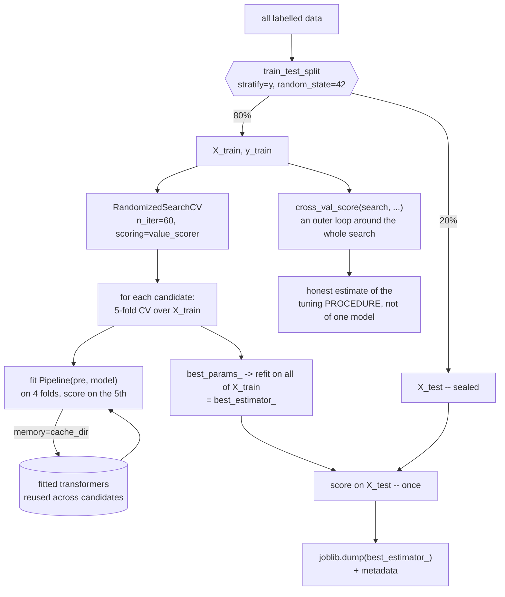

import DataCampExercise from "../../../../components/DataCampExercise.astro";
import Figure from "../../../../components/Figure.astro";
import Quiz from "../../../../components/Quiz.astro";

## What you'll learn

- the pipeline as the **unit of tuning**, not just of preprocessing
- swapping entire estimators as if they were a hyperparameter
- `memory=` caching, which removes the repeated work a grid search does by default
- **custom scorers**, for when accuracy is not what the business is paying for
- introspecting a fitted pipeline: `get_params`, `named_steps`, `get_feature_names_out`
- the reproducibility checklist — everything that must be pinned for a number to be repeatable

:::note[This page assumes the construction basics]
[Transformation Pipelines & Custom Transformers](/machine-learning/phase-02---data-preprocessing--feature-engineering/transformation-pipelines--custom-transformers/)
covers building a pipeline, writing a custom transformer, and the leakage a pipeline prevents.
This page is about what a pipeline lets you *do* once you have one.
:::

## Intuition

Phase 2 argued for pipelines on correctness grounds: preprocessing fitted outside the
cross-validation loop leaks, and a pipeline puts it inside.

That is true and it undersells them. A pipeline is also **one object with one flat namespace of
hyperparameters**, and that turns several separate problems into one:

- Tuning preprocessing and the model becomes a single search.
- Comparing model families becomes a single search.
- Shipping becomes a single file.
- Reproducing a result becomes one `set_params` call.

<Figure
  src="/images/ml/phase-02-preprocessing/pipelines-and-leakage/pipeline-diagram"
  alt="Flow diagram: a raw DataFrame splits into a numeric branch and a categorical branch, which recombine in a ColumnTransformer and feed an estimator."
  title="One object, one fit, one predict"
  caption="Everything inside the box is addressable by name from the outside, which is what makes the whole graph tunable in a single search."
/>

## The flat namespace

Every parameter of every step is reachable by a double-underscore path:

```python title="introspect.py" showLineNumbers{1}
from sklearn.compose import ColumnTransformer
from sklearn.impute import SimpleImputer
from sklearn.pipeline import Pipeline
from sklearn.preprocessing import OneHotEncoder, StandardScaler
from sklearn.svm import SVC

pipe = Pipeline([
    ("pre", ColumnTransformer([
        ("num", Pipeline([("impute", SimpleImputer()), ("scale", StandardScaler())]),
         num_cols),
        ("cat", OneHotEncoder(handle_unknown="ignore"), cat_cols),
    ])),
    ("model", SVC()),
])

tunable = [k for k in pipe.get_params() if "__" in k]
print(len(tunable))                              # 40+ addressable parameters
print(pipe.get_params()["pre__num__impute__strategy"])   # 'mean'

pipe.set_params(pre__num__impute__strategy="median", model__C=10)
```

Read `pre__num__impute__strategy` right to left: the `strategy` of the step called `impute`, inside
the pipeline called `num`, inside the `ColumnTransformer` called `pre`. Arbitrary nesting, one flat
string.

## Swapping whole models as a hyperparameter

The step *itself* is a parameter, so a single search can compare model families **and** their
hyperparameters, each family with the preprocessing it needs:

```python title="model_selection.py" showLineNumbers{1}
from sklearn.ensemble import RandomForestClassifier
from sklearn.linear_model import LogisticRegression
from sklearn.model_selection import GridSearchCV
from sklearn.pipeline import Pipeline
from sklearn.preprocessing import StandardScaler
from sklearn.svm import SVC

pipe = Pipeline([
    ("scale", StandardScaler()),
    ("model", LogisticRegression()),      # a placeholder; the search replaces it
])

param_grid = [
    {"model": [LogisticRegression(max_iter=5000)],
     "model__C": [0.1, 1, 10]},
    {"model": [SVC()],
     "model__C": [1, 10, 100],
     "model__gamma": [0.001, 0.01, 0.1]},
    {"model": [RandomForestClassifier(random_state=0)],
     "model__n_estimators": [100, 300],
     "model__max_depth": [5, 10, None],
     "scale": ["passthrough"]},           # trees do not need scaling
]

search = GridSearchCV(pipe, param_grid, cv=5, n_jobs=-1).fit(X, y)

print(type(search.best_estimator_.named_steps["model"]).__name__)
print(round(search.best_score_, 4))
```

Two things worth pausing on:

- **`"scale": ["passthrough"]`** disables a step entirely. The forest branch skips scaling; the
  others keep it. Whether to scale at all becomes part of the search.
- **The comparison is fair.** Every family is evaluated on identical folds with identical
  preprocessing rules, which a hand-written loop over models rarely manages.

## Caching repeated work

A grid over `model__C` refits the imputer and the scaler for every value of `C`, even though the
preprocessing does not depend on `C` at all. On a large `ColumnTransformer` that is most of the
runtime.

```python title="caching.py" showLineNumbers{1}
from shutil import rmtree
from tempfile import mkdtemp

cache_dir = mkdtemp()
pipe = Pipeline(steps, memory=cache_dir)      # memoise every fitted transformer

search = GridSearchCV(pipe, param_grid, cv=5, n_jobs=-1).fit(X, y)

rmtree(cache_dir)                             # clean up when finished
```

Each transformer is fitted once per unique (input, parameters) combination and reused. The saving
scales with how much of your grid varies only the final estimator — often 2× to 5× on a realistic
preprocessing stack.

:::caution[The cache is on disk and is not cleaned up for you]
`mkdtemp()` plus `rmtree()` at the end, or a fixed directory you manage. Left behind, these grow
without limit.
:::

### See it move

The sketch runs a 4 × 3 grid — four values of `model__C` crossed with three values of
`pre__num__imputer__strategy` — through five folds, twice. The upper run has no `memory=`; the lower
one caches. Each block lights amber when it is actually fitted and green when it is served from cache,
and the counters at the bottom tally transformer fits and simulated seconds.

```p5 title="What memory= actually skips" desc="Sixty pipeline fits laid out as a grid, run with and without transformer caching. Without caching every preprocessing block is refitted; with caching a block is fitted once per unique input and parameter combination and reused for the three values of C that do not affect it. The fit counters and elapsed-time bars diverge." height="420"
const CS = [0.1, 1, 10, 100];
const STRATS = ["mean", "median", "most_frequent"];
const FOLDS = 5;
// simulated cost in ms: preprocessing dominates, as it does on a wide ColumnTransformer
const PRE_MS = 120;
const MODEL_MS = 30;

let jobs = [];
let cursor = 0;
let timer = 0;

function setup() {
  createCanvas(620, 420);
  textFont("monospace");
  build();
}
function build() {
  jobs = [];
  for (const s of STRATS) {
    for (const c of CS) {
      for (let f = 0; f < FOLDS; f++) {
        jobs.push({ strat: s, c: c, fold: f });
      }
    }
  }
  cursor = 0;
}
function draw() {
  background(13, 17, 23);

  // replay the first `cursor` jobs under both regimes
  const seen = new Set();
  let coldPre = 0, warmPre = 0, models = 0;
  const marks = [];
  for (let i = 0; i < cursor; i++) {
    const j = jobs[i];
    const key = j.strat + "|" + j.fold;      // C does not enter the preprocessing key
    const hit = seen.has(key);
    if (!hit) seen.add(key);
    coldPre++;
    if (!hit) warmPre++;
    models++;
    marks.push(hit);
  }
  const coldMs = coldPre * PRE_MS + models * MODEL_MS;
  const warmMs = warmPre * PRE_MS + models * MODEL_MS;

  fill(215);
  textSize(12);
  textAlign(LEFT, TOP);
  text("grid: 4 values of C  x  3 imputer strategies  x  5 folds  =  60 pipeline fits", 30, 14);

  // job grid: rows = strategy, columns = C x fold
  const cw = 9, chh = 22, x0 = 120, y0 = 56;
  for (let s = 0; s < STRATS.length; s++) {
    fill(150);
    textSize(10);
    textAlign(RIGHT, CENTER);
    text(STRATS[s], x0 - 8, y0 + s * (chh + 30) + 10);
    fill(105);
    textSize(9);
    textAlign(RIGHT, CENTER);
    text("cached", x0 - 8, y0 + s * (chh + 30) + 30);
    for (let c = 0; c < CS.length; c++) {
      for (let f = 0; f < FOLDS; f++) {
        const idx = s * CS.length * FOLDS + c * FOLDS + f;
        const x = x0 + (c * (FOLDS + 1) + f) * (cw + 3);
        const done = idx < cursor;
        const hit = done ? marks[idx] : false;
        noStroke();
        fill(done ? color(255, 176, 67) : color(34, 40, 48));
        rect(x, y0 + s * (chh + 30), cw, 16, 2);
        fill(!done ? color(34, 40, 48) : hit ? color(120, 200, 120) : color(255, 176, 67));
        rect(x, y0 + s * (chh + 30) + 20, cw, 16, 2);
      }
    }
  }
  fill(105);
  textSize(9);
  textAlign(LEFT, TOP);
  text("each column group is one C value; within it, five folds", x0, y0 + 3 * (chh + 30) - 6);

  // counters
  const py = 216;
  fill(255, 176, 67);
  textSize(12);
  textAlign(LEFT, TOP);
  text("no memory=", 30, py);
  fill(200);
  textSize(11);
  text("transformer fits: " + coldPre, 160, py);
  text("model fits: " + models, 330, py);
  fill(120, 200, 120);
  textSize(12);
  text("memory=cache_dir", 30, py + 26);
  fill(200);
  textSize(11);
  text("transformer fits: " + warmPre, 160, py + 26);
  text("model fits: " + models, 330, py + 26);

  // time bars
  const bx = 30, bw = 540, maxMs = 60 * PRE_MS + 60 * MODEL_MS;
  fill(150);
  textSize(11);
  textAlign(LEFT, TOP);
  text("simulated wall clock", bx, py + 66);
  noStroke();
  fill(30, 36, 44);
  rect(bx, py + 86, bw, 20);
  fill(255, 176, 67);
  rect(bx, py + 86, (coldMs / maxMs) * bw, 20);
  fill(235);
  textSize(11);
  textAlign(LEFT, CENTER);
  text((coldMs / 1000).toFixed(2) + " s", bx + 6, py + 96);
  fill(30, 36, 44);
  rect(bx, py + 112, bw, 20);
  fill(120, 200, 120);
  rect(bx, py + 112, (warmMs / maxMs) * bw, 20);
  fill(235);
  text((warmMs / 1000).toFixed(2) + " s", bx + 6, py + 122);

  fill(cursor >= jobs.length ? color(120, 200, 120) : color(105));
  textSize(11);
  textAlign(LEFT, TOP);
  if (cursor >= jobs.length) {
    text(
      "done: " + coldPre + " transformer fits vs " + warmPre + "  ->  " +
        (coldMs / warmMs).toFixed(2) + "x faster",
      bx,
      py + 146
    );
  } else {
    text("running... click to restart", bx, py + 146);
  }
  fill(105);
  textSize(10);
  text("the cache key is (input rows, transformer params) -- C is not in it,", bx, py + 168);
  text("so three of every four preprocessing fits are avoidable", bx, py + 182);

  timer += deltaTime;
  if (timer > 60 && cursor < jobs.length) { timer = 0; cursor++; }
}
function mousePressed() { build(); }
```

The arithmetic the sketch is animating: 60 fits, and only 15 distinct (strategy, fold) preprocessing
jobs among them. Caching therefore does $15 \times 120 + 60 \times 30 = 3{,}600$ ms of work instead of
$60 \times 120 + 60 \times 30 = 9{,}000$ ms — a **2.50× speed-up**, entirely because `C` is not part
of the cache key. The multiplier is set by how much of your grid varies only the estimator: four `C`
values give 4×-ish on the preprocessing portion, and the more expensive your `ColumnTransformer` is
relative to the model, the closer the overall saving gets to that.

## Custom scorers

`GridSearchCV` optimises accuracy by default. Accuracy is very rarely what anyone is paying for.

```python title="custom_scorer.py" showLineNumbers{1}
from sklearn.metrics import confusion_matrix, fbeta_score, make_scorer

# 1. A metric you can name
f2 = make_scorer(fbeta_score, beta=2)          # recall matters twice as much

# 2. A metric denominated in money
def net_value(y_true, y_pred):
    """Each caught fraud saves 500; each false alarm costs 20 in review time."""
    tn, fp, fn, tp = confusion_matrix(y_true, y_pred).ravel()
    return 500 * tp - 20 * fp

value_scorer = make_scorer(net_value, greater_is_better=True)

search = GridSearchCV(pipe, param_grid, cv=5, scoring=value_scorer, n_jobs=-1)
```

The second scorer is the one worth internalising. The search now maximises **expected pounds**, and
it will choose a different threshold and different hyperparameters from the one maximising
accuracy — correctly, because those are different objectives.

Three details:

- `greater_is_better=False` flips the sign for losses, which is why scikit-learn reports
  `neg_mean_squared_error`.
- `needs_proba=True` gives the scorer probabilities instead of labels, for metrics like ROC-AUC.
- Passing a dict of scorers to `scoring` records several at once; `refit="name"` then chooses which
  one selects the winner.

## Reading a fitted pipeline

```python title="inspect_fitted.py" showLineNumbers{1}
best = search.best_estimator_

# Which steps ran
print(list(best.named_steps))

# What preprocessing learned
print(best.named_steps["pre"].named_transformers_["num"]
          .named_steps["impute"].statistics_.round(2))

# The column names after transformation — needed for any importance plot
feature_names = best.named_steps["pre"].get_feature_names_out()
print(len(feature_names), feature_names[:4])

# The model's own view
importances = best.named_steps["model"].feature_importances_
for name, score in sorted(zip(feature_names, importances),
                          key=lambda pair: -pair[1])[:5]:
    print(f"{name:<28} {score:.4f}")
```

`get_feature_names_out()` is the one people miss. Without it you have an importance vector and no
idea which column each entry refers to, which makes the whole analysis unusable.

## Reproducibility

A pipeline makes a result reproducible only if you pin everything that varies:

| Item | Why | How |
| --- | --- | --- |
| `random_state` on every stochastic step | Splitters, forests, SGD, randomised search | Set it explicitly, everywhere |
| The CV splitter object | `cv=5` is not the same splitter as `KFold(5, shuffle=True)` | Construct it and reuse it |
| Library versions | Defaults change between releases | `pip freeze > requirements.txt` |
| The data snapshot | "The database" is not a version | Hash the file, or store the query and date |
| The full parameter dict | `best_params_` alone omits the defaults | `joblib.dump` the whole estimator |

```python title="reproducible.py" showLineNumbers{1}
import json
import sklearn
import joblib
from sklearn.model_selection import StratifiedKFold

CV = StratifiedKFold(5, shuffle=True, random_state=42)     # one object, reused

search = GridSearchCV(pipe, param_grid, cv=CV, n_jobs=-1).fit(X, y)

joblib.dump(search.best_estimator_, "model_v1.joblib")

with open("model_v1.meta.json", "w") as handle:
    json.dump({
        "cv_score": round(search.best_score_, 6),
        "params": {k: str(v) for k, v in search.best_params_.items()},
        "sklearn_version": sklearn.__version__,
        "n_rows": int(len(y)),
        "cv": "StratifiedKFold(5, shuffle=True, random_state=42)",
    }, handle, indent=2)
```

:::danger[A pickled model is not portable across library versions]
`joblib.load` on a different scikit-learn version may warn, silently misbehave, or fail. Record the
version, and prefer retraining from a pinned environment over trusting an old pickle.
:::

## The whole loop

```python title="full_loop.py" showLineNumbers{1}
# 1. Split, before anything else
X_train, X_test, y_train, y_test = train_test_split(
    X, y, test_size=0.2, random_state=42, stratify=y
)

# 2. One pipeline for preprocessing and model
pipe = Pipeline([("pre", preparation), ("model", SVC())], memory=cache_dir)

# 3. Search families and hyperparameters together
search = RandomizedSearchCV(
    pipe, param_distributions, n_iter=60, cv=CV,
    scoring=value_scorer, random_state=42, n_jobs=-1,
).fit(X_train, y_train)

# 4. Honest estimate of the tuning procedure, if you need to report one
nested = cross_val_score(search, X_train, y_train, cv=CV, n_jobs=-1)

# 5. Final check on the untouched test set — exactly once
final_score = value_scorer(search.best_estimator_, X_test, y_test)

# 6. Persist the estimator and its metadata together
joblib.dump(search.best_estimator_, "model_v1.joblib")
```

Six steps, and every one of them has appeared in this phase. Step 2 is what makes 3, 4, 5 and 6
possible in a single line each.

Drawn as data flow, with the nesting made explicit:



The two loops answer different questions, and confusing them is the classic reporting error.
`search.best_score_` is the mean CV score of the winning candidate — optimistically biased, because
that candidate was *chosen* by those folds. The outer `cross_val_score` re-runs the entire search
inside each of its own folds, so nothing it scores was selected using the rows it scores. If you need
one number to publish, it comes from the outer loop or from the sealed test set, never from
`best_score_`.

## Pitfalls

:::caution[`memory=` without cleanup]
The cache directory persists after the process ends. Use `mkdtemp()` and `rmtree()`, or point it at
a directory you actively manage.
:::

:::caution[Renaming a step breaks every parameter path]
Rename `model` to `clf` and `model__C` becomes a silent `ValueError` at search time. Keep step
names stable, or define them as constants.
:::

:::caution[Resamplers do not belong in a scikit-learn `Pipeline`]
SMOTE and friends change the row count, which `Pipeline` does not support. Use
`imblearn.pipeline.Pipeline`, which does — and which keeps the resampling inside the fold, where it
must be.
:::

:::caution[`passthrough` versus `None`]
`"passthrough"` skips a step and forwards its input unchanged. `None` also works in recent versions
but is deprecated in places. Use the string.
:::

:::danger[Reporting the search score]
`search.best_score_` is optimistic for the reasons in
[Hyperparameter Tuning with GridSearchCV](/machine-learning/phase-07---model-optimization--tuning/hyperparameter-tuning-with-gridsearchcv/).
Steps 4 and 5 above exist precisely so you have something honest to report instead.
:::

<Quiz
  questions={[
    {
      q: "What does 'model': [LogisticRegression(), SVC()] inside a param_grid do?",
      options: [
        "Raises an error — only hyperparameters can be searched",
        "Treats the estimator itself as a hyperparameter, so one search compares whole model families on identical folds",
        "Fits both models and averages them",
        "Selects a model at random",
      ],
      answer: 1,
      explain: "A pipeline step is a parameter like any other. Combined with a list of grids, each family can also carry its own hyperparameters and its own preprocessing.",
    },
    {
      q: "Why pass memory= to a Pipeline during a grid search?",
      options: [
        "To reduce RAM usage",
        "To cache fitted transformers, so preprocessing is not needlessly refitted for every value of a parameter it does not depend on",
        "To make the model smaller on disk",
        "To enable parallelism",
      ],
      answer: 1,
      explain: "A grid over model__C refits the imputer and scaler for every C by default. Memoisation reuses them, often saving most of the runtime on a heavy preprocessing stack.",
    },
    {
      q: "Why write a custom scorer that returns pounds rather than accuracy?",
      options: [
        "Accuracy is difficult to compute",
        "Because the search optimises whatever you give it, and a metric denominated in money selects different hyperparameters from one denominated in correct predictions",
        "Custom scorers run faster",
        "It is required for imbalanced data",
      ],
      answer: 1,
      explain: "500 per caught fraud against 20 per false alarm is a different objective from 'maximise correct predictions', and it will choose a different operating point.",
    },
    {
      q: "What does get_feature_names_out() on a fitted ColumnTransformer give you?",
      options: [
        "The original DataFrame column names",
        "The names of the columns after transformation — including the generated one-hot columns — which is what makes an importance vector interpretable",
        "The hyperparameter names",
        "The names of the pipeline steps",
      ],
      answer: 1,
      explain: "After one-hot encoding and feature engineering the matrix no longer matches the input columns. Without the output names an importance array is a list of numbers with no labels.",
    },
  ]}
/>

## 🧪 Try It Yourself

### Exercise 1 – Explore the flat namespace

<DataCampExercise
  lang="python"
  hint={`get_params() returns every addressable parameter; the nested ones contain a double underscore.`}
  code={`# Task: Exercise 1 - Explore the flat namespace
from sklearn.impute import SimpleImputer
from sklearn.pipeline import Pipeline
from sklearn.preprocessing import StandardScaler
from sklearn.svm import SVC

pipe = Pipeline([
    ("impute", SimpleImputer()),
    ("scale", StandardScaler()),
    ("model", SVC()),
])

nested = [k for k in pipe.get_params() if "___" in k]   # replace ___ with __
print("addressable nested params:", len(nested))
print("impute strategy:", pipe.get_params()["impute__strategy"])

pipe.set_params(impute__strategy="median", model__C=10)
print("after set_params:", pipe.get_params()["impute__strategy"],
      pipe.get_params()["model__C"])

# -- Expected Output -------------------------------------------
# addressable nested params: 24
# impute strategy: mean
# after set_params: median 10
# --------------------------------------------------------------`}
  solution={`from sklearn.impute import SimpleImputer
from sklearn.pipeline import Pipeline
from sklearn.preprocessing import StandardScaler
from sklearn.svm import SVC

pipe = Pipeline([
    ("impute", SimpleImputer()),
    ("scale", StandardScaler()),
    ("model", SVC()),
])
nested = [k for k in pipe.get_params() if "__" in k]
print("addressable nested params:", len(nested))
print("impute strategy:", pipe.get_params()["impute__strategy"])
pipe.set_params(impute__strategy="median", model__C=10)
print("after set_params:", pipe.get_params()["impute__strategy"],
      pipe.get_params()["model__C"])`}
  sct={`test_output_contains("after set_params: median 10")
success_msg("Every knob in the graph, reachable from one flat dictionary.")`}
  height={238}
/>

### Exercise 2 – Search across model families

<DataCampExercise
  lang="python"
  hint={`Put the estimator itself in the grid as a list, one dictionary per family.`}
  code={`# Task: Exercise 2 - Search across model families
from sklearn.datasets import load_breast_cancer
from sklearn.ensemble import RandomForestClassifier
from sklearn.linear_model import LogisticRegression
from sklearn.model_selection import GridSearchCV
from sklearn.pipeline import Pipeline
from sklearn.preprocessing import StandardScaler

X, y = load_breast_cancer(return_X_y=True)

pipe = Pipeline([("scale", StandardScaler()),
                 ("model", LogisticRegression(max_iter=5000))])

grid = [
    {"model": [LogisticRegression(max_iter=5000)], "model__C": [0.1, 1, 10]},
    {"model": [RandomForestClassifier(random_state=0)],
     "model__n_estimators": [100, 300],
     "scale": ["___"]},                 # replace ___ with passthrough
]

search = GridSearchCV(pipe, grid, cv=5, n_jobs=-1).fit(X, y)
print("winner:", type(search.best_estimator_.named_steps["model"]).__name__)
print("score:", round(search.best_score_, 4))

# -- Expected Output -------------------------------------------
# winner: LogisticRegression
# score: 0.9807
# --------------------------------------------------------------`}
  solution={`from sklearn.datasets import load_breast_cancer
from sklearn.ensemble import RandomForestClassifier
from sklearn.linear_model import LogisticRegression
from sklearn.model_selection import GridSearchCV
from sklearn.pipeline import Pipeline
from sklearn.preprocessing import StandardScaler

X, y = load_breast_cancer(return_X_y=True)
pipe = Pipeline([("scale", StandardScaler()),
                 ("model", LogisticRegression(max_iter=5000))])
grid = [
    {"model": [LogisticRegression(max_iter=5000)], "model__C": [0.1, 1, 10]},
    {"model": [RandomForestClassifier(random_state=0)],
     "model__n_estimators": [100, 300],
     "scale": ["passthrough"]},
]
search = GridSearchCV(pipe, grid, cv=5, n_jobs=-1).fit(X, y)
print("winner:", type(search.best_estimator_.named_steps["model"]).__name__)
print("score:", round(search.best_score_, 4))`}
  sct={`test_output_contains("winner: LogisticRegression")
success_msg("Two families, their hyperparameters, and whether to scale — all in one fair comparison.")`}
  height={268}
/>

### Exercise 3 – Write a scorer denominated in money

<DataCampExercise
  lang="python"
  hint={`make_scorer wraps any function of (y_true, y_pred).`}
  code={`# Task: Exercise 3 - Write a scorer denominated in money
import numpy as np
from sklearn.metrics import confusion_matrix, ___    # replace ___ with make_scorer

def net_value(y_true, y_pred):
    tn, fp, fn, tp = confusion_matrix(y_true, y_pred).ravel()
    return 500 * tp - 20 * fp

y_true = np.array([1, 1, 1, 0, 0, 1, 1, 0, 0, 0])
cautious = np.array([1, 1, 1, 1, 1, 1, 0, 0, 0, 0])   # 4 TP, 2 FP
strict = np.array([1, 1, 0, 0, 0, 0, 0, 0, 0, 0])     # 2 TP, 0 FP

print("cautious:", net_value(y_true, cautious))
print("strict:", net_value(y_true, strict))
print("cautious is worth more:", net_value(y_true, cautious) > net_value(y_true, strict))

# -- Expected Output -------------------------------------------
# cautious: 1960
# strict: 1000
# cautious is worth more: True
# --------------------------------------------------------------`}
  solution={`import numpy as np
from sklearn.metrics import confusion_matrix, make_scorer

def net_value(y_true, y_pred):
    tn, fp, fn, tp = confusion_matrix(y_true, y_pred).ravel()
    return 500 * tp - 20 * fp

y_true = np.array([1, 1, 1, 0, 0, 1, 1, 0, 0, 0])
cautious = np.array([1, 1, 1, 1, 1, 1, 0, 0, 0, 0])
strict = np.array([1, 1, 0, 0, 0, 0, 0, 0, 0, 0])
print("cautious:", net_value(y_true, cautious))
print("strict:", net_value(y_true, strict))
print("cautious is worth more:", net_value(y_true, cautious) > net_value(y_true, strict))`}
  sct={`test_output_contains("cautious: 1960")
success_msg("The strict model has perfect precision and is worth 960 less. Accuracy would not have said so.")`}
  height={238}
/>

### Exercise 4 – Recover the transformed column names

<DataCampExercise
  lang="python"
  hint={`get_feature_names_out() on the fitted ColumnTransformer.`}
  code={`# Task: Exercise 4 - Recover the transformed column names
import numpy as np
import pandas as pd
from sklearn.compose import ColumnTransformer
from sklearn.impute import SimpleImputer
from sklearn.preprocessing import OneHotEncoder

df = pd.DataFrame({
    "age": [25.0, 32, np.nan, 41],
    "income": [50000.0, 64000, 58000, 72000],
    "city": ["London", "Paris", "London", "Tokyo"],
})

pre = ColumnTransformer([
    ("num", SimpleImputer(strategy="median"), ["age", "income"]),
    ("cat", OneHotEncoder(handle_unknown="ignore"), ["city"]),
]).fit(df)

names = pre.___()                     # replace ___ with get_feature_names_out
print("input columns:", df.shape[1])
print("output columns:", len(names))
print(list(names))

# -- Expected Output -------------------------------------------
# input columns: 3
# output columns: 5
# ['num__age', 'num__income', 'cat__city_London', 'cat__city_Paris', 'cat__city_Tokyo']
# --------------------------------------------------------------`}
  solution={`import numpy as np
import pandas as pd
from sklearn.compose import ColumnTransformer
from sklearn.impute import SimpleImputer
from sklearn.preprocessing import OneHotEncoder

df = pd.DataFrame({
    "age": [25.0, 32, np.nan, 41],
    "income": [50000.0, 64000, 58000, 72000],
    "city": ["London", "Paris", "London", "Tokyo"],
})
pre = ColumnTransformer([
    ("num", SimpleImputer(strategy="median"), ["age", "income"]),
    ("cat", OneHotEncoder(handle_unknown="ignore"), ["city"]),
]).fit(df)
names = pre.get_feature_names_out()
print("input columns:", df.shape[1])
print("output columns:", len(names))
print(list(names))`}
  sct={`test_output_contains("output columns: 5")
success_msg("Now an importance vector has labels instead of being five anonymous numbers.")`}
  height={258}
/>

### Exercise 5 – Save the model and its metadata together

<DataCampExercise
  lang="python"
  hint={`joblib.dump the estimator; json.dump the facts you will need to reproduce it.`}
  code={`# Task: Exercise 5 - Save the model and its metadata together
import json

import joblib
import sklearn
from sklearn.datasets import load_breast_cancer
from sklearn.linear_model import LogisticRegression
from sklearn.model_selection import StratifiedKFold, cross_val_score
from sklearn.pipeline import make_pipeline
from sklearn.preprocessing import StandardScaler

X, y = load_breast_cancer(return_X_y=True)
cv = StratifiedKFold(5, shuffle=True, random_state=42)

model = make_pipeline(StandardScaler(), LogisticRegression(max_iter=5000))
score = cross_val_score(model, X, y, cv=cv).mean()
model.fit(X, y)

joblib.dump(model, "model_v1.joblib")
meta = {
    "cv_score": round(float(score), 6),
    "sklearn_version": sklearn.__version__,
    "n_rows": int(len(y)),
    "cv": "StratifiedKFold(5, shuffle=True, random_state=42)",
}
with open("model_v1.meta.json", "w") as handle:
    json.___(meta, handle, indent=2)        # replace ___ with dump

print("saved keys:", sorted(meta))
print("reloads identically:",
      bool((joblib.load("model_v1.joblib").predict(X[:5]) == model.predict(X[:5])).all()))

# -- Expected Output -------------------------------------------
# saved keys: ['cv', 'cv_score', 'n_rows', 'sklearn_version']
# reloads identically: True
# --------------------------------------------------------------`}
  solution={`import json

import joblib
import sklearn
from sklearn.datasets import load_breast_cancer
from sklearn.linear_model import LogisticRegression
from sklearn.model_selection import StratifiedKFold, cross_val_score
from sklearn.pipeline import make_pipeline
from sklearn.preprocessing import StandardScaler

X, y = load_breast_cancer(return_X_y=True)
cv = StratifiedKFold(5, shuffle=True, random_state=42)
model = make_pipeline(StandardScaler(), LogisticRegression(max_iter=5000))
score = cross_val_score(model, X, y, cv=cv).mean()
model.fit(X, y)
joblib.dump(model, "model_v1.joblib")
meta = {
    "cv_score": round(float(score), 6),
    "sklearn_version": sklearn.__version__,
    "n_rows": int(len(y)),
    "cv": "StratifiedKFold(5, shuffle=True, random_state=42)",
}
with open("model_v1.meta.json", "w") as handle:
    json.dump(meta, handle, indent=2)
print("saved keys:", sorted(meta))
print("reloads identically:",
      bool((joblib.load("model_v1.joblib").predict(X[:5]) == model.predict(X[:5])).all()))`}
  sct={`test_output_contains("reloads identically: True")
success_msg("A model without its metadata is a number nobody can reproduce.")`}
  height={288}
/>

## Recap

- A pipeline is one object with one flat namespace, so preprocessing and model are tuned together.
- The estimator step is itself a searchable parameter — one search can compare whole families, each
  with its own hyperparameters and its own `"passthrough"` decisions.
- `memory=` memoises fitted transformers and often removes most of a grid search's redundant work.
- `make_scorer` lets the search optimise the objective you actually have, including one denominated
  in money.
- `get_feature_names_out()` is what turns an importance vector back into something interpretable.
- Reproducibility needs the seed, the splitter object, the library versions, the data snapshot and
  the whole estimator — not just `best_params_`.

### Exercise 6 – Price the transformer cache

<DataCampExercise
  lang="python"
  hint={`The cache key is (input rows, transformer parameters). C is not in it, so the preprocessing count is strategies times folds, not strategies times C values times folds.`}
  code={`# Task: Exercise 6 - Price the transformer cache
PRE_MS, MODEL_MS = 120, 30
strategies, cs, folds = 3, 4, 5

total_fits = strategies * cs * folds
distinct_pre = strategies * ___                  # replace ___ with folds
cold = total_fits * PRE_MS + total_fits * MODEL_MS
warm = distinct_pre * PRE_MS + total_fits * MODEL_MS

print(f"pipeline fits:              {total_fits}")
print(f"distinct preprocessing jobs: {distinct_pre}")
print(f"without memory=: {cold:6d} ms")
print(f"with memory=:    {warm:6d} ms")
print(f"speed-up:        {cold / warm:.2f}x")
print("C is not part of the preprocessing cache key, so three of every four "
      "preprocessing fits are avoidable")

# -- Expected Output -------------------------------------------
# pipeline fits:              60
# distinct preprocessing jobs: 15
# without memory=:   9000 ms
# with memory=:      3600 ms
# speed-up:        2.50x
# C is not part of the preprocessing cache key, so three of every four preprocessing fits are avoidable
# --------------------------------------------------------------`}
  solution={`PRE_MS, MODEL_MS = 120, 30
strategies, cs, folds = 3, 4, 5

total_fits = strategies * cs * folds
distinct_pre = strategies * folds
cold = total_fits * PRE_MS + total_fits * MODEL_MS
warm = distinct_pre * PRE_MS + total_fits * MODEL_MS

print(f"pipeline fits:              {total_fits}")
print(f"distinct preprocessing jobs: {distinct_pre}")
print(f"without memory=: {cold:6d} ms")
print(f"with memory=:    {warm:6d} ms")
print(f"speed-up:        {cold / warm:.2f}x")
print("C is not part of the preprocessing cache key, so three of every four "
      "preprocessing fits are avoidable")`}
  sct={`test_output_contains("speed-up:        2.50x")
success_msg("2.50x, and the multiplier is set by how much of your grid varies only the final estimator. Raise the number of C values to 10 and the saving grows; make the preprocessing more expensive relative to the model and it grows again.")`}
  height={270}
/>

## Next

Phase 7 ends here. Continue to
[Phase 8 - Model Deployment (MLOps)](/machine-learning/phase-08---model-deployment-mlops/phase-8---model-deployment-mlops/)
— the pipeline you just saved has to run somewhere, answer requests, and be noticed when it starts
to drift.
