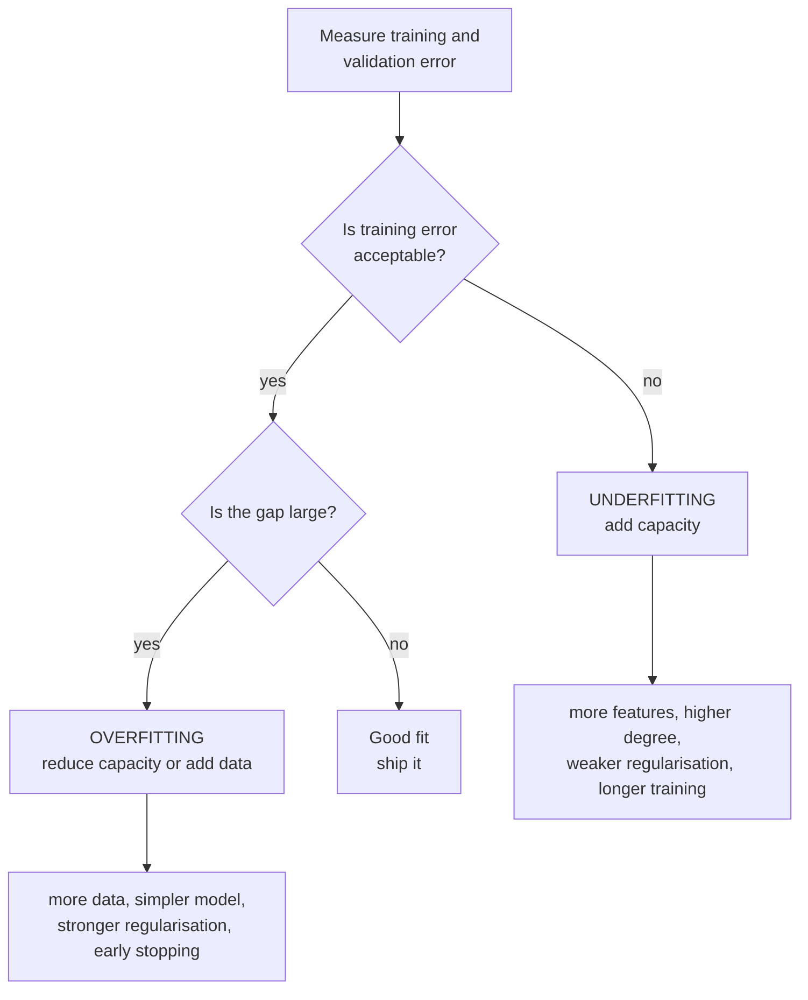

import DataCampExercise from "../../../../components/DataCampExercise.astro";
import Figure from "../../../../components/Figure.astro";
import Quiz from "../../../../components/Quiz.astro";

## What you'll learn

- the two-number diagnosis: training error and validation error, and what their **gap** means
- the **complexity curve**, and why the training half of it is nearly useless on its own
- the **learning curve**, and the one question only it can answer — will more data help?
- the fixes, which are opposites, and why applying the wrong one makes things worse
- how to read the measured numbers on a real curve rather than eyeballing a shape

## Intuition

A model can fail in exactly two ways, and they look nothing alike.

**Underfitting** is a model too rigid to represent the pattern. A straight line through a curve
misses low, then high, then low — and it will keep missing however much data you give it. The
training error is high, and the validation error is barely worse.

**Overfitting** is a model flexible enough to memorise the training rows, including their noise.
Training error goes to zero and validation error goes up, because the noise it learned is different
noise from the noise in the new rows.

The diagnosis needs two numbers, never one:

| Training error | Validation error | Diagnosis |
| --- | --- | --- |
| High | High, similar | **Underfitting** — too rigid |
| Low | Much higher | **Overfitting** — memorising |
| Low | Low, similar | Good fit |
| High | Lower than training | Something is wrong: a leak, a bad split, or heavy regularisation only active at training time |

That last row is the one people misread as good news.



## Seeing both at once

<Figure
  src="/images/ml/phase-07-optimization/bias-variance/many-fits"
  alt="Three panels, each showing fifty faint fitted curves from fifty different training samples, plus their average and the true function. Degree 1 curves cluster tightly but miss the truth; degree 15 curves scatter wildly."
  title="Fifty samples, fifty fits, three capacities"
  caption="Left: every fit is nearly the same line, and every one is wrong — that is underfitting. Right: the average is close to the truth but no individual fit is — that is overfitting."
/>

### Reading the plot

- **Degree 1** produces fifty almost identical lines, all of them missing the curve. Consistent and
  consistently wrong. More data changes nothing.
- **Degree 4** tracks the truth and the spread is modest. This is what a good fit looks like when
  you can see the whole distribution of fits rather than one.
- **Degree 15** has an average close to the truth, but individual fits swing far from it. Any single
  model you happen to train is a draw from that scatter.

The right panel is the crucial insight: **an overfitted model is not systematically wrong, it is
unreliable.** Its average is fine; its individual predictions are not.

## The complexity curve

<Figure
  src="/images/ml/phase-07-optimization/bias-variance/complexity-curve"
  alt="Training MSE and 5-fold cross-validated MSE plotted against polynomial degree from 1 to 15 on a log scale. Training error falls steadily; CV error drops to a minimum at degree 4 then rises sharply."
  title="Both errors, against capacity"
  caption="Training error falls monotonically and tells you nothing on its own. Only the CV curve turns back up, and where it turns is the answer."
/>

Measured on 120 points from the same generator:

| Degree | Training MSE | 5-fold CV MSE | Gap | Reading |
| --- | --- | --- | --- | --- |
| 1 | 0.618 | 0.634 | 0.016 | Underfitting badly |
| 2 | 0.347 | 0.390 | 0.043 | Still underfitting |
| 3 | 0.319 | 0.354 | 0.036 | Improving |
| **4** | **0.120** | **0.139** | 0.019 | **Best** |
| 6 | 0.115 | 0.144 | 0.029 | Marginally worse |
| 10 | 0.112 | 0.337 | 0.225 | Overfitting |
| 15 | 0.100 | **9.669** | 9.569 | Overfitting catastrophically |

Three things worth noticing:

1. **Training MSE falls from 0.618 to 0.100 across the whole range** and never once warns you. A
   model selected on training error alone would choose degree 15.
2. **Degrees 4 and 6 are indistinguishable** — 0.139 against 0.144. Prefer the simpler one.
3. **Degree 15 is not slightly worse, it is 70 times worse.** Overfitting does not degrade
   gracefully once the model has enough capacity to interpolate.

## The learning curve

The complexity curve varies capacity at fixed data. The learning curve does the reverse, and it
answers a different question: **would collecting more data help?**

<Figure
  src="/images/ml/phase-07-optimization/bias-variance/learning-curves"
  alt="Two panels of learning curves against training set size. Left, degree 1: both curves flatten at around 0.60 MSE almost immediately. Right, degree 15: both curves fall to around 0.29 and the validation curve is still declining."
  title="Fixed capacity, growing training set"
  caption="Degree 1's validation MSE improves 3% between 20 and 200 samples — it plateaued long ago. Degree 15's improves 20% and is still falling. That difference is the whole answer."
/>

The two panels answer the same question differently:

| Shape | Diagnosis | Will more data help? |
| --- | --- | --- |
| Both curves flat at a **high** error | Underfitting | **No.** Add capacity instead. |
| Validation still falling as data grows | Variance still being reduced | **Yes.** Keep collecting. |
| Gap persists and validation is flat | Overfitting, saturated | No. Simplify or regularise. |
| Both converge at a **low** error | Good fit | Nothing to do. |

Measured on the plot: degree 1 goes from 0.614 to 0.596 — a 3% gain from ten times the data, which
is another way of saying no gain. Degree 15 goes from 0.368 to 0.294, a 20% gain and still
descending. Notice also that degree 15 has *stopped* overfitting by 200 samples: the gap that would
have been enormous at 20 samples has closed. **That is data doing the work regularisation would
otherwise have to do.**

This is a genuinely useful business answer. "Should we spend three months labelling more data?" has
a defensible answer, and it is on this plot.

## Worked example by hand

Four models of the same problem, each measured on the same held-out set:

| Model | Train RMSE | Validation RMSE | Gap | Gap as % of train |
| --- | --- | --- | --- | --- |
| A: linear | 69,051 | 69,218 | 167 | 0.2% |
| B: depth-4 tree | 58,200 | 61,400 | 3,200 | 5.5% |
| C: unpruned tree | 0 | 70,676 | 70,676 | ∞ |
| D: random forest | 18,476 | 50,010 | 31,534 | 171% |

**Step 1 — is the training error acceptable?** Against an expert baseline of about 35,530, models A
and B are already failing on the *training* set. That settles it: they are underfitting, and no
amount of regularisation will help.

**Step 2 — for the rest, how big is the gap?** Model C's training error is exactly zero, which is
not an achievement but a description of what an unpruned tree does. Model D has a large gap and
still the best validation score.

**Step 3 — choose the fix.**

- A and B: **add capacity.** More features, a deeper model, less regularisation.
- C: **reduce capacity.** `max_depth`, `min_samples_leaf`, or pruning.
- D: **more data, or mild regularisation.** The gap says there is headroom; the validation score
  says it is still the best option available.

**The trap:** models A and D both need attention, and the correct actions are opposites. Applying
regularisation to A — the intuitive response to "the model is not good enough" — makes it worse.

## Fixing each

### Underfitting

| Fix | Mechanism |
| --- | --- |
| More features, or better ones | Gives the model something to work with |
| Higher-capacity model | Degree, depth, layers, kernel |
| Reduce regularisation | Raise `C`, lower `alpha`, raise `max_depth` |
| Train longer | More epochs, more estimators |
| Remove aggressive feature selection | You may have discarded the signal |

**More data does not fix underfitting.** A straight line fitted to a million curved points is the
same straight line.

### Overfitting

| Fix | Mechanism |
| --- | --- |
| More training data | The most reliable fix, and usually the most expensive |
| Simpler model | Lower degree, shallower tree, fewer parameters |
| Stronger regularisation | Lower `C`, raise `alpha`, raise `min_samples_leaf` |
| Early stopping | Halt before the model starts memorising |
| Feature selection | Fewer columns, less to memorise |
| Ensembling | Averaging cancels variance — the whole of [Phase 5](/machine-learning/phase-05---ensemble-learning/phase-5---ensemble-learning/) |
| Data augmentation | Synthetic variety where collecting real data is impossible |

```python title="diagnose.py" showLineNumbers{1}
import numpy as np
from sklearn.linear_model import LinearRegression
from sklearn.model_selection import KFold
from sklearn.pipeline import make_pipeline
from sklearn.preprocessing import PolynomialFeatures

rng = np.random.default_rng(4)
x = rng.uniform(0, 6, 120)
y = np.sin(1.5 * x) + 0.35 * x + rng.normal(0, 0.35, 120)

folds = list(KFold(5, shuffle=True, random_state=0).split(x))

for degree in (1, 2, 4, 10, 15):
    train = ((y - np.polyval(np.polyfit(x, y, degree), x)) ** 2).mean()
    cv = np.mean([
        ((y[va] - np.polyval(np.polyfit(x[tr], y[tr], degree), x[va])) ** 2).mean()
        for tr, va in folds
    ])
    verdict = ("underfitting" if cv > 0.3 and cv / train < 1.5
               else "overfitting" if cv / train > 2
               else "good fit")
    print(f"degree {degree:2d}  train {train:.4f}  cv {cv:8.4f}  {verdict}")

# degree  1  train 0.6182  cv   0.6338  underfitting
# degree  2  train 0.3472  cv   0.3896  underfitting
# degree  4  train 0.1201  cv   0.1387  good fit
# degree 10  train 0.1117  cv   0.3368  overfitting
# degree 15  train 0.1004  cv   9.6689  overfitting
```

## See it move

```p5 title="Watching capacity overshoot" desc="A model's capacity increases step by step. The training error keeps falling while the validation error bottoms out and climbs — the gap between the two bars is the overfitting." height="330"
let pts = [];
let degree = 1;
let t = 0;
let hist = [];
function genPts() {
  pts = [];
  for (let i = 0; i < 26; i++) {
    const x = random(-3, 3);
    pts.push({ x, y: 0.4 * x * x + 0.6 * x + 1 + randomGaussian(0, 1.1) });
  }
  hist = [];
  degree = 1;
  t = 0;
}
function setup() {
  createCanvas(600, 330);
  textFont("monospace");
  genPts();
}
function fitPoly(data, d) {
  const n = data.length, cols = d + 1;
  const A = [], b = [];
  for (let r = 0; r < cols; r++) {
    A.push(new Array(cols).fill(0));
    b.push(0);
  }
  for (const p of data) {
    const pw = [];
    let v = 1;
    for (let r = 0; r < cols; r++) { pw.push(v); v *= p.x; }
    for (let r = 0; r < cols; r++) {
      b[r] += pw[r] * p.y;
      for (let c = 0; c < cols; c++) A[r][c] += pw[r] * pw[c];
    }
  }
  for (let i = 0; i < cols; i++) A[i][i] += 1e-7;
  for (let i = 0; i < cols; i++) {
    const piv = A[i][i] || 1e-9;
    for (let j = i; j < cols; j++) A[i][j] /= piv;
    b[i] /= piv;
    for (let k = 0; k < cols; k++) {
      if (k === i) continue;
      const f = A[k][i];
      for (let j = i; j < cols; j++) A[k][j] -= f * A[i][j];
      b[k] -= f * b[i];
    }
  }
  return b;
}
function evalPoly(co, x) {
  let y = 0, v = 1;
  for (const c of co) { y += c * v; v *= x; }
  return y;
}
function mse(data, co) {
  let s = 0;
  for (const p of data) { const e = evalPoly(co, p.x) - p.y; s += e * e; }
  return s / data.length;
}
function draw() {
  background(13, 17, 23);
  const half = Math.floor(pts.length / 2);
  const train = pts.slice(0, half), val = pts.slice(half);
  const co = fitPoly(train, degree);
  const trE = mse(train, co), vaE = mse(val, co);

  const gx = 40, gw = 330, gy = 46, gh = 200;
  const px = (x) => gx + (x + 3.4) / 6.8 * gw;
  const py = (y) => gy + gh - (y + 3) / 12 * gh;

  noStroke();
  for (const p of train) { fill(75, 139, 190); ellipse(px(p.x), py(p.y), 7); }
  for (const p of val) { fill(255, 211, 67); ellipse(px(p.x), py(p.y), 7); }
  stroke(120, 200, 120);
  strokeWeight(2.2);
  noFill();
  beginShape();
  for (let x = -3.4; x <= 3.4; x += 0.05) vertex(px(x), py(constrain(evalPoly(co, x), -3, 9)));
  endShape();

  noStroke();
  fill(200);
  textSize(12);
  textAlign(LEFT, TOP);
  text("degree " + degree, gx, 18);
  fill(75, 139, 190);
  textSize(10);
  text("● training points", gx + 100, 20);
  fill(255, 211, 67);
  text("● held-out points", gx + 220, 20);

  // error bars
  const bx = 420, bw = 60, by = 246, scale = 26;
  fill(75, 139, 190);
  rect(bx, by - Math.min(trE, 7) * scale, bw, Math.min(trE, 7) * scale);
  fill(255, 211, 67);
  rect(bx + bw + 14, by - Math.min(vaE, 7) * scale, bw, Math.min(vaE, 7) * scale);
  fill(160);
  textSize(10);
  textAlign(CENTER, TOP);
  text("train", bx + bw / 2, by + 6);
  text("held out", bx + bw + 14 + bw / 2, by + 6);
  textAlign(CENTER, BOTTOM);
  fill(220);
  text(trE.toFixed(2), bx + bw / 2, by - Math.min(trE, 7) * scale - 4);
  text(vaE.toFixed(2), bx + bw + 14 + bw / 2, by - Math.min(vaE, 7) * scale - 4);

  fill(150);
  textSize(11);
  textAlign(CENTER, BOTTOM);
  text("training error only ever falls; held-out error turns back up", width / 2, height - 12);

  t++;
  if (t % 70 === 0) {
    degree++;
    if (degree > 11) genPts();
  }
}
function mousePressed() { genPts(); }
```

## Pitfalls

:::danger[Diagnosing from one number]
"Our model is 94% accurate" cannot distinguish a good fit from severe overfitting. Always report
training and validation together, and the gap between them.
:::

:::caution[Applying the wrong fix]
Regularising an underfitting model makes it worse; collecting more data for an underfitting model
wastes months. The fixes are opposites, so the diagnosis has to come first.
:::

:::caution[Validation error lower than training error]
Usually a symptom, not a success. Common causes: a leak, dropout or other regularisation active
only during training, or a validation set that happens to be easier. Investigate rather than
celebrate.
:::

:::caution[Tuning until the validation score is perfect]
Enough rounds of "adjust, re-measure on validation" and you have overfitted to the validation set
itself. That is what
[nested cross-validation](/machine-learning/phase-07---model-optimization--tuning/hyperparameter-tuning-with-gridsearchcv/)
measures — and it typically costs about half a point of accuracy.
:::

<Quiz
  questions={[
    {
      q: "Training RMSE 69,051 and validation RMSE 69,218. What is the diagnosis?",
      options: [
        "Overfitting — the errors are high",
        "Underfitting — the tiny gap means the model is not flexible enough to fit even the training data",
        "A good fit",
        "Data leakage",
      ],
      answer: 1,
      explain: "A gap of 167 on 69,000 is essentially zero. The model is not memorising anything because it cannot; both errors are high for the same reason.",
    },
    {
      q: "Your learning curves converge at a high error and flatten. Should you collect more data?",
      options: [
        "Yes, always",
        "No — converged-and-high means underfitting, and more of the same data cannot help a model that cannot represent the pattern",
        "Only if the dataset is small",
        "Impossible to say from a learning curve",
      ],
      answer: 1,
      explain: "Converged curves mean the model has extracted everything it can. Add capacity or better features instead. A wide, still-narrowing gap is the shape that justifies more data.",
    },
    {
      q: "Training MSE falls from 0.618 at degree 1 to 0.100 at degree 15, while CV MSE goes from 0.634 to 9.669. What does the training curve tell you?",
      options: [
        "That degree 15 is the best model",
        "Essentially nothing — training error falls monotonically with capacity by construction, so only the CV curve carries information",
        "That the data is noisy",
        "That degree 15 needs more iterations",
      ],
      answer: 1,
      explain: "More capacity can always fit the training set at least as well. A model chosen on training error alone will always pick the most complex option available.",
    },
    {
      q: "Your validation error is lower than your training error. What should you do?",
      options: [
        "Celebrate and ship it",
        "Investigate — this usually indicates a leak, training-only regularisation such as dropout, or an unusually easy validation split",
        "Increase model capacity",
        "Nothing; it is common and harmless",
      ],
      answer: 1,
      explain: "There are benign explanations, and there are leaks. Both are worth identifying before the result is reported.",
    },
  ]}
/>

## 🧪 Try It Yourself

### Exercise 1 – Diagnose from two numbers

<DataCampExercise
  lang="python"
  hint={`Compare the ratio of validation error to training error, and whether training error is acceptable.`}
  code={`# Task: Exercise 1 - Diagnose from two numbers
def diagnose(train, val, acceptable):
    if train > acceptable:
        return "underfitting"
    if val / train > ___:              # replace ___ with 2
        return "overfitting"
    return "good fit"

cases = [
    ("linear", 69051, 69218),
    ("unpruned tree", 1, 70676),
    ("forest", 18476, 50010),
]
for name, tr, va in cases:
    print(f"{name:<14} {diagnose(tr, va, 40000)}")

# -- Expected Output -------------------------------------------
# linear         underfitting
# unpruned tree  overfitting
# forest         overfitting
# --------------------------------------------------------------`}
  solution={`def diagnose(train, val, acceptable):
    if train > acceptable:
        return "underfitting"
    if val / train > 2:
        return "overfitting"
    return "good fit"

cases = [
    ("linear", 69051, 69218),
    ("unpruned tree", 1, 70676),
    ("forest", 18476, 50010),
]
for name, tr, va in cases:
    print(f"{name:<14} {diagnose(tr, va, 40000)}")`}
  sct={`test_output_contains("linear         underfitting")
success_msg("Two numbers, three different problems, three opposite fixes.")`}
  height={198}
/>

### Exercise 2 – Build the complexity curve

<DataCampExercise
  lang="python"
  hint={`Fit at each degree, then score on the held-out folds.`}
  code={`# Task: Exercise 2 - Build the complexity curve
import numpy as np
from sklearn.model_selection import KFold

rng = np.random.default_rng(4)
x = rng.uniform(0, 6, 120)
y = np.sin(1.5 * x) + 0.35 * x + rng.normal(0, 0.35, 120)
folds = list(KFold(5, shuffle=True, random_state=0).split(x))

for degree in (1, 4, 15):
    train = ((y - np.polyval(np.polyfit(x, y, degree), x)) ___ 2).mean()
    # replace ___ with **
    cv = np.mean([((y[va] - np.polyval(np.polyfit(x[tr], y[tr], degree), x[va])) ** 2).mean()
                  for tr, va in folds])
    print(f"degree {degree:2d}  train {train:.4f}  cv {cv:8.4f}")

# -- Expected Output -------------------------------------------
# degree  1  train 0.6182  cv   0.6338
# degree  4  train 0.1201  cv   0.1387
# degree 15  train 0.1004  cv   9.6689
# --------------------------------------------------------------`}
  solution={`import numpy as np
from sklearn.model_selection import KFold

rng = np.random.default_rng(4)
x = rng.uniform(0, 6, 120)
y = np.sin(1.5 * x) + 0.35 * x + rng.normal(0, 0.35, 120)
folds = list(KFold(5, shuffle=True, random_state=0).split(x))

for degree in (1, 4, 15):
    train = ((y - np.polyval(np.polyfit(x, y, degree), x)) ** 2).mean()
    cv = np.mean([((y[va] - np.polyval(np.polyfit(x[tr], y[tr], degree), x[va])) ** 2).mean()
                  for tr, va in folds])
    print(f"degree {degree:2d}  train {train:.4f}  cv {cv:8.4f}")`}
  sct={`test_output_contains("cv   9.6689")
success_msg("Training error fell by a sixth; CV error rose seventyfold.")`}
  height={228}
/>

### Exercise 3 – Fix an underfitting model

<DataCampExercise
  lang="python"
  hint={`Add capacity by raising the polynomial degree inside the pipeline.`}
  code={`# Task: Exercise 3 - Fix an underfitting model
import numpy as np
from sklearn.linear_model import LinearRegression
from sklearn.model_selection import cross_val_score
from sklearn.pipeline import make_pipeline
from sklearn.preprocessing import PolynomialFeatures

rng = np.random.default_rng(4)
x = rng.uniform(0, 6, 120).reshape(-1, 1)
y = np.sin(1.5 * x.ravel()) + 0.35 * x.ravel() + rng.normal(0, 0.35, 120)

for degree in (1, ___):                    # replace ___ with 4
    model = make_pipeline(PolynomialFeatures(degree), LinearRegression())
    mse = -cross_val_score(model, x, y, cv=5,
                           scoring="neg_mean_squared_error").mean()
    print(f"degree {degree}: CV MSE {mse:.4f}")

# -- Expected Output -------------------------------------------
# degree 1: CV MSE 0.6473
# degree 4: CV MSE 0.1387
# --------------------------------------------------------------`}
  solution={`import numpy as np
from sklearn.linear_model import LinearRegression
from sklearn.model_selection import cross_val_score
from sklearn.pipeline import make_pipeline
from sklearn.preprocessing import PolynomialFeatures

rng = np.random.default_rng(4)
x = rng.uniform(0, 6, 120).reshape(-1, 1)
y = np.sin(1.5 * x.ravel()) + 0.35 * x.ravel() + rng.normal(0, 0.35, 120)

for degree in (1, 4):
    model = make_pipeline(PolynomialFeatures(degree), LinearRegression())
    mse = -cross_val_score(model, x, y, cv=5,
                           scoring="neg_mean_squared_error").mean()
    print(f"degree {degree}: CV MSE {mse:.4f}")`}
  sct={`test_output_contains("degree 4")
success_msg("Capacity, not regularisation — the opposite fix would have made it worse.")`}
  height={228}
/>

### Exercise 4 – Read a learning curve

<DataCampExercise
  lang="python"
  hint={`learning_curve returns sizes, train scores and validation scores.`}
  code={`# Task: Exercise 4 - Read a learning curve
import numpy as np
from sklearn.linear_model import LinearRegression
from sklearn.model_selection import ___     # replace ___ with learning_curve
from sklearn.pipeline import make_pipeline
from sklearn.preprocessing import PolynomialFeatures

rng = np.random.default_rng(5)
x = rng.uniform(0, 6, 200).reshape(-1, 1)
y = np.sin(1.5 * x.ravel()) + 0.35 * x.ravel() + rng.normal(0, 0.35, 200)

for degree, label in ((1, "degree 1"), (15, "degree 15")):
    model = make_pipeline(PolynomialFeatures(degree), LinearRegression())
    sizes, tr, va = learning_curve(model, x, y, cv=5,
                                   train_sizes=np.linspace(0.2, 1.0, 5),
                                   scoring="neg_mean_squared_error")
    val = -va.mean(axis=1)
    improvement = (val[0] - val[-1]) / val[0]
    print(f"{label}: val MSE {val[0]:.4f} -> {val[-1]:.4f}"
          f"   more data helped: {improvement > 0.10}")

# -- Expected Output -------------------------------------------
# degree 1: val MSE 0.6139 -> 0.5964   more data helped: False
# degree 15: val MSE 0.3683 -> 0.2935   more data helped: True
# --------------------------------------------------------------`}
  solution={`import numpy as np
from sklearn.linear_model import LinearRegression
from sklearn.model_selection import learning_curve
from sklearn.pipeline import make_pipeline
from sklearn.preprocessing import PolynomialFeatures

rng = np.random.default_rng(5)
x = rng.uniform(0, 6, 200).reshape(-1, 1)
y = np.sin(1.5 * x.ravel()) + 0.35 * x.ravel() + rng.normal(0, 0.35, 200)

for degree, label in ((1, "degree 1"), (15, "degree 15")):
    model = make_pipeline(PolynomialFeatures(degree), LinearRegression())
    sizes, tr, va = learning_curve(model, x, y, cv=5,
                                   train_sizes=np.linspace(0.2, 1.0, 5),
                                   scoring="neg_mean_squared_error")
    val = -va.mean(axis=1)
    improvement = (val[0] - val[-1]) / val[0]
    print(f"{label}: val MSE {val[0]:.4f} -> {val[-1]:.4f}"
          f"   more data helped: {improvement > 0.10}")`}
  sct={`test_output_contains("degree 15")
success_msg("Degree 15 improved 20% with more data; degree 1 improved 3%. That is the answer.")`}
  height={248}
/>

### Exercise 5 – Regularisation on the wrong patient

<DataCampExercise
  lang="python"
  hint={`Apply increasing Ridge alpha to a model that is already underfitting.`}
  code={`# Task: Exercise 5 - Regularisation on the wrong patient
import numpy as np
from sklearn.linear_model import Ridge
from sklearn.model_selection import cross_val_score
from sklearn.pipeline import make_pipeline
from sklearn.preprocessing import PolynomialFeatures, StandardScaler

rng = np.random.default_rng(4)
x = rng.uniform(0, 6, 120).reshape(-1, 1)
y = np.sin(1.5 * x.ravel()) + 0.35 * x.ravel() + rng.normal(0, 0.35, 120)

for alpha in (0.001, 1.0, 100.0):
    model = make_pipeline(PolynomialFeatures(1), StandardScaler(),
                          Ridge(alpha=___))          # replace ___ with alpha
    mse = -cross_val_score(model, x, y, cv=5,
                           scoring="neg_mean_squared_error").mean()
    print(f"alpha {alpha:<8} CV MSE {mse:.4f}")

# -- Expected Output -------------------------------------------
# alpha 0.001    CV MSE 0.6473
# alpha 1.0      CV MSE 0.6476
# alpha 100.0    CV MSE 0.7820
# --------------------------------------------------------------`}
  solution={`import numpy as np
from sklearn.linear_model import Ridge
from sklearn.model_selection import cross_val_score
from sklearn.pipeline import make_pipeline
from sklearn.preprocessing import PolynomialFeatures, StandardScaler

rng = np.random.default_rng(4)
x = rng.uniform(0, 6, 120).reshape(-1, 1)
y = np.sin(1.5 * x.ravel()) + 0.35 * x.ravel() + rng.normal(0, 0.35, 120)

for alpha in (0.001, 1.0, 100.0):
    model = make_pipeline(PolynomialFeatures(1), StandardScaler(),
                          Ridge(alpha=alpha))
    mse = -cross_val_score(model, x, y, cv=5,
                           scoring="neg_mean_squared_error").mean()
    print(f"alpha {alpha:<8} CV MSE {mse:.4f}")`}
  sct={`test_output_contains("alpha 100.0")
success_msg("Regularising an underfitting model only makes it worse — every time.")`}
  height={238}
/>

## Recap

- Two numbers, never one. High-and-close is underfitting; low-with-a-gap is overfitting.
- Training error falls monotonically with capacity, so it carries no information on its own. On the
  measured curve it went 0.618 → 0.100 while CV error went 0.634 → 9.669.
- The complexity curve locates the best capacity; the learning curve says whether more data would
  help.
- An overfitted model is not systematically wrong — its *average* is fine and its individual
  predictions are unreliable.
- The fixes are opposites. Diagnose before acting: regularising an underfitting model makes it
  worse.
- Validation error below training error is a symptom to investigate, not a success.

### Exercise 6 – Turn two numbers into a next action

<DataCampExercise
  lang="python"
  hint={`A low training score means bias. A high training score with a large gap means variance. The rule needs both numbers, never one.`}
  code={`# Task: Exercise 6 - Turn two numbers into a next action
runs = [
    ("linear model", 0.6210, 0.6180),
    ("depth 4 tree", 0.8930, 0.8610),
    ("depth 20 tree", 1.0000, 0.8190),
    ("depth 20, 10x data", 1.0000, 0.9010),
]
for name, train, validation in runs:
    gap = train - ___                        # replace ___ with validation
    if train < 0.80:
        diagnosis = "underfits: bias dominates"
        action = "add capacity or features"
    elif gap > 0.10:
        diagnosis = "overfits: variance dominates"
        action = "more data or regularisation"
    else:
        diagnosis = "balanced"
        action = "look for a better feature"
    print(f"{name:20s} train {train:.4f}  val {validation:.4f}  "
          f"gap {gap:+.4f}  {diagnosis}")
    print(f"{'':20s} -> {action}")

# -- Expected Output -------------------------------------------
# linear model         train 0.6210  val 0.6180  gap +0.0030  underfits: bias dominates
#                      -> add capacity or features
# depth 4 tree         train 0.8930  val 0.8610  gap +0.0320  balanced
#                      -> look for a better feature
# depth 20 tree        train 1.0000  val 0.8190  gap +0.1810  overfits: variance dominates
#                      -> more data or regularisation
# depth 20, 10x data   train 1.0000  val 0.9010  gap +0.0990  balanced
#                      -> look for a better feature
# --------------------------------------------------------------`}
  solution={`runs = [
    ("linear model", 0.6210, 0.6180),
    ("depth 4 tree", 0.8930, 0.8610),
    ("depth 20 tree", 1.0000, 0.8190),
    ("depth 20, 10x data", 1.0000, 0.9010),
]
for name, train, validation in runs:
    gap = train - validation
    if train < 0.80:
        diagnosis = "underfits: bias dominates"
        action = "add capacity or features"
    elif gap > 0.10:
        diagnosis = "overfits: variance dominates"
        action = "more data or regularisation"
    else:
        diagnosis = "balanced"
        action = "look for a better feature"
    print(f"{name:20s} train {train:.4f}  val {validation:.4f}  "
          f"gap {gap:+.4f}  {diagnosis}")
    print(f"{'':20s} -> {action}")`}
  sct={`test_output_contains("overfits: variance dominates")
success_msg("Rows three and four are the same model — only the data volume changed, and the diagnosis flipped. That is what makes 'more data' the correct action for variance and a waste of money for bias: the first row's gap is already 0.0030, so no amount of extra data will move it.")`}
  height={330}
/>

## Next

Continue to
[Bias vs Variance Tradeoff](/machine-learning/phase-07---model-optimization--tuning/bias-vs-variance-tradeoff/)
— the same two failures, derived as an exact decomposition of expected error into three terms.
