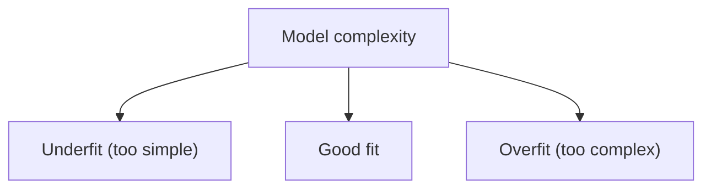

Every model you train will be wrong in one of two directions: too simple to see the
pattern, or so flexible it memorizes the noise. Learning to tell these apart from a
handful of numbers — train score, validation score — is the single most useful
diagnostic skill in machine learning, and it's the topic that opens every serious
tuning workflow.

## Underfitting

Underfitting happens when the model is too simple.

Symptoms:

- training score is poor
- validation score is also poor

Fixes:

- add features
- use a stronger model (e.g., trees/boosting)
- lower regularization

## Overfitting

Overfitting happens when the model learns noise.

Symptoms:

- training score is great
- validation/test score is much worse

Fixes:

- simplify model
- add regularization
- get more data
- use cross-validation

## Visual intuition



:::tip[From the book]
*Hands-On Machine Learning* (Géron) generates a noisy quadratic dataset and fits three
models to it: a straight line, a quadratic curve, and a 300-degree polynomial. The
straight line **underfits** — it's too rigid to capture the curve. The 300-degree
polynomial **overfits** — it "wiggles around to get as close as possible to the
training instances," chasing noise instead of signal. The quadratic model generalizes
best because it matches the true shape the data was generated from. The book's rule of
thumb: if a model performs well on training data but poorly under cross-validation,
it's overfitting; if it performs poorly on both, it's underfitting.
:::

## Runnable example: comparing model complexity

The clearest way to see under/overfitting is to fit the *same* data with models of
increasing complexity (via `PolynomialFeatures`) and compare train vs. validation
error at each degree:

```python title="compare_complexity.py" showLineNumbers{1}
import numpy as np
from sklearn.linear_model import LinearRegression
from sklearn.metrics import mean_squared_error
from sklearn.model_selection import train_test_split
from sklearn.pipeline import Pipeline
from sklearn.preprocessing import PolynomialFeatures

rng = np.random.RandomState(42)
X = 6 * rng.rand(100, 1) - 3
y = 0.5 * X**2 + X + 2 + rng.randn(100, 1)

X_train, X_val, y_train, y_val = train_test_split(X, y, test_size=0.2, random_state=42)

for degree in [1, 2, 300]:
    model = Pipeline([
        ("poly", PolynomialFeatures(degree=degree, include_bias=False)),
        ("lin_reg", LinearRegression()),
    ])
    model.fit(X_train, y_train)

    train_rmse = mean_squared_error(y_train, model.predict(X_train)) ** 0.5
    val_rmse = mean_squared_error(y_val, model.predict(X_val)) ** 0.5
    gap = val_rmse - train_rmse

    label = "underfit" if train_rmse > 1.0 else ("overfit" if gap > 0.5 else "good fit")
    print(f"degree={degree:>3}  train_rmse={train_rmse:.3f}  val_rmse={val_rmse:.3f}  -> {label}")
```

```
degree=  1  train_rmse=1.084  val_rmse=1.121  -> underfit
degree=  2  train_rmse=0.789  val_rmse=0.798  -> good fit
degree=300  train_rmse=0.601  val_rmse=1.940  -> overfit
```

## Visualize it

The same noisy data, three models. **Underfitting** is too simple to capture the pattern;
**overfitting** is so flexible it chases the random noise; the **good fit** captures the real
trend and ignores the wobble — the balance you're always aiming for. Watch the fitted curve
itself morph between all three as "model complexity" slides from simple to complex and back:

```p5 title="Underfitting vs good fit vs overfitting" desc="The fitted curve morphs from a straight line (underfit) through the true curve (good fit) to a wiggly high-degree fit (overfit) and back, while a dial above tracks the complexity." height="260"
let pts = [];
let lineFit = { a: 0, b: 0 };
let wiggle = [];
function trueF(x) { return Math.sin(x * 3.1) * 0.6; }
function genData() {
  pts = [];
  for (let i = 0; i < 14; i++) {
    const x = i / 13;
    pts.push({ x: x, y: trueF(x) + random(-0.18, 0.18) });
  }
}
function fitLine() {
  let mx = 0, my = 0;
  for (const p of pts) { mx += p.x; my += p.y; }
  mx /= pts.length; my /= pts.length;
  let num = 0, den = 0;
  for (const p of pts) { num += (p.x - mx) * (p.y - my); den += (p.x - mx) ** 2; }
  lineFit.b = num / den;
  lineFit.a = my - lineFit.b * mx;
}
function setup() {
  createCanvas(600, 260);
  textFont("monospace");
  textAlign(CENTER, TOP);
  randomSeed(3);
  genData();
  fitLine();
  for (let k = 0; k < 6; k++) {
    wiggle.push({ freq: 9 + k * 6, phase: random(TWO_PI), amp: 0.05 + random(0.06) });
  }
}
function underfitY(x) { return lineFit.a + lineFit.b * x; }
function goodfitY(x) { return trueF(x); }
function overfitY(x) {
  let y = trueF(x);
  for (const w of wiggle) y += w.amp * Math.sin(x * w.freq + w.phase);
  return y;
}
function smoothstep(t) { return t * t * (3 - 2 * t); }

const STAGES = [
  { fn: underfitY, label: "Underfit", sub: "too simple - misses the pattern" },
  { fn: goodfitY, label: "Good fit", sub: "captures the trend, ignores the wobble" },
  { fn: overfitY, label: "Overfit", sub: "flexible enough to chase the noise" },
];
const HOLD = 70, MORPH = 50;
const SLOT = HOLD + MORPH;
const PERIOD = STAGES.length * SLOT;

function draw() {
  background(13, 17, 23);
  const gx = 60, gy = 42, gw = width - 120, gh = height - 100;
  const px = (x) => gx + x * gw;
  const py = (y) => gy + gh / 2 - (y * (gh / 2)) / 0.9;

  const phase = frameCount % PERIOD;
  const idx = Math.floor(phase / SLOT);
  const local = phase % SLOT;
  const from = STAGES[idx];
  const to = STAGES[(idx + 1) % STAGES.length];
  const morphing = local >= HOLD;
  const t = morphing ? smoothstep((local - HOLD) / MORPH) : 0;

  const totalProgress = idx + (morphing ? t : 0);
  const dotX = 60 + (totalProgress / STAGES.length) * (width - 120);
  stroke(90);
  line(60, 14, width - 60, 14);
  noStroke();
  fill(255, 211, 67);
  ellipse(dotX, 14, 10, 10);
  fill(140);
  textSize(9);
  textAlign(LEFT, CENTER);
  text("simple", 60, 14);
  textAlign(RIGHT, CENTER);
  text("complex", width - 60, 14);
  textAlign(CENTER, TOP);

  noFill();
  stroke(50, 60, 74);
  strokeWeight(1);
  rect(gx, gy, gw, gh);

  stroke(255, 211, 67);
  strokeWeight(2.5);
  noFill();
  beginShape();
  for (let x = 0; x <= 1.0001; x += 0.02) {
    const y = morphing ? lerp(from.fn(x), to.fn(x), t) : from.fn(x);
    vertex(px(x), py(y));
  }
  endShape();

  noStroke();
  fill(75, 139, 190);
  for (const p of pts) ellipse(px(p.x), py(p.y), 7, 7);

  textAlign(CENTER, TOP);
  textSize(15);
  if (morphing) {
    if (t < 0.5) {
      fill(230, 255 * (1 - t / 0.5));
      text(from.label, width / 2, gy + gh + 10);
    } else {
      fill(230, 255 * ((t - 0.5) / 0.5));
      text(to.label, width / 2, gy + gh + 10);
    }
  } else {
    fill(230, 255);
    text(from.label, width / 2, gy + gh + 10);
  }
  fill(140);
  textSize(11);
  text(morphing ? "adjusting model complexity..." : from.sub, width / 2, gy + gh + 32);
}
```

## Learning curves: the diagnostic tool

The book's other trick — used before cross-validation scores are even available — is
to plot **learning curves**: training and validation error as a function of how many
training examples the model has seen so far. Train the model on growing subsets of the
training set (1 example, 2 examples, 3, ...) and record both errors at each size.

- **Underfitting** learning curves: both curves rise to a **plateau** and end up close
  together — but the plateau is high. More data won't help; you need a better model.
- **Overfitting** learning curves: training error stays low, but there's a persistent
  **gap** to a much higher validation error. More data (or regularization) narrows the gap.

```p5 title="Learning curves: underfit vs overfit" desc="Both curves are traced left-to-right as training-set size grows, hold at full length, fade, and retrace — underfit curves converge high, overfit curves stay far apart." height="260"
const NMAX = 60;
const TRACE_FRAMES = 90;
const HOLD = 55;
const FADE = 30;
const PERIOD = TRACE_FRAMES + HOLD + FADE;

function setup() {
  createCanvas(600, 260);
  textFont("monospace");
  textAlign(CENTER, TOP);
}
function curveY(n, start, end, noiseAmt, seedOff) {
  const t = n / NMAX;
  const eased = 1 - Math.exp(-t * 3.2);
  return start + (end - start) * eased + Math.sin(n * 0.6 + seedOff) * noiseAmt;
}
function panel(idx, pw, title_, revealN, alpha) {
  const gx = idx * pw + 20, gy = 30, gw = pw - 40, gh = height - 90;
  const underfit = idx === 0;
  noFill();
  stroke(50, 60, 74, alpha);
  rect(gx, gy, gw, gh);

  let lastX = gx, lastY = gy + gh;
  stroke(255, 100, 100, alpha);
  strokeWeight(2);
  noFill();
  beginShape();
  for (let n = 1; n <= revealN; n++) {
    const y = underfit ? curveY(n, 0.02, 0.55, 0.01, 0) : curveY(n, 0.02, 0.1, 0.01, 1);
    const vx = gx + (n / NMAX) * gw, vy = gy + gh - y * gh;
    vertex(vx, vy);
    lastX = vx; lastY = vy;
  }
  endShape();
  if (revealN < NMAX && revealN >= 1) {
    noStroke();
    fill(255, 100, 100, alpha);
    ellipse(lastX, lastY, 6, 6);
  }

  stroke(107, 169, 221, alpha);
  strokeWeight(2);
  noFill();
  beginShape();
  for (let n = 1; n <= revealN; n++) {
    const y = underfit ? curveY(n, 0.9, 0.58, 0.01, 2) : curveY(n, 0.9, 0.42, 0.01, 3);
    const vx = gx + (n / NMAX) * gw, vy = gy + gh - y * gh;
    vertex(vx, vy);
    lastX = vx; lastY = vy;
  }
  endShape();
  if (revealN < NMAX && revealN >= 1) {
    noStroke();
    fill(107, 169, 221, alpha);
    ellipse(lastX, lastY, 6, 6);
  }

  noStroke();
  fill(210, alpha);
  textSize(13);
  text(title_, gx + gw / 2, gy + gh + 10);
  fill(140, alpha);
  textSize(10);
  text(underfit ? "curves converge, but high" : "persistent gap between curves", gx + gw / 2, gy + gh + 28);
}
function draw() {
  background(13, 17, 23);
  const phase = frameCount % PERIOD;
  let revealN, alpha;
  if (phase < TRACE_FRAMES) {
    revealN = map(phase, 0, TRACE_FRAMES, 1, NMAX);
    alpha = 255;
  } else if (phase < TRACE_FRAMES + HOLD) {
    revealN = NMAX;
    alpha = 255;
  } else {
    revealN = NMAX;
    alpha = map(phase, TRACE_FRAMES + HOLD, PERIOD, 255, 0);
  }
  const pw = width / 2;
  panel(0, pw, "Underfitting", revealN, alpha);
  panel(1, pw, "Overfitting", revealN, alpha);
  fill(255, 100, 100, alpha);
  noStroke();
  ellipse(24, 14, 8, 8);
  fill(200, alpha);
  textSize(10);
  textAlign(LEFT, CENTER);
  text("train error", 34, 14);
  fill(107, 169, 221, alpha);
  ellipse(120, 14, 8, 8);
  fill(200, alpha);
  text("val error", 130, 14);
  textAlign(CENTER, TOP);
}
```

## Mini-checkpoint

Your model has:

- train accuracy: 99%
- validation accuracy: 75%

What is happening?

(Overfitting.)

import DataCampExercise from "../../../../components/DataCampExercise.astro";

## 🧪 Try It Yourself

### Exercise 1 – Build a Polynomial Pipeline

<DataCampExercise
  lang="python"
  hint={`Chain \`PolynomialFeatures\` and \`LinearRegression\` inside a \`Pipeline\`.`}
  code={`# Task: Exercise 1 – Build a Polynomial Pipeline
from sklearn.pipeline import ___   # replace ___ with Pipeline
from sklearn.preprocessing import PolynomialFeatures
from sklearn.linear_model import LinearRegression
import numpy as np

X = np.array([[1], [2], [3], [4], [5]], dtype=float)
y = np.array([2.1, 4.9, 10.2, 17.8, 27.1])

model = ___([
    ("poly", PolynomialFeatures(degree=2, include_bias=False)),
    ("lin_reg", LinearRegression()),
])
model.fit(X, y)
print("Coefficients:", model.named_steps["lin_reg"].coef_.round(1))

# ── Expected Output ───────────────────────────────────────────
# Coefficients: [-0.5  1.5]
# ──────────────────────────────────────────────────────────────`}
  solution={`from sklearn.pipeline import Pipeline
from sklearn.preprocessing import PolynomialFeatures
from sklearn.linear_model import LinearRegression
import numpy as np

X = np.array([[1], [2], [3], [4], [5]], dtype=float)
y = np.array([2.1, 4.9, 10.2, 17.8, 27.1])

model = Pipeline([
    ("poly", PolynomialFeatures(degree=2, include_bias=False)),
    ("lin_reg", LinearRegression()),
])
model.fit(X, y)
print("Coefficients:", model.named_steps["lin_reg"].coef_.round(1))`}
  sct={`test_output_contains("Coefficients:")
success_msg("Polynomial pipeline built correctly!")`}
  height={168}
/>

### Exercise 2 – Spot the Overfit Gap

<DataCampExercise
  lang="python"
  hint={`Compute the RMSE gap as \`val_rmse - train_rmse\`; a big positive gap means overfitting.`}
  code={`# Task: Exercise 2 – Spot the Overfit Gap
from sklearn.metrics import mean_squared_error
import numpy as np

y_train = np.array([10, 12, 9, 11, 10])
train_pred = np.array([10.0, 12.0, 9.0, 11.0, 10.0])   # near-perfect fit
y_val = np.array([10, 13, 8, 12, 9])
val_pred = np.array([14.0, 6.0, 15.0, 4.0, 16.0])       # wildly off

train_rmse = ___(y_train, train_pred) ** 0.5   # replace ___ with mean_squared_error
val_rmse = ___(y_val, val_pred) ** 0.5         # replace ___ with mean_squared_error
gap = val_rmse - train_rmse
print(f"gap: {gap:.1f}")
print("overfitting" if gap > 2 else "not overfitting")

# ── Expected Output ───────────────────────────────────────────
# gap: 8.6
# overfitting
# ──────────────────────────────────────────────────────────────`}
  solution={`from sklearn.metrics import mean_squared_error
import numpy as np

y_train = np.array([10, 12, 9, 11, 10])
train_pred = np.array([10.0, 12.0, 9.0, 11.0, 10.0])
y_val = np.array([10, 13, 8, 12, 9])
val_pred = np.array([14.0, 6.0, 15.0, 4.0, 16.0])

train_rmse = mean_squared_error(y_train, train_pred) ** 0.5
val_rmse = mean_squared_error(y_val, val_pred) ** 0.5
gap = val_rmse - train_rmse
print(f"gap: {gap:.1f}")
print("overfitting" if gap > 2 else "not overfitting")`}
  sct={`test_output_contains("overfitting")
success_msg("You caught the overfitting gap!")`}
  height={168}
/>

### Exercise 3 – Fix an Underfitting Model

<DataCampExercise
  lang="python"
  hint={`Raising the polynomial \`degree\` gives the model more capacity to fit curved data.`}
  code={`# Task: Exercise 3 – Fix an Underfitting Model
from sklearn.pipeline import Pipeline
from sklearn.preprocessing import PolynomialFeatures
from sklearn.linear_model import LinearRegression
import numpy as np

X = np.array([[-2], [-1], [0], [1], [2]], dtype=float)
y = np.array([4.2, 0.9, 0.1, 1.1, 4.0])   # looks quadratic, not linear

degree = ___   # replace ___ with 2 (a straight line underfits this curve)
model = Pipeline([
    ("poly", PolynomialFeatures(degree=degree, include_bias=False)),
    ("lin_reg", LinearRegression()),
])
model.fit(X, y)
preds = model.predict(X)
print("Max residual:", round(float(np.max(np.abs(preds - y))), 1))

# ── Expected Output ───────────────────────────────────────────
# Max residual: 0.1
# ──────────────────────────────────────────────────────────────`}
  solution={`from sklearn.pipeline import Pipeline
from sklearn.preprocessing import PolynomialFeatures
from sklearn.linear_model import LinearRegression
import numpy as np

X = np.array([[-2], [-1], [0], [1], [2]], dtype=float)
y = np.array([4.2, 0.9, 0.1, 1.1, 4.0])

degree = 2
model = Pipeline([
    ("poly", PolynomialFeatures(degree=degree, include_bias=False)),
    ("lin_reg", LinearRegression()),
])
model.fit(X, y)
preds = model.predict(X)
print("Max residual:", round(float(np.max(np.abs(preds - y))), 1))`}
  sct={`test_output_contains("Max residual:")
success_msg("Degree 2 fits the curve, no more underfitting!")`}
  height={168}
/>

## Next

Continue to **Bias vs Variance Tradeoff** — the formal, quantitative version of the
same under/overfit story.
