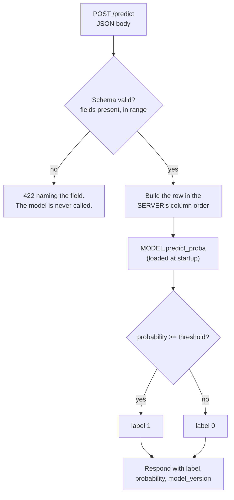

## What you'll learn

- the minimal prediction contract, and why the schema is the API
- the one operation that must happen at **startup, never per request**
- measured: per-call cost is **flat from 2 to 128 rows**, so batching is nearly free throughput
- input validation that rejects bad requests instead of predicting on them
- a health check that distinguishes "process alive" from "model usable"
- serving two model versions side by side for a canary

## The contract

An ML API is a normal HTTP service with one unusual property: **the request schema is part of the
model.** Change the feature order, drop a column, or silently coerce a string to a float, and the
model gives you a confident wrong answer rather than an error.

So the contract has to be explicit and enforced:

| Element | Decision |
| --- | --- |
| Route | `POST /predict` |
| Request body | JSON, one object per row, named fields — **never a bare array** |
| Response | The prediction, a probability, and the model version |
| Bad input | `422` with a message naming the offending field |
| Health | `GET /health` that actually exercises the model |
| Version | In the response body of every prediction |

Named fields matter more than they look. A bare `[13.2, 0.7, 88, ...]` means the caller has to know
your feature order, and the day someone reorders two columns you get no error and worse
predictions — the same silent failure as
[dropping the scaler](/machine-learning/phase-08---model-deployment-mlops/saving-and-loading-models-pickle-joblib/).



## The one thing that must not be in the request path

<Figure
  src="/images/ml/phase-08-mlops/building-an-ml-api-with-flask-fastapi/request-lifecycle"
  alt="Five boxes in a row: HTTP parse and validate, build the feature row, load model, predict, serialise JSON. Four are blue and marked per request; the load-model box is red and marked startup only."
  title="The request path, and the one box that does not belong in it"
  caption="Parsing, validating, building the row, predicting and serialising all have to happen per request. Loading the artefact does not — it is the same bytes every time. Put it in the request handler and every caller pays to deserialise your model."
/>

Loading a 1.3 MB forest means reading the file, decompressing it and rebuilding several thousand
NumPy arrays. Doing that per request is pure waste: the result is identical every time.

```python title="load_once.py" showLineNumbers{1}
# NO — the model is deserialised on every single request.
@app.post("/predict")
def predict(payload: Features):
    model = joblib.load("model.joblib")        # <- every request pays for this
    return {"prediction": int(model.predict(payload.to_row())[0])}


# YES — module scope, so it happens once when the worker boots.
MODEL = joblib.load("model.joblib")

@app.post("/predict")
def predict(payload: Features):
    return {"prediction": int(MODEL.predict(payload.to_row())[0])}
```

FastAPI's `lifespan` handler is the tidier form, because it also gives you somewhere to fail
loudly if the artefact is missing or the version is wrong:

```python title="lifespan.py" showLineNumbers{1}
from contextlib import asynccontextmanager

import joblib
from fastapi import FastAPI

STATE = {}


@asynccontextmanager
async def lifespan(app: FastAPI):
    # Startup: load once, and refuse to boot if anything is wrong.
    STATE["model"] = joblib.load("model.joblib")
    STATE["version"] = "2026-08-03"
    assert hasattr(STATE["model"], "predict"), "artefact is not an estimator"
    yield
    STATE.clear()                              # shutdown


app = FastAPI(lifespan=lifespan)
```

Failing at boot is the point. A worker that starts successfully and then throws on the first
prediction will pass a naive health check and take traffic.

## Batching is nearly free

Once the model is loaded, the cost of a `predict()` call is dominated by fixed per-call overhead —
argument validation, array allocation, the Python-to-C boundary — not by the number of rows.

Measured across batch sizes on a 500-tree forest:

<Figure
  src="/images/ml/phase-08-mlops/building-an-ml-api-with-flask-fastapi/batching-throughput"
  alt="Left: milliseconds per predict call, roughly flat from batch 2 to batch 128. Right: rows per second on a log scale, rising almost exactly along the perfectly-linear reference line."
  title="One call costs about the same whatever you put in it"
  caption="Left: the per-call time barely moves between 2 and 128 rows. Right: because the cost is flat, throughput tracks the perfectly-linear reference almost exactly — every extra row in a batch is nearly free. The millisecond values are specific to a loaded machine; the flat shape is not."
/>

The consequence for API design: **offer a batch endpoint.** A caller with 500 rows to score should
send one request, not 500.

```python title="batch_endpoint.py" showLineNumbers{1}
from typing import List

import numpy as np
from fastapi import FastAPI, HTTPException
from pydantic import BaseModel, Field

MAX_BATCH = 1000


class Row(BaseModel):
    mean_radius: float = Field(..., gt=0, lt=100)
    mean_texture: float = Field(..., gt=0, lt=100)
    # ... one field per feature, with units and plausible bounds


class BatchRequest(BaseModel):
    rows: List[Row]


@app.post("/predict/batch")
def predict_batch(req: BatchRequest):
    if len(req.rows) > MAX_BATCH:
        raise HTTPException(413, f"at most {MAX_BATCH} rows per request")
    X = np.array([[r.mean_radius, r.mean_texture] for r in req.rows])
    proba = MODEL.predict_proba(X)[:, 1]
    return {
        "model_version": STATE["version"],
        "predictions": [
            {"label": int(p >= 0.5), "probability": round(float(p), 4)}
            for p in proba
        ],
    }
```

The `MAX_BATCH` cap is not optional. Without it a single request can allocate unbounded memory, and
that is a denial-of-service vector rather than a performance concern.

### See it move

Flat per-call cost has a consequence beyond throughput: it changes what your latency *distribution*
looks like under load. The sketch is a queue simulator. Requests arrive at a rate you control, a
single worker serves them, and the server either handles each request alone or sweeps up everything
waiting into one call. The histogram is the observed latency; the numbers are p50 and p99.

```p5 title="Queueing turns a fast model into a slow endpoint" desc="Requests arrive at an adjustable rate and are served by one worker that costs 8 milliseconds per call plus 0.05 milliseconds per row. Without batching, arrival rates near capacity make the queue and the p99 latency grow without bound; with micro-batching the same rate is served comfortably. Click to toggle batching." height="420"
const SERVICE_FIXED = 8;    // ms of per-call overhead
const SERVICE_ROW = 0.05;   // ms per extra row -- the whole point: tiny
let rate = 40;              // requests per second
let dir = 1;
let batching = false;
let queue = [];
let now = 0;
let busyUntil = 0;
let latencies = [];
let served = 0;
let maxQueue = 0;

function setup() {
  createCanvas(620, 420);
  textFont("monospace");
}
function reset() {
  queue = [];
  latencies = [];
  served = 0;
  maxQueue = 0;
  busyUntil = now;
}
function step(dtMs) {
  // Poisson-ish arrivals
  const expected = (rate * dtMs) / 1000;
  let arrivals = 0;
  let p = Math.exp(-expected), cum = p, u = random();
  while (u > cum && arrivals < 50) { arrivals++; p *= expected / arrivals; cum += p; }
  for (let i = 0; i < arrivals; i++) queue.push(now + random() * dtMs);
  maxQueue = Math.max(maxQueue, queue.length);

  // the worker
  while (busyUntil <= now && queue.length > 0) {
    // batching serves everything queued in one call, capped at MAX_BATCH-style 64;
    // arrivals accumulate while the worker is busy, so no explicit wait is needed
    const take = batching ? Math.min(queue.length, 64) : 1;
    const batch = queue.splice(0, take);
    const cost = SERVICE_FIXED + SERVICE_ROW * batch.length;
    const start = Math.max(busyUntil, batch[0]);
    const finish = start + cost;
    for (const arrived of batch) {
      latencies.push(finish - arrived);
      served++;
    }
    busyUntil = finish;
    if (latencies.length > 4000) latencies.splice(0, latencies.length - 4000);
  }
}
function quantile(arr, q) {
  if (arr.length === 0) return 0;
  const s = arr.slice().sort((a, b) => a - b);
  return s[Math.min(s.length - 1, Math.floor(q * s.length))];
}
function draw() {
  background(13, 17, 23);
  now += 40;
  step(40);

  const capacity = batching ? 1e9 : 1000 / SERVICE_FIXED;
  const p50 = quantile(latencies, 0.5);
  const p99 = quantile(latencies, 0.99);

  fill(215);
  textSize(12);
  textAlign(LEFT, TOP);
  text("arrival rate " + rate.toFixed(0) + " req/s      " + (batching ? "micro-batching ON" : "one request per call"), 30, 14);
  fill(105);
  textSize(10);
  text("service cost: 8 ms per call + 0.05 ms per row   ->   " + (batching ? "batched calls amortise the 8 ms" : "single-request capacity is 125 req/s"), 30, 32);

  // latency histogram
  const bins = new Array(40).fill(0);
  const hi = 400;
  for (const l of latencies) bins[constrain(Math.floor((l / hi) * bins.length), 0, bins.length - 1)]++;
  const peak = Math.max(...bins, 1);
  const bw = (width - 100) / bins.length;
  for (let i = 0; i < bins.length; i++) {
    const h = (bins[i] / peak) * 150;
    noStroke();
    fill(batching ? color(120, 200, 120) : color(255, 176, 67));
    rect(50 + i * bw, 220 - h, bw - 1.5, h);
  }
  stroke(60, 68, 78);
  strokeWeight(1);
  line(50, 220, width - 50, 220);
  noStroke();
  fill(105);
  textSize(9);
  textAlign(CENTER, TOP);
  for (let ms = 0; ms <= hi; ms += 100) text(ms + "ms", 50 + (ms / hi) * (width - 100), 226);

  // markers
  for (const [v, label, col] of [[p50, "p50", [200, 200, 200]], [p99, "p99", [232, 122, 122]]]) {
    const x = 50 + constrain(v / hi, 0, 1) * (width - 100);
    stroke(col[0], col[1], col[2]);
    strokeWeight(1.5);
    line(x, 60, x, 220);
    noStroke();
    fill(col[0], col[1], col[2]);
    textSize(10);
    textAlign(CENTER, BOTTOM);
    text(label + " " + v.toFixed(0) + "ms", x, 58);
  }

  // stats
  const rows = [
    ["queue depth now", queue.length + "", queue.length > 40 ? [232, 122, 122] : [200, 200, 200]],
    ["worst queue seen", maxQueue + "", [180, 180, 180]],
    ["p50 latency", p50.toFixed(1) + " ms", [200, 200, 200]],
    ["p99 latency", p99.toFixed(1) + " ms", p99 > 200 ? [232, 122, 122] : [120, 200, 120]],
    ["p99 / p50", (p50 > 0 ? p99 / p50 : 0).toFixed(1) + "x", p99 / Math.max(p50, 1) > 4 ? [232, 122, 122] : [200, 200, 200]],
    ["requests served", served + "", [140, 140, 140]],
  ];
  for (let i = 0; i < rows.length; i++) {
    const [label, value, col] = rows[i];
    const y = 256 + i * 20;
    fill(140);
    textSize(11);
    textAlign(LEFT, TOP);
    text(label, 30, y);
    fill(col[0], col[1], col[2]);
    text(value, 200, y);
  }
  fill(105);
  textSize(10);
  textAlign(LEFT, TOP);
  text("click to toggle batching -- watch p99, not p50", 320, 256);
  text("the queue is the latency; the model is not", 320, 274);
  if (!batching && rate > capacity * 0.9) {
    fill(232, 122, 122);
    text("arrival rate is at or above capacity:", 320, 300);
    text("the queue never drains", 320, 314);
  }

  rate += 0.25 * dir;
  if (rate > 150 || rate < 10) { dir *= -1; reset(); }
}
function mousePressed() { batching = !batching; reset(); }
```

Three lessons, none of which are about the model. **Capacity is set by the fixed per-call cost:** at
8 ms of overhead a single worker tops out near 125 requests per second regardless of how fast the
forest is. **p50 lies.** Below capacity p50 stays close to the service time while p99 climbs, because
tail latency is queue-waiting time, not compute. **Batching moves the ceiling, not the model.**
Amortising one 8 ms call across 64 rows costs $8 + 64 \times 0.05 = 11.2$ ms for 64 predictions
instead of $64 \times 8 = 512$ ms — the same measurement as the figure above, expressed as
throughput. This is why a batch endpoint is an availability feature and not just a convenience.

## FastAPI, end to end

```python title="app.py" showLineNumbers{1}
from contextlib import asynccontextmanager

import joblib
import numpy as np
from fastapi import FastAPI, HTTPException
from pydantic import BaseModel, Field

STATE: dict = {}


@asynccontextmanager
async def lifespan(app: FastAPI):
    STATE["model"] = joblib.load("model.joblib")
    STATE["version"] = "2026-08-03"
    STATE["features"] = ["mean_radius", "mean_texture", "mean_perimeter"]
    yield
    STATE.clear()


app = FastAPI(title="Tumour classifier", version="1.0", lifespan=lifespan)


class Features(BaseModel):
    """The schema IS the contract. Bounds document the training range."""
    mean_radius: float = Field(..., gt=0, lt=50, description="mm")
    mean_texture: float = Field(..., gt=0, lt=50)
    mean_perimeter: float = Field(..., gt=0, lt=300)

    def to_row(self) -> np.ndarray:
        return np.array([[self.mean_radius, self.mean_texture,
                          self.mean_perimeter]])


class Prediction(BaseModel):
    label: int
    probability: float
    model_version: str


@app.post("/predict", response_model=Prediction)
def predict(payload: Features) -> Prediction:
    model = STATE.get("model")
    if model is None:
        raise HTTPException(503, "model not loaded")
    proba = float(model.predict_proba(payload.to_row())[0, 1])
    return Prediction(label=int(proba >= 0.5),
                      probability=round(proba, 4),
                      model_version=STATE["version"])


@app.get("/health")
def health():
    """Exercise the model, do not just report that the process is up."""
    model = STATE.get("model")
    if model is None:
        raise HTTPException(503, "model not loaded")
    try:
        probe = np.zeros((1, len(STATE["features"])))
        model.predict(probe)
    except Exception as exc:
        raise HTTPException(503, f"model unusable: {exc}") from exc
    return {"status": "ok", "model_version": STATE["version"]}
```

Run it:

```bash
uvicorn app:app --host 0.0.0.0 --port 8000
```

FastAPI gives you three things for free that matter here: **request validation** from the type
hints, **OpenAPI docs** at `/docs` that your callers can read, and **response validation** so a
malformed response is caught in your tests rather than in theirs.

## Flask, for comparison

```python title="app_flask.py" showLineNumbers{1}
import joblib
import numpy as np
from flask import Flask, jsonify, request

app = Flask(__name__)
MODEL = joblib.load("model.joblib")            # module scope: loaded once
VERSION = "2026-08-03"
FEATURES = ["mean_radius", "mean_texture", "mean_perimeter"]


@app.post("/predict")
def predict():
    payload = request.get_json(silent=True)
    if not isinstance(payload, dict):
        return jsonify(error="body must be a JSON object"), 400

    # Everything Pydantic did for free now has to be written by hand.
    missing = [f for f in FEATURES if f not in payload]
    if missing:
        return jsonify(error=f"missing fields: {missing}"), 422
    try:
        row = np.array([[float(payload[f]) for f in FEATURES]])
    except (TypeError, ValueError):
        return jsonify(error="all fields must be numeric"), 422

    proba = float(MODEL.predict_proba(row)[0, 1])
    return jsonify(label=int(proba >= 0.5),
                   probability=round(proba, 4),
                   model_version=VERSION)


@app.get("/health")
def health():
    try:
        MODEL.predict(np.zeros((1, len(FEATURES))))
    except Exception as exc:
        return jsonify(status="unhealthy", detail=str(exc)), 503
    return jsonify(status="ok", model_version=VERSION)
```

| | FastAPI | Flask |
| --- | --- | --- |
| Validation | From type hints | Hand-written |
| OpenAPI docs | Automatic at `/docs` | Add an extension |
| Async | Native | Via extensions |
| Lines for the same contract | Fewer | More |
| Ubiquity in existing codebases | Growing | Very high |

Choose FastAPI for a new ML service. Choose Flask when you are adding an endpoint to a Flask app
that already exists.

## Calling it

```bash
# A good request
curl -s -X POST http://localhost:8000/predict \
  -H "Content-Type: application/json" \
  -d '{"mean_radius": 14.2, "mean_texture": 20.1, "mean_perimeter": 92.0}'
# {"label":0,"probability":0.0731,"model_version":"2026-08-03"}

# A bad one — FastAPI rejects it before the model is ever called
curl -s -X POST http://localhost:8000/predict \
  -H "Content-Type: application/json" \
  -d '{"mean_radius": -5, "mean_texture": 20.1, "mean_perimeter": 92.0}'
# 422, "Input should be greater than 0"

# Health
curl -s http://localhost:8000/health
# {"status":"ok","model_version":"2026-08-03"}
```

The bounds in the schema are doing real work in that second request. `mean_radius: -5` is physically
impossible, and without the constraint the model would happily extrapolate and return a number.

## Two versions at once

Rolling out a new model to 100% of traffic on day one is avoidable. Load both and route a fraction:

```python title="canary.py" showLineNumbers{1}
import hashlib

CANARY_FRACTION = 0.05


def pick_model(request_id: str):
    """Stable routing: the same caller always sees the same model version."""
    digest = hashlib.sha256(request_id.encode()).digest()
    bucket = digest[0] / 255.0
    if bucket < CANARY_FRACTION:
        return STATE["model_candidate"], STATE["version_candidate"]
    return STATE["model"], STATE["version"]
```

Hashing the request ID rather than calling `random()` matters: a given user gets a consistent
answer, and your comparison is not contaminated by the same caller bouncing between versions.
Because every response carries `model_version`, you can join predictions to outcomes later and
compare the two honestly.

## Pitfalls

**Loading the model inside the handler.** Every caller pays to deserialise the artefact, for an
identical result.

**Accepting a bare array of features.** The caller now owns your column order, and a reordering is a
silent accuracy loss rather than an error.

**A health check that returns 200 because the process is alive.** It has to exercise the model. A
worker whose artefact failed to load will otherwise be handed traffic.

**No batch endpoint.** The per-call cost is flat from 2 to 128 rows; forcing 500 single requests
wastes almost all of that.

**An unbounded batch size.** One request allocating unbounded memory is a denial-of-service
vector.

**Omitting the model version from responses.** Without it you cannot attribute a bad prediction to a
release, and canary analysis is impossible.

**Returning a raw probability with no threshold policy.** Decide, document, and version the
threshold; it is a business decision, not a modelling detail.

## Recap

- The **request schema is the contract**. Named fields, explicit bounds, versioned responses.
- Load the artefact **once at startup** — ideally in a `lifespan` handler that refuses to boot on a
  bad model.
- Per-call cost is **flat from 2 to 128 rows**, so throughput tracks batch size almost linearly.
  Offer a batch endpoint, and cap it.
- Validate before predicting. A `422` is much better than a confident answer to nonsense.
- A health check must **exercise the model**, not report that Python is running.
- Put `model_version` in every response, and route canaries by a **hash of the request ID** so a
  caller sees a stable answer.

<Quiz
  questions={[
    {
      q: "Where should joblib.load() appear in a FastAPI prediction service?",
      options: [
        "Inside the /predict handler so the newest model is always used",
        "At startup — module scope or a lifespan handler — because the result is identical every time",
        "In a background thread refreshed every minute",
        "In the health check",
      ],
      answer: 1,
      explain: "Deserialising the artefact produces the same object on every call, so doing it per request is pure waste — and for a 1.3 MB forest it means rebuilding thousands of arrays each time. A lifespan handler also gives you a place to fail loudly at boot.",
    },
    {
      q: "Per-call predict() time was roughly flat from 2 to 128 rows. What follows for your API?",
      options: [
        "Batch size does not matter",
        "Offer a batch endpoint — the fixed overhead dominates, so extra rows in one call are nearly free",
        "Single-row requests are optimal",
        "You should use a smaller model",
      ],
      answer: 1,
      explain: "When the cost is dominated by fixed overhead, throughput rises almost linearly with batch size. A caller with 500 rows should send one request. Cap the batch size, though, or you have created a memory-exhaustion vector.",
    },
    {
      q: "Why accept named JSON fields rather than a bare array of feature values?",
      options: [
        "Arrays are slower to parse",
        "A bare array makes the caller responsible for column order, so a reordering silently degrades predictions instead of erroring",
        "JSON objects compress better",
        "FastAPI cannot parse arrays",
      ],
      answer: 1,
      explain: "This is the same class of failure as saving a model without its scaler: the shapes still line up, nothing raises, and the answers get worse. Named fields with bounds make the contract explicit and checkable.",
    },
    {
      q: "Your /health endpoint returns 200 whenever the web process is running. What can go wrong?",
      options: [
        "Nothing — that is what health checks are for",
        "A worker whose model failed to load passes the check and gets sent live traffic",
        "It uses too much CPU",
        "Load balancers ignore 200 responses",
      ],
      answer: 1,
      explain: "Liveness and readiness are different questions. The check must exercise the model — call predict on a probe row — so an orchestrator can tell 'process up' apart from 'able to serve'.",
    },
    {
      q: "For a 5% canary, why hash the request ID instead of calling random()?",
      options: [
        "Hashing is faster",
        "It routes a given caller to the same version consistently, so users see stable behaviour and the comparison is not contaminated",
        "random() is not available in FastAPI",
        "Hashing guarantees exactly 5%",
      ],
      answer: 1,
      explain: "With random() the same user bounces between models between requests, which is confusing for them and mixes the two populations in your analysis. A stable hash gives each caller one version for the whole experiment.",
    },
  ]}
/>

## 🧪 Try It Yourself

### Exercise 1 – Validate before predicting

<DataCampExercise
  lang="python"
  hint={`Check for missing keys first, then that every value can be coerced to float.`}
  code={`# Task: Exercise 1 - Validate before predicting
FEATURES = ["mean_radius", "mean_texture", "mean_perimeter"]

def validate(payload):
    """Return (ok, message). Reject before the model is ever called."""
    if not isinstance(payload, dict):
        return False, "body must be a JSON object"
    missing = [f for f in FEATURES if f not in payload]
    if missing:
        return False, f"missing fields: {missing}"
    for f in FEATURES:
        try:
            v = float(payload[f])
        except (TypeError, ValueError):
            return False, f"{f} must be numeric"
        if v <= 0:
            return False, f"{f} must be greater than 0"
    return ___, "ok"                          # replace ___ with True

cases = [
    {"mean_radius": 14.2, "mean_texture": 20.1, "mean_perimeter": 92.0},
    {"mean_radius": 14.2, "mean_texture": 20.1},
    {"mean_radius": "big", "mean_texture": 20.1, "mean_perimeter": 92.0},
    {"mean_radius": -5, "mean_texture": 20.1, "mean_perimeter": 92.0},
]
for c in cases:
    print(validate(c))

# -- Expected Output -------------------------------------------
# (True, 'ok')
# (False, "missing fields: ['mean_perimeter']")
# (False, 'mean_radius must be numeric')
# (False, 'mean_radius must be greater than 0')
# --------------------------------------------------------------`}
  solution={`FEATURES = ["mean_radius", "mean_texture", "mean_perimeter"]

def validate(payload):
    if not isinstance(payload, dict):
        return False, "body must be a JSON object"
    missing = [f for f in FEATURES if f not in payload]
    if missing:
        return False, f"missing fields: {missing}"
    for f in FEATURES:
        try:
            v = float(payload[f])
        except (TypeError, ValueError):
            return False, f"{f} must be numeric"
        if v <= 0:
            return False, f"{f} must be greater than 0"
    return True, "ok"

cases = [
    {"mean_radius": 14.2, "mean_texture": 20.1, "mean_perimeter": 92.0},
    {"mean_radius": 14.2, "mean_texture": 20.1},
    {"mean_radius": "big", "mean_texture": 20.1, "mean_perimeter": 92.0},
    {"mean_radius": -5, "mean_texture": 20.1, "mean_perimeter": 92.0},
]
for c in cases:
    print(validate(c))`}
  sct={`test_output_contains("mean_radius must be greater than 0")
success_msg("Four cases, three rejections, and the model was never called on nonsense.")`}
  height={300}
/>

### Exercise 2 – Build the feature row in the right order

<DataCampExercise
  lang="python"
  hint={`Iterate FEATURES, not the payload's own key order — dictionaries must not decide your column order.`}
  code={`# Task: Exercise 2 - Build the feature row in the right order
import numpy as np

FEATURES = ["mean_radius", "mean_texture", "mean_perimeter"]

def to_row(payload):
    """Column order comes from FEATURES, never from the caller's JSON."""
    return np.array([[float(payload[f]) for f in ___]])   # replace ___ with FEATURES

# Same data, keys in a different order — the row must come out identical.
a = {"mean_radius": 14.2, "mean_texture": 20.1, "mean_perimeter": 92.0}
b = {"mean_perimeter": 92.0, "mean_radius": 14.2, "mean_texture": 20.1}

print(to_row(a))
print(to_row(b))
print("identical:", np.array_equal(to_row(a), to_row(b)))

# -- Expected Output -------------------------------------------
# [[14.2 20.1 92. ]]
# [[14.2 20.1 92. ]]
# identical: True
# --------------------------------------------------------------`}
  solution={`import numpy as np

FEATURES = ["mean_radius", "mean_texture", "mean_perimeter"]

def to_row(payload):
    return np.array([[float(payload[f]) for f in FEATURES]])

a = {"mean_radius": 14.2, "mean_texture": 20.1, "mean_perimeter": 92.0}
b = {"mean_perimeter": 92.0, "mean_radius": 14.2, "mean_texture": 20.1}
print(to_row(a))
print(to_row(b))
print("identical:", np.array_equal(to_row(a), to_row(b)))`}
  sct={`test_output_contains("identical: True")
success_msg("The server owns the column order. That is why named fields beat bare arrays.")`}
  height={260}
/>

### Exercise 3 – Shape the response

<DataCampExercise
  lang="python"
  hint={`Every response carries the version, so a bad prediction can be attributed to a release.`}
  code={`# Task: Exercise 3 - Shape the response
VERSION = "2026-08-03"
THRESHOLD = 0.5

def make_response(probability, version=VERSION):
    return {
        "label": int(probability >= ___),     # replace ___ with THRESHOLD
        "probability": round(float(probability), 4),
        "model_version": version,
        "threshold": THRESHOLD,
    }

for p in (0.0731, 0.4999, 0.5, 0.9812):
    print(make_response(p))

# -- Expected Output -------------------------------------------
# {'label': 0, 'probability': 0.0731, 'model_version': '2026-08-03', 'threshold': 0.5}
# {'label': 0, 'probability': 0.4999, 'model_version': '2026-08-03', 'threshold': 0.5}
# {'label': 1, 'probability': 0.5, 'model_version': '2026-08-03', 'threshold': 0.5}
# {'label': 1, 'probability': 0.9812, 'model_version': '2026-08-03', 'threshold': 0.5}
# --------------------------------------------------------------`}
  solution={`VERSION = "2026-08-03"
THRESHOLD = 0.5

def make_response(probability, version=VERSION):
    return {
        "label": int(probability >= THRESHOLD),
        "probability": round(float(probability), 4),
        "model_version": version,
        "threshold": THRESHOLD,
    }

for p in (0.0731, 0.4999, 0.5, 0.9812):
    print(make_response(p))`}
  sct={`test_output_contains("'model_version': '2026-08-03'")
success_msg("Version and threshold in every response. Both are needed to explain a prediction six months later.")`}
  height={270}
/>

### Exercise 4 – Cap the batch

<DataCampExercise
  lang="python"
  hint={`Reject with 413 when the caller sends more rows than the cap allows.`}
  code={`# Task: Exercise 4 - Cap the batch
MAX_BATCH = 1000

def handle_batch(rows):
    """Return (status_code, body). An unbounded batch is a DoS vector."""
    if not isinstance(rows, list):
        return 422, {"error": "rows must be a list"}
    if len(rows) == 0:
        return 422, {"error": "rows must not be empty"}
    if len(rows) > MAX_BATCH:
        return ___, {"error": f"at most {MAX_BATCH} rows per request"}
        # replace ___ with 413
    return 200, {"predicted": len(rows)}

for n in (0, 1, 1000, 1001):
    rows = [{}] * n
    print(n, "->", handle_batch(rows))

# -- Expected Output -------------------------------------------
# 0 -> (422, {'error': 'rows must not be empty'})
# 1 -> (200, {'predicted': 1})
# 1000 -> (200, {'predicted': 1000})
# 1001 -> (413, {'error': 'at most 1000 rows per request'})
# --------------------------------------------------------------`}
  solution={`MAX_BATCH = 1000

def handle_batch(rows):
    if not isinstance(rows, list):
        return 422, {"error": "rows must be a list"}
    if len(rows) == 0:
        return 422, {"error": "rows must not be empty"}
    if len(rows) > MAX_BATCH:
        return 413, {"error": f"at most {MAX_BATCH} rows per request"}
    return 200, {"predicted": len(rows)}

for n in (0, 1, 1000, 1001):
    rows = [{}] * n
    print(n, "->", handle_batch(rows))`}
  sct={`test_output_contains("1001 -> (413,")
success_msg("The cap is not a performance tweak — it is what stops one request exhausting your memory.")`}
  height={270}
/>

### Exercise 5 – Stable canary routing

<DataCampExercise
  lang="python"
  hint={`Hash the request ID and turn the first byte into a number between 0 and 1.`}
  code={`# Task: Exercise 5 - Stable canary routing
import hashlib

CANARY_FRACTION = 0.05

def pick_version(request_id):
    digest = hashlib.sha256(request_id.encode()).digest()
    bucket = digest[0] / 255.0
    return "candidate" if bucket < ___ else "stable"   # replace ___ with CANARY_FRACTION

# The same caller must always land on the same version.
print("user-1 twice:", pick_version("user-1"), pick_version("user-1"))

ids = [f"user-{i}" for i in range(4000)]
share = sum(pick_version(i) == "candidate" for i in ids) / len(ids)
print(f"candidate share over 4000 ids: {share:.4f}")

# -- Expected Output -------------------------------------------
# user-1 twice: stable stable
# candidate share over 4000 ids: 0.0508
# --------------------------------------------------------------`}
  solution={`import hashlib

CANARY_FRACTION = 0.05

def pick_version(request_id):
    digest = hashlib.sha256(request_id.encode()).digest()
    bucket = digest[0] / 255.0
    return "candidate" if bucket < CANARY_FRACTION else "stable"

print("user-1 twice:", pick_version("user-1"), pick_version("user-1"))
ids = [f"user-{i}" for i in range(4000)]
share = sum(pick_version(i) == "candidate" for i in ids) / len(ids)
print(f"candidate share over 4000 ids: {share:.4f}")`}
  sct={`test_output_contains("user-1 twice: stable stable")
success_msg("Deterministic per caller, and close to the target share in aggregate. random() gives you neither.")`}
  height={270}
/>

### Exercise 6 – Price the batch endpoint

<DataCampExercise
  lang="python"
  hint={`One call per row costs rows * (fixed + per-row). One batched call costs fixed + rows * per-row.`}
  code={`# Task: Exercise 6 - Price the batch endpoint
FIXED_MS, ROW_MS = 8.0, 0.05        # measured: per-call overhead, per-row cost

print(f"{'rows':>6} {'one call each':>14} {'one batch call':>15} {'speed-up':>9}")
for rows in (1, 10, 64, 500, 1000):
    separate = rows * (FIXED_MS + ROW_MS)
    batched = FIXED_MS + rows * ___             # replace ___ with ROW_MS
    print(f"{rows:6d} {separate:12.1f}ms {batched:13.1f}ms "
          f"{separate / batched:8.1f}x")
capacity = 1000 / FIXED_MS
print(f"single-request capacity of one worker: {capacity:.0f} req/s")
print(f"batched at 64 rows per call:           "
      f"{64 * 1000 / (FIXED_MS + 64 * ROW_MS):.0f} rows/s")

# -- Expected Output -------------------------------------------
#   rows  one call each  one batch call  speed-up
#      1          8.1ms           8.1ms      1.0x
#     10         80.5ms           8.5ms      9.5x
#     64        515.2ms          11.2ms     46.0x
#    500       4025.0ms          33.0ms    122.0x
#   1000       8050.0ms          58.0ms    138.8x
# single-request capacity of one worker: 125 req/s
# batched at 64 rows per call:           5714 rows/s
# --------------------------------------------------------------`}
  solution={`FIXED_MS, ROW_MS = 8.0, 0.05

print(f"{'rows':>6} {'one call each':>14} {'one batch call':>15} {'speed-up':>9}")
for rows in (1, 10, 64, 500, 1000):
    separate = rows * (FIXED_MS + ROW_MS)
    batched = FIXED_MS + rows * ROW_MS
    print(f"{rows:6d} {separate:12.1f}ms {batched:13.1f}ms "
          f"{separate / batched:8.1f}x")
capacity = 1000 / FIXED_MS
print(f"single-request capacity of one worker: {capacity:.0f} req/s")
print(f"batched at 64 rows per call:           "
      f"{64 * 1000 / (FIXED_MS + 64 * ROW_MS):.0f} rows/s")`}
  sct={`test_output_contains("125 req/s")
success_msg("125 requests per second against 5,714 rows per second through the same model. The whole difference is the 8 ms of per-call overhead, which is why a batch endpoint is an availability feature: it moves the ceiling without touching the model.")`}
  height={300}
/>

## Next

[Deploying ML Models to Streamlit](/machine-learning/phase-08---model-deployment-mlops/deploying-ml-models-to-streamlit/)
— the other kind of deployment: a UI for humans rather than an endpoint for machines, and the one
decorator that stops it reloading your model on every click.
