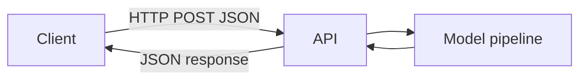

Once your model is saved to disk, the most common way to make it usable by other
software is to put it behind an HTTP API. A client sends features as JSON, your
server loads the pipeline once at startup, runs `.predict()`, and sends the result
back as JSON. This page builds that endpoint twice — once with FastAPI, once with
Flask — and covers the practical details (validation, logging, versioning) that
matter once real traffic starts hitting it.

## Why APIs are common for ML deployment

An API lets other services call your model:

- web apps
- mobile apps
- internal tools

## The minimal contract

Inputs:

- JSON payload with features

Outputs:

- prediction (and optionally probability)



## FastAPI example (recommended)

FastAPI is popular because:

- automatic docs
- type hints
- validation

```python title="app.py (FastAPI)" showLineNumbers{1}
# Requires: fastapi, uvicorn, joblib
from fastapi import FastAPI
from pydantic import BaseModel
import joblib

app = FastAPI()
model = joblib.load("model.joblib")

class Features(BaseModel):
    age: int
    income: float
    city: str
    plan: str

@app.post("/predict")
def predict(features: Features):
    X = [features.model_dump()]
    pred = model.predict(X)[0]
    return {"prediction": int(pred)}
```

## Flask example (minimal)

```python title="app.py (Flask)" showLineNumbers{1}
# Requires: flask, joblib
from flask import Flask, request, jsonify
import joblib

app = Flask(__name__)
model = joblib.load("model.joblib")

@app.post("/predict")
def predict():
    payload = request.get_json(force=True)
    pred = model.predict([payload])[0]
    return jsonify({"prediction": int(pred)})
```

## Calling the API with curl

Once either server is running (e.g. `uvicorn app:app --reload` for FastAPI, or
`flask --app app run` for Flask), you can test it from the command line:

```bash title="Test the /predict endpoint"
curl -X POST http://127.0.0.1:8000/predict \
  -H "Content-Type: application/json" \
  -d '{"age": 35, "income": 50000, "city": "Pune", "plan": "Pro"}'

# -> {"prediction":1}
```

## Visualize it

Here's the round trip a request takes when a client asks your API for a prediction.

```mermaid title="ML API request flow" desc="How a client's JSON request becomes a prediction returned from a Flask or FastAPI endpoint."
flowchart LR
  A["Client sends JSON request"] --> B["API endpoint receives it"]
  B --> C["Loads the trained model"]
  C --> D["Runs predict\(\)"]
  D --> E["Returns prediction as JSON"]
  E --> A
```

## Handling bad input gracefully

Pydantic rejects malformed JSON automatically, but it can't catch everything —
a request might be perfectly well-typed and still crash your model (an unseen
category, a divide-by-zero in a custom feature, a `NaN`). Wrap the prediction
call so a bad request returns a clean `4xx`/`5xx` response instead of a stack
trace leaking to the client:

```python title="app.py (error handling)" showLineNumbers{1}
from fastapi import FastAPI, HTTPException
from pydantic import BaseModel
import joblib

app = FastAPI()
model = joblib.load("model.joblib")

class Features(BaseModel):
    age: int
    income: float

@app.post("/predict")
def predict(features: Features):
    try:
        X = [features.model_dump()]
        pred = model.predict(X)[0]
    except Exception as exc:
        # never let a raw exception/traceback reach the client
        raise HTTPException(status_code=400, detail=f"prediction failed: {exc}")
    return {"prediction": int(pred)}
```

## A health check endpoint

Before a load balancer, a Kubernetes pod, or a teammate's script sends real
traffic to your API, it usually wants a cheap way to ask "are you alive, and
is the model actually loaded?" A `/health` route that returns instantly (no
model inference) is the standard way to answer that:

```python title="app.py (health check)" showLineNumbers{1}
@app.get("/health")
def health():
    return {"status": "ok", "model_loaded": model is not None}
```

Orchestration tools poll endpoints like this on a schedule and stop routing
traffic to an instance that fails the check — the same idea Géron describes
for TF Serving's own readiness signals, just implemented by hand here.

## Serving more than one model version (canary requests)

Once you have a `model_v2.joblib` you want to try cautiously, you don't have
to cut over every client at once. Load both versions and let the caller (or a
small percentage of random traffic) opt into the new one — this is exactly
the pattern Géron describes for TF Serving, where appending `/versions/0002`
to a model path lets you "test a new version on a small group of users before
releasing it widely (this is called a **canary**)":

```python title="app.py (canary routing)" showLineNumbers{1}
import random
import joblib
from fastapi import FastAPI

app = FastAPI()
models = {
    "v1": joblib.load("model_v1.joblib"),
    "v2": joblib.load("model_v2.joblib"),
}

@app.post("/predict")
def predict(features: dict, version: str | None = None):
    # explicit version wins; otherwise send 10% of traffic to the canary
    chosen = version or ("v2" if random.random() < 0.10 else "v1")
    model = models[chosen]
    pred = model.predict([features])[0]
    return {"prediction": int(pred), "model_version": chosen}
```

If `v2` starts returning worse predictions, roll back by simply routing 0%
of traffic to it — no redeploy, no downtime, and no code change beyond
flipping that percentage.

## Practical tips

- validate inputs (types, ranges)
- log requests (careful with PII)
- version your model artifact
- add a `/health` route so load balancers and orchestrators know the service is ready
- roll out risky model changes as a canary before sending 100% of traffic to them

:::tip[From the book]
Géron's chapter on serving TensorFlow models makes the same JSON-over-HTTP tradeoff
explicit: "The REST API is nice and simple, and it works well when the input and
output data are not too large... [but] this is very inefficient, both in terms of
serialization/deserialization time... and in terms of payload size." A plain
Flask/FastAPI JSON endpoint is perfect for small feature payloads like the ones on
this page — if you're ever sending large arrays (images, embeddings) at high volume,
that's the point where a binary protocol like gRPC starts to pay off.
:::

import DataCampExercise from "../../../../components/DataCampExercise.astro";

## 🧪 Try It Yourself

### Exercise 1 – Define the Request Schema with Pydantic

<DataCampExercise
  lang="python"
  hint={`A FastAPI request schema is a class that inherits from \`BaseModel\`.`}
  code={`# Task: Exercise 1 – Define the Request Schema
from pydantic import ___   # replace ___ with BaseModel

class Features(BaseModel):
    age: int
    income: float

f = Features(age=30, income=45000.0)
print(f.age, f.income)

# ── Expected Output ───────────────────────────────────────────
# 30 45000.0
# ──────────────────────────────────────────────────────────────`}
  solution={`from pydantic import BaseModel

class Features(BaseModel):
    age: int
    income: float

f = Features(age=30, income=45000.0)
print(f.age, f.income)`}
  sct={`test_output_contains("30 45000.0")
success_msg("That's the schema FastAPI validates every request against!")`}
  height={158}
/>

### Exercise 2 – Load the Model Once at Startup

<DataCampExercise
  lang="python"
  hint={`Use \`joblib.load("model.joblib")\` at module level so the model loads once, not on every request.`}
  code={`# Task: Exercise 2 – Load the Model Once at Startup
import joblib
from sklearn.linear_model import LogisticRegression
import numpy as np

joblib.dump(LogisticRegression().fit([[1], [2], [3]], [0, 0, 1]), "model.joblib")

# replace ___ with load
model = joblib.___("model.joblib")
pred = model.predict(np.array([[3]]))[0]
print("prediction:", int(pred))

# ── Expected Output ───────────────────────────────────────────
# prediction: 1
# ──────────────────────────────────────────────────────────────`}
  solution={`import joblib
from sklearn.linear_model import LogisticRegression
import numpy as np

joblib.dump(LogisticRegression().fit([[1], [2], [3]], [0, 0, 1]), "model.joblib")

model = joblib.load("model.joblib")
pred = model.predict(np.array([[3]]))[0]
print("prediction:", int(pred))`}
  sct={`test_output_contains("prediction: 1")
success_msg("Loading once at startup avoids re-loading the model on every request!")`}
  height={158}
/>

### Exercise 3 – Shape the JSON Response

<DataCampExercise
  lang="python"
  hint={`The endpoint should return a dict like {"prediction": ...} so it serializes cleanly to JSON.`}
  code={`# Task: Exercise 3 – Shape the JSON Response
pred = 1

# replace ___ with a dict literal: {"prediction": pred}
response = ___
print(response)

# ── Expected Output ───────────────────────────────────────────
# {'prediction': 1}
# ──────────────────────────────────────────────────────────────`}
  solution={`pred = 1
response = {"prediction": pred}
print(response)`}
  sct={`test_output_contains("{'prediction': 1}")
success_msg("That's exactly the JSON shape both the Flask and FastAPI examples return!")`}
  height={138}
/>

## Next

Continue to **Deploying ML Models to Streamlit** — for cases where you want a
user-facing demo UI instead of (or in addition to) a raw JSON API.
