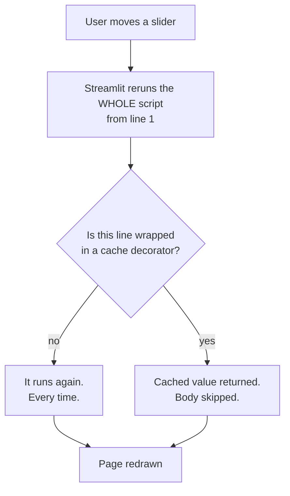

import DataCampExercise from "../../../../components/DataCampExercise.astro";
import Figure from "../../../../components/Figure.astro";
import Quiz from "../../../../components/Quiz.astro";

## What you'll learn

- Streamlit's **top-to-bottom rerun** model, and why it is the source of every surprise
- `@st.cache_resource`, and what it prevents — the model was **1,307 KB** to deserialise
- input widgets that cannot produce an invalid feature row
- batch scoring from an uploaded CSV, with the download back out
- where Streamlit stops being the right tool, and what to reach for instead

## What Streamlit is for

An API serves machines. A Streamlit app serves a person: an analyst who wants to try inputs, a
stakeholder who wants to see the model behave, a domain expert who is checking whether it agrees
with them.

That is a different job, and it has different success criteria. Nobody cares about your p99 latency.
They care that the thing loads, that the controls make sense, and that they cannot accidentally
enter a negative tumour radius.

| | FastAPI service | Streamlit app |
| --- | --- | --- |
| Consumer | Another program | A human |
| Interface | JSON over HTTP | Widgets in a browser |
| Concurrency | Hundreds of requests/sec | A handful of users |
| Build time | Hours to days | Minutes |
| Right for | Production integration | Demos, internal tools, review |
| Wrong for | A demo nobody can click | Anything a program must call |

They are complements, not alternatives. A common and good arrangement is a FastAPI service for
production plus a Streamlit app that calls it, so the demo exercises the same code path production
does.

## The rerun model

This is the one thing to understand, and everything confusing about Streamlit follows from it.

**Every interaction reruns your entire script, top to bottom.** Move a slider, and the whole file
executes again from line 1. There is no callback, no partial update, no component tree that persists
by default.



The model is beautifully simple to reason about and catastrophically wasteful if you ignore it.
Consider:

```python
model = joblib.load("model.joblib")            # runs on EVERY interaction
```

That is the artefact from the
[saving page](/machine-learning/phase-08---model-deployment-mlops/saving-and-loading-models-pickle-joblib/):
**1,307 KB uncompressed, several thousand NumPy arrays rebuilt**, every time somebody nudges a
slider. The fix is one decorator.

## The one decorator

```python title="cached_load.py" showLineNumbers{1}
import joblib
import streamlit as st


@st.cache_resource
def load_model(path: str = "model.joblib"):
    """Runs once per server process, not once per interaction."""
    return joblib.load(path)


model = load_model()      # instant on every rerun after the first
```

Streamlit has two cache decorators and they are not interchangeable:

| Decorator | For | Behaviour | Use it on |
| --- | --- | --- | --- |
| `@st.cache_resource` | Global, unserialisable objects | One shared instance | Models, DB connections, sessions |
| `@st.cache_data` | Serialisable return values | A **copy** per caller | DataFrames, API results, computations |

The distinction matters. `cache_data` returns a copy, so a caller mutating the result cannot corrupt
other users' data. `cache_resource` returns the *same object* to everybody — which is exactly what
you want for a read-only model and exactly what you do not want for a DataFrame someone might
modify.

```python title="both_caches.py" showLineNumbers{1}
@st.cache_resource                       # one model, shared
def load_model():
    return joblib.load("model.joblib")


@st.cache_data                           # a copy per caller, safe to mutate
def load_reference_data(path: str):
    return pd.read_csv(path)


@st.cache_data(ttl=300)                  # refetch at most every 5 minutes
def fetch_live_rates():
    return requests.get(RATES_URL, timeout=5).json()
```

### See it move

The sketch is a script tracer. Every slider nudge triggers a rerun, and each line of a five-line app
lights up when it executes. The left run has no decorators; the right run caches the model load and
the reference CSV. The counters are what the user actually feels: cumulative work per session.

```p5 title="One slider nudge, five lines, two very different bills" desc="A simulated Streamlit script reruns on every interaction. Without caching, the model load and CSV read execute on each rerun; with cache_resource and cache_data they execute once and are skipped afterwards. Cumulative milliseconds and load counts diverge as the interaction count grows." height="420"
const LINES = [
  { src: "import streamlit as st", ms: 0, cacheable: false },
  { src: "model = load_model()", ms: 240, cacheable: true },
  { src: "ref = pd.read_csv('ref.csv')", ms: 90, cacheable: true },
  { src: "x = st.slider('radius', 5, 30)", ms: 1, cacheable: false },
  { src: "st.write(model.predict([[x]]))", ms: 4, cacheable: false },
];
let interactions = 0;
let activeLine = -1;
let phase = 0;
let timer = 0;
let coldMs = 0;
let warmMs = 0;
let coldLoads = 0;
let warmLoads = 0;

function setup() {
  createCanvas(620, 420);
  textFont("monospace");
}
function draw() {
  background(13, 17, 23);

  fill(215);
  textSize(12);
  textAlign(LEFT, TOP);
  text("slider nudges this session: " + interactions, 30, 14);

  const panels = [
    { x: 30, title: "no cache", cached: false, col: [255, 176, 67] },
    { x: 330, title: "@st.cache_resource / @st.cache_data", cached: true, col: [120, 200, 120] },
  ];
  for (const p of panels) {
    fill(p.col[0], p.col[1], p.col[2]);
    textSize(11);
    textAlign(LEFT, TOP);
    text(p.title, p.x, 44);
    for (let i = 0; i < LINES.length; i++) {
      const L = LINES[i];
      const skipped = p.cached && L.cacheable && interactions > 0;
      const running = i === activeLine;
      const y = 70 + i * 30;
      noStroke();
      fill(running ? (skipped ? color(60, 90, 70) : color(p.col[0], p.col[1], p.col[2], 90)) : color(24, 29, 36));
      rect(p.x, y, 262, 24, 3);
      fill(skipped ? color(110, 150, 120) : color(215));
      textSize(10);
      textAlign(LEFT, CENTER);
      text((skipped ? "skip " : "     ") + L.src, p.x + 6, y + 12);
      if (running && !skipped && L.ms > 0) {
        fill(p.col[0], p.col[1], p.col[2]);
        textAlign(RIGHT, CENTER);
        text(L.ms + "ms", p.x + 256, y + 12);
      }
    }
  }

  // counters
  const stats = [
    ["model loads", coldLoads, warmLoads],
    ["csv reads", coldLoads, warmLoads],
    ["total ms of work", Math.round(coldMs), Math.round(warmMs)],
  ];
  for (let i = 0; i < stats.length; i++) {
    const [label, a, b] = stats[i];
    const y = 244 + i * 24;
    fill(140);
    textSize(11);
    textAlign(LEFT, TOP);
    text(label, 30, y);
    fill(255, 176, 67);
    textAlign(RIGHT, TOP);
    text(a + "", 250, y);
    fill(120, 200, 120);
    text(b + "", 400, y);
  }

  // bars
  const maxMs = Math.max(coldMs, 1);
  noStroke();
  fill(30, 36, 44);
  rect(30, 328, 540, 18);
  fill(255, 176, 67);
  rect(30, 328, (coldMs / maxMs) * 540, 18);
  fill(30, 36, 44);
  rect(30, 352, 540, 18);
  fill(120, 200, 120);
  rect(30, 352, (warmMs / maxMs) * 540, 18);
  fill(235);
  textSize(10);
  textAlign(LEFT, CENTER);
  text((coldMs / 1000).toFixed(2) + " s", 36, 337);
  text((warmMs / 1000).toFixed(2) + " s", 36, 361);

  fill(105);
  textSize(10);
  textAlign(LEFT, TOP);
  const ratio = warmMs > 0 ? coldMs / warmMs : 1;
  text("cached session is " + ratio.toFixed(1) + "x cheaper after " + interactions + " nudges", 30, 382);
  text("click to nudge the slider yourself", 30, 398);

  // advance the trace
  timer += deltaTime;
  if (timer > 260) {
    timer = 0;
    phase++;
    activeLine = phase % (LINES.length + 1);
    if (activeLine === LINES.length) {
      activeLine = -1;
    } else {
      const L = LINES[activeLine];
      coldMs += L.ms;
      if (L.cacheable) {
        if (interactions === 0) { warmMs += L.ms; warmLoads++; }
        coldLoads++;
      } else {
        warmMs += L.ms;
      }
      if (activeLine === LINES.length - 1) interactions++;
    }
  }
  if (interactions > 40) { interactions = 0; coldMs = 0; warmMs = 0; coldLoads = 0; warmLoads = 0; }
}
function mousePressed() { timer = 999; }
```

The two bars are the same app. Twenty nudges of the slider cost
$20 \times (240 + 90 + 5) = 6{,}700$ ms of work uncached and $240 + 90 + 20 \times 5 = 430$ ms
cached — around 15× — and the ratio keeps growing with session length because the uncached cost is
per-interaction while the cached cost is per-process. The model file here is the 1,307 KB artefact
from the saving page; on a 100 MB deep-learning checkpoint the uncached version is not slow, it is
unusable.

## A complete app

```python title="app.py" showLineNumbers{1}
import io

import joblib
import numpy as np
import pandas as pd
import streamlit as st

FEATURES = ["mean_radius", "mean_texture", "mean_perimeter"]
VERSION = "2026-08-03"
THRESHOLD = 0.5

st.set_page_config(page_title="Tumour classifier", page_icon="🔬")


@st.cache_resource
def load_model(path: str = "model.joblib"):
    return joblib.load(path)


model = load_model()

st.title("Tumour classifier")
st.caption(f"model version {VERSION} · decision threshold {THRESHOLD}")

tab_single, tab_batch = st.tabs(["Single prediction", "Score a CSV"])

with tab_single:
    col_a, col_b = st.columns(2)
    with col_a:
        radius = st.slider("Mean radius (mm)", 6.0, 30.0, 14.0, 0.1)
        texture = st.slider("Mean texture", 9.0, 40.0, 19.0, 0.1)
    with col_b:
        perimeter = st.slider("Mean perimeter (mm)", 40.0, 200.0, 92.0, 0.5)

    # The widgets cannot produce an out-of-range value, so no validation
    # branch is needed here — the bounds ARE the validation.
    row = np.array([[radius, texture, perimeter]])

    if st.button("Predict", type="primary"):
        proba = float(model.predict_proba(row)[0, 1])
        label = "Malignant" if proba >= THRESHOLD else "Benign"

        left, right = st.columns(2)
        left.metric("Prediction", label)
        right.metric("Probability", f"{proba:.4f}")
        st.progress(proba)

        if 0.4 < proba < 0.6:
            st.warning("This case is close to the threshold — treat the label "
                       "as low-confidence and review it manually.")

with tab_batch:
    uploaded = st.file_uploader("CSV with one row per case", type="csv")
    if uploaded is not None:
        df = pd.read_csv(uploaded)
        missing = [c for c in FEATURES if c not in df.columns]
        if missing:
            st.error(f"Missing required columns: {missing}")
        else:
            proba = model.predict_proba(df[FEATURES])[:, 1]
            out = df.copy()
            out["probability"] = proba.round(4)
            out["prediction"] = (proba >= THRESHOLD).astype(int)
            out["model_version"] = VERSION

            st.success(f"Scored {len(out):,} rows · "
                       f"{int(out['prediction'].sum()):,} flagged")
            st.dataframe(out.head(50), width="stretch")

            buffer = io.StringIO()
            out.to_csv(buffer, index=False)
            st.download_button("Download scored CSV", buffer.getvalue(),
                               file_name="scored.csv", mime="text/csv")
```

Run it:

```bash
pip install streamlit
streamlit run app.py
```

Three deliberate choices in that file:

**The widget bounds are the validation.** `st.slider("Mean radius (mm)", 6.0, 30.0, ...)` cannot
return −5. The API needed a Pydantic constraint and a `422` branch; here the constraint is the
control itself.

**The threshold is displayed.** A user who does not know whether 0.51 counts as malignant cannot
interpret the answer.

**Borderline cases say so.** A probability of 0.52 and one of 0.98 both render as "Malignant", and
they are not the same claim. Flagging the middle band is the difference between a demo and a tool
someone trusts.

## Session state, when you need it

Because the script reruns, ordinary Python variables do not survive an interaction. When you need
them to — a running log, a multi-step form, a counter — use `st.session_state`:

```python title="session_state.py" showLineNumbers{1}
import streamlit as st

if "history" not in st.session_state:
    st.session_state.history = []          # initialised once per session

if st.button("Predict"):
    proba = float(model.predict_proba(row)[0, 1])
    st.session_state.history.append({"radius": radius, "probability": proba})

if st.session_state.history:
    st.subheader(f"This session: {len(st.session_state.history)} predictions")
    st.dataframe(pd.DataFrame(st.session_state.history), width="stretch")
```

The `if "history" not in st.session_state` guard is required. Without it the list is reset on every
rerun, which is exactly the bug the guard exists to prevent.

## Secrets

Never put a credential in the source. Streamlit reads `.streamlit/secrets.toml`, and every hosting
option provides an equivalent:

```toml title=".streamlit/secrets.toml"
[api]
key = "sk-..."

[database]
url = "postgresql://..."
```

```python
api_key = st.secrets["api"]["key"]
```

Add `.streamlit/secrets.toml` to `.gitignore` immediately — before you write anything into it. A
key committed to git is compromised even after you delete it, because it stays in the history.

## Where to run it

| Option | Good for | Watch out for |
| --- | --- | --- |
| Streamlit Community Cloud | Public demos, free | Public by default; sleeps when idle |
| Hugging Face Spaces | ML demos, free tier | Public unless you pay |
| A container on your own infra | Internal tools with real data | You own auth and TLS |
| Behind a reverse proxy with SSO | Anything with customer data | Streamlit has no built-in auth |

That last row is the one that matters. **Streamlit has no authentication.** If the app can reach
your data, anyone who can reach the app can reach your data. Put it behind your identity provider
before it touches anything real.

## When Streamlit is the wrong tool

Reach for something else when:

- **A program needs to call it.** Streamlit speaks to browsers.
  [Build an API](/machine-learning/phase-08---model-deployment-mlops/building-an-ml-api-with-flask-fastapi/).
- **You need hundreds of concurrent users.** The rerun model puts real work on the server per
  interaction.
- **You need fine-grained layout control.** You will fight the framework and lose.
- **You need per-user authorisation rules.** There is no primitive for it.
- **The computation is slow and the user interacts constantly.** Every widget change reruns
  everything not behind a cache.

Streamlit's whole value is that it turns a Python script into a usable UI in twenty minutes.
Push it past that and you have written a bad web framework by accident.

## Pitfalls

**Loading the model at module scope without a cache decorator.** 1,307 KB deserialised on every
slider nudge.

**Using `@st.cache_data` for the model.** It will try to serialise a copy per caller.
`@st.cache_resource` is the one for models.

**Assuming variables persist between interactions.** They do not. That is `st.session_state`.

**Initialising session state without the `not in` guard.** It resets on every rerun and the bug
looks like Streamlit "losing" your data.

**Showing a probability with no threshold and no confidence band.** 0.52 and 0.98 both say
"Malignant", and they are very different claims.

**Deploying to Community Cloud with real data.** It is public by default, and there is no auth
layer to forget to configure — there is no auth layer at all.

**Committing `secrets.toml`.** Add it to `.gitignore` first, not after.

## Recap

- Streamlit serves **people**; an API serves **programs**. Often you want both, with the app calling
  the API.
- Every interaction **reruns the whole script**. Everything confusing follows from that.
- `@st.cache_resource` for models and connections; `@st.cache_data` for values. Without it, the
  1,307 KB artefact is rebuilt on every click.
- **Widget bounds are your validation** — a slider cannot emit an impossible value.
- Show the version, show the threshold, and flag borderline probabilities.
- `st.session_state` for anything that must survive a rerun, with the `not in` guard.
- **No built-in authentication.** Put it behind SSO before it touches real data.

<Quiz
  questions={[
    {
      q: "A user moves a slider in your Streamlit app. What executes?",
      options: [
        "Only the callback attached to that slider",
        "The entire script, from line 1, except anything behind a cache decorator",
        "Only the widgets below the slider",
        "Nothing until you press a button",
      ],
      answer: 1,
      explain: "Top-to-bottom rerun is Streamlit's core model. It makes the code trivially easy to reason about and means any unguarded expensive work — model loading, a database query, a big read — happens on every single interaction.",
    },
    {
      q: "Which decorator belongs on your model-loading function, and why?",
      options: [
        "@st.cache_data, because the model is data",
        "@st.cache_resource, because the model is a global unserialisable object shared by everyone",
        "Either works identically",
        "No decorator; module scope is enough",
      ],
      answer: 1,
      explain: "cache_data returns a copy per caller, which is right for a DataFrame someone might mutate and wrong for a read-only model. cache_resource hands out one shared instance — exactly what a model wants. Module scope alone does not help, because the module is re-executed on every rerun.",
    },
    {
      q: "Why does the Streamlit app need less input validation than the FastAPI service?",
      options: [
        "Streamlit validates automatically",
        "The widget bounds are the validation — a slider limited to 6.0-30.0 cannot emit -5",
        "Humans do not make mistakes",
        "It does not; it needs more",
      ],
      answer: 1,
      explain: "The API accepts arbitrary JSON, so it needs Pydantic constraints and a 422 path. A slider physically cannot return an out-of-range value, so the control itself enforces the contract.",
    },
    {
      q: "Your list of past predictions empties on every interaction. What is wrong?",
      options: [
        "You need @st.cache_data",
        "It is an ordinary variable — the rerun re-initialises it. Use st.session_state with a 'not in' guard",
        "Streamlit has a bug",
        "You need to call st.rerun()",
      ],
      answer: 1,
      explain: "Ordinary variables are recreated on every rerun. st.session_state persists across them, but only if you guard the initialisation with `if key not in st.session_state` — otherwise you reset it each time and reproduce the same bug.",
    },
    {
      q: "You want to show an internal app containing real patient data to your team. Where should it run?",
      options: [
        "Streamlit Community Cloud — it is free",
        "Behind your organisation's SSO, because Streamlit has no authentication of its own",
        "Hugging Face Spaces",
        "A public URL with an unguessable path",
      ],
      answer: 1,
      explain: "Streamlit provides no auth layer at all, and Community Cloud is public by default. Anyone who can reach the app can reach whatever the app can reach. An unguessable URL is not access control.",
    },
  ]}
/>

## 🧪 Try It Yourself

### Exercise 1 – Count the reruns

<DataCampExercise
  lang="python"
  hint={`The cached version should execute its body once no matter how many times it is called.`}
  code={`# Task: Exercise 1 - Count the reruns
# A tiny stand-in for @st.cache_resource, so the effect is visible without a browser.
def cache_resource(fn):
    store = {}
    def wrapper(*args):
        if args not in store:
            store[args] = fn(*args)
        return store[args]
    return wrapper

uncached_calls = 0
def load_uncached(path):
    global uncached_calls
    uncached_calls += 1
    return {"model": path}

cached_calls = 0
@cache_resource
def load_cached(path):
    global cached_calls
    cached_calls += ___                       # replace ___ with 1
    return {"model": path}

for _ in range(25):          # 25 slider nudges
    load_uncached("model.joblib")
    load_cached("model.joblib")

print("without cache: loaded", uncached_calls, "times")
print("with cache   : loaded", cached_calls, "times")

# -- Expected Output -------------------------------------------
# without cache: loaded 25 times
# with cache   : loaded 1 times
# --------------------------------------------------------------`}
  solution={`def cache_resource(fn):
    store = {}
    def wrapper(*args):
        if args not in store:
            store[args] = fn(*args)
        return store[args]
    return wrapper

uncached_calls = 0
def load_uncached(path):
    global uncached_calls
    uncached_calls += 1
    return {"model": path}

cached_calls = 0
@cache_resource
def load_cached(path):
    global cached_calls
    cached_calls += 1
    return {"model": path}

for _ in range(25):
    load_uncached("model.joblib")
    load_cached("model.joblib")
print("without cache: loaded", uncached_calls, "times")
print("with cache   : loaded", cached_calls, "times")`}
  sct={`test_output_contains("with cache   : loaded 1 times")
success_msg("Twenty-five deserialisations of a 1,307 KB artefact, or one. That is the whole decorator.")`}
  height={290}
/>

### Exercise 2 – Widget bounds as validation

<DataCampExercise
  lang="python"
  hint={`A slider clamps its value into [min, max], so out-of-range input is impossible by construction.`}
  code={`# Task: Exercise 2 - Widget bounds as validation
def slider(label, lo, hi, value):
    """Stand-in for st.slider: the control cannot return an out-of-range value."""
    return max(lo, min(hi, ___))              # replace ___ with value

# Whatever the caller asks for, the widget clamps it.
for requested in (-5.0, 6.0, 14.0, 30.0, 999.0):
    print(f"requested {requested:7.1f}  ->  slider returns "
          f"{slider('Mean radius', 6.0, 30.0, requested):6.1f}")

# -- Expected Output -------------------------------------------
# requested    -5.0  ->  slider returns    6.0
# requested     6.0  ->  slider returns    6.0
# requested    14.0  ->  slider returns   14.0
# requested    30.0  ->  slider returns   30.0
# requested   999.0  ->  slider returns   30.0
# --------------------------------------------------------------`}
  solution={`def slider(label, lo, hi, value):
    return max(lo, min(hi, value))

for requested in (-5.0, 6.0, 14.0, 30.0, 999.0):
    print(f"requested {requested:7.1f}  ->  slider returns "
          f"{slider('Mean radius', 6.0, 30.0, requested):6.1f}")`}
  sct={`test_output_contains("requested   999.0  ->  slider returns   30.0")
success_msg("No 422 branch needed — the control cannot emit a value the model has never seen.")`}
  height={260}
/>

### Exercise 3 – Guard the session state

<DataCampExercise
  lang="python"
  hint={`Only initialise the key when it is absent, otherwise every rerun wipes it.`}
  code={`# Task: Exercise 3 - Guard the session state
session_state = {}

def rerun_buggy(value):
    session_state["history"] = []             # re-initialised EVERY rerun
    session_state["history"].append(value)
    return len(session_state["history"])

def rerun_correct(value):
    if "history2" ___ session_state:          # replace ___ with not in
        session_state["history2"] = []
    session_state["history2"].append(value)
    return len(session_state["history2"])

for i in range(5):
    rerun_buggy(i)
for i in range(5):
    rerun_correct(i)

print("buggy   kept", len(session_state["history"]), "entries")
print("correct kept", len(session_state["history2"]), "entries")

# -- Expected Output -------------------------------------------
# buggy   kept 1 entries
# correct kept 5 entries
# --------------------------------------------------------------`}
  solution={`session_state = {}

def rerun_buggy(value):
    session_state["history"] = []
    session_state["history"].append(value)
    return len(session_state["history"])

def rerun_correct(value):
    if "history2" not in session_state:
        session_state["history2"] = []
    session_state["history2"].append(value)
    return len(session_state["history2"])

for i in range(5):
    rerun_buggy(i)
for i in range(5):
    rerun_correct(i)
print("buggy   kept", len(session_state["history"]), "entries")
print("correct kept", len(session_state["history2"]), "entries")`}
  sct={`test_output_contains("correct kept 5 entries")
success_msg("One missing guard and your app 'loses' every prediction the user made.")`}
  height={270}
/>

### Exercise 4 – Check the uploaded CSV before scoring

<DataCampExercise
  lang="python"
  hint={`Compare the required feature list against the DataFrame's columns before predicting.`}
  code={`# Task: Exercise 4 - Check the uploaded CSV before scoring
import pandas as pd

FEATURES = ["mean_radius", "mean_texture", "mean_perimeter"]

def check_upload(df):
    missing = [c for c in FEATURES if c not in df.columns]
    if missing:
        return False, f"Missing required columns: {missing}"
    extra = [c for c in df.columns if c not in FEATURES]
    return ___, f"OK — {len(df)} rows, ignoring {len(extra)} extra column(s)"
    # replace ___ with True

good = pd.DataFrame({"mean_radius": [14.2], "mean_texture": [20.1],
                     "mean_perimeter": [92.0], "patient_id": ["p1"]})
bad = pd.DataFrame({"mean_radius": [14.2], "mean_texture": [20.1]})

print(check_upload(good))
print(check_upload(bad))

# -- Expected Output -------------------------------------------
# (True, 'OK — 1 rows, ignoring 1 extra column(s)')
# (False, "Missing required columns: ['mean_perimeter']")
# --------------------------------------------------------------`}
  solution={`import pandas as pd

FEATURES = ["mean_radius", "mean_texture", "mean_perimeter"]

def check_upload(df):
    missing = [c for c in FEATURES if c not in df.columns]
    if missing:
        return False, f"Missing required columns: {missing}"
    extra = [c for c in df.columns if c not in FEATURES]
    return True, f"OK — {len(df)} rows, ignoring {len(extra)} extra column(s)"

good = pd.DataFrame({"mean_radius": [14.2], "mean_texture": [20.1],
                     "mean_perimeter": [92.0], "patient_id": ["p1"]})
bad = pd.DataFrame({"mean_radius": [14.2], "mean_texture": [20.1]})
print(check_upload(good))
print(check_upload(bad))`}
  sct={`test_output_contains("Missing required columns: ['mean_perimeter']")
success_msg("Name the missing column. 'Invalid file' sends the user back to guess.")`}
  height={270}
/>

### Exercise 5 – Flag the borderline cases

<DataCampExercise
  lang="python"
  hint={`A probability near the threshold deserves a different message from a confident one.`}
  code={`# Task: Exercise 5 - Flag the borderline cases
THRESHOLD = 0.5
BAND = 0.10                                   # +/- 0.10 counts as borderline

def describe(proba):
    label = "Malignant" if proba >= THRESHOLD else "Benign"
    borderline = abs(proba - THRESHOLD) < ___  # replace ___ with BAND
    note = "REVIEW MANUALLY — close to the threshold" if borderline else "confident"
    return f"{proba:.4f}  {label:9s}  {note}"

for p in (0.0731, 0.4400, 0.5200, 0.5900, 0.9812):
    print(describe(p))

# -- Expected Output -------------------------------------------
# 0.0731  Benign     confident
# 0.4400  Benign     REVIEW MANUALLY — close to the threshold
# 0.5200  Malignant  REVIEW MANUALLY — close to the threshold
# 0.5900  Malignant  REVIEW MANUALLY — close to the threshold
# 0.9812  Malignant  confident
# --------------------------------------------------------------`}
  solution={`THRESHOLD = 0.5
BAND = 0.10

def describe(proba):
    label = "Malignant" if proba >= THRESHOLD else "Benign"
    borderline = abs(proba - THRESHOLD) < BAND
    note = "REVIEW MANUALLY — close to the threshold" if borderline else "confident"
    return f"{proba:.4f}  {label:9s}  {note}"

for p in (0.0731, 0.4400, 0.5200, 0.5900, 0.9812):
    print(describe(p))`}
  sct={`test_output_contains("0.5200  Malignant  REVIEW MANUALLY")
success_msg("0.52 and 0.98 both read 'Malignant'. Only one of them should be acted on without a second look.")`}
  height={270}
/>

### Exercise 6 – Price the missing decorator

<DataCampExercise
  lang="python"
  hint={`Uncached, the load and the read happen on every rerun. Cached, they happen once per process and only the prediction repeats.`}
  code={`# Task: Exercise 6 - Price the missing decorator
LOAD_MS, READ_MS, PREDICT_MS = 240, 90, 5

print(f"{'nudges':>7} {'no cache':>10} {'cached':>9} {'ratio':>7}")
for nudges in (1, 5, 20, 100):
    cold = nudges * (LOAD_MS + READ_MS + PREDICT_MS)
    warm = LOAD_MS + READ_MS + nudges * ___        # replace ___ with PREDICT_MS
    print(f"{nudges:7d} {cold / 1000:8.2f}s {warm / 1000:7.2f}s "
          f"{cold / warm:6.1f}x")
print("uncached cost is per interaction; cached cost is per process")

# -- Expected Output -------------------------------------------
#  nudges   no cache    cached   ratio
#       1     0.34s    0.34s    1.0x
#       5     1.68s    0.35s    4.7x
#      20     6.70s    0.43s   15.6x
#     100    33.50s    0.83s   40.4x
# uncached cost is per interaction; cached cost is per process
# --------------------------------------------------------------`}
  solution={`LOAD_MS, READ_MS, PREDICT_MS = 240, 90, 5

print(f"{'nudges':>7} {'no cache':>10} {'cached':>9} {'ratio':>7}")
for nudges in (1, 5, 20, 100):
    cold = nudges * (LOAD_MS + READ_MS + PREDICT_MS)
    warm = LOAD_MS + READ_MS + nudges * PREDICT_MS
    print(f"{nudges:7d} {cold / 1000:8.2f}s {warm / 1000:7.2f}s "
          f"{cold / warm:6.1f}x")
print("uncached cost is per interaction; cached cost is per process")`}
  sct={`test_output_contains("40.4x")
success_msg("At one interaction the decorator is worth nothing, which is why the mistake survives code review. At a hundred it is worth 33 seconds of waiting per user — and the gap keeps widening, because one cost is per interaction and the other is per process.")`}
  height={260}
/>

## Next

[Dockerizing an ML Application](/machine-learning/phase-08---model-deployment-mlops/dockerizing-an-ml-application/)
— packaging the API, the model and the exact dependency versions into one artefact, and the layer
ordering that keeps your rebuilds fast.
