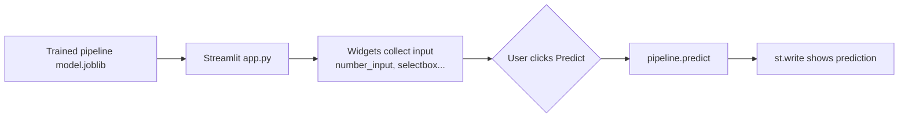

Not every audience wants a raw JSON API — a product manager or a stakeholder
usually wants to type in some numbers and click a button. Streamlit lets you turn
the same saved pipeline into a small interactive web page, using nothing but plain
Python, so you can hand someone a link instead of a `curl` command.

## What Streamlit is

Streamlit turns Python scripts into web apps.

It’s great for:

- demos
- internal tools
- quick validation with stakeholders

## Where Streamlit fits in the deployment flow



## Minimal Streamlit inference app

```python title="app.py (Streamlit)" showLineNumbers{1}
# Requires: streamlit, joblib
import streamlit as st
import joblib

model = joblib.load("model.joblib")

st.title("ML Prediction Demo")

age = st.number_input("Age", min_value=0, max_value=120, value=30)
income = st.number_input("Income", min_value=0.0, value=50000.0)
city = st.text_input("City", value="Pune")
plan = st.selectbox("Plan", ["Free", "Pro", "Enterprise"])

if st.button("Predict"):
    X = [{"age": age, "income": income, "city": city, "plan": plan}]
    pred = model.predict(X)[0]
    st.write("Prediction:", pred)
```

## Running it locally

```bash title="Run the Streamlit app"
pip install streamlit joblib
streamlit run app.py
# -> opens http://localhost:8501 in your browser
```

## Don't reload the model on every click

Streamlit re-runs your **entire script from top to bottom** every time a
widget changes — every number you type, every button you click. Without
caching, `joblib.load("model.joblib")` on line 4 would re-read the file from
disk on every single interaction, which gets slow (or expensive) fast for a
large model. `@st.cache_resource` tells Streamlit to run that function once
and reuse the same object across reruns:

```python title="app.py (cached model load)" showLineNumbers{1}
import streamlit as st
import joblib

@st.cache_resource
def load_model():
    return joblib.load("model.joblib")

model = load_model()  # only actually loads from disk the first time
```

Use `@st.cache_resource` for things you don't want copied (models, database
connections). Use the related `@st.cache_data` for cacheable *data* (like a
CSV you read into a DataFrame) — Streamlit copies that result on each cache
hit so callers can't accidentally mutate the cached object.

## Batch predictions from an uploaded file

A single-row form is fine for a demo, but stakeholders often want to drop in
a whole spreadsheet and get predictions for every row back. `st.file_uploader`
plus `pandas` makes that a few lines:

```python title="app.py (batch predictions)" showLineNumbers{1}
import streamlit as st
import pandas as pd

st.header("Batch predictions")
uploaded = st.file_uploader("Upload a CSV of rows to score", type="csv")

if uploaded is not None:
    df = pd.read_csv(uploaded)
    df["prediction"] = model.predict(df)
    st.dataframe(df)
    st.download_button(
        "Download results",
        df.to_csv(index=False),
        file_name="predictions.csv",
    )
```

## Deployment options

- Streamlit Community Cloud
- Docker + any cloud VM
- internal server

## Keeping secrets out of the app

If your app needs an API key or database password, never hard-code it into
`app.py`. Streamlit reads a local `.streamlit/secrets.toml` file (and, on
Streamlit Community Cloud, a "Secrets" panel in the app settings) and exposes
it as `st.secrets`:

```toml title=".streamlit/secrets.toml"
db_password = "correct-horse-battery-staple"
```

```python title="Reading a secret"
password = st.secrets["db_password"]
```

Add `.streamlit/secrets.toml` to `.gitignore` so it never ends up in version
control.

:::tip[From the book]
Géron's Appendix B checklist reminds you that a launch isn't just a model file —
step one is "get your solution ready for production (plug into production data
inputs, write unit tests, etc.)." A Streamlit demo is a great first production
surface: it's the fastest way to plug your saved pipeline into real inputs and let
someone other than you click around and sanity-check it before it goes anywhere
more critical.
:::

## Mini-checkpoint

When would you prefer Streamlit over an API?

- when you need a user-facing demo UI quickly.

import DataCampExercise from "../../../../components/DataCampExercise.astro";

## 🧪 Try It Yourself

### Exercise 1 – Build an Input Widget

<DataCampExercise
  lang="python"
  hint={`Streamlit's numeric input widget is \`st.number_input(...)\`.`}
  code={`# Task: Exercise 1 – Build an Input Widget
class st:
    @staticmethod
    def number_input(label, min_value=0, max_value=120, value=30):
        return value

# replace ___ with number_input
age = st.___("Age", min_value=0, max_value=120, value=45)
print("age:", age)

# ── Expected Output ───────────────────────────────────────────
# age: 45
# ──────────────────────────────────────────────────────────────`}
  solution={`class st:
    @staticmethod
    def number_input(label, min_value=0, max_value=120, value=30):
        return value

age = st.number_input("Age", min_value=0, max_value=120, value=45)
print("age:", age)`}
  sct={`test_output_contains("age: 45")
success_msg("That's the same number_input widget used in the app!")`}
  height={158}
/>

### Exercise 2 – Assemble the Feature Row for Prediction

<DataCampExercise
  lang="python"
  hint={`The pipeline expects a list containing one dict of feature names to values: [{"age": ..., "income": ...}].`}
  code={`# Task: Exercise 2 – Assemble the Feature Row
age = 40
income = 60000.0

# replace ___ with a list containing the feature dict
X = ___
print(X)

# ── Expected Output ───────────────────────────────────────────
# [{'age': 40, 'income': 60000.0}]
# ──────────────────────────────────────────────────────────────`}
  solution={`age = 40
income = 60000.0
X = [{"age": age, "income": income}]
print(X)`}
  sct={`test_output_contains("age")
success_msg("That row is exactly what pipeline.predict(X) expects!")`}
  height={148}
/>

### Exercise 3 – Guard the Predict Button

<DataCampExercise
  lang="python"
  hint={`Streamlit apps typically only run prediction logic when \`st.button("Predict")\` returns True.`}
  code={`# Task: Exercise 3 – Guard the Predict Button
clicked = True   # pretend the user clicked the button
pred = 1

# replace ___ with clicked
if ___:
    print("Prediction:", pred)

# ── Expected Output ───────────────────────────────────────────
# Prediction: 1
# ──────────────────────────────────────────────────────────────`}
  solution={`clicked = True
pred = 1

if clicked:
    print("Prediction:", pred)`}
  sct={`test_output_contains("Prediction: 1")
success_msg("That guard keeps the app from predicting before the user is ready!")`}
  height={148}
/>

## Next

Continue to **Dockerizing an ML Application** — package the Streamlit app (or the
Flask/FastAPI service) with its dependencies so it runs the same way on any machine.
