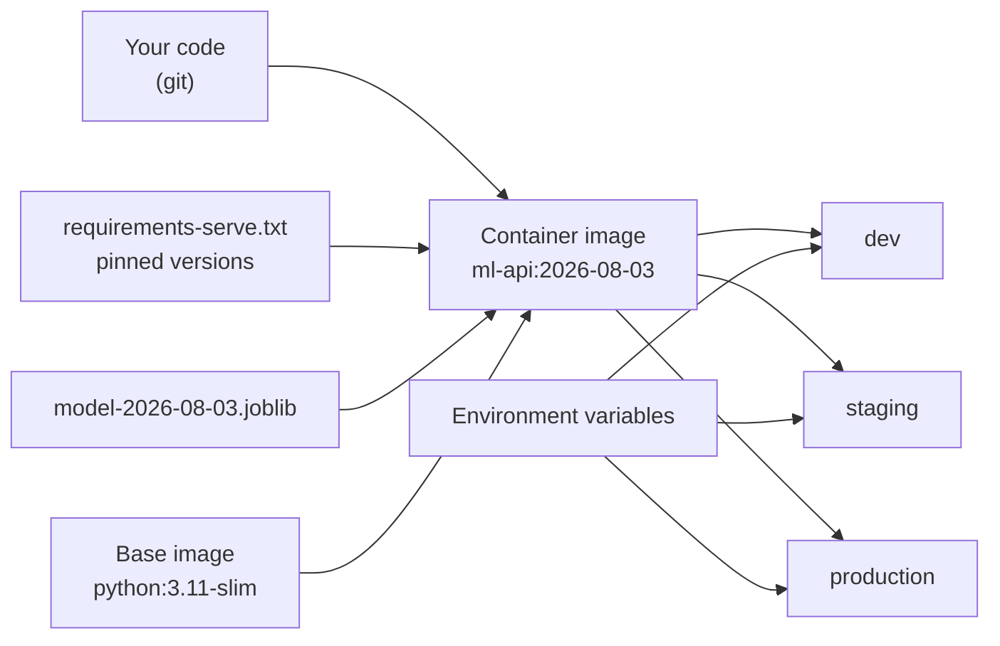

## What you'll learn

- why a container is the only artefact that actually pins "the environment"
- what drives image size, measured: serving stack **190 MB** against **1,693 MB** installed
- the layer ordering that turns a 3-minute rebuild into a 3-second one
- baking the model in against mounting it, and when each is right
- a health check Docker itself runs, and why the container should not run as root

## Why a container

The [environment page](/machine-learning/phase-01---the-ml-foundation/setting-up-the-ml-environment-scikit-learn-tensorflow-pytorch/)
argued that a reproducible result needs four things: the code, the data, the seeds and the
environment. A `requirements.txt` pins the third-party Python packages. It does not pin the Python
build, the C libraries NumPy links against, the BLAS implementation, the locale, or the OS.

A container image pins all of it. That is the whole value proposition, and for machine learning it
matters more than for most software, because a different BLAS can reassociate floating-point sums
and quietly change your predictions.

| Pinned by | Python packages | Python build | System libs | OS |
| --- | --- | --- | --- | --- |
| `requirements.txt` | ✅ | ❌ | ❌ | ❌ |
| Lock file + `.python-version` | ✅ | ✅ | ❌ | ❌ |
| conda environment export | ✅ | ✅ | partly | ❌ |
| **Container image** | ✅ | ✅ | ✅ | ✅ |



One image, three environments, differing only by configuration. That is the arrangement the rest of
this page is building toward.

## What actually makes the image big

Almost nobody's image is big because of their code. It is big because of what got installed.

Measured installed sizes in the environment that built this page:

| Package | Installed size | In a serving image? |
| --- | --- | --- |
| joblib | 2 MB | ✅ required |
| matplotlib | 31 MB | ❌ plotting is not serving |
| numpy | 33 MB | ✅ required |
| scikit-learn | 42 MB | ✅ required |
| pandas | 64 MB | ⚠️ only if you use DataFrames at inference |
| scipy | 113 MB | ✅ scikit-learn depends on it |
| **tensorflow** | **1,409 MB** | ❌ unless you actually serve a TF model |

<Figure
  src="/images/ml/phase-08-mlops/dockerizing-an-ml-application/dependency-footprint"
  alt="A log-scale horizontal bar chart of installed package sizes, from joblib at 2 MB to tensorflow at 1409 MB, with the four core serving packages highlighted."
  title="What your Dockerfile is really choosing between"
  caption="The four packages a scikit-learn service actually needs total 190 MB. Adding pandas, matplotlib and tensorflow takes the same environment to 1,693 MB — 8.9 times heavier. These are site-packages measurements, not image sizes; a real image also carries the base OS and the Python runtime."
/>

A scikit-learn serving stack — numpy, scipy, scikit-learn, joblib — is **190 MB**. Install
everything from a research notebook and the same environment is **1,693 MB**, **8.9× heavier**, with
TensorFlow alone accounting for 1.4 GB of it.

So the single most effective thing you can do about image size is **have a separate
`requirements-serve.txt`** that contains only what inference needs:

```text title="requirements-serve.txt"
scikit-learn==1.9.0
joblib==1.5.3
fastapi==0.115.0
uvicorn[standard]==0.32.0
pydantic==2.9.0
```

numpy and scipy arrive as scikit-learn dependencies. matplotlib, seaborn, jupyter and tensorflow do
not appear because the service does not import them.

## Layer ordering

Docker caches each instruction as a layer. When an instruction's inputs change, that layer and
**every layer after it** rebuild. So the order of your Dockerfile determines how long your inner
loop takes.

<Figure
  src="/images/ml/phase-08-mlops/dockerizing-an-ml-application/layer-cache"
  alt="Two side-by-side stacks of four Dockerfile layers. On the left, changing app code rebuilds only the final layer. On the right, changing a dependency rebuilds three of four."
  title="Copy the dependency list before the source"
  caption="Left: you edit one line of application code, and only the final COPY is invalidated — pip install stays cached. Right: you add a dependency, and three of four layers rebuild. Since code changes are far more frequent than dependency changes, this ordering is the one that matters."
/>

The rule: **copy the thing that changes least, first.**

```dockerfile title="Dockerfile"
FROM python:3.11-slim

# System packages first — these change almost never.
RUN apt-get update && apt-get install -y --no-install-recommends \
      curl \
    && rm -rf /var/lib/apt/lists/*

WORKDIR /app

# Dependencies BEFORE source. This layer is cached until the file changes.
COPY requirements-serve.txt .
RUN pip install --no-cache-dir -r requirements-serve.txt

# Source and model last — these change every commit.
COPY app/ ./app/
COPY model.joblib .

# Do not run as root.
RUN useradd --create-home --uid 1000 appuser && chown -R appuser /app
USER appuser

EXPOSE 8000
HEALTHCHECK --interval=30s --timeout=3s --start-period=20s --retries=3 \
  CMD curl -fsS http://localhost:8000/health || exit 1

CMD ["uvicorn", "app.main:app", "--host", "0.0.0.0", "--port", "8000"]
```

Four details in that file are doing real work:

**`--no-cache-dir`** stops pip keeping a wheel cache inside the image. It is free size savings.

**`--no-install-recommends`** plus `rm -rf /var/lib/apt/lists/*` in the *same* `RUN`. Cleaning up in
a later instruction does not help — the deleted files still exist in the earlier layer.

**`USER appuser`** because a container process running as root that gets compromised is running as
root on your host kernel. This is one line.

**`HEALTHCHECK`** calling the endpoint that
[actually exercises the model](/machine-learning/phase-08---model-deployment-mlops/building-an-ml-api-with-flask-fastapi/),
so an orchestrator can tell a broken container apart from a slow one.

### See it move

Layer invalidation is a cascade, which is hard to see in a static diagram and obvious in an animation.
The sketch holds the same Dockerfile in two orderings — dependencies-then-source, and
source-then-dependencies — and fires the change events a real project actually experiences: many code
edits, occasional dependency bumps, rare base-image updates. Layers rebuild in amber, hit cache in
green, and the tally at the bottom is minutes of build time you either spend or do not.

```p5 title="Layer order decides how long your inner loop takes" desc="Two Dockerfile orderings rebuilt under the same stream of change events. A code edit invalidates only the final COPY in the good ordering but the pip install as well in the bad one. Cumulative build minutes diverge quickly because code edits are the most common event by far. Click to fire a change immediately." height="440"
const LAYERS = [
  { name: "FROM python:3.11-slim", sec: 4, dep: "base" },
  { name: "RUN apt-get install curl", sec: 12, dep: "base" },
  { name: "COPY requirements-serve.txt", sec: 1, dep: "reqs" },
  { name: "RUN pip install -r ...", sec: 95, dep: "reqs" },
  { name: "COPY app/", sec: 2, dep: "code" },
  { name: "COPY model.joblib", sec: 3, dep: "model" },
];
const BAD_ORDER = [0, 1, 4, 5, 2, 3];   // source before dependencies
// change events and how often they happen in a real week
const EVENTS = [
  { what: "code", weight: 0.78, label: "edited app/main.py" },
  { what: "model", weight: 0.14, label: "retrained model.joblib" },
  { what: "reqs", weight: 0.06, label: "added a dependency" },
  { what: "base", weight: 0.02, label: "bumped the base image" },
];
let event = null;
let goodSec = 0;
let badSec = 0;
let builds = 0;
let timer = 0;
let goodMarks = [];
let badMarks = [];

function setup() {
  createCanvas(620, 440);
  textFont("monospace");
  fire();
}
function pickEvent() {
  let u = random();
  for (const e of EVENTS) {
    if (u < e.weight) return e;
    u -= e.weight;
  }
  return EVENTS[0];
}
function rebuildCost(order, changed) {
  // walk the layers in order; once a layer is invalidated, everything after it rebuilds too
  let invalid = false;
  let sec = 0;
  const marks = [];
  for (const idx of order) {
    const L = LAYERS[idx];
    if (L.dep === changed) invalid = true;
    marks.push([idx, invalid]);
    if (invalid) sec += L.sec;
  }
  return { sec: sec, marks: marks };
}
function fire() {
  event = pickEvent();
  const good = rebuildCost([0, 1, 2, 3, 4, 5], event.what);
  const bad = rebuildCost(BAD_ORDER, event.what);
  goodSec += good.sec;
  badSec += bad.sec;
  goodMarks = good.marks;
  badMarks = bad.marks;
  builds++;
  if (builds > 60) { builds = 1; goodSec = good.sec; badSec = bad.sec; }
}
function panel(x, title, order, marks, col) {
  fill(col[0], col[1], col[2]);
  textSize(11);
  textAlign(LEFT, TOP);
  text(title, x, 66);
  for (let i = 0; i < order.length; i++) {
    const [idx, invalid] = marks[i];
    const L = LAYERS[idx];
    const y = 88 + i * 30;
    noStroke();
    fill(invalid ? color(255, 176, 67, 60) : color(120, 200, 120, 40));
    rect(x, y, 268, 25, 3);
    fill(invalid ? color(255, 176, 67) : color(120, 200, 120));
    textSize(9);
    textAlign(LEFT, CENTER);
    text(invalid ? "BUILD" : "cache", x + 6, y + 13);
    fill(invalid ? 225 : 130);
    textAlign(LEFT, CENTER);
    text(L.name.length > 26 ? L.name.slice(0, 25) + "." : L.name, x + 48, y + 13);
    fill(invalid ? color(255, 176, 67) : color(70, 80, 92));
    textAlign(RIGHT, CENTER);
    text(L.sec + "s", x + 262, y + 13);
  }
}
function draw() {
  background(13, 17, 23);
  fill(215);
  textSize(12);
  textAlign(LEFT, TOP);
  text("build #" + builds + "   event: " + event.label, 30, 16);
  fill(105);
  textSize(10);
  text("event mix per 100 builds: 78 code, 14 model, 6 deps, 2 base", 30, 36);

  panel(30, "deps before source  (good)", [0, 1, 2, 3, 4, 5], goodMarks, [120, 200, 120]);
  panel(320, "source before deps  (bad)", BAD_ORDER, badMarks, [255, 176, 67]);

  const y0 = 282;
  fill(140);
  textSize(11);
  textAlign(LEFT, TOP);
  text("cumulative build time over " + builds + " builds", 30, y0);
  const maxSec = Math.max(goodSec, badSec, 1);
  noStroke();
  fill(30, 36, 44);
  rect(30, y0 + 22, 540, 20);
  fill(120, 200, 120);
  rect(30, y0 + 22, (goodSec / maxSec) * 540, 20);
  fill(235);
  textSize(11);
  textAlign(LEFT, CENTER);
  text((goodSec / 60).toFixed(1) + " min", 36, y0 + 32);
  fill(30, 36, 44);
  rect(30, y0 + 48, 540, 20);
  fill(255, 176, 67);
  rect(30, y0 + 48, (badSec / maxSec) * 540, 20);
  fill(235);
  text((badSec / 60).toFixed(1) + " min", 36, y0 + 58);

  fill(200);
  textSize(11);
  textAlign(LEFT, TOP);
  text("bad ordering costs " + (goodSec > 0 ? (badSec / goodSec).toFixed(1) : "1.0") + "x more", 30, y0 + 82);
  fill(105);
  textSize(10);
  text("a code edit rebuilds 5s in the good order and 100s in the bad one,", 30, y0 + 104);
  text("because pip install sits AFTER the source it does not depend on", 30, y0 + 118);
  text("click to fire a change now", 30, y0 + 138);

  timer += deltaTime;
  if (timer > 1400) { timer = 0; fire(); }
}
function mousePressed() { timer = 9999; }
```

Trace one code edit through both stacks. Good ordering: `COPY app/` and `COPY model.joblib` rebuild,
2 + 3 = **5 seconds**. Bad ordering: `COPY app/` invalidates, and everything after it — the model
copy, the requirements copy, and the 95-second `pip install` — rebuilds too, for
2 + 3 + 1 + 95 = **101 seconds**. Same image, same content, 20× the wait, and code edits are around
78% of all builds. The fix is which line you write first.

## `.dockerignore`

Without one, `COPY app/ ./app/` sends your entire build context to the daemon — including `.git`,
`.venv`, notebooks, and the raw training data.

```text title=".dockerignore"
.git
.venv
__pycache__/
*.pyc
.pytest_cache/
notebooks/
data/
tests/
*.ipynb
.env
.streamlit/secrets.toml
README.md
```

Note `.env` and `secrets.toml` on that list. A secret copied into an image is in the image *forever*
— deleting it in a later layer does not remove it, and anyone who can pull the image can read it.

## Bake the model in, or mount it

| | Bake into the image | Mount at runtime |
| --- | --- | --- |
| Reproducibility | **Exact** — image tag identifies the model | Image and model version separately |
| Rollback | Redeploy the previous tag | Repoint the volume |
| Image size | Larger | Smaller |
| New model | Rebuild and redeploy | Restart, or hot-reload |
| Best for | **Production** | Development, very large models |

Bake it in for production. The image tag then identifies exactly one model plus exactly one code
version, which is what makes "roll back to yesterday" a single command rather than an
investigation.

```bash
# Development: iterate on the model without rebuilding.
docker run -p 8000:8000 -v "$(pwd)/models:/app/models:ro" ml-api:dev

# Production: everything in the tag.
docker build -t ml-api:2026-08-03 .
docker run -p 8000:8000 ml-api:2026-08-03
```

The `:ro` on the volume mount is deliberate — the service has no reason to write to its model
directory.

## Building and running

```bash
# Build, tagged with something meaningful. Never rely on :latest.
docker build -t ml-api:2026-08-03 .

# Run it, with the port mapped and the config from the environment.
docker run --rm -p 8000:8000 \
  -e MODEL_PATH=/app/model.joblib \
  -e LOG_LEVEL=info \
  --name ml-api \
  ml-api:2026-08-03

# Confirm the container thinks it is healthy.
docker inspect --format='{{.State.Health.Status}}' ml-api

# Look at what you built.
docker images ml-api
docker history ml-api:2026-08-03      # which layer is enormous, and why
```

`docker history` is the tool to reach for when an image is unexpectedly large. It shows the size
each instruction contributed, which usually points straight at a `pip install` that pulled in
something you did not intend.

Read configuration from the environment, never from a baked-in constant:

```python title="config.py" showLineNumbers{1}
import os

MODEL_PATH = os.environ.get("MODEL_PATH", "model.joblib")
PORT = int(os.environ.get("PORT", "8000"))
LOG_LEVEL = os.environ.get("LOG_LEVEL", "info")
MAX_BATCH = int(os.environ.get("MAX_BATCH", "1000"))
```

The same image then runs in dev, staging and production with different settings — which is the point
of building an image at all.

## Multi-stage builds

If your build needs compilers that your runtime does not, build in one stage and copy only the
result into a clean second stage:

```dockerfile title="Dockerfile.multistage"
# ---- build stage: has gcc, produces wheels ----
FROM python:3.11 AS builder
WORKDIR /build
COPY requirements-serve.txt .
RUN pip wheel --no-cache-dir --wheel-dir /wheels -r requirements-serve.txt

# ---- runtime stage: no compilers, no build tools ----
FROM python:3.11-slim
WORKDIR /app
COPY --from=builder /wheels /wheels
RUN pip install --no-cache-dir --no-index --find-links=/wheels /wheels/* \
    && rm -rf /wheels
COPY app/ ./app/
COPY model.joblib .
RUN useradd --create-home --uid 1000 appuser && chown -R appuser /app
USER appuser
CMD ["uvicorn", "app.main:app", "--host", "0.0.0.0", "--port", "8000"]
```

For a pure scikit-learn service on `python:3.11-slim` this often changes little, because everything
installs from prebuilt wheels anyway. It pays off when something in your tree has no wheel for your
platform and has to be compiled.

## API and UI together

```yaml title="docker-compose.yml"
services:
  api:
    build: .
    image: ml-api:2026-08-03
    ports: ["8000:8000"]
    environment:
      MODEL_PATH: /app/model.joblib
      LOG_LEVEL: info
    healthcheck:
      test: ["CMD", "curl", "-fsS", "http://localhost:8000/health"]
      interval: 30s
      timeout: 3s
      start_period: 20s
      retries: 3

  ui:
    build:
      context: .
      dockerfile: Dockerfile.streamlit
    ports: ["8501:8501"]
    environment:
      API_URL: http://api:8000        # service name, not localhost
    depends_on:
      api:
        condition: service_healthy
```

Two things worth noticing. `API_URL` uses the **service name** `api`, because inside the Compose
network `localhost` means the UI container itself. And `condition: service_healthy` means the UI
waits for the API's health check to pass, not merely for its process to start.

## Pitfalls

**Copying source before dependencies.** Every code change re-runs `pip install`. One line of
ordering.

**Installing your notebook environment.** Measured: 190 MB versus 1,693 MB. Keep a separate
`requirements-serve.txt`.

**No `.dockerignore`.** Your `.git` directory, your virtualenv and your training data all get sent
to the daemon and often end up in the image.

**Secrets in the image.** They persist in the layer even if a later instruction deletes them. Use
environment variables or a secrets mount.

**Running as root.** One `USER` line. Container escapes are rare; running as root makes them
catastrophic instead of contained.

**Deploying `:latest`.** You cannot roll back to a tag that keeps moving. Tag with a date or a
commit SHA.

**Cleaning up in a later `RUN`.** `apt-get clean` in a separate instruction saves nothing — the
files are already committed to the earlier layer.

**No `HEALTHCHECK`.** The orchestrator restarts on process death only, so a container serving 500s
happily stays in rotation.

## Recap

- A container pins the **whole** environment — OS, system libraries, Python build — which a
  requirements file cannot.
- Image size is driven by dependencies: **190 MB** for a scikit-learn serving stack, **1,693 MB**
  with the research extras. Keep a separate `requirements-serve.txt`.
- **Copy the dependency list before the source.** A code change should invalidate one layer, not
  four.
- Bake the model into the image for production so the tag identifies model *and* code.
- `--no-cache-dir`, `--no-install-recommends`, cleanup in the *same* `RUN`, a `.dockerignore`, a
  non-root `USER`, and a `HEALTHCHECK`.
- Configuration comes from the environment, so one image runs everywhere.
- Tag with a date or SHA. Never deploy `:latest`.

<Quiz
  questions={[
    {
      q: "Why does COPY requirements.txt come before COPY app/ in a good Dockerfile?",
      options: [
        "Alphabetical order",
        "Docker caches layers in order, so putting the rarely-changing dependency list first keeps pip install cached across code changes",
        "pip requires it",
        "It makes the image smaller",
      ],
      answer: 1,
      explain: "Any change invalidates its layer and everything after it. Code changes many times a day and dependencies change monthly, so the dependency install belongs earlier. Reversed, every one-line code edit re-runs the whole pip install.",
    },
    {
      q: "Your serving image is 2 GB. What is the most likely cause?",
      options: [
        "The model file is too large",
        "You installed your full research environment — tensorflow alone measured 1,409 MB against 190 MB for the whole scikit-learn serving stack",
        "The base image is too big",
        "Too many layers",
      ],
      answer: 1,
      explain: "Models are usually kilobytes to a few megabytes. Dependencies are gigabytes. A separate requirements-serve.txt with only what inference imports is the single highest-leverage fix.",
    },
    {
      q: "You accidentally COPY a .env file, then RUN rm .env in the next instruction. Is the secret gone?",
      options: [
        "Yes, the file is deleted",
        "No — it is still in the earlier layer, and anyone who can pull the image can read it",
        "Only if you rebuild",
        "Yes, if you use --squash",
      ],
      answer: 1,
      explain: "Layers are additive and immutable. A later deletion hides the file from the final filesystem view but the bytes remain in the layer history. The secret must never enter the build context — that is what .dockerignore is for.",
    },
    {
      q: "Why does the Compose UI service use http://api:8000 rather than http://localhost:8000?",
      options: [
        "localhost is slower",
        "Inside the UI container, localhost is that container — service names resolve to the other containers on the Compose network",
        "Docker blocks localhost",
        "It is only a naming convention",
      ],
      answer: 1,
      explain: "Each container has its own network namespace, so localhost never means 'the other container'. Compose provides DNS for service names, which is also why the API's port does not need publishing to the host for the UI to reach it.",
    },
    {
      q: "What does HEALTHCHECK give you that Docker's default process supervision does not?",
      options: [
        "Faster startup",
        "It detects a container that is running but not serving — a process alive with a broken model would otherwise stay in rotation",
        "Smaller images",
        "Automatic scaling",
      ],
      answer: 1,
      explain: "Without it, the only failure signal is the process exiting. A worker whose model failed to load keeps running and keeps receiving traffic. The check must hit an endpoint that actually exercises the model.",
    },
  ]}
/>

## 🧪 Try It Yourself

### Exercise 1 – Which packages belong in the serving image?

<DataCampExercise
  lang="python"
  hint={`Keep only what inference imports; sum the rest to see what you avoided shipping.`}
  code={`# Task: Exercise 1 - Which packages belong in the serving image?
INSTALLED = {
    "joblib": 2, "matplotlib": 31, "numpy": 33, "sklearn": 42,
    "pandas": 64, "scipy": 113, "tensorflow": 1409,
}
SERVING_NEEDS = {"joblib", "numpy", "sklearn", "scipy"}

serve = {k: v for k, v in INSTALLED.items() if k in SERVING_NEEDS}
skip = {k: v for k, v in INSTALLED.items() if k not in SERVING_NEEDS}

serve_mb = sum(serve.values())
all_mb = ___(INSTALLED.values())              # replace ___ with sum

print("ship  :", sorted(serve), f"= {serve_mb} MB")
print("skip  :", sorted(skip), f"= {sum(skip.values())} MB")
print(f"total if you ship everything: {all_mb} MB  ({all_mb / serve_mb:.1f}x heavier)")

# -- Expected Output -------------------------------------------
# ship  : ['joblib', 'numpy', 'scipy', 'sklearn'] = 190 MB
# skip  : ['matplotlib', 'pandas', 'tensorflow'] = 1504 MB
# total if you ship everything: 1694 MB  (8.9x heavier)
# --------------------------------------------------------------`}
  solution={`INSTALLED = {
    "joblib": 2, "matplotlib": 31, "numpy": 33, "sklearn": 42,
    "pandas": 64, "scipy": 113, "tensorflow": 1409,
}
SERVING_NEEDS = {"joblib", "numpy", "sklearn", "scipy"}
serve = {k: v for k, v in INSTALLED.items() if k in SERVING_NEEDS}
skip = {k: v for k, v in INSTALLED.items() if k not in SERVING_NEEDS}
serve_mb = sum(serve.values())
all_mb = sum(INSTALLED.values())
print("ship  :", sorted(serve), f"= {serve_mb} MB")
print("skip  :", sorted(skip), f"= {sum(skip.values())} MB")
print(f"total if you ship everything: {all_mb} MB  ({all_mb / serve_mb:.1f}x heavier)")`}
  sct={`test_output_contains("8.9x heavier")
success_msg("One extra requirements file is worth 1.5 GB per image, per pull, per node.")`}
  height={280}
/>

### Exercise 2 – Which layers rebuild?

<DataCampExercise
  lang="python"
  hint={`Everything from the first invalidated layer onwards has to rebuild.`}
  code={`# Task: Exercise 2 - Which layers rebuild?
LAYERS = ["FROM python:3.11-slim", "COPY requirements.txt",
          "RUN pip install -r requirements.txt", "COPY app/", "COPY model.joblib"]

def rebuild_from(changed_index):
    """Docker invalidates the changed layer and everything after it."""
    return [(i, name, "cached" if i < changed_index else "REBUILT")
            for i, name in enumerate(___)]    # replace ___ with LAYERS

for label, idx in [("edited app code", 3), ("added a dependency", 1)]:
    rows = rebuild_from(idx)
    n = sum(1 for _, _, s in rows if s == "REBUILT")
    print(f"\\n{label}: {n} of {len(LAYERS)} layers rebuilt")
    for i, name, status in rows:
        print(f"  {status:8s} {name}")

# -- Expected Output -------------------------------------------
#
# edited app code: 2 of 5 layers rebuilt
#   cached   FROM python:3.11-slim
#   cached   COPY requirements.txt
#   cached   RUN pip install -r requirements.txt
#   REBUILT  COPY app/
#   REBUILT  COPY model.joblib
#
# added a dependency: 4 of 5 layers rebuilt
#   cached   FROM python:3.11-slim
#   REBUILT  COPY requirements.txt
#   REBUILT  RUN pip install -r requirements.txt
#   REBUILT  COPY app/
#   REBUILT  COPY model.joblib
# --------------------------------------------------------------`}
  solution={`LAYERS = ["FROM python:3.11-slim", "COPY requirements.txt",
          "RUN pip install -r requirements.txt", "COPY app/", "COPY model.joblib"]

def rebuild_from(changed_index):
    return [(i, name, "cached" if i < changed_index else "REBUILT")
            for i, name in enumerate(LAYERS)]

for label, idx in [("edited app code", 3), ("added a dependency", 1)]:
    rows = rebuild_from(idx)
    n = sum(1 for _, _, s in rows if s == "REBUILT")
    print(f"\\n{label}: {n} of {len(LAYERS)} layers rebuilt")
    for i, name, status in rows:
        print(f"  {status:8s} {name}")`}
  sct={`test_output_contains("added a dependency: 4 of 5 layers rebuilt")
success_msg("Code changes hit 2 layers; dependency changes hit 4. Reverse the order and every code change hits all 5.")`}
  height={320}
/>

### Exercise 3 – Read configuration from the environment

<DataCampExercise
  lang="python"
  hint={`os.environ.get takes a default, and the value always arrives as a string.`}
  code={`# Task: Exercise 3 - Read configuration from the environment
import os

# Pretend the container was started with -e PORT=9000 -e MAX_BATCH=250
os.environ["PORT"] = "9000"
os.environ["MAX_BATCH"] = "250"

MODEL_PATH = os.environ.get("MODEL_PATH", "model.joblib")
PORT = int(os.environ.get("PORT", "8000"))
LOG_LEVEL = os.environ.get("LOG_LEVEL", ___)  # replace ___ with "info"
MAX_BATCH = int(os.environ.get("MAX_BATCH", "1000"))

for k, v in [("MODEL_PATH", MODEL_PATH), ("PORT", PORT),
             ("LOG_LEVEL", LOG_LEVEL), ("MAX_BATCH", MAX_BATCH)]:
    print(f"{k:11s} {v!r}")

# -- Expected Output -------------------------------------------
# MODEL_PATH  'model.joblib'
# PORT        9000
# LOG_LEVEL   'info'
# MAX_BATCH   250
# --------------------------------------------------------------`}
  solution={`import os

os.environ["PORT"] = "9000"
os.environ["MAX_BATCH"] = "250"
MODEL_PATH = os.environ.get("MODEL_PATH", "model.joblib")
PORT = int(os.environ.get("PORT", "8000"))
LOG_LEVEL = os.environ.get("LOG_LEVEL", "info")
MAX_BATCH = int(os.environ.get("MAX_BATCH", "1000"))
for k, v in [("MODEL_PATH", MODEL_PATH), ("PORT", PORT),
             ("LOG_LEVEL", LOG_LEVEL), ("MAX_BATCH", MAX_BATCH)]:
    print(f"{k:11s} {v!r}")`}
  sct={`test_output_contains("PORT        9000")
success_msg("Note the int() casts — environment variables are always strings, and PORT='9000' breaks uvicorn.")`}
  height={270}
/>

### Exercise 4 – Build a defensible tag

<DataCampExercise
  lang="python"
  hint={`A tag should identify a specific build; :latest identifies whatever was pushed most recently.`}
  code={`# Task: Exercise 4 - Build a defensible tag
def make_tag(image, date, commit_sha):
    """Date for humans, SHA for exactness."""
    return f"{image}:{date}-{commit_sha[:___]}"    # replace ___ with 7

tag = make_tag("ml-api", "2026-08-03", "a3f9c1d84be2077f")
print("build :", f"docker build -t {tag} .")
print("run   :", f"docker run -p 8000:8000 {tag}")
print()
print("rollback is one command:")
print("       ", f"docker run -p 8000:8000 {make_tag('ml-api', '2026-08-02', 'ff10c2a99de1443c')}")
print()
print("with :latest, rollback is:  ...to what, exactly?")

# -- Expected Output -------------------------------------------
# build : docker build -t ml-api:2026-08-03-a3f9c1d .
# run   : docker run -p 8000:8000 ml-api:2026-08-03-a3f9c1d
#
# rollback is one command:
#         docker run -p 8000:8000 ml-api:2026-08-02-ff10c2a
#
# with :latest, rollback is:  ...to what, exactly?
# --------------------------------------------------------------`}
  solution={`def make_tag(image, date, commit_sha):
    return f"{image}:{date}-{commit_sha[:7]}"

tag = make_tag("ml-api", "2026-08-03", "a3f9c1d84be2077f")
print("build :", f"docker build -t {tag} .")
print("run   :", f"docker run -p 8000:8000 {tag}")
print()
print("rollback is one command:")
print("       ", f"docker run -p 8000:8000 {make_tag('ml-api', '2026-08-02', 'ff10c2a99de1443c')}")
print()
print("with :latest, rollback is:  ...to what, exactly?")`}
  sct={`test_output_contains("ml-api:2026-08-03-a3f9c1d")
success_msg("A moving tag cannot be rolled back to. Date plus short SHA is readable AND exact.")`}
  height={290}
/>

### Exercise 5 – Audit a .dockerignore

<DataCampExercise
  lang="python"
  hint={`Anything secret, huge, or irrelevant to running the service should be excluded.`}
  code={`# Task: Exercise 5 - Audit a .dockerignore
CONTEXT = [".git", ".venv", "app/main.py", "model.joblib", "data/train.csv",
           "notebooks/eda.ipynb", ".env", "requirements-serve.txt", "tests/",
           "__pycache__/"]

IGNORE = {".git", ".venv", "data/train.csv", "notebooks/eda.ipynb",
          ".env", "tests/", "__pycache__/"}

shipped = [f for f in CONTEXT if f not in IGNORE]
excluded = [f for f in CONTEXT if f ___ IGNORE]       # replace ___ with in

print("goes into the image:")
for f in shipped:
    print("  ", f)
print("excluded:", len(excluded), "entries")
print("secret leaked:", ".env" in shipped)

# -- Expected Output -------------------------------------------
# goes into the image:
#    app/main.py
#    model.joblib
#    requirements-serve.txt
# excluded: 7 entries
# secret leaked: False
# --------------------------------------------------------------`}
  solution={`CONTEXT = [".git", ".venv", "app/main.py", "model.joblib", "data/train.csv",
           "notebooks/eda.ipynb", ".env", "requirements-serve.txt", "tests/",
           "__pycache__/"]
IGNORE = {".git", ".venv", "data/train.csv", "notebooks/eda.ipynb",
          ".env", "tests/", "__pycache__/"}
shipped = [f for f in CONTEXT if f not in IGNORE]
excluded = [f for f in CONTEXT if f in IGNORE]
print("goes into the image:")
for f in shipped:
    print("  ", f)
print("excluded:", len(excluded), "entries")
print("secret leaked:", ".env" in shipped)`}
  sct={`test_output_contains("secret leaked: False")
success_msg("Three files ship. Everything else — including the training data and the .env — never leaves your machine.")`}
  height={290}
/>

### Exercise 6 – Price the layer order

<DataCampExercise
  lang="python"
  hint={`Walk the layers in order. Once one is invalidated, every layer after it rebuilds too, whatever it depends on.`}
  code={`# Task: Exercise 6 - Price the layer order
LAYERS = [("FROM python:3.11-slim", 4, "base"),
          ("RUN apt-get install curl", 12, "base"),
          ("COPY requirements-serve.txt", 1, "reqs"),
          ("RUN pip install -r ...", 95, "reqs"),
          ("COPY app/", 2, "code"),
          ("COPY model.joblib", 3, "model")]
GOOD = [0, 1, 2, 3, 4, 5]          # dependencies before source
BAD = [0, 1, 4, 5, 2, 3]           # source before dependencies


def rebuild_seconds(order, changed):
    invalid = False
    seconds = 0
    for index in order:
        name, cost, dependency = LAYERS[index]
        if dependency == changed:
            invalid = ___                       # replace ___ with True
        if invalid:
            seconds += cost
    return seconds


print(f"{'change':>8} {'good order':>12} {'bad order':>11} {'penalty':>9}")
for change in ("code", "model", "reqs", "base"):
    good = rebuild_seconds(GOOD, change)
    bad = rebuild_seconds(BAD, change)
    print(f"{change:>8} {good:10d}s {bad:9d}s {bad / max(good, 1):8.1f}x")
mix = {"code": 78, "model": 14, "reqs": 6, "base": 2}
good_total = sum(count * rebuild_seconds(GOOD, change) for change, count in mix.items())
bad_total = sum(count * rebuild_seconds(BAD, change) for change, count in mix.items())
print(f"over 100 builds with a realistic mix: {good_total / 60:.1f} min "
      f"against {bad_total / 60:.1f} min")

# -- Expected Output -------------------------------------------
#   change   good order   bad order   penalty
#     code          5s       101s     20.2x
#    model          3s        99s     33.0x
#     reqs        101s        96s      1.0x
#     base        117s       117s      1.0x
# over 100 builds with a realistic mix: 21.2 min against 167.9 min
# --------------------------------------------------------------`}
  solution={`LAYERS = [("FROM python:3.11-slim", 4, "base"),
          ("RUN apt-get install curl", 12, "base"),
          ("COPY requirements-serve.txt", 1, "reqs"),
          ("RUN pip install -r ...", 95, "reqs"),
          ("COPY app/", 2, "code"),
          ("COPY model.joblib", 3, "model")]
GOOD = [0, 1, 2, 3, 4, 5]
BAD = [0, 1, 4, 5, 2, 3]


def rebuild_seconds(order, changed):
    invalid = False
    seconds = 0
    for index in order:
        name, cost, dependency = LAYERS[index]
        if dependency == changed:
            invalid = True
        if invalid:
            seconds += cost
    return seconds


print(f"{'change':>8} {'good order':>12} {'bad order':>11} {'penalty':>9}")
for change in ("code", "model", "reqs", "base"):
    good = rebuild_seconds(GOOD, change)
    bad = rebuild_seconds(BAD, change)
    print(f"{change:>8} {good:10d}s {bad:9d}s {bad / max(good, 1):8.1f}x")
mix = {"code": 78, "model": 14, "reqs": 6, "base": 2}
good_total = sum(count * rebuild_seconds(GOOD, change) for change, count in mix.items())
bad_total = sum(count * rebuild_seconds(BAD, change) for change, count in mix.items())
print(f"over 100 builds with a realistic mix: {good_total / 60:.1f} min "
      f"against {bad_total / 60:.1f} min")`}
  sct={`test_output_contains("21.2 min against 167.9 min")
success_msg("A code edit costs 5 seconds in the good order and 101 in the bad one. Note the reqs row: the bad order is actually 5 seconds CHEAPER when dependencies change — which is why the ordering rule is 'copy what changes least, first' rather than 'always put pip install early'.")`}
  height={370}
/>

## Next

[Monitoring Model Drift](/machine-learning/phase-08---model-deployment-mlops/monitoring-model-drift/)
— the last stage, and the one that decides whether any of the previous four keep working. It
includes the measurement where input monitoring fires on a harmless change and stays silent on the
one that halves accuracy.
