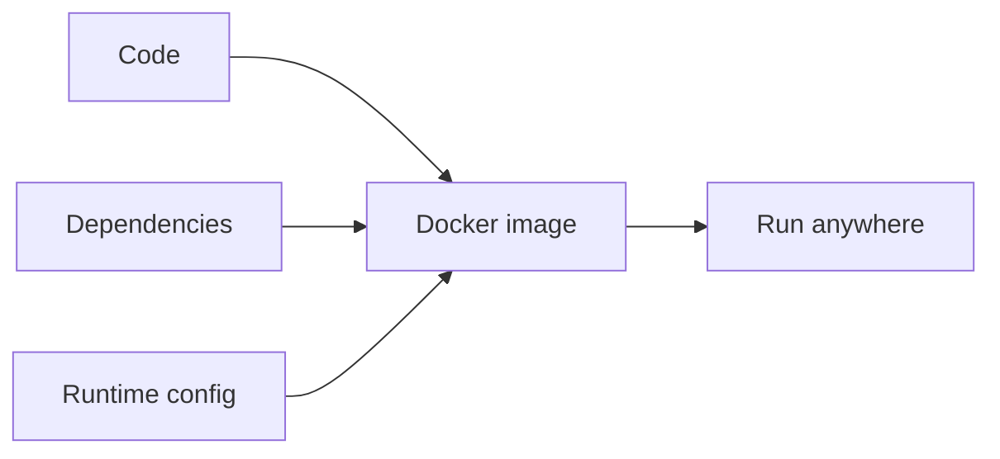
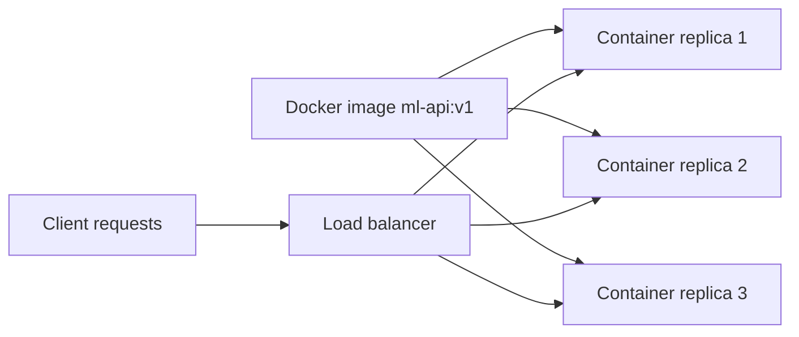

"It works on my machine" is not a deployment strategy. Your model was trained with a
specific Python version, a specific scikit-learn version, maybe a specific BLAS
library underneath NumPy — and any mismatch on the server can silently change
predictions or crash the app outright. Docker solves this by packaging your code,
its dependencies, and the runtime it needs into one image that runs identically
everywhere: your laptop, a teammate's laptop, or a cloud VM.

## Why Docker helps

Docker packages:

- code
- dependencies
- runtime environment

So it runs the same everywhere.



## A simple Dockerfile (FastAPI)

```dockerfile title="Dockerfile"
FROM python:3.11-slim

WORKDIR /app

COPY requirements.txt .
RUN pip install --no-cache-dir -r requirements.txt

COPY . .

EXPOSE 8000
CMD ["uvicorn", "app:app", "--host", "0.0.0.0", "--port", "8000"]
```

## Building and running the container

```bash title="Build and run the image"
# build the image and tag it "ml-api"
docker build -t ml-api .

# run it, mapping container port 8000 to host port 8000
docker run -p 8000:8000 ml-api

# in another terminal, confirm it responds
curl http://127.0.0.1:8000/predict -X POST \
  -H "Content-Type: application/json" \
  -d ‘{"age": 35, "income": 50000, "city": "Pune", "plan": "Pro"}’
```

## Keep the image lean with .dockerignore

Without one, `COPY . .` also copies your `.venv`, `.git` history, notebooks,
and any large `.csv`/`.joblib` files sitting in the repo — bloating the image
and slowing every rebuild. Add a `.dockerignore` right next to the Dockerfile:

```text title=".dockerignore"
.git
.venv
__pycache__
*.ipynb
*.csv
tests/
```

## Mount the model as a volume instead of baking it in

Géron's TF Serving walkthrough mounts the model directory into the container
at *run* time rather than copying it in at *build* time:

```bash title="TF Serving mounts the model directory (from the book)"
docker run -it --rm -p 8500:8500 -p 8501:8501 \
  -v "$ML_PATH/my_mnist_model:/models/my_mnist_model" \
  -e MODEL_NAME=my_mnist_model \
  tensorflow/serving
```

The same trick works for a Flask/FastAPI image. Instead of `COPY model.joblib .`
baked into the image, mount the artifact from the host (or a shared volume):

```bash title="Swap model versions without rebuilding the image"
docker run -p 8000:8000 \
  -v "$(pwd)/models:/app/models" \
  -e MODEL_PATH=/app/models/model_v2.joblib \
  ml-api
```

Now shipping `model_v3.joblib` and pointing `MODEL_PATH` at it is a config
change, not a new image build — the same "rolling back is as simple as
removing the directory" idea Géron describes for TF Serving's versioned
model folders applies just as well to a hand-rolled API image.

## Let Docker check the container's own health

A `HEALTHCHECK` instruction lets Docker (and orchestrators built on top of
it) know when a *running* container has actually finished starting up and is
serving traffic — not just that the process launched:

```dockerfile title="Dockerfile (with HEALTHCHECK)"
FROM python:3.11-slim

WORKDIR /app

COPY requirements.txt .
RUN pip install --no-cache-dir -r requirements.txt

COPY . .

EXPOSE 8000
HEALTHCHECK --interval=30s --timeout=3s \
  CMD curl -f http://localhost:8000/health || exit 1

CMD ["uvicorn", "app:app", "--host", "0.0.0.0", "--port", "8000"]
```

`docker ps` will now show `(healthy)` or `(unhealthy)` next to the container,
and tools like Kubernetes or a load balancer can use that status to decide
whether to keep sending it traffic.

## Running the API and a Streamlit UI together with Compose

Most real setups aren't a single container — an API and a demo UI often run
side by side, sharing the same model artifact. `docker-compose.yml` lets you
describe both services and start them with one command:

```yaml title="docker-compose.yml"
services:
  api:
    build: .
    ports:
      - "8000:8000"
    volumes:
      - ./models:/app/models

  ui:
    build: ./streamlit_app
    ports:
      - "8501:8501"
    depends_on:
      - api
```

```bash title="Start both services"
docker compose up --build
# API   -> http://localhost:8000
# UI    -> http://localhost:8501
```

## From one container to many

A single container is fine for a demo, but real traffic needs more than one replica
behind a load balancer, plus a way to roll out new image versions without downtime.
That’s the job of an orchestrator like Kubernetes — Docker gives you the portable
unit, Kubernetes (or a managed platform) gives you the scaling and rollout logic.



:::tip[From the book]
Géron recommends the same containerized approach for serving TensorFlow models:
"Let’s use the Docker option, which is highly recommended by the TensorFlow team as
it is simple to install, it will not mess with your system, and it offers high
performance." The same reasoning applies to any Python ML service — Docker keeps
your host machine clean and your deployment reproducible, whether you’re running TF
Serving or your own FastAPI app.
:::

## tips

- pin versions in `requirements.txt`
- keep images small (`slim` base)
- don’t bake secrets into images

## Mini-checkpoint

Why is Docker useful for ML specifically?

- ML dependencies are often heavy and version-sensitive.

import DataCampExercise from "../../../../components/DataCampExercise.astro";

## 🧪 Try It Yourself

### Exercise 1 – Build the docker run Command

<DataCampExercise
  lang="python"
  hint={`Map host_port:container_port with an f-string, e.g. f"-p {host}:{container}".`}
  code={`# Task: Exercise 1 – Build the docker run Command
image = "ml-api"
host_port = 8000
container_port = 8000

# replace ___ with an f-string port mapping "8000:8000"
port_flag = f"-p ___:___"
cmd = f"docker run {port_flag} {image}"
print(cmd)

# ── Expected Output ───────────────────────────────────────────
# docker run -p 8000:8000 ml-api
# ──────────────────────────────────────────────────────────────`}
  solution={`image = "ml-api"
host_port = 8000
container_port = 8000

port_flag = f"-p {host_port}:{container_port}"
cmd = f"docker run {port_flag} {image}"
print(cmd)`}
  sct={`test_output_contains("docker run -p 8000:8000 ml-api")
success_msg("That’s the exact flag that exposes your API to the host machine!")`}
  height={158}
/>

### Exercise 2 – Read the PORT from the Environment

<DataCampExercise
  lang="python"
  hint={`Use \`os.environ.get("PORT", "8000")\` so the app respects a PORT variable if the host platform sets one, and falls back to 8000 otherwise.`}
  code={`# Task: Exercise 2 – Read the PORT from the Environment
import os

os.environ["PORT"] = "9000"

# replace ___ with environ.get
port = os.___("PORT", "8000")
print("Listening on port", port)

# ── Expected Output ───────────────────────────────────────────
# Listening on port 9000
# ──────────────────────────────────────────────────────────────`}
  solution={`import os

os.environ["PORT"] = "9000"
port = os.environ.get("PORT", "8000")
print("Listening on port", port)`}
  sct={`test_output_contains("Listening on port 9000")
success_msg("Reading PORT from the environment lets the same image run on any host port!")`}
  height={148}
/>

### Exercise 3 – Tag an Image with a Version

<DataCampExercise
  lang="python"
  hint={`A Docker tag is usually written as "image:version", joined with a colon.`}
  code={`# Task: Exercise 3 – Tag an Image with a Version
image = "ml-api"
version = "v2"

# replace ___ with an f-string "ml-api:v2"
tag = ___
print("Tag:", tag)

# ── Expected Output ───────────────────────────────────────────
# Tag: ml-api:v2
# ──────────────────────────────────────────────────────────────`}
  solution={`image = "ml-api"
version = "v2"
tag = f"{image}:{version}"
print("Tag:", tag)`}
  sct={`test_output_contains("Tag: ml-api:v2")
success_msg("Versioned tags let you roll back to an older image if v2 misbehaves!")`}
  height={138}
/>

## Next

Continue to **Monitoring Model Drift** — once your model is packaged and running
somewhere, the next job is watching it stay accurate over time.
