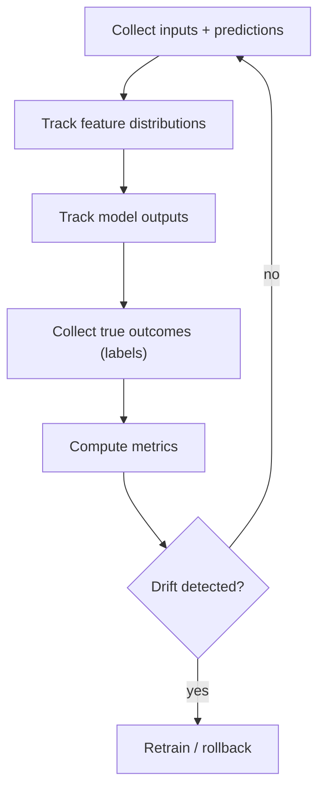

Shipping a model isn't the finish line. The world your model was trained on keeps
changing after deployment — new users, new products, new seasons — and a model that
scored well last quarter can quietly get worse without anyone touching its code.
"Monitoring model drift" means watching the data going in and the predictions
coming out so you notice that decay before it costs you, instead of finding out
from an angry customer.

## Why models drift

Production data changes:

- user behavior shifts
- product changes
- seasonality
- sensor calibration changes

As a result, model performance can degrade.

## Types of drift

### 1) Data drift (covariate shift)

Input feature distributions change.

Example:

- average income changes
- new cities appear

### 2) Concept drift

The relationship between X and y changes.

Example:

- fraud patterns adapt

### 3) Performance drift

Metrics degrade over time.

## Monitoring loop



## What to monitor in practice

- feature distribution stats (mean/std, PSI)
- prediction distribution (sudden shifts)
- business metrics (conversion, fraud loss)
- model metrics when labels arrive (AUC, F1, RMSE)

## A simple drift check in code

You don't need a fancy monitoring platform to get started — comparing basic summary
statistics between the data your model trained on and the data it's seeing now
already catches a lot of real problems:

```python title="check_drift.py" showLineNumbers{1}
import numpy as np

# feature values seen during training
train_income = np.array([32000, 41000, 38000, 52000, 47000, 60000, 55000])

# feature values seen in production this week
live_income = np.array([61000, 72000, 68000, 80000, 75000, 90000, 85000])

train_mean, train_std = train_income.mean(), train_income.std()
live_mean, live_std = live_income.mean(), live_income.std()

# how many training standard-deviations has the live mean shifted?
shift = abs(live_mean - train_mean) / train_std

print(f"train mean: {train_mean:.0f}, live mean: {live_mean:.0f}")
print(f"shift: {shift:.2f} std devs")

if shift > 1.0:
    print("ALERT: income distribution has drifted — consider retraining")
else:
    print("OK: no significant drift detected")
```

Running this prints something like:

```text
train mean: 46429, live mean: 75857
shift: 3.36 std devs
ALERT: income distribution has drifted — consider retraining
```

In a real system you'd compute this per feature, on a schedule, and feed the result
into an alert (Slack, email, a dashboard) instead of a `print()`.

## Visualize it

Data drift often shows up as a distribution that slowly slides away from the shape
the model was trained on. Watch how the "live" distribution (orange) drifts away
from the training distribution (blue) over time — the growing gap between the two
peaks is exactly what a monitoring job like the one above is trying to catch:

```p5 title="Feature distribution drifting over time" desc="The orange 'live' distribution drifts away from the blue training distribution, triggers an alert, then a retrain snaps it back — a clean, repeating cycle." height="280"
const trainMean = 0;
const trainSd = 1.6;
const maxDrift = 6.0;
const PERIOD = 300; // frames per full drift-then-retrain cycle

function setup() {
  createCanvas(600, 280);
  textFont("monospace");
  textAlign(CENTER, CENTER);
}

function gaussian(x, mean, sd) {
  const z = (x - mean) / sd;
  return Math.exp(-0.5 * z * z);
}

function drawCurve(mean, sd, col) {
  noFill();
  stroke(col);
  strokeWeight(2.5);
  beginShape();
  for (let px = 40; px <= width - 40; px += 4) {
    const x = map(px, 40, width - 40, -10, 12);
    const y = gaussian(x, mean, sd);
    vertex(px, height - 58 - y * 160);
  }
  endShape();
}

function draw() {
  background(13, 17, 23);

  // phase runs 0 -> 1 every PERIOD frames, then loops cleanly
  const phase = (frameCount % PERIOD) / PERIOD;
  // smooth 0 -> 1 -> 0 wave (starts and ends at 0, so the loop never jumps)
  const wave = (1 - cos(phase * TWO_PI)) / 2;
  const liveMean = trainMean + maxDrift * wave;
  const shiftInSd = (liveMean - trainMean) / trainSd;
  const alerting = shiftInSd > 1.6;

  stroke(90, 100, 110);
  strokeWeight(1);
  line(40, height - 58, width - 40, height - 58);

  drawCurve(trainMean, trainSd, color(75, 139, 190));
  drawCurve(liveMean, trainSd, color(255, 152, 67));

  // pulsing marker riding the live curve's peak so motion still reads
  // even when the two curves briefly overlap at the start/end of a cycle
  const peakX = map(liveMean, -10, 12, 40, width - 40);
  const peakY = height - 58 - 160;
  const pulse = 4 + 2 * sin(frameCount * 0.15);
  noStroke();
  fill(255, 152, 67);
  circle(peakX, peakY, pulse * 2);

  fill(107, 169, 221);
  textSize(13);
  text("blue = training distribution   |   orange = live distribution", width / 2, 22);

  fill(alerting ? color(255, 99, 99) : color(255, 211, 67));
  textSize(14);
  const label = alerting ? "ALERT: drift " : "shift: ";
  text(label + shiftInSd.toFixed(2) + " std devs" + (alerting ? " -> retrain" : ""), width / 2, 46);
}
```

:::tip[From the book]
Géron's project checklist calls this out directly: "Also monitor your inputs'
quality (e.g., a malfunctioning sensor sending random values, or another team's
output becoming stale). This is particularly important for online learning
systems." Drift isn't only about the model getting "smarter" or "dumber" — it's
often just upstream data quietly breaking, and the fix might be a data pipeline fix,
not a retrain.
:::

## Mini-checkpoint

Why is monitoring harder than training?

- labels often arrive late (or never), so feedback loops are delayed.

import DataCampExercise from "../../../../components/DataCampExercise.astro";

## 🧪 Try It Yourself

### Exercise 1 – Compare Two Feature Means

<DataCampExercise
  lang="python"
  hint={`NumPy arrays have a \`.mean()\` method — call it on both arrays and take the absolute difference.`}
  code={`# Task: Exercise 1 – Compare Two Feature Means
import numpy as np

train = np.array([30, 32, 31, 29, 33])
live = np.array([45, 47, 46, 44, 48])

# replace ___ with mean
diff = abs(live.___() - train.___())
print(f"diff: {diff:.1f}")

# ── Expected Output ───────────────────────────────────────────
# diff: 15.0
# ──────────────────────────────────────────────────────────────`}
  solution={`import numpy as np

train = np.array([30, 32, 31, 29, 33])
live = np.array([45, 47, 46, 44, 48])
diff = abs(live.mean() - train.mean())
print(f"diff: {diff:.1f}")`}
  sct={`test_output_contains("diff: 15.0")
success_msg("That gap between training and live means is the first sign of drift!")`}
  height={148}
/>

### Exercise 2 – Flag Drift with a Threshold

<DataCampExercise
  lang="python"
  hint={`Compare \`shift\` to the threshold with a simple if/else, printing "ALERT" or "OK".`}
  code={`# Task: Exercise 2 – Flag Drift with a Threshold
shift = 2.4
threshold = 1.0

# replace ___ with the comparison shift > threshold
if ___:
    print("ALERT: drift detected")
else:
    print("OK: no drift")

# ── Expected Output ───────────────────────────────────────────
# ALERT: drift detected
# ──────────────────────────────────────────────────────────────`}
  solution={`shift = 2.4
threshold = 1.0

if shift > threshold:
    print("ALERT: drift detected")
else:
    print("OK: no drift")`}
  sct={`test_output_contains("ALERT: drift detected")
success_msg("That threshold check is the core of every drift-monitoring job!")`}
  height={148}
/>

### Exercise 3 – Standardize the Shift by Training Std Dev

<DataCampExercise
  lang="python"
  hint={`Divide the absolute mean difference by the training set's standard deviation: \`np.std(train)\`.`}
  code={`# Task: Exercise 3 – Standardize the Shift
import numpy as np

train = np.array([10, 12, 11, 9, 13])
live_mean = 20.0

train_mean = np.mean(train)
train_std = np.___(train)   # replace ___ with std

shift = abs(live_mean - train_mean) / train_std
print(f"shift: {shift:.2f}")

# ── Expected Output ───────────────────────────────────────────
# shift: 6.36
# ──────────────────────────────────────────────────────────────`}
  solution={`import numpy as np

train = np.array([10, 12, 11, 9, 13])
live_mean = 20.0

train_mean = np.mean(train)
train_std = np.std(train)

shift = abs(live_mean - train_mean) / train_std
print(f"shift: {shift:.2f}")`}
  sct={`test_output_contains("shift:")
success_msg("Standardizing by training std dev makes drift comparable across features!")`}
  height={158}
/>

## Next

That wraps up Phase 8. You've taken a trained model from a saved artifact, through
an API and a demo UI, into a container, and finally under continuous monitoring —
the full path a model takes from a notebook to production.
