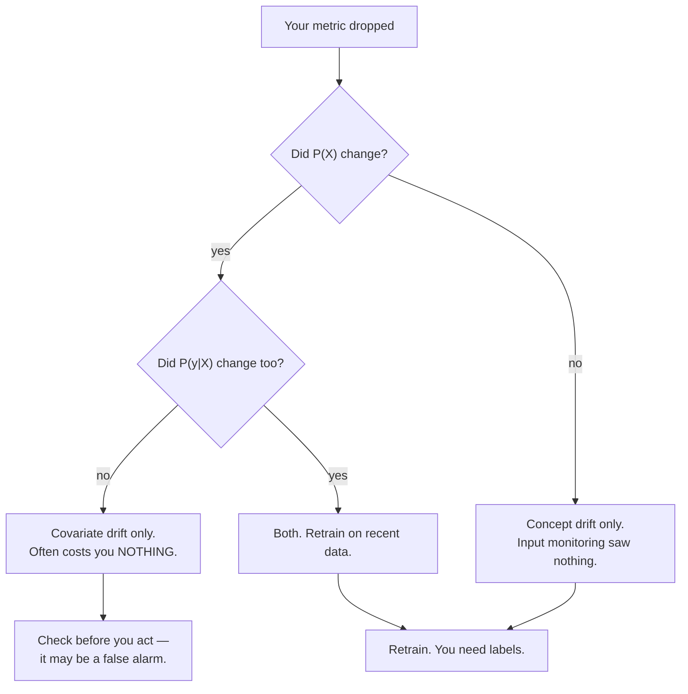

## What you'll learn

- the three drift types, stated precisely enough to tell apart
- the measurement that matters: input monitoring is **neither necessary nor sufficient**
- PSI and the KS statistic, with the shift each one needs before it notices
- why a label lag makes your accuracy dashboard a **picture of the past**
- what to actually monitor, in what order, and what to do when it fires

## Three kinds of drift

The vocabulary gets used loosely, which is why teams end up applying the wrong fix. Stated as
distributions, the distinction is exact.

Your model learned to approximate $P(y \mid X)$ from a training sample of $P(X)$. Two things can
change independently:

**Covariate drift** (also data drift): $P(X)$ changes, $P(y \mid X)$ does not.
Your users get younger, a sensor recalibrates, a new marketing channel brings different traffic. The
relationship you learned is still true — you are just seeing different inputs.

**Concept drift**: $P(y \mid X)$ changes. The relationship itself moved. Fraud tactics evolve, a
competitor changes prices, a pandemic changes what "normal shopping" means. The same input should now
produce a different answer.

**Performance drift**: your metric got worse. This is a *symptom*, not a cause, and it is the only
one of the three that directly matters.



## The measurement that matters

Here is the standard advice: monitor your input distributions, alert when they shift, retrain when
they do. It is cheap and requires no labels, which is why everyone recommends it.

Now here is what it actually catches. One model, trained on a fixed boundary. Three scenarios, each
2,000 live rows:

| Scenario | Accuracy on live data | Input PSI |
| --- | --- | --- |
| No drift | 0.9980 | 0.0034 |
| **Covariate shift** — $P(X)$ moves 1.5 sd | **0.9995** | **2.0847** |
| **Concept shift** — $P(y \mid X)$ rotates 90° | **0.4775** | **0.0053** |

<Figure
  src="/images/ml/phase-08-mlops/monitoring-model-drift/drift-types"
  alt="Two bar charts. The left shows accuracy: 0.9980 for no drift, 0.9995 for covariate shift, 0.4775 for concept shift. The right shows input PSI: 0.0034, 2.0847 and 0.0053 respectively."
  title="The alarm fires on the harmless one and stays silent on the damaging one"
  caption="Covariate shift produced a PSI of 2.0847 — eight times the conventional 'large drift' threshold — while accuracy went UP slightly to 0.9995. Concept shift produced a PSI of 0.0053, well inside 'stable', while accuracy fell to 0.4775, worse than a coin flip."
/>

Read those two rows again.

**Covariate shift set off a screaming alarm and cost nothing.** PSI 2.0847 against a conventional
"large drift" threshold of 0.25 — and accuracy was 0.9995, marginally *better* than the no-drift
case. Because $P(y \mid X)$ never changed, the model was still right about the new inputs. Retraining
here would have been work for no benefit, and if you had auto-retrained on a small recent window you
might well have made things worse.

**Concept shift was invisible and halved accuracy.** PSI 0.0053 — as stable as the no-drift
baseline — while the model fell to 0.4775. Every input looked exactly as expected. The *answers*
changed.

So the honest conclusion: **input drift monitoring is neither necessary nor sufficient for detecting
performance loss.** It is still worth having — it is cheap, label-free and catches broken upstream
pipelines fast — but it is a smoke detector in one room of the house, and you should not describe it
as fire safety.

## What the statistics can see

Two standard tests for "has this distribution moved?"

**Population Stability Index.** Bin the reference sample (usually deciles), compute the proportion
of each sample in each bin, and sum a symmetrised log-ratio:

$$
\mathrm{PSI} = \sum_{i=1}^{B} \big(c_i - r_i\big)\,\ln\!\frac{c_i}{r_i}
$$

where $r_i$ and $c_i$ are the reference and current proportions in bin $i$. The conventional read is
$< 0.1$ stable, $0.1$–$0.25$ moderate, $> 0.25$ large. Those thresholds are convention, not theory.

**Kolmogorov-Smirnov statistic.** The largest vertical gap between the two empirical CDFs:

$$
D = \sup_x \big| F_{\text{ref}}(x) - F_{\text{cur}}(x) \big|
$$

It comes with a p-value, which is both its advantage and its trap.

Measured against a known shift, 4,000 reference rows against 2,000 current:

| Shift in the mean | PSI | KS | KS p-value |
| --- | --- | --- | --- |
| 0.00 sd | 0.0056 | 0.0288 | 0.22 |
| 0.05 sd | 0.0134 | 0.0437 | 0.012 |
| 0.10 sd | 0.0338 | 0.0813 | 4.4e-08 |
| 0.20 sd | 0.0507 | 0.0998 | 5.6e-12 |
| 0.30 sd | 0.0998 | 0.1298 | 5.5e-20 |
| **0.50 sd** | **0.2723** | 0.2125 | 3.8e-53 |
| 0.75 sd | 0.5899 | 0.3040 | 3.1e-109 |
| 1.00 sd | 0.9555 | 0.3837 | 1.3e-175 |

<Figure
  src="/images/ml/phase-08-mlops/monitoring-model-drift/psi-sensitivity"
  alt="Two rising curves of PSI and the KS statistic against shift magnitude, with dashed horizontal lines at PSI 0.10 and 0.25, and a vertical marker where PSI crosses 0.25 at a 0.5 standard deviation shift."
  title="Neither statistic notices a small shift, and both scream at a large one"
  caption="PSI crosses the conventional 0.25 'act now' line at a 0.5 standard deviation shift. Below 0.2 sd both statistics stay near the floor. Note the KS p-value column in the table: at a 0.10 sd shift it is already 4.4e-08 — overwhelmingly significant, and almost certainly not worth acting on."
/>

That p-value column is the trap. **With enough rows, the KS test rejects any shift.** At 0.10 sd the
p-value is $4.4 \times 10^{-8}$ — a shift so small that it almost certainly does not affect your
model, reported as one of the most statistically significant results you will ever see. Use the
*statistic*, not the p-value, and set the threshold from what your model actually tolerates.

## Your dashboard is a picture of the past

The one thing worth monitoring above all others is actual performance. The problem is that
performance requires labels, and labels arrive late — sometimes very late.

- Fraud: days to weeks, until a chargeback lands.
- Churn: a month or a quarter, by definition.
- Loan default: months to years.
- Ad clicks: minutes. (This is the lucky case, and it is why ad-tech monitoring looks so different.)

Here is what a 30-day label lag does. Concept drift begins on day 20 and ramps up:

| Day | True accuracy today | What your dashboard shows | Input PSI |
| --- | --- | --- | --- |
| 0 | 0.9980 | — | 0.0054 |
| 20 | 0.9930 | — | 0.0081 |
| 30 | 0.9170 | 0.9980 | 0.0096 |
| 40 | 0.8400 | 0.9950 | 0.0107 |
| 50 | 0.7540 | 0.9930 | 0.0244 |
| **60** | **0.6460** | **0.9170** | 0.0089 |
| 70 | 0.5560 | 0.8400 | 0.0120 |
| 80 | 0.4780 | 0.7540 | 0.0079 |

<Figure
  src="/images/ml/phase-08-mlops/monitoring-model-drift/detection-delay"
  alt="Three lines over 90 days. A red line for true accuracy falls from 1.0 to below 0.5; a blue line for dashboard accuracy traces the same shape shifted 30 days right; a grey PSI line stays flat near zero throughout."
  title="Concept drift: invisible to inputs, and 30 days stale in the metrics"
  caption="Drift starts on day 20. On day 60 the model is really at 0.6460 while the dashboard, working from labels that are 30 days old, still reports 0.9170. Meanwhile input PSI never leaves the floor — it stays under 0.025 for the entire 90 days."
/>

On day 60 the model is at **0.6460** and your dashboard says **0.9170**. Input monitoring says
everything is fine, because for concept drift it genuinely cannot say otherwise. You are running a
substantially broken model with two green lights.

This is not an argument against monitoring. It is an argument for knowing the **latency of each
signal** you rely on:

| Signal | Needs labels | Latency | Catches |
| --- | --- | --- | --- |
| Input distributions | no | minutes | Broken pipelines, covariate shift |
| Prediction distributions | no | minutes | Both drift types, indirectly |
| Proxy outcomes | partly | hours to days | Some concept drift, early |
| Actual performance | **yes** | days to months | Everything, eventually |

## See it move

```p5 title="A boundary that stops matching the data" desc="The true decision boundary rotates while the deployed model's boundary stays where it was trained. Accuracy falls, but the point cloud itself never changes shape — which is why input monitoring sees nothing." height="360"
let pts = [];
let angle = 0, t = 0;
const TRAIN_ANGLE = -Math.PI / 4;   // where the model was fitted
const N = 260;

function build() {
  pts = [];
  for (let i = 0; i < N; i++) {
    pts.push({ x: randomGaussian(0, 1), y: randomGaussian(0, 1) });
  }
  angle = TRAIN_ANGLE;
  t = 0;
}
function setup() { createCanvas(600, 360); textFont("monospace"); build(); }
function side(p, a) { return p.x * Math.cos(a) + p.y * Math.sin(a) > 0; }
function draw() {
  background(13, 17, 23);
  const cx = 210, cy = 175, S = 62;

  // count agreement between the true boundary and the frozen model boundary
  let agree = 0;
  for (const p of pts) if (side(p, angle) === side(p, TRAIN_ANGLE)) agree++;
  const acc = agree / pts.length;

  // points, coloured by the TRUE label
  noStroke();
  for (const p of pts) {
    const truth = side(p, angle);
    const pred = side(p, TRAIN_ANGLE);
    if (truth === pred) fill(truth ? color(75, 139, 190, 200) : color(120, 200, 120, 200));
    else fill(232, 110, 110, 235);
    ellipse(cx + p.x * S, cy - p.y * S, truth === pred ? 6 : 8, truth === pred ? 6 : 8);
  }

  // the model's frozen boundary
  const drawLine = (a, col, w) => {
    stroke(col); strokeWeight(w);
    const dx = -Math.sin(a) * 150, dy = Math.cos(a) * 150;
    line(cx - dx, cy + dy, cx + dx, cy - dy);
  };
  drawLine(TRAIN_ANGLE, color(255, 211, 67), 2.6);
  drawLine(angle, color(180, 190, 205), 1.6);

  // readouts
  noStroke();
  fill(255, 211, 67); textSize(12); textAlign(LEFT, TOP);
  text("model boundary (frozen at training)", 400, 40);
  fill(180, 190, 205);
  text("true boundary (drifting)", 400, 60);
  fill(232, 110, 110);
  text("red = model now wrong here", 400, 80);

  fill(107, 169, 221); textSize(15);
  text("accuracy  " + acc.toFixed(4), 400, 130);
  fill(150); textSize(11);
  text("drift so far  " + Math.round(degrees(angle - TRAIN_ANGLE)) + "°", 400, 155);

  // the point cloud never changes -> input monitoring stays flat
  fill(45, 52, 63); rect(400, 200, 170, 14, 3);
  fill(120, 200, 120); rect(400, 200, 8, 14, 3);
  fill(150); textSize(10); textAlign(LEFT, TOP);
  text("input PSI: still ~0.00", 400, 220);
  text("P(X) never moved — only", 400, 238);
  text("P(y|X) did.", 400, 252);

  fill(140); textSize(10); textAlign(LEFT, BOTTOM);
  text("click to resample the points", 16, height - 12);

  t++;
  if (t % 2 === 0 && angle < TRAIN_ANGLE + Math.PI / 2) angle += 0.004;
  if (angle >= TRAIN_ANGLE + Math.PI / 2 && t % 400 === 0) build();
}
function mousePressed() { build(); }
```

Watch the two indicators on the right. Accuracy slides from 1.0000 toward 0.5 as the grey line
rotates away from the amber one, and the PSI bar never moves — because the cloud of points is
identical throughout. Nothing about the *inputs* changed. Only the correct answer did.

## Prediction drift: the cheap middle ground

The most under-used signal is the distribution of your model's own **output**. It needs no labels,
arrives immediately, and unlike input monitoring it responds to concept drift — because when the
relationship changes, the mix of predictions usually changes with it.

If your fraud model flagged 2.1% of transactions every day for six months and today it flags 7.4%,
something happened. You do not know what, and you do not need labels to know it is worth looking at.

```python title="monitor.py" showLineNumbers{1}
import numpy as np


def psi(reference, current, bins=10):
    """Population Stability Index, binned on the reference deciles."""
    edges = np.quantile(reference, np.linspace(0, 1, bins + 1))
    edges[0], edges[-1] = -np.inf, np.inf
    ref = np.clip(np.histogram(reference, edges)[0] / len(reference), 1e-6, None)
    cur = np.clip(np.histogram(current, edges)[0] / len(current), 1e-6, None)
    return float(((cur - ref) * np.log(cur / ref)).sum())


def daily_report(reference_X, reference_pred, live_X, live_pred, feature_names):
    """Everything you can compute today, with no labels at all."""
    report = {"n_live": len(live_X), "features": {}}

    for j, name in enumerate(feature_names):
        report["features"][name] = {
            "psi": round(psi(reference_X[:, j], live_X[:, j]), 4),
            "mean_shift_sd": round(
                float((live_X[:, j].mean() - reference_X[:, j].mean())
                      / reference_X[:, j].std()), 3),
            "null_rate": round(float(np.isnan(live_X[:, j]).mean()), 4),
        }

    # The signal that responds to concept drift without needing labels.
    report["prediction_psi"] = round(psi(reference_pred, live_pred), 4)
    report["positive_rate"] = round(float((live_pred >= 0.5).mean()), 4)
    report["reference_positive_rate"] = round(float((reference_pred >= 0.5).mean()), 4)
    return report
```

Note `mean_shift_sd`. Reporting a raw mean change is useless across features with different units;
dividing by the training standard deviation makes "this feature moved 0.4 sd" comparable everywhere.

## Thresholds and what to do

Alerting on every statistically significant change means alerting constantly. Alert on changes big
enough to matter.

| Signal | Investigate | Act |
| --- | --- | --- |
| Feature PSI | > 0.10 | > 0.25, **and** the feature matters to the model |
| Feature mean shift | > 0.5 sd | > 1.0 sd |
| Null rate | Any increase | > 2× baseline — usually an upstream break |
| Prediction PSI | > 0.10 | > 0.25 |
| Positive rate | ±20% relative | ±50% relative |
| Actual performance | Any sustained decline | Below the agreed floor |

Two qualifiers on that table. **"And the feature matters"** does real work — a PSI of 0.4 on a
feature with near-zero importance is not worth a retrain. And **"sustained"** matters because a
single bad day is usually a bad day, not drift.

When an alarm fires, in order:

1. **Is the pipeline broken?** A null rate jumping to 40% is an upstream bug, not drift. Check this
   first; it is the most common cause and the fastest to fix.
2. **Which drift is it?** If performance is unchanged, you may have covariate drift that costs
   nothing — measured at PSI 2.08 with accuracy 0.9995. Verify before acting.
3. **Do you have labels?** Without them you cannot confirm a performance drop, only suspect one.
4. **Retrain on recent data.** For concept drift this is the only real fix. Consider weighting recent
   rows more heavily.
5. **Roll back if the retrain is worse.** Which requires that you
   [versioned the artefact](/machine-learning/phase-08---model-deployment-mlops/saving-and-loading-models-pickle-joblib/).

## In code

Reproducing the central measurement:

```python title="drift_types.py" showLineNumbers{1}
import numpy as np
from sklearn.linear_model import LogisticRegression

TRAIN_ANGLE = 45.0


def stream(n, angle_deg=TRAIN_ANGLE, shift=0.0, seed=1):
    """shift moves P(X); angle_deg moves P(y|X). Independently."""
    rng = np.random.default_rng(seed)
    X = rng.normal(shift, 1, (n, 2))
    a = np.radians(angle_deg)
    w = np.array([np.cos(a), np.sin(a)])
    return X, (X @ w > 0).astype(int)


X_tr, y_tr = stream(4000, seed=1)
model = LogisticRegression().fit(X_tr, y_tr)

for name, (X_live, y_live) in [
    ("no drift        ", stream(2000, seed=2)),
    ("covariate shift ", stream(2000, shift=1.5, seed=3)),
    ("concept shift   ", stream(2000, angle_deg=TRAIN_ANGLE + 90, seed=4)),
]:
    print(f"{name} accuracy {model.score(X_live, y_live):.4f}   "
          f"PSI {psi(X_tr[:, 0], X_live[:, 0]):.4f}")

# no drift         accuracy 0.9980   PSI 0.0034
# covariate shift  accuracy 0.9995   PSI 2.0847      <- alarm, no damage
# concept shift    accuracy 0.4775   PSI 0.0053      <- damage, no alarm
```

Scheduled retraining, which handles most drift without any detection at all:

```python title="scheduled_retrain.py" showLineNumbers{1}
def should_promote(candidate, incumbent, X_recent, y_recent, margin=0.005):
    """Only replace the live model if the challenger is genuinely better."""
    cand = candidate.score(X_recent, y_recent)
    inc = incumbent.score(X_recent, y_recent)
    print(f"candidate {cand:.4f} vs incumbent {inc:.4f}")
    return cand > inc + margin
```

The `margin` is what stops you shipping a new model every week on noise. And note that the
comparison is on **recent** data — scoring both on the original test set would tell you which model
is better at the world as it used to be.

## Pitfalls

**Treating input drift as a performance proxy.** Measured: PSI 2.0847 with accuracy 0.9995, and PSI
0.0053 with accuracy 0.4775. It is neither necessary nor sufficient.

**Alerting on KS p-values.** At 4,000 rows a 0.10 sd shift gives $p = 4.4 \times 10^{-8}$. Use the
statistic and a threshold you chose.

**Forgetting the label lag.** On day 60 the true accuracy was 0.6460 and the dashboard said 0.9170.
Know the latency of every signal you trust.

**Auto-retraining on every alarm.** The covariate-shift case would have triggered a retrain that
bought nothing, on a possibly-small recent window.

**Not monitoring predictions.** It is label-free, immediate, and unlike input monitoring it responds
to concept drift.

**Alerting on a single bad day.** Require the decline to be sustained, or you will train yourself to
ignore the alerts.

**Monitoring drift without knowing feature importance.** A large PSI on an unimportant feature is
noise; a moderate PSI on your top feature is not.

## Recap

- $P(X)$ moving is **covariate drift**; $P(y \mid X)$ moving is **concept drift**; the metric moving
  is a symptom.
- **Input monitoring is neither necessary nor sufficient**: PSI 2.0847 with accuracy 0.9995, and PSI
  0.0053 with accuracy 0.4775.
- PSI crosses the conventional 0.25 threshold at a **0.5 sd** shift. Use the statistic, never the KS
  p-value.
- A 30-day label lag meant a true accuracy of **0.6460** displayed as **0.9170**.
- **Prediction distributions** are the cheap middle ground — label-free, immediate, and sensitive to
  concept drift.
- Check the pipeline first, confirm which drift it is, then retrain on recent data with a promotion
  margin.
- Scheduled retraining solves most drift without needing to detect anything.

<Quiz
  questions={[
    {
      q: "Input PSI on your top feature jumps to 2.08 and stays there. What should you do first?",
      options: [
        "Retrain immediately on recent data",
        "Check whether performance actually changed — the measured case had PSI 2.08 with accuracy 0.9995",
        "Roll back to the previous model",
        "Increase the PSI threshold",
      ],
      answer: 1,
      explain: "Pure covariate shift can produce an enormous PSI and cost nothing, because P(y|X) is unchanged and the model is still right about the new inputs. Confirm the damage before spending a retrain — and before risking a worse model fitted to a small recent window.",
    },
    {
      q: "Your model's accuracy has halved but every input PSI is under 0.01. What kind of drift is this?",
      options: [
        "Covariate drift",
        "Concept drift — P(y|X) changed while P(X) did not, which input monitoring cannot see",
        "A broken data pipeline",
        "Overfitting",
      ],
      answer: 1,
      explain: "That is exactly the measured concept-shift case: PSI 0.0053 with accuracy 0.4775. The inputs look completely normal because they ARE completely normal — it is the correct answer for those inputs that changed. Only labels or a proxy outcome reveal it.",
    },
    {
      q: "A KS test on 4,000 rows returns p = 4.4e-08 for a 0.10 standard deviation shift. Should you alert?",
      options: [
        "Yes, that is overwhelmingly significant",
        "No — with enough rows any shift is significant. Use the statistic (0.0813 here) against a threshold you chose",
        "Yes, but only if PSI agrees",
        "Only if the p-value is below 1e-10",
      ],
      answer: 1,
      explain: "Statistical significance answers 'did anything change?', which at scale is always yes. The question you care about is 'did it change enough to hurt my model?' — and that needs an effect size compared against a tolerance you set deliberately.",
    },
    {
      q: "Labels for your churn model arrive 30 days late. What does your accuracy dashboard actually show?",
      options: [
        "Current accuracy",
        "Accuracy as it was 30 days ago — the measured example showed 0.9170 while the true figure was 0.6460",
        "An average of the last 30 days",
        "Nothing useful at all",
      ],
      answer: 1,
      explain: "You can only score predictions whose outcomes are known, so the dashboard necessarily lags by the label latency. It is still the most trustworthy signal you have — you just have to know how old it is, and pair it with something faster.",
    },
    {
      q: "Which signal is label-free, immediate, AND sensitive to concept drift?",
      options: [
        "Input feature distributions",
        "The distribution of the model's own predictions",
        "Training-set accuracy",
        "Cross-validation scores",
      ],
      answer: 1,
      explain: "Input monitoring is label-free and immediate but blind to concept drift. Prediction monitoring is also label-free and immediate, and when the relationship changes the mix of outputs usually changes too. It is the most under-used signal in production ML.",
    },
  ]}
/>

## 🧪 Try It Yourself

### Exercise 1 – Implement PSI

<DataCampExercise
  lang="python"
  hint={`Bin on the reference quantiles, then sum (cur - ref) * log(cur / ref) across the bins.`}
  code={`# Task: Exercise 1 - Implement PSI
import numpy as np

def psi(reference, current, bins=10):
    edges = np.quantile(reference, np.linspace(0, 1, bins + 1))
    edges[0], edges[-1] = -np.inf, np.inf
    ref = np.clip(np.histogram(reference, edges)[0] / len(reference), 1e-6, None)
    cur = np.clip(np.histogram(current, edges)[0] / len(current), 1e-6, None)
    return float(((cur - ref) * np.___(cur / ref)).sum())   # replace ___ with log

rng = np.random.default_rng(0)
ref = rng.normal(0, 1, 4000)
for shift in (0.0, 0.1, 0.3, 0.5, 1.0):
    print(f"shift {shift:.1f} sd -> PSI {psi(ref, rng.normal(shift, 1, 2000)):.4f}")

# -- Expected Output -------------------------------------------
# shift 0.0 sd -> PSI 0.0056
# shift 0.1 sd -> PSI 0.0191
# shift 0.3 sd -> PSI 0.1393
# shift 0.5 sd -> PSI 0.2555
# shift 1.0 sd -> PSI 0.9660
# --------------------------------------------------------------`}
  solution={`import numpy as np

def psi(reference, current, bins=10):
    edges = np.quantile(reference, np.linspace(0, 1, bins + 1))
    edges[0], edges[-1] = -np.inf, np.inf
    ref = np.clip(np.histogram(reference, edges)[0] / len(reference), 1e-6, None)
    cur = np.clip(np.histogram(current, edges)[0] / len(current), 1e-6, None)
    return float(((cur - ref) * np.log(cur / ref)).sum())

rng = np.random.default_rng(0)
ref = rng.normal(0, 1, 4000)
for shift in (0.0, 0.1, 0.3, 0.5, 1.0):
    print(f"shift {shift:.1f} sd -> PSI {psi(ref, rng.normal(shift, 1, 2000)):.4f}")`}
  sct={`test_output_contains("shift 0.5 sd -> PSI 0.2555")
success_msg("A 0.5 sd shift is where PSI crosses the conventional 0.25 'act' line.")`}
  height={270}
/>

### Exercise 2 – Separate the two drift types

<DataCampExercise
  lang="python"
  preExerciseCode={`import numpy as np

def psi(reference, current, bins=10):
    edges = np.quantile(reference, np.linspace(0, 1, bins + 1))
    edges[0], edges[-1] = -np.inf, np.inf
    ref = np.clip(np.histogram(reference, edges)[0] / len(reference), 1e-6, None)
    cur = np.clip(np.histogram(current, edges)[0] / len(current), 1e-6, None)
    return float(((cur - ref) * np.log(cur / ref)).sum())
`}
  hint={`shift moves the distribution of X; angle rotates the labelling rule. Change one at a time.`}
  code={`# Task: Exercise 2 - Separate the two drift types
import numpy as np
from sklearn.linear_model import LogisticRegression

# psi() from Exercise 1 is provided for you.

TRAIN_ANGLE = 45.0

def stream(n, angle_deg=TRAIN_ANGLE, shift=0.0, seed=1):
    rng = np.random.default_rng(seed)
    X = rng.normal(shift, 1, (n, 2))
    a = np.radians(angle_deg)
    w = np.array([np.cos(a), np.sin(a)])
    return X, (X @ w > 0).astype(int)

X_tr, y_tr = stream(4000, seed=1)
model = LogisticRegression().fit(X_tr, y_tr)

for name, (Xl, yl) in [
    ("no drift       ", stream(2000, seed=2)),
    ("covariate shift", stream(2000, shift=1.5, seed=3)),
    ("concept shift  ", stream(2000, angle_deg=TRAIN_ANGLE + ___, seed=4)),
]:                                            # replace ___ with 90
    print(f"{name} acc {model.score(Xl, yl):.4f}   PSI {psi(X_tr[:,0], Xl[:,0]):.4f}")

# -- Expected Output -------------------------------------------
# no drift        acc 0.9980   PSI 0.0034
# covariate shift acc 0.9995   PSI 2.0847
# concept shift   acc 0.4775   PSI 0.0053
# --------------------------------------------------------------`}
  solution={`import numpy as np
from sklearn.linear_model import LogisticRegression

TRAIN_ANGLE = 45.0

def stream(n, angle_deg=TRAIN_ANGLE, shift=0.0, seed=1):
    rng = np.random.default_rng(seed)
    X = rng.normal(shift, 1, (n, 2))
    a = np.radians(angle_deg)
    w = np.array([np.cos(a), np.sin(a)])
    return X, (X @ w > 0).astype(int)

X_tr, y_tr = stream(4000, seed=1)
model = LogisticRegression().fit(X_tr, y_tr)
for name, (Xl, yl) in [
    ("no drift       ", stream(2000, seed=2)),
    ("covariate shift", stream(2000, shift=1.5, seed=3)),
    ("concept shift  ", stream(2000, angle_deg=TRAIN_ANGLE + 90, seed=4)),
]:
    print(f"{name} acc {model.score(Xl, yl):.4f}   PSI {psi(X_tr[:,0], Xl[:,0]):.4f}")`}
  sct={`test_output_contains("concept shift   acc 0.4775   PSI 0.0053")
success_msg("The alarm fired on the harmless change and stayed silent on the one that halved accuracy.")`}
  height={290}
/>

### Exercise 3 – Standardise the shift so features are comparable

<DataCampExercise
  lang="python"
  hint={`Divide the change in mean by the TRAINING standard deviation, not the live one.`}
  code={`# Task: Exercise 3 - Standardise the shift so features are comparable
import numpy as np

rng = np.random.default_rng(0)
# Two features with wildly different units.
ref = {"age_years": rng.normal(40, 12, 4000),
       "income_usd": rng.normal(60000, 15000, 4000)}
live = {"age_years": rng.normal(43, 12, 2000),
        "income_usd": rng.normal(61500, 15000, 2000)}

for name in ref:
    raw = live[name].mean() - ref[name].mean()
    standardised = raw / ref[name].___()      # replace ___ with std
    print(f"{name:11s} raw shift {raw:10.2f}   standardised {standardised:6.3f} sd")

# -- Expected Output -------------------------------------------
# age_years   raw shift       3.53   standardised  0.295 sd
# income_usd  raw shift    1250.16   standardised  0.083 sd
# --------------------------------------------------------------`}
  solution={`import numpy as np

rng = np.random.default_rng(0)
ref = {"age_years": rng.normal(40, 12, 4000),
       "income_usd": rng.normal(60000, 15000, 4000)}
live = {"age_years": rng.normal(43, 12, 2000),
        "income_usd": rng.normal(61500, 15000, 2000)}
for name in ref:
    raw = live[name].mean() - ref[name].mean()
    standardised = raw / ref[name].std()
    print(f"{name:11s} raw shift {raw:10.2f}   standardised {standardised:6.3f} sd")`}
  sct={`test_output_contains("standardised")
success_msg("A 1,250-dollar move sounds huge and is 0.083 sd. One threshold now works for every feature.")`}
  height={270}
/>

### Exercise 4 – Watch the dashboard lag behind reality

<DataCampExercise
  lang="python"
  preExerciseCode={`import numpy as np

TRAIN_ANGLE = 45.0

def stream(n, angle_deg=TRAIN_ANGLE, shift=0.0, seed=1):
    rng = np.random.default_rng(seed)
    X = rng.normal(shift, 1, (n, 2))
    a = np.radians(angle_deg)
    w = np.array([np.cos(a), np.sin(a)])
    return X, (X @ w > 0).astype(int)
`}
  hint={`The dashboard can only score days whose labels have arrived — that is day minus the lag.`}
  code={`# Task: Exercise 4 - Watch the dashboard lag behind reality
import numpy as np
from sklearn.linear_model import LogisticRegression

# stream() from Exercise 2 is provided for you.

TRAIN_ANGLE, LAG = 45.0, 30
X_tr, y_tr = stream(4000, seed=1)
model = LogisticRegression().fit(X_tr, y_tr)

def angle(day):
    return TRAIN_ANGLE + (0.0 if day < 20 else min((day - 20) * 1.5, 90.0))

for day in (0, 30, 60, 80):
    Xd, yd = stream(1000, angle_deg=angle(day), seed=100 + day)
    seen_day = day - ___                      # replace ___ with LAG
    if seen_day < 0:
        shown = "  n/a "
    else:
        Xs, ys = stream(1000, angle_deg=angle(seen_day), seed=100 + seen_day)
        shown = f"{model.score(Xs, ys):.4f}"
    print(f"day {day:2d}: really {model.score(Xd, yd):.4f}   dashboard shows {shown}")

# -- Expected Output -------------------------------------------
# day  0: really 0.9980   dashboard shows   n/a 
# day 30: really 0.9170   dashboard shows 0.9980
# day 60: really 0.6460   dashboard shows 0.9170
# day 80: really 0.4780   dashboard shows 0.7540
# --------------------------------------------------------------`}
  solution={`import numpy as np
from sklearn.linear_model import LogisticRegression

TRAIN_ANGLE, LAG = 45.0, 30
X_tr, y_tr = stream(4000, seed=1)
model = LogisticRegression().fit(X_tr, y_tr)

def angle(day):
    return TRAIN_ANGLE + (0.0 if day < 20 else min((day - 20) * 1.5, 90.0))

for day in (0, 30, 60, 80):
    Xd, yd = stream(1000, angle_deg=angle(day), seed=100 + day)
    seen_day = day - LAG
    if seen_day < 0:
        shown = "  n/a "
    else:
        Xs, ys = stream(1000, angle_deg=angle(seen_day), seed=100 + seen_day)
        shown = f"{model.score(Xs, ys):.4f}"
    print(f"day {day:2d}: really {model.score(Xd, yd):.4f}   dashboard shows {shown}")`}
  sct={`test_output_contains("day 60: really 0.6460   dashboard shows 0.9170")
success_msg("A 0.271 gap between reality and your dashboard, and nothing on the input side to warn you.")`}
  height={290}
/>

### Exercise 5 – Promote only on a real improvement

<DataCampExercise
  lang="python"
  hint={`Score both models on RECENT data and require the challenger to clear a margin.`}
  code={`# Task: Exercise 5 - Promote only on a real improvement
MARGIN = 0.005

def should_promote(candidate_score, incumbent_score, margin=MARGIN):
    """A challenger has to be better by more than the noise floor."""
    return candidate_score > incumbent_score + ___    # replace ___ with margin

cases = [
    ("clear win        ", 0.9120, 0.8650),
    ("noise            ", 0.8672, 0.8650),
    ("exactly at margin", 0.8700, 0.8650),
    ("worse            ", 0.8400, 0.8650),
]
for label, cand, inc in cases:
    verdict = "PROMOTE" if should_promote(cand, inc) else "keep incumbent"
    print(f"{label} candidate {cand:.4f} vs {inc:.4f} -> {verdict}")

# -- Expected Output -------------------------------------------
# clear win         candidate 0.9120 vs 0.8650 -> PROMOTE
# noise             candidate 0.8672 vs 0.8650 -> keep incumbent
# exactly at margin candidate 0.8700 vs 0.8650 -> keep incumbent
# worse             candidate 0.8400 vs 0.8650 -> keep incumbent
# --------------------------------------------------------------`}
  solution={`MARGIN = 0.005

def should_promote(candidate_score, incumbent_score, margin=MARGIN):
    return candidate_score > incumbent_score + margin

cases = [
    ("clear win        ", 0.9120, 0.8650),
    ("noise            ", 0.8672, 0.8650),
    ("exactly at margin", 0.8700, 0.8650),
    ("worse            ", 0.8400, 0.8650),
]
for label, cand, inc in cases:
    verdict = "PROMOTE" if should_promote(cand, inc) else "keep incumbent"
    print(f"{label} candidate {cand:.4f} vs {inc:.4f} -> {verdict}")`}
  sct={`test_output_contains("noise             candidate 0.8672 vs 0.8650 -> keep incumbent")
success_msg("Without the margin you ship a new model every week on noise, and each one is a fresh chance to break production.")`}
  height={290}
/>

### Exercise 6 – Implement PSI and calibrate your intuition

<DataCampExercise
  lang="python"
  hint={`PSI sums (actual - expected) * log(actual / expected) over bins cut at the reference distribution's quantiles.`}
  code={`# Task: Exercise 6 - Implement PSI and calibrate your intuition
import numpy as np


def psi(expected, actual, bins=10):
    edges = np.quantile(expected, np.linspace(0, 1, bins + 1))
    edges[0], edges[-1] = -np.inf, np.inf
    e = np.histogram(expected, edges)[0] / len(expected)
    a = np.histogram(actual, edges)[0] / len(actual)
    e = np.clip(e, 1e-6, None)
    a = np.clip(a, 1e-6, None)
    return float(((a - e) * np.___(a / e)).sum())      # replace ___ with log


rng = np.random.default_rng(5)
reference = rng.normal(0, 1, 5000)
print(f"{'scenario':>26} {'PSI':>8} {'verdict':>10}")
for name, sample in (
    ("same distribution", rng.normal(0, 1, 5000)),
    ("mean shifted 0.2 sd", rng.normal(0.2, 1, 5000)),
    ("mean shifted 1.0 sd", rng.normal(1.0, 1, 5000)),
    ("variance halved", rng.normal(0, 0.5, 5000)),
    ("units changed (x100)", rng.normal(0, 1, 5000) * 100),
):
    value = psi(reference, sample)
    if value < 0.1:
        verdict = "stable"
    elif value < 0.25:
        verdict = "watch"
    else:
        verdict = "investigate"
    print(f"{name:>26} {value:8.4f} {verdict:>10}")
print("PSI answers 'did the input change', never 'is the model still right'")

# -- Expected Output -------------------------------------------
#                   scenario      PSI    verdict
#          same distribution   0.0036     stable
#        mean shifted 0.2 sd   0.0269     stable
#        mean shifted 1.0 sd   0.8811 investigate
#            variance halved   0.9148 investigate
#       units changed (x100)   4.8541 investigate
# PSI answers 'did the input change', never 'is the model still right'
# --------------------------------------------------------------`}
  solution={`import numpy as np


def psi(expected, actual, bins=10):
    edges = np.quantile(expected, np.linspace(0, 1, bins + 1))
    edges[0], edges[-1] = -np.inf, np.inf
    e = np.histogram(expected, edges)[0] / len(expected)
    a = np.histogram(actual, edges)[0] / len(actual)
    e = np.clip(e, 1e-6, None)
    a = np.clip(a, 1e-6, None)
    return float(((a - e) * np.log(a / e)).sum())


rng = np.random.default_rng(5)
reference = rng.normal(0, 1, 5000)
print(f"{'scenario':>26} {'PSI':>8} {'verdict':>10}")
for name, sample in (
    ("same distribution", rng.normal(0, 1, 5000)),
    ("mean shifted 0.2 sd", rng.normal(0.2, 1, 5000)),
    ("mean shifted 1.0 sd", rng.normal(1.0, 1, 5000)),
    ("variance halved", rng.normal(0, 0.5, 5000)),
    ("units changed (x100)", rng.normal(0, 1, 5000) * 100),
):
    value = psi(reference, sample)
    if value < 0.1:
        verdict = "stable"
    elif value < 0.25:
        verdict = "watch"
    else:
        verdict = "investigate"
    print(f"{name:>26} {value:8.4f} {verdict:>10}")
print("PSI answers 'did the input change', never 'is the model still right'")`}
  sct={`test_output_contains("4.8541")
success_msg("The 0.1 and 0.25 thresholds are industry convention, and this table is how you should calibrate them for your own features: a 0.2 sd shift reads 0.0269 (invisible), a units change reads 4.8541 (unmissable). Neither number says anything about accuracy — that requires labels.")`}
  height={370}
/>

## Next

That completes Phase 8 and the module. Go back to the
[phase overview](/machine-learning/phase-08---model-deployment-mlops/phase-8---model-deployment-mlops/)
for the practice project, or return to the
[Machine Learning landing page](/machine-learning/machine-learning/) to see how the twelve phases fit
together.
