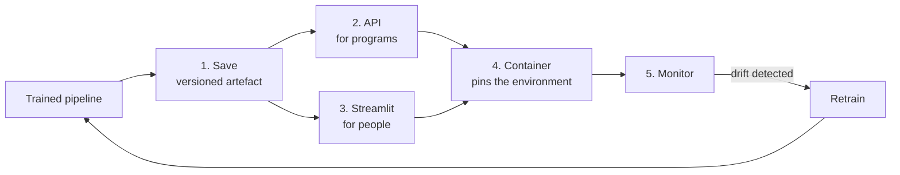

import Quiz from "../../../../components/Quiz.astro";

A model in a notebook helps nobody. It starts paying off the moment something else can call it — and
it starts *decaying* the moment it is deployed.

That combination is what makes this phase different from the seven before it. Everywhere else, a
mistake shows up as a worse number on a held-out set. Here, every characteristic failure is silent:
correctly typed, correctly shaped, normal latency, no exception, no alert.

## What this phase covers

| # | Page | The job | The silent failure it prevents |
| --- | --- | --- | --- |
| 1 | [Saving and Loading Models](/machine-learning/phase-08---model-deployment-mlops/saving-and-loading-models-pickle-joblib/) | Persist the artefact | Dropping the scaler: **0.9591 → 0.3743** |
| 2 | [Building an ML API](/machine-learning/phase-08---model-deployment-mlops/building-an-ml-api-with-flask-fastapi/) | Serve it over HTTP | Bare arrays, so a column reorder never errors |
| 3 | [Deploying to Streamlit](/machine-learning/phase-08---model-deployment-mlops/deploying-ml-models-to-streamlit/) | Serve it to a human | Reloading **1,307 KB** on every click |
| 4 | [Dockerizing](/machine-learning/phase-08---model-deployment-mlops/dockerizing-an-ml-application/) | Pin the whole environment | Shipping **1,693 MB** instead of **190 MB** |
| 5 | [Monitoring Model Drift](/machine-learning/phase-08---model-deployment-mlops/monitoring-model-drift/) | Notice when it stops working | True accuracy **0.6460**, dashboard **0.9170** |

## The four measured failures

Each of these is a number produced by code in this phase, and each one happens without any error
being raised.

**Saving the estimator without its preprocessing.** Test accuracy fell from **0.9591 to 0.3743** —
below a coin flip. The estimator received features whose means were in the hundreds where it expected
values near zero, and returned confident nonsense.

**Reloading the model on every interaction.** A 500-tree forest is **1,307 KB** and several thousand
NumPy arrays. In a Streamlit app without `@st.cache_resource`, that is rebuilt every time somebody
nudges a slider.

**Shipping the research environment.** A scikit-learn serving stack measures **190 MB** installed.
The same environment with pandas, matplotlib and TensorFlow measures **1,693 MB** — **8.9× heavier**,
per image, per pull, per node.

**Trusting your monitoring.** Under concept drift with a 30-day label lag, true accuracy on day 60
was **0.6460** while the dashboard reported **0.9170** and input PSI never rose above 0.025. Two
green lights on a substantially broken model.

## The measurement that changes how you monitor

The most useful result in this phase contradicts the standard advice. One model, three scenarios:

| Scenario | Accuracy | Input PSI |
| --- | --- | --- |
| No drift | 0.9980 | 0.0034 |
| **Covariate shift** — $P(X)$ moves | **0.9995** | **2.0847** |
| **Concept shift** — $P(y \mid X)$ moves | **0.4775** | **0.0053** |

Input drift monitoring produced a PSI **eight times** the conventional "large drift" threshold for a
change that cost nothing, and stayed inside "stable" for one that halved accuracy.

**Input drift monitoring is neither necessary nor sufficient for detecting performance loss.** Keep
it — it is cheap, needs no labels, and catches broken pipelines fast. Just do not mistake it for
knowing whether your model works.

## Before you start

- **[Transformation pipelines](/machine-learning/phase-02---data-preprocessing--feature-engineering/transformation-pipelines--custom-transformers/)** —
  page 1 rests entirely on saving the `Pipeline` rather than the estimator.
- **[Setting up the environment](/machine-learning/phase-01---the-ml-foundation/setting-up-the-ml-environment-scikit-learn-tensorflow-pytorch/)** —
  the Docker page is that argument taken to its conclusion.
- **[Cross-validation](/machine-learning/phase-07---model-optimization--tuning/k-fold-cross-validation/)** —
  the retrain-promotion decision is a model comparison, with all the same traps.
- Basic HTTP and a terminal. No Kubernetes, no cloud account, no GPU.

## What you'll be able to do afterwards

1. Persist a pipeline so that it cannot be used incorrectly, with versioning and provenance.
2. Explain why unpickling is arbitrary code execution, and when to reach for skops or ONNX instead.
3. Build a prediction API whose schema *is* the contract, with validation, batching and a real health
   check.
4. Build a Streamlit app that does not reload the model on every keystroke.
5. Write a Dockerfile whose layers cache correctly and whose image contains only what inference needs.
6. Distinguish covariate drift from concept drift, and know which one your monitoring can see.
7. Set drift thresholds from effect sizes rather than p-values.
8. Say honestly how stale each number on your dashboard is.

## How long it takes

| Activity | Time |
| --- | --- |
| Reading the five pages | 4–5 hours |
| Running the code and the 25 exercises | 4–5 hours |
| The practice project below | 6–10 hours |
| **Total** | **14–20 hours** |

## Practice project

**Deploy one model properly, then break it on purpose.**

Take any pipeline you built in an earlier phase.

**Part 1 — Persist it.** Save the whole `Pipeline` with `compress=3`, a versioned filename, and a
`.meta.json` recording library versions, seed, data snapshot and metrics. Then write the loader that
*refuses* to start on a version mismatch.

**Part 2 — Serve it.** A FastAPI service with a Pydantic request schema, bounded fields, a batch
endpoint with a cap, `model_version` in every response, and a `/health` endpoint that calls
`predict`. Load the artefact once in a `lifespan` handler.

**Part 3 — Containerise it.** A Dockerfile with dependencies copied before source, a
`requirements-serve.txt` containing only what inference imports, a `.dockerignore`, a non-root
`USER`, and a `HEALTHCHECK`. Record the image size. Then add matplotlib to the requirements and record
it again.

**Part 4 — Break it four ways.** For each, write down what you observed and how you would have
detected it in production:

| Break | Expected symptom |
| --- | --- |
| Save the estimator instead of the pipeline | Accuracy collapses, nothing errors |
| Send features in a different column order | Predictions change, nothing errors |
| Feed a feature shifted by 3 standard deviations | ? Measure it |
| Invert the labels in a fresh test set (fake concept drift) | ? Measure both accuracy and PSI |

**Part 5 — Monitor it.** Write the daily report: per-feature PSI and standardised mean shift, null
rates, prediction PSI, positive rate. Run it against your four broken cases and record which breaks
it caught and which it missed.

Part 5 is the part that teaches the most. **If your monitoring did not catch the concept-drift case,
that is the correct result** — write down what you would need in order to catch it, and how long that
signal would take to arrive.

<Quiz
  questions={[
    {
      q: "What do all four characteristic failures in this phase have in common?",
      options: [
        "They cause exceptions in production",
        "They are silent — well-formed output, normal latency, no error raised",
        "They only happen at scale",
        "They are caught by unit tests",
      ],
      answer: 1,
      explain: "Dropping the scaler, reordering columns, shipping a bloated image and trusting stale monitoring all produce a system that looks healthy. That is what makes deployment different from the earlier phases, where mistakes show up as a worse held-out score.",
    },
    {
      q: "Your input PSI alarm fires at 2.08 on your most important feature. What do you do first?",
      options: [
        "Retrain immediately",
        "Check whether performance actually moved — the measured case had PSI 2.08 with accuracy 0.9995",
        "Roll back the model",
        "Raise the threshold to stop the alarm",
      ],
      answer: 1,
      explain: "Pure covariate shift can produce an enormous PSI and cost nothing, because P(y|X) has not changed. Confirm the damage first; an unnecessary retrain on a small recent window can easily make things worse.",
    },
    {
      q: "Why does the Docker page insist on a separate requirements-serve.txt?",
      options: [
        "pip requires it",
        "The serving stack measured 190 MB against 1,693 MB for the full research environment — 8.9x heavier per image",
        "It makes the build faster",
        "It is a security requirement",
      ],
      answer: 1,
      explain: "TensorFlow alone was 1,409 MB in that measurement, in an image that never imports it. Dependencies, not your code and not the model file, are what make images large.",
    },
    {
      q: "Which page's failure mode would a load test never catch?",
      options: [
        "Reloading the model per request",
        "Saving the estimator without its preprocessing — the service is fast, stable and wrong",
        "An unbounded batch size",
        "A missing health check",
      ],
      answer: 1,
      explain: "The other three all show up under load as latency, memory exhaustion or bad routing. A pipeline missing its scaler is perfectly fast and perfectly stable; only comparing predictions against known-good ones reveals it.",
    },
  ]}
/>

## Next

Start with
[Saving and Loading Models (Pickle, Joblib)](/machine-learning/phase-08---model-deployment-mlops/saving-and-loading-models-pickle-joblib/)
— the artefact everything else in this phase depends on, and the 0.5848 accuracy drop that comes from
getting it slightly wrong.
