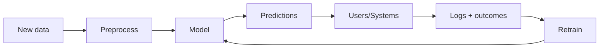

A model sitting in a Jupyter notebook doesn't help anyone. It only starts paying off
once someone else — a web app, a mobile client, a nightly batch job — can actually
call it and get a prediction back. This phase is about closing that gap: saving a
trained model to disk, wrapping it behind an API, giving it a UI, packaging it so it
runs the same way everywhere, and then watching it in production so it doesn't quietly
go stale.

## What "deployment" means in ML

Deployment is the process of making a trained model usable by real users/systems.

This usually includes:

- packaging preprocessing + model together
- exposing predictions via API or batch jobs
- monitoring data quality and model performance

## Phase 10 topics

1. Saving and Loading Models (Pickle, Joblib)
2. Building an ML API with Flask/FastAPI
3. Deploying ML Models to Streamlit
4. Dockerizing an ML Application
5. Monitoring Model Drift

## A production ML loop

:::tip[From the book]
Géron's Appendix B checklist puts it plainly: "Write monitoring code to check your
system's live performance at regular intervals and trigger alerts when it drops...
Beware of slow degradation: models tend to 'rot' as data evolves." Deployment isn't
a one-time step you finish and forget — it's the start of an ongoing loop of serving,
watching, and retraining.
:::

## Next

Start with **Saving and Loading Models (Pickle, Joblib)** — before you can serve a
model anywhere, you need a reliable way to get it out of your training script and
onto disk.
