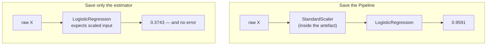
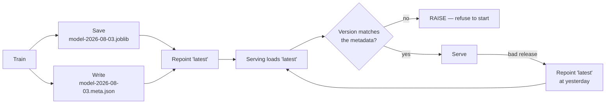

## What you'll learn

- why you save the **whole `Pipeline`**, measured: forgetting the scaler costs **0.5848** silently
- pickle against joblib, and what the difference actually is
- `compress=3` at **5.33× smaller**, and why level 9 is rarely worth it
- the provenance file that has to sit beside every artefact
- why loading a pickle is equivalent to running arbitrary code

## The failure that raises no error

Start here, because it is the mistake that survives code review.

You train a scaler and a classifier. You save the classifier. In production you load it, feed it raw
input, and it returns predictions — correctly typed, correctly shaped, no warning, no exception.

They are garbage.

| What was saved | What was fed to `predict` | Test accuracy |
| --- | --- | --- |
| The whole `Pipeline` | raw `X_test` | **0.9591** |
| Only the estimator | correctly scaled `X_test` | **0.9591** |
| Only the estimator | raw `X_test` — the bug | **0.3743** |

<Figure
  src="/images/ml/phase-08-mlops/saving-and-loading-models-pickle-joblib/pipeline-vs-bare"
  alt="Three horizontal bars. The pipeline and the correctly-scaled bare estimator both reach 0.9591; the bare estimator on raw input reaches only 0.3743, well below the dashed coin-flip line."
  title="Forgetting the scaler costs 0.5848 — and raises no error"
  caption="All three rows use the same fitted logistic regression on the same 171 test rows. The only difference is whether the 30 features were standardised before reaching it. The broken version is worse than guessing, and nothing in the code path complains."
/>

Accuracy fell from 0.9591 to **0.3743** — below the 0.5 you would get from a coin. The model is
receiving features whose means are in the hundreds where it expects values near zero, and it
responds with confident nonsense.

**Save the whole pipeline.** Not the estimator, not the estimator plus a note about the scaler — the
fitted `Pipeline` object, which carries its preprocessing with it.

```python title="save_the_pipeline.py" showLineNumbers{1}
import joblib
from sklearn.linear_model import LogisticRegression
from sklearn.pipeline import make_pipeline
from sklearn.preprocessing import StandardScaler

# YES — one object, one artefact, no way to use it wrongly.
pipe = make_pipeline(StandardScaler(), LogisticRegression(max_iter=5000))
pipe.fit(X_train, y_train)
joblib.dump(pipe, "model.joblib")

# NO — two objects, and the second one is easy to forget.
scaler = StandardScaler().fit(X_train)
model = LogisticRegression(max_iter=5000).fit(scaler.transform(X_train), y_train)
joblib.dump(model, "model.joblib")     # where did the scaler go?
```

The pipeline version is also *unusable* incorrectly: `pipe.predict(X)` takes raw features by
construction, so there is no wrong way to call it.



### See it move

```p5 title="What the estimator sees when the scaler is missing" desc="The same points, twice. On the left they arrive standardised, as the model was trained to expect. On the right they arrive raw, and the model's decision boundary is nowhere near them." height="340"
let pts = [];
let t = 0, mode = 0;   // 0 = scaled, 1 = raw
const N = 90;

function build() {
  pts = [];
  for (let i = 0; i < N; i++) {
    const cls = i % 2;
    // "raw" units: feature 1 in the hundreds, feature 2 near 20
    const rawX = 120 + (cls ? 26 : -26) + randomGaussian(0, 16);
    const rawY = 20 + (cls ? 4.5 : -4.5) + randomGaussian(0, 3.0);
    pts.push({ rawX: rawX, rawY: rawY, cls: cls });
  }
  // standardise, exactly as the fitted scaler would
  const mx = pts.reduce((s, p) => s + p.rawX, 0) / N;
  const my = pts.reduce((s, p) => s + p.rawY, 0) / N;
  const sx = Math.sqrt(pts.reduce((s, p) => s + (p.rawX - mx) ** 2, 0) / N);
  const sy = Math.sqrt(pts.reduce((s, p) => s + (p.rawY - my) ** 2, 0) / N);
  for (const p of pts) { p.zx = (p.rawX - mx) / sx; p.zy = (p.rawY - my) / sy; }
  t = 0;
}
function setup() { createCanvas(600, 340); textFont("monospace"); build(); }
function draw() {
  background(13, 17, 23);
  const cx = 250, cy = 170;

  // The model's boundary lives in STANDARDISED space: roughly z1 + z2 = 0.
  // Drawn at a fixed screen position, because that is where the model put it.
  const scale = mode === 0 ? 62 : 1.35;
  const label = mode === 0 ? "features arrive STANDARDISED (as trained)"
                           : "features arrive RAW (the bug)";

  noStroke();
  for (const p of pts) {
    const px = mode === 0 ? cx + p.zx * scale : cx + (p.rawX - 0) * scale - 120;
    const py = mode === 0 ? cy - p.zy * scale : cy - (p.rawY - 0) * scale * 4 + 90;
    fill(p.cls ? color(75, 139, 190, 215) : color(120, 200, 120, 215));
    ellipse(px, py, 8, 8);
  }

  // the model's boundary: fixed in standardised space
  stroke(255, 211, 67); strokeWeight(2.6);
  line(cx - 150, cy + 150, cx + 150, cy - 150);
  noStroke();
  fill(255, 211, 67); textSize(11); textAlign(LEFT, TOP);
  text("model boundary (learned in standardised space)", 16, 300);

  fill(mode === 0 ? color(120, 200, 120) : color(232, 110, 110));
  textSize(14); textAlign(LEFT, TOP);
  text(label, 16, 16);
  fill(150); textSize(11);
  text(mode === 0
       ? "the boundary sits between the two classes -> 0.9591"
       : "the points are off in the hundreds; the boundary is irrelevant -> 0.3743",
       16, 40);
  fill(140); textSize(10); textAlign(RIGHT, TOP);
  text("click to switch", width - 16, 16);

  t++;
  if (t % 200 === 0) mode = 1 - mode;
}
function mousePressed() { mode = 1 - mode; }
```

The amber line is the model. It was fitted in standardised space and it stays there. When raw
features arrive, the points are simply somewhere else entirely — and the model still returns a label
for every one of them.

## pickle or joblib

Both serialise a Python object graph. joblib is a wrapper around pickle with special handling for
large NumPy arrays.

The conventional advice is "use joblib for scikit-learn, it is faster and smaller". The measured
sizes on disk:

| Model | pickle | joblib (default) |
| --- | --- | --- |
| Logistic pipeline | 2.0 KB | 2.3 KB |
| 15-NN pipeline | 98.1 KB | 98.4 KB |
| Gradient boosting | 249.3 KB | 256.5 KB |
| Random forest, 500 trees | 1,268.3 KB | 1,307.4 KB |

joblib's default output is **slightly larger** in every case. On load times this machine was too
busy to give a number worth printing, but the direction was consistent: plain `pickle.load` was not
slower, and on the forest it was substantially faster.

So the folklore is not what it once was. What joblib genuinely gives you:

**Built-in compression.** One keyword, and it matters (below).

**Memory-mapping.** `joblib.load(path, mmap_mode="r")` maps large arrays from disk instead of
copying them into memory. With several worker processes serving the same model, they share one copy
of the pages instead of each holding their own — that is a real memory win, and pickle has no
equivalent.

**A stable, documented API for exactly this job.** It is what scikit-learn's own documentation uses.

Use joblib. Use it because of compression and memmap, not because of a speed claim you have not
measured.

## Compression

The forest artefact is 1.3 MB uncompressed. Trees are enormously repetitive, so they compress well:

| `compress` | Size | Ratio |
| --- | --- | --- |
| 0 (default) | 1,307.4 KB | 1.00× |
| 1 | 294.0 KB | 4.45× |
| **3** | **245.3 KB** | **5.33×** |
| 6 | 229.2 KB | 5.70× |
| 9 | 217.4 KB | 6.01× |

<Figure
  src="/images/ml/phase-08-mlops/saving-and-loading-models-pickle-joblib/format-and-compression"
  alt="Left: a log-scale bar chart comparing pickle and joblib sizes for four models, the bars nearly identical. Right: joblib compression levels for the forest, falling from 1307 KB at level 0 to 217 KB at level 9."
  title="Format barely matters; compression does"
  caption="Left: pickle and joblib differ by a few percent at every model size. Right: the same forest at five compression levels. Level 1 already captures 4.45x of the available 6.01x, and everything after level 3 is buying single-digit percentages for meaningfully more CPU."
/>

**Use `compress=3`.** Level 1 gets you 74% of the benefit for the least CPU; level 3 gets 89%;
level 9 spends a lot more time for the last 11%. In a container image or an S3 object, going from
1.3 MB to 245 KB is worth one keyword.

```python
joblib.dump(pipe, "model.joblib", compress=3)
```

## Versioning artefacts

Overwriting `model.joblib` on every train is how you end up unable to roll back. Name the file so
that a rollback is a path change.

```python title="versioned_save.py" showLineNumbers{1}
import hashlib
import json
import platform
from pathlib import Path

import joblib
import sklearn


def save_model(pipe, out_dir, version, data_snapshot, metrics, seed):
    """Write the artefact plus everything needed to explain it later."""
    out = Path(out_dir)
    out.mkdir(parents=True, exist_ok=True)

    model_path = out / f"model-{version}.joblib"
    joblib.dump(pipe, model_path, compress=3)

    digest = hashlib.sha256(model_path.read_bytes()).hexdigest()[:16]
    meta = {
        "version": version,
        "sha256_16": digest,
        "python": platform.python_version(),
        "sklearn": sklearn.__version__,
        "estimator": type(pipe[-1]).__name__ if hasattr(pipe, "__getitem__")
                     else type(pipe).__name__,
        "steps": [name for name, _ in getattr(pipe, "steps", [])],
        "data_snapshot": data_snapshot,
        "random_state": seed,
        "metrics": metrics,
        "size_kb": round(model_path.stat().st_size / 1024, 1),
    }
    (out / f"model-{version}.meta.json").write_text(json.dumps(meta, indent=2))
    return model_path, meta
```

A `latest` symlink (or a small pointer file) lets serving code stay unaware of version numbers while
rollback stays a one-line change.



| File | Why it exists |
| --- | --- |
| `model-2026-08-03.joblib` | The artefact itself, immutable once written |
| `model-2026-08-03.meta.json` | Versions, seed, data snapshot, metrics, hash |
| `latest` → the current one | What serving loads, so rollback is a repoint |

The metadata is not bureaucracy. In six months, "which data produced this and what did it score?"
is a question you will be asked, and the artefact alone cannot answer it.

## The version-mismatch problem

A pickle stores references to classes by import path, not the class definitions. Load it in an
environment whose scikit-learn has moved those internals and you get one of three outcomes:

1. It loads and behaves identically. Most common, and you learn nothing.
2. It loads with `InconsistentVersionWarning` and predicts slightly differently.
3. It raises — a missing attribute or a changed `__reduce__`.

Outcome 2 is the dangerous one, because it is silent unless you are watching for the warning.

```python title="check_version.py" showLineNumbers{1}
import json
import warnings
from pathlib import Path

import joblib
import sklearn
from sklearn.exceptions import InconsistentVersionWarning


def load_checked(model_path, meta_path):
    """Load an artefact and refuse to continue quietly on a version mismatch."""
    meta = json.loads(Path(meta_path).read_text())
    if meta["sklearn"] != sklearn.__version__:
        raise RuntimeError(
            f"model was trained on sklearn {meta['sklearn']}, "
            f"this environment has {sklearn.__version__}"
        )
    with warnings.catch_warnings():
        warnings.simplefilter("error", InconsistentVersionWarning)
        return joblib.load(model_path)
```

Raising is the right default for serving. A prediction API that quietly starts producing different
numbers after a dependency bump is much worse than one that refuses to start.

## Security

**Unpickling is arbitrary code execution.** A pickle stream is a small program for a virtual
machine that can import modules and call functions. A malicious `.joblib` file can run anything the
serving process can run.

```python
# Never do this with a file you did not produce.
model = joblib.load(request.files["model"])
```

Rules:

- Load only artefacts your own pipeline wrote, from storage only you can write to.
- Never accept a model file over the network or from a user upload.
- Verify a checksum before loading if the artefact crossed a trust boundary.
- For genuinely untrusted models, use a format that is not executable —
  [`skops`](https://skops.readthedocs.io/) can persist most scikit-learn estimators without
  arbitrary code execution, and ONNX exports the computation graph rather than Python objects.

| Format | Executes code on load | Cross-language | Cross-version | Typical use |
| --- | --- | --- | --- | --- |
| pickle / joblib | **yes** | no | fragile | Internal artefacts you produced |
| skops | no | no | better | Sharing sklearn models externally |
| ONNX | no | **yes** | **stable** | Serving from C++, Rust, JS, mobile |
| PMML | no | yes | stable | Legacy enterprise scoring engines |

## In code

The whole round trip:

```python title="round_trip.py" showLineNumbers{1}
import joblib
import numpy as np
from sklearn.datasets import load_breast_cancer
from sklearn.linear_model import LogisticRegression
from sklearn.model_selection import train_test_split
from sklearn.pipeline import make_pipeline
from sklearn.preprocessing import StandardScaler

X, y = load_breast_cancer(return_X_y=True)
X_tr, X_te, y_tr, y_te = train_test_split(X, y, test_size=0.3,
                                          random_state=0, stratify=y)

pipe = make_pipeline(StandardScaler(), LogisticRegression(max_iter=5000))
pipe.fit(X_tr, y_tr)
print("before saving:", round(pipe.score(X_te, y_te), 4))     # 0.9591

joblib.dump(pipe, "model.joblib", compress=3)
reloaded = joblib.load("model.joblib")

print("after loading:", round(reloaded.score(X_te, y_te), 4))  # 0.9591

# The check that belongs in every deployment script.
assert np.array_equal(pipe.predict(X_te), reloaded.predict(X_te)), \
    "reloaded model does not reproduce the original predictions"
```

That assertion costs microseconds and catches version mismatches, truncated uploads and
wrong-file-loaded bugs before they reach a user.

## Pitfalls

**Saving the estimator without its preprocessing.** Measured: 0.9591 → 0.3743, silently. Save the
`Pipeline`.

**Overwriting one filename every time you train.** Rollback becomes "retrain and hope". Version the
filename.

**Storing the artefact without its metadata.** Six months later nobody knows which data, which
seed, or which library versions produced it.

**Assuming joblib is faster than pickle.** The measured sizes here favour pickle slightly and the
load times did not favour joblib. Use joblib for compression and memmap, not for a speed claim.

**Suppressing `InconsistentVersionWarning`.** It is the only signal that the artefact and the
environment disagree.

**Loading a pickle you did not create.** It is remote code execution with extra steps.

**Forgetting that the artefact contains the training data for instance-based models.** A pickled
k-NN is a data export — 98.1 KB here, but on a real dataset it is your customer table with a
`.joblib` extension.

## Recap

- **Save the whole `Pipeline`.** Saving the bare estimator and feeding it raw input cost
  **0.5848 accuracy** with no error raised.
- pickle and joblib produce near-identical sizes (2.0 vs 2.3 KB; 1,268 vs 1,307 KB). Choose joblib
  for `compress=` and `mmap_mode=`, not for speed.
- **`compress=3`** took the forest from 1,307.4 KB to **245.3 KB, 5.33× smaller**. Level 9 buys 11%
  more for a lot more CPU.
- Version the filename, and write a `.meta.json` beside it with versions, seed, data snapshot and
  metrics.
- A version mismatch should **raise**, not warn, in a serving path.
- Unpickling runs arbitrary code. Load only artefacts you produced.

<Quiz
  questions={[
    {
      q: "You saved only the fitted LogisticRegression, not the StandardScaler, and serve it raw features. What happens?",
      options: [
        "It raises a ValueError about feature scaling",
        "It returns confidently wrong predictions — measured at 0.3743 accuracy, worse than a coin flip",
        "scikit-learn re-scales automatically",
        "Accuracy drops by a few percent",
      ],
      answer: 1,
      explain: "The estimator has no idea its inputs were meant to be standardised. It gets values in the hundreds where it expects values near zero and produces well-formed nonsense. Nothing in the code path can detect this, which is exactly why you save the Pipeline.",
    },
    {
      q: "What does joblib actually give you over plain pickle for scikit-learn models?",
      options: [
        "Much smaller files",
        "Built-in compression and memory-mapping of large arrays across processes",
        "Guaranteed cross-version compatibility",
        "Protection against malicious files",
      ],
      answer: 1,
      explain: "Measured sizes were within a few percent, and joblib's default output was slightly larger every time. The real advantages are compress= and mmap_mode=, the latter letting several worker processes share one copy of a large array.",
    },
    {
      q: "joblib compress=3 took a 1,307 KB forest to 245 KB. Why not use compress=9?",
      options: [
        "Level 9 is unsupported",
        "It reaches 217 KB — only 11% smaller than level 3 — for substantially more CPU on every save",
        "Level 9 corrupts large arrays",
        "Level 9 cannot be loaded by older joblib",
      ],
      answer: 1,
      explain: "The compression curve flattens fast: level 1 already gets 4.45x of the available 6.01x. Past level 3 you are paying real CPU for single-digit percentage gains, on every single save.",
    },
    {
      q: "Your serving code loads a model trained under a different scikit-learn version. What should it do?",
      options: [
        "Log a warning and continue",
        "Raise and refuse to start — silent behaviour changes in production are worse than a failed deploy",
        "Automatically retrain",
        "Suppress the warning to keep the logs clean",
      ],
      answer: 1,
      explain: "The dangerous outcome is not a crash, it is loading successfully and predicting slightly differently. A failed deploy is visible and revertible; a subtly changed model is neither.",
    },
    {
      q: "A user uploads a .joblib file to your web app so you can score it for them. What is the risk?",
      options: [
        "The file might be too large",
        "Unpickling executes arbitrary code, so loading it runs whatever the uploader wants as your server process",
        "The model might have poor accuracy",
        "The scikit-learn version might differ",
      ],
      answer: 1,
      explain: "A pickle stream is a program, not just data — it can import modules and call functions during load. Never unpickle a file from outside your trust boundary. Use skops or ONNX if you genuinely must accept external models.",
    },
  ]}
/>

## 🧪 Try It Yourself

### Exercise 1 – Reproduce the silent failure

<DataCampExercise
  lang="python"
  hint={`Fit the scaler and the estimator separately, then score the estimator on unscaled test data.`}
  code={`# Task: Exercise 1 - Reproduce the silent failure
from sklearn.datasets import load_breast_cancer
from sklearn.linear_model import LogisticRegression
from sklearn.metrics import accuracy_score
from sklearn.model_selection import train_test_split
from sklearn.pipeline import make_pipeline
from sklearn.preprocessing import StandardScaler

X, y = load_breast_cancer(return_X_y=True)
X_tr, X_te, y_tr, y_te = train_test_split(X, y, test_size=0.3,
                                          random_state=0, stratify=y)

scaler = StandardScaler().fit(X_tr)
bare = LogisticRegression(max_iter=5000).fit(scaler.transform(X_tr), y_tr)
pipe = make_pipeline(StandardScaler(),
                     LogisticRegression(max_iter=5000)).fit(X_tr, y_tr)

print("pipeline, raw X       ", round(accuracy_score(y_te, pipe.predict(X_te)), 4))
print("bare, scaled X        ", round(accuracy_score(
    y_te, bare.predict(scaler.___(X_te))), 4))          # replace ___ with transform
print("bare, raw X (the bug) ", round(accuracy_score(y_te, bare.predict(X_te)), 4))

# -- Expected Output -------------------------------------------
# pipeline, raw X        0.9591
# bare, scaled X         0.9591
# bare, raw X (the bug)  0.3743
# --------------------------------------------------------------`}
  solution={`from sklearn.datasets import load_breast_cancer
from sklearn.linear_model import LogisticRegression
from sklearn.metrics import accuracy_score
from sklearn.model_selection import train_test_split
from sklearn.pipeline import make_pipeline
from sklearn.preprocessing import StandardScaler

X, y = load_breast_cancer(return_X_y=True)
X_tr, X_te, y_tr, y_te = train_test_split(X, y, test_size=0.3,
                                          random_state=0, stratify=y)
scaler = StandardScaler().fit(X_tr)
bare = LogisticRegression(max_iter=5000).fit(scaler.transform(X_tr), y_tr)
pipe = make_pipeline(StandardScaler(),
                     LogisticRegression(max_iter=5000)).fit(X_tr, y_tr)
print("pipeline, raw X       ", round(accuracy_score(y_te, pipe.predict(X_te)), 4))
print("bare, scaled X        ", round(accuracy_score(
    y_te, bare.predict(scaler.transform(X_te))), 4))
print("bare, raw X (the bug) ", round(accuracy_score(y_te, bare.predict(X_te)), 4))`}
  sct={`test_output_contains("bare, raw X (the bug)  0.3743")
success_msg("0.3743 — worse than guessing, and not one exception was raised along the way.")`}
  height={280}
/>

### Exercise 2 – Round-trip with an assertion

<DataCampExercise
  lang="python"
  hint={`np.array_equal compares two prediction arrays element by element.`}
  code={`# Task: Exercise 2 - Round-trip with an assertion
import joblib
import numpy as np
from sklearn.datasets import load_breast_cancer
from sklearn.linear_model import LogisticRegression
from sklearn.model_selection import train_test_split
from sklearn.pipeline import make_pipeline
from sklearn.preprocessing import StandardScaler

X, y = load_breast_cancer(return_X_y=True)
X_tr, X_te, y_tr, y_te = train_test_split(X, y, test_size=0.3,
                                          random_state=0, stratify=y)

pipe = make_pipeline(StandardScaler(),
                     LogisticRegression(max_iter=5000)).fit(X_tr, y_tr)
joblib.dump(pipe, "model.joblib", compress=3)
reloaded = joblib.___("model.joblib")         # replace ___ with load

print("before", round(pipe.score(X_te, y_te), 4))
print("after ", round(reloaded.score(X_te, y_te), 4))
assert np.array_equal(pipe.predict(X_te), reloaded.predict(X_te))
print("predictions identical: True")

# -- Expected Output -------------------------------------------
# before 0.9591
# after  0.9591
# predictions identical: True
# --------------------------------------------------------------`}
  solution={`import joblib
import numpy as np
from sklearn.datasets import load_breast_cancer
from sklearn.linear_model import LogisticRegression
from sklearn.model_selection import train_test_split
from sklearn.pipeline import make_pipeline
from sklearn.preprocessing import StandardScaler

X, y = load_breast_cancer(return_X_y=True)
X_tr, X_te, y_tr, y_te = train_test_split(X, y, test_size=0.3,
                                          random_state=0, stratify=y)
pipe = make_pipeline(StandardScaler(),
                     LogisticRegression(max_iter=5000)).fit(X_tr, y_tr)
joblib.dump(pipe, "model.joblib", compress=3)
reloaded = joblib.load("model.joblib")
print("before", round(pipe.score(X_te, y_te), 4))
print("after ", round(reloaded.score(X_te, y_te), 4))
assert np.array_equal(pipe.predict(X_te), reloaded.predict(X_te))
print("predictions identical: True")`}
  sct={`test_output_contains("predictions identical: True")
success_msg("That assert costs microseconds and catches truncated files, version drift and wrong-path bugs.")`}
  height={270}
/>

### Exercise 3 – Measure the compression curve

<DataCampExercise
  lang="python"
  hint={`Dump the same fitted model at each level and read the file size back with os.path.getsize.`}
  code={`# Task: Exercise 3 - Measure the compression curve
import os
import tempfile

import joblib
from sklearn.datasets import load_breast_cancer
from sklearn.ensemble import RandomForestClassifier
from sklearn.model_selection import train_test_split

X, y = load_breast_cancer(return_X_y=True)
X_tr, X_te, y_tr, y_te = train_test_split(X, y, test_size=0.3,
                                          random_state=0, stratify=y)
forest = RandomForestClassifier(n_estimators=100, random_state=0).fit(X_tr, y_tr)

tmp = tempfile.mkdtemp()
base = None
for level in (0, 1, 3, 6, 9):
    path = os.path.join(tmp, f"c{level}.joblib")
    joblib.dump(forest, path, compress=___)   # replace ___ with level
    kb = os.path.getsize(path) / 1024
    base = base or kb
    print(f"compress={level}: {kb:8.1f} KB   {base / kb:.2f}x smaller")

# -- Expected Output -------------------------------------------
# (exact sizes vary a little between library versions)
# compress=0:    240.4 KB   1.00x smaller
# compress=1:     58.3 KB   4.13x smaller
# compress=3:     50.1 KB   4.80x smaller
# compress=6:     46.5 KB   5.17x smaller
# compress=9:     44.2 KB   5.44x smaller
# --------------------------------------------------------------`}
  solution={`import os
import tempfile

import joblib
from sklearn.datasets import load_breast_cancer
from sklearn.ensemble import RandomForestClassifier
from sklearn.model_selection import train_test_split

X, y = load_breast_cancer(return_X_y=True)
X_tr, X_te, y_tr, y_te = train_test_split(X, y, test_size=0.3,
                                          random_state=0, stratify=y)
forest = RandomForestClassifier(n_estimators=100, random_state=0).fit(X_tr, y_tr)
tmp = tempfile.mkdtemp()
base = None
for level in (0, 1, 3, 6, 9):
    path = os.path.join(tmp, f"c{level}.joblib")
    joblib.dump(forest, path, compress=level)
    kb = os.path.getsize(path) / 1024
    base = base or kb
    print(f"compress={level}: {kb:8.1f} KB   {base / kb:.2f}x smaller")`}
  sct={`test_output_contains("compress=9:", pattern=False)
test_output_contains("x smaller", pattern=False)
success_msg("Level 1 already captures most of the available saving. Everything after 3 is diminishing returns.")`}
  height={290}
/>

### Exercise 4 – Build a versioned filename and metadata

<DataCampExercise
  lang="python"
  hint={`Compose the filename from a prefix, the version string and the extension.`}
  code={`# Task: Exercise 4 - Build a versioned filename and metadata
import json
import platform

import sklearn
from sklearn.datasets import load_breast_cancer
from sklearn.linear_model import LogisticRegression
from sklearn.pipeline import make_pipeline
from sklearn.preprocessing import StandardScaler

X, y = load_breast_cancer(return_X_y=True)
SEED, VERSION = 42, "2026-08-03"

pipe = make_pipeline(StandardScaler(),
                     LogisticRegression(max_iter=5000, random_state=SEED)).fit(X, y)

filename = f"model-{___}.joblib"              # replace ___ with VERSION
meta = {
    "version": VERSION,
    "sklearn": sklearn.__version__,
    "python": platform.python_version(),
    "steps": [name for name, _ in pipe.steps],
    "random_state": SEED,
    "n_rows": len(X),
}
print(filename)
print(json.dumps(meta, indent=2))

# -- Expected Output -------------------------------------------
# model-2026-08-03.joblib
# {
#   "version": "2026-08-03",
#   "sklearn": "1.9.0",
#   "python": "3.11.9",
#   "steps": [
#     "standardscaler",
#     "logisticregression"
#   ],
#   "random_state": 42,
#   "n_rows": 569
# }
# --------------------------------------------------------------`}
  solution={`import json
import platform

import sklearn
from sklearn.datasets import load_breast_cancer
from sklearn.linear_model import LogisticRegression
from sklearn.pipeline import make_pipeline
from sklearn.preprocessing import StandardScaler

X, y = load_breast_cancer(return_X_y=True)
SEED, VERSION = 42, "2026-08-03"
pipe = make_pipeline(StandardScaler(),
                     LogisticRegression(max_iter=5000, random_state=SEED)).fit(X, y)
filename = f"model-{VERSION}.joblib"
meta = {
    "version": VERSION,
    "sklearn": sklearn.__version__,
    "python": platform.python_version(),
    "steps": [name for name, _ in pipe.steps],
    "random_state": SEED,
    "n_rows": len(X),
}
print(filename)
print(json.dumps(meta, indent=2))`}
  sct={`test_output_contains("model-2026-08-03.joblib")
success_msg("Rollback is now a path change, and 'which version produced this?' has an answer.")`}
  height={300}
/>

### Exercise 5 – Refuse to load across versions

<DataCampExercise
  lang="python"
  hint={`Compare the recorded sklearn version against the running one and raise when they differ.`}
  code={`# Task: Exercise 5 - Refuse to load across versions
import sklearn

def load_checked(meta, running=None):
    """Raise rather than quietly serve a model from a different environment."""
    running = running or sklearn.__version__
    if meta["sklearn"] != running:
        raise RuntimeError(
            f"model trained on sklearn {meta['sklearn']}, "
            f"environment has {running}")
    return "loaded"

good = {"sklearn": sklearn.__version__}
bad = {"sklearn": "0.24.2"}

print(load_checked(good))
try:
    load_checked(___)                         # replace ___ with bad
except RuntimeError as e:
    print("refused:", e)

# -- Expected Output -------------------------------------------
# loaded
# refused: model trained on sklearn 0.24.2, environment has 1.9.0
# --------------------------------------------------------------`}
  solution={`import sklearn

def load_checked(meta, running=None):
    running = running or sklearn.__version__
    if meta["sklearn"] != running:
        raise RuntimeError(
            f"model trained on sklearn {meta['sklearn']}, "
            f"environment has {running}")
    return "loaded"

good = {"sklearn": sklearn.__version__}
bad = {"sklearn": "0.24.2"}
print(load_checked(good))
try:
    load_checked(bad)
except RuntimeError as e:
    print("refused:", e)`}
  sct={`test_output_contains("refused:")
success_msg("A failed deploy is visible and revertible. A silently different model is neither.")`}
  height={260}
/>

### Exercise 6 – What the metadata costs, and what it saves

<DataCampExercise
  lang="python"
  hint={`Pickle the model alone, then pickle a dict holding the model plus its provenance, and compare the sizes.`}
  code={`# Task: Exercise 6 - What the metadata costs, and what it saves
import io
import pickle

import numpy as np
import sklearn
from sklearn.datasets import load_breast_cancer
from sklearn.linear_model import LogisticRegression
from sklearn.model_selection import train_test_split
from sklearn.pipeline import make_pipeline
from sklearn.preprocessing import StandardScaler

X, y = load_breast_cancer(return_X_y=True)
X_tr, X_te, y_tr, y_te = train_test_split(X, y, test_size=0.3, random_state=0,
                                          stratify=y)
fitted = make_pipeline(StandardScaler(),
                       LogisticRegression(max_iter=5000)).fit(X_tr, y_tr)

buffer = io.BytesIO()
pickle.___(fitted, buffer)                    # replace ___ with dump
print(f"pickle size:            {buffer.tell():,} bytes")

artefact = {
    "model": fitted,
    "sklearn_version": sklearn.__version__,
    "numpy_version": np.__version__,
    "feature_names": ["f" + str(i) for i in range(X_tr.shape[1])],
    "n_features": int(X_tr.shape[1]),
    "trained_rows": int(X_tr.shape[0]),
    "threshold": 0.5,
}
full = io.BytesIO()
pickle.dump(artefact, full)
print(f"with metadata:          {full.tell():,} bytes")
print(f"metadata overhead:      {full.tell() - buffer.tell():,} bytes "
      f"({100 * (full.tell() - buffer.tell()) / buffer.tell():.2f}%)")
for key, value in artefact.items():
    if key != "model":
        print(f"  {key}: {value if key != 'feature_names' else str(value[:3]) + ' ...'}")

# -- Expected Output (library versions will match YOUR environment) --------
# pickle size:            2,055 bytes
# with metadata:          2,355 bytes
# metadata overhead:      300 bytes (14.60%)
#   sklearn_version: 1.9.0
#   numpy_version: 2.4.6
#   feature_names: ['f0', 'f1', 'f2'] ...
#   n_features: 30
#   trained_rows: 398
#   threshold: 0.5
# --------------------------------------------------------------`}
  solution={`import io
import pickle

import numpy as np
import sklearn
from sklearn.datasets import load_breast_cancer
from sklearn.linear_model import LogisticRegression
from sklearn.model_selection import train_test_split
from sklearn.pipeline import make_pipeline
from sklearn.preprocessing import StandardScaler

X, y = load_breast_cancer(return_X_y=True)
X_tr, X_te, y_tr, y_te = train_test_split(X, y, test_size=0.3, random_state=0,
                                          stratify=y)
fitted = make_pipeline(StandardScaler(),
                       LogisticRegression(max_iter=5000)).fit(X_tr, y_tr)

buffer = io.BytesIO()
pickle.dump(fitted, buffer)
print(f"pickle size:            {buffer.tell():,} bytes")

artefact = {
    "model": fitted,
    "sklearn_version": sklearn.__version__,
    "numpy_version": np.__version__,
    "feature_names": ["f" + str(i) for i in range(X_tr.shape[1])],
    "n_features": int(X_tr.shape[1]),
    "trained_rows": int(X_tr.shape[0]),
    "threshold": 0.5,
}
full = io.BytesIO()
pickle.dump(artefact, full)
print(f"with metadata:          {full.tell():,} bytes")
print(f"metadata overhead:      {full.tell() - buffer.tell():,} bytes "
      f"({100 * (full.tell() - buffer.tell()) / buffer.tell():.2f}%)")
for key, value in artefact.items():
    if key != "model":
        print(f"  {key}: {value if key != 'feature_names' else str(value[:3]) + ' ...'}")`}
  sct={`test_output_contains("n_features: 30")
success_msg("Three hundred bytes buys you the answer to every question an incident raises: which library version wrote this, how many features it expects, in what order, how much data it saw, and what threshold it was calibrated for. On a 1 MB artefact that overhead is 0.03%.")`}
  height={370}
/>

## Next

[Building an ML API with Flask/FastAPI](/machine-learning/phase-08---model-deployment-mlops/building-an-ml-api-with-flask-fastapi/)
— putting the artefact behind HTTP, the one thing that must never be in the request path, and why
batching is nearly free throughput.
