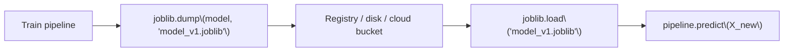

Training a model can take minutes, hours, or days. You don't want to redo that work
every time you restart a script or every time a new API request comes in. The fix is
simple: train once, write the trained object to disk as a file, and load that file
back whenever you need predictions. This page covers how to do that safely with
`joblib` and `pickle`, and the mistakes that trip people up in production.

## Why we save models

Training can be expensive.

Instead of training every time, we:

- train once
- save model artifact
- load it for predictions

## joblib vs pickle

- `pickle`: general Python serialization
- `joblib`: often better for large numpy arrays (common in sklearn models)

For scikit-learn, `joblib` is a common default.

## Best practice: save the pipeline

Don't save only the model.

Save the **entire pipeline** (preprocessing + model), so inference matches training.
If you save just the fitted `LogisticRegression` and forget the `StandardScaler` or
`OneHotEncoder` that fed it, the numbers you feed at prediction time won't match the
numbers the model actually learned from — the model will run, but its predictions
will be wrong in a way that's hard to notice.

## The save → version → load flow



## Saving and loading a real pipeline

```python title="train_and_save.py" showLineNumbers{1}
import joblib
import numpy as np
from sklearn.linear_model import LogisticRegression
from sklearn.pipeline import Pipeline
from sklearn.preprocessing import StandardScaler

# tiny synthetic dataset: [age, income] -> subscribed (0/1)
X = np.array([
    [22, 20000], [35, 50000], [45, 80000],
    [23, 22000], [40, 60000], [55, 95000],
])
y = np.array([0, 1, 1, 0, 1, 1])

pipeline = Pipeline([
    ("scaler", StandardScaler()),
    ("clf", LogisticRegression()),
])
pipeline.fit(X, y)

# save the WHOLE pipeline, not just the classifier
joblib.dump(pipeline, "model_v1.joblib")
print("Saved model_v1.joblib")
```

```python title="load_and_predict.py" showLineNumbers{1}
import joblib
import numpy as np

pipeline = joblib.load("model_v1.joblib")

X_new = np.array([[30, 45000], [50, 90000]])
preds = pipeline.predict(X_new)
print("Predictions:", preds)
```

## Versioning artifacts (so rollback is trivial)

A simple, effective pattern is to bake a version number or timestamp into the
filename instead of always overwriting `model.joblib`:

```python title="versioned_save.py" showLineNumbers{1}
import joblib
from datetime import datetime

def save_versioned(pipeline, name="model"):
    stamp = datetime.now().strftime("%Y%m%d_%H%M%S")
    path = f"{name}_{stamp}.joblib"
    joblib.dump(pipeline, path)
    return path

# path = save_versioned(pipeline)
# -> "model_20260712_143000.joblib"
```

If a new version misbehaves in production, rolling back is just pointing your
loading code at the previous file — no retraining required.

:::tip[From the book]
Géron describes exactly this pattern for TF Serving's model directories: "rolling
back to version 1 is as simple as removing the `my_mnist_model/0002` directory." You
don't need TensorFlow Serving to get this benefit — keeping each trained pipeline as
its own versioned file on disk gives you the same easy rollback.
:::

## Common pitfalls

- version mismatches (sklearn/numpy versions)
- saving raw model but forgetting preprocessing
- loading untrusted pickle files

## Security note

Never unpickle files from untrusted sources.

Pickle can execute arbitrary code.

import DataCampExercise from "../../../../components/DataCampExercise.astro";

## 🧪 Try It Yourself

### Exercise 1 – Save a Fitted Model with joblib

<DataCampExercise
  lang="python"
  hint={`Use \`joblib.dump(model, "filename.joblib")\` to write the fitted object to disk.`}
  code={`# Task: Exercise 1 – Save a Fitted Model with joblib
import joblib
from sklearn.linear_model import LogisticRegression
import numpy as np

X = np.array([[1], [2], [3], [4]])
y = np.array([0, 0, 1, 1])

model = LogisticRegression().fit(X, y)

# replace ___ with dump
joblib.___(model, "model.joblib")
print("Saved:", "model.joblib")

# ── Expected Output ───────────────────────────────────────────
# Saved: model.joblib
# ──────────────────────────────────────────────────────────────`}
  solution={`import joblib
from sklearn.linear_model import LogisticRegression
import numpy as np

X = np.array([[1], [2], [3], [4]])
y = np.array([0, 0, 1, 1])
model = LogisticRegression().fit(X, y)
joblib.dump(model, "model.joblib")
print("Saved:", "model.joblib")`}
  sct={`test_output_contains("Saved: model.joblib")
success_msg("Model persisted to disk!")`}
  height={148}
/>

### Exercise 2 – Load a Model and Predict

<DataCampExercise
  lang="python"
  hint={`Use \`joblib.load("filename.joblib")\` to get the fitted object back, then call \`.predict(...)\` on it.`}
  code={`# Task: Exercise 2 – Load a Model and Predict
import joblib
from sklearn.linear_model import LogisticRegression
import numpy as np

X = np.array([[1], [2], [3], [4]])
y = np.array([0, 0, 1, 1])
LogisticRegression().fit(X, y)
joblib.dump(LogisticRegression().fit(X, y), "model.joblib")

# replace ___ with load
loaded = joblib.___("model.joblib")
preds = loaded.predict(np.array([[1], [4]]))
print("Predictions:", preds)

# ── Expected Output ───────────────────────────────────────────
# Predictions: [0 1]
# ──────────────────────────────────────────────────────────────`}
  solution={`import joblib
from sklearn.linear_model import LogisticRegression
import numpy as np

X = np.array([[1], [2], [3], [4]])
y = np.array([0, 0, 1, 1])
joblib.dump(LogisticRegression().fit(X, y), "model.joblib")

loaded = joblib.load("model.joblib")
preds = loaded.predict(np.array([[1], [4]]))
print("Predictions:", preds)`}
  sct={`test_output_contains("Predictions:")
success_msg("Loaded the model and reused it for inference!")`}
  height={158}
/>

### Exercise 3 – Build a Versioned Filename

<DataCampExercise
  lang="python"
  hint={`Use an f-string like \`f"{name}_v{version}.joblib"\` to embed the version number in the filename.`}
  code={`# Task: Exercise 3 – Build a Versioned Filename
name = "model"
version = 3

# replace ___ with an f-string that embeds name and version
path = ___
print("Path:", path)

# ── Expected Output ───────────────────────────────────────────
# Path: model_v3.joblib
# ──────────────────────────────────────────────────────────────`}
  solution={`name = "model"
version = 3
path = f"{name}_v{version}.joblib"
print("Path:", path)`}
  sct={`test_output_contains("Path: model_v3.joblib")
success_msg("That's how easy rollback becomes: load the older versioned file!")`}
  height={138}
/>

## Next

Continue to **Building an ML API with Flask/FastAPI** — now that the pipeline can be
saved and loaded reliably, wrap it in an HTTP endpoint so other services can call it.
