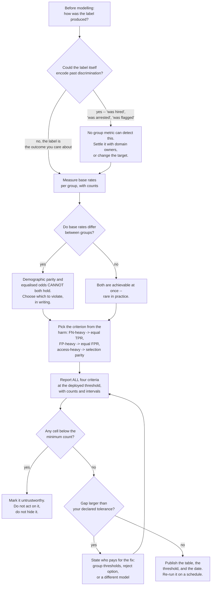

import DataCampExercise from "../../../../components/DataCampExercise.astro";
import Figure from "../../../../components/Figure.astro";
import Quiz from "../../../../components/Quiz.astro";

## What you'll learn

- the four group fairness criteria, defined precisely, computed on the same model
- why a model that never sees the protected attribute still produces a **0.6537** selection-rate gap
- Chouldechova's identity, verified to four decimals: prevalence, precision and error rates are
  **algebraically locked together**
- why demographic parity, equal opportunity and predictive parity cannot all hold when base rates
  differ — and what each one costs when you force it
- how to write a bias audit that survives contact with a real dataset
- why "we removed the protected attribute" is not a defence

## A deliberately clean setup

Every ingredient here is honest. There is one feature `q` — read it as a genuine, unbiased
qualification score. It is equally predictive in both groups. The label is generated from `q` alone,
by the same rule for everybody:

```python title="the_data.py" showLineNumbers{1}
rng = np.random.default_rng(7)
n = 8000

group = rng.integers(0, 2, n)
q = rng.normal(np.where(group == 1, -1.1, 1.1), 1.0, n)      # the ONLY difference
y = (rng.random(n) < 1 / (1 + np.exp(-1.6 * q))).astype(int)  # same rule for both

X = pd.DataFrame({"q": q, "noise": rng.normal(0, 1, n)})      # note: no `group` column
```

Read the third line carefully. $P(y \mid q)$ is **identical** across groups. The groups differ only
in the distribution of $q$ itself — one has, on average, a lower qualification score, for reasons
outside the model's data. That is the entire source of everything that follows.

And note the fourth line: `group` is **not** a feature. The model never sees it.

```python title="the_model.py" showLineNumbers{1}
model = RandomForestClassifier(n_estimators=400, random_state=0).fit(X_train, y_train)
proba = model.predict_proba(X_test)[:, 1]

print(f"{model.score(X_test, y_test):.4f}")             # 0.8000
for g in (0, 1):                                        # ranking quality per group
    m = group_test == g
    print(f"group {g} AUC {roc_auc_score(y_test[m], proba[m]):.4f}")
# group 0 AUC 0.7888
# group 1 AUC 0.8042
```

Accuracy 0.8000. AUC 0.7888 and 0.8042 — the model *ranks* candidates about equally well inside both
groups, and if anything slightly better in group 1. By every conventional check this model is fine.

:::note[0.8000 or 0.7994?]
`model.score` reports **0.8000**; recomputing from the probabilities with an explicit `proba >= 0.50`
gives **0.7994**. Exactly **4 of 3,200** rows have a probability of precisely 0.500, and sklearn's
`argmax` sends ties to class 0 while `>=` sends them to class 1. Worth knowing before you spend an
afternoon on a 0.0006 discrepancy.
:::

## The four criteria

Fix a threshold $t$, let $\hat{y} = \mathbb{1}[\,\hat{p} \ge t\,]$, and let $A$ be the group.

| Criterion | Definition | Reads as |
| --- | --- | --- |
| **Demographic parity** | $P(\hat{y}=1 \mid A=a)$ equal for all $a$ | Equal shares selected |
| **Equal opportunity** | $P(\hat{y}=1 \mid y=1, A=a)$ equal (equal TPR) | Qualified people have equal chances |
| **Equalized odds** | equal TPR **and** equal FPR | Equal error rates of both kinds |
| **Predictive parity** | $P(y=1 \mid \hat{y}=1, A=a)$ equal (equal precision) | A positive means the same thing for everyone |
| **Calibration** | $P(y=1 \mid \hat{p}=s, A=a)$ equal for all scores $s$ | A score of 0.7 means 0.7 for everyone |

These are not variations on a theme. They are different demands, and the next section shows they are
mutually exclusive here.

## What the base rates do

<Figure
  src="/images/ml/phase-09-interpretability/fairness-metrics-and-bias-auditing/base-rates"
  alt="Grouped bars for two groups. Group 0 has a true base rate of 0.7524 and a selection rate of 0.8169. Group 1 has a base rate of 0.2147 and a selection rate of 0.1632."
  title="Base rates 0.7524 and 0.2147 — model accuracy 0.8000, no measurement bias anywhere"
  caption="The model tracks each group's base rate, which is what an accurate model does. Group 0 is selected at 0.8169 and group 1 at 0.1632: a gap of 0.6537, produced without the model ever seeing the group label."
/>

At a single threshold of 0.50, applied identically to everyone:

| Metric | Group 0 | Group 1 | Gap |
| --- | --- | --- | --- |
| n | 1,644 | 1,556 | |
| base rate | 0.7524 | 0.2147 | 0.5377 |
| selection rate | 0.8169 | 0.1632 | **0.6537** |
| true positive rate | 0.9070 | 0.4222 | **0.4849** |
| false positive rate | 0.5430 | 0.0925 | 0.4505 |
| precision | 0.8354 | 0.5551 | **0.2803** |

Three points deserve attention.

**The gaps are large and the model is not broken.** 0.6537 is not a rounding artefact; it is what
"one threshold for everyone" produces when the underlying rates are 0.7524 and 0.2147.

**Removing the protected attribute achieved nothing.** `group` was never a column. `q` carries the
group difference perfectly well on its own, and any sufficiently rich feature set will. "Fairness
through unawareness" is not a technique; it is a way of not looking.

**The direction of unfairness depends on which criterion you invoke.** Group 1 is selected far less
often (bad by demographic parity) *and* has a much lower false positive rate (good, if a positive is
a punishment). Nothing about the numbers alone tells you which reading is right.

## The gaps are locked together algebraically

The reason you cannot fix all of these at once is not statistical, it is arithmetic. For any
classifier and any group, with prevalence $p$, precision (PPV) and false negative rate
$\mathrm{FNR} = 1 - \mathrm{TPR}$:

$$
\mathrm{FPR} = \frac{p}{1-p} \cdot \frac{1 - \mathrm{PPV}}{\mathrm{PPV}} \cdot \big(1 - \mathrm{FNR}\big)
$$

This is Chouldechova's identity. It is a rearrangement of the confusion matrix, so it holds exactly,
always. Verify it on both groups:

```python title="chouldechova.py" showLineNumbers{1}
for row in group_rows:
    p = y_test[group_test == row["group"]].mean()
    ppv, fnr = row["precision"], 1 - row["tpr"]
    implied = (p / (1 - p)) * ((1 - ppv) / ppv) * (1 - fnr)
    print(f"group {row['group']}  prevalence {p:.4f}  "
          f"implied FPR {implied:.4f}  measured FPR {row['fpr']:.4f}")

# group 0  prevalence 0.7524  implied FPR 0.5430  measured FPR 0.5430
# group 1  prevalence 0.2147  implied FPR 0.0925  measured FPR 0.0925
```

Exact to four decimals in both groups, because it is an identity and not an approximation.

Now read it as a constraint. Suppose you equalise PPV across groups (predictive parity) and also
equalise FNR (part of equalized odds). Then everything on the right-hand side is equal across groups
except $p/(1-p)$ — so FPR **must** differ, in the ratio of the prevalence odds. Here those odds are
**3.0393** and **0.2733**, a ratio of **11.1**. There is no classifier,
no architecture, no amount of data that escapes this. When base rates differ, predictive parity and
equalized odds are incompatible except in the degenerate case of a perfect classifier.

:::caution[The impossibility result]
Kleinberg, Mullainathan & Raghavan (2016) and Chouldechova (2017) proved this independently: with
unequal base rates, calibration, equal false positive rates and equal false negative rates cannot
hold simultaneously unless the classifier is perfect. **Choosing a fairness criterion is therefore
not a technical decision.** It is a decision about which harm you are willing to accept, and it
belongs to the people accountable for the decision, not to whoever writes the loss function.
:::

## Three policies, three different failures

Take the same model and only change the thresholds. Solve for the group-1 threshold that equalises
each criterion in turn:

<Figure
  src="/images/ml/phase-09-interpretability/fairness-metrics-and-bias-auditing/impossibility"
  alt="A three-by-three heatmap of gaps. One threshold for everyone: 0.6537, 0.4849, 0.2803. Forced demographic parity: 0.0283, 0.0660, 0.5706. Forced equal opportunity: 0.2327, 0.0002, 0.5021. The satisfied cell in each row is boxed."
  title="Gap between groups — boxed cells are the criterion each policy satisfies"
  caption="Every row satisfies the criterion it optimises and violates at least one other, and the predictive-parity column gets worse in both interventions — from 0.2803 to 0.5706 and 0.5021. There is no row with three small numbers, and no policy anyone has ever proposed produces one."
/>

| Policy | Group 1 threshold | DP gap | EO gap | PP gap | Overall accuracy |
| --- | --- | --- | --- | --- | --- |
| one threshold for everyone | 0.5000 | 0.6537 | 0.4849 | 0.2803 | **0.7994** |
| force demographic parity | **0.0050** | **0.0283** | 0.0660 | 0.5706 | 0.6103 |
| force equal opportunity | **0.0650** | 0.2327 | **0.0002** | 0.5021 | 0.6959 |
| force equal FPR | 0.0450 | 0.1909 | 0.0181 | 0.5182 | 0.6794 |

Look at the thresholds. To reach demographic parity, group 1's threshold falls to **0.0050** — the
model must approve essentially anyone whose predicted probability is not zero. That is what closing a
0.6537 gap by threshold surgery actually requires, and the accuracy cost is 0.7994 → **0.6103**.

Interestingly, the last row shows that *equalized odds* is nearly reachable: at a threshold of 0.0450
the FPR gap is 0.0012 and the TPR gap 0.0181 (the bisection lands group 1's FPR at 0.5442 against
group 0's 0.5430, since probabilities come in discrete steps). Both error rates roughly matched — and
the precision gap has grown to **0.5182**. The identity is not negotiable.

## Who pays for parity

<Figure
  src="/images/ml/phase-09-interpretability/fairness-metrics-and-bias-auditing/cost-of-parity"
  alt="Group 1's four rates before and after forcing parity. Selection rate 0.163 to 0.789, true positive rate 0.422 to 0.973, false positive rate 0.092 to 0.738, precision 0.555 to 0.265."
  title="Group 1 under parity: more selected and more true positives, but precision collapses"
  caption="Forcing demographic parity is not free and it is not purely beneficial. Group 1's true positive rate rises from 0.4222 to 0.9731 — genuinely qualified people who were being rejected now get through. Its false positive rate rises from 0.0925 to 0.7381, and precision falls from 0.5551 to 0.2649: fewer than 27% of group-1 approvals are now correct, against 84% for group 0."
/>

This is the part that gets skipped. Forcing demographic parity does real good — the TPR for group 1
goes from **0.4222 to 0.9731**, meaning most of the qualified people who were previously refused now
succeed. It also means **73.81%** of unqualified group-1 applicants are now approved, against 54.30%
in group 0, and that a group-1 approval carries 0.2649 precision against group 0's 0.8354.

Whether that trade is right depends entirely on what the decision does to people:

| If the positive decision is… | The costly error is… | Reasonable criterion |
| --- | --- | --- |
| a loan, a job interview, an admission | a false **negative** (denied opportunity) | equal opportunity — equalise TPR |
| a fraud flag, a risk score, extra screening | a false **positive** (wrongly burdened) | equal FPR |
| an allocation of a fixed budget across groups | under-representation | demographic parity |
| a score handed to a human decision-maker | a score meaning different things | calibration + predictive parity |

There is no default. Picking one of these rows *is* the fairness work; computing the metric afterwards
is the easy part.

## See it move

Threshold changes are the only lever most teams actually have, so it is worth developing intuition
for what they can and cannot do. Below, two groups have the same score distributions conditional on
the label — positives around $+1$, negatives around $-1$ — and differ only in base rate: 0.75 against
0.25. Everything is computed in closed form from the normal CDF, so nothing is approximated except
$\Phi$ itself:

$$
\mathrm{TPR}(t) = \Phi(1-t), \qquad
\mathrm{FPR}(t) = \Phi(-1-t), \qquad
\mathrm{PPV} = \frac{b\,\mathrm{TPR}}{b\,\mathrm{TPR} + (1-b)\,\mathrm{FPR}}
$$

Drag the two threshold handles and try to make all three gaps small at once.

```p5 title="Two thresholds, three gaps, one impossible target" desc="Two groups with identical conditional score distributions and base rates 0.75 and 0.25. Dragging each group's threshold shows the selection-rate, true-positive-rate and precision gaps updating in closed form; zeroing any one of them leaves at least one other large." height="430"
let tA = 0.0, tB = 0.0, dragging = -1;
const bA = 0.75, bB = 0.25;
function Phi(z) {                       // Abramowitz & Stegun 7.1.26 on erf
  const s = z < 0 ? -1 : 1;
  const x = Math.abs(z) / Math.SQRT2;
  const t = 1 / (1 + 0.3275911 * x);
  const e = 1 - ((((1.061405429 * t - 1.453152027) * t + 1.421413741) * t
    - 0.284496736) * t + 0.254829592) * t * Math.exp(-x * x);
  return 0.5 * (1 + s * e);
}
function rates(t, b) {
  const tpr = Phi(1 - t), fpr = Phi(-1 - t);
  const sel = b * tpr + (1 - b) * fpr;
  const ppv = sel > 0 ? (b * tpr) / sel : 0;
  return { tpr: tpr, fpr: fpr, sel: sel, ppv: ppv };
}
function setup() {
  createCanvas(620, 430);
  textFont("monospace");
}
function draw() {
  background(13, 17, 23);
  const ox = 50, w = 520, h = 92;
  const px = (v) => ox + ((v + 4) / 8) * w;

  if (dragging >= 0) {
    const v = constrain(((mouseX - ox) / w) * 8 - 4, -4, 4);
    if (dragging === 0) tA = v; else tB = v;
  }

  const groups = [
    { name: "group 0  base rate 0.75", b: bA, t: tA, y: 40, col: [107, 169, 221] },
    { name: "group 1  base rate 0.25", b: bB, t: tB, y: 170, col: [255, 211, 67] },
  ];

  for (const g of groups) {
    noStroke();
    fill(200);
    textSize(11);
    textAlign(LEFT, BOTTOM);
    text(g.name, ox, g.y - 6);

    // conditional densities, scaled by the class share
    for (const [mu, share, col] of [[-1, 1 - g.b, [118, 131, 144]],
                                    [1, g.b, g.col]]) {
      fill(col[0], col[1], col[2], 150);
      beginShape();
      vertex(ox, g.y + h);
      for (let x = -4; x <= 4.001; x += 0.08) {
        const d = Math.exp(-0.5 * (x - mu) * (x - mu)) * share;
        vertex(px(x), g.y + h - d * h * 1.6);
      }
      vertex(ox + w, g.y + h);
      endShape(CLOSE);
    }

    stroke(232, 110, 110);
    strokeWeight(2);
    line(px(g.t), g.y - 2, px(g.t), g.y + h + 8);
    noStroke();
    fill(232, 110, 110);
    triangle(px(g.t) - 5, g.y + h + 8, px(g.t) + 5, g.y + h + 8, px(g.t), g.y + h + 18);

    const r = rates(g.t, g.b);
    fill(150);
    textSize(10);
    textAlign(RIGHT, BOTTOM);
    text("threshold " + g.t.toFixed(2) + "   sel " + r.sel.toFixed(4)
      + "   tpr " + r.tpr.toFixed(4) + "   ppv " + r.ppv.toFixed(4),
      ox + w, g.y - 6);
  }

  const ra = rates(tA, bA), rb = rates(tB, bB);
  const gaps = [
    ["selection-rate gap", Math.abs(ra.sel - rb.sel)],
    ["true-positive-rate gap", Math.abs(ra.tpr - rb.tpr)],
    ["precision gap", Math.abs(ra.ppv - rb.ppv)],
  ];
  let small = 0;
  for (let i = 0; i < gaps.length; i++) {
    const [label, v] = gaps[i];
    const ok = v < 0.02;
    if (ok) small++;
    noStroke();
    fill(ok ? color(165, 214, 164) : color(232, 110, 110));
    rect(ox, 300 + i * 26, Math.max(2, v * 300), 16, 3);
    fill(200);
    textSize(11);
    textAlign(LEFT, CENTER);
    text(label + "  " + v.toFixed(4), ox + Math.max(2, v * 300) + 10, 308 + i * 26);
  }

  noStroke();
  fill(small >= 2 ? color(255, 211, 67) : color(118, 131, 144));
  textSize(11);
  textAlign(LEFT, BOTTOM);
  text(small === 3 ? "Three at once. Check your arithmetic."
    : small + " of 3 gaps below 0.02", ox, height - 26);
  fill(118, 131, 144);
  textSize(10);
  text("drag either red threshold handle", ox, height - 10);
}
function mousePressed() {
  const ox = 50, w = 520;
  const px = (v) => ox + ((v + 4) / 8) * w;
  if (abs(mouseX - px(tA)) < 14 && mouseY < 160) dragging = 0;
  else if (abs(mouseX - px(tB)) < 14 && mouseY >= 160 && mouseY < 290) dragging = 1;
}
function mouseReleased() { dragging = -1; }
```

Two gaps can be closed at once only in the limit where you select everybody or nobody. The third
never cooperates, and that is the impossibility result rendered as a toy.

## Writing an audit that is actually useful

A fairness audit is not a single number. It is a table, sliced by group, with counts attached so you
can tell a real gap from four unlucky rows.

```python title="bias_audit.py" showLineNumbers{1}
"""A group fairness report. No dependencies beyond numpy."""

import numpy as np


def group_report(proba, y_true, group, thresholds=None, default_threshold=0.5,
                 min_count=100):
    """Per-group rates at a threshold, plus the gaps and a small-sample warning.

    `thresholds` maps group -> threshold, so you can audit a policy that treats
    groups differently as easily as one that does not.
    """
    rows = []
    for g in sorted(set(group)):
        mask = group == g
        t = default_threshold if thresholds is None else thresholds[g]
        pred = (proba[mask] >= t).astype(int)
        yy = y_true[mask]
        positives, selected = yy == 1, pred == 1
        rows.append({
            "group": g,
            "n": int(mask.sum()),
            "n_positive": int(positives.sum()),
            "threshold": t,
            "base_rate": float(yy.mean()),
            "selection": float(pred.mean()),
            "tpr": float(pred[positives].mean()) if positives.any() else np.nan,
            "fpr": float(pred[~positives].mean()) if (~positives).any() else np.nan,
            "precision": float(yy[selected].mean()) if selected.any() else np.nan,
        })

    header = f"{'group':>7s} {'n':>6s} {'base':>7s} {'sel':>7s} {'tpr':>7s} {'fpr':>7s} {'prec':>7s}"
    print(header)
    for r in rows:
        warn = "  (n too small to trust)" if r["n"] < min_count else ""
        print(f"{r['group']!s:>7s} {r['n']:6d} {r['base_rate']:7.4f} "
              f"{r['selection']:7.4f} {r['tpr']:7.4f} {r['fpr']:7.4f} "
              f"{r['precision']:7.4f}{warn}")

    def spread(key):
        values = [r[key] for r in rows if not np.isnan(r[key])]
        return max(values) - min(values)

    print(f"\ndemographic parity gap {spread('selection'):.4f}")
    print(f"equal opportunity gap  {spread('tpr'):.4f}")
    print(f"equal FPR gap          {spread('fpr'):.4f}")
    print(f"predictive parity gap  {spread('precision'):.4f}")
    return rows
```

Four rules make the difference between an audit and a ritual:

1. **Report every criterion, not the one that looks best.** A report showing only the criterion your
   model happens to satisfy is worse than no report, because it implies the others were checked.
2. **Print the counts.** A 0.30 gap on 40 people is noise; the same gap on 4,000 is a finding. Attach
   a confidence interval or at least a minimum-count warning.
3. **Slice intersectionally, then stop where the counts run out.** Gaps often live in the
   intersections, and the cells get small fast. Say where you stopped and why.
4. **Audit the threshold you actually deploy.** Metrics at 0.50 are irrelevant if operations uses
   0.31.

### The audit as a procedure

The order of these steps is load-bearing: the label question comes first, because a criterion chosen
before the label is examined can be satisfied perfectly and still be meaningless.



:::caution[What an audit cannot tell you]
Every number on this page is measured against `y`, the recorded label. If the label itself encodes
past discrimination — "was hired", "was arrested", "was flagged" — then equalising TPR against that
label equalises access to a biased standard. No group metric detects this, because the metric has
nothing else to compare against. That question has to be settled before the modelling starts, by
examining how the label was produced.
:::

## Pitfalls

| Pitfall | Why it bites | What to do |
| --- | --- | --- |
| Dropping the protected attribute and declaring the model fair | `group` was never a column here and the selection gap is still 0.6537 | Keep it out of the features if you must, but always *measure* with it |
| Reporting one fairness metric | The three criteria moved in opposite directions in every row of the policy table | Report all of them, plus base rates |
| Treating criterion choice as a modelling decision | The impossibility result means the choice is about which harm is acceptable | Get it decided and documented by whoever is accountable |
| Forcing demographic parity without looking at precision | Group 1's precision fell from 0.5551 to 0.2649 and its FPR rose to 0.7381 | Show the full before/after table for the affected group |
| Auditing at 0.50 when production uses another threshold | Every rate on this page is threshold-dependent | Audit the deployed threshold, and re-audit when it changes |
| Trusting gaps computed on tiny slices | Intersectional cells shrink fast | Print n, warn below a floor, bootstrap the gap |
| Equalising rates against a biased label | The metric cannot see label bias | Interrogate label provenance before modelling |

## Recap

- The data had **one honest feature**, an identical $P(y \mid q)$ in both groups, and **no `group`
  column** — and still produced a selection-rate gap of **0.6537** at a single threshold of 0.50.
- Base rates 0.7524 against 0.2147 are the whole story. An accurate model reproduces them.
- Chouldechova's identity reproduced both groups' FPR exactly — **0.5430** and **0.0925** — from
  prevalence, precision and FNR. The criteria are algebraically locked together.
- Prevalence odds differ by **11.1×** here, so predictive parity and equalized odds cannot both hold.
- Forcing demographic parity needed a group-1 threshold of **0.0050**, cost accuracy 0.7994 →
  **0.6103**, raised TPR 0.4222 → **0.9731** and dropped precision 0.5551 → **0.2649**.
- Equal opportunity was cheaper (accuracy **0.6959**) and left a demographic-parity gap of 0.2327.
- Choosing among these is a decision about harm, not a hyperparameter.

<Quiz
  questions={[
    {
      q: "The model was never given the group column, yet the selection-rate gap is 0.6537. Why?",
      options: [
        "There must be a bug in the pipeline",
        "The single feature q carries the group difference, and an accurate model reproduces base rates of 0.7524 and 0.2147",
        "Random forests are biased by construction",
        "The test split was not stratified by group",
      ],
      answer: 1,
      explain: "Fairness through unawareness fails because any sufficiently informative feature set proxies the protected attribute. Here q does it single-handedly, and the model is doing exactly its job: matching the base rates it was shown.",
    },
    {
      q: "Chouldechova's identity reproduced measured FPR to four decimals in both groups. What follows?",
      options: [
        "The model is well calibrated",
        "Prevalence, precision and the two error rates are algebraically linked, so equalising precision and FNR forces FPR to differ by the prevalence-odds ratio — 11.1x here",
        "The audit code has a rounding bug",
        "Fairness metrics are unreliable",
      ],
      answer: 1,
      explain: "It is an identity, a rearrangement of the confusion matrix, so it always holds exactly. Read as a constraint it is the impossibility result: with unequal base rates you may satisfy predictive parity or equalized odds, not both.",
    },
    {
      q: "Forcing demographic parity moved group 1's threshold to 0.0050. What is the honest summary of the result?",
      options: [
        "The model is now fair",
        "Genuinely qualified group-1 members benefit — TPR 0.4222 to 0.9731 — while precision falls to 0.2649 and FPR rises to 0.7381",
        "Nothing changed except the selection rate",
        "Accuracy is unaffected",
      ],
      answer: 1,
      explain: "Both halves are real, which is why the trade has to be made deliberately. Overall accuracy fell from 0.7994 to 0.6103, and a group-1 approval now carries 0.2649 precision against group 0's 0.8354.",
    },
    {
      q: "You are building a fraud-screening model where a positive means additional scrutiny. Which criterion fits?",
      options: [
        "Demographic parity, always",
        "Equal false positive rates, because the harm falls on people wrongly flagged",
        "Whichever the model already satisfies",
        "None — fairness does not apply to fraud",
      ],
      answer: 1,
      explain: "The costly error defines the criterion. For a punitive positive, being wrongly flagged is the harm, so equalise FPR. For an assistive positive — a loan, an interview — the harm is a false negative, so equalise TPR.",
    },
    {
      q: "Your audit shows an equal-opportunity gap of 0.31 for one intersectional subgroup. What is the first thing to check?",
      options: [
        "Retrain with a fairness constraint immediately",
        "The subgroup's count, and specifically how many positives it contains — a gap on 40 rows is noise",
        "Whether to drop the protected attribute",
        "The model's overall accuracy",
      ],
      answer: 1,
      explain: "TPR is computed on positives only, so a subgroup with 40 rows and 6 positives produces gaps that swing wildly. Print n and n_positive, bootstrap the gap, and set a minimum count below which you report 'insufficient data' rather than a number.",
    },
  ]}
/>

## 🧪 Try It Yourself

### Exercise 1 – Build a dataset with no bias in it

<DataCampExercise
  lang="python"
  hint={`The label rule is the same for both groups; only the mean of q differs. AUC per group shows the model ranks equally well inside each.`}
  code={`# Task: Exercise 1 - Build a dataset with no bias in it
import numpy as np
import pandas as pd
from sklearn.ensemble import RandomForestClassifier
from sklearn.metrics import roc_auc_score
from sklearn.model_selection import train_test_split

rng = np.random.default_rng(7)
n = 8000
group = rng.integers(0, 2, n)
q = rng.normal(np.where(group == 1, -1.1, 1.1), 1.0, n)   # only difference
y = (rng.random(n) < 1 / (1 + np.exp(-1.6 * q))).astype(int)
X = pd.DataFrame({"q": q, "noise": rng.normal(0, 1, n)})  # no group column

X_tr, X_te, y_tr, y_te, g_tr, g_te = train_test_split(
    X, y, group, test_size=0.4, random_state=0, stratify=y)
model = RandomForestClassifier(n_estimators=400, random_state=0).fit(X_tr, y_tr)
proba = model.predict_proba(X_te)[:, ___]        # replace ___ with 1

print(f"accuracy {model.score(X_te, y_te):.4f}")
for g in (0, 1):
    m = g_te == g
    print(f"group {g}  n {m.sum():4d}  base rate {y_te[m].mean():.4f}  "
          f"AUC {roc_auc_score(y_te[m], proba[m]):.4f}")

# -- Expected Output -------------------------------------------
# accuracy 0.8000
# group 0  n 1644  base rate 0.7524  AUC 0.7888
# group 1  n 1556  base rate 0.2147  AUC 0.8042
# --------------------------------------------------------------`}
  solution={`import numpy as np
import pandas as pd
from sklearn.ensemble import RandomForestClassifier
from sklearn.metrics import roc_auc_score
from sklearn.model_selection import train_test_split

rng = np.random.default_rng(7)
n = 8000
group = rng.integers(0, 2, n)
q = rng.normal(np.where(group == 1, -1.1, 1.1), 1.0, n)
y = (rng.random(n) < 1 / (1 + np.exp(-1.6 * q))).astype(int)
X = pd.DataFrame({"q": q, "noise": rng.normal(0, 1, n)})
X_tr, X_te, y_tr, y_te, g_tr, g_te = train_test_split(
    X, y, group, test_size=0.4, random_state=0, stratify=y)
model = RandomForestClassifier(n_estimators=400, random_state=0).fit(X_tr, y_tr)
proba = model.predict_proba(X_te)[:, 1]
print(f"accuracy {model.score(X_te, y_te):.4f}")
for g in (0, 1):
    m = g_te == g
    print(f"group {g}  n {m.sum():4d}  base rate {y_te[m].mean():.4f}  "
          f"AUC {roc_auc_score(y_te[m], proba[m]):.4f}")`}
  sct={`test_output_contains("base rate 0.2147")
success_msg("Base rates 0.7524 and 0.2147, AUC 0.7888 and 0.8042 - equally good ranking in both groups. Nothing is broken yet.")`}
  height={340}
/>

### Exercise 2 – Compute the four rates per group

<DataCampExercise
  lang="python"
  hint={`TPR is the selection rate among rows with y == 1; precision is the mean of y among selected rows.`}
  code={`# Task: Exercise 2 - Compute the four rates per group
# proba, y_te and g_te carry over from Exercise 1.

def metrics(proba, y_true, group, thresholds):
    rows = []
    for g in sorted(set(group)):
        m = group == g
        pred = (proba[m] >= thresholds[g]).astype(int)
        yy = y_true[m]
        rows.append({
            "group": g,
            "selection": pred.mean(),
            "tpr": pred[yy == 1].mean(),
            "fpr": pred[yy == 0].mean(),
            "precision": yy[pred == ___].mean(),      # replace ___ with 1
        })
    return rows

one = metrics(proba, y_te, g_te, {0: 0.5, 1: 0.5})
for r in one:
    print(f"group {r['group']}  sel {r['selection']:.4f}  tpr {r['tpr']:.4f}  "
          f"fpr {r['fpr']:.4f}  prec {r['precision']:.4f}")
print(f"demographic parity gap {abs(one[0]['selection'] - one[1]['selection']):.4f}")
print(f"equal opportunity gap  {abs(one[0]['tpr'] - one[1]['tpr']):.4f}")
print(f"predictive parity gap  {abs(one[0]['precision'] - one[1]['precision']):.4f}")

# -- Expected Output -------------------------------------------
# group 0  sel 0.8169  tpr 0.9070  fpr 0.5430  prec 0.8354
# group 1  sel 0.1632  tpr 0.4222  fpr 0.0925  prec 0.5551
# demographic parity gap 0.6537
# equal opportunity gap  0.4849
# predictive parity gap  0.2803
# --------------------------------------------------------------`}
  solution={`def metrics(proba, y_true, group, thresholds):
    rows = []
    for g in sorted(set(group)):
        m = group == g
        pred = (proba[m] >= thresholds[g]).astype(int)
        yy = y_true[m]
        rows.append({
            "group": g,
            "selection": pred.mean(),
            "tpr": pred[yy == 1].mean(),
            "fpr": pred[yy == 0].mean(),
            "precision": yy[pred == 1].mean(),
        })
    return rows

one = metrics(proba, y_te, g_te, {0: 0.5, 1: 0.5})
for r in one:
    print(f"group {r['group']}  sel {r['selection']:.4f}  tpr {r['tpr']:.4f}  "
          f"fpr {r['fpr']:.4f}  prec {r['precision']:.4f}")
print(f"demographic parity gap {abs(one[0]['selection'] - one[1]['selection']):.4f}")
print(f"equal opportunity gap  {abs(one[0]['tpr'] - one[1]['tpr']):.4f}")
print(f"predictive parity gap  {abs(one[0]['precision'] - one[1]['precision']):.4f}")`}
  sct={`test_output_contains("demographic parity gap 0.6537")
success_msg("A 0.6537 selection gap from a model that never saw the group label.")`}
  height={340}
/>

### Exercise 3 – Pay for demographic parity

<DataCampExercise
  lang="python"
  hint={`Bisection: if the achieved rate is above the target, raise the lower bound. Then re-run metrics with the new threshold for group 1 only.`}
  code={`# Task: Exercise 3 - Pay for demographic parity
def solve(proba, y_true, group, g, target, metric):
    """Bisect for the threshold that makes 'metric' equal 'target' for group g."""
    lo, hi = 0.0, 1.0
    for _ in range(80):
        mid = (lo + hi) / 2
        m = group == g
        pred = proba[m] >= mid
        value = pred.mean() if metric == "selection" else pred[y_true[m] == 1].mean()
        if value > target:
            lo = mid
        else:
            hi = ___                    # replace ___ with mid
    return (lo + hi) / 2

t_dp = solve(proba, y_te, g_te, 1, one[0]["selection"], "selection")
dp = metrics(proba, y_te, g_te, {0: 0.5, 1: t_dp})

print(f"threshold for group 1 {t_dp:.4f}")
print(f"group 1 selection {dp[1]['selection']:.4f} vs group 0 {dp[0]['selection']:.4f}")
print(f"group 1 precision {one[1]['precision']:.4f} -> {dp[1]['precision']:.4f}")
print(f"group 1 fpr       {one[1]['fpr']:.4f} -> {dp[1]['fpr']:.4f}")
pred = np.where(g_te == 0, proba >= 0.5, proba >= t_dp).astype(int)
print(f"overall accuracy  {(pred == y_te).mean():.4f}")

# -- Expected Output -------------------------------------------
# threshold for group 1 0.0050
# group 1 selection 0.7886 vs group 0 0.8169
# group 1 precision 0.5551 -> 0.2649
# group 1 fpr       0.0925 -> 0.7381
# overall accuracy  0.6103
# --------------------------------------------------------------`}
  solution={`def solve(proba, y_true, group, g, target, metric):
    lo, hi = 0.0, 1.0
    for _ in range(80):
        mid = (lo + hi) / 2
        m = group == g
        pred = proba[m] >= mid
        value = pred.mean() if metric == "selection" else pred[y_true[m] == 1].mean()
        if value > target:
            lo = mid
        else:
            hi = mid
    return (lo + hi) / 2

t_dp = solve(proba, y_te, g_te, 1, one[0]["selection"], "selection")
dp = metrics(proba, y_te, g_te, {0: 0.5, 1: t_dp})
print(f"threshold for group 1 {t_dp:.4f}")
print(f"group 1 selection {dp[1]['selection']:.4f} vs group 0 {dp[0]['selection']:.4f}")
print(f"group 1 precision {one[1]['precision']:.4f} -> {dp[1]['precision']:.4f}")
print(f"group 1 fpr       {one[1]['fpr']:.4f} -> {dp[1]['fpr']:.4f}")
pred = np.where(g_te == 0, proba >= 0.5, proba >= t_dp).astype(int)
print(f"overall accuracy  {(pred == y_te).mean():.4f}")`}
  sct={`test_output_contains("threshold for group 1 0.0050")
success_msg("Parity needs a threshold of 0.0050 - approve almost everyone - and precision falls to 0.2649.")`}
  height={340}
/>

### Exercise 4 – Equal opportunity is cheaper, and leaves a gap

<DataCampExercise
  lang="python"
  hint={`Same solver, metric="tpr", target = group 0's TPR. Then look at what did NOT get equalised.`}
  code={`# Task: Exercise 4 - Equal opportunity is cheaper, and leaves a gap
t_eo = solve(proba, y_te, g_te, 1, one[0]["___"], "tpr")   # replace ___ with tpr
eo = metrics(proba, y_te, g_te, {0: 0.5, 1: t_eo})

print(f"threshold for group 1 {t_eo:.4f}")
print(f"equal opportunity gap {abs(eo[0]['tpr'] - eo[1]['tpr']):.4f}")
print(f"demographic parity gap {abs(eo[0]['selection'] - eo[1]['selection']):.4f}")
print(f"predictive parity gap  {abs(eo[0]['precision'] - eo[1]['precision']):.4f}")
pred = np.where(g_te == 0, proba >= 0.5, proba >= t_eo).astype(int)
print(f"overall accuracy       {(pred == y_te).mean():.4f}")

# -- Expected Output -------------------------------------------
# threshold for group 1 0.0650
# equal opportunity gap 0.0002
# demographic parity gap 0.2327
# predictive parity gap  0.5021
# overall accuracy       0.6959
# --------------------------------------------------------------`}
  solution={`t_eo = solve(proba, y_te, g_te, 1, one[0]["tpr"], "tpr")
eo = metrics(proba, y_te, g_te, {0: 0.5, 1: t_eo})
print(f"threshold for group 1 {t_eo:.4f}")
print(f"equal opportunity gap {abs(eo[0]['tpr'] - eo[1]['tpr']):.4f}")
print(f"demographic parity gap {abs(eo[0]['selection'] - eo[1]['selection']):.4f}")
print(f"predictive parity gap  {abs(eo[0]['precision'] - eo[1]['precision']):.4f}")
pred = np.where(g_te == 0, proba >= 0.5, proba >= t_eo).astype(int)
print(f"overall accuracy       {(pred == y_te).mean():.4f}")`}
  sct={`test_output_contains("equal opportunity gap 0.0002")
success_msg("TPR gap 0.0002 and accuracy 0.6959 - cheaper than parity - but the selection gap is still 0.2327 and precision has diverged to 0.5021.")`}
  height={320}
/>

### Exercise 5 – Verify the impossibility arithmetically

<DataCampExercise
  lang="python"
  hint={`FPR = (p / (1 - p)) * ((1 - PPV) / PPV) * (1 - FNR), with FNR = 1 - TPR. It should match the measured FPR exactly.`}
  code={`# Task: Exercise 5 - Verify the impossibility arithmetically
# Chouldechova's identity: a rearrangement of the confusion matrix, so it is exact.
for row in one:
    p = y_te[g_te == row["group"]].mean()
    ppv = row["precision"]
    fnr = 1 - row["___"]                       # replace ___ with tpr
    implied = (p / (1 - p)) * ((1 - ppv) / ppv) * (1 - fnr)
    print(f"group {row['group']}  prevalence {p:.4f}  "
          f"implied FPR {implied:.4f}  measured FPR {row['fpr']:.4f}")

odds = [y_te[g_te == g].mean() / (1 - y_te[g_te == g].mean()) for g in (0, 1)]
print(f"prevalence odds {odds[0]:.4f} and {odds[1]:.4f}, ratio {odds[0] / odds[1]:.1f}")

# -- Expected Output -------------------------------------------
# group 0  prevalence 0.7524  implied FPR 0.5430  measured FPR 0.5430
# group 1  prevalence 0.2147  implied FPR 0.0925  measured FPR 0.0925
# prevalence odds 3.0393 and 0.2733, ratio 11.1
# --------------------------------------------------------------`}
  solution={`for row in one:
    p = y_te[g_te == row["group"]].mean()
    ppv = row["precision"]
    fnr = 1 - row["tpr"]
    implied = (p / (1 - p)) * ((1 - ppv) / ppv) * (1 - fnr)
    print(f"group {row['group']}  prevalence {p:.4f}  "
          f"implied FPR {implied:.4f}  measured FPR {row['fpr']:.4f}")

odds = [y_te[g_te == g].mean() / (1 - y_te[g_te == g].mean()) for g in (0, 1)]
print(f"prevalence odds {odds[0]:.4f} and {odds[1]:.4f}, ratio {odds[0] / odds[1]:.1f}")`}
  sct={`test_output_contains("implied FPR 0.0925  measured FPR 0.0925")
success_msg("Exact in both groups. Equalise precision and FNR and the FPR gap is forced by the 11.1x prevalence-odds ratio.")`}
  height={320}
/>

## Next

[Phase 9 - Interpretability & Responsible ML](/machine-learning/phase-09---interpretability--responsible-ml/phase-9---interpretability--responsible-ml/)
— the phase overview, with the decision table for which tool answers which question and where each
one misleads.
