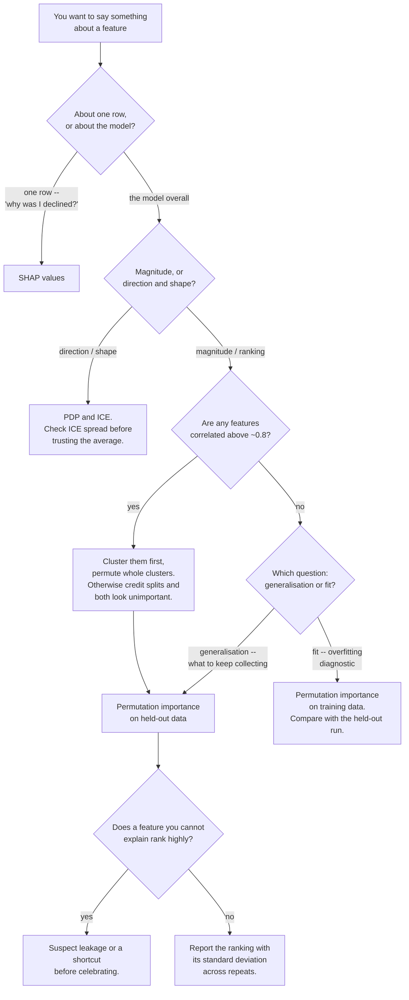

## What you'll learn

- why `feature_importances_` ranked **pure noise first**, at 0.3853 of the total
- the mechanism: impurity importance rewards **cardinality**, not information
- permutation importance, and why it must be computed on **held-out** data
- how correlated features **split the credit**: 0.2089 + 0.1489, then 0.4009 alone
- what a **negative** permutation importance means
- which method to use for which question

## The trap, first

Here is a forest trained on five features. Three are genuinely informative. Two are pure noise —
one continuous, one binary. The model reaches a respectable **0.8167** on held-out data, so it has
clearly learned something real.

Now ask it which features mattered.

| Method | `random_continuous` score | Its rank |
| --- | --- | --- |
| `feature_importances_` (impurity) | **+0.3853** | **1 of 5** |
| Permutation importance on **train** | +0.1796 | 4 of 5 |
| Permutation importance on **test** | +0.0134 | 4 of 5 |

<Figure
  src="/images/ml/phase-09-interpretability/feature-importance-and-its-traps/impurity-vs-permutation"
  alt="Three horizontal bar charts of the same five features. In the impurity panel the red random_continuous bar is longest. In both permutation panels the three blue informative bars lead, with the red noise bars near zero on test."
  title="Same forest, three answers, one of them badly wrong"
  caption="Impurity importance gives 38.53% of the total credit to a column of Gaussian noise, ranking it above all three informative features. Permutation on the training set gets the order right but still inflates the noise to +0.1796. Only permutation on held-out data puts it where it belongs, at +0.0134."
/>

Thirty-eight percent of the model's explanation, handed to a column that contains nothing. If you
had used that ranking to decide which data to keep collecting, you would have invested in noise.

## Why impurity importance does this

A decision tree splits by choosing the feature and threshold that most reduce impurity. `feature_importances_` adds up, across every node in every tree, the impurity reduction each feature achieved, weighted by how many samples reached that node.

The problem is in the *candidate* set. For a binary feature there is exactly one possible split. For
a continuous feature with $n$ distinct values there are $n - 1$. So the continuous column gets far
more chances to find a threshold that happens to separate the training labels — and with enough
candidates, one of them always will.

$$
\mathrm{Imp}(f) = \sum_{\text{trees}} \ \sum_{\substack{\text{nodes } t \\ \text{splitting on } f}}
\frac{n_t}{n} \, \Delta i(t)
$$

Two consequences follow directly from that formula:

**It is measured on training data only.** Every $\Delta i(t)$ is the impurity reduction the split
achieved *on the rows used to build the tree*. A split that fits noise still reduces training
impurity, and still gets credit.

**It rewards cardinality.** High-cardinality features win more splits. This is why the effect is
strongest for continuous columns, unique IDs, timestamps and high-cardinality categoricals — and why
`random_binary`, which is equally uninformative, scored only 0.0148.

Note that the trap needs **room to overfit**. With clean labels and enough data the forest never has
to reach for the noise column, and impurity importance looks fine. Here 10% of labels were flipped
and train accuracy hit 1.0000 against a test accuracy of 0.8167 — that gap is the space in which
the noise column got its 0.3853.

### See it move

The mechanism is worth watching on twenty rows, because it needs no model at all. Below, labels are
assigned **at random** and neither column carries a single bit of information about them. The
continuous column wins anyway, because it gets $n - 1$ candidate thresholds to the binary column's
one — and the best of nineteen coin flips beats one coin flip. Over 20,000 samples of this exact
setup the continuous column's best Gini reduction averages **0.0836** against the binary column's
**0.0250**, and it wins **89.1%** of individual samples.

```p5 title="Why a noise column wins splits" desc="Twenty rows with random labels. The continuous feature is scanned across all nineteen candidate thresholds and the best Gini reduction is kept; the binary feature gets its single split. Running averages over repeated samples show the continuous column winning consistently despite carrying no information." height="400"
const N = 20;
let cont = [], bin = [], lab = [], bestT = 0, bestGain = 0, binGain = 0;
let sumC = 0, sumB = 0, rounds = 0, wins = 0, frame = 0;
function gini(labels) {
  if (labels.length === 0) return 0;
  const p = labels.reduce((a, b) => a + b, 0) / labels.length;
  return 2 * p * (1 - p);
}
function reduction(mask) {
  const left = [], right = [];
  for (let i = 0; i < N; i++) (mask[i] ? left : right).push(lab[i]);
  const parent = gini(lab);
  return parent - (left.length / N) * gini(left) - (right.length / N) * gini(right);
}
function resample() {
  cont = []; bin = []; lab = [];
  for (let i = 0; i < N; i++) {
    cont.push(random(-2.4, 2.4));
    bin.push(random() < 0.5 ? 0 : 1);
    lab.push(random() < 0.5 ? 0 : 1);         // labels are pure noise
  }
  const sorted = [...cont].sort((a, b) => a - b);
  bestGain = -1;
  for (let k = 0; k < N - 1; k++) {           // all n-1 candidate thresholds
    const t = (sorted[k] + sorted[k + 1]) / 2;
    const g = reduction(cont.map((v) => v <= t));
    if (g > bestGain) { bestGain = g; bestT = t; }
  }
  binGain = reduction(bin.map((v) => v === 0));   // exactly one candidate
  sumC += bestGain; sumB += binGain; rounds++;
  if (bestGain > binGain) wins++;
}
function setup() {
  createCanvas(620, 400);
  textFont("monospace");
  resample();
}
function draw() {
  background(13, 17, 23);
  const ox = 60, w = 500, y0 = 70, y1 = 170;
  const px = (v) => ox + ((v + 2.6) / 5.2) * w;

  noStroke();
  fill(150);
  textSize(11);
  textAlign(LEFT, BOTTOM);
  text("continuous feature — " + (N - 1) + " candidate thresholds", ox, y0 - 14);
  text("binary feature — 1 candidate threshold", ox, y1 - 14);

  stroke(60);
  line(ox, y0, ox + w, y0);
  line(ox, y1, ox + w, y1);

  for (let i = 0; i < N; i++) {
    noStroke();
    fill(lab[i] === 1 ? color(107, 169, 221) : color(255, 211, 67));
    circle(px(cont[i]), y0, 11);
    circle(px(bin[i] === 0 ? -1.3 : 1.3) + random(-3, 3), y1, 11);
  }

  stroke(232, 110, 110);
  strokeWeight(2);
  line(px(bestT), y0 - 26, px(bestT), y0 + 26);
  line(px(0), y1 - 26, px(0), y1 + 26);
  noStroke();
  fill(232, 110, 110);
  textSize(10);
  textAlign(CENTER, TOP);
  text("best of " + (N - 1), px(bestT), y0 + 30);
  text("the only one", px(0), y1 + 30);

  fill(200);
  textSize(12);
  textAlign(LEFT, TOP);
  text("this sample   continuous " + bestGain.toFixed(4)
    + "   binary " + binGain.toFixed(4), ox, 240);
  fill(118, 131, 144);
  text("average over " + rounds + "   continuous " + (sumC / rounds).toFixed(4)
    + "   binary " + (sumB / rounds).toFixed(4), ox, 266);
  fill(255, 211, 67);
  text("continuous wins " + wins + " of " + rounds
    + "  (" + (100 * wins / rounds).toFixed(0) + "%)", ox, 292);

  fill(165, 214, 164);
  textSize(11);
  text("Both features are independent of the label. Only the candidate count differs.",
    ox, 326);
  fill(118, 131, 144);
  textSize(10);
  textAlign(LEFT, BOTTOM);
  text("click for a new sample; it resamples on its own every two seconds",
    ox, height - 12);

  frame++;
  if (frame % 120 === 0) resample();
}
function mousePressed() { resample(); }
```

Let it run and the averages settle towards 0.0836 and 0.0250 — a **3.3×** advantage on data where
*neither* column knows anything. Scale that up to hundreds of nodes across three hundred trees, and
you get 0.3853.

## Permutation importance

The alternative asks a question that does not depend on how the model was built:

> Shuffle one column. How much worse does the model get?

$$
\mathrm{PI}(f) = s - \frac{1}{K}\sum_{k=1}^{K} s_{\pi_k(f)}
$$

where $s$ is the score on intact data and $s_{\pi_k(f)}$ the score with feature $f$ randomly
permuted, averaged over $K$ shuffles. Shuffling destroys the relationship between that column and
the target while keeping its marginal distribution intact.

This is **model-agnostic** — it works on anything with a `predict` method — and it measures what you
usually want to know: how much the model *relies* on this column.

### It must be computed on held-out data

This is the part that gets skipped, and the middle panel above shows why. On the training set the
noise column scored **+0.1796**, because the forest genuinely does rely on it — to reproduce the
memorised labels. Permuting it destroys that memorisation and the training score falls.

That is a true statement about the model and a useless one about the world.

| Compute on | What it tells you |
| --- | --- |
| Training data | Which features the model **relies on**, including for overfitting |
| **Held-out data** | Which features contribute to **generalisation** — what you want |

```python
# The default that hides the problem.
permutation_importance(model, X_train, y_train, n_repeats=30, random_state=0)

# What you almost always want instead.
permutation_importance(model, X_test, y_test, n_repeats=30, random_state=0)
```

### Negative importance is meaningful

Permutation importance can come out below zero: the model got *better* with the column shuffled.
That means the model was actively misled by it — it fitted a pattern that does not hold on new data.

A small negative value is noise; check it against `importances_std`. A consistently negative one is
a feature worth deleting.

## Correlated features split the credit

Second trap, and it bites even when you use permutation importance correctly on held-out data.

Take one genuine driver, `income`, plus a near-duplicate `income_copy` (correlation ≈ 1), plus a
weak independent feature.

| Features present | `income` | `income_copy` | `tenure` |
| --- | --- | --- | --- |
| All three | **+0.2089** | **+0.1489** | +0.0419 |
| `income_copy` dropped | **+0.4009** | — | +0.0364 |

<Figure
  src="/images/ml/phase-09-interpretability/feature-importance-and-its-traps/correlated-credit-split"
  alt="Two horizontal bar charts. On the left, income at 0.2089 and income_copy at 0.1489 are similar heights. On the right, with income_copy removed, income alone reaches 0.4009."
  title="Split credit: neither column looks essential, and one of them is"
  caption="With both present, permuting either one barely hurts because the other still carries the signal — so each looks moderately important. Remove the duplicate and income jumps to 0.4009, close to the sum of the two. The information was never divided; only the credit was."
/>

The mechanism is straightforward once you see it. Permuting `income` leaves `income_copy` intact, so
the model reads the signal from the copy and the score barely moves. Permuting `income_copy` is
symmetric. Each column individually looks dispensable, because each individually *is* — and together
they are not.

Three practical consequences:

**Never conclude "this feature does not matter" from a low permutation importance alone.** Check its
correlations first.

**Cluster correlated features and permute the whole cluster together.** Shuffling `income` and
`income_copy` simultaneously recovers the full 0.40.

**Beware of dropping features by importance in a loop.** Drop `income` because it scores 0.21, then
re-measure, and `income_copy` will now score 0.40 — you did no harm. Drop *both* in one pass because
each scored low, and you have destroyed the model.

## Which method for which question

| Question | Use | Why |
| --- | --- | --- |
| Which features drive generalisation? | Permutation on held-out data | Measures reliance on unseen data |
| Which features did the model rely on to fit? | Permutation on train | Diagnostic for overfitting |
| Which features can I stop collecting? | Permutation, **after clustering correlated ones** | Avoids the split-credit trap |
| How does this feature affect the prediction? | [PDP / ICE](/machine-learning/phase-09---interpretability--responsible-ml/partial-dependence-and-ice-plots/) | Importance gives magnitude, not direction |
| Why did *this row* get *this* answer? | [SHAP](/machine-learning/phase-09---interpretability--responsible-ml/shap-values-from-scratch/) | Importance is global only |
| Anything at all | **Not** `feature_importances_` | Measured above: rank 1 for pure noise |

That last row is deliberately blunt. `feature_importances_` is fast, it is the default attribute, and
it is the one people reach for. It is also the only method on this page that gave a badly wrong
answer.

As a decision procedure rather than a table:



Two branches carry the content of this page. The correlation check exists because permutation
importance splits credit between duplicated columns, so two genuinely vital features can both score
near zero. And the leakage check at the bottom is the one that saves projects: a high-ranking feature
nobody can explain is a finding, not a result.

## In code

```python title="importance_three_ways.py" showLineNumbers{1}
import numpy as np
import pandas as pd
from sklearn.ensemble import RandomForestClassifier
from sklearn.inspection import permutation_importance
from sklearn.model_selection import train_test_split

rng = np.random.default_rng(0)
n = 1200
x1, x2 = rng.integers(0, 2, n), rng.integers(0, 2, n)
x3 = rng.integers(0, 3, n)
clean = ((x1 + x2 + (x3 > 1)) >= 2).astype(int)
y = np.where(rng.random(n) < 0.10, 1 - clean, clean)      # 10% label noise

X = pd.DataFrame({
    "informative_1": x1, "informative_2": x2, "informative_3": x3,
    "random_continuous": rng.normal(0, 1, n),             # pure noise, continuous
    "random_binary": rng.integers(0, 2, n),               # pure noise, binary
})
X_tr, X_te, y_tr, y_te = train_test_split(X, y, test_size=0.3, random_state=0,
                                          stratify=y)
model = RandomForestClassifier(n_estimators=300, random_state=0).fit(X_tr, y_tr)
print(f"train {model.score(X_tr, y_tr):.4f}  test {model.score(X_te, y_te):.4f}")
# train 1.0000  test 0.8167

for name, value in sorted(zip(X.columns, model.feature_importances_),
                          key=lambda t: -t[1]):
    print(f"  impurity  {name:20s} {value:.4f}")
# impurity  random_continuous    0.3853     <- pure noise, ranked FIRST

result = permutation_importance(model, X_te, y_te, n_repeats=30, random_state=0)
for i in np.argsort(-result.importances_mean):
    print(f"  perm/test {X.columns[i]:20s} "
          f"{result.importances_mean[i]:+.4f} +/- {result.importances_std[i]:.4f}")
# perm/test informative_1        +0.1872 +/- 0.0180
# perm/test random_continuous    +0.0134 +/- 0.0121     <- correctly near zero
```

Permuting a correlated group together:

```python title="grouped_permutation.py" showLineNumbers{1}
import numpy as np


def grouped_permutation_importance(model, X, y, groups, n_repeats=30, seed=0):
    """Permute whole clusters of correlated columns at once."""
    rng = np.random.default_rng(seed)
    baseline = model.score(X, y)
    out = {}
    for label, cols in groups.items():
        drops = []
        for _ in range(n_repeats):
            X_shuffled = X.copy()
            order = rng.permutation(len(X))
            for c in cols:                        # SAME permutation for the group
                X_shuffled[c] = X[c].to_numpy()[order]
            drops.append(baseline - model.score(X_shuffled, y))
        out[label] = (float(np.mean(drops)), float(np.std(drops)))
    return out


groups = {"income (both columns)": ["income", "income_copy"], "tenure": ["tenure"]}
```

Using one shared permutation for the whole group matters: independently shuffling each column would
break their correlation, which changes the distribution the model sees and inflates the estimate.

## Pitfalls

**Using `feature_importances_` for anything that matters.** It gave rank 1 to pure Gaussian noise,
with 38.53% of the total credit.

**Computing permutation importance on training data.** It rewards memorisation — the noise column
scored +0.1796 there against +0.0134 on held-out data.

**Concluding a feature is useless from a low permutation score.** Check correlations. `income`
scored 0.2089 with its duplicate present and 0.4009 without.

**Dropping several low-importance features in one pass.** Two correlated columns can each score low
while the pair is essential.

**Interpreting importance of a bad model.** If test accuracy is near the baseline, the importances
describe noise. Establish that the model works first.

**Reading direction into importance.** All these methods give magnitude only. "Income matters a lot"
does not say whether more income raises or lowers the prediction — that needs
[PDP or SHAP](/machine-learning/phase-09---interpretability--responsible-ml/partial-dependence-and-ice-plots/).

**Ignoring `importances_std`.** A value of 0.02 ± 0.03 is indistinguishable from zero. The standard
deviation is returned for a reason.

## Recap

- `feature_importances_` ranked a **pure noise column first, at 0.3853** — because impurity
  importance is computed on training data and rewards high cardinality.
- The trap needs overfitting room: train 1.0000 against test 0.8167 is where the noise got its
  credit.
- Permutation importance is model-agnostic and asks the right question, but **must be computed on
  held-out data** — the same noise column scored +0.1796 on train.
- **Negative** permutation importance means the feature actively misleads the model.
- Correlated features split the credit: **0.2089 + 0.1489**, and `income` alone scores **0.4009**.
  Permute correlated clusters together.
- Every method here is global and unsigned. Direction needs PDP; per-row attribution needs SHAP.

<Quiz
  questions={[
    {
      q: "Your random forest's feature_importances_ puts customer_id at the top. What is happening?",
      options: [
        "customer_id genuinely predicts the target",
        "Impurity importance rewards high cardinality — a unique ID offers the most possible split points, so it wins the most splits on training data",
        "The model is not converged",
        "You need more trees",
      ],
      answer: 1,
      explain: "This is the measured trap in its purest form. A column of pure Gaussian noise reached 0.3853 and rank 1 for exactly this reason; a unique ID is the extreme case. Drop the ID and use permutation importance on held-out data.",
    },
    {
      q: "Why did the noise column score +0.1796 on permutation-on-train but only +0.0134 on permutation-on-test?",
      options: [
        "The test set is too small",
        "The forest used that column to memorise the training labels, so shuffling it genuinely hurts the training score without affecting generalisation",
        "Permutation importance is unreliable",
        "The random seed differed",
      ],
      answer: 1,
      explain: "Train accuracy was 1.0000 against test 0.8167 — the forest fitted the noise. Permuting the noise destroys that memorisation, so the training score drops. It is a true fact about the model and useless as a statement about the world.",
    },
    {
      q: "income scores 0.2089 and income_copy scores 0.1489, both apparently modest. What happens if you drop both?",
      options: [
        "Nothing much; neither was important",
        "You destroy the model — each looked dispensable only because the other carried the signal, and income alone scores 0.4009",
        "The model improves",
        "tenure becomes more important",
      ],
      answer: 1,
      explain: "Permuting one leaves the other intact, so neither individually appears essential. The information was never split; only the credit was. Cluster correlated columns and permute them together.",
    },
    {
      q: "A feature has permutation importance -0.03 with a standard deviation of 0.005. What does that tell you?",
      options: [
        "A calculation error — importance cannot be negative",
        "The model performs better without it, consistently, so the feature is actively misleading and worth deleting",
        "The feature is unimportant but harmless",
        "You need more repeats",
      ],
      answer: 1,
      explain: "Negative means shuffling improved the score. With a standard deviation of 0.005 the effect is six times its own noise, so it is real: the model fitted a pattern in that column that does not hold on unseen data.",
    },
    {
      q: "Which question can NO method on this page answer?",
      options: [
        "Which features drive generalisation?",
        "Does more income raise or lower this prediction?",
        "Which features can I stop collecting?",
        "Did the model rely on this column to overfit?",
      ],
      answer: 1,
      explain: "Every importance method here is unsigned and global — it reports magnitude of reliance, not direction of effect. Direction requires partial dependence, and per-row attribution requires SHAP.",
    },
  ]}
/>

## 🧪 Try It Yourself

### Exercise 1 – Reproduce the trap

<DataCampExercise
  lang="python"
  hint={`The continuous noise column is the one to watch; sort the importances descending.`}
  code={`# Task: Exercise 1 - Reproduce the trap
import numpy as np
import pandas as pd
from sklearn.ensemble import RandomForestClassifier
from sklearn.model_selection import train_test_split

rng = np.random.default_rng(0)
n = 1200
x1, x2 = rng.integers(0, 2, n), rng.integers(0, 2, n)
x3 = rng.integers(0, 3, n)
clean = ((x1 + x2 + (x3 > 1)) >= 2).astype(int)
y = np.where(rng.random(n) < 0.10, 1 - clean, clean)

X = pd.DataFrame({"informative_1": x1, "informative_2": x2, "informative_3": x3,
                  "random_continuous": rng.normal(0, 1, n),
                  "random_binary": rng.integers(0, 2, n)})
X_tr, X_te, y_tr, y_te = train_test_split(X, y, test_size=0.3, random_state=0,
                                          stratify=y)
m = RandomForestClassifier(n_estimators=300, random_state=0).fit(X_tr, y_tr)

print(f"train {m.score(X_tr, y_tr):.4f}  test {m.score(X_te, y_te):.4f}")
for name, v in sorted(zip(X.columns, m.___), key=lambda t: -t[1]):
    print(f"  {name:20s} {v:.4f}")      # replace ___ with feature_importances_

# -- Expected Output -------------------------------------------
# train 1.0000  test 0.8167
#   random_continuous    0.3853
#   informative_1        0.2030
#   informative_2        0.1997
#   informative_3        0.1972
#   random_binary        0.0148
# --------------------------------------------------------------`}
  solution={`import numpy as np
import pandas as pd
from sklearn.ensemble import RandomForestClassifier
from sklearn.model_selection import train_test_split

rng = np.random.default_rng(0)
n = 1200
x1, x2 = rng.integers(0, 2, n), rng.integers(0, 2, n)
x3 = rng.integers(0, 3, n)
clean = ((x1 + x2 + (x3 > 1)) >= 2).astype(int)
y = np.where(rng.random(n) < 0.10, 1 - clean, clean)
X = pd.DataFrame({"informative_1": x1, "informative_2": x2, "informative_3": x3,
                  "random_continuous": rng.normal(0, 1, n),
                  "random_binary": rng.integers(0, 2, n)})
X_tr, X_te, y_tr, y_te = train_test_split(X, y, test_size=0.3, random_state=0,
                                          stratify=y)
m = RandomForestClassifier(n_estimators=300, random_state=0).fit(X_tr, y_tr)
print(f"train {m.score(X_tr, y_tr):.4f}  test {m.score(X_te, y_te):.4f}")
for name, v in sorted(zip(X.columns, m.feature_importances_), key=lambda t: -t[1]):
    print(f"  {name:20s} {v:.4f}")`}
  sct={`test_output_contains("random_continuous    0.3853")
success_msg("38.53% of the credit to a column of Gaussian noise, ranked above all three real features.")`}
  height={300}
/>

### Exercise 2 – Permutation importance, train against test

<DataCampExercise
  lang="python"
  preExerciseCode={`import numpy as np
import pandas as pd
from sklearn.ensemble import RandomForestClassifier
from sklearn.model_selection import train_test_split

rng = np.random.default_rng(0)
n = 1200
x1, x2 = rng.integers(0, 2, n), rng.integers(0, 2, n)
x3 = rng.integers(0, 3, n)
clean = ((x1 + x2 + (x3 > 1)) >= 2).astype(int)
y = np.where(rng.random(n) < 0.10, 1 - clean, clean)
X = pd.DataFrame({"informative_1": x1, "informative_2": x2, "informative_3": x3,
                  "random_continuous": rng.normal(0, 1, n),
                  "random_binary": rng.integers(0, 2, n)})
X_tr, X_te, y_tr, y_te = train_test_split(X, y, test_size=0.3, random_state=0,
                                          stratify=y)
m = RandomForestClassifier(n_estimators=50, random_state=0).fit(X_tr, y_tr)`}
  hint={`Call permutation_importance twice — once on the training split, once on the held-out split.`}
  code={`# Task: Exercise 2 - Permutation importance, train against test
from sklearn.inspection import permutation_importance

# X, y and the train/test splits are set up for you. m is a smaller forest than the
# lesson's (50 trees, 5 repeats) so it runs in the browser; the numbers differ a little.
on_train = permutation_importance(m, X_tr, y_tr, n_repeats=5, random_state=0)
on_test = permutation_importance(m, X_te, ___, n_repeats=5, random_state=0)
# replace ___ with y_te

ci = list(X.columns).index("random_continuous")
print(f"random_continuous on TRAIN {on_train.importances_mean[ci]:+.4f}")
print(f"random_continuous on TEST  {on_test.importances_mean[ci]:+.4f}")
print(f"inflation factor           {on_train.importances_mean[ci] / on_test.importances_mean[ci]:.1f}x")

# -- Expected Output -------------------------------------------
# random_continuous on TRAIN +0.1860
# random_continuous on TEST  +0.0122
# inflation factor           15.2x
# --------------------------------------------------------------`}
  solution={`from sklearn.inspection import permutation_importance

on_train = permutation_importance(m, X_tr, y_tr, n_repeats=5, random_state=0)
on_test = permutation_importance(m, X_te, y_te, n_repeats=5, random_state=0)
ci = list(X.columns).index("random_continuous")
print(f"random_continuous on TRAIN {on_train.importances_mean[ci]:+.4f}")
print(f"random_continuous on TEST  {on_test.importances_mean[ci]:+.4f}")
print(f"inflation factor           {on_train.importances_mean[ci] / on_test.importances_mean[ci]:.1f}x")`}
  sct={`test_output_contains("random_continuous on TEST  +0.0122")
success_msg("Fifteen times inflated on the training set. Permutation importance is only honest on held-out data.")`}
  height={260}
/>

### Exercise 3 – Watch correlated features split the credit

> **Note:** The figures printed here differ slightly from those quoted in the lesson because of library-version differences in the random forest; the pattern (the duplicated feature splitting the credit, and the single feature scoring far higher alone) is unchanged.

<DataCampExercise
  lang="python"
  hint={`Fit twice: once with the duplicate column, once with it dropped.`}
  code={`# Task: Exercise 3 - Watch correlated features split the credit
# NOTE: The figures printed here differ slightly from those quoted in the lesson because of library-version differences in the random forest; the pattern (the duplicated feature splitting the credit, and the single feature scoring far higher alone) is unchanged.
import numpy as np
import pandas as pd
from sklearn.ensemble import RandomForestClassifier
from sklearn.inspection import permutation_importance
from sklearn.model_selection import train_test_split

rng = np.random.default_rng(1)
n = 1500
income = rng.normal(0, 1, n)
tenure = rng.normal(0, 1, n)
X = pd.DataFrame({"income": income,
                  "income_copy": income + rng.normal(0, 0.01, n),
                  "tenure": tenure})
y = (income * 2 + tenure * 0.5 + rng.normal(0, 0.5, n) > 0).astype(int)

for cols in (["income", "income_copy", "tenure"], ["income", "tenure"]):
    Xs = X[cols]
    a, b, ay, by = train_test_split(Xs, y, test_size=0.3, random_state=0, stratify=y)
    mm = RandomForestClassifier(n_estimators=300, random_state=0).fit(a, ay)
    r = permutation_importance(mm, b, by, n_repeats=30, random_state=___)
    print(f"{len(cols)} columns: " + "  ".join(
        f"{c}={v:+.4f}" for c, v in zip(cols, r.importances_mean)))
    # replace ___ with 0

# -- Expected Output -------------------------------------------
# 3 columns: income=+0.1359  income_copy=+0.2292  tenure=+0.0595
# 2 columns: income=+0.3997  tenure=+0.0558
# --------------------------------------------------------------`}
  solution={`import numpy as np
import pandas as pd
from sklearn.ensemble import RandomForestClassifier
from sklearn.inspection import permutation_importance
from sklearn.model_selection import train_test_split

rng = np.random.default_rng(1)
n = 1500
income = rng.normal(0, 1, n)
tenure = rng.normal(0, 1, n)
X = pd.DataFrame({"income": income,
                  "income_copy": income + rng.normal(0, 0.01, n),
                  "tenure": tenure})
y = (income * 2 + tenure * 0.5 + rng.normal(0, 0.5, n) > 0).astype(int)
for cols in (["income", "income_copy", "tenure"], ["income", "tenure"]):
    Xs = X[cols]
    a, b, ay, by = train_test_split(Xs, y, test_size=0.3, random_state=0, stratify=y)
    mm = RandomForestClassifier(n_estimators=300, random_state=0).fit(a, ay)
    r = permutation_importance(mm, b, by, n_repeats=30, random_state=0)
    print(f"{len(cols)} columns: " + "  ".join(
        f"{c}={v:+.4f}" for c, v in zip(cols, r.importances_mean)))`}
  sct={`test_output_contains("2 columns: income=+0.3997")
success_msg("0.1359 + 0.2292 with the duplicate present; 0.3997 without it. Neither column looked essential.")`}
  height={300}
/>

### Exercise 4 – Permute a correlated group together

<DataCampExercise
  lang="python"
  preExerciseCode={`import numpy as np
import pandas as pd
from sklearn.ensemble import RandomForestClassifier
from sklearn.model_selection import train_test_split

rng = np.random.default_rng(1)
n = 1500
income = rng.normal(0, 1, n)
tenure = rng.normal(0, 1, n)
X = pd.DataFrame({"income": income,
                  "income_copy": income + rng.normal(0, 0.01, n),
                  "tenure": tenure})
y = (income * 2 + tenure * 0.5 + rng.normal(0, 0.5, n) > 0).astype(int)`}
  hint={`Use ONE shared permutation order for every column in the group, or you break their correlation.`}
  code={`# Task: Exercise 4 - Permute a correlated group together
import numpy as np

def grouped_importance(model, X, y, groups, n_repeats=20, seed=0):
    rng = np.random.default_rng(seed)
    baseline = model.score(X, y)
    out = {}
    for label, cols in groups.items():
        drops = []
        for _ in range(n_repeats):
            Xs = X.copy()
            order = rng.permutation(len(X))       # ONE order for the whole group
            for c in cols:
                Xs[c] = X[c].to_numpy()[order]
            drops.append(baseline - model.score(Xs, y))
        out[label] = float(np.___(drops))         # replace ___ with mean
    return out

# X and y are the 3-column data from Exercise 3 (set up for you).
a, b, ay, by = train_test_split(X, y, test_size=0.3, random_state=0, stratify=y)
m3 = RandomForestClassifier(n_estimators=300, random_state=0).fit(a, ay)

res = grouped_importance(m3, b, by, {
    "income + income_copy": ["income", "income_copy"],
    "tenure": ["tenure"],
})
for k, v in res.items():
    print(f"{k:22s} {v:+.4f}")

# -- Expected Output -------------------------------------------
# income + income_copy   +0.4098
# tenure                 +0.0558
# --------------------------------------------------------------`}
  solution={`import numpy as np

def grouped_importance(model, X, y, groups, n_repeats=20, seed=0):
    rng = np.random.default_rng(seed)
    baseline = model.score(X, y)
    out = {}
    for label, cols in groups.items():
        drops = []
        for _ in range(n_repeats):
            Xs = X.copy()
            order = rng.permutation(len(X))
            for c in cols:
                Xs[c] = X[c].to_numpy()[order]
            drops.append(baseline - model.score(Xs, y))
        out[label] = float(np.mean(drops))
    return out

a, b, ay, by = train_test_split(X, y, test_size=0.3, random_state=0, stratify=y)
m3 = RandomForestClassifier(n_estimators=300, random_state=0).fit(a, ay)
res = grouped_importance(m3, b, by, {
    "income + income_copy": ["income", "income_copy"],
    "tenure": ["tenure"],
})
for k, v in res.items():
    print(f"{k:22s} {v:+.4f}")`}
  sct={`test_output_contains("income + income_copy")
success_msg("Permuted together, the pair recovers the full importance that splitting had hidden.")`}
  height={310}
/>

### Exercise 5 – Find a misleading feature

<DataCampExercise
  lang="python"
  hint={`Build a column whose relationship with y is strong in training and REVERSED in production.`}
  code={`# Task: Exercise 5 - Find a misleading feature
import numpy as np
import pandas as pd
from sklearn.ensemble import RandomForestClassifier
from sklearn.inspection import permutation_importance

def sample(n, trap_agrees, seed):
    """'real' is only weakly predictive; 'trap' agrees with y at the given rate."""
    r = np.random.default_rng(seed)
    real = r.normal(0, 1, n)
    y = (r.random(n) < 1 / (1 + np.exp(-real))).astype(int)
    trap = np.where(r.random(n) < trap_agrees, y, 1 - y)
    return pd.DataFrame({"real": real, "trap": trap}), y

X_tr, y_tr = sample(1500, 0.90, seed=11)     # trap looks great in training
X_te, y_te = sample(1500, 0.20, seed=12)     # in production it is REVERSED

m = RandomForestClassifier(n_estimators=200, random_state=0).fit(X_tr, y_tr)
r = permutation_importance(m, X_te, y_te, n_repeats=30, random_state=0)
for c, mean, sd in zip(X_tr.columns, r.importances_mean, r.importances_std):
    flag = "MISLEADING" if mean < -2 * ___ else ""     # replace ___ with sd
    print(f"{c:6s} {mean:+.4f} +/- {sd:.4f}  {flag}")

drop = RandomForestClassifier(n_estimators=200, random_state=0).fit(
    X_tr[["real"]], y_tr)
print(f"test accuracy WITH trap    {m.score(X_te, y_te):.4f}")
print(f"test accuracy WITHOUT trap {drop.score(X_te[['real']], y_te):.4f}")

# -- Expected Output -------------------------------------------
# real   +0.0486 +/- 0.0074  
# trap   -0.2143 +/- 0.0110  MISLEADING
# test accuracy WITH trap    0.3300
# test accuracy WITHOUT trap 0.5967
# --------------------------------------------------------------`}
  solution={`import numpy as np
import pandas as pd
from sklearn.ensemble import RandomForestClassifier
from sklearn.inspection import permutation_importance

def sample(n, trap_agrees, seed):
    r = np.random.default_rng(seed)
    real = r.normal(0, 1, n)
    y = (r.random(n) < 1 / (1 + np.exp(-real))).astype(int)
    trap = np.where(r.random(n) < trap_agrees, y, 1 - y)
    return pd.DataFrame({"real": real, "trap": trap}), y

X_tr, y_tr = sample(1500, 0.90, seed=11)
X_te, y_te = sample(1500, 0.20, seed=12)
m = RandomForestClassifier(n_estimators=200, random_state=0).fit(X_tr, y_tr)
r = permutation_importance(m, X_te, y_te, n_repeats=30, random_state=0)
for c, mean, sd in zip(X_tr.columns, r.importances_mean, r.importances_std):
    flag = "MISLEADING" if mean < -2 * sd else ""
    print(f"{c:6s} {mean:+.4f} +/- {sd:.4f}  {flag}")
drop = RandomForestClassifier(n_estimators=200, random_state=0).fit(
    X_tr[["real"]], y_tr)
print(f"test accuracy WITH trap    {m.score(X_te, y_te):.4f}")
print(f"test accuracy WITHOUT trap {drop.score(X_te[['real']], y_te):.4f}")`}
  sct={`test_output_contains("trap   -0.2143")
success_msg("-0.2143, nineteen standard deviations below zero — and deleting that column takes accuracy from 0.3300 to 0.5967.")`}
  height={330}
/>

## Next

[Partial Dependence and ICE Plots](/machine-learning/phase-09---interpretability--responsible-ml/partial-dependence-and-ice-plots/)
— importance told you *how much* a feature matters. The next question is *which direction*, and the
answer is where averaging becomes dangerous.
